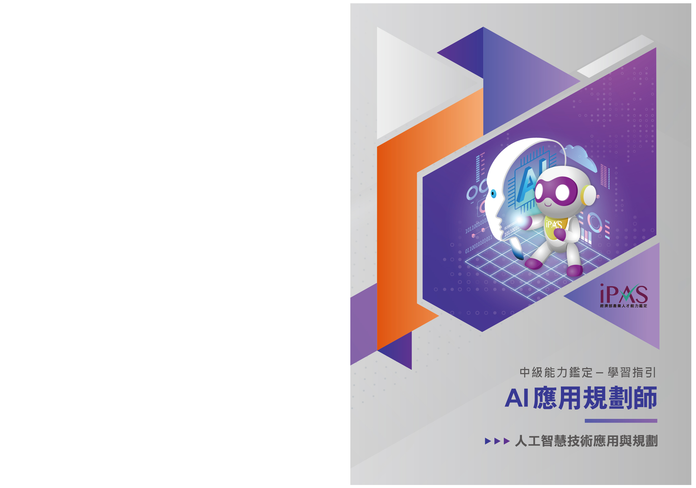

>  序 style="width:0.62667in;height:0.305in" />
>
> 為提供授課教師及考生掌握評鑑方向，準備有所依循，本計畫委

託委員會題庫組及規劃組領域專家，依據各科目評鑑內容進行重點說

明與考題解析。

> 本手冊為學習指引，旨在提供學習方向與準備參考，並非正式教

材或題庫，亦不保證考試通過之責，建議考生依循考試簡章所公告之

評鑑主題內容，進行充分準備以應試。

> 如有相關問題，請逕自聯繫 iPAS@itri.org.tw。
>
> 經濟部產業人才能力鑑定推動小組
>
> 敬啟
>
> 
> 目錄
>
>  style="width:0.92222in;height:0.22167in" /> style="width:2.30403in;height:0.22167in" />..............................................
> ***1-1***
>
>  style="width:0.92222in;height:0.22167in" /> style="width:1.15042in;height:0.22167in" />.................................................................
> ***2-1***
>
>  style="width:0.92222in;height:0.22167in" /> style="width:1.61431in;height:0.22167in" />**AI**
> .................................................... ***3-1***
>
> 3.1
> 自然語言處理技術與應用..........................................3-3
>
> 3.2 電腦視覺技術與應用
> ...............................................3-40
>
>  style="width:6.29667in;height:2.89667in" /> style="width:0.92444in;height:0.22167in" /> style="width:1.6143in;height:0.22167in" /> style="width:0.92444in;height:0.22167in" /> style="width:2.30403in;height:0.22167in" />3.3 生成式 AI
> 技術與應用.............................................3-59
>
> 3.4 多模態人工智慧應用
> ...............................................3-73
>
> **AI** .................................................... ***4-1***
>
> 4.1 **AI**
> 導入評估...............................................................4-3
>
> 4.2 **AI**
> 導入規劃.............................................................4-15
>
> 4.3 **AI**
> 風險管理.............................................................4-29
>
> **AI** ......................................... ***5-1***
>
> 5.1 數據準備與模型選擇
> .................................................5-2
>
> 5.2 **AI**
> 技術系統集成與部署..........................................5-14

> 經濟部為有效提升產業人才素質，近年來持續致力於專業人才培訓發展。為

了更明確產業對各類專業人才的能力需求，特別針對亟需人才的多項重點產業，

邀集產官學專家，發展產業職能基準，提供各界依其內涵辦理培訓課程及規劃能

力鑑定機制。

> 為完成特定職業（或職類）工作任務，所需具備的能力組合（知識、技能、

態度）。

> AI
>
>  style="width:1.15861in;height:1.17693in" /> style="width:0.88799in;height:0.91445in" />完整的「AI
> 應用規劃師」職能基準， 可自右方 QRcode 下載：
>
>  第一章 考試科目與評鑑內容 style="width:6.295in;height:2.89667in" /> style="width:0.4825in;height:0.15333in" /> style="width:0.80625in;height:0.15333in" /> style="width:0.80625in;height:0.15333in" /> style="width:3.13958in;height:0.305in" />
>
> 1-1
>
>  第一章 考試科目與評鑑內容 style="width:6.295in;height:2.89667in" /> style="width:0.4825in;height:0.15333in" /> style="width:0.80625in;height:0.15333in" /> style="width:0.80625in;height:0.15333in" />

1-2

>  第二章 考科內容 style="width:6.295in;height:2.89667in" /> style="width:1.56917in;height:0.305in" />
>
> 本指引將說明中級「AI 應用規劃師」科目一之考試內容，包含「人工智慧技

術應用與規劃」之評鑑主題「AI 相關技術應用」、「AI 導入評估規劃」與「AI
技

術應用與系統部署」，幫助考生掌握人工智慧技術應用知識概念，奠定未來應用與

規劃的堅實基石。此外，為強化學習成效，每章節將提供多樣化的練習評量，幫

助考生自我測試與檢視學習成果。

> 2-1
>
>  第三章 AI 相關技術應用
>
>  style="width:0.62667in;height:0.305in" /> style="width:0.62667in;height:0.305in" /> style="width:2.19764in;height:0.305in" />**AI**
>
> 面對當前 AI 技術的蓬勃發展，組織在導入人工智慧時常需要先理解各種核

心技術的特點、應用範疇與成熟度，再與業務需求進行對應與結合。因此，本章

AI 相關技術應用將從實務上常見的 AI 子領域切入，包括自然語言處理（Natural

Language Processing, NLP）、電腦視覺（Computer Vision, CV）、生成式
AI，以及

多模態 AI 等主題，說明它們各自在何種情境中能夠發揮關鍵價值。

**3.1** 自然語言處理技術與應用

>  style="width:6.295in;height:2.89667in" />自然語言處理是 AI
> 領域中最具挑戰性之一，旨在使機器能夠理解、解釋並生

成人類語言。隨著語音助理、聊天機器人及智慧客服等應用的普及，NLP 技術的

發展已經從簡單的語言分析進階到複雜的語意理解。此領域的技術涵蓋文本分類、

情感分析、命名實體辨識（Named Entity Recognition,
NER）、機器翻譯等，廣泛應

用於搜索引擎、情感分析、智慧客服、醫療診斷、法律文本分析等領域。NLP 的

核心價值在於能幫助企業處理大量文本資料，提取出有價值的資訊並進行智慧化

處理。

**3.2** 電腦視覺技術與應用

> 電腦視覺技術使得機器能夠“看懂”影像或影片，進而進行物體辨識、場景理

解及行為分析等工作。隨著智慧監控、無人駕駛及醫療影像診斷等應用的發展，

電腦視覺技術在各行各業中扮演著越來越重要的角色。常見的應用情境包括人臉

辨識、物品檢測、視覺定位、視覺導航等。透過強大的圖像辨識能力，可以幫助

企業自動化品質檢測、提升生產效率，並加速智慧城市建設與無人駕駛車輛的技

術成熟。

> 3-1
>
>  第三章 AI 相關技術應用
>
> **3.3** 生成式 **AI** 技術與應用
>
> 生成式 AI 是指能夠生成全新內容的技術，通常依靠深度學習模型，像是生成
>
> 對抗網路（Generative Adversarial Network, GAN）或自迴歸模型（如
> GPT-3），來
>
> 創建新的圖像、文本、音樂等資料。這一技術在藝術創作、內容生成、虛擬角色
>
> 創建、電子商務個性化推薦等領域展示了巨大的應用潛力。生成式 AI
> 能夠自動化
>
> 創意過程，並為企業帶來極高的效率，尤其是在內容創作和廣告設計等方面，為
>
> 市場行銷和品牌建設提供了無限可能。
>
> **3.4** 多模態人工智慧應用
>
>  style="width:6.295in;height:2.89667in" />多模態 AI
> 是一種綜合多種感知模式（如語音、圖像、影片等）的技術，目的
>
> 是讓 AI 能夠處理來自多種感知源的訊息並作出綜合判斷。這一領域的發展使得
>
> 機器能夠更加靈活地理解和處理複雜情境，如語音與圖像的協同分析、視覺問答、
>
> 情感辨識等。多模態 AI
> 在無人駕駛、智慧助理、虛擬實境（VR）和擴增實境（AR）
>
> 等領域中展現了極大的應用潛力，為企業提供更豐富的用戶體驗與互動方式。

3-2

>  第三章 AI 相關技術應用 style="width:0.53717in;height:0.47388in" /> style="width:0.6925in;height:0.22167in" />
>
>  style="width:2.76583in;height:0.22167in" />**3.1**

**1.**

> 隨著人工智慧（AI）技術的迅速發展，自然語言處理（Natural Language

Processing, NLP）已逐漸成為 AI 生態系統（AI Ecosystem）的核心之一。NLP
技

術賦予機器理解、處理並生成自然語言的能力，成為連接人類與機器溝通的重要

橋樑。從早期的規則式語言處理技術（Rule-based
Systems），到近年生成式 AI

（Generative AI）的崛起，NLP 持續拓展 AI 的應用範圍與技術邊界。

> 在 2022 年底，OpenAI 推出的 ChatGPT 以對話式 AI（Conversational AI）的

形式迅速吸引全球矚目。ChatGPT 展現出色的語言理解與生成能力，不僅顯著提

升機器與人類的溝通效率，更推動了各行業對 NLP 應用的探索與實踐。這波趨勢

已廣泛影響諸多領域，包括客戶服務、自動化助理、內容生成及數據分析等。企

業與組織之所以應高度重視 NLP，是因為自然語言數據的價值已逐漸超越傳統結

構化數據。透過 NLP 技術，企業能更精準地分析用戶意圖、洞察市場趨勢並提升

決策效率，進而促進整體商業價值的增長。

> 本節內容將聚焦於「自然語言處理（NLP）技術的基礎概念與實務應用」，介

紹 NLP 在現代 AI 應用中的關鍵角色。本節將從 NLP 的基本概念與前處理技術入

手，逐步探討核心技術模型，例如詞向量（Ｗord Embeddings）、深度學習模型以

及預訓練語言模型（BERT、GPT 等）。此外，我們將透過豐富的實務案例，展示

NLP 在文本分類、情感分析及對話系統等領域的應用方法與實施策略，並分析實

務應用中可能面臨的挑戰與風險，如數據隱私、模型偏見及語意理解的複雜性。

> 關於大數據收集、儲存及分析等與自然語言處理相關的數據處理技術，將在

《大數據處理分析與應用學習指引》的章節中詳細介紹；而自然語言相關的機器

學習（Machine Learning）與深度學習技術的深入說明，則將於《機器學習技術與

應用學習指引》的章節中進一步闡述。

> 3-3
>
>  第三章 AI 相關技術應用
>
>  style="width:1.95958in;height:0.18833in" />**2.** **NLP**
>
> （**1**）定義與範疇
>
> 自然語言處理（Natural Language Processing, NLP）是人工智慧（Artificial
>
> Intelligence,AI）領域中，使電腦能夠「理解、處理並產生」自然語言的一項核心
>
> 技術。NLP 的目標在於讓機器能像人類一樣參與語言溝通，從文字或語音中理解
>
> 意思進行互動，甚至產生新的語言內容，是推動人機溝通、自動化知識擷取與語
>
> 言智慧創作的關鍵基礎。
>
> NLP 涵蓋的技術範圍廣泛，從基本的文字處理（如分詞、斷句）、語意理解（如
>
> 情感分析、意圖辨識）、語音辨識與合成，到自動回應與內容生成，皆屬其應用範
>
>  style="width:6.295in;height:2.89667in" />疇。NLP
> 的核心目標可簡化為三個任務層次：
>
> A.
> 理解（Understand）：從語言中解析出語法結構與語意，辨識語者的意圖、情緒
>
> 與知識。
>
> B.
> 處理（Process）：將語言轉換為電腦可操作的結構，如特徵向量、語法樹、標
>
> 注格式等。
>
> C.
> 生成（Generate）：根據情境與目標，自動產出語句，呈現自然、流暢且具邏輯
>
> 的文字或語音。
>
> 為了更清楚掌握 NLP 的內部技術結構與功能模組，我們必須進一步釐清其中
>
> 兩個最常被提及、也是核心處理流程中的關鍵子領域：
>
> 自然語言理解（Natural Language Understanding,
> NLU）：專注於機器如何「理解」
>
> 人類語言的語法結構與語意邏輯，判讀使用者意圖或隱含情緒。
>
> 自然語言生成（Natural Language Generation,
> NLG）：專注於機器如何「產生」
>
> 自然語言，將數據、知識或邏輯轉換為人類可讀且自然流暢的語句。
>
> 這三者之間的關係可以理解為一個完整語言處理流程的分工結構，NLP 作為
>
> 總體框架，涵蓋所有語言技術；而 NLU 與 NLG
> 分別負責其中「理解」與「生成」
>
> 的兩端任務。舉例來說，當使用者對客服機器人輸入一句話時，系統會先透過
> NLU
>
> 理解語意與需求，接著再透過 NLG
> 產生一段恰當的自然語言回覆；這整體互動過
>
> 程，正是 NLP 技術的綜合運作。

3-4

>  第三章 AI 相關技術應用 style="width:0.4825in;height:0.15333in" /> style="width:0.80625in;height:0.15333in" /> style="width:0.4825in;height:0.15333in" /> style="width:0.80625in;height:0.15333in" />

（**2**）技術演進脈絡

> 自然語言處理（NLP）的發展歷程呈現出明確的技術世代演進脈絡，從早期
>
> 的規則式系統（Rule-based Systems）、統計語言模型（Statistical Language
> Models），
>
> 再到進入深度學習（Deep
> Learning）時代，最後迎來預訓練語言模型（Pre-trained
>
> Language
> Models）的主導潮流。每個技術階段的突破不僅提高了語言處理能力，
>
> 也徹底改變了模型設計的思維及應用場景的邊界。
>
> 以下整理 NLP 技術演進階段概覽：
>
> 3-5
>
>  第三章 AI 相關技術應用
>
> **A.** 第一階段：規則式方法（**1980s–1990s**）
>
> 階段描述/優勢：在這一階段，NLP 主要依賴語言學家與工程師手工編寫的語法
>
> 規則與詞彙辭典進行語言處理。這些規則清晰定義語言結構與語法關係，並且
>
> 能夠實現特定任務的語言處理。這一方法的優勢在於其高可解釋性，所有的處
>
> 理邏輯都能夠被清楚地追溯與理解，且能在特定領域提供穩定的結果。
>
> 解決的痛點：規則式方法解決了早期語言處理中，缺乏自動化且無法理解語意
>
> 的問題。它通過明確的語法規則來提供語言結構的處理邏輯，適用於一些簡單
>
> 且結構清晰的應用情境。
>
> 階段限制：這些系統完全依賴專家知識，當語言結構或語境發生變化時，這些
>
>  style="width:6.295in;height:2.89667in" />方法無法靈活應對。其擴展性差，無法處理語言中更複雜或多變的結構，並且
>
> 維護成本高，需持續更新與調整規則。
>
> 代表技術與模型：
>
> ELIZA：早期的對話式 AI 系統，通過關鍵詞比對進行簡單的對話模擬。ELIZA
>
> 能夠進行特定情境下的對話，但並不具備語意理解，無法處理複雜的語境。
>
> 專家系統（Expert System）：基於人工設計的規則進行推理，專注於特定領域
>
> 的知識處理。這些系統具備清晰的推理過程，但應用範圍狹窄，且隨著知識
>
> 領域的擴展，規則的維護和更新變得困難。
>
> **B.** 第二階段：統計語言模型（**1990s–2010s**）
>
> 階段描述/優勢：為突破規則式方法的限制，NLP 進入了以機率為基礎的統計建
>
> 模時期。在這一階段，研究者開始依靠大量語料來訓練機率模型，使機器能夠
>
> 根據詞彙出現的機率結構來理解語言。這一方法的優勢在於能夠自動學習語言
>
> 中的統計結構，並且能夠在大規模資料中找到語言的規律性，大幅提高了語言
>
> 處理的靈活性和可擴展性。
>
> 解決的痛點：統計語言模型突破了規則式方法的限制，解決了當語言結構或語
>
> 境發生變化時規則無法靈活應對的問題。這些模型能自動從語料中學習結構，
>
> 且能夠處理較大範圍的語言變化。

3-6

>  第三章 AI 相關技術應用

階段限制：儘管這些方法能夠自動學習語言結構，但其缺乏對語意的深度理解，

> 並且大多數統計模型仍依賴於大量標注資料，這使得其在資源較少的語料上表
>
> 現不佳。此外，這些模型往往無法捕捉長距離（長句子、長段落）的語言依賴
>
> 性，且對語言的深層語意理解仍有局限。

代表技術與模型：

> N-gram：統計語言模型中最基礎的形式，透過計算詞彙之間的共現機率，以
>
> 預測語言結構。N-gram 模型能夠捕捉相鄰詞彙之間的關係，但隨著 n 值的增
>
> 大，模型需要大量數據來訓練，並且在語境較長的情況下表現不佳。
>
> 隱馬可夫模型（Hidden Markov Model, HMM）：一種基於機率的統計模型，
>
>  style="width:6.295in;height:2.89667in" />廣泛應用於語音辨識、詞性標注等任務，能夠根據觀察到的詞彙序列來推測
>
> 隱藏狀態。
>
> 條件隨機場（Conditional Random Field, CRF）：一種基於機率的圖形模型，
>
> 用於處理序列標注任務，並廣泛應用於命名實體辨識（NER）等領域標注。
>
> CRF 能夠有效處理詞彙之間的依賴關係。

**C.** 第三階段：深度學習時代（**2010s**）

階段描述/優勢：進入深度學習時代後，NLP 開始廣泛應用神經網路來處理語言

> 序列資料。深度學習方法使用更複雜的神經網路結構，如循環神經網路
>
> （Recurrent Neural Network, RNN）、長短期記憶網路（Long Short-Term
> Memory,
>
> LSTM）和門控循環單元（Gated Recurrent Unit,
> GRU），這些模型能夠有效捕捉
>
> 語言中長距離的依賴關係。與傳統統計方法相比，深度學習模型能夠學習語言
>
> 的更深層次結構，並且具有較強的特徵提取能力。

解決的痛點：這一階段的深度學習方法解決了統計語言模型中無法有效捕捉長

> 距離依賴關係的問題。RNN 及其變體（LSTM、GRU）能夠記住更長時間範圍
>
> 內的資訊，有效地理解語言的上下文結構，並且不再依賴人工設計的特徵。

階段限制：儘管深度學習方法在捕捉語言結構上表現優異，但這些模型的訓練

> 需要大量的計算資源和數據，並且難以並行處理。此階段的模型通常較為複雜，
>
> 3-7
>
>  第三章 AI 相關技術應用
>
> 且訓練時間長，對於較小資料集或資源有限的應用情境來說，可能無法提供有
>
> 效的支持。
>
> 代表技術與模型：
>
> RNN：循環神經網路是一種特殊的神經網路架構，能夠處理序列數據，對於
>
> 語言序列中的長期依賴關係具有良好的建模能力。然而，RNN 在處理長序列
>
> 時，容易遇到梯度消失問題，從而影響其效果。
>
> LSTM：長短期記憶網路是一種改良型的 RNN，能夠有效解決 RNN 的梯度
>
> 消失問題，並且能夠捕捉更長距離的依賴關係。LSTM 在機器翻譯、語音辨
>
> 識等任務中取得了重要突破。
>
>  style="width:6.295in;height:2.89667in" />GRU：門控循環單元是 LSTM
> 的簡化版本，它具有與 LSTM 類似的優勢，但
>
> 結構更簡單，且在計算上更為高效。
>
> **D.** 第四階段：預訓練語言模型（**2018–**至今）
>
> 階段描述/優勢：2017 年，Transformer 架構的提出徹底改變了 NLP
> 的技術發展
>
> 路徑。Transformer 架構摒棄了傳統的序列遞迴結構，轉而採用了自注意力機制
>
> （Self-Attention），使得每個詞在處理時能夠考慮到整個輸入序列中的所有其他
>
> 詞，從而實現了全局語境的建模。這一架構的出現解決了「長距離依賴問題」，
>
> 並且能夠在多層結構中並行處理數據，顯著提高了計算效率和處理能力。
>
> 基於 Transformer 的預訓練語言模型，如 BERT、GPT、RoBERTa、T5，不再僅
>
> 限於解決單一任務，而是先在大規模語料庫上進行預訓練，再進行微調（Fine-
>
> tuning）以適應特定的下游任務。這使得模型在處理少量標注資料的情況下，仍
>
> 能表現優異，並且大大降低了開發與訓練的門檻。
>
> 解決的痛點：預訓練語言模型解決了基於手工設計特徵的語言處理問題，並能
>
> 夠在多樣化的語言任務中進行有效的遷移學習。自注意力機制的引入使得模型
>
> 能夠同時關注序列中的所有元素，克服了 RNN 和 LSTM 模型在長距離依賴建
>
> 模中的局限性。
>
> 階段限制：雖然這些模型在語言理解上取得了顯著突破，但其運行時對計算資

3-8

>  第三章 AI 相關技術應用
>
> 源的需求極高，且由於模型規模龐大，推理過程中的效率仍然是挑戰。這些預
>
> 訓練模型通常需要大量的儲存空間與高效能運算基礎設施來支援其運作。

代表技術與模型：

> Transformer：Transformer
> 架構的核心是自注意力機制（Self-Attention），該機
>
> 制允許模型在處理每個詞時，考慮到序列中所有其他詞的影響，實現了長距
>
> 離依賴關係的建模，並且能夠大幅度提升訓練過程的並行性，從而加速了訓
>
> 練效率。
>
> BERT：BERT 是第一個基於 Transformer 架構的雙向預訓練模型，利用遮蔽
>
> 語言建模（Masked Language Model, MLM）進行預訓練，並能夠進行雙向上
>
>  style="width:6.295in;height:2.89667in" />下文的理解，顯著提升語言理解的精準度。
>
> GPT：GPT 使用自迴歸生成方式，強調文本生成能力，並且在對話式 AI、文
>
> 本生成等任務中表現卓越。GPT 系統使用的是單向預訓練，適用於生成型任
>
> 務。
>
> RoBERTa / T5 / PaLM：這些模型對 Transformer 架構進行了進一步優化，透
>
> 過更大規模的預訓練、更精細的調效策略以及更強大的硬體支援，使得生成
>
> 式 AI 在各種自然語言處理任務中達到更高的效能。
>
> 掌握 NLP 技術的發展脈絡、有助於理解不同模型所依賴的理論基礎與應用領

域。每一階段的突破，都是對語言結構理解深度的逐步提升，而預訓練語言模型

的出現，使 NLP 技術從過去專注於特定任務、且高度依賴大量資料的應用，發展

為具更高普遍性、泛化性與可擴展性的語言理解能力。

> 接下來的章節中，將進一步介紹這些關鍵技術，包括詞嵌入（Word

Embeddings）、深度神經網路架構（如
Transformer），以及各類預訓練模型的設計

與實際應用，以深入理解 NLP 的發展與未來趨勢。

**3.** **NLP**

> 在進行任何 NLP 任務之前，高品質的資料前處理是不可或缺的一個環節。無

論是分類、翻譯、對話生成或情感分析，前處理的好壞都將直接影響模型訓練的

> 3-9
>
>  第三章 AI 相關技術應用 style="width:6.295in;height:2.89667in" /> style="width:0.80625in;height:0.15333in" /> style="width:0.4825in;height:0.15333in" /> style="width:1.2899in;height:0.15333in" />
>
> 品質、計算效率與最終成效。
>
> 自然語言資料與其他類型資料最大的不同在於其非結構化性、語意模糊與語
>
> 境多變。一個錯誤的標注、未處理的雜訊或缺乏上下文資訊的斷詞，都可能導致
>
> 後續模型偏差或語意混淆。有效的前處理策略不僅提升效能，也能顯著降低模型
>
> 訓練成本，是 NLP 項目成功與否的第一道防線。
>
> 因此，資料在餵入模型之前，必須先經過一系列清理、轉換與標準化的處理，
>
> 以便機器能有效理解與運算。以下是 NLP
> 前處理常見技術，在實務應用中，依任
>
> 務需求、這些步驟常以不同順序或深度搭配執行。
>
> （**1**）分詞（**Tokenization**）：
>
> 文字處理的起點，其精準與否直接影響後續每個處理階段。針對中文、日文
>
> 等無空白語言，通常需要斷詞字典或模型輔助切詞，處理難度也相對提升。
>
> 示例：中文句子「我愛自然語言處理」，分詞後會得到「我」「愛」「自然語言
>
> 處理」，這樣每個詞彙都可以作為獨立單位進行後續處理。若分詞方式錯誤（如將
>
> 「自然語言處理」切成「自然」「語言」「處理」），後續的語法分析和語意分析將
>
> 會受到影響。

3-10

>  第三章 AI 相關技術應用

（**2**）詞性標注（**POS** **Tagging**）：

> 為連接基礎語法與高階語意分析的橋樑。許多應用（如命名實體辨識、關係
>
> 抽取）都依賴詞性來辨識重要語彙與結構，因此 POS
> 標注在實務模型中經常作為
>
> 特徵工程的一部分。
>
> 示例：句子「小明昨天去北京旅行」中，詞性標注可以將「小明」標注為名
>
> 詞（NN），「昨天」標注為副詞（RB），「去」標注為動詞（VB），「北京」標注為
>
> 地名（NNP），「旅行」標注為名詞（NN）。這些詞性標注有助於辨識句子結構並加
>
> 強後續分析或應用（如應用於命名實體辨識（NER））。

（**3**）詞形還原（**Lemmatization**）與詞幹提取（**Stemming**）：

> 兩者都是「文字正規化（Normalization）」的一環，但方法不同。
>
> **A.** 詞形還原（**Lemmatization**）
>
> 仰賴語法規則與字典，語意保留較佳，適合語意分析、問答系統等任務。
>
> 示例：對於單詞「running」，詞形還原會將其還原為「run」，保留語意一致性，
>
> 並且這個詞形能夠反映出該詞的基本形式。
>
> **B.** 詞幹提取（**Stemming**）
>
> 使用字首字尾裁剪等簡單規則，速度快但結果不一定為有效單字，常見於需
>
> 要快速處理的大規模語料中。
>
> 示例：對於單詞「running」，詞幹提取可能會將其裁剪為「run」，但對於單詞
>
> 「happiness」，它可能被裁剪為「happi」，這樣的結果雖然能夠加速處理，但會失
>
> 去語法結構中的一部分語意。
>
> **C.** 停用詞移除（**Stopword** **Removal**）：
>
> 資訊檢索與主題建模任務中非常常見的步驟，目的是排除對分類與語意貢獻
>
> 較小的高頻詞，以凸顯核心詞彙。然而，在對話生成、語法分析等應用中，有時
>
> 3-11
>
>  第三章 AI 相關技術應用 style="width:0.80625in;height:0.15333in" /> style="width:0.80625in;height:0.15333in" /> style="width:0.80625in;height:0.15333in" /> style="width:0.80625in;height:0.15333in" /> style="width:0.4825in;height:0.15333in" /> style="width:0.4825in;height:0.15333in" />
>
> 仍需保留這些詞，以維持語句完整性與語氣自然流暢。
>
> 示例：在句子「我在學習人工智慧」中，停用詞可能會移除「在」和「我」，
>
> 只保留「學習」、「人工智慧」，從而降低資料維度並提升關鍵詞比重。然而，在對
>
> 話生成的情境中，若去掉「我」或「在」會使句子不自然，失去語境的完整性。
>
>  style="width:1.95958in;height:0.18833in" />**4.** **NLP**
>
> （**1**）**NLP** 關鍵技術發展
>
> 當完成分詞、詞性標注、詞形還原等前處理步驟後，雖然語料已具備基本的
>
> 結構，但仍無法直接被模型理解（大多數模型與演算法無法直接處理文字或句子，
>
>  style="width:6.295in;height:2.89667in" />只能運算數字）。因此，在進入任何模型（如分類器、翻譯系統、生成器）之前，
>
> 文字必須先轉換為向量（Vector）或張量（Tensor）的形式，這個過程稱為「詞彙
>
> 向量化」（Word Vectorization）或「文字表示學習」（Representation
> Learning）。
>
> 詞彙向量化能將語言中的單詞或句子轉換為數字，這樣機器學習模型才能對
>
> 其進行計算與處理。文字與語意之間的關聯會被轉化為數字型態，這不僅是資料
>
> 格式上的處理，更是讓模型能夠理解語言上下文與語意的關鍵。換句話說，向量
>
> 的品質將直接影響模型在理解文本、分類、生成語句等任務中的表現。
>
> 文字表示技術從早期的統計方法（如：tf-idf），逐步演進至分布式向量（如：
>
> Word2Vec），再發展到上下文敏感的動態詞向量（如：BERT
> Embeddings），每個
>
> 階段都在試圖讓「詞的數學表示」更貼近語言的真實語意。以下表格提供 NLP
> 技
>
> 術的比較概覽：

3-12

>  第三章 AI 相關技術應用
>
>  style="width:6.295in;height:2.89667in" /> style="width:0.80625in;height:0.15333in" /> style="width:0.80625in;height:0.15333in" /> style="width:0.80625in;height:0.15333in" /> style="width:0.80625in;height:0.15333in" /> style="width:0.4825in;height:0.15333in" /> style="width:0.4825in;height:0.15333in" />在自然語言處理中，詞彙的表示是讓機器理解語言的關鍵步驟。以下先對「語

境型表示」、「分布式」和「詞嵌入」這些術語進行說明：

**A.** 語境型表示與非語境型表示

> 這兩個術語描述的是「詞彙的表示如何隨上下文（語境）進行變化」。

語境型表示（Contextual
Representation）：語境型表示指的是詞彙的向量會根據

> 其所在句子或語境的不同而動態改變。這意味著，詞彙的語意並非固定的，而
>
> 是會依照上下文進行調整。語境型表示能有效解決多義詞問題，即同一詞在不
>
> 同語境中有不同的意義，並且能夠捕捉語境依賴性。例如，BERT 和 ELMo 等
>
> 模型會根據句子的上下文來生成每個詞的向量，使得相同的詞在不同語境中能
>
> 有不同的表示。示例如：
>
> 句子「I went to the **bank** to deposit money.」中，bank
> 的向量表示為金融機構。
>
> 句子「The **bank** of the river was high.」中，bank
> 的向量表示為河岸。
>
> 3-13
>
>  第三章 AI 相關技術應用
>
> 非語境型表示（Non-contextual
> Representation）：非語境型表示是指每個詞彙的
>
> 向量在所有語境中保持不變，無論該詞的上下文如何變化。這些方法忽略了語
>
> 境，無法捕捉詞彙的語意變化，因此無法處理同詞異義或多義詞問題。像
>
> Word2Vec 和 GloVe 等詞嵌入方法就是非語境型表示的典型應用。這些方法會
>
> 為每個詞彙生成一個固定的向量，並不考慮語境的影響。示例如：
>
> 在 Word2Vec 模型中，無論"bank"是指金融機構還是河岸，bank 的向量都是
>
> 相同的。
>
> **B.** 分布式表示與非分布式表示
>
>  style="width:6.295in;height:2.89667in" />分布式表示（Distributed
> Representation）:「分布式」指的是每個詞的向量表示
>
> 並非孤立存在的，而是根據語料庫中其他詞彙的關聯進行學習。在此方法下，
>
> 詞彙的語意是透過它們之間的相對位置來表示，語意相近的詞會被映射到向量
>
> 空間中的相近位置。使得語意相似的詞彙能夠進行有效的比較和運算，並捕捉
>
> 語意上的關聯。示例如：
>
> Word2Vec 會學習語料庫中詞彙之間的語境關係。以句子「The dog is
> running」
>
> 和「The cat is sleeping」為例。"dog"和"cat"都會與"is", "running",
> "sleeping"
>
> 這樣的詞彙出現。在這樣的上下文中，"dog"和"cat"出現的語境是相似的，因
>
> 此它們在向量空間中的位置會比較接近。
>
> 非分布式表示（Non-distributed
> Representation）：非分布式表示方法則是將每個
>
> 詞彙映射到一個獨立的、固定的向量。這些向量無法表達詞彙之間的語意關聯，
>
> 無法進行語意推理。最典型的應用就是 One-hot Encoding，每個詞彙都被表示
>
> 為一個高維度的向量，其中只有對應的詞位為 1，其餘位置為 0。這種表示方法
>
> 的缺點是無法捕捉語意上的相似性，也無法處理詞彙之間的關聯。
>
> **C.** 詞嵌入（**Word** **Embedding**）
>
> 詞嵌入是一種將每個詞彙轉換為數字向量的技術，這些向量包含了詞彙的語
>
> 意資訊。詞嵌入的目的在於將詞彙轉換為數值向量，使其能被機器學習模型接收，

3-14

>  第三章 AI 相關技術應用

進行計算與處理。詞嵌入方法通常是基於語料庫中的詞彙共現關係來學習詞彙的

向量，因此能夠使語意相近的詞在向量空間中相對接近語意。示例：

在 Word2Vec 中，詞彙的向量是基於語境中詞彙的共現關係學習的。像"dog"和

> "cat"這樣語意相近的詞會被映射到向量空間中相近的位置，這是 Word2Vec 能
>
> 捕捉語意相似性的原因。
>
> 接著，針對表格中提及之相關 NLP 技術進行介紹與說明：

One-hot Encoding：是最基本的詞彙表示方法之一。它將每個詞彙表示為一個高

> 維度向量，在這個向量中，只有與該詞對應的位置為 1，其餘位置為 0。例如，
>
> 如果語料庫中有 1000 個詞，則每個詞會被表示為一個 1000 維的向量，這個向
>
>  style="width:6.295in;height:2.89667in" />量中只有一個位置為
> 1，表示該詞，其他位置均為 0。
>
> 特點：
>
> 向量中的每個位置對應語料庫中的一個詞，且只有一個詞的位置為 1，這
>
> 意味著向量稀疏。
>
> 無法捕捉詞彙之間的語意關聯，詞彙之間是互不關聯的。
>
> 不考慮詞彙的順序或上下文資訊。
>
> 優點：
>
> 結構簡單，易於理解。
>
> 適用於簡單的文本分類和語言模型中。
>
> 實作簡單，計算量小。
>
> 限制：
>
> 向量維度高，對於大規模詞彙表，向量會非常稀疏。
>
> 無法處理詞彙之間的語意關聯和語境差異。
>
> 不考慮詞彙順序，難以捕捉語言的語法結構。
>
> 示例：
>
> 假設語料庫中有三個詞：\["dog", "cat", "fish"\]：
>
> "dog"對應的 One-hot 向量為\[1, 0, 0\]
>
> "cat"對應的 One-hot 向量為\[0, 1, 0\]
>
> 3-15
>
>  第三章 AI 相關技術應用
>
> "fish"對應的 One-hot 向量為\[0, 0, 1\]
>
> Bag of Words（BoW）：是另一種常見的文本表示方法，它將文本視為一組單獨
>
> 的詞彙，不考慮詞彙的順序和語法結構。BoW 會計算每個詞在文件中的出現次
>
> 數，並以此作為特徵表示。BoW 生成的每個文件會對應一個詞頻向量，其中每
>
> 個元素代表語料庫中某個詞彙在該文件中的出現次數。
>
> 特點：
>
> 忽略詞彙順序，只關心每個詞彙出現的頻率。
>
> 每個文件對應一個固定大小的向量，這個向量的維度是語料庫中所有詞彙
>
> 的數量。
>
>  style="width:6.295in;height:2.89667in" />簡單易實作，適合文本分類和主題建模等任務。
>
> 優點：
>
> 能捕捉詞彙的出現頻率，對於詞彙出現的模式有很好的表現。
>
> 易於理解和實現，且適用於大部分文本處理任務。
>
> 結構簡單，計算效率高。
>
> 限制：
>
> 不考慮詞彙的語意關聯，不能處理同義詞和語境變化。
>
> 忽略語法結構和上下文資訊，對於詞序資訊缺乏敏感度。
>
> 對於詞彙量大的語料庫，向量維度可能會非常大，導致維度爆炸。
>
> 示例：
>
> 假設語料庫中有三個詞：\["dog", "cat", "fish"\]，兩個文件分別為：
>
> ○ 文件 1 "dog dog cat"
>
> ○ 文件 2 "cat fish fish"
>
> 文件 1 的 BoW 向量為
>
> ○ \[2, 1, 0\]（"dog"出現 2 次，"cat"出現 1 次，"fish"沒有出現）
>
> 文件 2 的 BoW 向量為
>
> ○ \[0, 1, 2\]（"dog"沒有出現，"cat"出現 1 次，"fish"出現 2 次）

3-16

>  第三章 AI 相關技術應用

tf-idf（Term Frequency–Inverse Document Frequency）：tf-idf
是一種統計方法，

> 通過「詞在單一文件中的出現頻率（tf）」與「該詞在整體語料庫中的罕見程度
>
> （idf）」結合，來衡量一個詞彙對於文本的資訊價值。tf-idf
> 不僅能強調文本中
>
> 的關鍵詞，還能忽略掉過於頻繁或過於常見的無意義詞。
>
> 原理：
>
> 變數
>
> ○ t：目標詞（term），指欲計算權重的詞彙
>
> ○ d：單一文件（document），指某一篇文本資料
>
> ○ D：文件集合（document corpus），即整體語料庫中所有文件的集合
>
>  style="width:6.295in;height:2.89667in" />詞頻（TF, Term
> Frequency）：衡量某個詞在單一文件中的重要性。
>
> TF(t, d)=詞語 *t* 在文檔 *d* 中的出現次數 d
>
> 逆文件頻率（IDF, Inverse Document Frequency）：衡量該詞在整體語料庫
>
> 中的稀有程度。
>
> IDF(*t,* *D*)=log(\|{*d* ϵ *D* : *t* ϵ *d*}\|)
>
> tf-idf：tf-idf 是 TF 和 IDF
> 的乘積，用來綜合考量詞彙在單一文件中的頻繁
>
> 程度和它在語料庫中的稀有程度。
>
> tf-idf(*t,* *d,* *D*) = TF(*t,* *d*) × IDF(*t,* *D*)
>
> 優點：
>
> 實作簡單且易於理解。
>
> 能夠強調重要的詞語，減少常見無關詞的影響。
>
> 在文件檢索和簡單文本分類中效果良好。
>
> 限制：
>
> 無法捕捉詞彙間的語意關聯，對於語境變化敏感性差。
>
> 對於多義詞問題處理不足，無法區分同一詞在不同上下文中的語意。
>
> 3-17
>
>  第三章 AI 相關技術應用
>
> 示例：
>
> 變數：
>
> ○ 語料庫中有 1000 篇文件（D = 1000）
>
> ○ 詞彙"AI"只出現在 10 篇文件中
>
> ○ 某文件（d）總共有 100 個詞
>
> ○ 某文件（d）中詞彙"AI"出現 3 次
>
> 計算該文件（d）之 tf-idf：
>
> TF(*"AI",* *d*) = 100 = 0.03
>
>  style="width:6.295in;height:2.89667in" />IDF(*"AI",* *D*) =
> log(1000)=log(100)≈ 2
>
> tf-idf(*"AI",d,* *D*) = 0.03×2=0.06
>
> N-grams：是將語言中的「連續 N
> 個詞、組合成一個特徵單位」，用來保留詞彙
>
> 的序列與語法結構。N-grams 的大小（即 N 的值）決定了模型能捕捉到的上下
>
> 文範圍，較大的 N 值能夠保留更長距離的語境資訊，但也會引入更多的特徵。
>
> 原理：N-grams 的核心並不是透過數學公式計算數值，而是透過切分方式產生
>
> 連續的 n 個詞（或字）組成的語言片段。雖然它不像 TF-IDF 那樣有明確的數
>
> 學公式，但仍可用函數表示法與舉例來形式化說明。以下為常見表達方式：
>
> 給定一個詞序列
>
> *S* = (ω*1*, ω*2*, …, ωm) N-grams 可表示為
>
> N-grams(*S*, *n*) = {(ωi, ωi+1, …, ωi+n-1)｜1 ≤ *i* ≤ *m* - *n* + 1}
>
> 優點：
>
> 能夠保留詞彙順序和語法結構，對於需要短期語境依賴的任務尤為有效。
>
> 可以保留詞彙之間的相對位置關係，對於簡單語言模型非常有用。
>
> 限制：
>
> 當 N 值過大時，維度會急劇增加，導致特徵數量膨脹，可能出現稀疏性問
>
> 題。

3-18

>  第三章 AI 相關技術應用
>
> 無法長期捕捉文本中的上下文關聯，且對長句子結構的理解有限。
>
> 示例：
>
> 詞序列：S=\[I, love, machine, learning\]
>
> Bi-grams（S, 2）={（I, love）,（love, machine）,（machine,
> learning）}
>
> Tri-grams（S, 3）={（I, love, machine）,（love, machine, learning）}

分布式詞嵌入（Distributed Word Embedding）

> 分布式詞嵌入是通過語料庫來學習詞彙之間的語意關聯，將語意相近的詞彙映
>
> 射到向量空間中相近的位置。這些方法的核心理念是「語言的語意是分布式
>
> 的」，即詞彙的含義是依據其與其他詞彙的共現關係所確定。分布式詞嵌入的目
>
>  style="width:6.295in;height:2.89667in" />的是將每個詞轉換為一個向量，這些向量能夠反映詞彙之間的語意相似性，使
>
> 得語意相近的詞彙在向量空間中相互接近。
>
> 這些方法通常基於神經網路模型或矩陣分解技術來進行訓練，常見的模型有
>
> Word2Vec、GloVe 和 FastText，每個模型的訓練方式有所不同，但基本目標相
>
> 同：學習詞彙的分布式向量表示。
>
> 優點
>
> 語意結構保留：分布式詞嵌入能夠有效捕捉語言中的語意結構和語法關
>
> 係，這使得它們在很多下游任務中表現優異，如文本分類、情感分析、機
>
> 器翻譯等。
>
> 向量可進行數學運算：由於每個詞被表示為一個向量，這些向量可以進行
>
> 數學運算，並且能夠進行語意邏輯推理。例如，Word2Vec 中的「king - man
>
> \+ woman ≈ queen」，展示了語意的邏輯推理能力。
>
> 能夠處理語意相近詞：這些方法能將語意相近的詞彙映射到相似的向量空
>
> 間中，從而捕捉到詞語之間的語意關聯。
>
> 處理大規模語料的能力強：這些方法可以在大量的文本語料上進行訓練，
>
> 並能有效學習詞彙之間的語意關係。語意特別是 Word2Vec 和 FastText 在
>
> 訓練效率與可擴展性方面表現優異。
>
> 3-19
>
>  第三章 AI 相關技術應用
>
> 限制
>
> 靜態詞向量：這些模型生成的是靜態的詞向量，即每個詞在所有語境中都
>
> 有一個固定的向量表示。這意味著它們無法處理語境的變化。例如，
>
> Word2Vec 和 GloVe 無法區分 「bank」在不同語境中的意圖（如金融機構
>
> vs.河岸）。
>
> 無法處理多義詞：由於詞向量是靜態的，這些模型無法有效處理同詞異義
>
> 的情況。
>
> 對低頻詞的表現較差：儘 FastText 改進了對 OOV（Out-of-Vocabulary）詞
>
> 彙的處理，但對於訓練語料中較少出現的低頻詞，這些方法的表現仍然會
>
>  style="width:6.295in;height:2.89667in" />受到一定限制。
>
> 高維度與稀疏問題：某些方法，特別是 GloVe，會生成較高維度的詞向量，
>
> 在某些情況下可能會面臨維度過高或數據稀疏的問題。
>
> Word2Vec：
>
> Word2Vec 是由 Google 團隊於 2013 年提出的詞嵌入演算法，目的是將單詞
>
> 轉換為具有語意意義的向量。透過神經網路模型訓練，每個詞會被表示成一
>
> 個實數向量，向量間的空間關係反映了詞彙的語意關係。
>
> Word2Vec 是基於神經網路的詞嵌入方法，有兩種主要架構、通過 CBOW
>
> （Continuous Bag of Words）和 Skip-gram 兩種模型來學習詞彙和上下文之間
>
> 的關係：
>
> CBOW（Continuous Bag of Words）：
>
> ○ 以給定上下文（周圍詞彙）來預測中心詞。
>
> ○ 訓練速度較快，適合小型語料。
>
> ○ 示例：假設有句子「The cat sits on the
> mat」，如果我們選擇「sits」作為
>
> 中心詞，那麼上下文就是「The」、「cat」、「on」、「the」、「mat」。CBOW
>
> 模型的目標是根據這些上下文詞彙來預測中心詞"sits"。
>
> 上下文（Context）：The, cat, on, the, mat
>
> 預測中心詞（Center Word）：sits

3-20

>  第三章 AI 相關技術應用
>
> Skip-gram：
>
> ○ 以給定中心詞，預測其周圍的上下文詞彙。
>
> ○ 對低頻詞更有效，語意捕捉能力更好。
>
> ○ 示例：如果中心詞是「sits」，Skip-gram 模型會利用「sits」來預測它周
>
> 圍的上下文詞，如「The」、「cat」、「on」、「the」、「mat」。
>
> 示例：
>
> ○ Word2Ve
> 經訓練後會將「國王（king）」、「男人（man）」、「女人（woman）」
>
> 與「女王（queen）」等詞語嵌入於同一個語意向量空間中。在這個空間
>
> 中，詞與詞之間的向量差異可反映語意邏輯，例如：「king - man + woman
>
>  style="width:6.295in;height:2.89667in" />≈ queen」，這展現了 Word2Vec
> 的語意推理能力，並可應用於類比判斷
>
> 與相似詞推論任務中。
>
> GloVe（Global Vectors for Word Representation）
>
> GloVe 是一種將詞彙嵌入為向量的方法，由史丹佛大學的 NLP 團隊於 2014
>
> 年所提出。結合了統計共現資訊與詞嵌入學習的特性，用來學習每個詞的「靜
>
> 態向量表示」。GloVe 是依賴於局部上下文（像是 Word2Vec 的 Skip-gram），
>
> 而是利用整體語料庫中詞與詞共現的統計資料（共現矩陣），透過矩陣分解的
>
> 方式來學習每個詞的向量。
>
> 示例：
>
> ○
> 假設在語料庫中，「king（國王）」經常與「throne（王座）」、「royal（皇
>
> 室）」等詞共同出現；而「queen（女王）」也與「throne（王座）」、「royal
>
> （皇室）」這些詞高度共現。GloV 會透過這些詞對的共現資訊，將「king」
>
> 與「queen」在向量空間中的位置學習為接近，因為它們在語料中的「共
>
> 現上下文」相似，進而捕捉到語意上的對等關係。
>
> FastText：
>
> FastText 是由 Facebook AI Research（FAIR）團隊於 2016 年提出的詞嵌入技
>
> 術，其核心概念是將每個詞視為子詞（subwords）組成的集合，進行向量表
>
> 3-21
>
>  第三章 AI 相關技術應用
>
> 示 學 習 。 這 種 方 法 讓 模 型 能 夠 處 理 從 未 見 過 的 新 詞 （
> OOV, Out-of-
>
> Vocabulary），具備更強的泛化能力。
>
> 原理：
>
> ○ FastText 將每個詞切割成 n-gram 子詞（例如"playing" → "pla", "lay",
>
> "ayi", "yin", "ing"），然後學習每個子詞的向量表示，最後將所有子詞向
>
> 量加總或平均，作為整個詞的向量。（常用 n-gram：3 到 6 字母）
>
> 示例：
>
> ○ 「unhappiness」→ \<un, unh, hap, app, ppi, pin, ine, nes, ess\>
>
> ○
> 若模型未見過「nationalization」，但學過「nation」、「-al」、「-ization」等
>
>  style="width:6.295in;height:2.89667in" />子詞，FastText
> 便能透過子詞向量進行加總，生成該新詞的向量，使其
>
> 語意與原始詞根「nation」相關。
>
> 語境型詞嵌入（Contextualized Word Embeddings）
>
> 語境型詞嵌入是近年自然語言處理領域的重要突破，突破傳統「每個詞只有一
>
> 個固定向量」的限制。它的核心概念是：詞的語意會根據其所處的上下文語境
>
> 而改變，因此詞向量也應隨語境而動態變化。
>
> 這種技術允許模型處理多義詞（如 bank 可指銀行或河岸）、語意歧義、語境轉
>
> 折等複雜語言現象，在問答系統、對話生成、情感分析、摘要、命名實體辨識
>
> 等任務中都有顯著提升效果。
>
> 常見的語境型詞嵌入技術包括 ELMo、BERT、GPT 等，通常建立在深度語言模
>
> 型（如 LSTM 或 Transformer）之上，並透過大規模語料進行預訓練。
>
> 優點：
>
> 語境感知能力強：詞向量會根據語境動態生成，可解決多義詞與語意變化
>
> 問題。
>
> 任務效果優異：在命名實體辨識、閱讀理解、機器翻譯等多種 NLP 任務中
>
> 表現領先。
>
> 支援遷移學習：預訓練模型可微調於不同任務中，節省標注資料與訓練資
>
> 源。

3-22

>  第三章 AI 相關技術應用
>
> 豐富語意建模能力：可處理語意一致性、語境推理、代詞消歧等高階語言
>
> 任務。
>
> 限制
>
> 模型硬體與資源需求高：如 BERT、GPT 模型需大量 GPU/TPU 資源。
>
> 訓練成本高：預訓練階段資料量龐大，需耗費大量時間與資源。
>
> 部分模型存在語言單向限制：例如 GPT 僅使用前文，可能導致語言理解
>
> 受限。
>
> ELMo（Embeddings from Language Models）：ELMo 是由 AllenNLP 團隊於
>
> 2018 年提出的語境型詞嵌入方法，基於雙向 LSTM（BiLSTM）語言模型，
>
>  style="width:6.295in;height:2.89667in" />從語料中學習語境敏感的詞向量表示。ELMo
> 不僅考慮詞彙本身，亦將其所
>
> 在句子的語法與語意結構納入詞向量生成過程。
>
> 技術基礎：BiLSTM 語言模型。
>
> 特點：可整合進現有模型中，增強語意表示能力。
>
> 應用：適合用於語法分析、情感分類、命名實體辨識等任務。
>
> 示例：在「The bank approved the loan」句子中，ELMo
> 會根據「approved」、
>
> 「loan」等上下文，推斷「bank」指「金融機構」，而非「河岸」。
>
> BERT（Bidirectional Encoder Representations from Transformers）：由
> Google
>
> 於 2018 年推出的革命性模型，採用雙向 Transformer 編碼器，並以遮蔽語言
>
> 模型（Masked Language Model, MLM）與句子關聯預測作為預訓練任務。
>
> 技術基礎：雙向 Transformer 編碼器。
>
> 特點：可同時理解上下文，對各類應用任務具有廣泛支援性。
>
> 應用：問答系統、資訊擷取、分類、命名實體辨識等。
>
> 示例：BERT 可辨別「He sat on the river bank」與「She went to the bank
> to
>
> withdraw cash」中「bank」的不同語意，產出對應語境的向量。
>
> GPT（Generative Pre-trained Transformer）：由 OpenAI
> 所研發，是以自迴歸預
>
> 測（Autoregressive
> Prediction）為核心的生成模型，專長於文字生成、對話生
>
> 成與續寫任務，近年已廣泛應用於 ChatGPT 等生成 AI 系統。
>
> 3-23
>
>  第三章 AI 相關技術應用 style="width:0.4825in;height:0.15333in" /> style="width:0.4825in;height:0.15333in" /> style="width:0.4825in;height:0.15333in" /> style="width:0.4825in;height:0.15333in" />
>
> 技術基礎：單向 Transformer（自迴歸語言模型）。
>
> 特點：可搭配提示詞（Prompt）進行生成任務，支援 Few-shot / Zero-shot
>
> 等應用方式。
>
> 應用：對話生成、摘要撰寫、創作、翻譯等任務。
>
> 示例：GPT 可透過提示詞如「請寫一段關於 AI 發展的介紹」產出語法與
>
> 語意通順的段落，並具備高度語境一致性。
>
> （**2**）深度學習在 **NLP** 中的應用
>
> 隨著深度學習（Deep Learning）技術的突破，自然語言處理（NLP）在語意理
>
>  style="width:6.295in;height:2.89667in" />解、語句生成與語境建模等面向的能力有了顯著提升。深度學習模型能夠從大量
>
> 資料中自動學習複雜的語言特徵與模式，擺脫傳統手工設計特徵的限制，使得
>
> NLP 技術的效能與泛化能力大幅躍升。
>
> 傳統序列模型：RNN、LSTM、GRU
>
> 早期的深度學習應用多仰賴遞迴神經網路（RNN）及其衍生模型—長短期記憶
>
> 網路（LSTM）和門控循環單元（GRU）。這些模型設計用於處理序列資料（例
>
> 如語音辨識、文字生成、機器翻譯），其優點在於能夠捕捉到語言中的時間依賴
>
> 性和詞語間的語序關係。
>
> 這些序列模型能有效捕捉時間序列中的依賴關係，但在處理長序列或大量資料
>
> 時，依然存在平行計算的困難和語境捕捉的不足，這使得它們在計算效率和語
>
> 意掌握上存在局限。

3-24

>  第三章 AI 相關技術應用

Transformer 架構的崛起：2017 年由 Google 提出的 Transformer
模型，徹底改變

> 了 NLP 的技術版圖。與傳統的遞迴神經網路（RNN）不同，Transformer 不再
>
> 依賴時間序列結構，而是通過自注意力機制（Self-Attention），同時捕捉輸入序
>
> 列中各個詞彙之間的關聯。
>
> 核心技術概念：
>
> Self-Attention（自注意力機制）：Self-Attention 是 Transformer
> 架構的核心
>
> 機制，能夠讓模型在處理輸入序列時，自動學習詞與詞之間的關聯性。
>
> ○ 在傳統 RNN 中，模型需逐字（token by token）讀取序列，難以捕捉長
>
> 距離語意。
>
>  style="width:6.295in;height:2.89667in" />○ Self-Attention
> 機制可同時考慮整段輸入序列的上下文，根據每個詞與
>
> 其他詞的關聯程度進行加權表示，這使得模型能有效學習像是「主詞—
>
> 動詞」這類長距離依賴關係（Long-Range Dependencies）。
>
> ○ 示例：在句子"The cat that was chased by the dog ran away."中，Self-
>
> Attention 能正確捕捉"cat"與"ran"的關聯，即使中間隔了許多詞。
>
> Encoder-Decoder 架構：廣泛應用於序列轉換（Sequence-to-Sequence,
>
> Seq2Seq）中的深度學習架構，Transformer 架構也承襲此結構。
>
> ○ Encoder 模組：負責將輸入序列轉換為抽象的語意向量（contextual
>
> representation）。
>
> ○ Decoder 模組：接收 Encoder 輸出的語意向量，逐步產生目標語言或文
>
> 字。
>
> ○ 此架構適合應用於機器翻譯、摘要生成、文字改寫等任務，因為這些任
>
> 務通常涉及「輸入一段語言，輸出另一段語言」的結構。
>
> 全平行架構（Fully Parallel Architecture）：Transformer
> 的另一項創新在於
>
> 其完全平行化的運算設計（Fully Parallel Architecture），不同於 RNN 模型
>
> 需逐步處理每個時間步長。
>
> ○ Self-Attention 模組允許模型一次性處理整個輸入序列，並列計算所有
>
> 詞與詞之間的注意力分數。結果是：訓練速度大幅提升、更適合在
>
> 3-25
>
>  第三章 AI 相關技術應用
>
> GPU/TPU 上運行，且能有效擴展至極大規模語料（如 GPT-3、PaLM
>
> 等）。
>
> ○ 應用示例：
>
> 語句生成任務（如摘要、續寫）：Transformer 架構比 LSTM 更能捕捉
>
> 全域語境，提升生成內容的語意一致性與邏輯流暢度。例如，在摘要
>
> 任務中，Transformer 能夠同時關注到長句中的關鍵資訊，而不會像
>
> 傳統 RNN 類模型那樣容易遺失遠距離依賴的上下文資訊。
>
> 文本分類任務：LSTM 能夠捕捉前後語境，在處理長文本或多句構成
>
> 的輸入時，表現優於傳統的機器學習方法（如 SVM）。然而，
>
>  style="width:6.295in;height:2.89667in" />Transformer
> 因其自注意力機制，能夠在更大範圍內捕捉語境，對於
>
> 文本分類和情感分析等任務的效果有顯著提升。
>
> 命名實體辨識（NER）：基於 Transformer 的模型（如 BERT）能夠準
>
> 確辨識文本中的人名、地點、專有名詞等命名實體，並能夠處理長文
>
> 本中的語境依賴，顯著提升了 NER 任務的效能。
>
> 隨著 Transformer 架構的引入，NLP 技術進入了一個嶄新的時代。相比傳統的
>
> 序列模型（如 RNN、LSTM 和 GRU），Transformer
> 以其強大的自注意力機制和全
>
> 平行架構，極大提升了語言理解的深度和訓練效率。基於 Transformer
> 的模型，如
>
> BERT 和 GPT，已成為當前自然語言處理領域的主流方法，並在各種 NLP 任務中
>
> 取得了顯著的成果。
>
> （**3**）預訓練語言模型
>
> 隨著深度學習技術的突破，傳統從零開始訓練模型的方式逐漸被「預訓練再
>
> 微調（Pre-train and
> Fine-tune）」的策略所取代。這種策略的核心思想是先使用大
>
> 規模語料進行通用語言任務的預訓練，然後再針對特定應用進行微調。這一方法
>
> 已經成為當前自然語言處理領域的主流。
>
> 預訓練語言模型透過大規模語料學習語言的語法、語意與邏輯結構，從而獲
>
> 得可泛用的語言理解能力。這些模型不僅在語言學習中表現卓越，還能有效應用

3-26

>  第三章 AI 相關技術應用 style="width:0.80625in;height:0.15333in" /> style="width:0.80625in;height:0.15333in" /> style="width:0.80625in;height:0.15333in" /> style="width:0.4825in;height:0.15333in" />

於多種自然語言處理任務，如文本分類、語句生成、摘要提取、問答系統等。

常見代表模型介紹，以下列出幾個在 NLP 領域中廣泛使用的預訓練語言模型及

> 其關鍵特點：
>
>  style="width:6.295in;height:2.89667in" />BERT 使用雙向編碼器架構，透過
> Masked Language Model（MLM）與 Next

Sentence
Prediction（NSP）進行預訓練，特別擅長於分類、問答、命名實體辨識等

任務。

> GPT 採用自迴歸預測（Autoregressive
> Prediction），專注於生成任務，支援自

然對話、摘要、創作等多種語言生成需求。GPT 使用單向 Transformer
架構，讓語

境依序展開。

> 這些模型的共同特點是：高可轉移性與泛用性強，儘管訓練過程昂貴且需要

大量計算資源，但它們在不同任務中的效果卓越，尤其在語言理解和生成上都能

顯示出優越的效能。

Prompt-based 方法與小樣本學習

> 近年逐漸興起的基於提示學習（Prompt-based Learning），使得大型語言模型
>
> 可以在極少數（Few-shot）甚至無標註樣本（Zero-shot）的條件下完成任務。
>
> 基於提示學習（Prompt-based Learning）：將任務轉化為類似填空或問答的
>
> 格式，讓模型直接使用其原有的語言理解能力進行輸出。這使得模型能夠
>
> 靈活應對各種新任務，而無需進行繁重的再訓練。
>
> 3-27
>
>  第三章 AI 相關技術應用
>
> ○ 示例：在情感分析任務中，我們可以將問題重寫為：「這條評論是\[情
>
> 感\]。」讓模型填入\[情感\]欄位，輸出結果為「正面」或「負面」。或是
>
> 在問答任務中，將問題重寫為「What is the capital of France?
> \[Answer\]」，
>
> 模型將直接填入答案「Paris」。
>
> 少樣本學習（Few-shot Learning）：指只需提供少量示例來提升模型在新任
>
> 務下的理解力。這使得模型能夠更好地應對資料稀缺的情況，並快速適應
>
> 新任務。
>
> ○ 示例：假設我們希望模型能夠辨識某些產品的情感價值。我們可以提供
>
> 少量示例（如 5 條已標註情感的評論），模型將學習如何基於這些示例
>
>  style="width:6.295in;height:2.89667in" />來分析新評論。
>
> 零樣本學習（Zero-shot Learning）
>
> 模型在沒有任何任務示例的情況下，依然能基於已有的語言理解進行推理
>
> 與輸出。
>
> ○ 示例：
>
> 一家公司希望自動將收到的電子郵件依照內容分類成不同類別，但
>
> 這家公司沒有標註過的訓練資料（沒有任何標註「這封信是什麼類
>
> 別」的例子），但他們想要快速部署一套模型來初步分類。
>
> 他們採取 Zero-Shot 方式使用大型語言模型（如 GPT），直接以提示
>
> （Prompt）方式給定指令如「Prompt：這是一封電子郵件內容“Hi, I’m
>
> having trouble logging into the system since last night. Can you help
> me
>
> reset my password?” 請判斷這封信屬於以下哪一類別：1.會議通知
>
> 2.技術支援請求 3.應徵履歷 4.廣告/推銷信件 5.其他」。
>
> 模型輸出：「2.技術支援請求」。
>
> 模型應用強化與高效微調技術
>
> 隨著預訓練模型的普及，檢索增強生成（Retrieval-Augmented Generation,
> RAG）
>
> 和低秩自適應（Low-Rank Adaptation, LoRA）等技術的出現進一步提升了模型
>
> 的效能和應用靈活性。這些技術使得大規模語言模型在實際應用中更加高效、
>
> 靈活並且節省資源。

3-28

>  第三章 AI 相關技術應用
>
> 檢索增強生成（RAG）：這一方法將「外部知識檢索」與「語言生成」結
>
> 合，能夠在生成過程中整合大量外部資料，提升模型在背景知識要求較高
>
> 任務中的準確性。
>
> ○ 示例：在一個問答系統中，RAG 可以先檢索出相關的資料（如從
>
> Wikipedia 檢索某一領域的資料），再基於這些資料生成對應的答案。例
>
> 如，在解答「What are the symptoms of COVID-19?」時，RAG 系統首
>
> 先會從公共知識庫檢索相關資料，再生成更具體的答案。或是在醫療摘
>
> 要任務中，RAG 可以從醫學文獻資料庫中檢索最新的研究資料，並將
>
> 其結合生成診斷或治療建議。
>
>  style="width:6.295in;height:2.89667in" />低秩自適應（LoRA）：LoRA
> 是一種使機器學習模型能夠快速適應新環境
>
> 的技術，透過向原始模型添加輕量級的參數，而非直接修改整體模型結構，
>
> 來幫助模型在特定應用中進行快速調整。
>
> 這種方法使得大型和複雜的模型可以更靈活地適應不同的使用需求，並能
>
> 在不大量重新訓練的情況下，高效地擴充到更多情境。LoRA 為開發人員
>
> 提供了一種有效的方式，使他們能夠快速地調整和擴充他們構建的機器學
>
> 習模型。
>
> ○ 示例：假設我們要在資源有限的邊緣設備上部署大型預訓練模型（如
>
> GPT-3），我們可以利用 LoRA 技術來微調模型，僅調整必要的低秩參
>
> 數，從而大幅減少計算和儲存需求，實現高效的部署。
>
> 隨著預訓練語言模型的進步，結合語境理解、生成能力、外部知識強化和高

效微調策略等技術，讓現代 NLP 模型在實務應用中能夠更加靈活和高效。透過

RAG 和 LoRA 等新技術的應用，未來的預訓練模型將在多工、多語言情境中發揮

更大的潛力，並且能夠快速適應不同語境和知識需求，提升各種自然語言處理任

務的表現。

> 3-29
>
>  第三章 AI 相關技術應用
>
>  style="width:1.95958in;height:0.18833in" />**5.** **NLP**
>
> 自然語言處理（NLP）技術的價值最終呈現在實際應用中，從文字分類、情感
>
> 分析，到對話系統與機器翻譯，NLP 已經成為眾多產業流程自動化、決策輔助與
>
> 顧客互動的核心工具。以下依照任務類型，介紹 NLP
> 在不同應用情境中的方法與
>
> 實務流程，並指出每類應用的挑戰與關鍵指標。
>
> 文字分類（Text Classification）
>
> 文字分類是 NLP 中最常見的任務之一，旨在將一段文字自動歸類至預先定義好
>
> 的類別。這項技術在各行各業中都有廣泛應用，尤其是在需要處理大量文本的
>
> 情境下。例如：
>
>  style="width:6.295in;height:2.89667in" />垃圾郵件偵測：許多電子郵件系統使用文字分類技術來辨識並過濾垃圾郵
>
> 件。這對於減少使用者的干擾和提高效率至關重要。
>
> 商品評論分類：電商平台會將消費者的商品評論自動分類為正面、負面或
>
> 中立，這不僅有助於商品的排序和推薦系統，也能幫助商家分析顧客需求
>
> 與反饋。
>
> 客戶服務請求分類：企業經常收到各種客戶服務請求，通過文字分類，系
>
> 統可以將請求自動分配給相應的部門，如退款申請、產品詢問、投訴處理
>
> 等。
>
> 在這些應用中，模型必須能夠精確地理解文字的意圖並進行分類，特別是在語
>
> 言多樣性和複雜性較高的情況下。
>
> 情感分析（Sentiment Analysis）
>
> 情感分析是一項關鍵技術，用於辨識文本中的情感，例如判斷文本是表達正面、
>
> 負面還是中立情緒。這在許多行業中都起到關鍵作用，特別是品牌管理、社群
>
> 媒體監控和顧客反饋分析。例如：
>
> 社群輿情監控：品牌需要定期分析社群媒體上關於其品牌的討論情緒，從而
>
> 了解消費者對其產品和服務的態度。這不僅有助於品牌定位，也可以即時響
>
> 應可能的危機。

3-30

>  第三章 AI 相關技術應用
>
> 顧客滿意度調查：電商平台或服務業會通過分析顧客的評論來了解他們的情
>
> 緒，並改善服務品質。例如，分析顧客在平台上的正面和負面反饋，進行相
>
> 應的服務提升。
>
> 情感分析技術能夠迅速、有效地處理大量文本，幫助企業快速辨識顧客的需求、
>
> 情緒波動，進而調整行銷策略或提高顧客服務水平。

對話系統（Chatbot）

> 話系統可分為兩大類型：任務導向對話系統與開放式對話系統，並廣泛應用於
>
> 顧客服務、智慧助理、在線問答等領域。例如：
>
> 任務導向對話系統：像是預訂機票、餐廳訂位、查詢天氣等情境中，這些系
>
>  style="width:6.295in;height:2.89667in" />統能夠通過簡單明確的指令處理使用者需求。在航空業中，許多航司和旅行
>
> 網站使用對話型客服機器人來處理訂票和查詢問題，極大提高了顧客服務的
>
> 效率。
>
> 開放式對話系統（如 ChatGPT）：這類系統能夠進行更加自由且多樣的對話，
>
> 能夠回答各種問題並參與無特定目標的交流，這些系統在使用者互動中提供
>
> 更多的靈活性和人性化的體驗。
>
> 開放式對話系統在理解語境和維持長期對話一致性方面仍面臨挑戰，因此企業
>
> 在實際應用中仍需要結合監控和人工輔助系統，以確保提供的對話符合標準。

文字生成與總結（Text Generation & Summarization）

> 文字生成技術可用於自動建立文本內容，並已被廣泛應用於自動報告撰寫、新
>
> 聞摘要生成、廣告文案等場合。例如：
>
> 新聞摘要工具：許多新聞網站和應用會自動生成文章摘要，以便使用者快速
>
> 了解文章的主旨。在金融領域，新聞摘要技術可用來分析市場動態並生成交
>
> 易報告。
>
> 廣告標題生成：廣告平台利用文字生成模型來創建吸引眼球的標語，幫助品
>
> 牌提高點擊率和廣告效果。
>
> 自動報表生成：例如，企業內部報告、銷售數據報表等可以通過自動化生成，
>
> 節省人工重複性工作的時間、提高工作效率。
>
> 3-31
>
>  第三章 AI 相關技術應用
>
> 這類技術的應用需要特別注意內容的語意一致性、邏輯性以及事實性，特別是
>
> 在生成內容的時候，避免誤導或錯誤資訊的傳遞。
>
> 機器翻譯（Machine Translation）
>
> 機器翻譯技術使跨語言交流變得更加便捷，特別是在全球化的今天，機器翻譯
>
> 被廣泛應用於：
>
> 商業文件翻譯：大企業需要翻譯合同、報告及其他商業文件，以便在不同語
>
> 言的市場中運營。
>
> 客服支援：跨國公司可利用機器翻譯系統提供多語言客服，減少語言障礙，
>
> 提升服務品質。
>
>  style="width:6.295in;height:2.89667in" />文化交流與教育：機器翻譯有助於促進不同語言文化之間的交流，尤其在學
>
> 術研究和文化學習領域。
>
> 機器翻譯仍然面臨語言間的語法差異和專業術語翻譯的挑戰，特別是在如法
>
> 律、醫療等專業領域，對於翻譯準確性具有更高的要求。
>
> 其他應用（NER、關係抽取）
>
> 除了上述的主要應用，結構化資訊抽取（如命名實體辨識和關係抽取）在許多
>
> 領域中也具有重要意義，特別是對於從大量非結構化數據中提取有價值資訊的
>
> 情境。例如：
>
> 命名實體辨識（NER）：在法律或醫療文本中，NER 可以幫助標註出人名、
>
> 地點、組織等實體，並對其進行進一步處理或分析。在法律文書中，NER 會
>
> 標註出涉及的案件、法院、當事人等實體，進行結構化處理。
>
> 關係抽取（Relation
> Extraction）：此技術可以幫助企業從大量的資料庫或文件
>
> 中抽取實體之間的關聯，如公司與其負責人、藥品與療效等，這對於構建知
>
> 識圖譜或進行深入分析有著重要意義。
>
> 隨著 NLP 技術的發展，這些技術正在不斷解決傳統方法中的挑戰，並成為各行
>
> 各業提升效率、改善顧客體驗、促進智慧化決策的重要工具。無論是在文字分
>
> 類、情感分析、對話系統，還是機器翻譯、文字生成等應用中，NLP 技術都在
>
> 發揮著無可替代的作用。未來，隨著技術的不斷創新，NLP 將繼續擴展在更多
>
> 領域的應用情境，並為全球化、智慧化時代提供強大的支持。

3-32

>  第三章 AI 相關技術應用

**6.** **NLP**

> 隨著自然語言處理技術的廣泛應用，從企業內部資料處理、社群輿情監控到

智慧客服與內容生成，NLP 系統正處理越來越多具高度敏感性與複雜性的語言資

料。在這樣的背景下，如何確保技術的「負責任使用」成為關鍵議題。在實際導

入自然語言處理（NLP）技術的過程中，企業與開發者必須全面考量潛在風險。這

些風險可依其發生位置與影響面向，分為 「資料層風險、模型層風險以及應用層

風險」。以下將逐一說明各層級風險內容及常見情境。

資料層風險

> 資料層風險源於 NLP 模型訓練與應用所依賴的語料本身，涵蓋了隱私保護、資
>
>  style="width:6.295in;height:2.89667in" />料品質與標註一致性的問題。
>
> 資料隱私
>
> 在收集使用者對話紀錄、郵件、社群留言等自然語言資料時，可能涉及個人
>
> 資料甚至機密訊息。例如客服機器人分析使用者對話內容時，若未經妥善匿
>
> 名化與授權，便可能違反《個人資料保護法》或 GDPR 等國際法規。
>
> 風險情境示例：企業將客戶支援對話紀錄輸入模型訓練資料，但其中包含
>
> 真實姓名、住址、帳號等敏感資訊。
>
> 處理機制：
>
> ○ 進行資料匿名化（Anonymization）或去識別化（De-identification），以
>
> 確保資料的安全與隱私。
>
> ○ 企業應確保在資料收集、儲存及處理過程中遵循相關合規規範，如
>
> GDPR 或《個人資料保護法》。
>
> 資料去識別化與匿名化技術補充說明
>
> ○ 去識別化（De-identification）：去識別化是指「將資料中可直接辨識個
>
> 體的資訊進行遮蔽或替換，但資料本身仍保有與原始個體連結的潛在
>
> 可能」。例如，在研究或系統測試階段，資料雖不再直接呈現個人資訊，
>
> 仍可透過對應代碼重新辨識。此技術通常適用於需「部分保留可識別
>
> 性」的情境。
>
> 3-33
>
>  第三章 AI 相關技術應用
>
> 常見方法：
>
> − 代碼替換（Pseudonymization）：將姓名、地址等敏感資料以代碼
>
> 或亂數 ID 取代，保持資料結構與分析價值。例如將電話「0912-
>
> 345-678」以「phone_XXYYZZ」代碼替換。
>
> − 資料抽象化（Data Generalization）：將精確資料轉換為較廣泛的範
>
> 疇，例如「1986/07/12」改為「1980 年代出生」。
>
> − 資 料 遮 罩 （ Masking ）： 對 關 鍵 資 訊 進 行 遮 蔽 ， 例 如 將
>
> 「kevin.wang@example.com」變成「k\*\*\*\*@example.com」、「王曉
>
> 明」變成「王 X 明」。
>
>  style="width:6.295in;height:2.89667in" />○
> 匿名化（Anonymization）：匿名化則是將「資料中所有可辨識個人的資
>
> 訊徹底移除或破壞，處理後的資料無法再與任何特定個體連結」。此技
>
> 術通常用於開放資料、風險敏感環境，或法規要求「無可辨識性」的情
>
> 境中。
>
> 常見方法：
>
> − 徹底刪除辨識資料：移除如姓名、電話、ID 號碼等欄位，使資料
>
> 完全與個體脫鉤。
>
> − 資料隨機化（Randomization）：使用隨機值或統計方法替代原始資
>
> 料，如將「25 歲」替換為「隨機產生的年齡分布數值」，降低資料
>
> 再識別風險。
>
> − 聚合處理（Aggregation）：將資料彙整為群體統計資訊，例如「某
>
> 區域共有 500 人為 30-40 歲群體」。
>
> 標註與品質風險
>
> 語料若存在標註錯誤、不一致，或樣本偏斜（如偏向某種語言或用語風格），
>
> 將導致模型學習偏誤或準確率下降。例如，命名實體辨識（NER）中，人名
>
> 與地名若標註不一致，將導致模型誤判甚至失效。
>
> 風險情境示例：

3-34

>  第三章 AI 相關技術應用
>
> ○ 資料代表性不足或具有資料偏見（Data Bias）：語料樣本來源偏狹、或
>
> 本身存在刻板印象、歧視性語言，會直接導致模型無法泛化或出現偏
>
> 見，影響模型公平性與社會接受度。（例如只使用特定語言族群或社群
>
> 資料。）
>
> 處理機制：
>
> ○ 標註資料應經過審查和驗證，並確保標註的一致性與準確性。
>
> ○ 應該使用數據增強技術或基於多重標註來降低偏誤，並確保模型能正
>
> 確處理不同語境下的語言。
>
> 資料授權與版權風險
>
>  style="width:6.295in;height:2.89667in" />在自然語言處理（NLP）的實際應用中，資料授權與版權問題已成為一項關
>
> 鍵風險，特別是在生成式模型（如 GPT）和自動化摘要等應用中。這些技術
>
> 會從各種資料來源學習並生成文本，若資料來源未經授權或生成內容未遵循
>
> 適當的版權規範，可能會導致法律爭議和信任問題。
>
> 風險情境示例：
>
> ○ 使用網路爬蟲抓取網站資料，但未獲得資料提供方的明確授權。
>
> ○ 使用公共領域資料但未遵循相關授權條款，可能會違反智慧財產權法
>
> 規。
>
> ○ 使用企業內部資料（如客戶資訊、員工資料等）進行訓練，但未經適當
>
> 的內部授權或未遵守隱私政策。
>
> ○ 在自動生成的新聞摘要中，可能無意中使用受版權保護的段落或語句，
>
> 或生成的文章內容侵犯他人的專利或著作權。
>
> ○ 使用 GPT 等生成模型自動寫作商業文件或廣告時，可能會生成與某些
>
> 專利技術或受版權保護的內容高度相似的文案。
>
> 處理機制：
>
> ○ 確保所有用於訓練資料的資料來源都有適當的授權，並遵守其使用條
>
> 款。
>
> ○ 進行資料清理過程時，應去除未經授權或受版權保護的內容。
>
> 3-35
>
>  第三章 AI 相關技術應用
>
> ○ 使用公開資料庫或已授權的資料集進行訓練，避免將未經授權的內容
>
> 納入訓練集。
>
> ○ 生成的內容應經過版權檢查，利用專業工具如抄襲檢測軟體來防止侵
>
> 犯他人智慧財產權。
>
> ○ 在公開發表或商業應用生成內容時，應加入適當的版權聲明與使用條
>
> 款，並且規範內容的使用範圍。
>
> 模型層風險
>
> 模型偏見（Model Bias）
>
> 當訓練資料帶有特定文化、性別、種族等偏見時，模型將學習並延續這些偏
>
>  style="width:6.295in;height:2.89667in" />見。例如，在履歷分類中，模型可能傾向將男性簡歷分類為「管理職潛力高」，
>
> 因為訓練語料中出現較多男性管理階層的案例。
>
> 風險情境示例：Chatbot 對使用者的語氣預設為「男性主管=果斷、女性主
>
> 管=情緒化」，產生性別刻板印象。
>
> 處理機制：
>
> ○ 使用 WEAT（Word EmbeddingAssociation Test）等工具分析詞向量中的
>
> 偏見，檢測模型是否無意中學習到社會偏見。
>
> ○ 通過對訓練資料進行平衡調整，移除性別或族群標註欄位，來降低模型
>
> 的偏見。
>
> 公平性評估不足：即便偏見存在，若缺乏對公平性的量化評估與修正機制，
>
> 也會使偏見持續存在並擴大。許多開源框架已發展出如 WEAT 等工具，用以
>
> 檢測詞嵌入中的隱含偏見，但實務上仍較少應用。
>
> 風險情境示例：模型在多語言系統中，對少數語言如泰文或原住民族語的
>
> 理解與分類表現顯著偏低，導致用戶體驗落差。
>
> 處理機制：
>
> ○ 在設計 NLP 專案時，應從一開始就納入公平性指標，進行多維度的資
>
> 料審查。

3-36

>  第三章 AI 相關技術應用
>
> ○ 確保模型結果有審查及人工覆核機制，對於發現的偏見進行即時修正，
>
> 避免模型無意中加深社會不公。
>
> 應用層風險
>
> 應用層風險則與 NLP 模型實際部署與互動情境密切相關，包含語意理解
>
> 的誤差、維運機制缺乏，以及生成內容的不確定性。
>
> ○ 語意理解限制
>
> 語言的多樣性和複雜性使得 NLP 系統在某些情境下面臨語意理解的誤
>
> 差。特別是在處理複雜的語境或語用特徵時（例如諷刺、反語、方言、
>
> 俚語、多義詞等），模型可能會出現誤判，影響系統的效果和可信度。
>
>  style="width:6.295in;height:2.89667in" />風險情境示例：
>
> − 當使用者在社群平台上說「這服務真的好讚^\_^」，NLP 模型可能
>
> 會誤解為正面評論，忽視了用戶實際上是在表達負面情緒（即反
>
> 話）。這樣的誤判可能導致錯誤的情感分析結果，影響品牌聲譽。
>
> − 模型無法正確理解某些地方性方言或俚語，造成對語句的誤解或
>
> 錯誤反應。例如，模型將台灣地區的「很雷」誤解為“非常快”，
>
> 但實際上這是形容事物非常糟糕。
>
> 處理機制：
>
> − 針對語意理解挑戰，應結合語境型詞向量（如 BERT、GPT）來增
>
> 強模型的語境理解能力，特別是在多義詞和反語等情境下的表
>
> 現。
>
> − 加入常識推理模組（Common Sense Reasoning），協助模型理解日
>
> 常語言中的隱含意圖與語境依賴，減少理解偏差。
>
> ○ 部署與維運風險
>
> NLP 模型在實際部署後，可能面臨多種風險，這些風險與模型在實際
>
> 環境中的運行表現有關。常見問題包括模型效能下降、版本控制混亂、
>
> 資源消耗過高等。此外，隨著資料流入即時應用系統，模型的預測準確
>
> 度可能會下降，特別是在訓練資料與即時資料的差異較大時。
>
> 3-37
>
>  第三章 AI 相關技術應用
>
> 風險情境示例：
>
> − 當 FAQ Chatbot 部署後，可能因為未進行適當的再訓練與優化，
>
> 導致回答過程中出現錯誤資訊，且無法即時檢測和更新，影響用
>
> 戶體驗。
>
> − 模型的推論速度過慢，導致在高並發情況下無法即時響應，影響
>
> 系統的即時性與可靠性。
>
> − 在處理某些複雜查詢時，模型消耗大量計算資源，導致系統運行
>
> 緩慢或崩潰，進一步損害使用者體驗。
>
> 處理機制：
>
>  style="width:6.295in;height:2.89667in" />− 設計適當的回饋機制，確保模型能夠在運行過程中持續收集使用
>
> 者回饋，並定期進行模型的監控與再訓練。
>
> − 應用容錯機制，並進行資源優化，如動態調整計算資源的分配，
>
> 確保模型的穩定運行。
>
> − 建立版本控制與更新流程，保持模型運行的透明度和可管理性，
>
> 避免系統中出現過時或不一致的版本。
>
> ○ 生成內容風險
>
> 生成式 NLP 模型（如 ChatGPT、Bard 等）具有強大的文本生成能力，
>
> 但這些模型有時會產生不實、虛假、有害，甚至帶有偏見或歧視語意的
>
> 內容。這類內容一旦未經過濾或審查，將可能對企業造成法律、品牌或
>
> 公關風險。
>
> 風險情境示例：
>
> − 模型幻覺（Model Hallucination）：指的是機器學習模型，尤其是
>
> 自然語言處理（NLP）或生成模型（如 GPT），儘管模型應該提供
>
> 準確和基於事實的回應，但在生成回應或內容時，產生虛假的、
>
> 誤導性的或完全虛構的資訊。這種現象發生在模型生成的內容不
>
> 基於其訓練資料或用戶提供的輸入，甚至與現實世界的資訊無
>
> 關。舉例：一個聊天機器人生成了這樣的回應：「法國的首都在柏

3-38

>  第三章 AI 相關技術應用
>
> 林」，雖然語句語法正確、語氣自然，但其中的資訊是錯誤的，正
>
> 確答案是巴黎，這就是模型幻覺的例子。
>
> − 在智慧客服系統中，若模型無法正確處理某些敏感話題或情境，
>
> 可能會生成冒犯性或不當的語言，導致使用者對品牌產生負面情
>
> 緒。
>
> − 生成的內容可能無法保證真實性，特別是在涉及醫療、法律、金
>
> 融等高風險領域時，可能導致錯誤的建議或資訊錯誤。
>
> 處理機制：
>
> − 在生成內容的過程中加入事實檢查機制，確保生成的文本符合真
>
>  style="width:6.295in;height:2.89667in" />實性與準確性要求。
>
> − 設計強有力的審核機制，特別是在高風險領域（如新聞、醫療、
>
> 法律等），生成內容應經過人工審核，以確保其品質。
>
> − 提供透明的使用者回饋機制，一旦生成內容存在問題，應快速修
>
> 正並再訓練模型，以減少類似問題發生。
>
> ○ 加入使用前風險預告聲明、協助使用者了解生成內容可能具有的風險。
>
> 3-39
>
>  第三章 AI 相關技術應用 style="width:0.53717in;height:0.47388in" /> style="width:0.6925in;height:0.22167in" />
>
>  style="width:2.30597in;height:0.22167in" />**3.2**
>
>  style="width:1.56805in;height:0.18833in" />**1.**
>
> 隨著感測裝置與運算能力的提升，「電腦視覺」（Computer Vision,
> CV）已成為
>
> 人工智慧應用推動視覺感知力的重要支柱之一。其目標是讓機器具備「看懂世界」
>
> 的能力，能夠從影像或影片中自動辨識、分析並理解環境中的資訊，進而支援人
>
>  style="width:6.295in;height:2.89667in" />機互動、決策判斷與自動化作業等關鍵任務。
>
> 早期的電腦視覺主要依賴人工設計特徵（Handcrafted Features）與傳統影像處
>
> 理演算法（如邊緣檢測、輪廓擷取），但這些方法在面對複雜情境與多樣化物件時，
>
> 其效能有限。而在深度學習（Deep
> Learning）方法崛起應用後，特別是卷積神經
>
> 網路（Convolutional Neural Network,
> CNN）技術的發展、徹底改變了電腦視覺的
>
> 模型設計與應用廣度與深度。現在，從自動駕駛、安防監控、醫療影像分析，到
>
> 智慧製造與零售服務，電腦視覺技術皆已深入滲透日常生活與產業。
>
> 此外，生成式 AI（GenerativeAI）與多模態學習（Multimodal Learning）的融
>
> 合，更進一步擴展了電腦視覺的能力，使其不僅能「辨識」，還能「生成」，實現
>
> 如圖像合成、文字描述生成（Image Captioning）等多維度應用。
>
> 本節將聚焦於「電腦視覺的技術基礎與應用」，協助讀者理解影像處理與視覺
>
> 認知技術的原理、工具與發展脈絡。內容將涵蓋從圖像前處理、特徵擷取到物件
>
> 辨識與影像分類的核心流程，同時介紹深度學習在視覺領域的架構應用（如
> CNN、
>
> RCNN、YOLO、Vision Transformer 等）與生成模型（如 Diffusion
> Models、GAN）。
>
> 我們也將探討視覺任務中常見的挑戰與潛在風險，包括模型偏誤、資料隱私、偽
>
> 影問題等，並結合產業實例剖析各種應用情境的解決策略與關鍵指標。
>
> 關於電腦視覺所需的資料收集、標註與管理等資料處理流程，將於《大數據
>
> 處理分析與應用》學習指引中詳述；而視覺模型背後的深度學習架構與最佳化訓
>
> 練技術，則將於《機器學習技術與應用》學習指引中進一步說明。

3-40

>  第三章 AI 相關技術應用 style="width:0.80625in;height:0.15333in" /> style="width:0.4825in;height:0.15333in" /> style="width:1.12817in;height:0.15333in" />
>
>  style="width:1.95778in;height:0.18833in" />**2.** **CV**

（**1**）定義與範疇

> 電腦視覺（Computer Vision, CV）是一個使機器具備「視覺理解能力」的人工
>
> 智慧領域。其核心目標是模擬或超越人類的視覺系統，從靜態影像（Images）或動
>
> 態影片（Videos）中擷取、辨識並解釋語意資訊，最終使得電腦能夠基於這些資訊
>
> 進行分析、理解及決策。這樣的技術發展不僅提升了機器在物理世界的感知能力，
>
> 還能讓機器與人類的互動更加智慧化。
>
> 電腦視覺並非單一技術，它是一個跨領域的整合，涵蓋影像處理（Image
>
> Processing）、模式辨識（Pattern Recognition）、機器學習（Machine
> Learning）、深
>
>  style="width:6.295in;height:2.89667in" />度學習（Deep
> Learning）等技術。這些領域的交叉應用使得電腦視覺在各種不同
>
> 的情境中均能發揮作用。例如，影像處理技術可用來清晰化影像細節，模式辨識
>
> 技術則能夠分析影像中的物體模式，而深度學習則能夠在海量資料中自動學習影
>
> 像特徵。
>
> 電腦視覺的發展歷程可追溯至 1960 年代初期，隨著技術的進步，不斷擴展其
>
> 應用領域。然而，直到 2012 年，隨著深度學習模型 AlexNet 在 ImageNet
> 比賽中
>
> 顯著提升圖像分類準確度，電腦視覺才進入高速發展的時期。此後，基於深度學
>
> 習的電腦視覺技術迅速成為人工智慧領域中不可或缺的一部分，並推動了自動駕
>
> 駛、智慧醫療、安防監控等多領域的突破。
>
> 電腦視覺的任務類型繁多，以下列出了幾個主要的應用領域：
>
> 3-41
>
>  第三章 AI 相關技術應用 style="width:0.80625in;height:0.15333in" /> style="width:0.4825in;height:0.15333in" /> style="width:1.12817in;height:0.15333in" />
>
> 這些任務經常交替結合使用，以達到更精確的預測和分析。例如，自動駕駛
>
> 系統就會綜合使用物件偵測、語意分割等來監控車輛周圍的環境，並根據即時影
>
> 像進行判斷和反應。在智慧醫療領域，實例分割與影像分類技術能夠幫助醫生更
>
> 準確地定位病灶，進行影像診斷輔助。
>
> 隨著生成式 AI 技術的興起（如 DALL·E、Stable Diffusion 等），電腦視覺的
>
>  style="width:6.295in;height:2.89667in" />應用範圍也進一步拓展。不僅能夠讓電腦「看懂」影像，還能夠進行影像創建，
>
> 如從文字描述中生成全新圖片，或者進行風格轉換等，這為設計、創意及娛樂產
>
> 業帶來了嶄新的機會。多模態 AI 模型的出現（如 CLIP、BLIP
> 等）進一步改變了
>
> 電腦視覺技術的應用範疇，這些技術可以同時處理影像與文本等多種數據類型，
>
> 實現更高層次的跨模態理解，從而提升電腦視覺的靈活性和實用性。
>
> 隨著技術的發展，電腦視覺已不僅僅停留在「看懂」的層面，而是邁向了能
>
> 夠「創造」和「生成」的全新領域，展示了其在未來各行各業中無限的應用潛力。
>
> （**2**）技術演進脈絡
>
> 電腦視覺的技術演進大致可分為三個主要階段：早期的規則與特徵工程時期、
>
> 傳統機器學習階段，以及深度學習與現代生成式 AI
> 整合階段。這些技術的進化不
>
> 僅改變了模型的運作方式，也大幅擴展了應用的深度與廣度。
>
> 早期時期：特徵工程主導（1980s–2010）
>
> 在深度學習尚未普及之前，電腦視覺主要依賴手工特徵萃取（ Feature
>
> Engineering）與傳統機器學習演算法。這一時期的電腦視覺技術通常需要人工
>
> 設計影像的關鍵特徵，並依此進行後續的分類與辨識。常見的技術與方法包括：
>
> 邊緣偵測（如 Canny）：用來找出影像中的邊緣線條，這些邊緣對於物體辨識
>
> 至關重要。

3-42

>  第三章 AI 相關技術應用
>
> 特徵點偵測（如 SIFT、SURF、ORB）：通過尋找影像中的特徵點，進行圖像
>
> 比對與辨識。
>
> 色彩與紋理分析：依據影像的色彩分佈與紋理特徵進行辨識。
>
> 傳統分類器（如 SVM、KNN、隨機森林）：這些機器學習模型用來根據手工
>
> 特徵進行分類，並建立影像與標籤之間的映射。
>
> 這些方法的核心在於人工選擇特徵，且模型無法自我學習高階語意，表現容易
>
> 受到資料品質與特徵設計的限制。

深度學習興起：CNN 革命（2012–2020）

> 2012 年，ImageNet 競賽中，AlexNet 使用卷積神經網路（CNN）在圖像分類任
>
>  style="width:6.295in;height:2.89667in" />務中取得了突破性成就，這不僅大幅領先傳統方法，也標誌著深度學習主導電
>
> 腦視覺的時代來臨。此時期的技術特點如下：
>
> 自動學習圖像特徵：深度學習模型不再依賴手工設計的特徵，而是能夠自動
>
> 從大量數據中學習有意義的圖像特徵，極大地減少了人工設計的負擔。
>
> 網路架構演進：隨著技術的發展，出現了多種深度學習網路架構，如 VGGNet、
>
> GoogLeNet、ResNet、DenseNet 等，這些架構在分類準確度上大幅超越了傳
>
> 統方法。
>
> 資料與算力的關鍵性：訓練深度學習模型需要大量的標註資料和高效的 GPU
>
> 算力，這也使得此階段的技術依賴於大量數據與高效計算資源。
>
> 應用領域拓展：從靜態影像分類拓展至物件偵測（如 YOLO、Faster R-CNN）、
>
> 語意分割（如 FCN、U-Net）、人臉辨識（如 FaceNet）等任務。
>
> 此時期，深度學習的應用將電腦視覺從傳統的特徵設計模式轉變為自動學習模
>
> 式，並且能夠處理更多複雜的視覺任務。

多模態與生成式 AI 融合（2020–至今）

> 進入 2020 年後，電腦視覺的發展進入了跨模態理解與生成階段，結合語言、影
>
> 像與生成模型的能力，改變了傳統的電腦視覺任務架構。這一階段的技術代表
>
> 了更高層次的多模態學習與創造性輸出。主要技術進展包括：
>
> 3-43
>
>  第三章 AI 相關技術應用
>
> CLIP（OpenAI）：CLIP（Contrastive Language-Image
> Pre-Training）模型是由
>
> OpenAI 提出的一個強大的多模態模型，旨在將語言（文本）和影像（圖像）
>
> 結合，並使得模型能夠在不同模態之間進行學習。CLIP 的目的是將影像和文
>
> 字嵌入到同一語意空間中，從而達到更強大的跨模態理解能力。
>
> Vision Transformer（ViT）：ViT 是一種創新的影像處理模型，突破了傳統卷
>
> 積神經網路（CNN）在電腦視覺領域的主導地位，採用了與自然語言處理
>
> （NLP）領域相似的 Transformer 架構來處理影像數據。這一改變被認為是視
>
> 覺領域中的一大創新，主要呈現在其利用 Transformer 來處理影像的特性，
>
> 進而提升模型的性能。
>
>  style="width:6.295in;height:2.89667in" />DALL·E / Stable Diffusion /
> Midjourney：這些生成式模型能根據文字描述生
>
> 成圖像，開創了內容創作與設計的新應用。在生成細緻、高品質影像方面取
>
> 得了顯著的突破。
>
> DALL·E（OpenAI）：生成模型平台，能根據自然語言描述創建圖像，實現
>
> 文字到圖像的轉換。DALL·E 能生成高細節、創意豐富的圖像，並具備風
>
> 格轉換及其他創作性操作功能，這使其在藝術創作、設計以及產品視覺化
>
> 領域具有強大支持。
>
> Stable Diffusion（Stability
> AI）：開源生成模型，專注於高效且精細的圖像
>
> 生成。Stable Diffusion 不僅可以根據文字提示生成圖像，還能進行影像編
>
> 輯及風格變換，進一步擴展了在創意設計領域的應用潛力。
>
> Midjourney：專注於藝術風格創作的生成模型商業服務平台，旨在為使用
>
> 者提供創意靈感。Midjourney 能根據用戶指示生成具藝術特色和情感表現
>
> 的圖像，廣泛應用於插畫、視覺藝術以及設計領域。
>
> SAM（Segment Anything Model）：SAM 是 Meta 推出的電腦視覺模型，旨在
>
> 提升影像分割任務的可遷移性和泛化能力。這一模型能夠處理各種未知影像
>
> 分割任務，並且在多領域應用中顯示出了其強大的能力。
>
> SAM
> 的優勢在於它的普適性（Universality）與高效能，能夠在許多不同的影像分
>
> 割任務中提供一致而準確的結果，推動了電腦視覺技術在更多領域的應用。

3-44

>  第三章 AI 相關技術應用
>
> 此階段的關鍵變化不僅是視覺的「理解」，還包括跨模態語意融合與創造性輸
>
> 出的能力，將電腦視覺推向了內容生成、互動體驗以及決策輔助的新層次。
>
>  style="width:2.15458in;height:0.18833in" />**3.**
>
> 在電腦視覺任務中，資料品質直接影響模型的訓練效果與最終效能。影像標
>
> 註（Image Annotation）和資料前處理（Data
> Preprocessing）是模型開發流程中至
>
> 關重要的階段，尤其在監督式學習任務中，準確的標註與妥善處理資料能有效提
>
> 升模型泛化能力與穩定性。

（**1**）影像標註（**Image**
**Annotation**）

> 影像標註是指對圖像中的物件、區域或屬性進行人工或自動的資料標註，這
>
> 些標註將作為機器學習模型訓練時的標準答案（Ground
> Truth）。正確的標註對於
>
> 訓練高效且準確的模型至關重要。影像標註通常依照任務的類型及需求，採用不
>
> 同的標註方法。以下是常見的標註方式及其相關應用：
>
> 3-45
>
>  第三章 AI 相關技術應用
>
> 除了基本標註，隨著技術的進步，某些進階標註方法也被引入以提高標註的
>
> 精準度與應用範圍。
>
> 語意與實例分割的深度結合：在許多高準確度需求的應用中，語意分割與實例
>
> 分割的結合至關重要，特別是在自動駕駛或醫學影像分析中。這樣的結合不僅
>
> 能夠對不同物體進行區分，還能提供更高層次的語意理解，從而提高模型的分
>
> 析準確性。
>
> 自動化標註技術（Auto-labeling）：隨著人工智慧技術的發展，自動化標註工具
>
> 已經越來越常用。這些工具根據已經標註的資料，利用模型進行自動標註，從
>
> 而大大減少人力成本。例如，若模型能夠準確預測大部分的標註結果，則人工
>
>  style="width:6.295in;height:2.89667in" />僅需校對和修正錯誤，進一步提高標註效率。
>
> 半監督式學習與主動學習：這些技術可以在標註資料不足的情況下，提升模型
>
> 的學習效果。半監督學習利用少量標註資料結合大量未標註資料來訓練模型，
>
> 而主動學習則是讓模型自動選擇最具挑戰性的樣本進行標註，進一步提升標註
>
> 品質與效率。
>
> 在標註過程中，為了保證標註一致性與準確性，建立標註準則（Annotation
>
> Guideline）是必須的。標註準則制定應考慮以下幾點：
>
> 標註一致性：標註者應遵循統一的規則，避免標註風格或標準的差異對模型
>
> 效果造成負面影響。
>
> 標註細節與準確度：針對不同任務，標註者應根據具體要求精確標註，特別
>
> 是在影像分類或物件偵測中，標註的邊界框或像素範圍必須準確無誤。
>
> 品質控制：為避免標註錯誤或不一致，應定期對標註結果進行審查，並引入品
>
> 質控制機制（例如，每 10 張圖片標註後進行一次品質檢查）。有些工具甚至支
>
> 持「雙重標註」，即由兩位標註者對同一圖像進行標註，確保標註的準確性。
>
> （**2**）影像資料前處理（**Preprocessing** **for** **Image**
> **Data**）
>
> 資料前處理主要目的是統一資料格式、增強資料品質，並提升模型訓練效率。
>
> 常見步驟與技術包括：

3-46

>  第三章 AI 相關技術應用
>
>  style="width:6.295in;height:2.89667in" /> style="width:0.80625in;height:0.15333in" /> style="width:0.80625in;height:0.15333in" /> style="width:0.966in;height:0.15333in" />進階處理技術
>
> 除了基本的預處理與標註外，某些應用可能需要進行以下處理：
>
> 資料清洗：去除模糊、重複、標註錯誤或低品質的圖片，以保證訓練資料的
>
> 品質。
>
> 資料分層抽樣（Stratified
> Sampling）：在資料集不平衡的情況下，進行分層抽
>
> 樣以避免某些類別過多或過少，從而影響訓練的準確性和穩定性。
>
> 圖像編碼（Encoding）：將圖像轉換為張量（Tensor）或嵌入向量（例如 CLIP
>
> embeddings），這是將圖像資料提供給模型進行學習和預測的關鍵步驟。
>
>  style="width:1.95778in;height:0.18833in" />**4.** **CV**

（**1**）影像分類（**Image** **Classification**）

> 影像分類是電腦視覺中的基本任務之一，目標是將一張影像歸類為一個或多
>
> 個類別。在影像分類中，模型需學習區分圖像的特徵，進行有效的分類。
>
> 3-47
>
>  第三章 AI 相關技術應用
>
> 基礎流程與常見架構
>
> 影像分類是計算機視覺中的基本任務之一，旨在將影像中的物體或場景歸類到
>
> 預定的類別中。其基本流程如下：
>
> 資料收集與標註：收集大量的標註影像資料，這些資料需要標註每張影像所
>
> 屬的類別。
>
> 資料預處理：將影像縮放至固定尺寸，並進行正規化處理，這有助於提升模
>
> 型的訓練效率。
>
> 模型選擇：選擇合適的分類模型，常見的模型包括卷積神經網路（CNN），這
>
> 是影像分類中最常見且效果最佳的選擇。
>
>  style="width:6.295in;height:2.89667in" />訓練與評估：使用訓練集進行模型訓練，並使用驗證集進行評估，最常見的
>
> 評估指標為準確度（Accuracy）與 Top-5 Error。
>
> CNN 在特徵提取的優勢與限制
>
> 卷積神經網路（CNN）在影像分類中具有出色的特徵提取能力，
>
> 優勢：能夠自動學習影像中的特徵，如邊緣、紋理等，並且這些特徵有助於
>
> 區分不同類別。減少了手動特徵提取的需求，並且能夠處理複雜的非結構化
>
> 數據。
>
> CNN 的基本架構包括以下關鍵組件：
>
> 卷積層（Convolutional Layer）：通過卷積核提取影像的局部特徵，生成特
>
> 徵圖（Feature Map）。
>
> 池化層（Pooling Layer）：對特徵圖進行降維（如最大池化 Max Pooling），
>
> 減少計算量並增強模型泛化能力。
>
> 激活層（Activation Layer）：引入非線性（如 ReLU 函數），提升模型的表
>
> 達能力。
>
> 全連接層（Fully Connected Layer）：將提取的特徵整合為一維向量，進行
>
> 最終分類。
>
> 輸出層：通常使用 Softmax 函數，將模型輸出轉換為類別機率。

3-48

>  第三章 AI 相關技術應用
>
> 限制：
>
> 訓練時間長，需要大量的數據和計算資源。
>
> 對於小型資料集，可能無法達到理想的效果，且容易過擬合。
>
> 知名的 CNN 模型架構
>
> LeNet：由 Yann LeCun 提出，結構簡單（5 層），是早期的 CNN 模型，適
>
> 用於簡單的影像分類任務，主要用於手寫數字辨識。
>
> AlexNet：深度學習的里程碑，在 2012 年 ImageNet 競賽中脫穎而出，使
>
> 用 8 層結構並引入 ReLU 激活與 Dropout 正則化，奠定 CNN 在 CV 中的
>
> 地位，適用於大規模影像分類。
>
>  style="width:6.295in;height:2.89667in" />VGG：以深度網路架構為特色，強調深度與小卷積核（3x3），層數可達
> 19
>
> 層，顯著提升分類準確度。
>
> ResNet：引入殘差結構（Residual Connection），允許網路深度達到 152
> 層，
>
> 解決了深層網路訓練過程中的梯度消失問題，能夠訓練更深層的網路。
>
> 影像分類模型的性能通常通過以下指標評估：
>
> 準確率（Accuracy）：準確率（Accuracy）是機器學習中常見的評估指標之
>
> 一，用來衡量分類模型預測的正確性。它的計算公式為預測正確的樣本數
>
> 量佔總樣本數量的比例。
>
> Top-5 錯誤率（Top-5 Error）：在多分類情境中，若真實類別位於模型預測
>
> 的前五名內即視為正確，常用於類別數量龐大的資料集（如 ImageNet）。
>
> 混淆矩陣（Confusion Matrix）：展示模型在各類別上的預測分佈，便於分
>
> 析誤分類情況。

（**2**）物件偵測（**Object** **Detection**）

> 物件偵測是指同時進行物體的定位與分類。這一任務可應用於各種情境，如
>
> 人臉辨識、車牌辨識、工業瑕疵檢測等。常見的物件偵測模型包括：
>
> YOLO（You Only Look Once）：一種基於迴歸的方法，能夠同時預測物體的邊
>
> 界框和類別，速度快，適合即時應用。
>
> 3-49
>
>  第三章 AI 相關技術應用
>
> Faster R-CNN：基於區域提議網路（Region Proposal Network,
> RPN）生成候選
>
> 框，然後進行分類與迴歸，準確度高，但速度較慢。
>
> SSD（Single Shot Multibox
> Detector）：基於多尺度特徵進行物件檢測，速度與
>
> 準確度之間有較好的平衡。
>
> 應用場合
>
> 人臉辨識：應用於監控、支付系統等領域，YOLO 可在即時影片中進行人臉
>
> 辨識。
>
> 車牌辨識：運用於智慧停車、交通管理等情境，通過物件偵測技術快速辨識
>
> 車牌。
>
>  style="width:6.295in;height:2.89667in" />工業瑕疵檢測：在製造業中，物件偵測可以幫助檢測產品表面瑕疵，提升產
>
> 品品質
>
> （**3**）影像分割（**Image** **Segmentation**）
>
> 影像分割旨在將影像中的每個像素分配至特定類別，是電腦視覺中最細粒度
>
> 的任務。根據分割目標，可分為：
>
> 語意分割（Semantic
> Segmentation）：語意分割的目的是將影像中的每一個像素
>
> 歸類為某一預定的類別（如道路、建築物、行人等）。然而，語意分割並不區分
>
> 同一類別中的不同實例，換句話說，所有同類的物體會被視為一個整體。例如，
>
> 圖像中所有的「車輛」像素會被標註為「車輛」，不會區分不同的車輛。
>
> 實例分割（Instance
> Segmentation）:實例分割是在語意分割的基礎上，進一步區
>
> 分同一類別中的不同實體。例如，圖像中出現多輛車時，實例分割不僅會將車
>
> 輛像素標註為「車輛」，還會區分每輛車的範圍，為每個物體賦予唯一的標識符。
>
> 因此，實例分割結合了物體檢測和語意分割的功能，能夠進行更細緻的像素級
>
> 分割。
>
> 常見的分割模型
>
> FCN（Fully Convolutional Network）

3-50

>  第三章 AI 相關技術應用
>
> FCN 是一種深度學習模型，將傳統的卷積神經網路（CNN）應用於整張影像
>
> 中，並通過上採樣層（Upsampling Layer）將低解析度的特徵圖還原為與原始
>
> 影像相同大小。這樣能夠實現像素級別的分類，對於語意分割任務具有很好
>
> 的效果。FCN 的優勢在於其端到端訓練的能力和靈活性。
>
> U-Net
>
> U-Net 是專為醫療影像分割而設計的模型，特別適用於處理不平衡的資料集。
>
> 它具有對稱的編碼器（Encoder）和解碼器（Decoder）結構，編碼器負責提
>
> 取特徵，而解碼器則負責逐步恢復影像的細節。U-Net 的最大特點是跳躍連
>
> 接（Skip Connections），這使得它能夠有效地從高解析度的特徵中恢復細節，
>
>  style="width:6.295in;height:2.89667in" />進而提高分割精準度。
>
> Mask R-CNN
>
> Mask R-CNN 是基於 Faster R-CNN 的一個擴展，結合了物體檢測和像素級的
>
> 分割功能。它通過引入一個額外的分支，來預測每個物體的二進制遮罩
>
> （mask），從而實現實例分割。Mask R-CNN 不僅能夠檢測出影像中的物體，
>
> 還能夠準確地標註每個物體的邊界，對於具有複雜背景的情境尤其有效。

準確度指標

> IOU（Intersection over Union）
>
> IOU 是衡量預測分割區域與真實標籤區域之間重疊程度的指標，常用於圖
>
> 像分割任務中，尤其在處理邊界模糊或物體重疊的情況下具有高度可靠
>
> 性。其計算方式為：
>
> *AreaIntersection* *Areaunion*
>
> 指標值範圍
>
> ○ 從 0 到 1，越接近 1 表示預測的分割結果越準確。
>
> ○ 通常在物體檢測中，IOU 值大於 0.5 或 0.7 通常會被視為成功的預測。
>
> 示例：
>
> ○ 假設我們有一張影像，其中真實物體的標註區域（Ground Truth）是一
>
> 3-51
>
>  第三章 AI 相關技術應用
>
> 個矩形框，而預測模型產生的預測框（Predicted Box）也是一個矩形框。
>
> IOU 用來衡量這兩個框重疊的區域與總區域的比例。
>
> ○ 假設情境：
>
> 真實標註框（Ground Truth）：這是一個矩形框，面積為 100 平方單
>
> 位。
>
> 預測框（Predicted Box）：這是一個矩形框，面積為 80 平方單位。
>
> 重疊區域（Intersection）：這兩個矩形框之間有 40 平方單位的重疊區
>
> 域。
>
> ○ 計算 IOU：
>
>  style="width:6.295in;height:2.89667in" />重疊區域（Intersection）
>
> − = 40 平方單位
>
> 聯集區域（Union）
>
> − = 真實框的面積 + 預測框的面積 - 重疊區域
>
> − = 100+80−40 = 140 平方單位
>
> IOU 計算
>
> −

Intersection 40

> union 140
>
>  style="width:1.95778in;height:0.18833in" />**5.** **CV**
>
> 電腦視覺技術已經成為許多領域中的關鍵驅動力，從監控安全到醫療診斷，
>
> 再到智慧製造和自動駕駛，這些技術正在顛覆我們的生活與工作方式。隨著深度
>
> 學習、物聯網和邊緣運算的發展，電腦視覺技術的應用情境越來越廣泛，並且正
>
> 逐步進入商業化階段。無論是提升生產效率，還是增強顧客體驗，這些技術都在
>
> 各行各業中發揮著至關重要的作用。以下依照任務類型，介紹電腦視覺在這些應
>
> 用情境中的方法與實務流程，並指出每類應用的挑戰與關鍵指標。

3-52

>  第三章 AI 相關技術應用

（**1**）監控與安全（**Surveillance** **&** **Security**）

> A.
> 人臉辨識系統：這類系統通常透過攝像頭捕捉影像，並利用深度學習模型進行
>
> 人臉檢測、特徵提取與比對。其流程包括：
>
> 人臉檢測：首先利用攝像頭捕捉影像並辨識影像中的人臉區域。
>
> 特徵提取：提取人臉關鍵特徵，如眼睛、鼻子、嘴巴相對位置。
>
> 比對與辨識：將檢測到的特徵與資料庫中的人臉特徵進行比對，判斷是否為同
>
> 一個人。
>
> B. 車牌辨識系統（Automatic Number Plate Recognition, ANPR）：ANPR
> 技術主要
>
>  style="width:6.295in;height:2.89667in" />應用於交通管理與監控，通過攝像頭拍攝車輛影像，並使用影像處理技術辨識
>
> 車牌號碼。常見的流程包括：
>
> 車牌區域檢測：辨識車牌在影像中的位置。
>
> 字符辨識：對車牌上的字符進行辨識，轉換成可讀文字。
>
> C. 隱私與合規管理：
>
> 隱私保護：遵守如 GDPR、HIPAA 等隱私法規，對個人資料進行保護，並在必
>
> 要時提供資料訪問和刪除的權利。
>
> 模型偏見問題：在進行人臉辨識時，不同種族的人臉檢測準確度可能會有所不
>
> 同，這需要進行模型優化以確保公平性和準確性。
>
> D. 即時推論（Real-time
> Inference）：在監控系統中，進行影像或視訊的即時分析，
>
> 並提供即時結果，這要求高效的計算資源與低延遲性能。

（**2**）醫療影像診斷（**Medical** **Imaging**）

> **A.** 影像分類：
>
> 定義：將醫學影像（如 CT 或 MRI）分類為不同的診斷結果，幫助醫生進行診
>
> 斷並提高效率。
>
> 3-53
>
>  第三章 AI 相關技術應用
>
> 用途：提升診斷效率、輔助醫療判斷、減少誤診可能。
>
> **B.** 影像分割：
>
> 定義：使用影像分割技術（如 U-Net
> 模型）將醫學影像中的關鍵區域（如腫瘤、
>
> 病灶）與背景區域區分開來。
>
> 用途：精確定位病灶區域，對於腫瘤檢測及病灶定位具有關鍵作用。
>
> **C.** 醫療數據與標註需求：
>
> 標註的準確性：醫療影像資料集通常需要專業醫師進行標註，這些標註對於深
>
>  style="width:6.295in;height:2.89667in" />度學習模型的準確性至關重要。
>
> 影響：準確的影像是訓練模型以提升診斷準確率所不可或缺的基礎標註。
>
> **D.** 醫療隱私法規：
>
> 隱私要求：在處理醫療影像時，必須遵守相應的隱私保護法規，確保患者資料
>
> 的安全。
>
> （**3**）智慧製造與零售（**Smart** **Manufacturing** **&**
> **Retail**）
>
> **A.** 工業瑕疵偵測（**Industrial** **Defect** **Detection**）
>
> 定義：使用電腦視覺技術對產品進行檢查，發現表面缺陷、尺寸偏差等問題。
>
> 應用：通常用於生產線檢測，保證產品品質。
>
> **B.** 商品行為分析（**Product** **Behavior** **Analysis**）
>
> 定義：在零售業，透過電腦視覺技術追蹤顧客行為，如顧客與商品的互動、停
>
> 留時間等。
>
> 用途：協助優化商品擺放，提高銷售轉換率。

3-54

>  第三章 AI 相關技術應用
>
> **C.** 邊緣運算與即時回饋機制
>
> 邊緣運算：在智慧製造中，將數據處理推向接近數據源的設備，以減少延遲並
>
> 提高處理速度。
>
> 即時回饋機制：在製造過程中，當檢測到瑕疵或問題時，即時反饋給操作員，
>
> 幫助快速調整生產線。
>
> **D.** 顧客行為追蹤（**Customer** **Behavior** **Tracking**）
>
> 熱點圖（Heatmap）：透過分析顧客在商店內的移動路徑與停留時間，生成熱點
>
> 圖，幫助零售商優化店鋪佈局，提升顧客體驗。

（**4**）其他應用

> **A.** 擴增實境（**Augmented** **Reality,**
> **AR**）與虛擬實境（**Virtual** **Reality,** **VR**）
>
> AR：在擴增實境中，電腦視覺技術用來追蹤實體物體，並在其上疊加虛擬物體
>
> 或資訊，增強用戶的互動體驗。
>
> VR：虛擬實境利用電腦視覺技術來追蹤使用者動作，將其映射到虛擬世界中，
>
> 提供沉浸式體驗。
>
> **B.** 自動駕駛（**Autonomous** **Driving**）
>
> 車道線偵測（Lane
> Detection）：自動駕駛系統需要通過視覺技術來檢測車道線，
>
> 確保車輛能夠正確行駛於車道中。
>
> 物件偵測（Object
> Detection）：透過物件偵測技術來辨識路面上的障礙物、行人、
>
> 其他車輛等，確保自駕車安全運行。
>
> 多模態融合（Multimodal Fusion）
>
> 定義：自駕車融合來自不同感測器的數據（如雷達、激光雷達
> LiDAR、影像），
>
> 進行更高準確度的決策與控制。
>
> 用途：提供更準確的環境感知與判斷，提升自駕系統的安全性與可靠性。
>
> 3-55
>
>  第三章 AI 相關技術應用
>
>  style="width:1.56611in;height:0.18833in" />**6.** **CV**
>
> 隨著電腦視覺技術在醫療、工業、金融及公共安全等領域的廣泛應用，這些
>
> 技術不僅提供了強大的支援，也帶來了許多新的挑戰與風險。隨著電腦視覺技術
>
> 越來越深入日常生活，這些風險需得到充分的認識與管理，以確保系統的可靠性、
>
> 道德性與合規性。以下從資料隱私與法規合規、模型偏見與可靠性、以及部署與
>
> 維運風險三大面向探討這些挑戰與風險。
>
> （**1**）資料隱私與合規
>
> **A.** 隱私議題的核心挑戰
>
>  style="width:6.295in;height:2.89667in" />電腦視覺技術大多依賴大量影像資料進行訓練，尤其在涉及人臉辨識、公共
>
> 監控及人流分析等應用時，影像中往往包含個人識別資料（Personally
> Identifiable
>
> Information,
> PII）。若未能妥善處理這些資料，可能違反個資法規，進而引發隱私
>
> 與倫理爭議。
>
> 人臉辨識資料：由於具有高度辨識性，人臉資料屬於敏感個資，需依照如《個
>
> 人資料保護法》和《歐盟通用資料保護規範》（GDPR）進行嚴格的資料收集與
>
> 使用管理。
>
> 敏感影像資料：如車牌號碼、住址、兒童畫面等，應採取必要的保護措施，如
>
> 數據去識別化，避免資料誤用。
>
> **B.** 常見合規做法與因應策略
>
> 資料匿名化與去識別化：使用臉部遮蔽、模糊化技術，或對敏感區域進行遮罩
>
> 處理。
>
> 合法授權：在設置監視攝影機時，應提前明示告知使用者並明確用途，取得使
>
> 用者同意。
>
> 資料保存與刪除政策：依照資料最小化原則，對過期資料進行自動刪除或加密
>
> 處理，確保資料使用不超過必要範圍。

3-56

>  第三章 AI 相關技術應用
>
> **C.** 社會與倫理爭議
>
> 在公共領域與監控應用中，需在“安全防護”與“個人隱私”之間找到平衡。例
>
> 如，在學校安防系統中安裝人臉辨識門禁，儘管能提升安全性，但若未獲得學生
>
> 及家長的充分同意，將可能引發倫理與法律風險。

（**2**）偏見（**Bias**）與模型可靠度

> **A.** 電腦視覺模型中的偏見問題
>
> 電腦視覺模型的訓練高度依賴資料，而資料中若存在偏見或不平衡，將直接
>
> 影響模型的公平性與準確性。常見的偏見來源包括：
>
>  style="width:6.295in;height:2.89667in" />資料來源不平衡：例如，訓練資料集中某些族群（如膚色、性別、年齡）過於
>
> 集中，造成模型對其他族群的辨識準確度較低。
>
> 標註偏誤：人工標註過程中的主觀認知或文化偏見，可能造成標註結果的不一
>
> 致。
>
> 拍攝條件偏差：例如，攝影角度、光照、解析度等差異可能會對模型的泛化能
>
> 力造成不利影響。
>
> **B.** 模型失準對實務應用的影響
>
> 誤檢（False
> Positive）：例如，將健康的人誤診為病人，可能導致不必要的檢查
>
> 或不必要的醫療干預。
>
> 漏檢（False
> Negative）：未能辨識存在的目標，例如漏檢工業瑕疵，可能導致有
>
> 缺陷的產品流入市場並造成損害。
>
> **C.** 提升模型公平性與可靠度的做法
>
> 進行偏見診斷測試（Bias
> Audit）：針對不同族群進行模型行為分析，確認是否
>
> 存在偏見或不公平的現象。
>
> 數據平衡與重加權技術：通過過採樣、欠採樣或數據增強等方法，調整資料分
>
> 佈，減少偏見。
>
> 3-57
>
>  第三章 AI 相關技術應用
>
> 可信度評估指標：如 AUC、精確度、召回率等，通過多維度指標來全面評估模
>
> 型的準確性與可靠性。
>
> （**3**）部署與維運風險
>
> **A.** 資源需求與運算負荷
>
> 電腦視覺模型，特別是在物件偵測或影像分割任務中，通常需要大量的運算
>
> 資源：
>
> GPU/TPU 資源限制：邊緣設備（如智慧監控攝像頭）運算資源有限，需要選擇
>
> 更輕量化的模型，如 MobileNet 或 YOLOv5-Nano。
>
>  style="width:6.295in;height:2.89667in" />批次處理延遲：若在影像串流中出現延遲，將影響即時性與效能，可能造成系
>
> 統反應不即時。
>
> **B.** 系統維運與升級風險
>
> 演算法版本管理困難：若更新模型版本的流程不夠嚴謹，可能會導致不同版本
>
> 之間的推論結果不一致，進而引發業務爭議或誤判。
>
> 資料漂移（Data
> Drift）：隨著環境變化或攝影條件的變動，可能導致輸入資料分
>
> 佈的變化，造成模型失效。
>
> 部署測試不足：若模型部署後未進行充分的效能驗證，可能忽略實地場域的特
>
> 殊性（如光照變化、影像模糊等）。
>
> **C.** 解決策略
>
> 實施 MLOps 流程：建立持續整合（CI）與持續部署（CD）的架構，並對模型
>
> 進行持續監控，追蹤其效能與異常情況。
>
> 影像品質監測：引入畫質分析和網路延遲測試機制，確保影像輸入品質穩定。
>
> 預設容錯與回退機制：設置自動回退機制，當模型異常時，能夠回退至先前版
>
> 本或使用預設邏輯進行判斷，確保服務不中斷。

3-58

>  第三章 AI 相關技術應用 style="width:0.53717in;height:0.47388in" /> style="width:0.6925in;height:0.22167in" />
>
>  style="width:1.3844in;height:0.22167in" />**3.3** AI

**1.**

> 生成式人工智慧（GenerativeArtificial Intelligence,
> GenerativeAI）已成為近年

來最受矚目的科技領域之一。自 2022 年 OpenAI 推出 ChatGPT 以來，生成式 AI

不僅引發了學術界與產業界的廣泛關注，也在文字創作、圖像合成、影音生成、

語音模仿、程式碼撰寫等領域實現了大規模應用，並迅速改變了人類與
AI 的互動

方式與創作模式。

> 在 2025 年 CES 展中，NVIDIA 執行長黃仁勳指出，AI 正經歷四個主要的演

進階段：

感知 AI（Perception
AI）：理解影像、語音、文字等資訊，如圖像辨識、語音轉

> 文字等。

生成式 AI（GenerativeAI）：能夠主動產生文本、圖像、影片、語音等多模態內

> 容。

代理式 AI（Agentic AI）：具備推理與計畫能力，能自動完成複雜任務。

物理 AI（Physical AI）：能在真實世界中移動、操控並進行互動，如 AI
機器人

> 與自駕車。
>
> 其中，生成式 AI 代表著 AI 發展的第二個重要階段，它不僅理解資訊，還能

夠創造新內容。這代表 AI 不再僅是資料分析的工具，而是具備主動創造價值的能

力。生成式 AI 的技術基礎包括大規模預訓練模型、深度神經網路、跨模態學習、

強化式學習與提示工程（Prompt
Engineering）等，並與自然語言處理（NLP）、電

腦視覺（CV）、語音處理等領域緊密結合。本節內容將介紹生成式 AI 的發展與應

用情境。

> 3-59
>
>  第三章 AI 相關技術應用 style="width:6.295in;height:2.89667in" /> style="width:0.4825in;height:0.15333in" /> style="width:0.33333in;height:0.15333in" /> style="width:0.33333in;height:0.15333in" />
>
>  style="width:0.85111in;height:0.18833in" /> style="width:1.95778in;height:0.18833in" />**2.** **AI**
>
> （**1**）定義與範疇
>
> 生成式人工智慧（GenerativeAI）是一類可以根據輸入訊息產生全新內容的人
>
> 工智慧技術。與傳統的鑑別式
> AI（DiscriminativeAI）不同，後者主要應用於分類、
>
> 辨識或預測，如圖像分類或語音辨識；而生成式 AI
> 強調「創造性」，能夠生成新
>
> 的資料樣本，涵蓋文本、圖像、音訊、影片、程式碼等領域。
>
> 生成式 AI 的核心在於學習資料的分佈特性與潛在結構，並藉此「模擬」或
>
> 「擴張」該分佈來產出新的樣本。這使其不僅僅是模仿已有的內容，還能展現一
>
> 定程度的創造力與泛化能力，從而在多個領域得到了廣泛應用。具體應用包括以
>
> 下幾大類型：
>
> 文本生成（Text Generation）：如
> ChatGPT、Claude，能進行對話、摘要、文章
>
> 撰寫及翻譯。

3-60

>  第三章 AI 相關技術應用
>
> 圖像生成（Image Generation）：如 DALL·E、Midjourney、Stable
> Diffusion，根
>
> 據文字描述生成高解析度的圖像。
>
> 語音與音樂生成（Audio Generation）：如
> ElevenLabs、MusicLM，可合成語音或
>
> 創作音樂。
>
> 影片生成（Video Generation）：如
> Runway、Sora，能根據文字描述自動生成影
>
> 片片段。
>
> 多模態生成（Multimodal
> Generation）：整合文字、圖像、語音及動作的輸入與
>
> 輸出，如 Gemini、GPT-4V、CLIP。
>
> 生成式 AI 不僅是單一模型，而是涵蓋一整套技術體系，包括預訓練、微調與
>
>  style="width:6.295in;height:2.89667in" />應用調用。該體系涉及多種架構與技術，如大規模語言模型（LLM）、擴散模型
>
> （Diffusion
> Models）、對抗生成網路（GAN）、變分自編碼器（VAE）等，並結合
>
> 了提示工程（Prompt
> Engineering）、微調（Fine-tuning）及少樣本學習（Few-shot
>
> Learning）等策略來進行應用。
>
> 這些技術的發展，使得生成式 AI 不僅具備創作能力，還能夠進行多模態學習
>
> 和生成，推動了人工智慧從單純的數據處理工具，轉向更具創意與自我表現的系
>
> 統，並為各行各業帶來了巨大的應用潛力。

（**2**）技術演進脈絡

> 生成式 AI 的發展歷程可追溯至 2010 年代初，隨著深度學習與神經網路技術
>
> 的成熟，其逐步進入可規模化訓練並廣泛應用的階段。從早期的簡單生成模型到
>
> 當前的巨型多模態系統，生成式 AI
> 的技術演進呈現出鮮明的階段性特徵，每個階
>
> 段的突破都推動了生成能力的質變與應用情境的拓展。以下將其發展脈絡分為五
>
> 個關鍵階段，梳理技術特徵、代表模型及演進趨勢。
>
> 3-61
>
>  第三章 AI 相關技術應用
>
>  style="width:6.295in;height:2.89667in" /> style="width:0.4825in;height:0.15333in" /> style="width:0.4825in;height:0.15333in" /> style="width:0.80625in;height:0.15333in" /> style="width:0.80625in;height:0.15333in" /> style="width:0.966in;height:0.15333in" />**A.**
> 初期階段：編碼器**-**解碼器模型與變分自編碼器（**2013–2015**）
>
> 生成式 AI 的早期探索主要圍繞編碼器-解碼器（Encoder-Decoder）架構與變
>
> 分自編碼器（Variational Autoencoder,
> VAE）展開。此階段的模型通常基於遞迴神
>
> 經網路（Recurrent Neural Network,
> RNN）或簡單卷積結構，旨在生成圖像或語句
>
> 等連續性內容。例如，VAE 通過學習數據的潛在分佈（Latent
> Distribution），能夠
>
> 從隨機噪聲中重建圖像或文本。
>
> 技術特徵：VAE 利用變分推斷（Variational
> Inference）生成數據，強調機率建
>
> 模；RNN 則專注於序列數據的生成。
>
> 代表應用：簡單圖像重建（如 MNIST 手寫數字）、基礎文本生成。
>
> 階段限制：生成結果往往模糊（如低解析度圖像）、品質不穩定，且訓練過程因
>
> 梯度消失或計算複雜性而難以收斂。
>
> **B.** 對抗生成網路時代（**2014–2020**）
>
> 2014 年，Ian Goodfellow 提出的對抗生成網路（GenerativeAdversarial
> Network,
>
> GAN）標誌著生成式 AI 的重大轉折。GAN 通過生成器（Generator）與判別器
>
> （Discriminator）的對抗訓練，實現了從隨機噪聲生成高品質數據的能力。其核心
>
> 在於生成器學習逼近真實數據分佈，而判別器則負責區分生成數據與真實數據，

3-62

>  第三章 AI 相關技術應用

形成動態平衡。

技術特徵：對抗訓練機制提升了生成內容的寫實性與細節表現力。

代表模型：DCGAN（深度卷積 GAN）、CycleGAN（風格轉換）、StyleGAN（高

> 品質人臉生成）。

應用情境：人臉合成、圖像風格遷移（如油畫轉照片）、動畫角色生成。

階段限制：訓練不穩定（如模式崩潰 Mode Collapse）、對超參數敏感，且難以

> 生成結構複雜的長序列內容。

**C.** 自注意力與 **Transformer** 崛起（**2017** 年起）

>  style="width:6.295in;height:2.89667in" />2017 年，Google 提出的
> Transformer 架構徹底改變了生成式 AI 的發展路徑。

基於自注意力機制（Self-Attention），Transformer 克服了 RNN
在長距離依賴建模

上的局限，並顯著提升了並行計算效率。這一技術迅速從自然語言處理領域擴展

至生成任務，催生了大型語言模型（Large Language Model, LLM）的興起。

技術特徵：自注意力實現全局語境建模，支援高效的序列生成。

代表模型：BERT（雙向理解）、GPT 系列（自迴歸生成）、T5（文本到文本轉

> 換）。

應用情境：文本生成（如文章撰寫）、對話系統、語意理解。

階段影響：生成內容的連貫性與邏輯性大幅提升，為後續多模態生成奠定基礎。

**D.** 擴散模型與多模態生成（**2020** 年起）

> 2020 年後，擴散模型（Diffusion Models）憑藉其穩定性和高品質生成能力，

成為圖像生成領域的新主流。擴散模型通過逐步去噪（Denoising）的過程，從隨

機噪聲生成細節豐富的圖像，如 DDPM（Denoising Diffusion Probabilistic
Models）

與 Stable Diffusion。同時，多模態模型（Multimodal
Models）開始整合圖像、文

本、語音等多種數據類型，實現跨模態生成。

技術特徵：擴散模型強調逐步優化生成過程；多模態模型依賴預訓練與跨模態

> 對齊（如 CLIP 的圖文對應）。
>
> 3-63
>
>  第三章 AI 相關技術應用
>
> 代表模型：Stable
> Diffusion（圖像生成）、DALL·E（文本到圖像）、Flamingo（視
>
> 覺問答）、Gemini（多模態整合）。
>
> 應用情境：藝術創作（如 AI 繪畫）、圖文生成廣告、多模態對話。
>
> 階段優勢：生成解析度更高、細節更豐富，並能處理多模態任務。
>
> **E.** 巨型模型與 **Agent** 化發展（**2023** 年至今）
>
> 自 2023 年起，生成式 AI 進入巨型模型與代理式（Agentic）發展階段。參數
>
> 規模突破百億甚至千億的模型（如 GPT-4、Claude 2、Gemini
> 1.5）不僅具備卓越
>
> 的生成能力，還通過指令理解與多回合互動展現初步的自主性。這些模型開始朝
>
>  style="width:6.295in;height:2.89667in" />「自主代理人」（AutonomousAgent）與「任務導向協作
> AI」演進，並與外部工具
>
> 整合，提升實用性。
>
> 技術特徵：巨型參數規模、指令驅動（Instruction
> Tuning）、工具鏈整合（如 API
>
> 調用、RAG 檢索增強生成、記憶功能）。
>
> 代表應用：自動任務規劃（如行程安排）、程式碼生成、多模態協作（如圖文編
>
> 輯）。
>
> 階段趨勢：生成式 AI 從單純的內容創造轉向任務解決與智慧協助，應用邊界
>
> 進一步拓寬。
>
>  style="width:0.85111in;height:0.18833in" /> style="width:1.56611in;height:0.18833in" />**3.** **AI**
>
> 生成式 AI 作為人工智慧領域的重要分支，憑藉其從資料中創造新內容的能
>
> 力，已在多個產業中展現出改變性的潛力。隨著深度學習技術的進步與運算資源
>
> 的提升，生成式 AI
> 不僅能生成高品質的文字、圖片與語音，還擴展至多模態內容
>
> 生成、程式碼撰寫、資料增強等多樣化應用。這些技術的實現仰賴一系列先進模
>
> 型與實用工具，它們共同構成了生成式 AI 系統的核心支持。
>
> 生成式 AI 的應用情境極為廣泛，涵蓋了文字生成（如對話系統、文案撰寫）、
>
> 圖片生成（如藝術創作、設計輔助）、語音合成（如虛擬助理、有聲書製作），以
>
> 及其他領域如影片生成（如動畫預視化）、音樂創作（如 AI
> 作曲）、跨模態生成（如

3-64

>  第三章 AI 相關技術應用
>
> 圖文互轉）等。這些應用不僅提升了創作效率，也為商業、教育、娛樂等領域帶
>
> 來了新的可能性。以下將舉例文字生成、圖片生成與語音合成三大領域，介紹其
>
> 工具平台及其在示例如的具體實現。

（**1**）文本生成（**Text** **Generation**）

> 文本生成是生成式 AI 中最先突破且目前最為成熟的應用領域之一。其核心
>
> 目標是根據使用者提供的提示（Prompt），生成語意通順、邏輯合理的自然語言文
>
> 本。從簡單的句子補全到複雜的對話生成，文本生成技術已廣泛應用於多個情境，
>
> 並隨著大型語言模型（LLM）的發展達到新的高度。
>
>  style="width:6.295in;height:2.89667in" />**A.** 常見工具**/**平台
>
> 文本生成的技術基礎主要依賴預訓練語言模型，以下為代表性模型：
>
> GPT 系列（Generative Pre-trained Transformer）：由 OpenAI 開發，自
> GPT-2 起
>
> 展現強大的語言理解與生成能力。GPT-3 與 GPT-4 進一步提升品質，支持高準
>
> 確度對話、摘要撰寫、翻譯及程式碼生成等任務。
>
> ChatGPT：由 OpenAI 開發，是目前最廣為人知與最多使用人數的對話式 AI 應
>
> 用，基於 GPT 架構、提供即時文本生成與多情境對話支持。具有整合語言、圖
>
> 像與工具調用能力，具有跨模態生成特性。
>
> Claude（Anthropic）：以安全性與長上下文處理能力著稱，強調模型與人類價值
>
> 的對齊，適用於需要高可信度的情境。
>
> Gemini（Google DeepMind）：整合語言、圖像與工具調用能力，具有跨模態生
>
> 成特性，適應多任務需求。
>
> 開源模型：如
> LLaMA（MetaAI）、Mistral、Command-R（Cohere），提供高效能
>
> 與靈活性，廣泛用於社群研究與企業內部部署。
>
> **B.** 應用情境示例
>
> 自動化客服：生成即時回覆，提升問題解決效率。
>
> 3-65
>
>  第三章 AI 相關技術應用
>
> 電子郵件撰寫：自動生成日常工作郵件或商業報告，減少人工重複勞動。
>
> 法律/醫療文書草擬：快速生成合同草案、醫療報告，提升專業文件效率。
>
> 程式碼補全：支援程式碼撰寫與除錯，如 GitHub Copilot 的應用。
>
> 教學內容生成：生成個人化學習材料，輔助教師與學生。
>
> **C.** 挑戰與關鍵指標
>
> 挑戰：生成內容的真實性與一致性（如避免幻覺
> Hallucination）、長文本的邏輯
>
> 連貫性。
>
> 指標：
>
>  style="width:6.295in;height:2.89667in" /> style="width:0.4825in;height:0.15333in" /> style="width:0.80625in;height:0.15333in" /> style="width:0.4825in;height:0.15333in" /> style="width:0.4825in;height:0.15333in" /> style="width:0.80625in;height:0.15333in" />BLEU（評估生成文本與參考文本相似度）
>
> BLEU 是一種用於評估生成文本與參考文本相似度的自動化指標，最初由
>
> Papineni 等人於 2002 年提出，主要應用於機器翻譯領域。其核心思想是計算
>
> 生成文本與一組參考文本之間的 n-gram（連續 n 個詞的序列）重疊程度，並
>
> 結合簡短懲罰（Brevity Penalty）修正過短生成的偏差。BLEU 分數範圍為 0
>
> 到 1，分數越高表示生成文本與參考文本越相似。
>
> ROUGE（摘要品質）
>
> ROUGE（Recall-Oriented Understudy for Gisting
> Evaluation）主要使用於自動
>
> 摘要、內容生成與問答系統，是一組專為評估摘要品質設計的指標，由 Lin
>
> 於 2004 年提出，強調生成文本與參考文本的召回率（Recall）。其核心是比
>
> 較生成文本與參考文本在 n-gram、詞序列或最長公共子序列（LCS）上的重

3-66

>  第三章 AI 相關技術應用
>
> 疊程度。常見變體包括 ROUGE-N（n-gram 重疊）、ROUGE-L（最長公共子
>
> 序列）與 ROUGE-S（跳躍詞對）。
>
> 人工評估（流暢性與準確性）
>
> 人工評估常用於對話生成、創意寫作與專業文稿生成，通過人類評估者的主
>
> 觀判斷，衡量生成文本的流暢性（Fluency）與準確性（Accuracy）。流暢性關
>
> 注語法正確性與閱讀自然度，準確性則評估內容是否符合事實或上下文需
>
> 求。通常採用打分制（如 1-5 分）或排序法進行評估。

（**2**）圖像生成（**Image** **Generation**）

>  style="width:6.295in;height:2.89667in" />圖像生成為生成式 AI
> 另一關鍵領域，能夠根據自然語言提示，創造出高解析
>
> 度、具風格性的圖像。該技術廣泛應用於設計、遊戲、美術創作與行銷素材。
>
> **A.** 常見模型
>
> Diffusion Models（擴散模型）：如 Stable Diffusion、DALL·E 2、Imagen
> 等，透
>
> 過「逐步降噪」過程生成圖像，具備高自由度與真實感。
>
> GAN（Generative Adversarial Network）：如
> StyleGAN、BigGAN，以對抗訓練
>
> 生成逼真的人臉、風景、藝術風格圖。
>
> ControlNet /
> InstructPix2Pix：用於控制圖像生成姿態、邊緣、遮罩或修改局部內
>
> 容。
>
> **B.** 常見工具與平台
>
> Midjourney：Midjourney 是一款基於雲端服務的圖像生成工具，可通過
> Discord
>
> 平台以指令操作、或是至該服務官網進行操作，以其生成高美學風格圖像的能
>
> 力而聞名。使用者僅需輸入自然語言提示（Prompt），即可生成多樣化的視覺內
>
> 容。其背後技術融合了擴散模型（Diffusion Models）與風格優化算法，能輸出
>
> 具藝術感的插畫與圖像。
>
> 3-67
>
>  第三章 AI 相關技術應用
>
> Stable Diffusion WebUI：Stable Diffusion WebUI
> 是開源的本地部署工具，基於
>
> Stable Diffusion 模型開發，提供圖形化介面以便於使用者操作。它支援 LoRA
>
> （Low-Rank Adaptation）微調，允許使用者針對特定風格或任務調整模型，並
>
> 提供邊緣控制（ControlNet）與參數自定義功能，極具靈活性。
>
> Adobe Firefly：Adobe Firefly 是 Adobe 公司所開發的生成式 AI
> 工具，專為設計
>
> 師打造。它將圖像生成功能無縫集成至 Photoshop 與 Illustrator
> 等軟體中，支援
>
> 從文本提示生成視覺素材，並提供後期編輯功能。其設計注重與專業工作的兼
>
> 容性。
>
> Canva AI：Canva AI 是內建於 Canva
> 設計平台的圖像生成工具，旨在降低創作
>
>  style="width:6.295in;height:2.89667in" />門檻。使用者可通過簡單的提示生成創意圖像，並直接在平台上進行編輯與應
>
> 用。其目標是希望打造可讓非專業設計者都能簡易操作的環境，強調快速生成
>
> 與易用性，生成的圖像多用於輕量級設計任務。
>
> **C.** 應用情境
>
> 品牌視覺設計：生成品牌標誌、廣告圖像等。
>
> 社群圖文素材產生：自動生成社交媒體貼文或推廣圖像。
>
> 遊戲角色與場景創作：用於快速創建遊戲中的角色、場景或概念藝術。
>
> 影片預視化（Pre-Visualization）：快速創作電影、動畫的場景設計。
>
> 藝術風格模仿：根據指定風格創作藝術圖像或插畫。
>
> （**3**）語音合成（**Voice** **Synthesis**）
>
> 語音合成（又稱文字轉語音，Text-to-Speech, TTS）是生成式 AI 的一項核心
>
> 技術，旨在將文字輸入轉換為自然語音輸出。其目標是生成語調自然、音質清晰
>
> 的語音，以模擬人類語言的表達方式。這項技術廣泛應用於虛擬助理、有聲書製
>
> 作、配音、教育及智慧設備互動等領域，極大地提升了人機互動的便利性與沉浸
>
> 感。隨著生成模型的進步，語音合成的自然度與應用範圍持續提升，已成為多產
>
> 業不可或缺的工具。

3-68

>  第三章 AI 相關技術應用

**A.** 常用模型

> 語音合成的技術基礎主要依賴深度學習模型，以下為幾個代表性模型：

Tacotron 2 與 FastSpeech 2：基於序列轉換（Seq2Seq）架構。Tacotron 2
透過結

> 合卷積與循環神經網路生成語音頻譜，再由 WaveNet 轉換為波形，實現自然語
>
> 調與節奏；FastSpeech 2
> 則採用非自迴歸（Non-Autoregressive）設計，提升生
>
> 成速度與音質穩定性。

特徵：語音流暢、節奏可控，適合高品質應用。

VITS（Variational Inference
Text-to-Speech）：結合變分自編碼器（VAE）與生成

> 對抗網路（GAN），通過端到端訓練直接從文字生成語音波形。VITS 在語音自
>
>  style="width:6.295in;height:2.89667in" />然度與細節表現（如音色變化）上表現優異。
>
> 特徵：音質細膩、訓練效率高，適應多語者情境。

Whisper（OpenAI）：雖然主要為語音辨識（Speech-to-Text）模型，但其強大的

> 語音處理能力使其常與語音合成技術搭配使用，形成雙向語音應用流程（如先
>
> 辨識再合成）。
>
> 特徵：跨模態支援，增強語音系統整合性。

**B.** 常見工具與平台

> 以下工具與平台基於上述模型或相關技術，提供語音合成服務：

ElevenLabs：一款雲端語音合成工具，支持多語言與高情感表達，可微調聲音風

> 格（如語氣、情緒）。其生成語音自然度高，深受內容創作者與遊戲開發者青睞。
>
> 應用：遊戲配音、Podcast 製作。

Microsoft Azure TTS：提供穩定且高效的雲端語音合成服務，支持多種語言與

> 語音風格選項，具備企業級擴展能力。
>
> 應用：商業客服系統、語音導航。

Google Cloud TTS：基於 Google 的語音技術，提供自動化、可擴展的 API，支

> 持多語言與語音客製化，廣泛應用於智慧設備與服務。
>
> 應用：客服機器人、智慧助理。
>
> 3-69
>
>  第三章 AI 相關技術應用
>
> Amazon Polly：亞馬遜推出的語音合成服務，支援多語言與多語者模型，提供
>
> 高品質語音輸出，適合大規模部署。
>
> 應用：虛擬語音助理、有聲書製作。
>
> **C.** 應用情境
>
> 語音合成技術在實務情境中展現其實用價值，以下舉例相關應用：
>
> 電子學習平台語音教材：將課程文字轉換為語音，提供有聲書或語音教程。例
>
> 如，教育平台可使用 Google Cloud TTS
> 生成多語言教學內容，提升學習可及性。
>
> 有聲書製作：將書籍或文章轉換為可聆聽的語音格式。例如，Amazon Polly 可
>
>  style="width:6.295in;height:2.89667in" />快速生成有聲書，提升出版效率。
>
> 遊戲角色語音：為遊戲中的角色生成語音，增強互動體驗。例如，ElevenLabs
> 可
>
> 用於生成具有情感的角色對白。
>
> 虛擬偶像與動畫配音：為虛擬角色或動畫生成自然語音，提升沉浸感。例如，
>
> VITS 可生成具獨特音色的虛擬偶像語音。
>
> 語音客服：在自動化客服系統中提供語音回應。例如，Microsoft Azure TTS
> 可
>
> 用於生成即時客服語音，提升服務效率。
>
> 智慧家居語音控制：支援語音提示與指令回饋，提升設備互動性。例如，Google
>
> Cloud TTS 可為智慧音箱生成語音提示。
>
> **D.** 挑戰
>
> 情感表達自然度：生成語音需準確反映情緒與語境，避免機械感。
>
> 多語言適應性：確保語音在不同語言與方言中的品質一致。
>
> 倫理風險：語音複製（Clone）可能涉及隱私與偽造問題，需規範使用。
>
> **E.** 關鍵指標
>
> MOS（Mean Opinion Score）：人工評估語音自然度的平均分數（1-5 分）。
>
> WER（Word Error Rate）：衡量語音內容準確性的錯誤率。
>
> 生成延遲：從文字輸入到語音輸出的時間，影響即時應用效果。

3-70

>  第三章 AI 相關技術應用
>
>  style="width:0.85111in;height:0.18833in" /> style="width:1.56611in;height:0.18833in" />**4.** **AI**
>
> 生成式 AI 雖然在內容創作、商業應用與技術研發方面展現出極高潛力，但也
>
> 伴隨著多重風險與治理挑戰。對於 AI
> 應用規劃師而言，理解這些風險與未來技術
>
> 演進方向，有助於在導入與規劃生成式 AI 方案時，做出更審慎與負責的技術選
>
> 擇。

（**1**）潛在風險與挑戰

> **A.** 內容真偽與資訊可信度問題
>
> 生成模型可創造看似真實但實際虛構的內容，舉例而言，偽造的新聞報導、
>
>  style="width:6.295in;height:2.89667in" />改造的人物影像、合成語音等，都可能造成社會誤導，對選舉、金融、市場與個
>
> 人名譽帶來實質危害。
>
> **B.** 智慧財產權與授權爭議
>
> 生成式模型常依賴大量資料進行訓練，部分訓練資料可能涉及受著作權保護
>
> 的內容，若未經授權使用，可能衍生著作權糾紛。
>
> **C.** 偏見放大與倫理風險
>
> 若訓練資料本身存在性別、種族或文化偏見，生成模型可能無意間延續甚至
>
> 強化這些偏見，導致在醫療、司法、招聘等應用領域出現倫理問題。
>
> **D.** 深偽（**Deepfake**）技術濫用
>
> 結合圖像生成與語音合成技術所產生的深偽影片，已成為詐騙與假訊息散播
>
> 的工具，亟需技術偵測與法律規範因應。
>
> **E.** 可控性與輸出結果不確定性
>
> 生成模型的結果不完全可預測，使用者在提示中未能準確引導時，模型可能
>
> 生成不相關或不適當的內容，對商業應用與決策系統的可靠性造成影響。
>
> 3-71
>
>  第三章 AI 相關技術應用
>
> （**2**）技術發展趨勢
>
> **A.** 多模態生成的崛起
>
> 未來生成式 AI 不再侷限於單一類型資料（如僅生成文本），而是整合語音、
>
> 圖像、影片、3D 場景等多模態資料，打造高度互動的創作系統與智慧代理。
>
> **B.** 可控生成與提示工程深化
>
> 可控性將成為生成式 AI 的核心能力。模型不僅要能理解使用者輸入的意圖，
>
> 還要能針對語氣、風格、長度、格式等多層次進行調整。提示工程（Prompt
>
> Engineering）將逐步發展為一項關鍵技能。
>
>  style="width:6.295in;height:2.89667in" />**C.**
> 小型化與邊緣部署模型的興起
>
> 為因應運算資源與資料隱私考量，越來越多生成模型將朝向「可在地端執行」
>
> 的小型模型發展，利於嵌入在手機、個人電腦或 IoT 設備等邊緣設備之上。
>
> **D.** 模型對齊與安全防護機制進化
>
> 隨著模型規模擴張與社會關注升高，未來生成式 AI 將更重視「對齊性」
>
> （Alignment）與「防濫用機制」，例如結合回饋式強化學習（Reinforcement
> Learning
>
> with Human Feedback, RLHF）、紅隊測試（Red
> Teaming）等技術，強化輸出內容
>
> 的安全性與合規性。
>
> **E.** 法規制定與全球治理機制成形
>
> 包括歐盟 AI 法案（EUAIAct）、美國 AI 政策框架，以及國際技術標準制定，
>
> 預期將為生成式 AI
> 應用劃出法規邊界。企業與開發者需持續關注法規動態，確保
>
> 開發行為符合合規要求。

3-72

>  第三章 AI 相關技術應用 style="width:0.53717in;height:0.47388in" /> style="width:0.6925in;height:0.22167in" />
>
>  style="width:2.30597in;height:0.22167in" />**3.4**

**1.**

> 多模態人工智慧（Multimodal Artificial Intelligence, Multimodal
> AI）是人工智

慧技術的一項重要進展，其核心能力在於能夠同時處理並整合來自不同模態的資

料，如文字、影像、語音、感測訊號等。相較於傳統僅針對單一資料型態進行學

習與推論的模型，例如自然語言處理（NLP）僅處理文字、電腦視覺（CV）僅處

理影像，多模態 AI 強調跨模態訊息的理解、融合與應用，進一步擴展了 AI 系統

的感知能力與智慧水平。

> 多模態 AI 的崛起與近年來硬體運算能力的提升、深度學習架構的成熟密切

相關。尤其是在 Transformer 架構與大型語言模型（Large Language Models,
LLMs）

的推動下，多模態模型得以實現大規模語言、圖像與聲音的跨模態學習與共同理

解。例如，OpenAI 的 GPT-4（及更新之版本）已具備文字與圖像輸入能力，Meta

的 ImageBind 則嘗試將多種感知模態（包括影像、聲音、深度、紅外線等）映射

至統一的向量空間中。

> 與單一模態技術相比，多模態 AI 在處理複雜情境、多源資訊判斷與人機互動

任務中展現了更高的彈性與準確性。例如在智慧客服系統中，AI 可以同時分析語

音語調、語意文字與臉部表情；在醫療影像診斷中，則可結合病歷文字說明與影

像資料，提高診斷效率與準確率。

> 本節將介紹多模態 AI 的核心觀念與應用潛力，並說明其與前述各章（自然語

言處理、電腦視覺技術、生成式 AI）之技術關聯性。多模態 AI 不僅依賴上述模

態的基礎處理能力，更進一步透過模態間的語意對齊（SemanticAlignment）與融

合學習（Fusion Learning），實現跨模態的深層理解與互補性應用。

> 3-73
>
>  第三章 AI 相關技術應用
>
>  style="width:0.85111in;height:0.18833in" /> style="width:1.95778in;height:0.18833in" />**2.** **AI**
>
> （**1**）定義與範疇
>
> 多模態人工智慧（Multimodal AI）是指能同時處理兩種以上不同資料模態
>
> （Modality）的人工智慧系統。常見的資料模態包括：
>
> 文字（如自然語言、描述、問句）
>
> 影像（靜態圖像、影像序列）
>
> 語音／音訊（語音內容、語音情緒、背景聲音）
>
> 感測器資料（如位置感測器、加速度計、環境溫度等）
>
> 每一種模態（Modality）都具有獨特的結構與特徵表達方式。文字資料是離散
>
>  style="width:6.295in;height:2.89667in" />且語意性強的；影像資料包含空間資訊與顏色紋理；語音資料蘊含時間序列與情
>
> 緒線索；感測器數據則反映實體環境的連續變化。多模態 AI
> 的目標是從這些異質
>
> 資料中提取有意義的資訊，並進行融合分析，以提升決策品質與模型理解力。
>
> 其中一個核心技術為跨模態表示學習（Cross-modal Embeddings），即將不同
>
> 模態資料映射至相同的語意空間，使模型能比較、關聯或互相翻譯不同模態下的
>
> 輸入。例如 OpenAI 提出的 CLIP（Contrastive Language-Image
> Pre-training）即是
>
> 一種以對比學習（Contrastive
> Learning）方式，同時訓練影像與文字的嵌入向量，
>
> 使得「一張圖片」與「一句描述」可在嵌入空間中對應並且具語意一致性。
>
> （**2**）技術演進脈絡
>
> 多模態 AI 的發展可大致分為以下三個階段：
>
> **A.** 早期階段：特徵拼接與簡單融合策略
>
> 最初的多模態系統多採用「特徵串接（Feature
> Concatenation）」的方式，將各
>
> 模態的特徵向量合併後輸入傳統機器學習模型，如支援向量機（SVM）或決策樹。
>
> 這種方式雖簡單，卻無法處理模態間的語意對齊與交互關係，且缺乏可擴展性。

3-74

>  第三章 AI 相關技術應用
>
> **B.** 深度學習階段：模態專屬網路與融合層設計
>
> 隨著深度學習發展，研究者開始為每種模態設計專屬網路（如 CNN 處理影
>
> 像、RNN 處理文字與語音），再透過融合層（Fusion
> Layer）進行整合。此時，多
>
> 模態深度學習（Multimodal Deep
> Learning）逐漸成為主流，模型表現與結構彈性
>
> 明顯提升。
>
> **C.** 當前階段：**Transformer** 與自注意力驅動的統一架構
>
> 近年來，Transformer 架構的普及與自注意力機制（Self-Attention）應用，使
>
> 得跨模態理解能力顯著提升。例如 M3AE（Masked
> MultimodalAutoencoder）模型
>
>  style="width:6.295in;height:2.89667in" /> style="width:0.85111in;height:0.18833in" /> style="width:1.56611in;height:0.18833in" />使用統一編碼器對影像與文字進行遮罩預訓練，學習兩者共享的語意結構。現今
>
> 的多模態模型，如 Flamingo、BLIP-2
> 等，則進一步採用多層次對齊與視覺-語言融
>
> 合（Vision-Language
> Fusion）機制，使模型能流暢地處理圖文問答、圖像生成敘
>
> 述、跨模態檢索等應用任務。
>
> **3.** **AI**
>
> 多模態 AI 的發展標誌著人工智慧從單一資料型態處理走向跨模態整合的里
>
> 程碑。透過同時處理與對齊文字、圖片、語音、感測資料等多種模態，多模態
> AI
>
> 具備更全面的感知與生成能力，廣泛應用於圖文匹配、語音指令理解、智慧醫療、
>
> 智慧城市等領域。這些技術的實現依賴於先進的模型設計與工具支援，推動了跨
>
> 模態應用的落地與商業化。本節將介紹具代表性的多模態模型、關鍵技術流程與
>
> 開發工具，並剖析其應用特性與實務價值。

（**1**）**CLIP**：圖文對齊與對比學習基礎

> CLIP（Contrastive Language-Image Pre-training）由 OpenAI 於 2021
> 年提出，
>
> 是一款開創性的多模態模型，透過對比學習（Contrastive
> Learning）實現圖片與文
>
> 字的語意對齊。其訓練過程使用大量圖文配對資料（如網路爬取的 4
> 億對圖文資
>
> 料），將圖片與文字映射至同一向量空間，使語意相符的圖文對在空間中距離接近，
>
> 反之則遠離。
>
> 3-75
>
>  第三章 AI 相關技術應用
>
> CLIP 的核心架構包括圖片編碼器（基於 Vision Transformer 或 ResNet）與文
>
> 字編碼器（基於 Transformer），兩者透過對比損失（Contrastive
> Loss）共同優化。
>
> CLIP 的高泛化性使其成為後續生成模型（如 DALL·E）的基礎。
>
> A. 功能與應用
>
> 圖文匹配（Image-Text Matching）：判斷圖片與文字描述是否相符。例如，輸
>
> 入圖片與「一隻貓在草地上」描述，CLIP 可計算匹配度。
>
> 圖文檢索（Image-Text
> Retrieval）：支援文字搜尋圖片（如「紅色跑車」）或
>
> 圖片反向搜尋描述，提升資訊檢索效率。
>
> 圖片標題生成（Image Captioning）：根據圖片生成語意描述，如輸入風景照
>
>  style="width:6.295in;height:2.89667in" />生成「夕陽下的海灘」。
>
> B.
> 優勢：零樣本（Zero-shot）學習能力強，無需針對特定任務重新訓練即可應用。
>
> C. 限制：對複雜情境的細節理解有限，訓練資料偏見可能影響公平性。
>
> （**2**）語音模態的整合與應用
>
> 多模態 AI 逐漸將語音模態融入架構，形成文字、語音、圖片的整合系統。其
>
> 核心流程包括：
>
> A. 語音辨識（Automatic Speech Recognition,
> ASR）：語音訊號轉換為文字，如
>
> Whisper 模型。
>
> B. 自然語言理解（Natural Language Understanding,
> NLU）：解析文字內容，提取
>
> 意圖或語意，如 BERT 或 GPT 處理。
>
> C. 任務執行與回應：根據理解結果觸發動作或生成語音回饋（如 TTS
> 技術）。例
>
> 如，使用者說「今天天氣如何」，系統流程為：
>
> 語音輸入→ASR 轉文字→NLU 解析意圖→生成回應「今天晴朗，氣溫 25 度」。
>
> D. 應用情境
>
> 語音助理：如智慧音箱，結合 ASR 與 NLU 實現語音指令控制。
>
> 語音搜尋：支援語音輸入查詢，提升搜尋便利性。
>
> 客服系統：自動化語音回應，提升服務效率。

3-76

>  第三章 AI 相關技術應用
>
> 跨語言互動：整合多語言語音辨識與翻譯（TTS + Neural Machine
> Translation,
>
> NMT），實現多語言指令與對話。

（**3**）感測資料的多模態融合

> 多模態 AI 不僅限於語言與視覺，還可整合感測器資料（如雷達、超音波、溫
>
> 濕度、GPS、加速度計），提升環境感知能力。此類融合依賴感測融合（Sensor
> Fusion）
>
> 技術，透過資料同步與特徵對齊，將異質資料整合至統一模型中。常見方法包括早
>
> 期融合（EarlyFusion，資料層級整合）與晚期融合（Late
> Fusion，特徵層級整合）。
>
>  style="width:6.295in;height:2.89667in" />**A.** 應用情境：
>
> 智慧城市：結合監視影像與感測資料（如空氣品質、交通流量），進行環境監測
>
> 與異常預警。例如，分析影像中的車流與感測器數據，預測交通堵塞。
>
> 智慧醫療：融合醫學影像（如 X
> 光）與生命徵象（如心率、血壓），輔助診斷與
>
> 即時監控。例如，結合 MRI 影像與感測器數據，檢測心臟異常。
>
> 自動駕駛與機器人：整合攝影機、雷達與超音波資料，提升定位準確度與障礙
>
> 物偵測。例如，汽車使用影像與雷達數據判斷前方路況。
>
> **B.** 挑戰
>
> 資料同步：不同感測器的採樣頻率與時間戳需精準對齊。
>
> 模型複雜度：多模態融合增加運算負擔，需優化架構。

（**4**）常見模型

> A. BLIP / BLIP-2：BLIP（Bootstrapping Language-Image Pre-training）由
> Salesforce
>
> 發表，強化圖文問答（Visual Question Answering, VQA）與生成任務，支援圖
>
> 片與文字的雙向理解。
>
> B. Flamingo（DeepMind）：具少樣本學習（Few-shot
> Learning）能力，可快速適應
>
> 新圖文任務。
>
> 3-77
>
>  第三章 AI 相關技術應用
>
> C. M3AE：基於遮罩預訓練（Masked
> Pre-training）的多模態自編碼器，支持多模
>
> 態特徵提取與生成。
>
>  style="width:0.85111in;height:0.18833in" /> style="width:0.97708in;height:0.18833in" />**4.** **AI**
>
> 多模態 AI 憑藉其整合多種資料來源的能力，能夠大幅提升模型對複雜情境
>
> 的理解與判斷力，相較於單模態技術更貼近人類的多感官感知模式。這種跨模態
>
> 融合技術在醫療、零售、虛實整合互動等領域展現出高度潛力，不僅優化了專業
>
> 流程，也為使用者體驗帶來革新。以下介紹多模態 AI 在三大領域的應用情境案
>
> 例：
>
>  style="width:6.295in;height:2.89667in" />（**1**）醫療領域：診斷與決策支持
>
> 在智慧醫療中，醫師需綜合分析病患的影像資料（如 CT、MRI）、電子病歷
>
> （Electronic Medical Records, EMR）與生理訊號（如心電圖
> ECG、血糖值、血壓
>
> 等）進行診斷。多模態 AI
> 透過整合這些異質資料，提供全面的診斷支援與決策建
>
> 議。
>
> **A.** 應用示例：
>
> 對影像進行病灶判別，並結合病歷文字自動生成診斷摘要。例如，辨識肺部 CT
>
> 中的結節並生成「疑似肺癌早期病灶」報告。
>
> 跨資料來源分析病患狀況，如將連續心率數據與醫師筆記結合，預測心血管疾
>
> 病風險或提出治療建議。
>
> 提升診斷準確度與效率，特別適用於慢性病管理（如糖尿病）與重症監護（如
>
> ICU 即時監控）。
>
> **B.** 挑戰與指標
>
> 挑戰：資料隱私（需符合 HIPAA 等規範）、異質資料的同步性、模型解釋性不
>
> 足。

3-78

>  第三章 AI 相關技術應用
>
> 相關評估指標：診斷準確率（Accuracy）、假陽性率（False Positive
> Rate）、生成
>
> 報告的 ROUGE 分數。

（**2**）零售與顧客行為分析

> 在實體與線上零售領域，企業可整合攝影機影像、POS 交易紀錄、顧客評論
>
> 與社群媒體回饋等多模態資料，進行消費行為洞察與行銷策略優化。
>
> **A.** 應用示例：
>
> 分析顧客動線與停留時間，搭配商品銷售資料，優化店面配置。例如，辨識熱
>
>  style="width:6.295in;height:2.89667in" />門商品區並調整貨架布局。
>
> 利用自然語言處理解析評論情感，結合銷售趨勢進行情境式推薦。例如，根據
>
> 「口感不佳」評論調整產品配方並推廣改良版。
>
> 建立多模態資料可視化平台（BI
> Dashboard），即時監控營運狀況與顧客回應，
>
> 提升決策敏捷性。
>
> **B.** 挑戰與指標
>
> 挑戰：顧客隱私保護、多源資料噪聲、即時處理需求。
>
> 相關評估指標：推薦準確率（Precision）、動線分析的 IOU（Intersection
> over
>
> Union）、情感分析的 F1 分數。

（**3**）虛實整合互動與沉浸式應用

> 在元宇宙與人機互動領域，多模態 AI 支援語音、文字、表情、姿勢與 3D 模
>
> 型的同步處理，使虛擬互動更自然與真實。
>
> **A.** 應用示例：
>
> 虛擬人偶（Avatar）根據使用者語音與手勢回應，提升沉浸體驗。例如，虛擬導
>
> 覽員依據語音指令調整展示內容。
>
> 3-79
>
>  第三章 AI 相關技術應用
>
> 整合視覺與語音控制的數位助理，如透過語音與手勢操作智慧螢幕。
>
> 應用於虛擬展覽、智慧教室、遠距協作情境，如線上會議中的即時手勢辨識與
>
> 語音轉文字。
>
> **B.** 挑戰與指標
>
> 挑戰：系統延遲、跨模態一致性、運算資源需求。
>
> 相關評估指標：回應延遲（Latency）、語音辨識的 WER（Word Error
> Rate）、姿
>
> 勢辨識的準確率。
>
>  style="width:6.295in;height:2.89667in" /> style="width:1.42958in;height:0.18833in" /> style="width:1.56611in;height:0.18833in" />**5.** **AI**
>
> 多模態 AI 憑藉其跨模態整合能力展現出高度應用潛力，然而在資料處理、模
>
> 型開發、法規遵循與系統部署等面向，仍面臨諸多挑戰。這些風險不僅影響技術
>
> 的可靠度與效能，也涉及隱私、安全與倫理層面的考量。以下將列出多模態 AI
> 的
>
> 主要風險，並探討其解決策略與未來發展趨勢。
>
> （**1**）資料對齊與標註
>
> 多模態資料來源多元（如影像、語音、感測器數據），其時間點、更新頻率與
>
> 語意邏輯往往難以一致，導致資料對齊與標註成為技術瓶頸。
>
> **A.** 目前遇到的挑戰包括：
>
> 不同模態資料需在時間軸或語意上同步
>
> 例如，監控影像與語音指令的時間戳需精準對齊，感測器數據與影像的語意需
>
> 一致。
>
> 多模態標註成本高昂
>
> 例如，為圖片標記物件同時撰寫文字描述，需耗費大量人力與專業知識。
>
> 高品質標註資料稀缺
>
> 且資料管理與儲存需求高，易因資料量龐大而增加維護成本。

3-80

>  第三章 AI 相關技術應用
>
> **B.** 影響與解決策略
>
> 這些問題直接影響模型訓練品質與應用效能，可能導致語意誤判或預測偏差。
>
> 解決策略包括：
>
> 資料前處理：採用時序對齊演算法（如 Dynamic Time Warping, DTW）與語意
>
> 對齊技術（如 CLIP 的對比學習）。
>
> 自動標註：運用弱監督學習（Weakly Supervised Learning）或生成模型（如
>
> DALL·E 生成標註原型）降低人工成本。
>
> 資料管理：建立分散式儲存系統與資料版本控制，提升管理效率。

（**2**）運算與部署

> 多模態模型結構複雜、參數量龐大，對運算資源與部署效能要求極高。
>
> **A.** 目前遇到的挑戰包括：
>
> 訓練過程需大量 GPU 叢集或 TPU 資源，訓練一個含影像與語音的多模態模型
>
> 可能需數週時間與數十萬元的硬體成本。
>
> 部署至邊緣設備需維持效能，涉及模型壓縮（如剪枝 Pruning）、量化
>
> （Quantization）或知識蒸餾（Knowledge Distillation）等技術。
>
> 雲端部署具備彈性，但存在延遲與隱私疑慮。
>
> 邊緣部署則需在效能與模型容量間權衡。
>
> **B.** 影響與解決策略
>
> 高運算成本限制了技術的普及與即時應用。解決方案包括：
>
> 模型優化：使用低秩適應（LoRA）或輕量化架構（如
> MobileNet）降低參數量。
>
> 混合部署：結合雲端與邊緣運算，關鍵任務於邊緣執行，複雜推理交由雲端處
>
> 理。
>
> 硬體加速：採用 NVIDIA TensorRT 或 Intel OpenVINO 提升推論速度。
>
> 3-81
>
>  第三章 AI 相關技術應用
>
> （**3**）隱私與法規
>
> 多模態 AI 常處理敏感個人資料（如臉部影像、聲音樣本、生理訊號），隱私
>
> 與資安風險不容忽視。
>
> **A.** 目前遇到的挑戰與問題包括：
>
> 敏感資料未經加密或匿名化，易遭竊取或誤用，產生資安漏洞。
>
> 模型可能被攻擊或誤用，生成偽造內容（如 Deepfake
> 影像或語音），影響社會
>
> 信任。
>
> 在機器學習運維（MLOps）流程中，若缺乏安全審查與存取控管，可能違反法
>
>  style="width:6.295in;height:2.89667in" />規或倫理規範。
>
> **B.** 影響與解決策略
>
> 這些風險可能導致法律責任與公眾反彈。解決策略包括：
>
> 資料保護：實施匿名化（如遮罩人臉）與端到端加密（End-to-End
> Encryption）。
>
> 模型安全：加入對抗訓練（Adversarial
> Training）與生成內容檢測機制，防範偽
>
> 造風險。
>
> 法規遵循：遵循資料保護法規（如 GDPR、台灣《個人資料保護法》），建立審
>
> 計與監控流程。
>
> （**4**）未來趨勢
>
> 多模態 AI 將持續向下列幾個方向演進：
>
> **A.** 統一架構的發展
>
> 未來模型將更加強調模態間的統一處理與共享表示，減少分離模組設計，朝
>
> 向通用架構發展，支援任意模態輸入，提升彈性與擴展性。

3-82

>  第三章 AI 相關技術應用

**B.** 即時與低資源環境部署

> 為滿足邊緣設備與移動端的應用需求，多模態模型將持續進行壓縮與最佳化，

以降低記憶體與運算負擔。未來也將結合更多自適應推論與多階段處理策略。

**C.** 自主學習與自我監督機制

> 隨著標註資料成本升高，自我監督學習（Self-supervised Learning）將成為主

流，透過大規模未標註資料進行預訓練，強化模型跨模態對齊與泛化能力。

**D.** 與代理式 **AI** 的整合

>  style="width:6.295in;height:2.89667in" />多模態 AI
> 未來將與具備推理與決策能力的代理系統結合，實現主動感知、理

解與回應的智慧體系，廣泛應用於機器人、智慧助理、教育與客服系統等情境。

**E.** 法規與倫理框架的建置

> 隨著多模態資料涉及個資與深度偽造風險，各國法規將持續強化對資料使用、

模型訓練與應用過程的規範。技術發展需與隱私保護、倫理設計並進，確保 AI 應

用的安全與可信。

> 3-83
>
>  第三章 AI 相關技術應用 style="width:1.77331in;height:0.43811in" /> style="width:1.66961in;height:0.43811in" /> style="width:1.25134in;height:0.24928in" /> style="width:0.50295in;height:0.50434in" />
>
> 1\.
> 下列何者為自然語言處理（NLP）中的詞嵌入技術，能將文字轉換為向量以利
>
> 機器學習處理？
>
> （A）TF-IDF
>
> （B）Word2Vec
>
> （C）Stop Words
>
> （D）Bag-of-Words
>
> 2\.
> 在自然語言處理應用中，哪一項任務主要目的是從文字中識別出人名、地名、
>
>  style="width:6.295in;height:2.89667in" />組織等資訊？
>
> （A）情感分析
>
> （B）主題建模
>
> （C）命名實體識別
>
> （D）語音辨識
>
> 3\. 語言模型 BERT 的主要特性為何？
>
> （A）使用遞迴神經網路
>
> （B）無法處理上下文資訊
>
> （C）為單向語言模型
>
> （D）具雙向上下文理解能力
>
> 4\. 在電腦視覺中，影像分類（Image Classification）的主要任務是？
>
> （A）區分影像中不同實體的邊界
>
> （B）產生新的影像內容
>
> （C）為整張圖片指定一個標籤
>
> （D）判斷影像是否含有文字
>
> 5\. 若需在一張影像中辨識出多個目標並標示其位置，最適合使用何種技術？
>
> （A）影像增強
>
> （B）影像分類

3-84

>  第三章 AI 相關技術應用
>
> （C）目標偵測
>
> （D）圖像生成

6\. 生成對抗網路（GAN）的訓練包含哪兩個核心組件？

> （A）分類器與分群器
>
> （B）產生器與鑑別器
>
> （C）強化器與回饋器
>
> （D）解碼器與編碼器

7\. 在以下哪一個任務中，生成式 AI 技術最常被應用？

> （A）詐欺偵測
>
>  style="width:6.295in;height:2.89667in" />（B）語音辨識
>
> （C）圖片風格轉換
>
> （D）資料壓縮

8\. 多模態人工智慧的核心目標為何？

> （A）提升硬體運算效能
>
> （B）同時處理並整合來自不同感知類型的資料
>
> （C）專注於純文字輸入的分析
>
> （D）僅適用於影像分類任務

9\. CLIP 模型結合了哪兩種模態進行訓練？

> （A）聲音與影像
>
> （B）影像與文字
>
> （C）文字與數值
>
> （D）圖形與表格

10\. 在多模態 AI 應用中，以下哪一情境最能展現其優勢？

> （A）SQL 資料查詢
>
> （B）純圖片壓縮
>
> （C）影片自動生成字幕
>
> （D）單一感測器故障排除
>
> 3-85
>
>  第三章 AI 相關技術應用 style="width:0.52837in;height:0.53266in" /> style="width:0.39369in;height:0.38925in" /> style="width:0.50075in;height:0.25062in" /> style="width:0.53356in;height:0.52754in" /> style="width:0.38851in;height:0.38413in" /> style="width:0.50006in;height:0.25062in" /> style="width:0.53356in;height:0.52754in" /> style="width:0.38851in;height:0.38413in" /> style="width:0.50006in;height:0.25062in" /> style="width:0.5232in;height:0.52754in" /> style="width:0.38851in;height:0.38413in" /> style="width:0.50006in;height:0.25062in" />
>
> 1\. <u>**Ans**（**B**）</u> Word2Vec
>
> <u>解析</u>：Word2Vec
> 是一種詞嵌入方法，可將文字轉換為連續向量空間中具語意
>
> 的表示，有利後續模型學習。
>
> 2\. <u>**Ans**（**C**）</u> 命名實體識別
>
> <u>解析：</u>命名實體識別（Named Entity Recognition,
> NER）用於辨識文本中的具名
>
> 實體，如人名、地點與組織等。
>
> 3\. <u>**Ans**（**D**）</u> 具雙向上下文理解能力
>
>  style="width:6.295in;height:2.89667in" /><u>解析：</u>BERT（Bidirectional
> Encoder Representations from Transformers）可同時
>
> 考慮上下文中前後的語意，有利於更精準的語言理解。
>
> 4\. <u>**Ans**（**C**）</u> 為整張圖片指定一個標籤
>
> <u>解析：</u>影像分類是電腦視覺的基本任務之一，其目標是判斷整張影像的主要內
>
> 容屬於哪一預定義類別，例如將圖片分類為「貓」、「狗」、「汽車」等。選項（A）
>
> 描述的是語義分割（Semantic
> Segmentation），（B）屬於生成式任務如風格轉換，
>
> （D）則是目標偵測（Object Detection），因此僅有（C）為正確答案。
>
> 5\. <u>**Ans**（**C**）</u> 目標偵測
>
> <u>解析：</u>目標偵測（Object
> Detection）能辨識圖像中多個實體，並給出邊界框位
>
> 置資訊。
>
> 6\. <u>**Ans**（**B**）</u> 產生器與鑑別器
>
> <u>解析：</u>GAN
> 由產生器（Generator）負責生成資料，鑑別器（Discriminator）判
>
> 斷真偽，兩者相互對抗學習。
>
> 7\. <u>**Ans**（**C**）</u> 圖片風格轉換
>
> <u>解析</u>：圖片風格轉換（如將相片轉為畫風）是生成式 AI
> 常見應用之一，通常
>
> 利用 GAN 完成。
>
> 8\. <u>**Ans**（**B**）</u> 同時處理並整合來自不同感知類型的資料
>
> <u>解析</u>：多模態 AI
> 整合文字、影像、聲音等不同資料來源，提升模型理解與生
>
> 成能力。

3-86

>  第三章 AI 相關技術應用 style="width:6.295in;height:2.89667in" />

9\. <u>**Ans**（**B**）</u> 文字

> <u>解析：</u>CLIP 由 OpenAI
> 所提出，透過大量圖文配對資料進行對比學習，使模型
>
> 能理解跨模態語意關聯。

10\. <u>**Ans**（**C**）</u> 影片自動生成字幕

> <u>解析：</u>影片字幕生成涉及聲音（語音辨識）、文字（轉錄）、影像（上下文輔助）
>
> 等多模態資料處理。
>
> 3-87
>
>  第四章 AI 導入評估規劃
>
>  style="width:0.62667in;height:0.305in" /> style="width:2.19764in;height:0.305in" />**AI**
>
> 隨著人工智慧（Artificial
> Intelligence,AI）的應用在各行各業中逐漸普及，企

業與組織正從「是否導入 AI」的階段，進入了「如何有效導入
AI」的關鍵轉折點。

AI 的價值不僅呈現在其先進的技術特性，更在於能否與企業的業務目標、策略需

求緊密結合，從而創造實際的商業效益。

> 然而，AI 專案的導入往往伴隨著高度的不確定性和跨部門協作的挑戰。如果

沒有進行充分的需求分析、可行性評估與風險盤點，將可能導致資源的錯誤分配，

並帶來技術落地失敗、效益無法量化或組織內部的抗拒等一系列問題。因此，AI

的導入規劃與評估，必須成為企業實現
AI 目標的第一步，也是確保專案成功的關

鍵。

> 本章《AI 導入評估規劃》將深入探討 AI 導入前的系統性分析與策略擬定，

幫助企業從內外部各層面釐清需求、量化效益、辨識風險，並制訂具體的實施策

略，為後續的技術建置奠定堅實的基礎。這一章節將涵蓋三個重要的子節：

> AI 導入評估：這一階段重點在於需求的準確釐清、技術可行性分析、效益預

估與風險初步辨識。這是 AI 導入的核心準備階段，將幫助企業深入了解 AI 是否

適合其業務需求，以及技術與資源能否支持預期的目標。

AI 導入規劃：在這一階段，企業將專注於資源安排、系統設計以及導入後安排。

> 此過程的目標是幫助企業制定出具體、可執行的執行藍圖，確保 AI 導入的過
>
> 程高效且順利。

AI 風險管理：該部分將延伸對 AI 導入過程中初步風險識別的探索，進一步分

> 析技術風險、倫理問題、法規合規性及治理風險。風險管理的重點在於幫助企
>
> 業了解並應對 AI 導入過程中可能面臨的挑戰，從而減少未來實施過程中的不
>
> 確定性。
>
> 需要強調的是，本章並不涉及具體的模型訓練或演算法細節，而是關注於策

略、流程與組織層級的導入規劃。它將引導企業確定其 AI 實施的整體戰略，為後

續技術部署、業務轉型與組織運營奠定基礎。

> 4-1
>
>  第四章 AI 導入評估規劃 style="width:6.295in;height:2.89667in" />
>
> 透過本章內容，我們將關注 AI 技術導入企業過程中的核心問題：
>
> 我們需不需要 AI？
>
> AI 導入是否值得投入資源？
>
> 我們要如何導入 AI？
>
> 我們是否準備好了進行 AI 導入？
>
> AI 導入過程中有哪些潛在風險？

4-2

>  第四章 AI 導入評估規劃 style="width:0.53717in;height:0.47388in" /> style="width:0.6925in;height:0.22167in" />
>
>  style="width:1.1525in;height:0.22167in" />**4.1** **AI**
>
>  style="width:1.56805in;height:0.18833in" />**1.**
>
> AI 技術快速發展，企業與組織逐漸將其視為提升營運效率、創新服務與增強
>
> 決策能力的關鍵工具。然而，AI
> 導入並非單純的技術上線，而是涉及業務策略、
>
> 組織文化、資料體系與法規遵循的系統性工程。因此，在導入前進行全面而嚴謹
>
>  style="width:6.295in;height:2.89667in" /> style="width:2.15458in;height:0.18833in" />的評估，將成為決定成敗的關鍵因素。
>
> AI 導入評估的核心目的，是判斷導入是否具有實質價值與可行性。此階段不
>
> 僅聚焦於技術是否可實現，更需關注其是否能解決企業當前痛點、與業務目標契
>
> 合，並具備合理的成本效益。透過結構化的評估過程，可避免資源浪費與決策失
>
> 誤，確保後續導入步驟建立在穩健基礎之上。
>
> 本節將從需求面、技術面、財務面與風險面等角度，建立一套通用且可實作
>
> 的導入評估框架，適用於不同規模與產業的 AI 應用情境。
>
> **2.**
>
> AI 導入不是單純的技術升級，而是一項跨越策略、流程與組織文化的深層轉
>
> 型工程。為了確保專案具備實施的「必要性」與「可能性」，在正式規劃導入前，
>
> 必須進行全面性的可行性評估。以下將從三個關鍵面向進行分析：業務需求、技
>
> 術條件與成本效益，來初步判斷 AI 專案是否具有推動價值與落地條件。

（**1**）業務需求與痛點分析

> AI 的導入首先需要辨識出組織內是否存在可以由 AI 技術解決的具體問題。
>
> 這步驟需透過多種方式，如跨部門訪談或利益關係人訪談（Stakeholders）、流程觀
>
> 察與資料分析等，清楚勾勒出「現況流程（As-Is）」與「理想流程（To-Be）」之間
>
> 的差距。具體分析可以從以下幾個問題著手：
>
> 4-3
>
>  第四章 AI 導入評估規劃
>
> **A.** 哪些業務流程可以作為 **AI** 導入的目標？
>
> 例如，重複性高的工作、決策規則清晰的流程、數據驅動的決策，這些都是
>
> AI 技術能夠高效介入的地方。
>
> **B.** 是否存在流程瓶頸或服務缺口？
>
> 若現有流程因人力資源不足或效率問題存在瓶頸，AI 可在此扮演輔助或替代
>
> 角色，提升服務效能。
>
> **C.** 是否有需要提升的關鍵績效指標（**Key** **Performance**
> **Indicators,** **KPI**）？
>
>  style="width:6.295in;height:2.89667in" />例如提高效率、準確率、回應速度等，AI
> 導入應該著眼於提升這些具體的業
>
> 務目標。
>
> 通過這些問題的深入分析，組織可以明確需求的真實性，避免因為追隨技術
>
> 潮流而盲目導入 AI，從而導致效果不佳或資源浪費。
>
> （**2**）技術可行性初探
>
> 即便業務需求明確，若缺乏足夠的技術條件，AI 的導入仍然難以實現。技術
>
> 可行性評估應該重點關注以下幾個關鍵面向：
>
> **A.** 資料品質（**Data** **Quality**）
>
> AI 模型的效能高度依賴資料的完整性、一致性與代表性。需要評估是否具備
>
> 高品質的結構化資料，並且資料集已經完成標註，能夠有效支撐模型訓練。
>
> **B.** **IT** 能力與系統整合性（**IT** **Resources,** **System**
> **Integration**）
>
> 企業是否擁有足夠的基礎設施來支撐 AI 模型的訓練與部署？這包括伺服器
>
> 規格、網路頻寬、雲端架構以及資料倉儲等是否能夠支持預期的需求。

4-4

>  第四章 AI 導入評估規劃
>
> **C.** **AI** 適配性
>
> 評估業務情境是否適合導入監督式學習、非監督式學習、強化式學習或生成
>
> 式模型等不同技術路線。例如，某些業務情境可能更適合使用深度學習模型，而
>
> 另一些情境則可以使用較為簡單的統計模型。
>
> 若技術條件尚未成熟，可將其納入中長期規劃，先進行資料和 IT 基礎的強
>
> 化，再逐步導入 AI。例如，
>
> 企業可先行建立健全的資料治理架構，提升資料品質與標註準確性，並加強 IT
>
> 基礎設施的建設，如擴充雲端運算資源、提升網路帶寬與處理能力，為 AI 的導
>
> 入打下穩固基礎。
>
>  style="width:6.295in;height:2.89667in" />在此期間，企業也可進行技術的探索與試點，選擇一些較為簡單且易於實施的
>
> 業務情境，進行小範圍的測試與實驗，逐步積累實戰經驗，並根據測試結果優
>
> 化技術方案，最終實現大規模的技術落地與應用。

（**3**）成本與效益初步評估

> AI 導入通常伴隨著較高的初期投入，因此，成本效益分析將幫助企業確保專
>
> 案具有合理的投資回報潛力。評估過程可從以下幾個方面入手：
>
> **A.** 成本組成
>
> 初期成本包括內部人力資源、技術訓練、資料清洗、模型開發、系統整合、
>
> 第三方顧問或平台授權等項目。這些都是 AI 導入的必要開支。
>
> **B.** 效益量化
>
> 企業需建立關鍵績效指標（KPI），並通過財務模型（如投資報酬率 ROI、淨
>
> 現值 NPV、回收期 Payback Period）來預測 AI
> 導入後的預期收益，量化效益。
>
> 4-5
>
>  第四章 AI 導入評估規劃
>
> 投資報酬率（ROI, Return on Investment）
>
> 定義：ROI 是衡量投資效益的指標，用來評估投資的回報是否值得。
>
> 計算公式是：
>
> ROI =（投資回報 - 投資成本）/ 投資成本 × 100%
>
> 補充說明：ROI 越高，代表每投入的資金帶來的回報越多。這是企業用來
>
> 評估 AI 專案是否具有足夠經濟回報的重要指標。在計算 ROI 時，企業需
>
> 要考慮到 AI 導入後的營運成本、效益提升、時間節省等多項因素。
>
> 淨現值（NPV, Net Present Value）
>
> 定義：NPV 是一個用來評估長期投資專案的財務模型，計算的是未來現金流
>
>  style="width:6.295in;height:2.89667in" />量的折現總和，減去初期投資成本。
>
> NPV = Σ（每期現金流 /（1 + 折現率）^期數）- 初期投資
>
> 補充說明：NPV 是評估投資價值的指標之一，顯示未來收入的折現價值。
>
> 若 NPV 為正，代表專案可以帶來超過初期投入的價值，該專案可被認為
>
> 是有價值的。NPV 幫助企業了解 AI 導入後的現金流是否足以回收投資，
>
> 並帶來額外的回報。
>
> 回收期（Payback Period）
>
> 定義：回收期是指投資成本完全回收所需要的時間。通常計算方法為：
>
> 回收期 = 初期投資成本 / 每年淨現金流
>
> 補充說明：回收期越短，表示投資風險越低，企業能更快獲得投資回報。
>
> 回收期是一個簡單且直觀的衡量指標，有助於企業快速了解 AI 導入後，
>
> 投入的成本能在多長時間內被回收。然而，回收期並未考慮到投資回報的
>
> 時間價值，因此在綜合評估時應該與 NPV 等指標搭配使用。
>
> **C.** 資源限制與推動優先順序
>
> 若企業資源有限，應根據技術成熟度、效益預期和可擴展性來設定優先導入
>
> 的項目。企業應選擇那些技術成熟度較高、效益可以快速驗證、並且可在多個部
>
> 門間擴展的業務情境。

4-6

>  第四章 AI 導入評估規劃
>
> 透過這些綜合評估，企業可以確保 AI 導入過程中的資源分配是合理的，並確
>
> 保能夠實現預期的商業效益，從而最大化投資回報。
>
>  style="width:2.54625in;height:0.18833in" />**3.**
>
> 在確認 AI 專案具備導入的「需求」與「技術可行性」後，下一步即是盤點組
>
> 織內部是否已具備推動成功導入的關鍵條件。即使 AI
> 技術本身具備潛力，若組織
>
> 尚未達到足夠的數位成熟度、資料治理能力不足、部門協作機制鬆散，仍可能導
>
> 致專案推動困難或成效不彰。

（**1**）數位與資料成熟度

> AI 導入的根基在於數位化與資料整備。若組織尚停留於紙本或手動作業流
>
> 程，導入 AI 將面臨極高門檻。因此需從以下指標評估：
>
> 數位成熟度（Digital
> Maturity）：評估現行作業流程是否已具備數位化基礎，如
>
> ERP、CRM、資料倉儲等系統是否建置完善。這些系統能夠為 AI 模型提供可靠
>
> 且一致的數據支援。
>
> 資料治理（Data
> Governance）：資料的正確性、可追溯性與權限控管是否完備？
>
> 是否設有資料標準、資料管理制度與負責單位？具備完善的資料治理機制，能
>
> 確保數據在使用過程中的準確性與合法性，是 AI 成功導入的關鍵。
>
> 資料取得流程：不同系統之間的資料是否可整合？是否已具備 API、ETL 或自
>
> 動化資料流機制？資料流的流暢與整合將決定 AI 導入的實際運作效能。
>
> 成熟的資料環境與治理制度，是推動 AI 模型建置與持續優化的必要前提。

（**2**）團隊能力與跨部門協作

> AI 專案通常涉及資料部門、IT 部門、業務單位、外部顧問等多方角色，若缺
>
> 乏清楚分工與溝通機制，極易產生推動障礙。此階段建議針對以下面向進行盤點：
>
> A. 組織能力（Organizational Capability）：是否有具備
> AI、資料分析、系統整合的
>
> 核心人才？若無，是否已有明確的培訓或外部合作規劃？組織必須具備相應的
>
> 4-7
>
>  第四章 AI 導入評估規劃
>
> 技術與專業人才，或是具備合適的培訓計劃與外部資源。
>
> B. 跨部門協作（Cross-functional
> Collaboration）：部門之間是否曾有成功合作經
>
> 驗？是否具備統一窗口與專案負責人來整合需求與進度？跨部門的協作對於
>
> 順利推動 AI 專案至關重要，必須確保部門間溝通順暢、目標一致。
>
> C. 導入推動責任單位：有無 AI
> 專案辦公室、數位轉型小組或指定單位負責導入
>
> 落地？為專案指派負責單位並設立監督機制，能有效提升專案的推動效率與成
>
> 功率。
>
> 有效的跨部門整合機制，能協助 AI 專案在組織內部順利推動，降低溝通成本
>
>  style="width:6.295in;height:2.89667in" />與執行摩擦。
>
> （**3**）資源與預算支持
>
> AI 導入不僅需要技術與人才，更需足夠的資源支持。若組織無法在預算、人
>
> 力或管理資源上給予配合，專案即使技術可行，也難以實現預期成效。
>
> **A.** 資源盤點（**Resource** **Inventory**）：
>
> 是否已有預留的資金、人力或時間可供 AI 導入專案使用？是否能靈活調度？
>
> 盤點現有的資源狀況，並確保專案有足夠的資源進行支持，能夠有效推動專案進展。
>
> **B.** 預算與來源規劃：
>
> 預算是否為年度編列？有無補助計畫、投資評估或內部專案提案機制？良好
>
> 的預算規劃能確保專案在資金上的持續支持，避免因為資金問題而影響專案進度。
>
> **C.** 導入條件（**Implementation** **Conditions**）：
>
> 評估是否可提供試辦環境、測試資料或專責團隊，以利初期驗證與實作。確
>
> 保專案初期有足夠的實驗環境進行測試，並可以根據測試結果進行調整，降低風
>
> 險。
>
> 透過組織成熟度的盤點，企業不僅能確認是否具備推動 AI 的基礎條件，也

4-8

>  第四章 AI 導入評估規劃
>
> 可識別尚待補強的關鍵環節。這將有助於擬定務實的導入時程與策略，避免在實
>
> 施過程中遇到資源斷鏈或部門抗拒等風險，提升整體推動的成功機率。
>
>  style="width:1.56805in;height:0.18833in" />**4.**
>
> 在 AI 導入的初期評估階段，企業除了需盤點業務需求、技術可行性與資源條
>
> 件外，亦應同步關注潛藏於專案背後的潛在風險與法規挑戰。忽略初期風險辨識，
>
> 將可能導致專案在中後期推動階段面臨重大阻力，甚至中止或衍生法規爭議。

（**1**）法規遵循與資料隱私風險

>  style="width:6.295in;height:2.89667in" />AI
> 系統運作高度依賴資料，若未妥善處理個人資料或敏感資訊，將面臨法規
>
> 違規、名譽受損等後果：
>
> A. 法規遵循（Legal
> Compliance）：依照地區法規如《個人資料保護法》（台灣）、
>
> 《GDPR》（歐盟）等，企業需審視 AI 模型所使用的資料是否具備合法來源與
>
> 處理依據。企業應該理解並遵循各國對於資料保護的要求，並確保所有使用的
>
> 數據符合相關法律規定。
>
> B. 資料隱私（Data Privacy）：AI
> 模型可能於預測或生成時暴露敏感資訊，需考慮
>
> 匿名化、資料使用授權、存取權限控管等機制。實施強而有力的數據隱私保護
>
> 措施，能夠有效避免敏感資料的洩漏及潛在的法律責任。
>
> C.
> 資料跨境傳輸與外包風險：若將資料儲存於海外雲端或交由第三方處理，須留
>
> 意跨境傳輸規範與契約保障。確保合規的跨境數據處理協議，並確保與第三方
>
> 供應商簽訂合法、具保障的協議，避免因此帶來的風險。
>
> D. 侵權與版權風險：生成式 AI
> 可創建文本、圖像、音樂等內容，這些內容可能
>
> 會侵犯第三方的版權或專利。若未對生成過程中的數據與模型進行適當的授權
>
> 與檢查，企業可能會面臨侵權指控。因此，在使用 AI 模型生成內容時，企業
>
> 需確保使用的資料是合法且獲得適當授權的，並且模型生成的內容不會侵犯他
>
> 人的智慧財產權。
>
> 4-9
>
>  第四章 AI 導入評估規劃
>
> （**2**）技術風險與模型穩定性
>
> 即使 AI 技術表面可行，實務上仍有許多潛藏的不確定性風險：
>
> **A.** 資料缺口與品質不足：
>
> 導入前期可能發現資料不完整、格式混亂，或資料量不足以支持訓練。企業
>
> 需確保資料的質與量，並進行必要的資料清理和預處理，避免模型訓練過程中的
>
> 問題。
>
> **B.** 模型穩定性（**Model** **Stability**）：
>
>  style="width:6.295in;height:2.89667in" />AI
> 模型可能對輸入敏感、表現不穩，或在業務情境變動時降低準確性。為了
>
> 避免模型表現不穩定，企業需要定期檢測與監控模型，並即時調整模型參數，保
>
> 證其在各種環境下穩定運行。
>
> **C.** 黑箱風險與可解釋性問題：
>
> 由於部分模型（如深度學習）缺乏可解釋性，難以解釋預測原因，進而影響
>
> 管理層與利害關係人信任。為提升透明度和信任度，企業應該引入可解釋 AI
>
> （Explainable AI, XAI）技術，幫助使用者了解模型的運作原理。
>
> 可解釋 AI（XAI）技術
>
> 可解釋 AI（XAI）是指能夠讓使用者理解模型如何做出預測或決策的技術方法
>
> 與工具。
>
> 其主要目標包括：
>
> 增強使用者對 AI 決策的信任
>
> 協助開發者與利害關係人理解模型行為與潛在偏誤
>
> 支援模型的合規性、道德性與審核需求
>
> 應用情境與價值
>
> 醫療診斷：醫師需理解模型判斷背後的依據
>
> 金融風控：必須向主管機關說明風險評分的組成邏輯

4-10

>  第四章 AI 導入評估規劃
>
> 人才招聘/教育：避免模型因歷史偏見而做出歧視性決策
>
> 公部門/法務：對 AI 判斷結果需具法律上的可審查性與問責
>
> **D.** 產出內容的不確定性：
>
> 生成式 AI 模型，特別是在文本和圖像生成等任務中，可能會產生不符合預期
>
> 的內容或偏見。例如，AI
> 可能會在某些情境下生成帶有偏見的語句或圖像，這些內
>
> 容可能包含性別、種族或文化偏見。這不僅會影響業務信譽，也可能帶來法律風險，
>
> 特別是當生成的內容不符合社會倫理或公眾價值時。因此，在使用生成式 AI
> 時，
>
> 應該對生成內容進行謹慎的審查與調整，確保其不會引發倫理爭議或法律問題。

（**3**）組織文化與變革阻力

> AI 導入往往牽涉部門協作與流程再造，若組織文化尚未準備好，可能產生內
>
> 部阻力：
>
> A. 組織變革（Organizational Change）：AI
> 可能取代部分人力、改變既有職責，需
>
> 面對員工的抗拒與不安。這需要領導層的有效溝通與變革管理，並進行適當的
>
> 培訓與引導，協助員工適應變化。
>
> B. 決策文化與數據信任度：若組織從依賴經驗判斷轉向依賴 AI
> 建議，可能引起
>
> 部門質疑。因此需要加強數據文化的建立，提升組織對數據分析的信任，並逐
>
> 步讓員工習慣將數據分析納入決策過程。
>
> C. 跨部門配合問題：資料部門、業務單位與 IT
> 團隊的協作成熟度將直接影響導
>
> 入的順利程度。企業需建立清晰的跨部門協作機制，確保各部門能夠緊密合作、
>
> 資訊透明，避免內部摩擦和溝通障礙。

（**4**）初步風險緩解與應對策略

> 雖處於早期階段，企業仍可採取以下「預防性措施」建立風險緩衝機制：
>
> A. 風險矩陣（Risk Matrix）與風險等級（Risk
> Level）：辨識出的風險按發生機率與
>
> 影響程度進行初步排序。這有助於企業優先處理高風險區域，集中資源進行應對。
>
> 4-11
>
>  第四章 AI 導入評估規劃
>
> 風險矩陣（Risk Matrix）
>
> 風險矩陣是一種風險視覺化工具，常用於將「風險發生的可能性（Likelihood）」
>
> 與「風險影響程度（Impact）」交叉評估，形成二維矩陣，進行風險分類與優先
>
> 處理判斷。常見的風險矩陣分為 3x3 或 5x5 格式。
>
> 風險等級（Risk Level）
>
> 風險等級是對風險嚴重程度的總體評分指標，通常結合以下兩個要素：
>
> 發生機率（Probability）：此風險在情境中出現的可能性
>
> 例如：低（Rare）、中（Possible）、高（Likely）
>
> 影響程度（Impact）：此風險一旦發生，對業務或系統的衝擊強度，例如：輕
>
>  style="width:6.295in;height:2.89667in" />微（Minor）、重大（Major）、災難性（Critical）
>
> 風險等級 = 發生機率 × 影響程度
>
> 不同等級可分為：
>
> 低風險（Low Risk）：可接受，可監控
>
> 中風險（Medium Risk）：需規劃因應對策
>
> 高風險（High Risk）：應優先處理，必要時迴避或延後導入
>
> B. 風險緩解策略（Risk
> Mitigation）：可採取措施來降低風險，例如簽署具保固責
>
> 任的委外合約、引入 AI 專業顧問或先行進行資料清理。根據風險類型，選擇
>
> 最有效的緩解策略，並確保各項措施的落實。
>
> C. 保障機制與風險轉移：透過保險、第三方協力或設計概念驗證（Proof of
> Concept,
>
> POC），避免一次性全面投入造成損失擴大。在專案早期進行小範圍測試，對
>
> 風險進行實驗性評估，並根據結果調整實施策略。
>
>  style="width:0.98125in;height:0.18833in" /> style="width:0.39333in;height:0.18833in" /> style="width:1.37122in;height:0.18833in" />**5.** **POC**
>
> 在完成需求釐清、技術與組織條件盤點後，企業若欲邁向實際導入階段，應
>
> 該先規劃一個具體且可控的概念驗證（Proof of Concept, POC），作為驗證 AI
> 應用
>
> 價值與技術落地能力的第一步。POC 不僅能協助組織評估導入的可行性，也能作
>
> 為風險預測與資源投入規劃的依據，為後續的導入規劃和風險管理建立實證基礎。

4-12

>  第四章 AI 導入評估規劃

（**1**）**POC** 條件設計：可控且具代表性

> 在規劃 POC 時，應優先選擇以下類型的情境或流程：
>
> **A.** 範圍清晰、風險可控：
>
> POC 應以小範圍單位、部門或資料集進行測試，避免影響整體營運。
>
> 這能確保在測試階段出現問題時，能夠輕易解決並減少對業務的影響。
>
> **B.** 具代表性業務流程：
>
> 選擇能代表未來擴展應用邏輯的場景，且該場景具有實用與延展價值。
>
>  style="width:6.295in;height:2.89667in" />確保測試場景可以有效反映後續全局導入後可能遇到的挑戰與機會。
>
> **C.** 資料與技術資源具備初步條件：
>
> 確保數據格式、存取權限與基礎 IT 支援已經準備就緒。
>
> 預先準備好所需的資料集與技術基礎設施，以避免在測試過程中因資源不足而
>
> 造成中斷。
>
> **D.** 利益關係人支持度高：
>
> 選擇具有支持共識與合作意願的業務單位進行測試。
>
> 這能提高推動成功的機率，並確保在專案進行過程中能夠快速反饋與調整。

（**2**）效能指標與使用者回饋收集

> 在 POC 過程中，需建立明確觀測指標與回饋管道，以便後續決策：
>
> **A.** 量化評估：效能指標（**Performance** **Metrics**）
>
> 根據應用情境設定具體的量化指標，如準確率、處理速度、錯誤率、成本節省
>
> 等。
>
> 與既有的 KPI 進行比較，觀察 AI 導入後是否能顯著優化現有流程。
>
> 4-13
>
>  第四章 AI 導入評估規劃
>
> **B.** 質性評估：使用者回饋（**User** **Feedback**）
>
> 透過問卷、訪談或使用日誌等方式收集實際使用者的體驗與建議。
>
> 特別關注是否出現使用障礙、文化抗拒或流程磨合問題，這些因素對專案成效
>
> 有重要影響。
>
> （**3**）初步導入可行性判斷
>
> POC 結果將成為後續導入決策的重要依據，特別關注以下幾點：
>
> A. 技術適配性：判斷 AI
> 模型能否順利與現有系統進行整合，資料架構是否兼容。
>
> B.
> 預期效益驗證：檢視是否能顯示出明確的價值，如效能提升、效率改善或提升
>
>  style="width:6.295in;height:2.89667in" />使用者體驗。
>
> C. 組織接受度：確認部門或使用者對該 AI
> 應用的正向接受與學習意願，這對後
>
> 續的推動至關重要。
>
> D.
> 問題與瓶頸辨識：評估是否有暴露出重大風險、資源限制或流程障礙，這些可
>
> 能會成為全盤推進的瓶頸。
>
> 透過這些指標，企業可以初步確認是否具備導入的可行性，並依此調整後續
>
> 策略或進一步擴大實施規模。
>
> 透過本節的 POC 規劃與評估，企業可以在最小風險的情況下驗證導入假設、
>
> 發掘問題，並逐步建立起 AI
> 專案導入的關鍵能力與策略，確保在後續的全面規劃
>
> 與部署階段取得成功。

4-14

>  第四章 AI 導入評估規劃 style="width:0.53717in;height:0.47388in" /> style="width:0.6925in;height:0.22167in" />
>
>  style="width:1.1525in;height:0.22167in" />**4.2** **AI**

**1.**

> 在成功導入 AI 的過程中，「導入規劃」扮演著承上啟下的核心角色。若將 AI

導入視為一項結構化的組織變革，那麼在完成初步評估階段後，企業必須將「可

行性與價值潛力」轉化為「具體可執行的規劃行動」。這一階段的質與量將直接影

響後續技術部署的順利進行，專案是否如期達成，以及
AI 導入是否能夠產生預期

的效益。

> 「導入規劃」是一項高度依賴組織條件與資源狀態的策略性工作。不同產業

與規模的企業，在資料基礎、技術能力、治理文化與預算彈性上存在顯著差異，

因此無法採用一體適用的導入模式。例如，製造業可能更重視感測器資料的整合

與即時性，金融業則聚焦於資料安全與法規遵循。

> 即使在同一企業內部，各業務單位因需求情境與部門文化的不同，也會在推

動 AI 專案時採取不同的優先順序與管理方式。例如，行銷部門可能優先開發顧客

行為分析模型，而生產部門則專注於設備預測維護。這些差異意味著導入規劃需

具備高度彈性，並根據組織的實際情境進行調整。

> 本節旨在提供介紹具代表性的導入規劃步驟與常見的專案管理工具與方法，

以作為企業制定自身策略的參考依據。無論是專案範疇的界定、資源配置的設計，

或是團隊組織的安排，都應以組織條件為基礎，結合成本效益思維，做出最具可

行性與契合度的決策，而非單純套用固定流程。

**2.**

> 成功的 AI 專案不僅需要有效的技術方案，還需要充足的時間與資源支持，以

確保專案能夠如期並符合品質要求地完成。專案的時間與資源規劃是 AI 導入過

程中至關重要的一環，這一過程涉及細緻的任務分解、時程設計以及資源的有效

> 4-15
>
>  第四章 AI 導入評估規劃
>
> 配置與協同。以下將討論如何構建具體的工作節奏與資源盤點機制。
>
> （**1**）導入規劃的核心原則
>
> 成功的導入規劃需平衡技術可行性與組織現實，關鍵在於以下原則：
>
> A. 情境/目的導向：根據企業的產業特性與業務需求，定義專案目標與範疇。例
>
> 如，零售業可能聚焦於銷售預測，醫療業則強調診斷輔助。
>
> B.
> 資源盤點：評估現有資料、技術人力與預算，確保專案規模與資源匹配。例如，
>
> 若資料品質不足，應先投入資料整備而非急於模型開發。
>
> C.
> 彈性調整：因應專案推進中的變動（如需求改變或技術瓶頸），動態調整時程
>
>  style="width:6.295in;height:2.89667in" />與策略。例如，某企業原計畫三個月內導入
> AI 產能預測，但發現感測器資料
>
> 不完整，於是調整策略，先花一個月優化資料收集流程，最終專案成功上線並
>
> 提升產能效率 15%。此案例顯示，導入規劃的重點不在於照表操課，而是靈活
>
> 應對實際狀況。
>
> （**2**）資源盤點與配置
>
> AI 導入專案所需的資源不僅限於技術，還包括人力、硬體資源及開發工具等。
>
> 進行充分的資源盤點與規劃，能夠確保專案能夠順利推進，不會因為資源短缺而
>
> 中斷或延誤。
>
> **A.** 人力資源：
>
> 人力資源是 AI 專案的核心支柱，涵蓋多種專業角色，各具特定職責。企業需
>
> 根據專案需求提前配置人員，並確保其技能與任務匹配。常見角色與職責包括：
>
> 專案負責人（Project Manager）：
>
> 主要職責：負責整體專案的協調與進度管理，確保各角色間的任務銜接與資
>
> 源分配順暢。專案負責人需制定時程計畫、追蹤里程碑（如資料準備完成）、
>
> 解決跨部門衝突，並與利害關係人溝通進度。

4-16

>  第四章 AI 導入評估規劃
>
> 案例說明：某醫療 AI 專案因資料與 IT 部門目標不一致而延誤，專案負責人
>
> 介入後召開協調會議，明確分工，縮短延誤時間一週。
>
> 能力需求：需具備專案管理知識（如 PMP 認證）與跨團隊溝通能力。

資料工程師：

> 負責資料收集、清理與整合，例如從多來源萃取資料並轉換為可用格式，通常
>
> 需熟悉資料庫管理與 ETL 流程。

AI 模型開發者：

> 專注於模型設計、訓練與優化，需具備機器學習與深度學習知識，如 Python 程
>
> 式設計與 TensorFlow、Pytorch 使用經驗。

UI/UX 設計師：

> 若專案涉及使用者介面（如 AI 客服應用），需設計直觀的操作體驗，確保業務
>
> 人員易於上手。

業務顧問：

> 連結技術與業務需求，協助定義專案目標並提供產業洞察，例如確認銷售預測
>
> 模型的關鍵指標。

系統架構師：

> 負責設計 AI 專案的技術架構與部署方案，確保模型能整合至現有系統。例如，
>
> 在雲端部署 AI 模型時，系統架構師需規劃伺服器架構、資料流設計與 API 介
>
> 接。他們需熟悉雲端服務（如 AWS Lambda）與系統整合技術。例如，某製造
>
> 業專案的系統架構師將模型部署至本地伺服器，確保資料安全並降低延遲至 50
>
> 毫秒。

測試工程師：

> 負責驗證模型效能與系統穩定性，確保部署後無重大錯誤。例如，測試工程師
>
> 執行壓力測試，模擬高流量情境下的模型反應，並檢查輸出結果是否符合預期。
>
> 在某客服 AI 專案中，測試工程師發現語音辨識在噪音環境下準確率下降，即
>
> 時反饋調整模型，提升穩定性。
>
> 4-17
>
>  第四章 AI 導入評估規劃
>
> 為確保人力準備，企業應提前進行招聘或內部培訓。例如，某零售企業在導
>
> 入 AI
> 推薦系統前，發現缺乏資料工程師，於是提前三個月招聘兩名專業人員，並
>
> 對現有 IT 團隊進行 Python
> 基礎培訓，確保專案啟動時人力到位。示例如，建議
>
> 盤點現有員工技能（如程式設計或資料分析能力），並根據專案時程預估人力需求，
>
> 避免臨時調度導致進度延誤。
>
> **B.** 硬體資源：
>
> AI 專案通常涉及大量運算需求，尤其在深度學習或大資料處理階段，硬體資
>
> 源的配置直接影響效能與時程。常見硬體需求包括：
>
>  style="width:6.295in;height:2.89667in" />GPU
> 伺服器：用於加速模型訓練與推論，例如 NVIDIA A100 GPU 可大幅縮短
>
> 深度學習運算時間，適合影像辨識或自然語言處理專案。
>
> 雲端平台儲存與計算資源：如 AWS、Google Cloud 或 Azure，提供彈性擴展的
>
> 儲存空間與運算能力，適合資料量大或需即時處理的應用。
>
> 本地運算設備：如高效能工作站，適用於小型試辦或資料敏感性高的場景，例
>
> 如醫療專案需在本地處理病患資料。
>
> **C.** 開發工具與框架：
>
> 選擇適合的開發工具與框架至關重要，常見的 AI 開發工具包括 Python 程式
>
> 語言、TensorFlow、PyTorch 等深度學習框架，並可利用大數據處理框架如
> Spark
>
> 或 Hadoop 進行資料處理與分析。此外，應該設立源代碼管理工具（如
> Git）與版
>
> 本控制機制，以確保開發的高效與規範。
>
> （**3**）任務分解與時程設計
>
> AI 專案的推進具有高度不確定性，尤其在原型開發、模型調整與資料收集等
>
> 階段，若缺乏清晰的任務分解與時程掌控，容易導致風險失控與資源浪費。有效
>
> 的任務分解能將複雜專案拆解為可管理的單元，而合理的時程設計則有助於確保
>
> 進度透明與資源配置最佳化。以下介紹任務分解與時程設計的核心方法，包括甘

4-18

>  第四章 AI 導入評估規劃

特圖、工作分解結構（Work Breakdown Structure,
WBS）、短衝（Sprint）與迭代管

理，以及任務追蹤工具的應用，協助組織系統性推進 AI 導入。

**A.** 甘特圖（**Gantt** **Chart**）：

> 甘特圖是一種以時間為橫軸、任務列表為縱軸的視覺化工具，能清楚呈現各

項工作的時間安排、重疊區段與關鍵路徑（Critical
Path），為利害關係人提供直觀

的專案進度概覽。在 AI 導入專案中，甘特圖常被用來標示以下階段：

問題定義與需求訪談：明確專案目標與業務需求，通常耗時 1-2 週。

資料準備與標註：收集與處理資料，可能需數週至數月，視資料規模而定。

模型設計與訓練：開發與優化 AI
模型，時程依複雜度變動。

驗證測試與反饋調整：測試模型效能並修正問題，通常需多次迭代。

部署與落地：將模型整合至業務系統並上線。

例如，某零售業 AI 專案使用甘特圖規劃三個月時程，發現資料準備與模型訓

> 練階段存在重疊，提前調整資源配置，縮短整體時程 10%。此工具適合跨部門
>
> 溝通，確保各階段進度一致。

**B.** 工作分解結構（**Work** **Breakdown** **Structure,** **WBS**）：

> 工作分解結構（WBS）採用由上而下的拆解方式，將複雜任務分割為可控的

子任務，明確每一單元的執行細節。例如，「資料準備」可進一步拆解為：

資料源盤點：確認可用資料來源與格式。

資料清理：移除缺失值與異常值。

欄位標準化：統一資料格式與單位。

欄位對齊與標註流程建立：確保多源資料一致並完成標註。

每一子任務需定義責任角色（如資料工程師）、預期成果（如清理後資料集）、

> 所需資源（如運算設備）與預估時長（如兩週），以利後續進度追蹤與資源分配。
>
> 示例如，某製造業專案將「模型訓練」拆解為資料分割、參數調整與效能評估
>
> 三步，發現參數調整耗時超預期，進而增派人力縮短時程。此方法能提高任務
>
> 透明度並降低執行風險。
>
> 4-19
>
>  第四章 AI 導入評估規劃
>
> **C.** 短衝（**Sprint**）：
>
> 在面對需求快速變動與技術高度不確定的 AI 專案中，傳統的瀑布式開發流
>
> 程往往難以應對迭代與驗證的需要。因此，許多 AI
> 團隊會採用敏捷開發（Agile
>
> Development）方法，以提升專案靈活性與回應速度。其中，Scrum
> 是最常見且應
>
> 用廣泛的敏捷開發框架之一，特別適合用於 AI
> 原型開發與快速迭代的階段。Scrum
>
> 的核心組成包含三個角色、五個活動與三個產出（Artifacts）：
>
> 主要角色
>
> Product Owner（產品負責人）：負責定義產品需求與優先順序，維護 Product
>
> Backlog，確保團隊開發內容符合業務價值。
>
>  style="width:6.295in;height:2.89667in" />Scrum
> Master（敏捷教練）：協助團隊遵守 Scrum 流程與原則，移除開發過程
>
> 中的障礙，促進團隊合作與持續改善。
>
> Development Team（開發團隊）：由跨職能成員組成，負責實際完成 Sprint
> 內
>
> 的開發任務，例如資料處理、建模、測試與系統整合。
>
> 主要活動
>
> Sprint Planning（短衝規劃會議）：決定本次 Sprint 要完成哪些任務。
>
> Daily Scrum（每日站會）：快速同步團隊進度與阻礙（通常 15 分鐘）。
>
> Sprint（短衝）：固定週期的開發節奏，通常為 1~4 週。
>
> Sprint Review（展示成果會議）：展示 Sprint 成果，接受回饋。
>
> Sprint Retrospective（回顧檢討會議）：回顧 Sprint
> 過程，提出改善措施。
>
> 核心產出
>
> Product Backlog：產品開發待辦清單。
>
> Sprint Backlog：本次 Sprint 要完成的任務清單。
>
> Increment（可交付成果）：每次 Sprint 結束時的完整、可運作的產品版本。
>
> 其中，Sprint 是 Scrum 的節奏核心。每次 Sprint 為一個固定週期（一般為
>
> 1-4 週、常見 2 週），期間內團隊針對特定目標展開開發、測試與整合。在 AI
> 專案
>
> 中，Sprint 的目標可能是「建立初版資料處理流程」、「完成模型訓練並達成
> 85%
>
> 準確率」、「部署原型 API 並開放內部測試」等。

4-20

>  第四章 AI 導入評估規劃
>
> 每一個 Sprint 結束後，團隊會依序進行以下三項關鍵活動：
>
> Sprint Review（展示成果）：團隊向產品負責人與利害關係人展示本次
> Sprint 完
>
> 成的工作，例如模型訓練結果、前端 Demo 畫面、系統整合介面等，並收集實
>
> 際回饋。
>
> Sprint
> Retrospective（回顧檢討）：內部進行自我反思，檢討執行過程中的問題
>
> 與瓶頸，例如資料延遲、模型準確度未達標、溝通不良等，並提出具體改進方
>
> 案。
>
> Sprint Planning（下一輪規劃）：根據前述成果與反饋，重新擬定下一輪
> Sprint 的
>
> 目標與待辦任務，更新 Sprint
> Backlog，確保每一輪迭代都能對準專案整體目標
>
>  style="width:6.295in;height:2.89667in" />前進。
>
> 實際案例中，例如一個客服 AI 專案的開發團隊，第一輪 Sprint 聚焦語音辨識
>
> 模型訓練，設定準確率達 80%為成功標準；第二輪 Sprint
> 整合語意理解模組並優
>
> 化介面；第三輪則完成與客服系統串接並進行內測。透過每一輪 Sprint
> 的目標設
>
> 定、成果展示與問題回顧，該專案得以快速進行驗證、修正與強化，最終在短時
>
> 間內達到可部署的條件。
>
> 短衝可適用於 AI 原型開發與早期探索階段，不僅能提升團隊對不確定性的
>
> 適應能力，也能確保開發過程持續創造業務價值，並有效降低後期失敗風險。

（**4**）跨部門協作機制

> AI 導入專案往往涉及多部門協作，包括 IT、業務、法務及資料部門。確保這
>
> 些部門之間的協作順暢是專案成功的關鍵。為此，企業應建立明確的協作流程與
>
> 溝通機制：
>
> A.
> 協作流程設計：明確各部門的責任與任務範圍，尤其是在資料提供、模型驗收、
>
> 系統整合等方面，確保每個部門在專案中的角色清晰，避免重疊與漏洞。
>
> B.
> 例行同步節奏：設立定期的專案會議和進度報告會，確保各部門之間保持良好
>
> 的溝通與協調。常見的做法是每週例會，對專案進度進行追蹤，即時處理阻礙
>
> 或問題。
>
> 4-21
>
>  第四章 AI 導入評估規劃
>
> C.
> 共用工具平台：採用協作工具來提高跨部門溝通的效率。例如，使用任務看板
>
> 工具（如 Jira 或 Trello）來管理專案進度，利用共用文件平台（如 Notion
> 或
>
> Confluence）進行文件儲存與版本控制，並設立即時通訊協作群組（如 Slack
> 或
>
> Microsoft Teams）來促進快速溝通。
>
> （**5**）任務追蹤工具
>
> 任務追蹤工具在 AI 專案中能顯著提升協作效率，特別是在涉及多部門、多角
>
> 色的複雜專案中。這些工具不僅能整合工作分解結構（WBS）的拆解成果，還能
>
> 即時反映任務進度、促進跨團隊溝通，並降低因資訊不同步導致的風險。常見選
>
>  style="width:6.295in;height:2.89667in" />項包括 Trello、Asana、JIRA 與
> ClickUp，以下介紹各工具主要功能、適用情境與
>
> 實務應用：
>
> **A.** **Trello**
>
> 一款輕量級任務管理工具，以看板（Kanban）形式呈現任務流程，使用者可
>
> 透過卡片標註任務狀態（如「待辦中」「進行中」「完成」）、負責人與截止日期，
>
> 並附加檔案或評論。
>
> 對於 AI 專案，Trello 特別適合小型團隊或初期原型階段。例如，某新創公司
>
> 在開發客服 AI 時，使用 Trello 追蹤資料收集與模型測試任務，每張卡片對應
> WBS
>
> 中的子任務（如「資料清理」），團隊成員可即時更新進度並附上清理後的資料樣
>
> 本。此工具的優勢在於簡單易用與視覺化介面，但對於大型專案可能缺乏進階功
>
> 能，如自動化工作流或複雜依賴關係管理。
>
> **B.** **Asana**
>
> 提供更完整的任務結構化功能，支援任務分層、時間軸檢視與跨專案整合，
>
> 適合需要跨部門協作的 AI
> 專案。使用者可為每項任務設定子任務、指派多位負責
>
> 人，並透過時間軸功能檢視整體進度。
>
> 例如，某零售企業導入 AI 推薦系統時，使用 Asana 將「需求訪談」「資料整

4-22

>  第四章 AI 導入評估規劃

合」「模型部署」等階段分層管理，業務單位負責訪談需求，資料科學家負責模型

訓練，IT 部門負責部署，各階段進度在時間軸上一目了然。Asana 的優勢在於支

援多部門協調與進度視覺化，但設定初期需花費時間建立結構。

**C.** **JIRA**

> 專為技術團隊設計的任務追蹤工具，特別適合資料科學家與工程師主導的 AI

專案。其功能包括問題追蹤（Issue
Tracking）、工作流自訂與敏捷開發支援（如Scrum

與 Kanban）。

> 在 AI 專案中，JIRA 可用於追蹤模型訓練的子任務，例如「資料分割」「參數

調整」「效能測試」，每項任務可設定優先級、預估工時與依賴關係，並透過通知

提醒負責人。

> 例如，某醫療 AI 專案使用 JIRA 管理影像辨識模型開發，發現訓練階段因資

料品質問題延誤，團隊立即調整優先級並增派人力，縮短延誤時間。此工具在技

術細節管理與靈活性上具備優勢，但對於非技術人員可能存在學習曲線，需要投

入額外的學習成本。

**D.** **ClickUp**

> 結合 Trello 的看板視圖與 Asana 的結構化功能，提供任務狀態追蹤、目標設

定與即時協作選項，適合中型 AI
專案。使用者可為任務新增檢查清單（Checklist）、

設定里程碑（Milestone）並整合外部工具（如 Google Drive）。

> 例如，某製造業專案使用 ClickUp 管理 AI 預測維護系統開發，將「資料準

備」拆解為多項檢查清單（如「確認感測器資料」「清理異常值」），並設定模型準

確率 80%為里程碑，團隊成員透過即時評論功能討論進度。ClickUp 的優勢在於

功能全面與彈性，但過多選項可能增加設定複雜度。

**3.** **AI**

> AI 導入的模式需根據使用情境、企業的技術能力、資源限制與時間需求進行
>
> 4-23
>
>  第四章 AI 導入評估規劃
>
> 選擇，常見模式包括選用現有商業服務、內部技術團隊開發與委外開發。每種模
>
> 式各具優勢與適用情境，企業在決策時應評估自身條件與專案目標，以確保導入
>
> 過程兼顧效率、可控性與長期效益。以下詳細說明三種模式的特點、應用情境與
>
> 實務考量。
>
> **A.** 選用現有商業服務（如 **Low-code**、**No-code** 服務平台）
>
> 利用現成的 AI 平台或工具進行快速建置是一個高效且便捷的選擇，特別是
>
> 對於技術能力有限或時間緊迫的企業。這些商業服務無需企業自行開發模型，便
>
> 能夠快速實現預定功能。
>
>  style="width:6.295in;height:2.89667in" />**B.** 優勢：
>
> 快速部署：無需企業深入開發，即可使用現有平台進行模型訓練與部署，降低
>
> 了時間成本。
>
> 技術門檻低：不需要具備深厚的程式設計或數據科學基礎，便能讓企業輕鬆上
>
> 手。
>
> 靈活性：這些工具支援不同類型的業務情境，企業可以根據自身需求進行選擇
>
> 和調整。
>
> **C.** 挑戰：
>
> 彈性有限：儘管這些工具便捷，但其功能的自定義選項和靈活性往往有限。例
>
> 如，Google AutoML 難以調整深層模型結構，ChatGPT 需要額外的資料整合才
>
> 能更好地服務特定業務情境。
>
> 長期成本：這些服務通常基於訂閱計費，長期使用可能會產生較高的運營成本。
>
> 資料隱私風險：資料需經過雲端服務處理，這可能引發隱私與安全的問題，特
>
> 別是涉及敏感資料的情況。

4-24

>  第四章 AI 導入評估規劃
>
> **D.** 內部技術團隊開發
>
> 由企業內部技術團隊自行設計與開發 AI 解決方案，涵蓋資料處理、模型訓練
>
> 與部署全流程。此模式適合具備技術人力與硬體資源的企業，能高度客製化並滿
>
> 足特定需求。例如，某金融機構內部開發詐欺偵測模型，整合多源交易資料與客
>
> 戶行為紀錄，訓練出準確率達 95%的模型，完全符合內部法規與安全要求。另一
>
> 案例中，某科技公司內部團隊開發影像辨識系統，針對產品缺陷進行深度優化，
>
> 辨識率提升至 98%，大幅降低人工檢查成本。
>
> 其優勢在於掌控力強與適應性高，企業可根據業務需求調整模型結構與部署
>
> 方式，並保留技術自主性。然而，需投入大量時間與資源，例如招聘資料科學家、
>
>  style="width:6.295in;height:2.89667in" />採購 GPU
> 設備與建立開發流程，初期成本較高。示例如，某零售企業因缺乏 AI
>
> 人才，內部開發耗時六個月且成效不佳，顯示此模式需充足技術基礎作為前提。
>
> 若企業具備長期 AI 發展計畫，內部開發是理想選擇。
>
> **E.** 委外開發
>
> 將 AI 專案外包給專業技術公司或顧問團隊進行開發。此模式適合缺乏內部
>
> 技術能力但有預算支持的企業，能借助外部專業知識加速導入。例如，某製造企
>
> 業委外開發設備預測維護系統，與技術公司合作六個月內完成部署，節省維護成
>
> 本 15%。另一案例，某醫療機構與顧問團隊合作開發病患診斷輔助系統，三個月
>
> 內整合影像與病歷資料，準確率達 90%，大幅提升診斷效率。
>
> 其優勢在於專業性與執行效率，外部團隊通常具備成熟經驗與技術資源，能
>
> 縮短開發時程。然而，需注意合約管理（如交付範圍與時程約定）與資料安全風
>
> 險（如敏感資料外流）。例如，某電商企業因未明確合約條款，委外開發的推薦系
>
> 統延誤兩個月，後調整合約細節才順利上線，顯示此模式需謹慎管理合作關係。
>
>  style="width:1.95958in;height:0.18833in" />**4.**

（**1**）利用 **POC** 概念驗證技術與流程可行性

> POC 是企業在實際導入 AI 技術前，進行小範圍測試的一個重要步驟。旨在
>
> 4-25
>
>  第四章 AI 導入評估規劃
>
> 驗證特定技術或流程是否能有效運作，並檢視技術解決方案是否符合企業的需求。
>
> POC 通常會專注於單一功能或情境，通過快速實施、測試並收集回饋，企業能夠
>
> 對方案的可行性做出更清晰的評估。
>
> **A.** **POC** 設計與目標設定
>
> 在設計 POC 時，首要任務是設定明確的驗證目標與範圍。例如，一個零售企
>
> 業的 POC 目標可能是「測試推薦模型是否能提升銷售
> 5%」。這樣的目標幫助企業
>
> 明確專注於可量化的成果，並確保測試期間的工作重點。技術選型階段不必過於
>
> 複雜，企業可以使用現成的工具（如 Google AutoML）來快速建置原型，這不僅
>
>  style="width:6.295in;height:2.89667in" />節省了開發時間，也能讓企業在短期內驗證模型的可行性。
>
> 在流程方面，POC 需涵蓋從資料準備到模型測試的全流程。例如，某製造企
>
> 業進行 POC
> 驗證設備故障預測模型，過程中會先進行資料收集、數據處理，並且
>
> 訓練初步模型。此過程通常需要幾週的時間，企業可以在這段期間確認技術是否
>
> 可行，再決定是否進入下一階段的全面部署。
>
> **B.** 小範圍測試與多次快速迭代
>
> POC 測試並非一次完成，而是採用小範圍測試與快速迭代（Rapid Iteration）
>
> 的方式來不斷調整與優化模型。在每次迭代過程中，設定具體的目標，確保技術
>
> 解決方案能夠逐步對齊業務需求。每次迭代後，會根據結果進行評估與調整，這
>
> 樣的循環方式能夠幫助企業更快地發現問題並作出改進。
>
> 在 POC 的測試過程中，驗證指標至關重要。常見的指標包括：
>
> 技術效能：如準確率、延遲時間等，用來衡量模型的表現。
>
> 商業價值：如成本節省、效能提升、業務增長等，這些指標有助於量化 AI
> 技術
>
> 帶來的實際效益。
>
> 使用者回饋：通過問卷、訪談等方式收集使用者的意見，了解模型的可用性和
>
> 操作體驗。

4-26

>  第四章 AI 導入評估規劃
>
> 在每一輪的 POC 測試中，企業應該設定清晰的目標並限制每次迭代的時間。
>
> 例如，設定每次迭代為 1-2
> 週，以便能夠快速調整並確認模型的可行性。這不僅
>
> 有助於快速實現技術驗證，也能確保企業在推進過程中的高效運行。
>
> POC 測試的目的是在最小範圍內驗證技術與流程的可行性，通過快速迭代來
>
> 優化模型和需求匹配，最終為全面部署奠定基礎。企業可以通過 POC
> 測試來辨識
>
> 技術瓶頸、進行風險控制，並確保專案能夠在大規模推行前達到預期效果。

（**2**）規劃成果整合

> 在導入規劃階段完成後，需將各階段所產出的內容系統化整理，以利專案進
>
>  style="width:6.295in;height:2.89667in" />入審查、決策與後續實施。這些成果不僅作為組織內部利害關係人審閱與批准的
>
> 依據，也提供下一階段（風險管理、部署實作等）作業的清晰參照與資源安排基
>
> 礎。常見的整合成果包含以下幾項：
>
> **A.** 導入規劃文件（**Implementation** **Plan** **Document**）
>
> 彙整整體導入策略與規劃邏輯，包含專案背景、導入目標、執行策略、專案
>
> 範疇、主要任務、時程安排、團隊結構、預算規劃與資源需求等，是貫穿導入全
>
> 程的核心文件。
>
> **B.** 專案成果彙整報告（**Planning** **Summary**）
>
> 針對各子模組成果進行摘要整理，包含關鍵決策點、初步原型成果、評估指
>
> 標結果、團隊分工架構、潛在風險預警等，提供高階主管快速掌握專案整體準備
>
> 狀況。
>
> **C.** 甘特圖與時程規劃（**Gantt** **Chart** **and** **Timeline**）
>
> 用以視覺化呈現專案階段、任務排程、里程碑（Milestone）、責任歸屬與資源
>
> 分配狀況，協助管理團隊掌握進度節點與潛在瓶頸。
>
> 4-27
>
>  第四章 AI 導入評估規劃
>
> **D.** 資源估算與成本預算表
>
> 詳列人力、硬體、軟體與外部合作需求，包含預期支出項目、資金來源（自
>
> 有/補助/外包）、時程分配與可能的成本變動情境。
>
> **E.** 利害關係人審查紀錄（**Stakeholder** **Review**）
>
> 導入規劃成果須經關鍵部門或管理層審查，包括技術部門、業務單位、法務/
>
> 資安單位與高階管理層，記錄意見回饋與決議事項，以作為專案進入實作階段的
>
> 條件。
>
>  style="width:6.295in;height:2.89667in" />透過這些規劃成果的整合與制度化輸出，AI
> 導入專案得以具備清晰的執行依
>
> 據與溝通基礎，有助於未來階段（如風險控管、資料準備、系統部署）順利展開，
>
> 也強化專案的可管理性與組織內部的支持力道。

4-28

>  第四章 AI 導入評估規劃 style="width:0.53717in;height:0.47388in" /> style="width:0.6925in;height:0.22167in" />
>
>  style="width:1.1525in;height:0.22167in" />**4.3** **AI**
>
>  style="width:1.56805in;height:0.18833in" />**1.**
>
> 隨著 AI 系統在組織內的導入日益深入，其所衍生的風險與挑戰也隨之擴大。
>
> 不同於傳統 IT 專案，AI
> 的風險不僅來自技術落差與部署複雜性，更牽涉到資料
>
> 偏誤、模型不穩定、演算法不透明、個資濫用、法規責任與社會倫理爭議等多重
>
>  style="width:6.295in;height:2.89667in" />層面。這些風險若缺乏前期辨識與持續治理，不僅可能造成導入失敗，更可能對
>
> 企業聲譽與法規合規構成重大威脅。
>
> AI 風險管理不應該只是部署後的輔助性工作，而應當成為 AI 導入流程中的
>
> 一個前瞻性和持續性機制。風險辨識和控制策略需要從規劃階段便開始納入，並
>
> 貫穿於模型開發、測試、部署及運維的各個階段，形成一個完整的全生命周期風
>
> 險治理體系。
>
> 本節討論的 AI 風險管理框架，涵蓋風險辨識、合規評估、偏誤管理、倫理規
>
> 範與持續監控，旨在為專案長期穩健運行提供支持。AI
> 導入不僅是一次性的技術
>
> 專案，更是一項持續性的策略變革，需透過制度化的 AI 治理（AI
> Governance）架
>
> 構來維持長期有效的管理，並隨著技術發展與環境變動不斷演進調整。持續治理
>
> 不僅確保 AI
> 系統在技術、法規與倫理層面的合規性與穩定性，還能提升組織對風
>
> 險的應變能力與社會信任。
>
>  style="width:1.95958in;height:0.18833in" />**2.**

（**1**）風險類型與識別

> 在 AI 專案的推動過程中，對潛在風險的有效識別是成功導入的首要步驟之
>
> 一。AI 專案的風險與傳統 IT 專案相似之處在於技術、組織及人員因素；但因
> AI
>
> 的特殊性，還需額外考量資料品質、模型透明度及倫理合規等層面的挑戰。以下
>
> 依據不同風險來源詳述：
>
> 4-29
>
>  第四章 AI 導入評估規劃
>
> **A.** 技術層風險
>
> 資料品質風險（Data Quality Risk）：
>
> AI 模型對資料高度依賴，若資料出現缺失、錯誤、不完整或不具代表性，將導
>
> 致模型表現不穩定、預測結果誤導甚至造成嚴重後果（如醫療診斷錯誤、金融
>
> 風險評估失準等）。
>
> 常見問題：
>
> 資料遺漏（Missing Data）
>
> 指資料集中缺少某些預期的資料值，可能由於輸入錯誤、資料丟失或未收
>
> 集而發生。缺失值可能影響模型的訓練和預測準確性。
>
>  style="width:6.295in;height:2.89667in" />資料偏頗（Data Bias）
>
> 指資料集中的樣本分佈不均，某些類別或特徵過多或過少，這會導致模型
>
> 對特定群體或情境的預測結果不準確或不公平。
>
> 不正確標註（Incorrect Labeling）
>
> 由於人工或機器標註錯誤，資料集中的某些樣本可能被錯誤分類或標記，
>
> 這將直接影響模型的學習和預測結果，導致準確性降低。
>
> 資料漂移（Data Drift）
>
> 資料漂移指的是模型運行過程中，輸入資料的分佈發生了變化，這使得模
>
> 型的預測結果可能逐漸偏離原有的準確度。
>
> ○ 影響案例：信用評分系統因歷史資料偏差導致特定族群被歧視。
>
> 模型穩定性風險（Model Stability Risk）：
>
> AI 模型在實際應用上，可能因輸入資料變動或外部環境改變而導致預測準確度
>
> 下降，甚至出現失效的情況。
>
> 常見問題：
>
> 模型漂移（Model Drift）
>
> 模型漂移是指模型的預測準確度隨時間變差，通常由於訓練資料或環境的
>
> 變化，導致模型無法適應新的資料模式。

4-30

>  第四章 AI 導入評估規劃
>
> 過擬合（Overfitting）
>
> 過擬合是指模型在訓練資料上表現很好，但對於未見過的測試資料卻無法
>
> 正確預測，因為它過度學習了訓練資料中的噪聲和細節，缺乏泛化能力。
>
> ○ 影響案例：製造業瑕疵辨識系統在生產線微小調整後精準度下降，導致
>
> 成本上升。

其他類型

> 概念漂移（Concept Drift）
>
> 概念漂移是指資料背後的潛在關係或模式隨時間改變，這會導致模型的預測
>
> 不再準確。常見於長期運行的模型中，隨著外部條件的變動，資料模式發生
>
>  style="width:6.295in;height:2.89667in" />變化。

**B.** 組織人力層風險

跨部門溝通風險（Cross-functional Communication Risk）：

> AI 專案需跨業務、技術、法務等部門協作，若部門之間缺乏良好溝通渠道，易
>
> 產生需求落差、資源浪費或延誤交付時程。
>
> 常見問題：資訊不透明、溝通管道不足、角色責任不清。
>
> 影響案例：金融機構因風控部門與 IT 部門溝通不足，導致模型開發與實際
>
> 業務需求脫節，專案最終無法落地。

技能短缺風險（Skill Gap Risk）：

> AI 導入需具備高階資料科學、軟體工程與領域專家跨界合作能力。若團隊缺乏
>
> 相應專業技能或缺少有效訓練，將影響導入成效。
>
> 常見問題：技能落差、人才流動過快。
>
> 影響案例：公共服務機構導入智慧城市專案，但內部缺乏資料分析與模型維
>
> 護人員，導致系統無法有效運作。

變革抵制風險（Change Resistance Risk）：

> 員工若未充分理解 AI 價值或視其為職位威脅，可能產生明顯抵制行為，影響
>
> 專案推動與採用成效。
>
> 4-31
>
>  第四章 AI 導入評估規劃
>
> 常見問題：內部文化抗拒、員工配合度低。
>
> 影響案例：醫療院所推動 AI 輔助診斷系統時，醫療人員因擔憂被取代，導
>
> 致系統使用率低落。
>
> **C.** 法規層風險
>
> 個資與隱私保護風險：
>
> AI 系統處理大量個人資料，若未有效遵守當地資料保護法規（如 GDPR、台灣
>
> 個資法），將面臨法律處罰與名譽損害。
>
> 常見問題：資料收集與使用未符合法規、未取得使用者充分同意。
>
>  style="width:6.295in;height:2.89667in" />影響案例：科技公司因未充分揭露使用者資料用途，遭到
> GDPR 處以高額罰
>
> 款並受損聲譽。
>
> 產業特定監管法規風險：
>
> 如醫療產業的 HIPAA 法案（美國健康保險可攜性與責任法案）或金融服務業的
>
> PCI-DSS（支付卡產業資料安全標準），企業需確保 AI 系統合乎特定產業監管
>
> 法規，否則將可能導致營運中斷或法律責任。
>
> 常見問題：監管遵循不足、未即時更新合規標準。
>
> 影響案例：銀行導入 AI 客戶辨識系統，但未完整符合法規要求，導致營運
>
> 暫停並受到罰款。
>
> 侵權風險（Infringement Risk）：
>
> AI 系統開發過程中可能涉及使用第三方資料、演算法、模型或軟體工具，若未
>
> 經授權或超過授權範圍使用，可能產生智慧財產權、商業秘密侵害或著作權侵
>
> 權等法律問題。
>
> 常見問題：未經授權使用第三方資料、演算法抄襲或未適當引用、使用受保
>
> 護的開源軟體未遵守授權條款。
>
> 影響案例：科技公司因未授權使用第三方訓練資料，被判定侵犯版權，面臨
>
> 巨額賠償與訴訟成本，且公司聲譽受損。

4-32

>  第四章 AI 導入評估規劃

（**2**）法規與合規性評估

> AI 專案在實務落地過程中，必須確實遵守所處國家或區域的相關法律規範，
>
> 以避免因違反法規而導致重大的財務損失、聲譽受損或法律責任。本節將詳細介
>
> 紹 AI
> 導入過程中最常見且關鍵的法規與合規要求，包括資料隱私相關法規，以及
>
> 特定產業專用規範：
>
> **A.** 資料隱私與個資保護法規
>
> 資料隱私與個資保護已成為全球 AI 應用的重要考量因素，特別是對涉及大
>
> 量個人敏感資料處理的 AI 專案。
>
>  style="width:6.295in;height:2.89667in" />GDPR（General Data
> Protection Regulation）歐盟通用資料保護規則：
>
> GDPR 是全球資料隱私保護的指標性法規，適用於處理歐盟地區居民個資的所
>
> 有企業，無論該企業是否位於歐盟境內。GDPR 具體規範包括但不限於以下權
>
> 利與原則：
>
> 刪除權/遺忘權（Right to Erasure / Right to be Forgotten）：根據 GDPR
> 第 17
>
> 條，資料主體可要求企業在某些情況下刪除其個人資料，特別是當資料不再
>
> 需要或處理違反規定時。需要注意的是，在某些情況下，刪除權並不完全適
>
> 用，例如，法律要求保留資料或公共利益的需要。
>
> 修正權（Right to Rectification）：根據 GDPR 第 16
> 條，資料主體有權要求企
>
> 業在資料錯誤或不完整時進行修正，企業應即時處理此請求。
>
> 資料可攜權（Data Portability）：根據 GDPR 第 20
> 條，資料主體有權要求企
>
> 業以結構化、通用且可機器讀取的格式提供其個人資料，並可將資料轉移至
>
> 其他服務提供者。
>
> 反對自動化決策權（Right to Object to Automated Decision
> Making）：根據
>
> GDPR 第 22 條，資料主體有權反對企業在沒有人工介入的情況下進行的重
>
> 大自動化決策，並要求人工參與審核過程。這通常涉及如信用評分、招聘等
>
> 決策。
>
> 4-33
>
>  第四章 AI 導入評估規劃
>
> 查閱權（Right of Access）：根據 GDPR 第 15 條，資料主體有權了解企業如
>
> 何處理其個人資料，包括資料處理的目的、類型、保存期限等，企業需在 30
>
> 日內回覆請求。
>
> 處理限制權（Right to Restriction of Processing）：根據 GDPR 第 18
> 條，資料
>
> 主體可要求在特定情況下暫停處理其資料，如資料正確性存在爭議，或資料
>
> 處理違法但資料主體不希望刪除資料。
>
> 同意原則（Consent）：根據 GDPR 第 6 條，資料處理必須基於資料主體的同
>
> 意，且該同意必須是明確、自由給予的。資料主體有權隨時撤回同意，撤回
>
> 同意不會影響撤回前的處理合法性。
>
>  style="width:6.295in;height:2.89667in" />資料最小化原則（Data
> Minimization）：根據 GDPR 第 5 條，企業應只收集為
>
> 達成處理目的所必須的資料，並確保資料不超過最初聲明的用途。
>
> 問責制（Accountability）：根據 GDPR 第 5 條和第 24
> 條，企業必須證明其已
>
> 落實符合 GDPR 規定的措施，並保持必要的紀錄以利稽核與查驗。
>
> 資料保護影響評估（Data Protection Impact Assessment,
> DPIA）：當企業的資
>
> 料處理可能對資料主體的權利和自由造成高風險時，必須進行資料保護影響
>
> 評估。
>
> PDPA（Personal Data Protection Act）台灣個人資料保護法：
>
> 台灣 PDPA 規範所有在台灣境內或涉及台灣居民個資處理的組織，要求企業對
>
> 個資的收集、處理及使用必須取得明確同意，並履行通知義務與資料保護責任，
>
> 重要規範包括：
>
> 個資收集與使用需具備特定目的並明確告知。
>
> 資料主體可請求查閱、複製、更正或刪除其個人資料。
>
> 資料主體可隨時要求停止收集、處理、使用其個人資料。
>
> 企業需實施適當的安全維護措施，保護個資免於未經授權的存取或洩漏。
>
> CDPA（Consumer Data Protection Act）美國消費者資料保護法：
>
> 美國地方性法規，例如維吉尼亞州 CDPA，影響美國境內特定州的個資處理。
>
> 資料主體擁有查閱、修正、刪除及資料可攜的權利。

4-34

>  第四章 AI 導入評估規劃
>
> 組織必須提供透明且簡明的隱私政策。
>
> 企業須對敏感資料（如健康資訊）採取更嚴格的保護措施。

**B.** 產業專用合規規範

> 針對特定產業領域，AI 專案在導入過程中亦需考量產業專用的合規要求，以

下舉例各類型相關法案/標準：

HIPAA（Health Insurance Portability and Accountability
Act）美國健康保險可攜

> 性與責任法案：
>
> 美國自 2016 年起強制施行的法律，適用所有涉及健康資訊的機構，例如醫療機
>
>  style="width:6.295in;height:2.89667in" />構、保險公司與第三方合作廠商，用於規範和確保個人隱私及資料安全。
>
> 技術性保護措施（Technical Safeguards）：
>
> 強制資料加密（Encryption）
>
> 身份驗證與訪問控制（Access Control）
>
> 安全資料傳輸儲存（Secure Transmission and Storage）
>
> 實體性保護措施（Physical Safeguards）：
>
> 設備安全管控（如伺服器、資料中心）
>
> 資料備份與災難復原（Backup & Disaster Recovery）
>
> 行政性保護措施（Administrative Safeguards）：
>
> 安全政策與程序（Security Policy and Procedure）
>
> 員工培訓與安全意識教育（Security Training）
>
> 定期內部風險評估（Risk Assessment & Audit）

PCI-DSS（支付卡產業資料安全標準）：

> 支付卡產業安全標準委員會（PCI Security Standards Council, PCI
> SSC）制定，
>
> 適用於國際所有處理支付卡資訊之機構，涵蓋防火牆設定、資料加密、多因素
>
> 認證、權限控管、弱點掃描及滲透測試等。
>
> 網路安全保護（如防火牆、防入侵偵測系統）
>
> 資料傳輸與儲存加密（TLS、AES）
>
> 4-35
>
>  第四章 AI 導入評估規劃
>
> 嚴格存取控制（如多因素認證、權限最小化原則）
>
> 定期安全評估（弱點掃描、滲透測試）
>
> 員工資料安全訓練及內部稽核制度建立
>
> 台灣金融科技創新實驗條例（FinTech Sandbox）：
>
> 金融監督管理委員會制定，規範金融機構進行創新業務測試的實驗沙盒，包含
>
> 服務創新審核、個資安全、服務試行合規確認等要求。
>
> 台灣醫療器材管理法：
>
> 衛生福利部食品藥物管理署（TFDA）制定，規範醫療器材（包含醫療 AI 產品）
>
> 的上市許可、品質與安全標準等要求。
>
>  style="width:6.295in;height:2.89667in" /> style="width:0.78667in;height:0.18833in" /> style="width:1.1764in;height:0.18833in" /> style="width:0.39333in;height:0.18833in" />台灣電信管理法：
>
> 國家通訊傳播委員會（NCC）制定，電信服務業者（包含 AI 通訊服務）營運管
>
> 理及消費者權益保障，包含網路安全、資安管理規範。
>
> 台灣智慧財產權法（Intellectual Property Law）：
>
> 台灣智慧財產局 TIPO 制定，規範著作權、專利、商標等智慧財產權保護，AI
>
> 模型或資料集須注意版權取得與使用範圍。
>
> **3.** **Bias** **Ethics**
>
> （**1**）模型偏見與歧視
>
> AI 模型在訓練過程中，資料收集、資料標註與模型設計階段都可能引入或放
>
> 大偏見，進而在應用中產生歧視性決策結果，影響公平性（Fairness）並造成社會
>
> 的負面影響。企業應理解並識別模型偏見的來源、類型和潛在風險。
>
> **A.** 偏見產生來源與類型
>
> 資料分布不均（Imbalanced Data）：
>
> 資料集中的某些群體樣本不足，會導致模型對該群體的預測效果差，這種偏見
>
> 在醫療、招聘等領域尤為明顯。例如，醫療資料中缺乏某一性別或年齡族群，
>
> 可能導致診斷的準確度不均衡。

4-36

>  第四章 AI 導入評估規劃
>
> 歷史偏見（Historical Bias）：
>
> 歷史數據可能反映既有社會或制度上的偏見。例如，過去的信用審核數據可能
>
> 包含種族或性別的偏見，這會使模型繼承這些偏見，進而擴大歧視行為。
>
> 標註偏見（Labeling Bias）：
>
> 資料標註過程中，標註者的個人觀點或文化背景可能會導致不公平或不一致的
>
> 標註。例如，標註者對某些群體有刻板印象，可能會影響模型對這些群體的預
>
> 測表現。
>
> 演算法偏見（Algorithmic Bias）：
>
> 某些演算法設計可能優化整體效能，但犧牲特定群體的公平性。例如，推薦系
>
>  style="width:6.295in;height:2.89667in" />統可能會基於總體用戶的偏好來生成結果，忽略少數群體的需求，這會導致歧
>
> 視性結果的產生。
>
> **B.** 歧視性結果的潛在影響
>
> 弱勢群體歧視：
>
> 若模型未妥善處理偏見，可能會對某些群體（如性別、種族、年齡或身障人士）
>
> 產生不公平的待遇。例如，貸款申請、招聘過程中的歧視，或醫療資源分配的
>
> 不公平。
>
> 企業品牌與信譽損害：
>
> 模型的歧視性結果可能引發社會輿論反彈與消費者抵制，嚴重損害企業品牌形
>
> 象，甚至可能面臨法律訴訟和監管機構的處罰。

（**2**）倫理原則與框架

> 為了避免上述偏見與歧視問題，企業需要建立並遵守清晰的 AI 倫理原則與
>
> 治理架構，確保 AI
> 應用在公平性、透明度和問責性（Accountability）方面的正當
>
> 性。以下是國際上認可的 AI 倫理原則，以及企業可採用的內部治理框架。
>
> 4-37
>
>  第四章 AI 導入評估規劃
>
> **A.** 國際 **AI** 倫理原則
>
> AI 倫理原則是確保技術正當性和透明度的基礎，旨在增強社會對 AI 技術的
>
> 信任與接受度。這些原則有助於企業在開發與應用 AI
> 技術時，維護道德底線，促
>
> 進公平、透明及問責。以下是幾個核心原則：
>
> 透明度（Transparency）：
>
> 企業必須清楚向使用者、利益相關者及公眾說明 AI 模型的運作邏輯、決策依
>
> 據與可能產生的結果。這意味著企業應該在實施任何 AI 技術前，主動披露模
>
> 型如何處理資料、如何做出決策，以及這些決策對使用者或社會的潛在影響。
>
> 例如，在高風險領域（如醫療、金融、招聘等），透明度要求特別嚴格，企業必
>
>  style="width:6.295in;height:2.89667in" />須詳細解釋模型的工作原理及其使用的資料集，以便消除疑慮並保障使用者的
>
> 知情權。
>
> 可解釋性（Explainability）：
>
> 可解釋性要求企業提供足夠的資訊來幫助使用者理解 AI 系統的決策過程。尤
>
> 其在涉及重大利益的決策上（如金融貸款、人力資源管理等），AI 系統應該提
>
> 供清晰、具體的解釋，讓使用者知道為何某一決策會被做出。這不僅是讓結果
>
> 透明化，更是讓使用者能夠理解背後的推理過程，從而增強信任並能夠在出現
>
> 問題時提出合理的挑戰。
>
> 公平性（Fairness）：
>
> AI 應用必須積極避免偏見，確保模型在不同群體之間的公平性。這意味著，AI
>
> 系統不應該對某些群體（例如某些種族、性別、年齡、或其他社會群體）產生
>
> 歧視。即使完全公平可能難以達成，企業應該致力於使模型能夠在不造成不利
>
> 影響的情況下達到最小化的偏差範圍。這要求對訓練資料進行仔細檢視，避免
>
> 因資料的偏見（例如，過度代表某些群體）而延續或放大現有的社會不平等。
>
> 問責性（Accountability）：
>
> 企業應建立清晰的 AI 治理責任體系，並為 AI 模型的設計、開發、部署及運營
>
> 過程確立明確的責任人。在模型運行過程中，若出現錯誤或偏差，企業應有能
>
> 力快速識別問題並即時修正。這不僅僅是對於資料準確性或技術有效性的責

4-38

>  第四章 AI 導入評估規劃
>
> 任，還包括對模型在決策過程中對使用者、社會及環境造成的任何負面影響的
>
> 責任。

這些 AI 倫理原則，參考來自多個國際機構與標準，包括：

> 歐盟《人工智慧倫理指導原則》：歐盟於 2019 年發佈的《人工智慧倫理指導
>
> 原則》（Ethics Guidelines for Trustworthy
> AI），由歐盟高級人工智慧專家小組
>
> （AI HLEG）制定，強調透明度、可解釋性、公平性與問責性等原則，這些
>
> 原則已成為全球推動負責任 AI 的重要指導文件。
>
> OECD《人工智慧高級準則》：經濟合作與發展組織（（OECD）於 2019 年發
>
> 佈的《人工智慧高級準則》（OECD Principles onArtificial
> Intelligence），提出
>
>  style="width:6.295in;height:2.89667in" />了 AI
> 發展和應用的公平性、透明度、問責性等原則，對全球 AI 的倫理標準
>
> 與政策制定有著重要影響。
>
> 聯合國（UN）：聯合國以及其下屬機構（如 UNESCO）亦在推動 AI 倫理規
>
> 範，特別強調在全球範圍內保障人權、隱私、避免偏見和歧視等。
>
> 全球人工智慧聯盟（GPAI）：這個由多國政府支持的合作機構，致力於推動
>
> AI 的合作和責任開發，並強調 AI 應該基於人權、平等與可持續發展的原則
>
> 來進行。
>
> 國際標準化組織（ISO/IEC 標準）：國際標準化組織也參與 AI 倫理標準的制
>
> 定，特別是與安全性、公平性和透明度相關的技術標準。

**B.** 企業內部倫理治理框架

> 企業應該建立內部的倫理治理框架，確保所有 AI 專案在開發和實施過程中

符合道德標準。這不僅能提高內部執行的透明度，還能促進外部社會對 AI 技術的

信任。以下是有效治理 AI 技術的關鍵組織性措施：

倫理委員會（Ethics Committee）：

> 企業應成立一個跨領域的倫理委員會，這個委員會應該包括來自技術、法律、
>
> 人權、風險管理等不同領域的專業人士。倫理委員會的主要職責是定期審查 AI
>
> 4-39
>
>  第四章 AI 導入評估規劃
>
> 專案的倫理影響，並確保專案符合內外部的倫理原則與規範。這能夠為企業提
>
> 供獨立的第三方審查，從而確保技術開發與應用的合法性和道德性。
>
> AI 審查流程（Ethical Review Process）：
>
> 設立專門的 AI 審查流程，用於評估 AI 專案的倫理影響，包括風險評估、影響
>
> 分析與預防措施的建議。這一流程應該成為 AI 專案開發的必備環節，幫助識
>
> 別潛在的道德風險，並為企業提供具體的風險管理指導。此審查應該在模型部
>
> 署前進行，確保所有可能的道德問題都能在實施之前得到解決。
>
> 內部教育訓練（Internal Training）：
>
> 企業應定期進行 AI 倫理意識教育與技能培訓，以提高員工對 AI 技術所涉及倫
>
>  style="width:6.295in;height:2.89667in" />理問題的敏感度。這些培訓應該包括如何識別和應對
> AI 應用中的偏見、歧視
>
> 及其他倫理風險。此外，這也有助於員工更好地理解 AI 應用的透明度、可解釋
>
> 性和問責性等原則，並確保企業在實踐中遵循這些原則。
>
> 透明度與對外溝通（Public Communication）：
>
> 企業應主動公開 AI 技術的使用原則及可能產生的社會影響。這樣不僅能夠建
>
> 立對外信任，還能促進與外部利益相關者（如政府、消費者、非政府組織等）
>
> 的對話與合作。企業應該設立透明的溝通管道，接受外部的意見反饋並對 AI 應
>
> 用的社會影響進行公開討論，從而實現外部監督和透明度的雙向互動。
>
>  style="width:1.95958in;height:0.18833in" />**4.**
>
> AI 導入過程中必須主動管理與降低各類潛在風險，透過系統性策略與有效工
>
> 具，保護專案穩定推進並減少可能損失。風險不僅涉及技術層面（如模型效能下
>
> 降），還包括法規、倫理與組織層面的挑戰，若未妥善控管，可能導致專案中斷、
>
> 成本超支或商譽受損。
>
> （**1**）風險控管策略
>
> 企業在識別風險後，需根據風險性質、發生機率與衝擊程度，制定適當的控
>
> 管措施。以下為四種常見策略與風險管理計畫的設計：

4-40

>  第四章 AI 導入評估規劃

**A.** 迴避（**Avoidance**）

> 若某一風險的潛在損害嚴重且難以控制，企業可選擇不執行相關活動，從根

本避免風險。例如，某醫療企業評估發現 AI 診斷模型因訓練資料不足，誤診風險

過高，遂決定暫緩專案，待資料完善後再推進。此策略適用於技術風險高或法規

限制嚴格的情境，例如某金融機構因無法符合新隱私法規，取消雲端部署計畫，

避免違規罰款。實務中，需評估迴避成本與專案目標，確保不過度放棄價值。

**B.** 轉移（**Transfer**）

> 將風險的潛在損失透過第三方承擔的方式轉移，常見方式包括保險與委外合

約。例如，某製造企業購買 AI
系統故障保險，轉移因模型失效導致的停工風險；

某電商企業與第三方技術供應商簽訂 SLA（服務水準協議），約定若系統延遲超標

由供應商賠償。具體作法包括選購專業責任險，明確委外合約中的責任範圍（如

資料外洩賠償）與服務品質標準。

**C.** 緩解（**Mitigation**）

> 採取主動措施降低風險發生的可能性或影響，為最常見的策略。例如，某金

融機構緩解資料品質風險，實施資料清洗流程，移除 50%異常值，提升詐欺偵測

模型準確率至 92%；某醫療企業針對法規風險，導入資料加密與合規培訓，通過

HIPAA 審查。技術風險可透過模型驗證（如交叉驗證）與持續監控（如
TensorBoard）

緩解；法規風險則需嚴格資料治理（如存取權限分級）。

**D.** 接受（**Acceptance**）

> 對於影響較低且控管成本不划算的風險，企業可選擇接受並進行監控。例如，

某電商企業發現小規模資料漂移僅影響 1%推薦準確率，修復成本高於收益，遂接

受此風險並透過日常監控因應。此策略適用於低衝擊風險，但需設定監控指標（如

準確率下降閾值）以避免累積效應。

> 4-41
>
>  第四章 AI 導入評估規劃
>
> **E.** 風險管理計畫（**Risk** **Management** **Plan**）
>
> 為有效執行上述策略，企業需訂立風險管理計畫，內容包括：風險識別與評
>
> 估結果（列出風險清單與影響評分）、風險對應措施（具體行動與時程）、責任人
>
> 與分工（指定負責團隊）、監控與回報機制（設定報告頻率與管道）。例如，某金
>
> 融機構計畫明確資料外洩由資安團隊負責加密，模型偏誤由資料科學家調整，每
>
> 週向管理層回報進度。
>
> （**2**）風險監控與工具
>
> MLOps（機器學習運維）是一種將機器學習開發與營運整合的最佳實踐，旨
>
>  style="width:6.295in;height:2.89667in" />在將模型的建置、部署、監控與修正流程自動化，從而實現高效的風險控制。MLOps
>
> 能有效管理模型的全生命周期，並能即時監控模型效能、資料變化、異常警報，
>
> 並觸發模型更新，從而減少人工干預並確保模型持續運行良好。以下舉例風險監
>
> 控情境：
>
> **A.** 模型漂移監控（**Model** **Drift** **Monitoring**）：
>
> 監控模型效能下降，並追蹤可能的原因，如資料變化或外部環境因素。
>
> 例如，某電商平台使用 MLOps 來監控推薦模型的準確率，當準確率下降時，系
>
> 統會自動觸發重新訓練，恢復效能至原有水準。
>
> **B.** 資料漂移監控（**Data** **Drift** **Monitoring**）：
>
> 監測資料分佈的變化，當新的輸入資料與原訓練資料分佈有顯著差異時，會發
>
> 出警告，提示需要調整模型。
>
> 例如，某零售公司發現節日促銷期間推薦模型準確率下降，通過監控特徵分佈
>
> 變化（如消費金額的變動）並進行資料調整，恢復了模型的效能。

4-42

>  第四章 AI 導入評估規劃

**C.** 效能異常警示（**Performance** **Anomaly** **Alerting**）：

當模型效能異常（如錯誤率過高）時，系統會即時發出警報，提醒相關人員進

> 行檢查和修正。

例如，金融機構發現其詐欺偵測模型準確率下降時，系統會根據設置的預警閾

> 值（如錯誤率超過 5%）即時通知團隊。

**D.** 自動重新訓練（**Auto-retraining**）：

當監控發現模型效能下降或資料漂移時，MLOps 可以自動觸發模型的重新訓

> 練，更新模型以保持其準確性。

例如，某電商公司在發現推薦模型效能下降後，自動進行再訓練，使準確率回

> 升至 90%以上。
>
> 4-43
>
>  第四章 AI 導入評估規劃 style="width:1.77331in;height:0.43811in" /> style="width:1.66961in;height:0.43811in" /> style="width:1.25134in;height:0.24928in" /> style="width:0.50295in;height:0.50434in" />
>
> 1\. 在評估企業 AI 導入可行性時，下列哪一項屬於「商業價值評估」的考量？
>
> （A）模型參數量大小
>
> （B）開發人員數量
>
> （C）預期效益與回報
>
> （D）演算法選擇難度
>
> 2\. 在進行 AI
> 導入評估時，為確保企業體系具備執行能力，應考量下列哪一項？
>
> （A）使用者介面風格
>
>  style="width:6.295in;height:2.89667in" />（B）技術成熟度與部署資源
>
> （C）品牌識別度
>
> （D）客服滿意度
>
> 3\. 企業進行 AI 導入前的評估分析，通常第一步應聚焦於？
>
> （A）演算法選擇
>
> （B）資料標註工具
>
> （C）業務痛點與需求辨識
>
> （D）建立測試模型
>
> 4\. 在 AI
> 導入專案的初期規劃階段，下列哪一項屬於「人員規劃」的重點內容？
>
> （A）API 規格設計
>
> （B）模型優化參數
>
> （C）AI 專案所需的跨部門協作角色
>
> （D）作業系統版本
>
> 5\. 在 AI
> 導入規劃過程中，為確保專案順利推進並落實業務需求，下列哪一項規
>
> 劃內容最能避免部門間溝通斷裂與責任不清的風險？
>
> （A）確認所採用演算法的最新研究成果
>
> （B）由高階主管全權拍板模型選擇與部署方式
>
> （C）建立跨部門協作機制與角色分工
>
> （D）優先採購效能最佳的 GPU 運算資源

4-44

>  第四章 AI 導入評估規劃

6\. 當 AI 導入規劃需評估系統部署模式時，若考量資料隱私與本地控制需求，應

> 優先考慮？
>
> （A）第三方雲端部署
>
> （B）地端私有部署
>
> （C）區塊鏈儲存方式
>
> （D）外包給 AI 公司

7\. 在 AI 風險評估中，若模型輸出不穩定且缺乏邏輯可解釋性，可能帶來哪一風

> 險？
>
> （A）模型效率過高
>
>  style="width:6.295in;height:2.89667in" />（B）公平性過度提升
>
> （C）決策透明性不足
>
> （D）資料使用效率太高

8\. 以下何者屬於 AI 模型偏誤造成的風險？

> （A）語法錯誤
>
> （B）輸入資料格式錯誤
>
> （C）特定族群預測結果不公平
>
> （D）模型壓縮後效能下降

9\. 為管理 AI 導入過程中的「法律與合規風險」，企業應採取何種措施？

> （A）強化演算法複雜度
>
> （B）減少模型訓練次數
>
> （C）檢視個資使用的合法性
>
> （D）加速模型部署速度

10\. AI 模型部署後，若長期輸入資料分佈逐漸改變，導致模型效能下降，最適合

> 採取下列哪一項作法進行風險管理？
>
> （A）定期重啟伺服器以排除效能問題
>
> （B）加入多個冗餘模型以進行同時預測
>
> （C）建置概念漂移監控與觸發模型再訓練流程
>
> （D）縮減模型層數以降低計算成本
>
> 4-45
>
>  第四章 AI 導入評估規劃 style="width:0.52837in;height:0.53266in" /> style="width:0.39369in;height:0.38925in" /> style="width:0.50075in;height:0.25062in" /> style="width:0.53356in;height:0.52754in" /> style="width:0.38851in;height:0.38413in" /> style="width:0.50006in;height:0.25062in" /> style="width:0.53356in;height:0.52754in" /> style="width:0.38851in;height:0.38413in" /> style="width:0.50006in;height:0.25062in" /> style="width:0.5232in;height:0.52754in" /> style="width:0.38851in;height:0.38413in" /> style="width:0.50006in;height:0.25062in" />
>
> 1\. <u>**Ans**（**C**）</u> 預期效益與回報
>
> <u>解析</u>：商業價值評估主要衡量 AI
> 專案在解決問題或創造價值上的潛力，例如
>
> 降低成本、增加收入或提升效率。
>
> 2\. <u>**Ans**（**B**）</u> 技術成熟度與部署資源
>
> <u>解析：</u>技術評估是導入前的重要環節，需確認所選技術是否穩定且能在現有架
>
> 構下順利實作。
>
> 3\. <u>**Ans**（**C**）</u> 業務痛點與需求辨識
>
>  style="width:6.295in;height:2.89667in" /><u>解析</u>：AI
> 導入需以業務需求為出發點，若無明確問題定義，後續模型開發將
>
> 失焦或無法產生實際效益。
>
> 4\. <u>**Ans**（**C**）</u> AI 專案所需的跨部門協作角色
>
> <u>解析</u>：AI 專案導入涉及資料、業務、IT
> 等部門合作，需在規劃階段即明確分
>
> 工與責任分配。
>
> 5\. <u>**Ans**（**C**）</u> 建立跨部門協作機制與角色分工
>
> <u>解析</u>：AI 導入需橫跨業務、資料、IT
> 等多部門，若缺乏明確的溝通與分工安
>
> 排，容易出現責任模糊或推進不順。建立協作機制可確保需求對齊、資料準備、
>
> 模型開發與部署流程協同一致，是規劃階段關鍵工作。其他選項則過度聚焦於
>
> 單點技術或管理決策，無法解決跨部門合作問題。
>
> 6\. <u>**Ans**（**B**）</u> 地端私有部署
>
> <u>解析：</u>地端部署可提供更強的資料控制與隱私保障，常見於金融、政府、醫療
>
> 等敏感領域。
>
> 7\. <u>**Ans**（**C**）</u> 決策透明性不足
>
> <u>解析</u>：模型無法解釋其輸出會降低使用者與監管單位的信任，是常見的
> AI 風
>
> 險來源之一。
>
> 8\. <u>**Ans**（**C**）</u> 特定族群預測結果不公平
>
> <u>解析：</u>資料或模型偏誤常導致對少數族群、女性或弱勢族群的不公平結果，是
>
> 需積極管理的 AI 倫理風險。

4-46

>  第四章 AI 導入評估規劃 style="width:6.295in;height:2.89667in" />

9\. <u>**Ans**（**C**）</u> 檢視個資使用的合法性

> <u>解析</u>：若使用涉及個人資料，須確認是否符合資料保護法（如 GDPR
> 或個資
>
> 法）規範。

10\. <u>**Ans**（**C**）</u> 建置概念漂移監控與觸發模型再訓練流程

> <u>解析</u>：概念漂移（Concept
> Drift）指資料分佈隨時間改變，可能使模型預測確
>
> 率下降，因此在風險管理架構中，須建置監控機制偵測輸入與輸出異常，並結
>
> 合模型再訓練策略進行調整。選項（A）（D）與風險無直接關聯，（B）雖具備
>
> 冗餘設計概念，但不直接針對資料變異處理。
>
> 4-47
>
>  第五章 AI 技術應用與系統部署
>
>  style="width:0.62667in;height:0.305in" /> style="width:3.13958in;height:0.305in" />**AI**
>
> 隨著人工智慧專案進入實質運行階段，從前期的 AI 導入評估與規劃到技術

落地與系統部署，企業必須面對的不僅僅是選擇合適的模型或框架，還涉及資料

品質的掌控、模型的選擇與調整、以及與現有業務系統與流程的整合。如何將 AI

從概念性構思轉變為實際可用、穩定且具價值的系統，將是本章的核心主題。

> 在 AI 專案的實踐過程中，資料的品質和準備工作往往決定了專案的成敗。無

論是在機器學習（ML）還是深度學習（DL）領域，資料的有效性與準備程度對於

最終模型的表現至關重要。本章將介紹資料準備的主要步驟，並說明如何依據業

務需求選擇合適的模型，以達成專案目標。

> 成功的 AI 系統集成能夠確保模型在真實業務情境中穩定運行，並能持續創

造效益。這不僅是模型的選擇問題，還涉及將其與企業現有的業務流程和系統的

深度整合。本章將於 AI 技術系統集成與部署介紹 MLOps 流程、雲端部署與資源

管理、系統監控與維護等步驟。

> 5-1
>
>  第五章 AI 技術應用與系統部署 style="width:0.53717in;height:0.47388in" /> style="width:0.6925in;height:0.22167in" />
>
>  style="width:2.30597in;height:0.22167in" />**5.1**
>
>  style="width:1.56805in;height:0.18833in" />**1.**
>
> 在人工智慧（AI）的實際導入過程中，「資料」的準備與處理往往是成敗的關
>
> 鍵。業界經常引用一句話：「垃圾進，垃圾出（Garbage In, Garbage Out,
> GIGO）」，
>
> 即明確指出了資料品質直接影響 AI 模型的可靠性與準確度。因此，在完成前期
> AI
>
>  style="width:6.295in;height:2.89667in" /> style="width:1.1744in;height:0.18833in" />導入規劃後，下一步必須聚焦在如何有效地準備資料，並根據業務情境、問題類
>
> 型與資料特性，選擇最適合的模型架構，以達成業務價值目標。本節將資料準備
>
> 與模型選擇分為三步驟進行介紹。
>
> **2.**
>
> 在 AI 導入流程中，資料品質直接決定了模型的表現和效能。資料不僅是 AI
>
> 模型的基礎，更是能否準確推理與預測的關鍵。為了確保 AI
> 系統能夠穩定並有效
>
> 地運行，建立系統化的「資料收集與清理」流程將對整體專案的成功至關重要。
>
> **A.** 資料來源與收集
>
> 資料來源可分為內部資料與外部資料，不同來源的資料會有不同的存取方式、
>
> 資料結構以及法規限制。以下示例幾種常見的資訊來源：
>
> 內部資料來源：
>
> ERP（Enterprise Resource
> Planning）：這類資料包括銷售、庫存、採購、財務
>
> 等企業內部核心業務系統的資料，通常是公司營運的基礎資料來源。
>
> CRM（Customer Relationship Management）：包含顧客互動紀錄、服務歷程與
>
> 回饋等，這些資料可用於進行客戶分群與行為預測。
>
> 機台資料（Machine Data）：來自生產機台、設備與工廠自動化系統的資料，
>
> 涵蓋運轉狀態、操作參數、故障紀錄與維護歷程等。製造業可利用這些資料

5-2

>  第五章 AI 技術應用與系統部署
>
> 進行生產排程優化、異常偵測、良率分析與預測保養，是智慧製造（Smart
>
> Manufacturing）的關鍵資產。
>
> 使用者使用行為資料（POS、Web/App 紀錄、IoT 裝置等）：記錄使用者與產
>
> 品互動的方式與頻率，例如軟體使用路徑、功能點擊熱區、登入與停留時間
>
> 等。SaaS 業者可藉此追蹤產品黏著度與使用效率；消費型產品則能以此進行
>
> 功能優化與升級設計。
>
> 內部報表與流程紀錄：包含作業流程、內部稽核、法遵紀錄等，特別是在金
>
> 融、醫療、政府等高度管制產業中，這些資料對風險管理與合規審查極為關
>
> 鍵。

外部資料來源：

> 開放資料：包含政府開放資料平台、社群媒體 API、氣象機構、商業資料平
>
> 台等，能以程式介面自動擷取最新資料，應用於政策分析、市場研究或風險
>
> 預測等情境。
>
> Web Scraping（網頁爬蟲）：從網站上自動擷取網頁內容，例如價格資訊、評
>
> 論資料、新聞文章等，用於市場競爭分析、輿情監測與文本探勘等用途。需
>
> 特別注意網站條款與資料使用合規性。
>
> 商業資料庫與數據供應商：如 Refinitiv、Statista、Experian
> 等專業資料平台，
>
> 提供授權購買的市場資料、財務資料、信用評等資訊等，廣泛用於金融投資、
>
> 企業徵信、產業趨勢分析等應用。

**B.** 清理與品質檢核

> 資料清理是將原始資料進行內容確認與雜訊清理的步驟，這一過程主要處理

以下幾個常見情況：

缺失值（Missing Values）處理：常見方法包括：使用平均數/中位數填補

> （Mean/Median Imputation）、前後值填補（Forward/Backward
> Fill）、插值法
>
> （Interpolation）。若缺失比例過高，則應考慮刪除該欄位或使用模型推估填補。
>
> 5-3
>
>  第五章 AI 技術應用與系統部署
>
> 重複值（Duplicate
> Values）清除：針對主鍵欄位（如顧客編號、交易編號）進
>
> 行重複值檢查。使用如 pandas、Spark DataFrame
> 的.drop_duplicates（）方法進
>
> 行去重處理。
>
> 異常值（Outliers）檢測與處理：使用統計方法，如 Z-score 或
> IQR（Interquartile
>
> Range）篩選異常資料。也可利用機器學習模型，如 Isolation
> Forest、LOF（Local
>
> Outlier Factor）進行異常值偵測。
>
> 資料品質（Data Quality）評估指標：
>
> 完整性（Completeness）：資料是否完整，是否缺少關鍵欄位。
>
> 一致性（Consistency）：資料欄位間邏輯是否一致，像是年齡欄位不應為負數。
>
>  style="width:6.295in;height:2.89667in" /> style="width:1.95958in;height:0.18833in" />準確性（Accuracy）：資料值是否準確並反映真實世界的狀況。
>
> 即時性（Timeliness）：資料是否是最新的，尤其是動態變化的數據。
>
> 唯一性（Uniqueness）：資料是否有重複或衝突，特別是主鍵欄位。
>
> **3.**
>
> 特徵工程是將原始資料轉換為適合機器學習模型學習的格式與結構，目的是
>
> 提升模型的表達力與預測效能。
>
> **A.** 特徵處理流程
>
> 數值特徵轉換：
>
> 正規化（Normalization）：將數值轉換至 0 到 1
> 之間，避免由於不同特徵的單
>
> 位差異造成模型學習偏誤。常見方法是將最小值轉換為 0，最大值轉換為 1。
>
> 標準化（Standardization）：將數值轉換為平均數為 0、標準差為 1
> 的分布，
>
> 通常使用 Z-score。這對於需要計算梯度的模型（如線性迴歸、支持向量機等）
>
> 特別有效。
>
> 類別特徵處理：
>
> 獨熱編碼（One-hot Encoding）：將類別轉為二進位欄位，適用於無序分類變
>
> 數。

5-4

>  第五章 AI 技術應用與系統部署
>
> 標籤編碼（Label Encoding）：將類別轉為整數，適用於有序類別（如高中、
>
> 學士、碩士）。

時間與結構特徵擴增：

> 時間戳處理：從時間戳中擷取週期性特徵（如星期幾、上午/下午、工作日/週
>
> 末），幫助模型捕捉時間與週期性模式。
>
> 文字處理：從文字欄位中抽取關鍵詞，或轉換為數值形式。常見方法包括 TF-
>
> IDF （ Term Frequency-Inverse Document Frequency ） 和 詞 向 量 （
> Word
>
> Embeddings）等，將文字轉化為數值型資料，方便機器學習模型處理。

**B.** 特徵選擇與降維

特徵選擇（Feature
Selection）：特徵選擇是從所有特徵中、挑選對模型預測效果

> 影響較大，對預測結果最有用的特徵。常見的方法有：
>
> 資訊增益（Information Gain）：衡量特徵在預測中帶來的資訊量。
>
> 皮爾森相關係數（Pearson Correlation
> Coefficient）：衡量數值特徵之間的線性
>
> 相關性。
>
> L1 正則化（Lasso）：通過懲罰模型的複雜度來選擇最具影響力的特徵，常用
>
> 於線性模型中。
>
> 根據資訊增益（Information Gain）、皮爾森相關係數、L1 正則化等方法，挑
>
> 選對模型預測效果影響較大的變數。

降維（Dimensionality
Reduction）：降維是將高維資料轉換為低維資料，同時保

> 留原有的資訊。常見的方法包括：
>
> 主成分分析（PCA）：通過找到資料中方差最大的方向來減少維度，保留大部
>
> 分資料訊息。PCA 適用於高維資料，能減少計算負擔並提高模型效能。
>
> t-SNE / UMAP：常用於視覺化資料分佈，便於人為觀察特徵空間的分類趨勢。

**C.** 自動特徵工程（**Auto** **Feature** **Engineering**）

> 隨著 AutoML（自動化機器學習）技術的快速發展，越來越多的機器學習平台
>
> 5-5
>
>  第五章 AI 技術應用與系統部署
>
> 如 GoogleAutoML、H2O.ai、AutoKeras 和 TPOT
> 等，都提供了自動化的特徵工程
>
> 功能。這些工具通過智慧算法自動生成、選擇特徵，使得資料科學家不再需要手
>
> 動執行繁瑣的特徵處理過程、節省大量的時間和精力。自動化特徵生成與選擇的
>
> 核心功能如下：
>
> 自動特徵創建：
>
> AutoML 工具可以自動創建新的特徵，通過資料轉換、組合等方式生成新的
>
> 變數。例如，將日期資料拆分為年、月、日、星期等，或基於現有特徵進行
>
> 數學運算（如加法、乘法、對數轉換等）。
>
> 有些平台可以進行高階的特徵工程操作，如多項式特徵的生成，或在時間序
>
>  style="width:6.295in;height:2.89667in" />列資料中，根據滯後和滯後交互生成時間特徵。
>
> 自動篩選有用特徵：
>
> 在特徵工程中，選擇正確的特徵對於模型的表現至關重要。AutoML 可以通
>
> 過不同的算法自動篩選出對目標變量影響最大的特徵。例如，通過利用隨機
>
> 森林（Random Forest）或 L1 正則化（Lasso）等技術，來評估特徵對模型性
>
> 能的貢獻，從而選擇最有效的特徵集。
>
> 這些工具會對特徵進行評估，並且會自動刪除冗餘或低貢獻的特徵，減少模
>
> 型的複雜度。
>
> 特徵組合與互動作用檢測：
>
> 另一個自動化特徵工程的優勢是能夠檢測並創建特徵之間的交互作用
>
> （Interaction）。這些工具會自動測試各特徵組合對預測結果的影響，幫助發
>
> 現隱藏的關聯性，從而提高模型的預測準確度。
>
> 適應不同的資料集特徵：
>
> AutoML 工具能夠根據不同資料集的特性自動選擇和調整特徵處理方法。例
>
> 如，對於類別型資料，它會自動選擇合適的編碼方法（如 One-hot encoding
>
> 或 Target encoding）；對於缺失資料，則會選擇合適的填補方式，如均值填補
>
> 或基於預測的填補方法。

5-6

>  第五章 AI 技術應用與系統部署

基於模型的反饋進行特徵選擇：

> 高端的 AutoML 系統不僅依賴傳統的數據處理規則，還會根據模型的反饋自
>
> 動調整特徵。通過不斷地訓練和驗證多個模型，這些工具能夠智慧選擇最佳
>
> 的特徵集，以提高最終預測模型的性能。

AutoML 在特徵工程中的優勢：

> 加速資料科學流程：自動化特徵生成和篩選極大地縮短了從原始資料到模型
>
> 訓練的時間，資料科學家可以將更多時間專注於分析和優化模型本身。
>
> 降低技術門檻：即便是對機器學習知識較少的使用者，借助 AutoML 工具也
>
> 能完成高效的特徵工程和模型建構，進而促進更多業界領域的 AI 應用。
>
>  style="width:6.295in;height:2.89667in" /> style="width:1.37122in;height:0.18833in" />高模型效能：透過自動生成和篩選特徵，AutoML
> 可以快速評估大量特徵組
>
> 合，找到最有助於提高模型性能的特徵，從而提升預測準確性。

**4.**

> 在 AI 專案中，「模型選擇」是技術落地前最具策略性的一項決策。它不僅關

係到預測準確率與效能表現，更將深遠影響整體系統的可維護性、擴展性與運營

成本。若模型選擇不當，將可能導致訓練耗時過長、部署困難，甚至在實務應用

中無法產生穩定成效。

**A.** 監督式學習 **-** 迴歸任務（**Regression**）

> 迴歸任務的目的是預測一個連續數值型的結果，常見於需要估計數值大小的

問題。迴歸模型預測的輸出通常是實數，適用於多數與數值預測相關的應用情境：

常見演算法如下：

> 線性迴歸（Linear Regression）：最簡單的迴歸方法，通過建立自變量與因變
>
> 量之間的線性關係來進行預測。適用於資料具有線性關係的情況。
>
> 決策樹迴歸（Decision Tree
> Regression）：基於樹狀結構進行迴歸預測，適用
>
> 於非線性迴歸問題。具有較強的解釋性，但可能過度擬合。
>
> 5-7
>
>  第五章 AI 技術應用與系統部署
>
> 隨機森林迴歸（Random Forest
> Regression）：利用多棵決策樹的平均預測結果
>
> 來提高預測準確度，減少過度擬合的風險。
>
> 梯度提升樹（Gradient Boosting
> Regression）：一種集成學習方法，通過多次
>
> 迭代來提升模型準確度，對於複雜的資料集表現良好。
>
> 應用情境：
>
> 銷售量預測：預測未來某一段時間的銷售額，協助企業進行庫存管理與生產
>
> 規劃。
>
> 房價預測：根據房地產市場的多種因素（如地段、房屋面積等）預測房價。
>
>  style="width:6.295in;height:2.89667in" />**B.** 監督式學習 **-**
> 分類任務（**Classification**）
>
> 分類任務的目的是將資料點分類到不同的類別中，通常會將資料分為兩個或
>
> 多個類別，並進行預測。分類問題是機器學習中的常見應用，尤其適用於需要將
>
> 資料歸類為離散標籤的問題。
>
> 常見演算法
>
> 邏輯迴歸（Logistic Regression）：用於二元或多元分類問題，透過 Sigmoid
> 函
>
> 數將預測值轉為機率，再根據機率進行分類判斷。適用於特徵與類別之間具
>
> 線性可分的情況。
>
> 決策樹分類（Decision Tree
> Classification）：以條件分支的方式進行分類，具
>
> 備良好的解釋性。適用於處理非線性與混合型特徵的分類問題，但容易過度
>
> 擬合。
>
> 隨機森林分類（Random Forest
> Classification）：結合多棵決策樹進行分類投
>
> 票，提升準確度並降低單一模型的過擬合風險，適合處理高維度與複雜結構
>
> 的資料。
>
> 支持向量機（Support Vector Machine, SVM）：尋找最佳超平面以分隔不同類
>
> 別，對於高維資料或邊界清晰的分類問題表現良好，亦可透過核函數處理非
>
> 線性分類。

5-8

>  第五章 AI 技術應用與系統部署
>
> K 最近鄰（K-Nearest Neighbors, KNN）：根據鄰近資料的類別進行預測，簡
>
> 單直觀但對資料量與維度敏感，適合用於小型資料集或特徵空間分布明顯的
>
> 情境。
>
> 梯度提升樹分類（Gradient Boosting
> Classification）:屬於集成學習方法，透過
>
> 逐步修正錯誤提升分類準確率，在多數分類問題中表現穩定優異。

應用情境

> 垃圾郵件識別：根據郵件內容特徵分類為「正常郵件」或「垃圾郵件」，用於
>
> 電子郵件服務的自動過濾功能。
>
> 疾病診斷：結合病患檢查數值與症狀資料，預測其是否罹患某種疾病，常見
>
>  style="width:6.295in;height:2.89667in" />於糖尿病、心臟病等醫療分類任務。
>
> 客戶流失預測：分析用戶行為與歷史紀錄，預測客戶是否有流失傾向，以利
>
> 企業提前介入挽留。
>
> 金融風險評估：用於信用評分、詐欺偵測等，將個體分類為「高風險」或「低
>
> 風險」，支援金融決策。

**C.** 非監督式學習（**Unsupervised** **Learning**）

> 非監督式學習是一種在資料無標註（即無明確答案或類別）的情況下進行分

析的學習方法，目的是從資料中找出內在結構、群集或分佈模式。與監督式學習

不同，它不依賴預先標註的輸出標籤，常見於探索性資料分析、特徵降維與資料

建模前的預處理階段。

常見演算法

> K-means（K-means
> Clustering）：透過將資料點分配至最接近的中心點（Cluster
>
> Centroid），最終劃分出 K 個群集。演算法簡單且高效，適合群集結構明確的
>
> 資料。須事先給定 K 值，對初始點與異常值敏感。
>
> DBSCAN（Density-Based Spatial Clustering of Applications with
> Noise）：基於
>
> 密度的分群方法，能發現任意形狀的群集，並自動將離群點標示為雜訊
>
> （Noise）。不需預先給定群集數，適合含雜訊或密度變化明顯的資料。
>
> 5-9
>
>  第五章 AI 技術應用與系統部署
>
> 階層式分群（Hierarchical Clustering）：建立資料之間的樹狀層級關係（如
>
> Dendrogram），可自上而下或自下而上逐層劃分群集。無需指定群集數，適合
>
> 探索資料分群層級結構。
>
> 主成分分析（PCA, Principal
> ComponentAnalysis）：常見的降維方法，用於資
>
> 料視覺化與特徵壓縮，將原始變數轉換成若干主成分以保留最大變異。
>
> 應用情境
>
> 顧客分群（Customer Segmentation）：依據購買紀錄、網站行為等特徵自動分
>
> 群，有助於行銷策略制定、客戶關係管理與個人化推薦。
>
> 異常偵測（Anomaly
> Detection）：針對工業生產、金融詐欺、資安入侵等情境，
>
>  style="width:6.295in;height:2.89667in" />辨識與多數樣本明顯不同的資料點。
>
> 特徵壓縮與資料視覺化：如使用 PCA 進行高維資料的降維後視覺呈現，幫
>
> 助觀察潛在結構。
>
> **D.** 深度學習（**Deep** **Learning**）
>
> 深度學習是以多層神經網路為基礎的學習架構，透過大量資料與層層抽象的
>
> 特徵表示能力，在影像辨識、自然語言處理、語音辨識等任務中展現出卓越表現。
>
> 相較傳統機器學習演算法，深度學習更依賴資料規模與計算資源，但在高維與非
>
> 線性問題上表現優越。
>
> 常見演算法
>
> 卷積神經網路（Convolutional Neural Network, CNN）：主要用於處理圖像資
>
> 料與空間特徵萃取。透過多層卷積、池化與非線性激活函數組成的網路架構，
>
> 自動辨識局部特徵並保留其位置不變性。常用於人臉辨識、工業檢測、自動
>
> 駕駛等任務。
>
> 遞迴神經網路（Recurrent Neural Network,
> RNN）：專門處理時間序列資料（如
>
> 語音、文字、感測器資料），能記住前一步的輸出資訊。但傳統 RNN 面臨長
>
> 期依賴問題，故實務上多採用改良版本如 LSTM（長短期記憶）或 GRU（門
>
> 控遞迴單元）。

5-10

>  第五章 AI 技術應用與系統部署
>
> Transformer 架構：透過自注意力（Self-Attention）機制建構語意關聯，在
> NLP
>
> 領域成為主流。代表模型如 BERT（雙向編碼器表示）、GPT（生成式預訓練
>
> 轉換器）等，已廣泛應用於語意理解、生成式任務與跨模態學習。

應用情境

> 醫療影像診斷：透過 CNN 模型自動辨識 X 光片或 MRI 中異常病灶，協助醫
>
> 師快速篩檢疾病。
>
> 智慧客服/語音助理：透過 Transformer 架構建構語意理解與回應能力，自動
>
> 回答用戶問題。
>
> 自動駕駛系統：整合深度學習模型進行多模態感知（攝影機、雷達、LIDAR），
>
>  style="width:6.295in;height:2.89667in" />辨識車道、行人、交通號誌等。
>
> 金融風險預測：運用 LSTM 處理時序交易資料，進行信貸違約、詐欺偵測等
>
> 風險判別。

**E.** 強化式學習（**Reinforcement** **Learning,** **RL**）

> 強化式學習是一種基於「試誤學習」的學習方法，透過智能體（Agent）在環

境中不斷嘗試行動（Action）、觀察結果（State）、並根據獎勵（Reward）進行策略

調整，最終學會達成任務目標的最優策略。與監督式學習不同之處在於，強化式

學習無需明確標註資料，而是依靠互動經驗來學習。

常見演算法

> Q-learning：一種基於值函數的方法，透過表格或近似函數學習每個狀態-行
>
> 為對的預期回報（Q 值），並根據最大 Q 值選擇動作。適用於離散動作空間
>
> 與較小的環境。
>
> Deep Q Network（DQN）：結合深度學習與 Q-learning，使用深度神經網路近
>
> 似 Q 函數，能處理高維度的感知輸入（如圖像）。DQN 為 Atari 遊戲中 AI 打
>
> 破人類紀錄的重要里程碑。
>
> Policy Gradient（策略梯度）方法：直接學習從狀態到行為的機率分佈，透過
>
> 最大化獲得的期望報酬來更新策略。代表方法如 REINFORCE、Actor-Critic
>
> 架構等。
>
> 5-11
>
>  第五章 AI 技術應用與系統部署
>
> Proximal Policy Optimization（近端策略優化, PPO）
>
> PPO 是一種近年廣泛應用的強化式學習演算法，由 OpenAI 提出，屬於策略
>
> 梯度（Policy
> Gradient）方法的改良版本。其核心目標是平衡「策略更新幅度」
>
> 與「學習效率」，避免策略在每次更新時產生過大的變動，導致學習不穩定或
>
> 崩潰。常用於多種強化式學習任務，包含遊戲、機器人操作等。
>
> 應用情境
>
> 自駕車控制：車輛透過感測器與控制器，在模擬或真實道路環境中學習轉向、
>
> 加速與煞車策略。
>
> 智慧倉儲與物流：機器人在倉儲系統中學習最佳路徑與貨物搬運策略，提升
>
>  style="width:6.295in;height:2.89667in" />作業效率。
>
> 資源調度與配置：強化式學習可用於雲端資源分配、CPU 負載均衡、網路頻
>
> 寬最佳化等問題。
>
> 遊戲 AI 訓練：AlphaGo、AlphaStar 等均以強化式學習為核心，在圍棋、星
>
> 海爭霸等遊戲中達成超越人類表現的成就。
>
> **F.** 生成式模型（**Generative** **Models**）
>
> 生成式模型的核心任務是學習資料的機率分佈，並據此生成與訓練資料相似
>
> 的新樣本。與判別式模型僅關注「分類」不同，生成式模型強調「創造」，在多媒
>
> 體生成、模擬學習與資料擴增等情境中具有高度價值。
>
> 常見演算法
>
> 生成對抗網路（GenerativeAdversarial Networks,
> GANs）：透過兩個神經網路
>
> （生成器與判別器）對抗訓練，生成器負責產生偽造樣本，判別器判斷其真
>
> 偽，雙方互相提升。適用於圖像生成、人臉合成、風格轉換等任務。缺點是
>
> 訓練不穩定，可能出現模式崩潰（Mode Collapse）。
>
> 變分自編碼器（Variational Autoencoder, VAE）：VAE
> 透過最大化資料潛在機
>
> 率分佈下的下界進行訓練，具有良好的潛在空間結構，適合用於異常偵測、
>
> 語音重建與隱含變數建模。生成樣本相對平滑，但有時缺乏銳利細節。

5-12

>  第五章 AI 技術應用與系統部署
>
> 擴散模型（Diffusion Models）：近期最具突破的生成技術。透過逐步加入與
>
> 移除噪聲的方式訓練模型，學習資料轉換的反向過程。代表應用如 OpenAI
>
> 的 DALL·E 2、Stable Diffusion 等，在生成圖像品質方面具明顯優勢。缺點是
>
> 生成速度慢、運算成本高。

應用情境

> 影像與藝術生成：GAN 與擴散模型能自動創作高解析度圖像，例如虛構人
>
> 物、人像上色、風格遷移（如照片轉成梵谷畫風）。
>
> 語音與文本合成：VAE 與 Transformer 架構可用於語音合成（如 TTS）、機器
>
> 翻譯與長文本自動生成（如 GPT、LLaMA）。
>
>  style="width:6.295in;height:2.89667in" />資料補全與模擬：在醫療、金融、零售等領域，生成模型可協助填補缺失資
>
> 料、模擬極端案例（如疾病異常圖像、極端交易情境）以強化 AI 模型訓練。
>
> 5-13
>
>  第五章 AI 技術應用與系統部署 style="width:0.53717in;height:0.47388in" /> style="width:0.6925in;height:0.22167in" />
>
>  style="width:2.30597in;height:0.22167in" />**5.2** **AI**
>
>  style="width:1.56805in;height:0.18833in" />**1.**
>
> 在完成資料準備與模型選擇後，AI 專案會經歷一系列後續步驟，包括模型訓
>
> 練、交叉驗證、性能評估，以及必要的調參與再訓練作業，最終產出一組可用於
>
> 實務情境的候選模型。然而，這些模型若僅停留在實驗環境中，無法被部署至實
>
>  style="width:6.295in;height:2.89667in" />際營運流程，便無法產生真正的商業價值。
>
> 相較於傳統 IT 系統，AI 系統部署的複雜性來自於其動態性與資料敏感性。
>
> 模型的效能會隨著輸入資料的變化而衰退，必須具備彈性更新與及時監控能力，
>
> 同時也需滿足更高的可說明性與合規要求。例如，模型訓練結果可能會隨資料變
>
> 化而失效（模型漂移）、推論服務對延遲與可用性有更高要求、模型更新頻繁需具
>
> 備自動化重訓與版本控管能力，此外還需符合法規對資料使用與透明度的合規要
>
> 求。因此，AI
> 模型的「部署」不單是模型上線，而是一套涵蓋開發、測試、部署、
>
> 監控、回訓與優化的完整技術流程。
>
>  style="width:0.97917in;height:0.18833in" />**2.**
>
> AI 系統不應是獨立存在的模組，而是應該能與企業現有資訊架構無縫整合。
>
> 系統集成的重點在於，將 AI
> 模型與資料來源、應用服務、人機介面、監控模組、
>
> 企業內部系統（如 ERP、CRM）等資源互通互連，以實現 AI 驅動的業務流程自
>
> 動化與智慧決策。常見整合面向：
>
> **A.** 資料來源與資料管線整合
>
> 現代 AI 系統須從多種來源取得資料，包括企業內部資料倉儲（Data
>
> Warehouse）、大規模非結構資料的資料湖（Data Lake）、IoT
> 裝置即時回傳的感測
>
> 資料、以及第三方系統提供的 API。為確保資料能夠持續、穩定地流入模型運行

5-14

>  第五章 AI 技術應用與系統部署

流程，需建立完整的資料管線（Data
Pipeline），涵蓋資料擷取、格式轉換、清理

與入庫流程。

**B.** 企業內部系統整合

> AI 模型預測結果若無法導入企業日常作業流程，其價值將大打折扣。因此，

必須將模型輸出的建議或決策結果，整合回 ERP（企業資源規劃）、CRM（客戶關

係管理）、POS（銷售點）、MES（製造執行系統）等既有核心系統，使 AI 服務真

正支援業務端執行。例如，CRM 可自動根據模型推薦寄送促銷信件，或 ERP 根

據需求預測動態調整採購。

**C.** **API** 與平台接軌：

> 為了讓模型推論結果能被前端應用（如網站、App、BI 工具）即時取得，需

封裝為可存取的服務介面。最常見的實作方式為使用 RESTful API，也可依效能與

雙向通訊需求採用 gRPC 或 Webhooks。此一層設計也應納入容錯、快取與負載管

理等機制，提升服務穩定性。

**D.** 安全與權限控管

> AI 系統的存取必須納入資訊安全考量，特別是在涉及個資、商業機密或金融

應用時。常見的安全措施包括：

使用 OAuth2 或 JWT（JSON Web Token）進行用戶身份驗證與授權。

對不同角色設定不同的存取權限（例如僅部分用戶可進行模型重訓或調參）。

實作 API Gateways 進行存取日誌記錄與流量控管。

**E.** 跨雲與異質系統整合

> 在實務部署中，AI 模型可能橫跨不同環境與平台：部分訓練作業在本地資料

中心，部分推論則執行於邊緣裝置或雲端平台（如 AWS、Azure）。為確保資料一

致性與服務連續性，需設計中介整合層或服務中樞（如 Service
Mesh），統一管理

資料同步、服務調用與狀態追蹤，並避免平台間的資訊孤島。

> 5-15
>
>  第五章 AI 技術應用與系統部署
>
>  style="width:1.37122in;height:0.18833in" />**3.**
>
> AI 系統部署不僅涉及模型推論環境的選擇，更須從「整體系統」的角度，設
>
> 計一個穩定、高可用、可擴展、易於維運的技術架構。透過模組化、容器化與服
>
> 務化的設計方式，可以提升模型部署效率與組織內部的工程協同能力。以下介紹
>
> 常見架構設計：
>
> **A.** 微服務架構（**Microservices** **Architecture**）
>
> 微服務是將單一應用程式拆分為一組小型服務的架構風格，每個服務實作單
>
> 一功能，並可獨立部署、更新與擴展。
>
>  style="width:6.295in;height:2.89667in" />優點：
>
> 易於隔離錯誤（單一模組失效不影響全系統）
>
> 適合跨團隊並行開發
>
> 可依模組需求彈性調整資源（例如推論流量增加時擴增模型 API 模組）
>
> 挑戰：
>
> 模組間介接需設計標準 API
>
> 分散式管理複雜度高
>
> **B.** 容器化與編排（**Containerization** **and** **Orchestration**）
>
> 容器化技術（如 Docker）可將應用程式與其依賴環境封裝在一起，確保跨平
>
> 台部署一致性。為管理大量容器，常結合 Kubernetes（K8s）進行容器編排。
>
> 常見容器工具：
>
> Docker：容器映像建構與執行
>
> Kubernetes：容器編排、資源調度、故障恢復
>
> 常見實作原則：
>
> 滾動更新（Rolling Update）：不中斷服務地更新容器版本
>
> 自動擴縮（Autoscaling）：根據流量自動調整容器數量
>
> 負載平衡（Load Balancing）：確保多個推論節點分擔請求壓力

5-16

>  第五章 AI 技術應用與系統部署

**C.** 模型服務化與 **API** 封裝

> 為了讓 AI 模型能與前端應用、業務流程無縫整合，需將模型封裝為可透過

HTTP/REST 呼叫的推論服務（例如使用 Flask、FastAPI、TensorFlow Serving
等工具）。

可設定多版本管理（Model Versioning）

可加入使用者驗證、速率限制等 API 安全機制

提供模型推論結果的記錄與監控（Log & Metrics）

**D.** 可擴充與高可用性設計

> AI 系統在實務運行中常面對高變動流量與嚴格可靠性需求，因此應採用高可

用與自我修復的架構設計：

冗餘部署（Redundancy）：多節點部署避免單點故障

容錯切換（Failover）：一個節點故障時自動切換至備援節點

**4.**

> 在 AI 模型完成訓練後，能否穩定、有效地部署（Deployment）於實際營運環

境，是 AI 專案邁向產品化的關鍵門檻。本節將說明 AI 部署的基本類型、系統架

構設計原則。

**A.** 公有雲部署（**Public** **Cloud**）

> 公有雲由雲端服務供應商提供基礎設施與運算平台，例如 Amazon Web

Services（AWS）、Microsoft Azure、Google Cloud Platform（GCP）等。

優勢：資源彈性擴充、部署速度快、全球節點支援、按量付費，有助於快速試

> 驗與規模擴展。

適用情境：新創團隊、中大型企業 AI 專案、跨地區部署需求、GPU 資源密集

> 型訓練。

挑戰：對於需處理敏感資料的應用，需特別關注法規遵循（如 GDPR）、資料主

> 權與供應商鎖定風險。
>
> 5-17
>
>  第五章 AI 技術應用與系統部署
>
> **B.** 私有雲部署（**Private** **Cloud**）
>
> 私有雲為企業自建或專屬的雲端環境，可使用 OpenStack、VMware 等平台架
>
> 設於本地資料中心，提供更高的控制性與安全性。
>
> 優勢：資安風險可控、資料僅在內部可控環境（不外流）、可依產業法規進行定
>
> 制化部署。
>
> 適用情境：政府、金融、醫療等對資料保護要求嚴格的領域。
>
> 挑戰：建置與維運成本高、彈性與資源彈性擴展性受限。
>
> **C.** 邊緣運算（**Edge** **Computing**）
>
>  style="width:6.295in;height:2.89667in" />邊緣運算是在靠近資料來源端的裝置（如
> IoT、手機、車載系統）上進行模型
>
> 推論，以減少延遲與頻寬消耗。
>
> 優勢：即時反應、降低傳輸延遲、提升隱私保護。
>
> 適用情境：工業設備監控、智慧城市、車聯網、邊緣 AI 智慧應用等。
>
> 挑戰：運算資源有限、更新與同步需額外設計。
>
> **D.** 混合部署（**Hybrid** **Deployment**）
>
> 混合部署結合公有雲、私有雲與邊緣架構，針對不同任務配置最合適的執行
>
> 位置。例如：雲端進行模型訓練，邊緣進行即時推論。
>
> 優勢：兼顧計算能力、反應速度與資料保護；具彈性且適應多元情境。
>
> 挑戰：系統整合難度高，需設計良好的同步機制與一致性管理流程。
>
>  style="width:1.1744in;height:0.18833in" />**5.** **MLOps**
>
> 當 AI 模型完成部署並投入實際運行後，如何確保其穩定運作、持續提供可靠
>
> 預測、並具備應變能力，便成為系統成功的關鍵。這個階段的核心理念，即為
>
> MLOps（Machine Learning Operations）。
>
> MLOps 是 DevOps 在 AI 領域的延伸，強調將模型訓練、測試、部署與監控進
>
> 行持續整合與自動化，確保模型在全生命週期中的一致性、效率與可追蹤性。

5-18

>  第五章 AI 技術應用與系統部署

**A.** 持續整合與持續部署（**CI/CD**）

> MLOps 透過 CI/CD（Continuous Integration / Continuous
> Deployment）流程，

將模型的開發、測試與部署自動化，提升團隊協作效率並降低人為錯誤。

CI 持續整合（Continuous Integration）內容包含：

> 原始碼與資料變動即觸發模型訓練與測試流程。
>
> 整合單元測試、模型準確率驗證與效能基準比較。

CD 持續部署（Continuous Deployment）涵蓋：

> 通過測試門檻的模型，自動部署至測試或生產環境。
>
> 支援 A/B 測試或藍綠部署（Blue-Green Deployment）以控制風險。

模型版本控管（Model
Versioning）：

> 透過如 MLflow、DVC 等工具，追蹤每次訓練的參數、資料版本與模型成果，
>
> 建立可重現性。
>
> MLflow：開源平台，用於管理機器學習全流程，包括實驗記錄、模型訓練、
>
> 部署與版本控制。
>
> DVC（Data Version Control）：版本控制工具，專為機器學習項目設計，支
>
> 援資料集與模型的版本追蹤與再現性。

**B.** 模型監控與回饋機制（**Monitoring** **&** **Feedback**）

> AI 模型部署後，並非「一勞永逸」，隨時間推進，資料型態與使用環境可能發

生變化，導致模型效能下降。此時需透過監控與回饋機制來偵測與修正。

常見監控項目包含：

> 模型漂移（Model Drift）：模型預測分佈與訓練時期不同，可能表示模型已不
>
> 再適用
>
> 資料漂移（Data Drift）：輸入資料的統計特徵改變，如欄位分佈或異常比例
>
> 異常
>
> 錯誤率、延遲、吞吐量等效能指標

回饋與自動修正流程：

> 設定觸發門檻（如準確率下降 5%）
>
> 5-19
>
>  第五章 AI 技術應用與系統部署
>
> 啟動再訓練流程（Retraining Pipeline）
>
> 或透過熱更新（Hot Swap）或滾動更新（Rolling Update）替換模型版本
>
> 可視化與預警機制：
>
> 整合 Log 分析與 Dashboard 工具（如 Prometheus + Grafana）
>
> 自動警告/提示系統，異常偵測時通知相關工程人員
>
>  style="width:1.56805in;height:0.18833in" />**6.**
>
> AI 模型部署上線後，並不代表專案已結束。實際上，進入生產環境後進入「持
>
> 續觀測、效能追蹤與模型優化」階段，才是 AI
> 能持續為業務產生價值的關鍵所在。
>
>  style="width:6.295in;height:2.89667in" />**A.**
> 成效指標設計與回收週期建立
>
> 關鍵效能指標（KPI）設定
>
> 不同 AI 應用需對應不同層級的效能指標：
>
> 系統層級：推論延遲（Inference
> Latency）、吞吐量（Throughput）、服務可用
>
> 率（Uptime）、資源使用率（如 GPU 記憶體）。
>
> 應用層級：推薦點擊率（CTR）、預測準確率（Accuracy）、分類 F1-Score、
>
> 異常偵測精確度等。
>
> 業務層級：轉換率提升、成本節省、客戶留存率變化、ROI（投資報酬率）
>
> 等。
>
> 資料與績效回收週期（Feedback Loop）
>
> 系統應建立定期的資料回收與監測週期，例如：
>
> 每日監控推論效能與使用情況；
>
> 每週收集錯誤樣本與業務回饋；
>
> 每月進行一次模型重新評估或 retraining 需求確認。
>
> 跨層級指標聯動
>
> 實務中，單一層級指標可能無法全面反映系統效能，建議採「技術指標 + 業務
>
> 指標」雙軌制，讓工程團隊與業務部門有共同語言與追蹤重心。

5-20

>  第五章 AI 技術應用與系統部署

**B.** 模型更新與持續優化

模型版本管理與滾動更新（Rolling Update）

> 為避免中斷服務或部署風險，模型更新應採版本控管與滾動釋出策略。可搭配
>
> 藍綠部署（Blue-Green Deployment）、金絲雀部署（Canary
> Deployment）等技術，
>
> 降低新模型不穩定帶來的風險。

再訓練與資料再標註機制

> 隨著時間推移與環境變動，資料分佈可能發生漂移（Data
> Drift），導致模型效能
>
> 下降。應設立資料監測機制，當漂移超過門檻時，自動觸發模型再訓練流程，
>
> 並更新資料集標註品質。

使用者與業務回饋融入優化流程

> 如客服或銷售反映的錯誤案例、自動標記錯誤樣本進行學習（Human-in-the-
>
> Loop）、使用者點擊行為記錄等，皆可轉化為模型優化素材。

自動化模型優化機制（AutoML / Online Learning）

> 對於變化快速或大規模資料情境，可搭配 AutoML 或在線學習（Online
> Learning）
>
> 架構，實現持續模型微調，保持預測準確度。

**7.**

> AI 專案的成功落地，並不僅僅是技術部署的完成，而是建立在組織內部各部

門協作與共同推動的基礎上。由於 AI 模型的應用往往跨越業務、行銷、客服、法

務、資訊等多個部門，因此在部署階段與營運階段，建立清晰的跨部門整合機制

至關重要。

**A.** 明確部門角色與參與責任

業務與行銷部門：提供實際需求情境與績效指標，並根據 AI 模型的輸出（如預

> 測結果、推薦清單）進行策略應用與反饋調整。

客服與營運部門：在模型應用端與客戶接觸最頻繁，負責回收實際互動案例與

> 異常反應，用於持續優化模型。
>
> 5-21
>
>  第五章 AI 技術應用與系統部署
>
> 法務與風險部門：針對資料隱私、模型公平性與風險揭露進行審查，並協助建
>
> 立符合法規的使用框架。
>
> 資訊部門：負責部署、權限管理、API 整合與維運支援，確保 AI
> 系統可穩定接
>
> 軌企業基礎架構。
>
> **B.** 建立常態溝通與決策機制
>
> 定期召開 AI 專案工作小組，協調各部門目標與需求差異。
>
> 推動共用績效指標（如 AI 成效影響 KPI）作為跨部門合作的共同成果基準。
>
> 對於模型調整、資料異常處理、實務需求更動等，建立快速協調與決策通道。
>
>  style="width:6.295in;height:2.89667in" />**C.** **AI**
> 納入組織治理流程
>
> AI 不應僅是技術團隊的專案，更應納入整體營運治理。
>
> 企業可考慮設立：
>
> AI 治理委員會：統籌資源分配、風險審查與戰略發展。
>
> 內部 AI 產品經理或協調人員：作為技術與部門間的橋梁，確保語言一致與任
>
> 務協同。
>
> 跨部門培訓與教育機制：強化非技術人員對 AI 模型意義與限制的理解，減少
>
> 誤解與溝通摩擦。
>
> 透過制度化的部門協作與治理機制，AI 系統才能真正被納入企業日常運作流
>
> 程中，並成為組織持續創新的動能。

5-22

>  第五章 AI 技術應用與系統部署 style="width:1.77331in;height:0.43811in" /> style="width:1.66961in;height:0.43811in" /> style="width:1.25134in;height:0.24928in" /> style="width:0.50295in;height:0.50434in" />

1\. 在進行 AI 建模前，進行「資料標註」的主要目的是？

> （A）減少資料容量
>
> （B）強化系統安全性
>
> （C）讓模型能夠辨識輸入與目標之間的對應關係
>
> （D）提升資料儲存速度

2\. 在特徵工程中，進行特徵標準化（如 Z-score 標準化）的主要目的是？

> （A）增加欄位數量
>
>  style="width:6.295in;height:2.89667in" />（B）提升資料壓縮效率
>
> （C）將特徵縮放至相同尺度，利於模型學習
>
> （D）將文字轉換為向量

3\. 若某企業的目標是預測顧客是否會流失，最適合選用下列哪一種模型任務？

> （A）分類任務
>
> （B）迴歸任務
>
> （C）生成任務
>
> （D）分群任務

4\. 關於模型選擇，下列哪一項敘述較為正確？

> （A）模型越複雜越好
>
> （B）模型應優先考慮開發成本與可部署性
>
> （C）只要準確率高就不需考慮其他指標
>
> （D）模型無須考慮資料量大小

5\. 下列哪一種資料前處理技術主要用來處理缺失值？

> （A）資料增強
>
> （B）標準化
>
> （C）插補法
>
> （D）降維
>
> 5-23
>
>  第五章 AI 技術應用與系統部署
>
> 6\. 在設計 AI 應用系統架構時，使用容器技術（如 Docker）的主要優點為？
>
> （A）加快資料標註速度
>
> （B）提升 API 回應速度
>
> （C）促進模型跨平台部署與環境一致性
>
> （D）減少模型所需參數量
>
> 7\. MLOps 的主要目的為何？
>
> （A）壓縮模型參數
>
> （B）簡化使用者介面設計
>
> （C）實現 AI 模型的自動化開發、部署與持續維運流程
>
>  style="width:6.295in;height:2.89667in" />（D）將 AI 模型嵌入硬體晶片
>
> 8\. 在邊緣運算架構中，AI 模型的推論通常會發生在哪裡？
>
> （A）雲端 GPU 伺服器
>
> （B）終端裝置本地端
>
> （C）資料標註平台
>
> （D）資料儲存庫
>
> 9\. 持續監控部署後 AI 模型效能的主要目的為何？
>
> （A）減少資料備份空間
>
> （B）提升 UI 使用效率
>
> （C）偵測模型概念漂移與效能下降
>
> （D）強化模型壓縮效果
>
> 10\. 在 AI
> 系統整合過程中，為確保模型可與業務流程無縫對接，通常需要哪種角
>
> 色協作？
>
> （A）社群經營人員
>
> （B）資料標註員
>
> （C）產品經理與工程人員
>
> （D）硬體維修技術員

5-24

>  第五章 AI 技術應用與系統部署 style="width:0.52837in;height:0.53266in" /> style="width:0.39369in;height:0.38925in" /> style="width:0.50075in;height:0.25062in" /> style="width:0.53356in;height:0.52754in" /> style="width:0.38851in;height:0.38413in" /> style="width:0.50006in;height:0.25062in" /> style="width:0.53356in;height:0.52754in" /> style="width:0.38851in;height:0.38413in" /> style="width:0.50006in;height:0.25062in" /> style="width:0.5232in;height:0.52754in" /> style="width:0.38851in;height:0.38413in" /> style="width:0.50006in;height:0.25062in" />

1\. <u>**Ans**（**C**）</u> 讓模型能夠辨識輸入與目標之間的對應關係

> <u>解析：</u>資料標註是監督式學習的關鍵步驟，能讓模型理解每筆資料對應的標籤
>
> 或結果。

2\. <u>**Ans**（**C**）</u> 將特徵縮放至相同尺度，利於模型學習

> <u>解析</u>：許多演算法（如
> SVM、KNN）對特徵尺度敏感，標準化有助於提升模
>
> 型表現與穩定性。

3\. <u>**Ans**（**A**）</u> 分類任務

>  style="width:6.295in;height:2.89667in" /><u>解析</u>：顧客流失通常為「會/不會」的二元分類問題，適合使用分類模型如
>
> Logistic Regression、決策樹等。

4\. <u>**Ans**（**B**）</u> 模型應優先考慮開發成本與可部署性

> <u>解析：</u>選擇模型需考量資料特性、開發時間、計算成本與後續維運難度，不應
>
> 一味追求複雜度。

5\. <u>**Ans**（**C**）</u> 插補法

> <u>解析：</u>插補法（Imputation）可用平均數、中位數、眾數或模型預測方式填補缺
>
> 失欄位，常用於資料清理階段。

6\. <u>**Ans**（**C**）</u> 促進模型跨平台部署與環境一致性

> <u>解析：</u>容器技術可封裝應用與其依賴環境，確保模型從開發到部署保持一致。

7\. <u>**Ans**（**C**）</u> 實現 AI 模型的自動化開發、部署與持續維運流程

> <u>解析：</u>MLOps 結合 DevOps
> 與機器學習，可實現模型生命週期的持續整合、測
>
> 試與監控。

8\. <u>**Ans**（**B**）</u>終端裝置本地端

> <u>解析</u>：邊緣 AI
> 將模型部署至如手機、攝影機、感測器等裝置上，提升即時性
>
> 並減少延遲。

9\. <u>**Ans**（**C**）</u>偵測模型概念漂移與效能下降

> 解析：模型部署後若輸入資料特性改變，將可能導致預測不準，故需建立監控
>
> 機制。
>
> 5-25
>
>  第五章 AI 技術應用與系統部署 style="width:6.295in;height:2.89667in" />
>
> 10\. <u>**Ans**（**C**）</u> 產品經理與工程人員
>
> <u>解析：</u>產品經理負責需求對齊與驗證場景，工程人員負責將模型封裝並整合至
>
> 應用流程。

5-26

