>  序 style="width:0.62667in;height:0.305in" />
>
> 為提供授課教師及考生掌握評鑑方向，準備有所依循，本計畫委

託委員會題庫組及規劃組領域專家，依據各科目評鑑內容進行重點說

明與考題解析。

> 本手冊為學習指引，旨在提供學習方向與準備參考，並非正式教

材或題庫，亦不保證考試通過之責，建議考生依循考試簡章所公告之

評鑑主題內容，進行充分準備以應試。

> 如有相關問題，請逕自聯繫 iPAS@itri.org.tw。
>
> 經濟部產業人才能力鑑定推動小組
>
> 敬啟
>
> 
> 目錄
>
>  style="width:0.92222in;height:0.22167in" /> style="width:2.30403in;height:0.22167in" />..............................................
> ***1-1***
>
>  style="width:0.92222in;height:0.22167in" /> style="width:1.15042in;height:0.22167in" />.................................................................
> ***2-1***
>
>  style="width:0.92222in;height:0.22167in" /> style="width:1.61236in;height:0.22167in" />.........................................................
> ***3-1***
>
> 3.1 敘述性統計與資料摘要技術......................................3-2
>
> 3.2 機率分佈與資料分佈模型........................................3-13
>
>  style="width:6.29667in;height:2.89667in" /> style="width:0.92444in;height:0.22167in" /> style="width:1.84222in;height:0.22167in" /> style="width:0.92444in;height:0.22167in" /> style="width:2.53403in;height:0.22167in" />3.3 假設檢定與統計推論
> ...............................................3-23
>
> ..................................................... ***4-1***
>
> 4.1
> 數據收集與清理.........................................................4-2
>
> 4.2
> 數據儲存與管理.........................................................4-9
>
> 4.3 數據處理技術與工具
> ...............................................4-20
>
> .......................................... ***5-1***
>
> 5.1
> 統計學在大數據中的應用..........................................5-2
>
> 5.2 常見的大數據分析方法
> ...........................................5-10
>
> 5.3
> 數據可視化工具.......................................................5-29
>
>  style="width:0.92444in;height:0.22167in" /> style="width:2.76403in;height:0.22167in" />......................................
> 6-1
>
> 6.1
> 大數據與機器學習.....................................................6-2
>
> 6.2 大數據在鑑別式 AI 中的應用..................................6-14
>
> 6.3 大數據在生成式 AI 中的應用..................................6-25
>
> 6.4 大數據隱私保護、安全與合規................................6-30

> 經濟部為有效提升產業人才素質，近年來持續致力於專業人才培訓發展。為

了更明確產業對各類專業人才的能力需求，特別針對亟需人才的多項重點產業，

邀集產官學專家，發展產業職能基準，提供各界依其內涵辦理培訓課程及規劃能

力鑑定機制。

> 為完成特定職業（或職類）工作任務，所需具備的能力組合（知識、技能、

態度）。

> AI
>
>  style="width:1.15834in;height:1.15834in" /> style="width:0.88974in;height:0.88974in" />完整的「AI
> 應用規劃師」職能基準， 可自右方 QRcode 下載：
>
>  第一章 考試科目與評鑑內容 style="width:6.295in;height:2.89667in" /> style="width:0.4825in;height:0.15333in" /> style="width:0.80625in;height:0.15333in" /> style="width:0.80625in;height:0.15333in" /> style="width:3.13958in;height:0.305in" />
>
> 1-1
>
>  第一章 考試科目與評鑑內容 style="width:6.295in;height:2.89667in" /> style="width:0.4825in;height:0.15333in" /> style="width:0.80625in;height:0.15333in" /> style="width:0.80625in;height:0.15333in" />

1-2

>  第二章 考科內容 style="width:6.295in;height:2.89667in" /> style="width:1.56917in;height:0.305in" />
>
> 本指引將說明中級「AI 應用規劃師」科目二之考試內容，包含「大數據處理

分析與應用」之評鑑主題「機率統計基礎」、「大數據處理技術」、「大數據分析方

法與工具」與「大數據在人工智慧之應用」，協助考生建立數據處理與分析的核心

能力，理解從資料取得、清洗、分析到應用於 AI 模型的完整流程，培養結合理論

與實務的數據知識概念與技術應用能力，強化 AI 應用規劃上的整體思維與實作

能力。此外，為強化學習成效，每章節將提供多樣化的練習評量，幫助考生自我

測試與檢視學習成果。

> 2-1
>
>  第三章
> 機率統計基礎 style="width:0.62667in;height:0.305in" /> style="width:0.62667in;height:0.305in" /> style="width:2.19764in;height:0.305in" />
>
> 在進行資料分析或建構人工智慧模型之前，對機率與統計的基本觀念必不可

少。大數據雖因「資料量、新增/更新速度、內容/格式種類」多元而形成巨大潛力，

但若欠缺嚴謹的統計基礎，往往只能停留在表面觀察或簡單趨勢推測，無法進一

步深入理解資料結構、預估未來或進行嚴格的檢定推論。

> 本章「機率統計基礎」將介紹統計學基礎知識：從描述性統計、機率分佈到

假設檢定與推論技術。即使在大數據時代，這些傳統方法仍是所有高階資料科學

和機器學習模型的重要起點，協助資料使用者：

 確立資料基準：

> 在大量或複雜的資料中，透過描述統計與分佈模型掌握整體特徵、偵測離群

值或偏態。

 評估隨機性與不確定性：

> 理解機率分佈與參數估計的概念，使我們能更客觀地判斷樣本現象是否具代

表性，或判定資料與預期分佈的吻合程度。

 進行嚴謹的推論與檢定：

> 透過假設檢定與信賴區間等技術，進一步對資料背後的真實機制做出科學假

說與合理推論，而非僅依賴直覺或片面統計量。

> 3-1
>
>  第三章 機率統計基礎 style="width:0.53717in;height:0.47388in" /> style="width:0.6925in;height:0.22167in" />
>
>  style="width:2.99792in;height:0.22167in" />**3.1**
>
>  style="width:1.56805in;height:0.18833in" />**1.**
>
> 在進行數據分析或機器學習專案前，首先要對資料進行初步的探索與摘要。
>
> 若能透過基礎統計量與圖表來快速理解資料的分佈型態、中心趨勢與離散程度，
>
> 便有助於後續的特徵選擇、異常偵測與模型設計。
>
>  style="width:6.295in;height:2.89667in" />敘述性統計（Descriptive
> Statistics）正是這樣數據探索方法，著重於「將資料
>
> 本身做最直接的總結與可視化」，提供一套用來彙整、整理並呈現現有資料的技術
>
> 其目的不在於做母體推論，而在於快速、清晰地了解樣本資料中有哪些重要特徵
>
> 或潛在模式。讓分析人員能在短時間內掌握大局、發現潛在問題或特徵。通常可
>
> 分為三大面向：
>
> （**1**）集中趨勢（**Central** **Tendency**）：
>
> 透過平均數（Mean）、眾數（Mode）、中位數（Median）等數值，刻畫資料「最
>
> 常見或核心的位置」，幫助分析者掌握「中心點」或「整體水準」。
>
> （**2**）離散量度（**Variability/Dispersion**）：
>
> 透過變異數（Variance）、標準差（Standard Deviation,
> SD）、全距（Range）、
>
> 四分位距（Interquartile Range,
> IQR）等指標，量化資料分散的程度，並辨識極端
>
> 值或偏離情況。例如，標準差大代表波動較大、資料更分散；反之則更集中。
>
> （**3**）分佈形狀（**Shape**）：
>
> 如偏度（Skewness）與峰度（Kurtosis），可觀察資料分佈是否對稱、尾部厚度
>
> 如何。搭配圖表（如直方圖、箱形圖）能夠快速檢測是否存在偏態或極端尾端。

3-2

>  第三章 機率統計基礎
>
> 透過這三個面向的綜合應用，我們便能從多角度總結原始資料，為後續分析
>
> （如機率分佈檢定、假設檢定、機器學習等）奠定基礎。
>
>  style="width:1.95958in;height:0.18833in" />**2.**
>
> 在進行「敘述性統計」時，最基礎且關鍵的工作便是明確掌握資料的「中心
>
> 位置」及「離散程度」。中心位置通常透過集中趨勢指標（平均數、眾數、中位數）
>
> 刻畫，而離散程度則以變異數、標準差、四分位距等指標衡量。協助分析人員快
>
> 速判斷整體數值分佈是否集中、是否存在極端值，以及可能的偏態現象。下文將
>
> 依序介紹這兩大部份，並以範例說明如何應用於真實情境。

（**1**）集中趨勢測量

> **A.** 算術平均（**Arithmetic** **Mean**）
>
>  意義：
>
> 以「全部樣本數值的總和」除以「樣本筆數」，展現資料的「整體水準」。
>
> 當資料相對對稱且無極端值時，算術平均能有效代表多數樣本情況。
>
>  計算：
>
> 若樣本數量為 n，樣本值為 x1, x2, …,xn
>
> 算術平均 = 𝑥1 + 𝑥2 + ⋯+ 𝑥𝑛
>
> 優勢：
>
> 計算容易、概念直覺：最常用於報表或指標（如平均銷售額、平均月
>
> 薪）。
>
> 普及度高：與他人溝通時，算術平均為最易理解的中心值。
>
> 侷限：
>
> 對極端值敏感：少數離群點可能顯著拉高或降低平均數。
>
> 無法呈現分散度：需搭配標準差、IQR 等才能判斷資料是否高度波
>
> 動。
>
> 3-3
>
>  第三章 機率統計基礎
>
> **B.** 幾何平均（**Geometric** **Mean**）
>
>  意義：
>
> 適用於成長率、報酬率、人口成長等「乘積效應」情況，可避免簡單的
>
> 算術平均失真的問題。
>
>  計算：
>
> 若樣本數量為 n，樣本值為 x1, x2, …,xn
>
> 1 𝑛 𝑛
>
> 幾何平均 = (∏𝑥𝑖) 𝑖=1
>
>  style="width:6.295in;height:2.89667in" /> 優勢：
>
> 能真實反映連續乘積（如股價成長）的「總體累積效應」。
>
> 針對百分比或比率型資料更具代表性。
>
>  侷限：
>
> 需確保資料皆為正值（\> 0），不適用於含負數或零的情況。
>
> 計算量相對簡單，但解釋上可能不如算術平均直覺。
>
> **C.** 調和平均（**Harmonic** **Mean**）
>
>  意義：
>
> 常用於速率類數據（如行駛速度、油耗），適合整合「效率性」度量，
>
> 避免算術平均失真。
>
>  計算：
>
> 若樣本數量為 n，樣本值為 x1, x2,…,xn
>
> 調和平均 = 𝑛
>
> 𝑛
>
> 𝑖=1 𝑥𝑖
>
>  優勢：
>
> 對速率或效率類數據較合理。
>
> 在需要「逆值」加權的場合，調和平均比算術平均更準確。

3-4

>  第三章 機率統計基礎
>
>  侷限：
>
> 不能有零或負值。
>
> 一般在非速率環境使用時，意義不顯著。

**D.** 眾數（**Mode**）

>  意義：
>
> 樣本中出現頻率最高的值。對於類別型資料，能快速指出「最常見」的
>
> 類型或群組。
>
>  優勢：
>
>  style="width:6.295in;height:2.89667in" />適用於類別資料（如產品分類）。
>
> 易於解釋，可作為市場最受歡迎或最常見指標。
>
>  侷限：
>
> 連續型資料需先分桶（Bin）才能判斷眾數。
>
> 若分佈分散或多峰值，定義眾數會更複雜。

**E.** 中位數（**Median**）

>  意義：
>
> 取排序後中間位置值，對長尾或極端值不敏感，常用於收入或房價分
>
> 析。
>
>  計算：
>
> 當n為奇數：
>
> 中位數 = 𝑥(𝑛+1)
>
> 當n為偶數：
>
> 中位數 = 𝑥(𝑛) + 𝑥(2+1)
>
>  優勢：
>
> 有效對抗極端值。
>
> 3-5
>
>  第三章 機率統計基礎
>
>  侷限：
>
> 無法呈現離散度。
>
> （**2**）離散程度測量
>
> 在瞭解資料「集中趨勢」後，還需評估其「變動幅度」或「穩定程度」。離散
>
> 程度指標能協助偵測是否包含極端值、廣度大等問題。
>
> **A.** 變異數（**Variance**）與標準差（**Standard** **Deviation**）
>
>  意義：
>
>  style="width:6.295in;height:2.89667in" />變異數與標準差都是用來衡量資料的分散程度。
>
> 變異數是資料偏離平均數的程度，標準差則是變異數的平方根，並且單
>
> 位與原資料相同。
>
> 這兩個指標可以告訴我們資料的分佈情況，若標準差較大，表示資料變
>
> 化幅度大，較為分散；反之，標準差較小則資料較為集中。
>
>  計算：
>
> 若有 N 筆資料，
>
> xi 是資料點，μ 是平均數
>
> 變異數公式
>
> 𝑁
>
> 𝜎2 = 𝑁 ∑(𝑥𝑖 − 𝜇)2 𝑖=1
>
> 標準差公式
>
> 𝑁
>
> σ = √𝑁 ∑(𝑥𝑖 − 𝜇)2 𝑖=1
>
>  優勢：
>
> 量化資料的穩定性，標準差小代表資料分散度低。
>
> 能為數據集的風險或不確定性提供清晰的衡量。

3-6

>  第三章 機率統計基礎
>
>  侷限：
>
> 對極端值（離群值）極為敏感，會顯著影響計算結果。
>
> 僅顯示與平均數的距離，若資料分佈偏斜，需要搭配其他指標。

**B.** 全距（**Range**）、四分位距（**IQR**）、四分位數（**Quartiles**）

>  意義：
>
> 全距：是指資料中最大值與最小值之間的差距。簡單易懂，可以快速顯
>
> 示資料的總體範圍。然而，單純的全距可能受到單一極端值（離群值）
>
> 的影響。
>
>  style="width:6.295in;height:2.89667in" />四分位距（IQR, Interquartile
> Range）：
>
> IQR = Q3 - Q1
>
> Q3 是第三四分位數（75%位置的數據值）。
>
> Q1 是第一四分位數（25%位置的數據值）。
>
> 四分位數（Quartiles）
>
> 將資料集劃分為四個等份的三個切點，用來描述資料的分佈情況。
>
> 四分位數能幫助我們快速了解資料的變異程度，並且能夠有效地識
>
> 別異常值。
>
> 第一四分位數（Q1）：
>
> ○ 也稱為下四分位數。
>
> ○ 資料中 25%的數據小於這個數值。
>
> 第二四分位數（Q2）：
>
> ○ 也稱為中位數。
>
> ○ 將資料集分為兩半。50%的數據位於此數值之下，50%則位於此
>
> 數值之上。
>
> 第三四分位數（Q3）：
>
> ○ 也稱為上四分位數。
>
> ○ 資料中 75%的數據小於這個數值，並且 25%的數據大於此數值。
>
> 3-7
>
>  第三章 機率統計基礎
>
>  優勢：
>
> 適合處理含有離群值的資料。
>
> 能夠準確反映資料的集中分佈範圍。
>
>  侷限：
>
> 雖然可以過濾極端值，但不提供資料分佈的具體細節。
>
> **C.** 箱形圖（**Box** **Plot**）
>
>  style="width:6.295in;height:2.89667in" />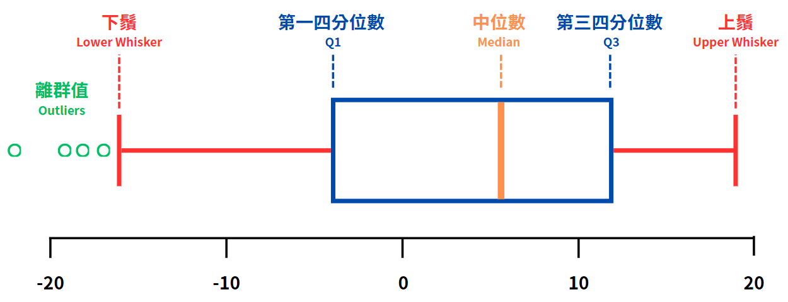 style="width:6.05833in;height:2.365in" /> 意義：
>
> 又稱為盒鬚圖、盒狀圖，用來可視化資料集中趨勢與離散程度的工具，
>
> 尤其在資料探索階段（Exploratory Data Analysis, EDA）中非常有用。
>
>  組成：
>
> 中位數（Median）：
>
> 箱形圖中的水平線，將資料分成兩個等份。這是資料的第二四分位
>
> 數（Q2），也就是中位數。它表示數據集的中間位置，50%的數據位
>
> 於其上方，50%位於其下方。
>
> 第一四分位數（Q1）和第三四分位數（Q3）：
>
> Q1（第一四分位數）：盒子的下邊界，代表資料中最小的 25%的數
>
> 據。
>
> Q3（第三四分位數）：盒子的上邊界，代表資料中最上層的 25%的數
>
> 據。

3-8

>  第三章 機率統計基礎
>
> 四分位距（Interquartile Range, IQR）：
>
> IQR = Q3 - Q1
>
> 即盒子內部的範圍，它表示資料中間 50%的數據範圍，衡量資料的
>
> 變異性。
>
> 當 IQR 較大時，表示資料的變異性大；而 IQR 較小時，則表示資料
>
> 的變異性較小。
>
> 鬚（Whiskers）：
>
> 鬚用於表示資料的「正常分佈範圍」，用以區分出異常值的邊界值。
>
> 須注意，若在箱形圖中稱呼上鬚（Upper Whisker）為“最大值”，指的
>
>  style="width:6.295in;height:2.89667in" />是“不包括離群值”的最大值，因此不見得會是整個資料集的最大值；
>
> 同理，若在箱形圖中稱呼下鬚（Lower Whisker）為“最小值”，指的
>
> 是“不包括離群值”的最小值，不見得會是整個資料集的最小值。
>
> 一般計算上：
>
> ○ 上鬚（Upper Whisker）：（Q3 + 1.5 × IQR）
>
> ○ 下鬚（Lower Whisker）：（Q1 − 1.5 × IQR）
>
> 離群值（Outliers）：
>
> 如果資料超過了鬚的範圍，則被視為離群值。通常用圓點或星形標
>
> 註，顯示資料中極端的值。
>
> 通常，任何超出 Q1 − 1.5 × IQR 或 Q3 + 1.5 × IQR 的數據會被視為
>
> 異常值。
>
>  應用：
>
> 資料分佈檢視：快速了解資料的分佈情況、集中程度以及變異性。
>
> 異常值檢測：通過標註的異常值，可以發現資料中的極端值，進而進行
>
> 處理。
>
> 比較不同資料集：透過多組箱形圖並列，能夠快速比較不同資料集之間
>
> 的分佈情況、異常值以及數據變異。
>
> 3-9
>
>  第三章 機率統計基礎
>
>  優勢：
>
> 直觀且能展示資料的主要特徵（如集中度、分佈範圍與異常值）。
>
> 無需進行繁瑣的計算，便於快速分析資料結構。
>
> 可以有效識別分佈不對稱、極端值與偏態。
>
>  侷限：
>
> 無法顯示資料的精確形狀或分佈，例如，若資料呈現多峰分佈，箱形圖
>
> 無法完全呈現出來。
>
> 對於非常大範圍的資料，無法提供細節分析，只能反映出資料的整體趨
>
> 勢。
>
>  style="width:6.295in;height:2.89667in" /> style="width:1.1784in;height:0.18833in" /> style="width:1.1784in;height:0.18833in" /> style="width:0.39333in;height:0.18833in" />「集中趨勢」與「離散量度」是敘述性統計中最核心的度量指標。前者讓我
>
> 們找到資料的「核心位置」，後者則協助判斷其「波動情形」。掌握這些指標不僅
>
> 能在資料前期檢查中提早找出極端值與偏態，同時也是後續（如假設檢定、迴歸
>
> 分析或機器學習模式設計）的基礎輔助，確保分析結果能更貼近真實狀況並避免
>
> 誤判。
>
> **3.** **Skewness** **Kurtosis**
>
> 在前面討論集中趨勢與離散程度後，我們仍需要進一步探究「資料分佈形態」。
>
> 某些分佈可能偏向右側或左側，也可能出現尖峰或扁平的尾部分佈。這些特徵對分
>
> 析與應用（如機器學習特徵工程、風險管理、異常偵測）有實質影響。本節將介紹
>
> 偏度與峰度的定義、判斷方式，以及常見的形狀分類。
>
> （**1**）偏度（**Skewness**）
>
> 偏度（Skewness）是用於衡量資料分佈對稱程度的統計指標，反映資料是否
>
> 均勻分佈於平均值兩側，或是否存在長尾現象。偏度的數值與分佈形狀密切相關，
>
> 提供資料分佈特性的重要線索。

3-10

>  第三章
> 機率統計基礎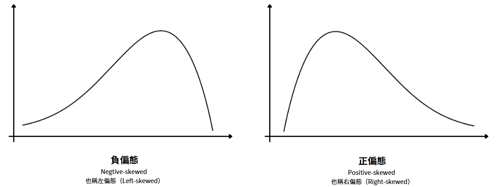
>
>  正偏態（Positive-skewed）：
>
> 也稱為右偏態（Right-skewed），偏度大於 0。
>
>  style="width:6.295in;height:2.89667in" />右側的尾部更長，分佈的主體集中在左側。
>
> 常見於收入、房價或故障時間等分佈，右側極端值（如高收入者）拉高
>
> 平均值。例如，某城市房價資料偏度為 2.5，顯示少數豪宅價格顯著影響
>
> 整體分佈。
>
>  負偏態（Negtive-skewed）：
>
> 也稱為左偏態（Left-skewed），偏度小於 0。
>
> 左側的尾部更長，分佈的主體集中在右側。
>
> 常見於集中高值但少數低值的情況。例如，某設備壽命資料偏度為-1.8，
>
> 原因為設備部屬早期時出現故障、因此有少數資料拉低平均值。
>
>  偏度接近 0：
>
> 分佈趨近對稱，類似理想常態分佈。
>
> 例如某工廠產品重量資料偏度為 0.1，顯示分佈均衡。

（**2**）峰度（**Kurtosis**）

> 峰度（Kurtosis）也稱為尖度，在統計學中衡量實數隨機變數機率分佈的峰態。
>
> 峰度用於衡量資料分佈「尾部與峰頂的尖銳程度」，亦即某分佈是否「高峰重尾」
>
> 或「扁平輕尾」。根據不同的統計學家，峰度的定義有所不同。以下以常在統計學
>
> 理論中使用之：
>
> 3-11
>
>  第三章 機率統計基礎
>
> 「Pearson 定義、常態峰度標準 3」作為說明。
>
>  style="width:6.295in;height:2.89667in" />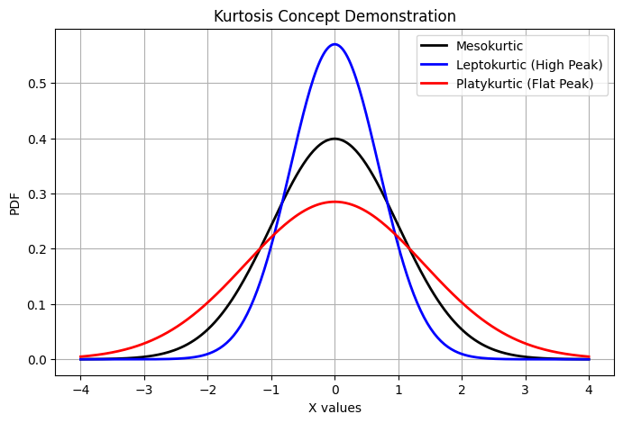 style="width:4.635in;height:3.03667in" /> 高峰（Leptokurtic）
>
> Kurtosis \> 3
>
> 當峰度大於 3 時，稱為高峰分佈（Leptokurtic）。
>
> 這意味著該分佈比常態分佈更加集中於中心，並且有更多的極端值
>
> （outliers），即數據中較大（或較小）的值出現機率比常態分佈高。
>
> 需要特別留意這類分佈在模型外推或異常檢測中的風險，因為極端值
>
> 的存在可能會影響模型的預測結果，尤其是在處理預測或迴歸問題時。
>
>  中峰（Mesokurtic）
>
> Kurtosis ≈ 3
>
> 當峰度接近 3 時，稱為中峰分佈（Mesokurtic）。這個分佈通常接近於
>
> 常態分佈，既不過於尖銳，也不過於扁平。它可以被視為標準的常態分
>
> 佈，適合作為比較其他類型分佈的參照。
>
>  扁平（Platykurtic）
>
> Kurtosis \< 3
>
> 當峰度小於 3 時，稱為扁平分佈（Platykurtic）。這意味著資料的分佈較
>
> 為分散，並且比常態分佈更平坦，沒有太多極端值。

3-12

>  第三章 機率統計基礎 style="width:0.53717in;height:0.47388in" /> style="width:0.6925in;height:0.22167in" />
>
>  style="width:2.76583in;height:0.22167in" />**3.2**
>
>  style="width:1.56805in;height:0.18833in" />**1.**
>
> 在大數據分析中，我們不僅需要從「敘述性統計」層面掌握資料的集中趨勢
>
> 與離散度，也需對資料背後的機率特徵與分佈模型有更深入的理解。若能辨識資
>
> 料屬於何種理論分佈（例如常態分佈、二項分佈、Poisson
> 等），便能在後續推論
>
>  style="width:6.295in;height:2.89667in" /> style="width:1.37122in;height:0.18833in" />與假設檢定時做更精準的模型選擇，也利於機器學習演算法或特徵工程優化。本
>
> 節即聚焦在常見機率分佈，介紹離散型分佈、連續型分佈的基礎概念。
>
> **2.**
>
> 機率分佈（Probability
> Distribution）是描述隨機變數的所有可能值及其相應機
>
> 率的數學函數。在統計學與機率論中，機率分佈是用來表示一個隨機實驗結果的
>
> 所有可能性及其發生的機率。可以應用於幫助我們理解和預測隨機現象，並用來
>
> 計算風險、優化資源配置等。

（**1**）機率分佈的兩個重要數值

> 機率分佈的兩個重要數值，期望值（Expected Value）與變異數（Variance），
>
> 是統計學中衡量隨機變數性質的關鍵指標。
>
>  期望值（Expected Value, E（X））
>
> 期望值是一個隨機變數的加權平均值，它描述的是該隨機變數在多次
>
> 試驗中可能出現的平均結果。期望值在統計學中有時被稱為「數學期
>
> 望」，代表了隨機變數的長期平均或中心位置。
>
> 對於離散型隨機變數 X，期望值的計算公式為：
>
> 𝑛
>
> 𝐸(X) = ∑𝑥𝑖𝑃(𝑥𝑖) 𝑖=1
>
> 3-13
>
>  第三章 機率統計基礎
>
> xi 為隨機變數 X 的所有可能取值，P（xi）為對應的機率。
>
> 對於連續型隨機變數 X，期望值的計算公式為：
>
> ∞
>
> 𝐸(𝑋) = ∫ 𝑥𝑓(𝑥)𝑑𝑥 −∞
>
> 其中 f（x）是隨機變數 X 的機率密度函數（PDF）。
>
>  變異數（Variance, Var（X））
>
> 變異數衡量的是隨機變數取值的分散程度，它反映了數據點偏離期望
>
> 值的平均程度。變異數越大，表示隨機變數的取值越分散；變異數越小，
>
> 表示隨機變數的取值較為集中。
>
>  style="width:6.295in;height:2.89667in" />對於離散型隨機變數
> X，變異數的計算公式為：
>
> 𝑛
>
> Var(𝑋) = ∑(𝑥𝑖 − 𝐸(𝑋))2𝑃(𝑥𝑖)
>
> 𝑖=1
>
> 對於連續型隨機變數 X，變異數的計算公式為：
>
> ∞
>
> Var(𝑋) = ∫ (𝑥 − 𝐸(𝑋)) 𝑓(𝑥)𝑑𝑥 −∞
>
> 隨機變數偏離其期望值的程度，數值越大，表示變數變動範圍越大。
>
> 標準差（Standard Deviation）：變異數的平方根，便於直觀理解資料的
>
> 分佈，並且單位與原資料相同。
>
> （**2**）機率分佈的兩種類型
>
> 根據隨機變數的特性，機率分佈可以分為離散型和連續型兩大類：
>
>  離散型機率分佈（Discrete Probability Distribution）
>
> 離散型隨機變數：
>
> 值是有限或可數的，例如擲骰子的結果（1、2、3、4、5、6）或某電
>
> 商平台每日訂單數（0、1、2…）。這些變數的值通常為整數，且可能
>
> 取值集合是明確的。

3-14

>  第三章 機率統計基礎
>
> 離散型機率分佈：
>
> 透過機率質量函數（Probability Mass Function, PMF）描述隨機變數
>
> 「每一個特定取值的機率」。
>
> 例如，擲骰子時，PMF 為 P（X=1）=1/6，P（X=2）=1/6，
>
> PMF 總和等於 1：
>
> ∑𝑃(𝑋 = 𝑥𝑖) = 1 𝑥𝑖
>
>  連續型機率分佈（Continuous Probability Distribution）
>
>  style="width:6.295in;height:2.89667in" />連續型隨機變數：
>
> 值是無限且連續的，通常用於描述測量型變數，如身高、體重、時間
>
> 或溫度。這些變數不僅包含整數，還可以是任意實數，例如某病患等
>
> 待時間可能為 5.3 分鐘或 5.31 分鐘。
>
> 連續型機率分佈：
>
> 透過機率密度函數（Probability Density Function,PDF）描述隨機變數
>
> 「於某取值範圍內的機率」。對於連續型隨機變數 X，PDF 必須滿足
>
> 以下條件：
>
> 𝑏
>
> 𝑃(𝑎 ≤ 𝑋 ≤ 𝑏) = ∫ 𝑓(𝑥)𝑑𝑥 𝑎
>
> ○ 其中，
>
> f（x）是隨機變數 X 的機率密度函數（PDF），描述了隨機變數在
>
> 區間\[a, b\]內的機率。

（**3**）機率分佈的應用

> 機率分佈是統計學和機率論的核心工具之一，廣泛應用於各個領域，示例應
>
> 用如：
>
>  風險管理：在金融領域，投資者可以根據資產的機率分佈來計算風險和報
>
> 酬，進行資產配置和風險控制。
>
> 3-15
>
>  第三章 機率統計基礎
>
>  品質控制：製造業使用常態分佈來描述產品的測量數據，進行品質檢查和
>
> 控制。
>
>  預測分析：根據過去的數據，利用機率分佈來預測未來事件的可能性，這
>
> 在各行各業中都很常見，如銷售預測、需求預測等。
>
>  style="width:1.56805in;height:0.18833in" />**3.**
>
> （**1**）伯努利分佈（**Bernoulli** **Distribution**）
>
>  定義：
>
> 伯努利分佈是一種描述單次試驗中只有兩種結果（成功與失敗）的離散
>
>  style="width:6.295in;height:2.89667in" />型分佈。它是二項分佈的特例，當試驗次數
> n=1 時，便可使用伯努利
>
> 分佈來描述。
>
> 數學公式：
>
> *P* (*X* = 1) = *p*，*P* ( *X* = 0) = 1 - *p*
>
> p 是成功的機率，X 只能取 0（失敗）或 1（成功）。
>
>  期望值與變異數：
>
> *E* (*X*) = *p*
>
> Var (*X*) = *p* (1 - *p*)
>
>  應用示例：
>
> 單個產品的品質檢測是否合格（1 = 合格，0 = 不合格）。
>
> 使用者是否點擊廣告（1 = 點擊，0 = 未點擊）。
>
>  侷限：
>
> 僅適用於單次試驗的情況，無法擴展到多次試驗。
>
> （**2**）二項分佈（**Binomial** **Distribution**）
>
>  定義：
>
> 二項分佈描述的是在固定次數 n 的獨立試驗中，每次試驗成功的機率
>
> 為 p，並記錄成功的次數 X。

3-16

>  第三章 機率統計基礎
>
> 二項分佈適用於多次獨立試驗中成功次數的計算。
>
>  數學公式：
>
> 𝑃(𝑋 = 𝑘) = (𝑛)𝑝𝑘(1 − 𝑝)𝑛−𝑘，𝑘 = 0,1,…,𝑛
>
> n：表示試驗的總次數（固定的正整數）。
>
> p：表示每次試驗成功的機率，範圍是 0 ≦ p ≦ 1。
>
> k：表示期望成功的次數，且 k 是介於 0 到 n 之間的整數。
>
> (𝑛) 二項係數，表示從 n 次試驗中選出 k 次成功的方式數，
>
> 計算公式為：
>
>  style="width:6.295in;height:2.89667in" />𝑛 𝑛!
>
> 𝑘 𝑘!(𝑛 − 𝑘)!
>
>  期望值與變異數：
>
> *E* (*X*) = *np*
>
> Var (*X*) = *np* ( 1 - *p*)
>
>  應用示例：
>
> 電商投放 n 則廣告，觀察成功（如點擊或購買）的次數。
>
> 檢驗 n 個產品中合格品的數量。
>
>  侷限：
>
> 試驗必須是獨立的，且成功機率 p 固定，若任一條件不滿足，則不適
>
> 用。

（**3**）泊松分佈（**Poisson** **Distribution**）

>  定義：泊松分佈用來描述某一事件在固定時間或空間區間內「發生次數」
>
> 的機率分佈，平均發生率（速率）為𝛌。
>
>  數學公式：
>
> 𝑘 −𝜆
>
> 𝑃(𝑋 = 𝑘) = 𝑘! ，𝑘 = 0,1,…
>
> 𝛌：事件的平均發生率（每單位時間或空間的平均次數）
>
> 3-17
>
>  第三章 機率統計基礎
>
> k：事件發生的次數
>
> e：自然對數的底數，約為 2.71828
>
>  期望值與變異數：
>
> E(X) = λ
>
> Var(X) = λ
>
>  應用示例：
>
> 事件的次數，例如客戶服務中心的來電量、網站的訪問次數。
>
> 稀少事件的發生，如設備故障、車禍發生的次數。
>
>  侷限：
>
>  style="width:6.295in;height:2.89667in" /> style="width:1.56805in;height:0.18833in" />泊松分佈假設事件發生的平均發生速率𝛌是固定的，若發生率隨時間變
>
> 化則不適用。
>
> **4.**
>
> （**1**）常態分佈（**Normal** **Distribution**）
>
>  定義：
>
> 常態分佈是最常見的連續型機率分佈之一，其數據呈現對稱的鐘形曲
>
> 線。它由兩個參數決定：均值（**μ**）和標準差（**σ**），這兩個參數決定了
>
> 分佈的中心位置和擴展範圍。
>
> 常態分佈常用來描述許多自然現象中的變數行為。
>
> 根據中央極限定理（Central limit theorem），當樣本量足夠大時，無論
>
> 原始資料分佈為何，任一組獨立且同分佈的隨機變數，其總和或平均值
>
> 的分佈都會趨近於常態分佈。
>
>  數學公式：
>
> 常態分佈的機率密度函數（PDF）為：
>
> 𝑓(𝑥) = 1 𝑒𝑥𝑝 (−(𝑥 − 𝜇)2) 𝜎√2𝜋

3-18

>  第三章 機率統計基礎
>
>  期望值與變異數：
>
> *E*(*X*) = μ
>
> Var(*X*) = σ 2
>
>  應用示例：
>
> 身高、體重等自然科學數據通常服從常態分佈。
>
> 在金融領域，股票的價格波動、日收益等也可近似常態分佈。
>
> 用於假設檢定（如 t 檢定、z 檢定等）。
>
>  侷限：
>
> 若數據呈現偏態或長尾（Leptokurtic），則不適合假設常態分佈。
>
>  style="width:6.295in;height:2.89667in" />極端值較多的情況下常態分佈不再適用。

（**2**）指數分佈（**Exponential** **Distribution**）

>  定義：
>
> 指數分佈描述的是事件發生之間的間隔時間，適用於隨機過程中等待
>
> 時間的分佈，通常用來描述「等待時間」或「生存時間」。
>
> 例如，機器故障時間、電話來電間隔等都可以用指數分佈來建模。該分
>
> 佈的特徵是記憶性（Memoryless），即未來的事件發生與過去的時間無
>
> 關。
>
>  數學公式：
>
> 指數分佈的機率密度函數（PDF）為：
>
> *f* (*x*)=λ*e*-λ*x*，*x* ≥ 0
>
> 其中：𝛌是發生率，定義為單位時間內事件發生的平均頻率。
>
>  期望值與變異數：
>
> 𝐸(𝑋) = 𝜆
>
> Var(𝑋) = 𝜆2
>
> 3-19
>
>  第三章 機率統計基礎
>
>  應用示例：
>
> 描述等待時間，如客服中心接到來電的時間間隔。
>
> 機器壽命、零件故障時間等。
>
> 排隊理論中的基礎模型。
>
>  侷限：
>
> 需要假設事件發生率是固定的；若隨時間變化，指數分佈將不再適用。
>
> 當發生事件的速率變化時，需選擇更複雜的分佈，如 Weibull 分佈。
>
> （**3**）卡方分佈（**Chi-square** **Distribution**）
>
>  style="width:6.295in;height:2.89667in" /> 定義：
>
> 卡方分佈是常態分佈的平方和，通常用於檢驗假設、測量變異數，並且
>
> 與多種統計檢定（如適配度檢定、獨立性檢定、齊一性檢定）相關。
>
> 卡方分佈是一個偏態分佈，且隨著自由度 k 的增加，卡方分佈會趨近
>
> 常態分佈。
>
>  關於自由度（Degrees of Freedom）：
>
> 定義：
>
> 自由度（Degrees of Freedom, df）是統計學中的一個重要概念，指的
>
> 是在計算統計量時，「可以自由變動的資料點數量」。
>
> 在許多統計檢定和估計中，自由度的大小會影響檢定的結果、分佈
>
> 的形狀及其精確度。
>
> 示例：
>
> 例如，在計算樣本標準差時，使用了樣本平均值作為已知量，這樣就
>
> 減少了一個自由度。
>
> 卡方分佈中的應用：
>
> 自由度（k）是卡方分佈中的一個重要參數，影響卡方分佈的形狀與
>
> 尾部的長度。
>
> 當自由度較小時，卡方分佈會有更明顯的偏態。

3-20

>  第三章 機率統計基礎
>
> 當自由度增加時，分佈會逐漸趨近常態分佈。
>
>  數學公式：
>
> 卡方分佈的機率密度函數（PDF）為：
>
> 𝑘 𝑥
>
> 𝑓(𝑥) = 𝑥2 𝑒 2 ，𝑥 ≥ 0
>
> 22Γ(2)
>
> 其中：k 是自由度；𝚪是伽瑪函數。
>
>  期望值與變異數：
>
> *E*(*X*) = *k*
>
> Var(*X*) = *2k*
>
>  style="width:6.295in;height:2.89667in" /> style="width:1.95958in;height:0.18833in" /> 應用示例：
>
> 用於假設檢定，尤其是適配度檢定（Goodness of Fit）和列聯表獨立性
>
> 檢定。
>
> 測量樣本資料與理論分佈的差異，檢查變數間的獨立性。
>
>  侷限：
>
> 若自由度 k 較小，檢定的準確度可能會受限。
>
> **5.**

（**1**）定義

>  分佈擬合（Distribution Fitting）：
>
> 分佈擬合的目的是找出一個合適的數學模型（分佈），來描述我們收
>
> 集到的資料。例如，當我們收集到一大堆的銷售數據，我們會想知道這些
>
> 數據的分佈形態是什麼樣的。它是像鐘形一樣對稱的（如常態分佈），還
>
> 是稀疏事件（如 Poisson 分佈）？我們需要從不同的分佈中選擇一個，來
>
> 準確描述我們的數據。
>
> 我們進行分佈擬合，基本上就是選擇一個適合的分佈來代表資料的樣
>
> 子，然後通過數學方法（比如最大似然估計），找出這個分佈的參數，讓它
>
> 最好地貼合我們的數據。
>
> 3-21
>
>  第三章 機率統計基礎
>
>  資料建模
>
> 資料建模則是將擬合後的分佈應用到現實問題中，來進行預測、風險
>
> 分析或其他決策。例如，假設我們已經確定了某些業務數據（像是網站點
>
> 擊量）符合常態分佈，那麼我們就可以利用這個分佈的特性來預測未來的
>
> 網站訪問量，或計算出異常情況發生的機率。
>
> 在這個過程中，資料建模不僅限於描述數據的分佈，它還會將這些數
>
> 學模型應用到實際的業務情境中，比如做出商業預測、風險預測，或者為
>
> 機器學習模型提供更準確的數據特徵。
>
>  style="width:6.295in;height:2.89667in" />（**2**）步驟
>
> 分佈擬合的成功取決於資料特性與假設的匹配，以下為關鍵條件與考量：
>
>  資料型態確認：
>
> 需先判斷資料屬於離散型還是連續型（如交易金額）。
>
> 離散型資料適用於計數變數，如某製造企業分析每日故障次數。
>
> 連續型資料則適用於測量變數，例如某醫療機構分析病患等待時間。
>
>  模型候選選擇：
>
> 根據資料特性選取分佈。
>
> 若資料呈現偏態或長尾（如收入資料偏度 2.5），可考慮對數常態分佈
>
> 或重尾分佈（如 t 分佈）。
>
> 若事件稀少且獨立（如每小時客服投訴），則泊松分佈較合適。例如，
>
> 某金融機構分析交易頻率，發現事件稀疏，選用泊松分佈提升預測準確
>
> 性。
>
>  獨立性與固定率假設：
>
> 二項分佈與泊松分佈假設試驗獨立且機率或發生率固定。
>
> 例如，某零售企業分析顧客購買行為，若促銷活動改變成功率，二項分
>
> 佈可能失效，需改用動態模型。實務中，需檢查資料是否滿足假設，例
>
> 如使用自相關（Autocorrelation）分析確認獨立性。

3-22

>  第三章 機率統計基礎 style="width:0.53717in;height:0.47388in" /> style="width:0.6925in;height:0.22167in" />
>
>  style="width:2.30597in;height:0.22167in" />**3.3**

**1.**

> 在資料驅動的決策時代中，統計推論（Statistical
> Inference）扮演著將觀察到

的樣本資訊轉化為對整體母體理解的橋樑角色。無論是在商業分析、醫療研究或

政策制定等領域，面對無法全面掌握的資料時，如何透過科學的方法「根據部分，

推論整體」，便成為資料分析工作的核心任務之一。

> 本節將聚焦於統計推論中的一項重要工具 - 假設檢定（Hypothesis
> Testing）。

假設檢定是一種形式化的分析程序，用以評估觀察到的樣本結果是否具有統計上

的顯著性，進而對某一特定主張做出判斷。例如，企業是否應更換廣告素材、藥

品是否顯著有效、用戶轉換率是否因介面改版而變動，這些皆可透過假設檢定提

供理性且有依據的結論。

**2.**

> 統計推論（Statistical
> Inference）是以樣本資料為基礎，對整體母體特徵進行

科學性推估的程序。在實務中，往往無法取得全體資料（例如全人口、所有產品、

所有事件），因此須藉由統計方法，從具代表性的樣本中獲得合理的估計與判斷。

統計推論不僅是資料分析的基石，也構成機器學習與大數據分析背後的邏輯支柱。

> 統計推論可概略分為兩大核心分支：參數估計（Parameter Estimation）與假設

檢定（Hypothesis
Testing），兩者雖然目的不同，但均依賴機率模型作為推論依據，

並對樣本中的不確定性進行量化處理。

> 3-23
>
>  第三章 機率統計基礎
>
>  style="width:6.295in;height:2.89667in" /> style="width:0.4825in;height:0.15333in" /> style="width:0.80625in;height:0.15333in" /> style="width:1.12817in;height:0.15333in" />（**1**）參數估計
>
> 參數估計是指根據樣本資料，對母體的數值特徵進行推測，例如平均值
>
> （mean）、變異數（variance）、比例（proportion）等常見統計參數。
>
> 主要方法可分為兩類：點估計與區間估計：
>
>  點估計（Point Estimation）：
>
> 是以樣本資料計算出一個單一數值（統計量），作為對母體參數的最
>
> 佳估計。例如，以樣本平均數作為母體平均數的點估計，是最常見的做法
>
> 之一。然而，點估計無法反映估計的不確定性，因此在許多實務分析中會
>
> 搭配區間估計進行。
>
>  區間估計（Interval Estimation）：
>
> 進一步提供一個數值範圍，表示我們對母體參數所在區間的信心程
>
> 度。這個範圍稱為信賴區間（Confidence Interval）。以 95%信賴區間為例，
>
> 其意義並非母體參數有 95%的機率落在某一特定區間內，而是指：若以相
>
> 同方式重複進行大量抽樣並對每個樣本建立信賴區間，則預期這些區間中
>
> 約有 95%會包含母體的真實參數值。

3-24

>  第三章 機率統計基礎
>
> 舉例來說，在用戶滿意度調查中，若抽樣調查結果顯示平均分數為 4.2
>
> 分，且根據該樣本估計出的 95%信賴區間為\[4.0, 4.4\]；這表示：若我們
>
> 依相同方式重複抽樣並對每個樣本建立信賴區間，則在所有這些區間
>
> 中，約有 95%預期會涵蓋母體實際的平均滿意度分數。

（**2**）假設檢定

> 假設檢定則是一種形式化的推論工具，用於檢視樣本資料是否提供足夠證據
>
> 來拒絕某一原先的假設。整體流程包含：
>
> A. 設定虛無假設（或稱零假設）與對立假設
>
>  style="width:6.295in;height:2.89667in" />B.
> 選擇適當的檢定方法與檢定統計量
>
> C. 決定顯著水準（α）
>
> D. 計算檢定統計量與 p 值
>
> E. 比較顯著水準並進行決策
>
> 假設檢定強調的是「證據是否足夠」，而非直接斷定假設真偽。實務中常見的
>
> 檢定情境舉例：
>
>  A/B 測試：新產品設計是否提升點擊率或轉換率
>
>  醫療試驗：新藥是否對疾病有顯著療效
>
>  生產製程：產品平均重量是否符合規格標準
>
>  金融風控：模型預測是否優於既有基準模型
>
>  style="width:1.95958in;height:0.18833in" />**3.**
>
> 假設檢定（Hypothesis Testing）是一種統計推論方法，用於判斷樣本資料是否
>
> 提供足夠證據，足以拒絕一項預設的主張，也就是虛無假設（Null
> Hypothesis）。
>
> 其目的不在於證明某個主張絕對為真，而是以樣本結果為依據，評估該主張是否
>
> 與觀察到的資料相符。這套程序在社會科學、醫療實驗、商業分析與工業品質控
>
> 制等領域皆被廣泛應用。一項完整的假設檢定，通常包含以下步驟：
>
> 3-25
>
>  第三章 機率統計基礎 style="width:6.295in;height:2.89667in" /> style="width:0.4825in;height:0.15333in" /> style="width:0.80625in;height:0.15333in" /> style="width:0.32333in;height:0.15333in" /> style="width:0.80625in;height:0.15333in" /> style="width:0.32333in;height:0.15333in" />
>
> （**1**）明確定義虛無假設與對立假設
>
> 檢定的第一步，是將欲檢驗的問題形式化為兩個對立的敘述：
>
>  虛無假設（H₀）：反映現狀、無差異、無效果的主張。
>
>  對立假設（H₁）：反映研究者欲驗證的新主張，通常為「有差異」、「有改
>
> 變」或「有效果」。
>
> 例如，在比較新舊廣告對消費行為的影響時：
>
>  H₀：兩種廣告對平均購買金額沒有差異（μ₁ =μ₂）
>
>  H₁：兩種廣告對平均購買金額有差異（μ₁≠μ₂）
>
> （**2**）選擇適當的檢定方法與檢定統計量
>
> 根據資料的性質（如變數類型、樣本數、是否為常態分佈），選擇對應的統計
>
> 檢定方法。每種方法都對應一種檢定統計量，其分佈已知，可用以推估結果的機
>
> 率。例如：
>
>  比較平均數可用 t 檢定（t-test）或 Z 檢定（Z-test）
>
>  分析變異可用變異數分析（ANOVA）

3-26

>  第三章 機率統計基礎
>
>  分析比例可用卡方檢定（Chi-Square test）

（**3**）決定顯著水準 **α**

> 在進行假設檢定之前，研究者需預先設定一個可接受的錯誤機率上限，稱為
>
> 顯著水準（α）。顯著水準代表在虛無假設為真的前提下，仍可能因樣本隨機波動
>
> 而錯誤地拒絕該假設的機率，也就是型一錯誤（Type I Error）發生的上限。
>
> 顯著水準通常根據研究目的與風險容忍程度來決定，常見如下：
>
>  α = 0.05：
>
> 代表在虛無假設為真的情況下，最多容許 5%的檢定結果出現錯誤拒
>
> 絕的情形，是應用最普遍的標準。
>
>  α = 0.01：
>
> 代表容許的錯誤更嚴格僅為 1%，適用於錯誤代價極高的情境，例如
>
> 藥物療效、安全風險或高金額決策。
>
> 3-27
>
>  第三章 機率統計基礎
>
>  α = 0.10：
>
> 容許的錯誤範圍較寬鬆，常用於初步探索、假說生成階段，容忍較高
>
> 的不確定性。
>
> 舉例來說，若在藥品的臨床試驗中設定顯著水準為 0.01，表示研究者
>
> 對於拒絕虛無假設（即新藥與安慰劑效果無差異）採取更嚴格的標準。即
>
> 使樣本結果顯示兩者之間有差異，也必須有足夠強的統計證據（p 值小於
>
> 0.01）才能拒絕虛無假設，藉此降低錯誤宣稱藥品有效的風險。
>
> 需要特別注意的是，顯著水準 α 並不等同於檢定結果中的 p 值。
>
>  顯著水準（α）是事前設定的判斷門檻，用來決定是否拒絕虛無假設。
>
>  style="width:6.295in;height:2.89667in" /> 而 p
> 值則是在觀察到樣本資料後所計算出的機率，用來衡量資料與虛無假
>
> 設的相符程度。
>
>  檢定結論是根據 p 值是否小於 α 而定。
>
> 此外，在多重比較或大數據分析情境下，若重複進行多次統計檢定而未進行
>
> 調整，會大幅提升整體犯型一錯誤的風險。為了避免此類誤判，常見做法是調整
>
> 顯著水準，例如採用 Bonferroni
> 校正法，以控制整體的錯誤率在可接受範圍內。
>
> （**4**）計算檢定統計量與 **p** 值
>
> 在完成虛無假設設定與顯著水準選定後，下一步是根據樣本資料計算出檢定
>
> 統計量。檢定統計量是用來衡量觀察結果與虛無假設預期結果之間差異程度的指
>
> 標。不同的檢定方法會使用不同類型的統計量，例如 t 檢定使用 t
> 值、卡方檢定使
>
> 用卡方值、變異數分析使用 F 值等。
>
> 計算出統計量之後，接著需參照該統計量所對應的理論分佈（如 t 分佈、常
>
> 態分佈、卡方分佈等），進一步計算其對應的 p 值。p
> 值是指在虛無假設為真的情
>
> 況下，觀察到與實際樣本結果相同或更極端的資料出現的機率。換句話說，p
> 值越
>
> 小，代表在虛無假設前提下出現該結果的可能性越低，因此越支持拒絕虛無假設。

3-28

>  第三章 機率統計基礎

（**5**）作出結論

> 當 p 值計算完成後，研究者需將其與預先設定的顯著水準 α 進行比較，作為
>
> 是否拒絕虛無假設的依據。這是整個假設檢定流程中最關鍵的決策時刻。
>
>  若 p 值≤α，則拒絕虛無假設，表示資料提供了足夠證據支持對立假設。
>
>  若 p 值\>α，則無法拒絕虛無假設，表示目前資料不足以支持對立假設。須
>
> 注意，這並不代表虛無假設為真，也不代表對立假設為假，只能說在現有
>
> 樣本條件下，尚未獲得足夠證據支持對立假設。
>
> 舉例來說，若研究者在比較兩種教學法對學生成績的影響，得到 p 值為 0.18，
>
>  style="width:6.295in;height:2.89667in" /> style="width:1.56805in;height:0.18833in" /> style="width:1.12817in;height:0.15333in" /> style="width:0.80625in;height:0.15333in" /> style="width:0.32333in;height:0.15333in" /> style="width:0.4825in;height:0.15333in" /> style="width:0.80625in;height:0.15333in" /> style="width:0.32333in;height:0.15333in" /> style="width:0.4825in;height:0.15333in" />而顯著水準設定為
> 0.05，則應表示「無法拒絕虛無假設」，即目前資料無法證明兩
>
> 種教學法在學生成績上有顯著差異。但這並不代表兩種方法完全一樣，也不代表
>
> 未來不會在其他條件或樣本下產生顯著效果。
>
> **4.**
>
> 在進行統計檢定時，研究者的目的是透過樣本資料對母體做出推論。然而，
>
> 無論方法如何嚴謹，由於推論基於樣本而非全體，難以完全避免判斷錯誤。因此，
>
> 假設檢定中可能會產生兩種類型的錯誤：型一錯誤與型二錯誤。
>
> 3-29
>
>  第三章 機率統計基礎
>
> 舉例示意：
>
>  style="width:6.295in;height:2.89667in" /> style="width:0.4825in;height:0.15333in" /> style="width:0.80625in;height:0.15333in" /> style="width:0.32333in;height:0.15333in" /> style="width:0.32333in;height:0.15333in" /> style="width:0.80625in;height:0.15333in" /> style="width:0.80625in;height:0.15333in" />（**1**）型一錯誤（**Type**
> **I** **Error**）
>
> 型一錯誤是指在虛無假設實際為真的情況下，卻錯誤地拒絕了它。換句話說，
>
> 就是「把本來沒有差異，誤判為有差異」。
>
> 型一錯誤的機率由顯著水準 α 控制，例如 α 設為 0.05，表示願意接受最多 5%
>
> 的機率錯誤拒絕虛無假設。這也是為何顯著水準需謹慎設定，特別是在錯誤結論
>
> 可能造成重大後果的情境中。
>
> 舉例來說，在藥品審查中，若虛無假設為「新藥與現有藥效無差異」，而研究
>
> 錯誤拒絕了該假設，就可能導致一項實際無效的新藥被錯誤認為有效，進而通過
>
> 核准，造成病患風險。
>
> （**2**）型二錯誤（**Type** **II** **Error**）
>
> 型二錯誤則是指在對立假設實際為真的情況下，卻未能拒絕虛無假設。也就
>
> 是「有差異，卻誤以為沒差異」。
>
> 型二錯誤的機率以 β 表示，與檢定力（power）有關。檢定力指的是當對立假
>
> 設為真時，能正確拒絕虛無假設的機率，計為
> 1−β。若樣本數不足、變異數過大、
>
> 或效應太小，則檢定力會降低，型二錯誤的風險也會上升。

3-30

>  第三章 機率統計基礎
>
> 舉例來說，若某項新教學法實際上能提升學生成績，但因樣本數太小或資料
>
> 變異太大，導致檢定結果無法達到顯著，進而未拒絕虛無假設，這就是型二錯誤。
>
> 其結果可能使具潛力的教育方式遭到錯失。

（**3**）錯誤類型的平衡與取捨

> 在實務應用中，型一錯誤與型二錯誤通常無法同時降到極低。降低顯著水準
>
> （α）雖能減少型一錯誤，但也會提高型二錯誤的風險。因此，研究設計需根據應
>
> 用風險與目的進行權衡。
>
> 例如，若錯誤通過一項無效藥品會造成重大後果，則應嚴格控制型一錯誤（將
>
>  style="width:6.295in;height:2.89667in" /> style="width:2.35125in;height:0.18833in" />α
> 設低）；反之，若錯過一項有效創新會帶來損失，則應盡量提高檢定力，降低型
>
> 二錯誤發生的可能。
>
> 透過事前樣本數規劃與檢定力分析（PowerAnalysis），可以在研究開始前，合
>
> 理配置 α、β 與樣本數之間的關係，提升檢定的效能與決策的可靠性。
>
> **5.**
>
> 在統計推論中，研究者利用樣本數據對母體特性進行推斷，而假設檢定是實
>
> 現這一目標的核心工具。假設檢定的基本原理是評估樣本觀察結果是否與虛無假
>
> 設（H₀）一致，進而決定是否拒絕
> H₀，間接支持對立假設（H₁），以推斷母體是否
>
> 存在顯著的特性或差異。
>
> 不同的資料型態（如連續變數、類別變數）、研究設計（如單組、雙組、多組）
>
> 以及分析目的（如均值比較、比例檢驗、相關性分析），對應著不同的統計檢定方
>
> 法。選擇合適的檢定方法，不僅需要理解其統計邏輯，還需考量前提假設（如常
>
> 態性、變異數齊一性）是否滿足，以確保推論結果的可靠性和有效性。
>
> 統計檢定方法在實務中應用廣泛，涵蓋多個領域。例如，在產品試驗中，企
>
> 業可能使用檢定方法評估新款產品的性能是否優於舊款；在行銷實驗中，A/B 測
>
> 試常用於比較不同廣告策略的轉換率；在醫療研究中，檢定方法幫助驗證新藥療
>
> 效是否顯著；在社會科學中，研究者可能檢驗不同群體間的行為差異。無論是商
>
> 3-31
>
>  第三章 機率統計基礎
>
> 業決策、科學研究還是政策分析，選擇正確的檢定方法是進行有效統計推論的關
>
> 鍵前提。
>
> 然而，統計檢定方法的種類繁多，從簡單的 t 檢定到複雜的非參數方法，每
>
> 種方法都有其特定的適用情境和假設條件。下列將聚焦於實務中最常見的分析任
>
> 務，系統性介紹以下具代表性的檢定方法：
>
>  平均數的差異檢定（適用於連續變數，且符合常態分佈與變異數齊一性假
>
> 設）：
>
> 單樣本 t 檢定（One-sample t-test）
>
> 獨立樣本 t 檢定（Independent-samples t-test）
>
>  style="width:6.295in;height:2.89667in" />配對樣本 t
> 檢定（Paired-samples t-test）
>
> 單因子變異數分析（One-way ANOVA）
>
>  比例或類別變數的比較（適用於二元或多類別數據）：
>
> 單樣本比例檢定（One-sample proportion test）
>
> 雙樣本比例檢定（Two-sample proportion test）
>
> 卡方檢定（Chi-square test）
>
> 類別變數之間的獨立性檢定
>
> 預期分佈的適合度檢定
>
>  相關性分析
>
> 皮爾森相關檢定（Pearson correlation test）
>
> 斯皮爾曼等級相關檢定（Spearman rank correlation test）
>
>  非參數檢定（適用於非常態或順序資料）
>
> Mann-Whitney U 檢定（比較兩組獨立樣本中位數）
>
> Kruskal-Wallis 檢定（比較三組以上獨立樣本之分佈位置／中位數差異）

3-32

>  第三章 機率統計基礎 style="width:0.80625in;height:0.15333in" /> style="width:0.85833in;height:0.15333in" /> style="width:0.80625in;height:0.15333in" />

（**1**）平均數的差異檢定

>  單樣本 t 檢定（One-sample t-test）
>
> a\. 方法概述
>
> 單樣本 t 檢定是用來檢驗「樣本平均數是否與某個已知數值（μ₀）之
>
> 間存在顯著差異」的方法。當母體標準差未知，且樣本數較小（n \<
>
> 30）時，通常採用此檢定。
>
> 常見於產品測試、教育成績評估、臨床實驗等領域，例如：檢查某藥
>
> 物對血壓是否有降低效果、驗證學生考試成績是否達標。
>
> b\. 適用條件與前提假設
>
>  style="width:6.295in;height:2.89667in" />在使用單樣本 t
> 檢定之前，必須確保下列條件成立：
>
> ○ 資料為連續變數（如長度、時間、成績等）。
>
> ○ 樣本為隨機抽樣，且彼此獨立。
>
> ○ 母體標準差未知。
>
> ○ 樣本來自近似常態分佈的母體（若 n ≥ 30，可依中央極限定理放
>
> 寬常態性要求）。
>
> c\. 假設設定
>
> 虛無假設（H₀）：μ = μ₀（樣本平均與理論值無差異）。
>
> 對立假設（H₁）依檢定方向不同，可分為三種：
>
> 舉例來說，若要檢驗某食品的平均含鈉量是否與法規標準不同，適用雙尾
>
> 檢定；若想確認藥物是否讓血壓下降，則採用左尾檢定。
>
> d\. 常見誤用與注意事項
>
> 不適用於比例、名目或順序型資料（例如：性別、等級）。
>
> 若母體標準差已知，應使用 Z 檢定而非 t 檢定。
>
> 3-33
>
>  第三章 機率統計基礎
>
> 樣本數過少或分佈偏態時，t 檢定可能失準。
>
> 顯著性 ≠ 實質重要性，建議搭配信賴區間一併報告。
>
> 檢定方向（單尾或雙尾）須事先設定，不能事後依結果選擇。
>
>  獨立樣本 t 檢定（Independent-samples t-test）
>
> a\. 方法概述
>
> 獨立樣本 t 檢定用於比較兩組互相獨立樣本的平均數是否具有統計
>
> 上顯著差異。常見應用情境包括：比較兩種教學法的學習成效、男性
>
> 與女性的平均工時、兩種產品的顧客滿意度等。
>
> b\. 適用條件與前提假設
>
>  style="width:6.295in;height:2.89667in" /> style="width:0.80625in;height:0.15333in" /> style="width:0.85833in;height:0.15333in" /> style="width:0.80625in;height:0.15333in" />兩組資料為獨立樣本（不同個體、不同來源）。
>
> 資料為連續變數。
>
> 每組樣本皆來自常態分佈的母體。
>
> 母體變異數相等（可用 Levene’s test 或 F-test 檢查；若不等應採
>
> Welch’s t 檢定）。
>
> c\. 假設設定
>
> 虛無假設（H₀）：μ₁ = μ₂（兩組母體平均數無差異）。
>
> 對立假設（H₁）有三種形式：
>
> 例如：檢驗新藥 A 是否比舊藥 B 有更高的療效，若希望確認 A 是否顯著
>
> 大於 B，可採右尾檢定。
>
> d\. 常見誤用與注意事項
>
> 不可將同一組人測前後結果誤用本檢定（應使用成對樣本 t 檢定）。
>
> 使用前應先檢查變異數是否相等。

3-34

>  第三章 機率統計基礎 style="width:0.80625in;height:0.15333in" /> style="width:0.85833in;height:0.15333in" /> style="width:0.80625in;height:0.15333in" />
>
> 樣本數極不均衡時應採用 Welch 檢定。
>
> 檢定僅說明「是否顯著不同」，不代表差異具實質效益。
>
>  成對樣本 t 檢定（Paired-samples t-test）
>
> a\. 方法概述
>
> 成對樣本 t 檢定用於比較同一個體在兩種不同情況下的平均差異，
>
> 或是兩個彼此對應的觀測值組合（如配對樣本）之差異。它的核心在
>
> 於「差值」的統計推論，而非兩組平均數本身的獨立比較。
>
> 常見應用包括：
>
> ○ 同一組人在治療前與治療後的測量（如血壓、成績）。
>
>  style="width:6.295in;height:2.89667in" />○
> 配對實驗設計中（如雙胞胎、一對一配對樣本）。
>
> ○ 產品改善前後的性能差異評估。
>
> b\. 適用條件與前提假設
>
> 資料為連續變數。
>
> 每對觀測值來自相同個體或相互配對樣本。
>
> 各對觀測值的差值（差異量）近似常態分佈。
>
> 樣本對之間彼此獨立。
>
> c\. 假設設定
>
> 在成對樣本 t 檢定中，檢定的對象是兩次測量值之間的「差值」平均
>
> 數，記為 μd。檢定目的在於判斷該差值是否與 0 有顯著差異。
>
> 虛無假設（H₀）：μd = 0
>
> 表示兩次測量之間沒有平均差異，差值的期望為零。
>
> 對立假設（H₁）則依檢定方向分為三種情況：
>
> 3-35
>
>  第三章 機率統計基礎
>
> d\. 常見誤用與注意事項
>
> 若資料來自不同個體或樣本之間不具相依性，不得使用此檢定（應
>
> 使用獨立樣本 t 檢定）。
>
> 須特別檢查差值分佈是否近似常態，否則檢定結果可能不準確。
>
> 實際上成對樣本設計能有效控制個體間變異，但錯用成對檢定將導
>
> 致假設錯置。
>
> 須避免在未定義清楚配對規則時強行套用成對樣本設計。
>
>  單因子變異數分析（One-way ANOVA）
>
> a\. 方法概述
>
>  style="width:6.295in;height:2.89667in" />單因子變異數分析（One-way
> ANOVA）是一種用來比較三組以上獨
>
> 立樣本平均數是否有顯著差異的統計方法。它延伸自 t 檢定的邏輯，
>
> 當研究中有超過兩組要比較的情況時，ANOVA 提供一個整體檢定框
>
> 架，判斷是否至少有一組的平均數與其他組不同。
>
> b\. 適用條件與前提假設
>
> 各組資料來自獨立樣本。
>
> 應變數為連續變數，自變數為類別變數（分組）。
>
> 各組母體具有常態分佈。
>
> 各組的變異數應大致相等（變異數齊一性假設，可用 Levene’s test 檢
>
> 查）。
>
> 各觀測值彼此獨立。
>
> c\. 假設設定
>
> ANOVA 的目標是檢驗多組之間是否至少有一組平均數不同。這裡不
>
> 會指出哪一組不同，只是確認「是否存在差異」，若顯著，通常需進
>
> 一步進行事後檢定（Post-hoc test）。
>
> 虛無假設（H₀）：μ₁ = μ₂ = ... = μk（所有群組的平均數相同）。
>
> 對立假設（H₁）：至少有一組平均數與其他組不同。

3-36

>  第三章 機率統計基礎
>
> d\. 常見誤用與注意事項
>
> 樣本數極不均衡時使用 ANOVA 結果可能偏誤，應特別檢查變異數
>
> 齊一性條件。
>
> 顯著差異≠所有群組都不同：ANOVA 只告訴我們「至少有一組不同」，
>
> 但不指出哪一組，需事後檢定（如 Tukey HSD）來進一步比較。
>
> 誤用於只有兩組的比較：若只有兩組，應使用 t 檢定而非 ANOVA。
>
> 對應變數與自變數類型認識不足：ANOVA 僅適用於連續應變數與類
>
> 別自變數的分析架構。
>
> 忽略實際意義：統計上有顯著性不代表實務上差異具有重要性，仍
>
>  style="width:6.295in;height:2.89667in" />需結合效果量與情境解釋。

（**2**）比例或類別變數的比較

>  單樣本比例檢定（One-sample proportion test）
>
> 方法概述
>
> 單樣本比例檢定用於判斷某一樣本中的事件發生比例，是否與預期比
>
> 例有顯著差異。這種方法常見於品質控制、民意調查、醫療診斷等情
>
> 境。例如，檢查某產品的不良率是否高於容許標準，或某政黨支持率
>
> 是否達過半門檻等。
>
> 適用條件與前提假設
>
> 觀測資料為二元分類（例如：通過/不通過、贊成/反對、有/無等）。
>
> 每個樣本皆為獨立觀測。
>
> 檢定時所使用的常態近似法，需滿足期望次數條件：
>
> *n* × *p*0 ≥ 5、*n* × (1 - *p*0 ) ≥ 5
>
> （若不符合，應改用二項分佈進行精確檢定）。
>
> 假設設定
>
> 判斷樣本中觀察到的比例是否與預期值 𝑝0 有顯著差異。
>
> 虛無假設（H₀）：*p* = 𝑝0（母體比例等於預期比例）。
>
> 3-37
>
>  第三章 機率統計基礎 style="width:0.80625in;height:0.15333in" /> style="width:0.85833in;height:0.15333in" /> style="width:0.80625in;height:0.15333in" />
>
> 對立假設（H₁）依問題方向分為三種形式：
>
> 常見誤用與注意事項
>
> 資料類型不符：此檢定僅適用於二元分類資料，不適用於多類別或
>
> 順序型資料。
>
> 樣本數不足時使用常態近似：若樣本太小或事件太少，使用常態近
>
>  style="width:6.295in;height:2.89667in" />似會導致錯誤結果，應改用精確二項檢定。
>
> 比例設定不合理：虛無假設中的 𝑝0 應有依據（例如：歷史數據、業
>
> 界標準、法規等），不可任意設定。
>
> 忽略實質差異與統計差異之別：即使結果具統計顯著性，實務上差
>
> 異可能微小，仍需結合應用情境判斷其意義。
>
>  雙樣本比例檢定（Two-sample proportion test）
>
> 方法概述
>
> 雙樣本比例檢定是用來比較兩個獨立樣本之間的事件發生比例是否
>
> 存在顯著差異的方法。此檢定常應用於 A/B 測試、族群差異分析、
>
> 政策效應評估等情境。
>
> 舉例來說，行銷團隊可透過此檢定比較兩種廣告版本的點擊率是否
>
> 不同；或醫療研究中比較兩種藥物的治療成功率是否具有統計差異。
>
> 適用條件與前提假設
>
> 兩組樣本為獨立抽樣。
>
> 資料屬於二元類別資料（如成功/失敗、有/無）。
>
> 符合常態近似條件（n × p ≥ 5 且 n ×（1 − p）≥ 5）。
>
> 若樣本數不足，應採用二項精確檢定（如 Fisher's exact test）。

3-38

>  第三章 機率統計基礎 style="width:0.80625in;height:0.15333in" /> style="width:0.85833in;height:0.15333in" /> style="width:0.80625in;height:0.15333in" />
>
> 假設設定
>
> 比較兩組樣本的比例 𝑝1 與 𝑝2 是否有顯著差異。
>
> 虛無假設（H₀）：𝑝1 = 𝑝2（兩組比例無差異）。
>
> 對立假設（H₁）依檢定方向分為三種形式：
>
>  style="width:6.295in;height:2.89667in" />常見誤用與注意事項
>
> 資料非二元類別時不應使用本檢定（例如 Likert 尺度應使用其他方
>
> 法）。
>
> 樣本依賴性未剔除：若樣本間有對應關係（如前後測），應使用成對
>
> 比例檢定而非此法。
>
> 忽略樣本基數不均：當兩組樣本數極不相等時，推論時需格外小心。
>
> 樣本事件數太少：若任一組成功或失敗事件太少，常態近似不成立，
>
> 建議使用精確檢定（如 Fisher’s exact test）。
>
> 不清楚所比較的「事件定義」是否一致：應明確定義何為「成功」或
>
> 「事件」以避免解釋誤差。
>
>  卡方檢定（Chi-square test）
>
> 方法概述
>
> 卡方檢定是一種常見的非參數檢定方法，用於分析類別資料是否呈
>
> 現某種統計關係。依據目的不同，可分為兩種主要形式：
>
> ○ 獨立性檢定（Test of Independence）：用於判斷兩個類別變數是否
>
> 彼此相關。常用於交叉表分析，例如檢查性別與投票傾向是否有
>
> 關聯。
>
> ○ 適合度檢定（Goodness-of-Fit Test）：用於檢驗觀察資料是否與預
>
> 期分佈吻合，例如檢查擲骰子的結果是否為公平分佈。
>
> 3-39
>
>  第三章 機率統計基礎
>
> 適用條件與前提假設
>
> 資料為類別變數（名目型或順序型）。
>
> 各觀測值相互獨立。
>
> 預期頻數（expected frequency）應盡可能 ≥ 5。
>
> ○ 若某些格子的期望值低於 5，建議合併類別或使用 Fisher's exact
>
> test。
>
> 不適用連續變數，若需分析數值資料，應先分組再應用。
>
> 假設設定
>
> 依檢定類型不同，假設略有差異：
>
>  style="width:6.295in;height:2.89667in" />獨立性檢定（常見於列聯表分析）
>
> ○ 虛無假設（H₀）：兩個變數彼此獨立，無關聯。
>
> ○ 對立假設（H₁）：兩變數之間存在關聯。
>
> 適合度檢定（檢查某類別分佈是否符合預期）
>
> ○ 虛無假設（H₀）：觀察分佈與預期分佈相同。
>
> ○ 對立假設（H₁）：觀察分佈與預期分佈不同。
>
> 常見誤用與注意事項
>
> 忽略樣本獨立性假設：卡方檢定僅適用於獨立觀測樣本，若資料成
>
> 對或具關聯性（如時間序列），將導致錯誤結論。
>
> 預期頻數過小：若期望值太小（\< 5），檢定結果不穩定，應合併分類
>
> 或採精確檢定。
>
> 誤將有顯著差異視為強關係：即使檢定顯示有關聯，不代表關係強
>
> 度，應搭配 Cramér's V 或 Phi coefficient 評估關聯程度。
>
> 應避免使用比例或百分比直接做檢定：卡方統計量依賴原始計數資
>
> 料（frequency），不宜直接用比例資料進行分析。
>
> 對樣本規模敏感：樣本過大可能導致微小差異也達顯著水準，需結
>
> 合實質差異與效果量評估。

3-40

>  第三章 機率統計基礎

（**3**）相關性分析

>  皮爾森相關檢定（Pearson correlation test）
>
> 方法概述
>
> 皮爾森相關檢定用於評估兩個連續變數之間的線性相關程度是否具
>
> 有統計顯著性。此方法同時提供兩種資訊：
>
> ○ 相關係數（Pearson's r）：表示變數間線性關係的方向與強度。
>
> ○ 檢定結果（p 值）：判斷該相關性是否顯著不同於 0。
>
> 皮爾森相關係數的值介於-1 與+1 之間：
>
> ○ 正相關：r \> 0（其中一變數上升，另一也上升）。
>
>  style="width:6.295in;height:2.89667in" />○ 負相關：r \<
> 0（其中一變數上升，另一下降）。
>
> ○ 無相關：r ≈ 0（變數間無明顯線性關係）。
>
> 常見應用如：收入與消費支出間的關聯、學習時數與考試成績的關
>
> 聯、年齡與血壓的關係等。
>
> 適用條件與前提假設
>
> 兩變數皆為連續變數。
>
> 兩變數間關係應為線性關係。
>
> 資料應符合常態分佈（尤其是在進行顯著性檢定時）。
>
> 無重大離群值干擾（因離群值對 r 值非常敏感）。
>
> 觀測值應獨立。
>
> 假設設定
>
> 虛無假設（H₀）：ρ = 0（兩變數間無線性相關）。
>
> 對立假設（H₁）：ρ ≠ 0（兩變數間存在線性相關）。
>
> ρ（rho）為母體的相關係數。若檢定結果顯著，表示樣本中觀察到的
>
> 相關性不太可能來自一個無關的母體。
>
> 常見誤用與注意事項
>
> 錯誤解釋為因果關係：即使 r 值顯著，亦不代表其中一個變數造成
>
> 另一個變數改變（僅表示關聯性）。
>
> 3-41
>
>  第三章 機率統計基礎
>
> 未檢查線性關係：Pearson 檢定只偵測線性關係，若資料呈現曲線趨
>
> 勢（如拋物線），r 值可能低估實際相關性。
>
> 忽略離群值影響：單一極端值可能大幅拉高或壓低相關係數，應事
>
> 先檢查資料分佈。
>
> 樣本數過少導致檢定力不足：在小樣本下，即使存在中等程度的相
>
> 關性，也可能無法達顯著性。
>
> 誤用於類別資料或非連續資料：此檢定不適用於名目型、順序型或
>
> 分類變數。
>
>  斯皮爾曼等級相關檢定（Spearman rank correlation test）
>
>  style="width:6.295in;height:2.89667in" />方法概述
>
> 斯皮爾曼等級相關檢定是一種非參數統計方法，用於衡量兩個變數
>
> 之間的等級（排名）關聯性。
>
> 與皮爾森相關檢定不同，斯皮爾曼檢定不要求變數之間的關係為線
>
> 性，也不需變數分佈為常態，特別適用於順序資料、具偏態或離群值
>
> 的連續變數。
>
> 該檢定基於排名值的相關性進行推論，所計算出的斯皮爾曼等級相
>
> 關係數（記為 rs）同樣介於-1 與+1 之間，解釋與皮爾森 r 類似，但
>
> 適用情境更廣。
>
> 常見應用情境包括：顧客滿意度等級與推薦意願的關聯、學生班級
>
> 排名與參與活動程度的關聯、社群活躍度與評價星等之間的關係。
>
> 適用條件與前提假設
>
> 變數為順序資料或可轉換為排名的連續資料。
>
> 變數之間應具有單調關係（不必是線性）。
>
> 不要求常態分佈，也不要求變異數齊一性。
>
> 样本資料之間須相互獨立。
>
> 假設設定
>
> 虛無假設（H₀）：ρs = 0（兩變數的等級之間無關聯）。

3-42

>  第三章 機率統計基礎
>
> 對立假設（H₁）：ρs ≠ 0（兩變數的等級存在顯著關聯）。
>
> 其中 ρs 表示母體等級相關係數。若結果顯著，表示兩變數間具有統
>
> 計上可驗證的單調趨勢。
>
> 常見誤用與注意事項
>
> 錯誤當作線性相關來解釋：斯皮爾曼檢定衡量的是單調關係，不表
>
> 示兩變數具有線性關聯。
>
> 未檢查單調性前就使用檢定：若兩變數間為非單調關係（如曲線型），
>
> 即使存在強依存性也可能不被檢出。
>
> 過度解釋結果方向：rs 為正表示整體趨勢一致，但無法反映非單調
>
>  style="width:6.295in;height:2.89667in" />變化的細節。
>
> 誤用於類別資料：名目型變數無法排序，不適用斯皮爾曼檢定。
>
> 樣本數過少時解釋需謹慎：小樣本下 rs 的變異較大，檢定力較弱，
>
> 需注意顯著性判斷的穩定性。

（**4**）非參數檢定

>  Mann-Whitney U 檢定
>
> 方法概述
>
> Mann-Whitney U 檢定是一種非參數方法，用於比較兩組獨立樣本之
>
> 間的中位數是否有顯著差異。當資料不符合常態分佈、含有極端值
>
> 或為順序資料時，Mann-Whitney U 檢定可作為獨立樣本 t 檢定的替
>
> 代。
>
> 其檢定方式是將兩組資料合併後排序，根據各組排名總和計算統計
>
> 量，評估兩組分佈是否存在顯著偏移。
>
> 常見應用如：比較男性與女性對某品牌的滿意度評分、比較兩個地
>
> 區消費者的購買意願、比較兩組不同產品的評分等。
>
> 適用條件與前提假設
>
> 兩組樣本為獨立樣本。
>
> 3-43
>
>  第三章 機率統計基礎
>
> 變數為順序資料或連續變數但不符合常態分佈。
>
> 資料須能進行排名。
>
> 兩組資料之間的分佈形狀大致相似（否則結果可能不僅反映中位數
>
> 差異）。
>
> 假設設定
>
> 虛無假設（H₀）：兩組資料來自相同分佈。
>
> 對立假設（H₁）：兩組資料分佈不同（若分佈形狀一致，可解釋為中
>
> 位數有差異）。
>
> 常見設定為雙尾檢定，若有特定方向假設（如某組顯著高於另一組）
>
>  style="width:6.295in;height:2.89667in" />亦可設定為單尾檢定。
>
> 常見誤用與注意事項
>
> 誤解為比較平均數：本方法是以中位數與排名為基礎，不能解釋為
>
> 「平均數有差異」。
>
> 未檢查分佈型態相似性：若兩組資料分佈差異很大，即使中位數相
>
> 同，檢定結果仍可能顯著。
>
> 忽略樣本獨立性：資料若有重複測量或配對性，應改用對應的檢定
>
> 方法。
>
> 過度依賴顯著性判斷：實務中仍應搭配效果量（如 rank-biserial
>
> correlation）與圖形輔助解釋。
>
>  Kruskal-Wallis 檢定
>
> 方法概述
>
> Kruskal-Wallis 檢定是一種非參數統計方法，用於比較三組以上獨立
>
> 樣本之間的中位數是否存在顯著差異。它是單因子變異數分析（One-
>
> way ANOVA）的替代方案，適用於資料不符合常態分佈或變異數不
>
> 齊的情況。
>
> 與 ANOVA 不同，Kruskal-Wallis 並不依賴平均數與變異數的數值特
>
> 性，而是根據樣本資料的整體排序（ranks）進行比較，因此對極端

3-44

>  第三章 機率統計基礎
>
> 值與分佈形狀的敏感度較低，適用於順序資料或偏態分佈資料的分
>
> 析。
>
> 常見應用包括：不同治療組的疼痛評分、不同廣告版本對使用者偏
>
> 好程度的影響比較等。
>
> 適用條件與前提假設
>
> 資料為順序資料或連續但非常態分佈資料。
>
> 各組樣本為獨立樣本。
>
> 資料間可進行排名。
>
> 各組樣本分佈應具有相似形狀（否則可能影響檢定結果解釋）。
>
>  style="width:6.295in;height:2.89667in" />注意：此方法不適用於成對樣本，若為配對設計應使用
> Friedman 檢
>
> 定。
>
> 假設設定
>
> 虛無假設（H₀）：所有群組的資料來自同一分佈，或其中位數相等。
>
> 對立假設（H₁）：至少有一組的中位數與其他組不同。
>
> 常見誤用與注意事項
>
> 誤認為比較平均數：Kruskal-Wallis 是基於中位數與資料排名的檢定，
>
> 無法推論平均數差異。
>
> 資料為配對樣本仍使用本檢定：此為獨立樣本方法，若資料具配對
>
> 性應使用其他檢定（如 Friedman）。
>
> 未考慮資料分佈型態差異：若各組分佈形狀不同，則檢定結果難以
>
> 單純解釋為中位數差異。
>
> 忽略事後檢定：Kruskal-Wallis 檢定若結果顯著，仍需搭配 Dunn’s test
>
> 等方法進行組間比較。
>
> 樣本數過少時檢定力不足：雖為非參數方法，但樣本過少仍可能導
>
> 致難以檢出差異。
>
> 3-45
>
>  第三章 機率統計基礎 style="width:1.77331in;height:0.43811in" /> style="width:1.66961in;height:0.43811in" /> style="width:1.25134in;height:0.24928in" /> style="width:0.50295in;height:0.50434in" />
>
> 1\. 下列何者屬於「敘述統計」的主要目的？
>
> （A）建立模型預測未來事件
>
> （B）評估樣本是否顯著
>
> （C）概括並整理資料特徵
>
> （D）檢定兩組資料的平均數是否相等
>
> 2\. 下列何者為常見的離散型機率分佈？
>
> （A）常態分佈
>
>  style="width:6.295in;height:2.89667in" />（B）指數分佈
>
> （C）貝他分佈
>
> （D）二項分佈
>
> 3\. 在資料集中若極端值眾多，應優先採用哪一項代表集中趨勢？
>
> （A）平均數
>
> （B）中位數
>
> （C）眾數
>
> （D）標準差
>
> 4\. 標準差的統計意義為何？
>
> （A）資料中最大與最小值的距離
>
> （B）數據分佈的對稱程度
>
> （C）資料平均偏離中心值的程度
>
> （D）代表資料的平均數
>
> 5\. 假設檢定中，若 p 值小於顯著水準 0.05，代表什麼意思？
>
> （A）接受虛無假設
>
> （B）拒絕虛無假設
>
> （C）樣本數不足
>
> （D）結果不顯著

3-46

>  第三章 機率統計基礎

6\. 在統計推論中，哪一個值通常用於判斷假設檢定的顯著性？

> （A）z-score
>
> （B）t 值
>
> （C）p 值
>
> （D）標準差

7\. 下列哪一個情況較適合使用單樣本 t 檢定？

> （A）比較兩群獨立樣本平均差異
>
> （B）比較一組樣本與既定平均值的差異
>
> （C）分析兩變數間的線性關係
>
>  style="width:6.295in;height:2.89667in" />（D）檢定類別分佈是否一致

8\. 平均數、標準差、最大值等統計量的取得屬於何種統計方法？

> （A）敘述統計
>
> （B）推論統計
>
> （C）機率模型
>
> （D）監督式學習

9\. 關於常態分佈（Normal Distribution）的敘述，下列何者「錯誤」？

> （A）其分佈曲線呈鐘型且對稱於均值
>
> （B）大多數數據點集中於均值附近，隨著偏離均值逐漸減少
>
> （C）任何類型的數據在樣本數足夠大時，都會呈現常態分佈
>
> （D）標準常態分佈的均值為 0，標準差為 1

10\. 若資料呈現明顯左偏，最適合使用下列哪一項統計量作為代表集中趨勢的指

> 標？
>
> （A）平均數
>
> （B）標準差
>
> （C）中位數
>
> （D）變異係數
>
> 3-47
>
>  第三章 機率統計基礎 style="width:0.52837in;height:0.53266in" /> style="width:0.39369in;height:0.38925in" /> style="width:0.50075in;height:0.25062in" /> style="width:0.53356in;height:0.52754in" /> style="width:0.38851in;height:0.38413in" /> style="width:0.50006in;height:0.25062in" /> style="width:0.53356in;height:0.52754in" /> style="width:0.38851in;height:0.38413in" /> style="width:0.50006in;height:0.25062in" /> style="width:0.5232in;height:0.52754in" /> style="width:0.38851in;height:0.38413in" /> style="width:0.50006in;height:0.25062in" />
>
> 1\. <u>**Ans**（**C**）</u> 概括並整理資料特徵
>
> <u>解析：</u>敘述統計（Descriptive
> Statistics）主要用於整理、彙整與呈現資料特性，
>
> 不涉及推論或決策。
>
> 2\. <u>**Ans**（**D**）</u> 二項分佈
>
> <u>解析：</u>二項分佈用於計算多次伯努利試驗中成功的次數，為典型的離散型分佈。
>
> 3\. <u>**Ans**（**B**）</u> 中位數
>
> <u>解析</u>：中位數不受極端值影響，適合描述偏態分佈或有離群值的資料。
>
>  style="width:6.295in;height:2.89667in" />4. <u>**Ans**（**C**）</u>
> 資料平均偏離中心值的程度
>
> <u>解析：</u>標準差衡量資料與平均值的偏離程度，是最常見的離散程度指標之一。
>
> 5\. <u>**Ans**（**B**）</u> 拒絕虛無假設
>
> <u>解析</u>：當 p 值小於設定的顯著水準
> α，表示樣本資料與虛無假設有顯著差異，
>
> 故應拒絕虛無假設。
>
> 6\. <u>**Ans**（**C**）</u> p 值
>
> <u>解析：</u>p
> 值表示在虛無假設成立的情況下，觀察到現有樣本結果的機率，是統
>
> 計顯著性的核心指標。
>
> 7\. <u>**Ans**（**B**）</u> 比較一組樣本與既定平均值的差異
>
> <u>解析</u>：單樣本 t
> 檢定用來評估樣本平均數是否與某個已知值有顯著差異。
>
> 8\. <u>**Ans**（**A**）</u> 敘述統計
>
> <u>解析：</u>這些統計量是對資料本身的描述，不涉及推論或預測，屬於敘述統計。
>
> 9\. <u>**Ans**（**C**）</u>
> 任何類型的數據在樣本數足夠大時，都會呈現常態分佈
>
> <u>解析：</u>中央極限定理指出，當樣本數足夠大時，樣本平均數的分佈會趨近常態
>
> 分佈；然而，原始資料本身的分佈並不會因此變為常態。
>
> 10\. <u>**Ans**（**C**）</u> 中位數
>
> <u>解析：</u>當資料呈現偏態分佈（如左偏或右偏）時，平均數容易受到極端值影響，
>
> 導致偏離中心位置。中位數對極端值不敏感，因此在偏態分佈中較能準確代表
>
> 資料集中趨勢。

3-48

>  第四章
> 大數據處理技術 style="width:0.62667in;height:0.305in" /> style="width:2.51083in;height:0.305in" />
>
> 當資料規模從數百筆、數千筆擴展至數百萬、數十億筆，傳統的資料處理流

程與工具便難以應對。面對結構多樣、更新快速、來源分散的大數據環境，需具

備更為系統化且可擴展的資料處理策略，才能支撐後續的人工智慧建模與資料分

析工作。

> 本章「大數據處理技術」將介紹資料從收集、清理，到儲存與運算的完整流

程，說明當代企業與組織如何因應資料規模與複雜度的快速提升。核心內容涵蓋

以下三個子章節：

 數據收集與清理

> 說明資料從來源端的蒐集策略、格式標準化、欄位解析與前處理技術，包括

缺失值補全、錯誤偵測與資料一致性檢查等。這些步驟是確保資料品質與分析可

行性的第一道防線。

 數據儲存與管理

> 探討如何選擇合適的資料儲存架構（如關聯式資料庫、NoSQL、資料湖）與

資料治理策略，包括權限管理、版本控管與元資料設計，使資料能穩定儲存、靈

活查詢並符合合規要求。

 數據處理技術與工具

> 聚焦於可支援大規模運算的資料處理框架與技術選型，介紹分散式運算模型

（如 MapReduce）、記憶體運算平台（如
Spark）、批次與即時處理流程建置方法，

協助在高吞吐量、高變動率的情境中維持處理效率與彈性。

> 4-1
>
>  第四章 大數據處理技術 style="width:0.53717in;height:0.47388in" /> style="width:0.6925in;height:0.22167in" />
>
>  style="width:1.84417in;height:0.22167in" />**4.1**
>
>  style="width:1.56805in;height:0.18833in" />**1.**
>
> 在大數據分析與人工智慧應用的完整流程中，資料收集與清理扮演著基礎且
>
> 關鍵的角色。無論後續採用何種分析模型或技術方法，其結果的準確性與可解釋
>
> 性，都深受資料品質的影響。若資料本身存在缺漏、錯誤、格式不一致等問題，
>
>  style="width:6.295in;height:2.89667in" />將直接導致模型預測失真、決策失誤，甚至產生偏誤性的分析結論。
>
> 大數據環境下的資料來源多樣，常見包括感測器訊號、API 資料交換、網站
>
> 日誌、使用者行為紀錄、社群貼文與爬蟲資料等，其資料結構可能為結構化、半
>
> 結構化或非結構化，對於資料蒐集策略與清理方法的選擇也提出了更高的挑戰。
>
> 加上資料量大、更新頻繁，傳統的小規模資料清理方式往往無法適用，需引入更
>
> 系統化與可擴展的技術手段。
>
> 本節將從實務需求出發，依序介紹常見的資料來源與蒐集方式、資料品質問
>
> 題的類型與評估方法、資料清理的策略與技術實務，以及資料清理完成後的準備
>
> 與轉換作業。
>
>  style="width:2.35125in;height:0.18833in" />**2.**
>
> 在大數據處理流程的起點，資料來源的多樣性與蒐集方式的選擇直接決定後
>
> 續資料儲存、清理、分析與應用的架構設計。相較於傳統系統主要依賴結構化資
>
> 料（以關聯式資料庫為主），大數據環境中的資料來源更為多元，涵蓋結構化（如
>
> 表格數據）、半結構化（如 JSON、XML）與非結構化（如文字、影像、影片）等
>
> 型態，對蒐集策略、處理工具及資料品質管理提出了更高要求。選擇合適的蒐集
>
> 方式不僅影響資料的可用性，也關係到分析結果的可靠性和商業價值的實現。以
>
> 下是常見的大數據資料來源及其蒐集方式，依據型態與應用情境進行分類：

4-2

>  第四章 大數據處理技術
>
>  感測器與物聯網（IoT）設備資料
>
> 特性：高頻率、連續性、時間序列為主，數據量龐大，常見於製造業（設
>
> 備監控）、交通（車流感測）、能源（智慧電網）及環境監控（氣象站）。
>
> 蒐集方式：透過即時串流協議（如 MQTT、Apache Kafka）接收資料，
>
> 結合邊緣運算（Edge Computing）進行初步處理後傳輸至雲端或本地儲
>
> 存系統。
>
> 挑戰：需確保資料傳輸的穩定性與低延遲，同時處理高併發的數據流。
>
>  系統日誌與使用者行為紀錄
>
> 特性：記錄伺服器運作（Web Log）、應用程式點擊、設備操作軌跡等，
>
>  style="width:6.295in;height:2.89667in" />屬於半結構化或非結構化資料，能反映使用者行為模式或系統效能。
>
> 蒐集方式：由伺服器或應用程式自動生成，透過批次傳輸（如 Flume、
>
> Logstash）或即時資料管線（如 Apache NiFi）整合至儲存平台（如 Hadoop
>
> HDFS、Elasticsearch）。
>
> 挑戰：資料格式不一致（如不同系統的日誌結構），需標準化處理；高
>
> 頻日誌可能造成儲存壓力。
>
>  API 與外部資料交換
>
> 特性：透過應用程式介面（API）從第三方平台（如金融市場、社群媒
>
> 體、地圖服務）獲取半結構化資料，通常以 JSON 或 XML 格式傳輸，
>
> 數據結構靈活但需解析。
>
> 蒐集方式：使用程式化請求（如 RESTful API）定期或即時擷取，結合
>
> ETL 工具（如 Apache Airflow、Talend）進行資料整合與轉換。
>
> 挑戰：API 限制（如速率限制、認證要求）可能影響資料完整性；資料
>
> 格式變化需動態調整解析邏輯。
>
>  網路爬蟲與開放資料平台
>
> 特性：從網站爬取公開資料（文字、表格、影像）或從政府/產業開放
>
> 平台（如 data.gov、Kaggle）取得結構化或半結構化資料集。
>
> 4-3
>
>  第四章 大數據處理技術
>
> 蒐集方式：使用爬蟲框架（如 Scrapy、BeautifulSoup）自動化擷取，或
>
> 透過 API 下載開放資料集，後續需清理與格式轉換。
>
> 挑戰：爬蟲可能受網站反爬機制限制；開放資料集品質參差不齊，需額
>
> 外驗證與清理。
>
>  企業內部營運系統資料
>
> 特性：來自 ERP、CRM、POS 等系統的結構化資料（如交易記錄、客
>
> 戶資料、庫存資訊），品質穩定但更新頻率較低。
>
> 蒐集方式：透過批次匯出（如 SQL 查詢、CSV 匯出）或資料倉儲整合
>
> （如 Snowflake、Google BigQuery），結合 ETL 流程進行集中管理。
>
>  style="width:6.295in;height:2.89667in" />挑戰：跨部門資料整合可能因格式或命名規則不同而需額外標準化；歷
>
> 史資料可能存在遺漏或不一致。
>
> 在實務中，大數據項目通常涉及多來源、異質型態的資料整合。例如，智慧
>
> 零售可能同時蒐集 POS
> 交易資料（結構化）、顧客線上行為日誌（半結構化）以
>
> 及社群媒體評論（非結構化）。為有效處理這些資料，需選擇適當的蒐集技術（如
>
> 串流處理、批次 ETL）、儲存平台（如 Hadoop、NoSQL
> 資料庫）以及資料管線工
>
> 具（如 Apache Spark、Airflow）。同時，需考量以下關鍵因素：
>
>  更新頻率：即時（串流）或定期（批次）蒐集。
>
>  格式轉換：從非結構化到結構化的解析需求。
>
>  即時性：是否需要低延遲處理（如即時推薦系統）。
>
>  資料品質：確保資料完整性、一致性與準確性。
>
>  隱私與合規：遵守 GDPR、CCPA 等資料保護法規，避免違規風險。
>
> 了解資料來源的特性與蒐集方式，是大數據工程與分析的基石。這一階段的
>
> 決策直接影響後續的資料清理、儲存架構與分析模型的設計。為確保資料基礎穩
>
> 定且高品質，實務中應結合資料治理策略（如數據流管理、品質監控）並採用視
>
> 覺化工具（如流程圖、資料地圖）輔助設計與溝通。

4-4

>  第四章 大數據處理技術
>
>  style="width:2.74292in;height:0.18833in" />**3.**
>
> 資料品質是資料分析、統計推論與決策應用的基礎。無論是進行統計檢定、
>
> 建置機器學習模型，還是制定商業策略，低品質的資料（如不正確、不完整或不
>
> 一致）都可能導致錯誤結論、模型偏差或決策失誤。在大數據環境中，資料量龐
>
> 大、來源多元且結構異質（包括結構化、半結構化與非結構化資料），使得品質管
>
> 理更具挑戰性。因此，系統性地辨識資料品質問題類型，並透過量化指標進行評
>
> 估，是資料清理與治理的首要任務。

（**1**）常見的資料品質問題類型

>  style="width:6.295in;height:2.89667in" /> 缺失值（Missing Data）
>
> 定義：
>
> 資料中某些欄位缺少值，可能因使用者未填寫、感測器故障、系統錯
>
> 誤或傳輸中斷導致。
>
> 缺失值可分為完全隨機缺失（MCAR）（如偶爾出現有跳過填寫的資
>
> 料）、隨機缺失（MAR）（如高收入者較不填寫）或非隨機缺失（MNAR）
>
> （如特定族群不回應）。
>
> 示例：
>
> 線上購物平台的用戶問卷中「年齡」欄位缺失。
>
> 智慧工廠感測器因斷線導致溫度資料遺漏。
>
> 影響：
>
> 缺失值可能導致樣本偏差，影響統計推論（如單樣本 t 檢定的均值估
>
> 計偏高）或模型訓練（如線性迴歸無法處理空值）。
>
> 處理策略：
>
> 填補：使用均值、中位數或機器學習預測（如 KNN 填補）。
>
> 刪除：若缺失率低（如\< 5%），可移除缺失記錄。
>
> 保留：使用可處理缺失值的算法（如隨機森林）。
>
> 4-5
>
>  第四章 大數據處理技術
>
>  異常值（Outliers）
>
> 定義：
>
> 偏離資料主體分佈的極端值，可能來自輸入錯誤、設備故障，或真實
>
> 但罕見的事件（如極端消費行為）。
>
> 示例：
>
> 電商平台記錄單筆訂單金額達數億元（輸入錯誤）。
>
> 醫療系統中某患者心率異常高（需驗證是否真實）。
>
> 影響：
>
> 異常值可能扭曲統計量（如均值、標準差），影響獨立樣本 t 檢定或
>
>  style="width:6.295in;height:2.89667in" />迴歸分析的顯著性，導致錯誤結論。
>
> 處理策略：
>
> 偵測：使用統計方法（IQR 法、Z 分數）或機器學習（孤立森林）。
>
> 處理：根據領域知識保留（真實異常）、修正或移除。
>
>  重複值（Duplicates）
>
> 定義：
>
> 同一觀察單位在資料集中多次出現，常因系統重複寫入、資料整合
>
> 錯誤或缺少唯一識別碼導致。
>
> 示例：
>
> 客戶資料庫中同一用戶因多來源整合出現重複。
>
> 伺服器日誌因重試機制記錄多次相同事件。
>
> 影響：
>
> 重複值會高估頻次或總量，影響卡方檢定的頻次分佈或模型訓練的
>
> 權重分配。
>
> 造成統計計算錯誤、重複累加同筆資料等情況。
>
> 處理策略：
>
> 檢查：使用唯一識別碼（ID）或關鍵欄位組合偵測重複。
>
> 移除：去除重複值（如保留第一筆或最後一筆）。

4-6

>  第四章 大數據處理技術
>
> 合併：若重複記錄包含不同資訊，需整合後去重。
>
>  一致性錯誤（Inconsistency）
>
> 定義：
>
> 資料在單位、命名或格式上不統一，常見於多來源整合或人工輸入。
>
> 示例：
>
> 地址欄位混雜「臺北市」與「台北市」
>
> 日期格式包含「2023/01/01」與「Jan-1-2023」
>
> 重量單位混用公斤與磅。
>
> 影響：
>
>  style="width:6.295in;height:2.89667in" />不一致資料導致無法正確聚合或比較，增加清理成本，影響分析結
>
> 果（如 ANOVA 因單位錯誤無法比較組間均值）。
>
> 處理策略：
>
> 標準化：統一格式（例如全用 YYYY-MM-DD）、命名規則或單位。
>
>  邏輯錯誤/不合理資料（Logical Errors）
>
> 定義：
>
> 資料值符合格式但違反邏輯或領域知識，需專業判斷識別。
>
> 示例：
>
> 客戶出生年份為 1890（不合理）。
>
> 零售交易金額為負數（除非為退貨，需驗證）。
>
> 病患體溫記錄為 43°C（生理上異常）。
>
> 影響：
>
> 邏輯錯誤可能導致模型失效或推論錯誤，例如在皮爾森相關檢定中
>
> 納入不合理數據，影響相關係數的解釋。
>
> 處理策略：
>
> 定義規則：設定邏輯檢查（如年齡範圍 0-120、金額≥ 0）。
>
> 審查：結合領域專家訂定規則、進行偵測與修正。
>
> 4-7
>
>  第四章 大數據處理技術
>
> （**2**）資料品質指標
>
> 當面對大規模、多來源、異質性的資料時，僅依賴人工檢查資料品質已不敷
>
> 使用，必須依賴具體且量化的指標，才能系統性地發現資料中的潛在缺陷與風險。
>
> 以下幾項常用的資料品質評估指標，能協助資料科學團隊在資料清理與治理過程
>
> 中快速定位問題、訂定優先順序並評估改善成效：
>
>  缺失率（Missing Rate）：
>
> 衡量各欄位中空值或缺漏資料的比例。高缺失率可能代表收集流程異
>
> 常，或該欄位不適合分析使用。對於預測模型來說，缺失欄位過多會導
>
> 致特徵無法使用或降低模型穩定性。
>
>  style="width:6.295in;height:2.89667in" /> 唯一值比率（Uniqueness
> Rate）：
>
> 評估資料中重複紀錄的情形。若主鍵（如用戶 ID、交易編號）出現重
>
> 複值，將嚴重破壞資料的正確性，影響後續整合與分析流程。
>
>  一致性比率（Consistency Rate）：
>
> 檢查欄位格式、單位、命名標準是否統一。例如同一資料欄中混合使用
>
> 「kg」與「公斤」、或日期格式不一等情形，將造成解析與分析困難，
>
> 亦不利於資料共享與再利用。
>
>  異常值比率（Outlier Rate）：
>
> 計算明顯偏離正常分佈或上下限的數值比例，常透過 Z-score、IQR 或
>
> 模型式異常偵測法自動識別。異常值可能源自輸入錯誤、轉碼問題，或
>
> 真實但罕見的行為，因此需搭配領域知識謹慎判讀。
>
>  完整性比率（Completeness Rate）：
>
> 評估觀察對象是否具備足夠資料描述。例如使用者資料中是否同時包
>
> 含個人資料與行為記錄，若缺漏其中之一，將限制分析模型的應用。
>
> 這些指標不僅用於靜態資料品質檢查，也能內嵌至資料流管線（Data
> Pipeline）
>
> 與資料品質監控系統中，建立自動化偵測與回報機制，確保長期資料品質穩定。

4-8

>  第四章 大數據處理技術 style="width:0.53717in;height:0.47388in" /> style="width:0.6925in;height:0.22167in" />
>
>  style="width:1.84417in;height:0.22167in" />**4.2**

**1.**

> 在大數據分析與人工智慧應用的實務情境中，資料儲存與管理並非單純的資

料「保存」問題，而是確保資料能持續、穩定、快速被取用與維護的關鍵基礎設

施。從感測器資料、網路各式資料（文字、圖片、影片等）、API 交換、社群媒體

內容到企業營運資料，這些大量、多樣且結構不一的資料，若無合適的儲存設計

與治理機制，將無法支撐分析效能、系統可用性，甚至可能造成資料風險與營運

中斷。

> 隨著資料規模從 GB、TB 擴展至 PB 甚至 EB 級別，資料儲存與管理所面臨

的挑戰已遠超出傳統單機資料庫的設計範疇。在此等規模下，系統不僅須能應對

高資料吞吐量與大量使用者的同時存取，還必須具備良好的擴展性與可用性，以

支援長期營運與服務不中斷。

> 為滿足大規模、多來源、多節點的資料處理需求，現代資料儲存架構需採用

可橫向擴充的設計，並具備容錯、備援與高效查詢能力。這些特性通常透過分散

式儲存系統（如 HDFS、物件儲存、資料湖等）實現，進而支持資料的快速擷取與

彈性調度。

> 此外，資料管理的範圍也不再侷限於單一資料表或單一系統，而是涵蓋整體

資料平台的架構設計與生命週期治理。這包括資料的一致性控制、版本紀錄、存

取權限控管與合規稽核紀錄等，確保資料在不同業務部門與應用情境中皆能維持

完整性、安全性與可追溯性。

**2.**

> 在大數據環境中，資料型態日益多樣，涵蓋結構化（Structured）、半結構化

（Semi-structured）與非結構化（Unstructured）等形式。不同型態的資料對於儲存

> 4-9
>
>  第四章 大數據處理技術
>
> 方式、查詢方法與管理策略皆有不同需求，因此理解各種資料型態的特性，並選
>
> 擇對應的儲存與管理技術，是建構有效資料基礎架構的首要步驟。
>
> （**1**）結構化資料
>
> 結構化資料指的是具有明確欄位定義與固定資料型別的資料類型，通常依照
>
> 預設的資料庫結構儲存，最常見的是關聯式資料庫管理系統（RDBMS），如
>
> MySQL、PostgreSQL、Oracle 等。這類資料來源主要來自企業核心營運系統，如
>
> 企業資源規劃系統（ERP）、客戶關係管理系統（CRM）、銷售點系統（POS）等，
>
> 呈現高度整齊的表格式結構，且資料間關聯性清晰。
>
>  style="width:6.295in;height:2.89667in" />
> 儲存方式：主要使用關聯式資料庫系統（RDBMS），資料以表格（Table）
>
> 形式組織，欄位有嚴格的資料型別定義，並支持多種索引以提升查詢效率。
>
>  優勢：支援 SQL 查詢、具備完整性約束與交易一致性（ACID）。
>
>  限制：欄位結構固定，對於資料模式變動不靈活，不適合頻繁變更資料結
>
> 構的情境。
>
> （**2**）半結構化資料
>
> 半結構化資料雖無固定欄位結構，但通常具有層次與標記格式，如 JSON、XML、
>
> YAML 等，常見於 API 傳輸格式、網站內容擷取、IoT 資料封包等應用情境。
>
>  儲存方式：文件型 NoSQL 資料庫（如 MongoDB）、全文搜尋系統（如
>
> ElasticSearch）或資料湖。
>
>  優勢：格式彈性高，適合異質資料整合與紀錄不固定欄位。
>
>  限制：缺乏結構約束，查詢與驗證邏輯較需自定。
>
> （**3**）非結構化資料
>
> 非結構化資料未具備明確格式，類型多為文字、圖片、音訊、影片或 PDF 等
>
> 檔案形式，無法直接套用表格化儲存。來源包含社群貼文、客服紀錄、監視影像、
>
> 聲音辨識紀錄等。

4-10

>  第四章 大數據處理技術
>
>  儲存方式：物件儲存系統（如 Amazon S3、MinIO）、分散式檔案系統（如
>
> HDFS）。
>
>  管理工具：需依賴 metadata 管理系統、標籤與內容索引建構資料存取邏
>
> 輯。
>
>  挑戰：檔案量大、難以直接搜尋與比對，需搭配外部標註與資料處理服務。
>
> 在實務上，企業常需同時處理多種資料型態。例如，一家電商平台的訂單紀
>
> 錄屬於結構化資料，商品描述為半結構化資料，商品圖片與顧客留言則為非結構
>
> 化資料。為此，儲存系統需具備異質資料整合能力，並搭配分層儲存架構與資料
>
>  style="width:6.295in;height:2.89667in" /> style="width:2.35125in;height:0.18833in" />湖設計，使資料能在可擴展的框架下進行統一管理與高效存取。透過適切的資料
>
> 型態分類與儲存技術選擇，企業可提升整體資料架構的彈性、效能與可治理性，
>
> 並為後續分析建模提供穩定而具一致性的資料來源。
>
> **3.**
>
> 隨著資料規模快速成長與資料型態的多元性、處理與儲存的方式也更加複雜。
>
> 傳統的單機儲存架構已難以滿足現代環境對擴展性、可用性與高併發存取的需求。
>
> 為提升系統靈活性與穩定性，越來越多企業導入具備橫向擴充與容錯機制的分散
>
> 式儲存系統（Distributed Storage Systems），並建構資料湖（Data
> Lake）架構，以
>
> 支援結構化與非結構化資料的整合與分析，成為大數據與人工智慧應用的關鍵基
>
> 礎設施。

（**1**）分散式儲存

> 分散式儲存（Distributed Storage）是指將資料切分為多個區塊（Data
> Chunks），
>
> 並分散儲存在多台節點（Node）上，由中央控制系統或叢集管理器統一調度與管
>
> 理。這類架構通常具備副本機制（Replication）、冗餘設計（Redundancy）與故障
>
> 轉移策略（Failover），可在部分節點失效的情況下，仍確保資料完整性與系統正
>
> 常運作。
>
> 主要技術特性包括：
>
> 4-11
>
>  第四章 大數據處理技術
>
>  橫向擴充（Scalability）：支援以增加節點數量方式擴充整體儲存容量與處
>
> 理效能，無需重構架構或更換硬體，適合動態成長的資料場景。
>
>  容錯容災能力（Fault Tolerance & Disaster
> Recovery）：透過多副本儲存、
>
> 分佈式一致性協議（如 Paxos、Raft）、錯誤檢測與修復機制，提升系統可
>
> 用性與資料安全性。
>
>  高並行性與分散存取（Concurrent & DistributedAccess）：支援多個應用或
>
> 使用者同時進行讀寫操作，資料可分區處理並行查詢，顯著提升吞吐量與
>
> 反應速度。
>
>  分區策略與資料本地性（Data Locality）：依照資料存放與計算節點相近原
>
>  style="width:6.295in;height:2.89667in" />則（如 Hadoop 中 MapReduce
> 的設計），降低資料傳輸成本與延遲。
>
> 常見技術/平台：
>
>  Hadoop Distributed File System（HDFS）：最早的大規模分散式檔案系統之
>
> 一，支援 MapReduce 運算架構。
>
>  Amazon S3：物件導向儲存服務，支援高擴展性與跨區域備援，可與 Athena、
>
> EMR 等整合。
>
>  Google Cloud Storage（GCS）：提供即時資料讀取、版本控制與存取權限管
>
> 理。
>
>  Ceph、GlusterFS：開源分散式檔案系統，常用於私有雲或企業內部部署環
>
> 境。
>
> （**2**）資料湖架構
>
> 資料湖（Data Lake）是一種以原始格式儲存各類資料（結構化、半結構化、
>
> 非結構化）的架構，主要目標為建立一個統一且彈性強的儲存平台，支援日後多
>
> 種分析與處理任務。
>
> 資料湖具有以下核心特性：
>
>  原始資料保留：
>
> 允許儲存尚未轉換、未清洗的原始資料，保有最大彈性。

4-12

>  第四章 大數據處理技術
>
>  支援多種資料格式與來源：
>
> 如 CSV、JSON、Avro、Parquet、影像、影片、語音等。
>
>  Schema-on-Read：
>
> 資料在儲存時不強制定義資料結構，待使用時才套用結構，具高度彈
>
> 性。
>
>  與資料湖倉融合（Data Lakehouse）趨勢接軌：
>
> 結合資料湖的靈活與資料倉儲的結構化管理能力。
>
> 資料湖倉（Data Lakehouse）：結合「資料湖（Data Lake）」與「資料倉
>
> 儲（Data Warehouse）」特性的現代化資料架構，同時具備資料湖的彈性
>
>  style="width:6.295in;height:2.89667in" />儲存與成本效益，以及資料倉儲的結構化查詢與資料治理能力。
>
> 常見實作架構與工具：
>
>  Apache Hadoop + HDFS + Hive：資料湖應用典範，可搭配 Hive 進行查詢
>
> 與結構化操作。
>
>  Delta Lake、Apache Iceberg、Apache Hudi：支援 ACID 操作、版本控制與
>
> 即時查詢的現代資料湖架構。
>
>  雲端資料湖解決方案：如 AWS Lake Formation、Azure Data Lake、Google
>
> Cloud BigLake，提供整合式資料治理、權限控管與分析支援。
>
>  style="width:1.95778in;height:0.18833in" />**4.**
>
> 隨著資料規模的快速膨脹，如何有效提升資料儲存效能與查詢速度，已成為企
>
> 業建置大數據基礎架構的核心挑戰。本小節聚焦於實務環境中常見的效能優化策略
>
> 與查詢設計原則，協助資料工程團隊建立可持續運作、具查詢效率的資料平台。

（**1**）儲存效能優化策略

>  分區儲存（Partitioning）
>
> 透過時間、地區、用戶類型等欄位進行資料的水平切分，能有效縮小查
>
> 詢所需掃描的資料範圍。
>
> 4-13
>
>  第四章 大數據處理技術
>
> 例如，以「年月」作為分區鍵時，針對特定時間範圍的查詢將僅存取對
>
> 應區塊，顯著提升效能，特別適用於時間序列資料與週期性報表分析。
>
>  壓縮技術（Compression）
>
> 結合列式儲存格式（如 Parquet、ORC）與壓縮演算法（如 Snappy、
>
> ZSTD），可有效降低磁碟使用量與 I/O 傳輸成本。
>
> 此方式特別適合讀取頻率高但資料更新頻率較低的分析型情境，例如
>
> 行為紀錄、設備監測數據等。
>
>  儲存分層（Storage Tiering）
>
> 依照資料熱度將資料分類為「熱資料」與「冷資料」，分別儲存在 SSD、
>
>  style="width:6.295in;height:2.89667in" />HDD
> 或雲端儲存等不同媒介。透過動態調整資料儲存層級，能在兼顧
>
> 查詢效能與儲存成本之間取得最佳平衡。
>
>  欄位裁剪與投影（Column Pruning）
>
> 在查詢時僅載入必要欄位，避免掃描整個資料表，特別適用於列式儲存
>
> 格式。
>
> 大幅減少讀取量，提升查詢效率，亦有助於節省運算資源。
>
> （**2**）查詢管理與加速技術
>
>  預計算與物化檢視（Materialized View）
>
> 針對重複性查詢（如日報表、排行榜等），可透過預先計算並快取結果
>
> 的方式降低即時計算負擔，加快回應速度。適合用於 BI 報表、儀表板
>
> 等需要高查詢效率的情境。
>
>  索引建構（Indexing）
>
> 在 NoSQL 或文件型資料庫中，可建置倒排索引（Inverted Index）、文字
>
> 索引（Text Index）等，以加快條件查詢的速度。此策略對搜尋欄位範
>
> 圍大、查詢條件多樣的應用尤其關鍵。

4-14

>  第四章 大數據處理技術
>
>  查詢引擎優化（Query Optimization）
>
> 如 Spark 的 Catalyst Optimizer 或 Presto 的 CBO（Cost-Based
> Optimizer，
>
> 成本導向最佳化器）等可自動進行查詢計畫的最佳化調整。
>
>  資源管控與查詢隔離（Query Throttling）
>
> 透過查詢優先順序設定與資源限制管理，避免個別查詢消耗過多資源
>
> 而影響整體系統效能。
>
> 此技術常用於多用戶共享環境，如 Databricks、AWS Athena、BigQuery
>
> 等雲端分析平台中，確保公平性與穩定性。
>
>  style="width:6.295in;height:2.89667in" /> style="width:3.135in;height:0.18833in" />**5.**
>
> 在大數據平台中，資料來源多元、更新頻繁，若無完善的資料一致性與版本
>
> 管理設計，將導致數據混亂、模型誤判與合規風險。因此，資料治理機制需涵蓋
>
> 從資料版本控管、存取追蹤到全生命週期管理。

（**1**）資料一致性機制

> 在分散式資料平台與資料湖倉架構中，資料的一致性保障是確保分析準確性、
>
> 系統穩定性與資料可信度的核心基礎。隨著資料來源多樣化、寫入頻率提升，以
>
> 及多用戶同時操作的情境普及，傳統的單一資料一致性模型已難以應對現代化需
>
> 求。
>
> 為了在高擴展性與高可用性之間取得平衡，資料平台需根據應用情境選擇適
>
> 當的一致性策略，包括嚴格同步的「強一致性」、容許延遲的「最終一致性」、以
>
> 及針對寫入順序與併發控制的補強機制。透過這些策略設計，企業才能同時達成
>
> 資料正確、讀寫效率與系統穩定的三重目標。
>
>  強一致性（Strong Consistency）
>
> 強一致性確保資料在寫入後，所有讀取請求都能即時取得最新狀態，適
>
> 用於交易型應用（如金融交易、帳務處理等）。
>
> 4-15
>
>  第四章 大數據處理技術
>
> 這類情境通常結合 ACID 特性實現操作原子性與一致性，常見技術包
>
> 括 Delta Lake 與 Apache Iceberg，能確保每筆資料變更在多節點系統中
>
> 具備明確一致的提交狀態。
>
> ACID 是資料庫交易（Transaction）設計中的四大關鍵特性，用以確保
>
> 資料的一致性與可靠性，特別在多使用者並行操作或系統發生異常時，
>
> 能防止資料錯誤或損毀。ACID 特性廣泛應用於傳統關聯式資料庫系統
>
> （如 PostgreSQL、MySQL、Oracle 等），特別適合金融、交易、帳務等
>
> 需嚴格資料正確性的情境。在現代資料湖倉技術中（如 Delta Lake、
>
> Apache Iceberg），也透過元資料版本管理與寫入日誌模擬與支援 ACID
>
>  style="width:6.295in;height:2.89667in" />操作。以下為 ACID
> 各項特性的詳細說明：
>
> A - Atomicity（原子性）
>
> ○ 一筆交易中的所有操作要「全做完」或「全不做」，中間不可只執
>
> 行部分。
>
> C - Consistency（一致性）
>
> ○ 交易執行前後，資料必須保持邏輯上一致的狀態，符合預先定義
>
> 的規則與限制（如主鍵、外鍵、約束條件等）。
>
> I - Isolation（隔離性）
>
> ○ 多筆交易並行執行時，彼此不應互相干擾，每筆交易執行的結果
>
> 應如同單獨運行時一樣。
>
> D - Durability（持久性）
>
> ○ 一旦交易成功提交（commit），其所造成的資料變更就會永久保
>
> 存，即使系統當機也不會遺失。
>
>  最終一致性（Eventual Consistency）
>
> 在追求高可用性與大規模擴展性之應用中（如 Amazon S3、HDFS），系
>
> 統允許資料在短時間內非同步，最終趨於一致。
>
> 此模式適合資料湖或大型物件儲存，能以犧牲即時性來換取高吞吐與
>
> 擴展彈性。

4-16

>  第四章 大數據處理技術
>
>  寫入順序控制與鎖定機制
>
> 在多資料來源同時進行寫入的情境下，需導入版本控制、時間戳記或寫
>
> 入排程等機制，以避免覆寫衝突與資料交錯錯誤。
>
> 例如：設定單一寫入者原則、使用分區層級鎖定機制，確保資料一致性
>
> 與完整性。

（**2**）資料版本控制

> 在資料湖倉與大規模資料平台的架構中，資料版本控制不再只是備份管理的
>
> 附加功能，而是保障資料品質、支援分析回溯與確保模型可重現性的核心機制。
>
>  style="width:6.295in;height:2.89667in" />隨著資料來源日益多元且變動頻繁，如何有效追蹤資料的歷史異動、復原錯誤寫
>
> 入、並在不同時間點還原一致的資料狀態，已成為資料治理中不可或缺的一環。
>
>  版本標記與變更紀錄
>
> 透過為每次資料匯入或修改操作賦予版本標籤（如 v1、v2），建立資料
>
> 歷史記錄與追溯能力。
>
> Delta Lake 的 Time Travel 功能與 Apache Hudi 的 Incremental Query 機
>
> 制，能支援查詢過往任一版本狀態，實現資料變更透明化。
>
>  資料快照與版本回溯能力
>
> 透過定期建立資料快照，可支援誤寫復原、資料還原及模型再訓練等需
>
> 求。
>
> 此機制對於需要資料重現性的人工智慧應用尤其關鍵，有助於提升模
>
> 型訓練的可追溯性與一致性，並確保實驗結果具備可驗證性與可複製
>
> 性（reproducibility）。

（**3**）資料治理與存取控管

> 在大數據環境中，資料治理與存取控管是確保資料安全性、可用性與合規性
>
> 的關鍵機制。此部分涵蓋元資料管理、權限設定與稽核機制三大核心面向，以下
>
> 分別說明：
>
> 4-17
>
>  第四章 大數據處理技術
>
>  元資料管理（Metadata Management）
>
> 元資料（Metadata）指的是「描述資料本身的資料」，例如資料的來源、
>
> 格式、欄位名稱與定義、建立與更新時間、用途、關聯表格與模型依存
>
> 關係等。透過元資料管理，可建立明確的資料目錄（Data Catalog），進
>
> 一步達到：
>
> 資料血緣追蹤（Data Lineage）：瞭解資料從來源到使用過程的流向，
>
> 方便錯誤回溯與系統維運。
>
> 自動化資料探索與分析前處理。
>
> 跨部門資料共享時的欄位定義對齊。
>
>  style="width:6.295in;height:2.89667in" /> 權限控管與角色管理（Access
> Control Models）
>
> 資料存取需兼顧安全性與彈性，以下列出幾種常見的權限控管模型及其適
>
> 用情境：
>
> RBAC
>
> Role-Based Access Control，基於角色的存取控制。
>
> 控管依據：使用者所屬角色（如：工程師、分析師、主管）。
>
> 優點：設定邏輯清楚、實作簡單。
>
> 適用情境：中小企業、部門制組織。
>
> ABAC
>
> Attribute-Based Access Control，基於屬性的存取控制。
>
> 控管依據：使用者屬性、資料屬性與環境條件（如地點、時間、裝
>
> 置）。
>
> 優點：控管彈性高，支援細緻的動態授權。
>
> 適用情境：大型企業、多變化或高安全性情境。
>
> PBAC
>
> Policy-Based Access Control，基於策略的存取控制。
>
> 控管依據：根據預先定義的複合策略規則進行授權判斷。
>
> 優點：可統一控管多系統資源，支援複雜條件語法（如 OPA、Rego）。
>
> 適用情境：雲端平台、跨部門與跨系統整合環境。

4-18

>  第四章 大數據處理技術
>
> DAC
>
> Discretionary Access Control，自主存取控制。
>
> 控管依據：資料擁有者自行決定誰可存取其資源。
>
> 優點：彈性高、適合小規模團隊與快速開發環境。
>
> 適用情境：研發團隊、開發環境、小型專案。
>
>  存取稽核與合規紀錄
>
> 為符合法規要求與內部資安政策，系統應完整記錄每筆資料的存取與操作
>
> 紀錄，包括：
>
> 查詢、修改、刪除等操作日誌。
>
>  style="width:6.295in;height:2.89667in" />存取者身份與角色、時間戳記、來源設備資訊。
>
> 可匯出稽核報告供合規部門稽查（如 GDPR、CCPA 要求）。

（**4**）**Zero** **Trust** 架構下的資料控管設計

> 在傳統網路安全架構中，系統信任內部網路使用者，一旦通過認證便能存取
>
> 大量資源。但在現代分散式與雲端環境中，此假設已不再安全。
>
> Zero Trust（零信任）架構主張「不預設信任任何人與裝置」，即便是內部使用
>
> 者，也需持續驗證與權限限制。應用於資料治理層面時，Zero Trust
> 架構強調以下
>
> 原則：
>
>  最小權限原則（Least Privilege）：
>
> 使用者僅能存取完成任務所需的最小資料範圍，降低敏感資料外洩風險。
>
>  動態授權管理（Just-In-Time Access）：
>
> 存取權限依使用者行為、時間、裝置與網路位置等條件動態調整，避免
>
> 長期權限累積造成風險。
>
>  持續驗證（Continuous Authentication）：
>
> 資料存取需配合多因子驗證與行為分析（如 BBAC 模型），確保使用者
>
> 真實性。
>
>  資源導向防護（Microsegmentation）：
>
> 將資料資源分區，避免單一節點被入侵後橫向擴散風險。
>
> 4-19
>
>  第四章 大數據處理技術 style="width:0.53717in;height:0.47388in" /> style="width:0.6925in;height:0.22167in" />
>
>  style="width:2.30597in;height:0.22167in" />**4.3**
>
>  style="width:1.56805in;height:0.18833in" />**1.**
>
> 在大數據分析與人工智慧應用中，資料經過蒐集、清理與儲存後，仍需經歷
>
> 一系列的處理步驟，才能轉變為真正具備分析價值與建模效能的資源。這些後續
>
> 處理工作包括資料型態轉換、欄位整理、特徵工程以及分散式運算流程建構，並
>
>  style="width:6.295in;height:2.89667in" /> style="width:2.35125in;height:0.18833in" />涉及各種處理工具與技術框架的選型，直接決定了後續分析任務的成效與效率。
>
> 本小節將介紹資料處理階段的技術方法與工具，涵蓋資料轉換與特徵工程、
>
> 分散式運算與資料管線建構等內容。
>
> **2.**
>
> 完成資料清理後，資料尚未立即可用於建模或分析。此時仍需進行一系列轉
>
> 換與整理工作，將資料從「乾淨」轉化為「可分析、可運算」的狀態。這些準備
>
> 步驟屬於資料前處理的一部分，通常涵蓋欄位調整、格式轉換、標準化與資料集
>
> 結構優化等作業。常見的資料準備與轉換工作包括以下幾類：
>
> （**1**）資料型別轉換與欄位整理
>
> 清理過程中常遇到數字被誤當字串、時間欄位格式不一致等問題，需進行類
>
> 型強制轉換（如 int → float、str →
> datetime）與欄位重新命名、重新排序，以提升
>
> 資料一致性與可讀性。示例：
>
>  數值轉型：
>
> 如將「年齡」欄位由 str 轉為 int，避免計算錯誤。
>
>  時間轉換：
>
> 統一將時間格式轉為 datetime 物件，或 ISO 8601 格式（例如 2024-03-
>
> 01 T13:00:00Z）。

4-20

>  第四章 大數據處理技術
>
>  欄位重命名：
>
> 將 cust_id 改為 customer_id，提升欄位語意清晰度。
>
>  欄位重組：
>
> 將「縣市」「鄉鎮」「路段」欄位合併為「完整地址」，或將姓名拆成「姓」
>
> 與「名」。

（**2**）分箱（**Binning**）與分類重組

> 分箱是將連續變數離散化的常用方法，利於視覺化、提升模型穩定性，或加
>
> 入語意層級。分類重組則針對類別變數進行合併，以降低離散程度或處理樣本稀
>
>  style="width:6.295in;height:2.89667in" />疏問題。
>
> 常見分箱方法包括：
>
>  等寬分箱（Equal-width）：將數值範圍等距劃分（如將 0–100 分為 5 區，
>
> 每區寬度為 20）。
>
>  等頻分箱（Equal-frequency /
> Quantile）：使每個區間的樣本數大致相同（如
>
> 四分位數分箱）。
>
>  K-Means 分箱：使用 K-means 分群技術將連續變數分區。
>
> 常見分類重組策略包括：
>
>  合併樣本數過少的類別為「Other」。
>
>  將細分類別（如職稱）整併為大類（如「白領」「藍領」）。
>
>  對高基數（High Cardinality）欄位進行降維處理，以降低過擬合風險。

（**3**）編碼轉換（**Encoding**）

> 在進行機器學習建模時，大多數演算法（如邏輯迴歸、決策樹、神經網路）
>
> 無法直接處理類別變數（Categorical
> Variables），因此需先將這些非數值型特徵進
>
> 行轉換，使其可被模型辨識與運算。不同的編碼方法會影響模型效能、過擬合風
>
> 險與解釋性，選擇編碼策略時應依據類別性質（是否具順序）、類別數量（基數）、
>
> 模型類型與資料量進行評估。
>
> 4-21
>
>  第四章 大數據處理技術
>
> 以下列出常見類別變數編碼方法：
>
>  Label Encoding（標籤編碼）
>
> 將每個類別對應到一個整數編號，例如：「小學」→ 0、「高中」→ 1、
>
> 「大學」→2。
>
> 適用情境：類別具有明確順序關係（Ordinal Variables），如教育程度、
>
> 服務等級（Basic / Premium / VIP）。
>
> 優點：轉換快速、佔用空間小。
>
> 風險：若誤用於無序類別（Nominal Variables），模型可能誤解為數值之
>
> 間具有數學意義。
>
>  style="width:6.295in;height:2.89667in" /> One-hot
> Encoding（獨熱編碼）
>
> 為每個類別新增一個欄位，該類別為 1，其餘為 0。
>
> 例如「紅 / 藍 / 綠」會變成三個欄位：is_red、is_blue、is_green。
>
> 適用情境：無序類別變數（如城市名稱、產品類型）。
>
> 優點：保留類別的完整資訊，不引入順序誤解。
>
> 限制：類別數量多（High Cardinality）時會大幅增加特徵維度，造成記
>
> 憶體消耗與模型訓練延遲。
>
>  Target Encoding（目標編碼/平均編碼）
>
> 將每個類別以其在目標變數上的統計量（如平均值、中位數、轉換率）
>
> 取代。例如針對每個「廣告來源」，以該來源的平均轉換率作為新特徵。
>
> 適用情境：高基數的類別變數，且該類別變數與目標變數之間具高度關
>
> 聯性。
>
> 優點：能保留目標相關資訊，不造成維度爆炸。
>
> （**4**）數值標準化（**Standardization**）與正規化（**Normalization**）
>
> 在資料集中，不同變數可能具有截然不同的尺度，例如「年齡」以數十為單
>
> 位、「收入」以數萬為單位、「交易筆數」可能達數百萬。若直接將此類變數輸入
>
> 模型，可能因數值尺度落差導致學習偏誤或模型難以收斂。特別是在使用基於距

4-22

>  第四章 大數據處理技術

離的演算法（如 KNN 演算法）、依賴梯度下降的模型（如線性迴歸、邏輯迴歸、

神經網路）或含有正則化模型（如 Lasso、Ridge）時，進行特徵縮放是不可或缺

的前處理步驟。

> 常見的數值標準化與正規化方法如下：
>
>  Min-Max Normalization（最小-最大正規化）
>
> 將數值線性縮放至 0～1 區間。
>
> 優點：保留原始變數的分佈比例，易於解釋與視覺化。
>
> 限制：對極端值敏感，異常值會壓縮其他數值的縮放範圍。
>
>  Z-score Standardization（Z 分數標準化）
>
>  style="width:6.295in;height:2.89667in" />將數值轉換為平均值為
> 0、標準差為 1 的常態分佈。
>
> 優點：適用於符合常態分佈的資料，保留資料的原始形狀與相對位置。
>
> 限制：對極端值仍具敏感性，若資料分佈呈現偏態，則標準化結果可能
>
> 產生偏移。
>
>  Robust Scaling（穩健標準化）
>
> 使用中位數與四分位距（IQR）進行縮放。
>
> 優點：對極端值具高度抵抗性，適用於資料分佈偏態或含離群值的情境。
>
> 限制：轉換後資料不保證符合任何標準分佈，可能影響部分建模假設。

**3.**

> 特徵工程是資料處理與機器學習流程中的關鍵步驟，透過選擇、衍生或增強

資料中的特徵，幫助模型更有效地捕捉資料的價值與模式。

> 特徵工程應避免資料洩漏（Data Leakage），尤其在使用聚合特徵或目標編碼

時，需謹慎使用交叉驗證或時間窗口劃分。參數與流程也並非越多越好，需根據

模型效能與計算資源取得平衡。資料增強需適當掌握強度，以免過度變形而影響

模型的準確度。

> 本小節將介紹三個特徵工程的重要領域：特徵選擇、特徵衍生與聚合，以及

資料增強技術，並輔以實務操作技巧與案例。

> 4-23
>
>  第四章 大數據處理技術
>
> （**1**）特徵選擇方法（**Feature** **Selection**）
>
> 面對大量特徵時，若直接進行建模可能導致模型複雜度提升、運算時間延長，
>
> 甚至造成過度擬合的情況。特徵選擇透過系統化的方法保留最具價值的特徵，進
>
> 而提高模型效能與解釋性。特徵選擇常見方法包含：
>
>  Filter 方法（過濾法）
>
> 透過統計量或相關係數，獨立於模型之外快速篩選重要特徵。
>
> 常用統計方法包括：皮爾森相關係數、卡方檢定（Chi-square Test）、
>
> ANOVA 檢定。
>
> 優點：速度快、不依賴特定模型。
>
>  style="width:6.295in;height:2.89667in" />限制：無法考慮特徵間交互作用。
>
>  Wrapper 方法（包裝法）
>
> 使用模型表現（如準確率、F1-score）作為標準，透過遞迴特徵消除
>
> （Recursive Feature Elimination, RFE）或前向/後向選擇進行特徵篩選。
>
> 優點：精確考量特徵互動效果。
>
> 限制：計算成本高，可能過度擬合。
>
>  Embedded 方法（嵌入法）
>
> 在模型訓練過程中內建特徵選擇機制，例如決策樹模型的重要性分析
>
> 或 Lasso、Ridge 等正則化方法。
>
> 優點：在建模過程中同時完成特徵選擇。
>
> 限制：需特定模型或算法支援，結果可能受模型超參數影響。
>
> （**2**）特徵衍生與聚合技巧（**Feature** **Generation** **&**
> **Aggregation**）
>
> 透過特徵衍生與聚合，可進一步從原始資料中萃取出對模型更具價值的資訊，
>
> 提升模型對資料的理解能力與預測效能。常見特徵衍生方法：
>
>  交互特徵（Interaction Features）
>
> 透過特徵間的數學運算（如乘積、除法）產生新特徵，捕捉特徵間非線
>
> 性關係。

4-24

>  第四章 大數據處理技術
>
> 案例：使用者「消費頻率」與「平均消費金額」相乘成「年度消費總額」。
>
>  時間特徵（Temporal Features）
>
> 從時間資料衍生新特徵，例如日期中的星期、假日標記、時間間隔
>
> （Recency）等。
>
>  聚合特徵（Aggregate Features）
>
> 透過群組統計計算產生新特徵，例如顧客最近三個月平均交易額、產品
>
> 月銷售排名等聚合統計指標。

（**3**）資料增強方法（**Data** **Augmentation**）

>  style="width:6.295in;height:2.89667in" />資料增強方法透過產生額外的新樣本或對現有樣本進行變形，增加資料量、
>
> 改善資料平衡，進一步提升模型的泛化能力與穩定性。
>
> 依照資料型態分類，常見方法包含：
>
>  圖像資料增強（Image Augmentation）
>
> 隨機翻轉、旋轉、裁剪、縮放、色彩變換。
>
> 案例：以影像識別模型訓練為主的情境（如人臉辨識、醫學影像分析）。
>
>  文字資料增強（Text Augmentation）
>
> 同義字替換、隨機插入、隨機刪除、隨機交換字詞位置。
>
> 案例：適用於情感分析、主題分類、對話模型的訓練。
>
>  時序資料增強（Time-series Augmentation）
>
> 透過增加噪音（Noise）、局部時段調整（Scaling, Jittering）、視窗裁切
>
> 等方式擴充資料量。
>
> 案例：設備故障預測、股市趨勢分析。
>
>  表格式資料增強（Tabular Data Augmentation）
>
> SMOTE（Synthetic Minority Oversampling Technique）增加稀少樣本。
>
> 案例：用於不平衡資料分類問題（如詐欺偵測、疾病診斷）。
>
> 4-25
>
>  第四章 大數據處理技術
>
>  style="width:1.95958in;height:0.18833in" />**4.**
>
> 隨著資料規模與處理需求的快速增長，單一伺服器或集中式處理已難以滿足
>
> 現代資料應用的效率與彈性需求。為解決大規模資料轉換、特徵工程、資料增強
>
> 等任務的運算瓶頸，企業普遍採用分散式資料處理框架與雲端平台，藉由多節點
>
> 分散運算、記憶體管理與即時資料流處理，確保資料處理作業的高效與穩定性。
>
> 本節將介紹主流分散式處理框架的特色、比較與工具選型建議。以下介紹常見的
>
> 四種分散式運算框架：
>
>  Apache Hadoop（MapReduce）
>
> 處理模式：批次處理（Batch Processing），透過 MapReduce 模型實現資
>
>  style="width:6.295in;height:2.89667in" />料運算。
>
> 適用情境：大量離線作業、日誌彙總、歷史資料分析等不需即時反應的
>
> 任務。
>
> 優點：成熟穩定、容錯強（HDFS 分散儲存機制）、易於水平擴充。
>
> 缺點：速度較慢、不適合即時運算。
>
>  Apache Spark
>
> 處理模式：記憶體內運算（In-memory Processing），支援批次、即時與
>
> 互動式查詢（基於微批次 micro-batching）。
>
> 適用情境：大規模資料快速批次處理、資料分析、機器學習訓練（如
>
> Spark MLlib）。
>
> 優點：運算速度快、豐富函式庫、廣泛社群支援。
>
> 缺點：記憶體需求高，運維複雜度中等。
>
>  Apache Flink
>
> 處理模式：原生支援即時事件導向的串流處理（Real-time Streaming），
>
> 也支援批次模式（Batch on Streaming）。
>
> 適用情境：高頻率即時事件處理（如風險偵測、即時推薦、物聯網資
>
> 料）。
>
> 優點：真正即時處理、高吞吐、狀態管理一致性佳。

4-26

>  第四章 大數據處理技術
>
> 缺點：生態系統較 Spark 小，需較多資源投入維護。
>
>  Apache Beam
>
> 處理模式：抽象化資料流處理模型（Unified Batch & Streaming Model），
>
> 可支援搭配多種後端運算引擎（如 Flink、Spark、Google Dataflow）。
>
> 適用情境：跨平台運算需求、雲端與本地運算混合架構。
>
> 優點：可移植性強、可用 Flink、Spark、Google Dataflow 等執行、多雲
>
> 彈性部署。
>
> 缺點：抽象層高，上手需較多工程經驗、需理解 Dataflow Model 概念。
>
>  style="width:6.295in;height:2.89667in" /> style="width:2.54625in;height:0.18833in" />**5.**
>
> 在大數據處理與分析的流程中，如何有效組織、協調與自動化資料處理任務，
>
> 已成為企業提高分析效率與降低運營成本的重要關鍵。資料處理管線（Data
>
> Pipeline）透過結構化與自動化的方式串聯各個處理步驟，包括資料擷取、清理、
>
> 轉換、特徵工程，直至輸出至分析系統或儲存系統，以確保資料品質與分析任務
>
> 的穩定性和可重現性。本小節將介紹資料處理管線的建構方法與自動化工具，並
>
> 提供實務應用建議與考量。

（**1**）資料處理管線設計原則與流程架構

> 資料處理管線需考量以下設計原則，以確保穩定、高效與彈性：
>
>  可重現性（Reproducibility）
>
> 每次執行結果必須可預期且穩定，需透過版本控制、容器化技術達成。
>
>  容錯性與回復機制（Fault Tolerance & Recovery）
>
> 任務失敗需具備自動重試與警示功能，避免流程中斷或資料缺失。
>
>  擴充性與彈性（Scalability & Flexibility）
>
> 管線需可因應未來資料量的增加或處理任務複雜度升級，輕鬆擴充新
>
> 節點與任務。
>
> 4-27
>
>  第四章 大數據處理技術
>
>  監控與可觀測性（Monitoring & Observability）
>
> 提供即時與歷史執行狀態監控，支援異常事件回溯與效能調校。
>
> 常見的資料處理管線架構：
>
>  批次處理管線（Batch Pipeline）
>
> 定期啟動（如每日、每週），常見於歷史資料分析、定期報表任務。
>
>  即時資料管線（Real-time Pipeline）
>
> 持續運作、低延遲，適用於即時事件處理（如監控、預警）。
>
>  混合資料管線（Hybrid Pipeline）
>
>  style="width:6.295in;height:2.89667in" />批次與即時處理並行，適用於複合型需求（如即時儀表板與歷史回溯分
>
> 析）。
>
> （**2**）常見資料處理管線工具比較
>
> 以下介紹常見之資料管線建構與自動化工具，提供參考：
>
>  Apache Airflow
>
> 特點：Python 語言編寫資料管線，支援豐富的操作器（Operators）與排
>
> 程功能，適合資料工程師使用。
>
> 適用情境：大規模、結構複雜且需多任務協調的資料管線。
>
> 優勢：開源、靈活、社群活躍。
>
> 缺點：維護與部署相對複雜。
>
>  Luigi
>
> 特點：由 Spotify 開發的開源 Python 模組，架構清晰，適合小型團隊或
>
> 輕量級資料管線使用。
>
> 適用情境：中小型任務、較簡單流程設計。
>
> 優勢：易於上手、部署快速。
>
> 缺點：功能相對單純，監控能力有限，圖形化介面支援較弱。
>
>  Prefect
>
> 特點：具現代化設計、強大的容錯與監控能力，介面易於使用。

4-28

>  第四章 大數據處理技術
>
> 適用情境：現代資料科學團隊、追求操作簡便與視覺化體驗。
>
> 優勢：強大錯誤處理、即時監控、友善 UI。
>
> 缺點：功能不及 Airflow 豐富，需購買雲端服務方能享有完整功能。
>
>  Kubeflow Pipelines
>
> 特點：以 Kubernetes 為基礎，專注機器學習與 AI 模型訓練流程管理。
>
> 適用情境：以機器學習或 AI 應用為主的團隊。
>
> 優勢：原生整合 Kubernetes 生態，適合雲端與容器環境。
>
> 缺點：安裝設定複雜，學習曲線較陡。

（**3**）建構管線自動化要點

>  建構資料管線時，為提高維運效率、可考慮以下建構要點：任務拆解與模
>
> 組化（Task Modularization）
>
> 將管線流程分解成小型且單一功能任務，利於測試、更新與容錯。
>
>  版本控管與 CI/CD 整合
>
> 透過 Git、GitHubActions 或 Jenkins 等 CI/CD 工具，進行管線自動化部
>
> 署，確保每次更新可追蹤。
>
>  監控與警示設計
>
> 使用 Grafana、Prometheus 等工具，設計即時狀態監控與異常通知（如
>
> 藉由 Slack、Telegram、電子郵件等進行警示）。
>
>  容器化與彈性擴充
>
> 利用 Docker 與 Kubernetes 實現管線運作環境的容器化與彈性擴展，提
>
> 升系統可靠性與效能。
>
> 4-29
>
>  第四章 大數據處理技術 style="width:1.77331in;height:0.43811in" /> style="width:1.66961in;height:0.43811in" /> style="width:1.25134in;height:0.24928in" /> style="width:0.50295in;height:0.50434in" />
>
> 1\. 在大數據收集階段，若資料來源來自感測器與機台設備，最常見的資料特性
>
> 為？
>
> （A）批次性、靜態資料
>
> （B）高頻率、串流型資料
>
> （C）人工產生、低變動性資料
>
> （D）固定欄位、標準化格式資料
>
> 2\. 在進行資料清理時，下列哪一項操作主要用於處理欄位中存在空值的情況？
>
>  style="width:6.295in;height:2.89667in" />（A）資料標準化
>
> （B）特徵選擇
>
> （C）遺漏值補全（Imputation）
>
> （D）主成分分析
>
> 3\. 哪一種資料儲存系統較適合處理半結構化資料，如 JSON 或 XML？
>
> （A）關聯式資料庫（RDBMS）
>
> （B）鍵值資料庫
>
> （C）文件型 NoSQL 資料庫
>
> （D）圖形資料庫
>
> 4\. 下列何者為分散式資料儲存架構中的一項核心特徵？
>
> （A）集中式備份
>
> （B）單點故障容忍度高
>
> （C）跨節點資料切分與冗餘備援
>
> （D）僅支援結構化資料格式
>
> 5\. 若企業希望即時監控交易異常，應選擇下列哪一類數據處理架構？
>
> （A）批次式資料倉儲
>
> （B）離線式資料湖
>
> （C）串流處理系統
>
> （D）冷資料備援架構

4-30

>  第四章 大數據處理技術

6\. 在進行特徵工程時，特徵衍生（Feature Derivation）的主要目的是什麼？

> （A）增加模型的自由度以擬合更多資料
>
> （B）精簡資料以減少儲存成本
>
> （C）建立對預測任務更具意義或可解釋性的變數
>
> （D）移除不連續的類別型欄位

7\. 在大數據清理流程中，對文字資料進行大小寫統一、移除特殊符號與空白等動

> 作，最適合歸類為哪一種前處理操作？
>
> （A）資料轉換
>
> （B）資料驗證
>
>  style="width:6.295in;height:2.89667in" />（C）資料正規化（Normalization）
>
> （D）資料標註

8\. 在處理由 IoT
裝置產生的大規模即時資料時，系統架構應優先考量下列哪一項

> 需求？
>
> （A）高解析圖像處理能力
>
> （B）即時串流處理與低延遲反應能力
>
> （C）複雜圖形關係查詢能力
>
> （D）靜態資料的批次整合能力

9\. 在大數據架構中，資料湖（Data Lake）與傳統資料倉儲最大的差異為何？

> （A）資料湖僅支援結構化資料
>
> （B）資料湖支援多樣資料型態且不需預先定義結構
>
> （C）資料倉儲無法查詢資料
>
> （D）資料湖適用於即時交易分析

10\. 資料驗證（Data Validation）的主要目的為何？

> （A）將資料轉為結構化表格
>
> （B）過濾掉資料中所有離群值
>
> （C）檢查資料格式與邏輯是否正確
>
> （D）壓縮資料以節省儲存空間
>
> 4-31
>
>  第四章 大數據處理技術 style="width:0.52837in;height:0.53266in" /> style="width:0.39369in;height:0.38925in" /> style="width:0.50075in;height:0.25062in" /> style="width:0.53356in;height:0.52754in" /> style="width:0.38851in;height:0.38413in" /> style="width:0.50006in;height:0.25062in" /> style="width:0.53356in;height:0.52754in" /> style="width:0.38851in;height:0.38413in" /> style="width:0.50006in;height:0.25062in" /> style="width:0.5232in;height:0.52754in" /> style="width:0.38851in;height:0.38413in" /> style="width:0.50006in;height:0.25062in" />
>
> 1\. <u>**Ans**（**B**）</u> 高頻率、串流型資料
>
> <u>解析：</u>感測器與機台設備產出的資料具有即時性與高頻率更新特性，屬於典型
>
> 的串流資料來源。
>
> 2\. <u>**Ans**（**C**）</u> 遺漏值補全（Imputation）
>
> <u>解析：</u>Imputation
> 是處理缺失值的主要方法，可透過平均數、中位數或模型預
>
> 測進行補值。
>
> 3\. <u>**Ans**（**C**）</u> 文件型 NoSQL 資料庫
>
>  style="width:6.295in;height:2.89667in" /><u>解析：</u>文件型資料庫如
> MongoDB 可有效儲存結構不固定的 JSON/XML，常用
>
> 於半結構化資料管理。
>
> 4\. <u>**Ans**（**C**）</u> 跨節點資料切分與冗餘備援
>
> <u>解析：</u>分散式系統可將資料分片儲存並建立冗餘副本，提高可用性與容錯能力。
>
> 5\. <u>**Ans**（**C**）</u> 串流處理系統
>
> <u>解析</u>：串流處理（如 Apache Kafka、Spark
> Streaming）可即時處理與分析進入
>
> 系統的資料，適用於異常偵測與即時應用。
>
> 6\. <u>**Ans**（**C**）</u> 建立對預測任務更具意義或可解釋性的變數
>
> <u>解析：</u>特徵衍生旨在透過現有資料邏輯建立新特徵，如時間差、組合變數，提
>
> 升模型可預測性與可解釋性。（A）增加模型自由度可能導致過擬合，並非特徵
>
> 衍生的核心目的。（B）資料壓縮與儲存效率屬資料處理領域，與特徵衍生無關。
>
> （D）移除不連續的類別型欄位屬於特徵選擇或清理行為，並非特徵衍生，其
>
> 目的為簡化模型或排除不具預測力的欄位。
>
> 7\. <u>**Ans**（**A**）</u> 資料轉換
>
> <u>解析：</u>此類操作目的在於將文字欄位轉換為一致格式，利於分析，屬於典型的
>
> 轉換處理，不涉及數值縮放或資料結構規劃。
>
> 8\. <u>**Ans**（**B**）</u> 即時串流處理與低延遲反應能力
>
> <u>解析：</u>IoT
> 裝置資料具有高頻、連續與即時性等特徵，需使用能支援實時資料

4-32

>  第四章 大數據處理技術 style="width:6.295in;height:2.89667in" />
>
> 接收、處理與響應的架構（Kafka、Spark Streaming）來確保即時決策與效能穩
>
> 定性。

9\. <u>**Ans**（**B**）</u> 資料湖支援多樣資料型態且不需預先定義結構

> <u>解析：</u>資料湖可儲存原始格式的結構化、半結構化與非結構化資料，支援彈性
>
> 探索與延後建模。

10\. <u>**Ans**（**C**）</u> 檢查資料格式與邏輯是否正確

> <u>解析：</u>資料驗證確保資料符合預期格式與邏輯規則，是資料品質管理的重要步
>
> 驟。
>
> 4-33
>
>  第五章
> 大數據分析方法與工具 style="width:0.62667in;height:0.305in" /> style="width:3.45292in;height:0.305in" />
>
> 數據分析工作，已從處理數千筆結構化表格資料，轉變為面對龐大、異質、

且變動快速的大數據環境。傳統分析技術與工具，往往無法應付規模與複雜度不

斷擴張的資料需求。在這樣的背景下，數據分析不僅是統計推論的延伸，更需要

結合分散式架構、近似計算、視覺化技術與多樣資料型態的處理策略，才能真正

發揮大數據的價值。

> 本章「大數據分析方法與工具」承接前兩章的內容，介紹數據分析的實作與

工具。將前階段所準備好的資料，導入統計模型、分析方法與視覺化工具中，萃

取洞察並支援決策與預測。核心內容涵蓋以下三個子章節：

 統計學在大數據中的應用：

> 延伸機率統計基礎的統計知識，說明其在大數據環境下的限制與補強策略，

輔以實務案例。

 常見的大數據分析方法：

> 介紹常見的數據分析技術，包括描述統計、時序分析、網路分析、文字與空

間資料分析等。

 數據可視化工具：

> 介紹視覺化工具與設計原則，提升資料解釋與溝通能力。
>
> 5-1
>
>  第五章 大數據分析方法與工具 style="width:0.53717in;height:0.47388in" /> style="width:0.6925in;height:0.22167in" />
>
>  style="width:2.76583in;height:0.22167in" />**5.1**
>
>  style="width:1.56805in;height:0.18833in" />**1.**
>
> 統計學是資料分析的根基，提供量化觀察、推論不確定性與支援決策的理論
>
> 依據。在進入大數據時代後，資料的規模、型態與來源皆出現劇烈變化，也對統
>
> 計方法的應用產生了全新挑戰。在面對數百萬筆以上資料、非結構化資料與即時
>
>  style="width:6.295in;height:2.89667in" />串流資料的分析需求時，傳統統計技術在效能、解釋力與假設條件上，往往無法
>
> 直接套用。
>
> 過去統計方法多建立在嚴謹抽樣、獨立觀測與固定母體的前提下，但這些假
>
> 設在大數據環境中常被破壞。例如，樣本不再隨機，而是由平台自動產生；資料
>
> 不是靜態表格，而是來自使用者行為、感測器或社群系統的即時紀錄；樣本規模
>
> 不是數百筆，而是數億筆。在這樣的資料背景下，如何讓統計學依舊發揮其邏輯
>
> 清晰、可解釋、可衡量不確定性的價值，成為本章的核心目標。
>
> **2.** 大數據下敘述統計的挑戰與限制
>
> 敘述統計（Descriptive
> Statistics）是資料分析的第一步，用於彙總資料特性、
>
> 揭示趨勢與變異性。傳統上，常見指標包括平均數、中位數、變異數、眾數與分
>
> 位數等，能有效描述中小型資料集的整體分佈與關係。然而，當資料規模達到數
>
> 十億筆、資料型態涵蓋結構化與非結構化、且來源多樣分散時，這些方法在運算
>
> 效率與解釋力上、常面臨到以下幾個挑戰：
>
> （**1**）運算資源與即時計算能力的限制
>
> 在大數據環境中，資料量可能無法完全載入記憶體，傳統統計彙總方法（如
>
> 一次性掃描資料並計算平均與標準差）在效能上難以支撐。此外，面對即時資料
>
> 流（如感測器資料、用戶行為點擊流），靜態計算方式亦無法滿足連續更新的需求。

5-2

>  第五章 大數據分析方法與工具

（**2**）長尾分佈與資料偏態造成的統計失真

> 大數據中常見極度偏態分佈或長尾結構，使得平均數等傳統指標無法準確反
>
> 映資料中心趨勢。例如，收入、消費金額、商品銷售量等指標受極端值影響顯著，
>
> 若不搭配中位數或分位數進行判讀，可能導致決策誤判。

（**3**）多型態資料難以統一計算與解釋

> 資料來源涵蓋文字、圖片、影音、感測器訊號與半結構化紀錄（如 JSON、
>
> Log），這些資料不具明確數值欄位，難以直接套用平均、變異數等統計運算。

（**4**）離群值掩蓋與偵測敏感度下降

> 在大數據環境中，極少數異常事件（如系統異常、詐欺行為）雖具高度重要
>
> 性，卻因資料量龐大而被稀釋，導致統計彙總指標對異常變化的反應變得遲鈍甚
>
> 至無感。例如，在數千萬筆交易資料中，詐欺行為僅佔
> 0.01%，即使其金額異常偏
>
> 高，對整體平均值與變異數的影響也極為有限，不易被傳統統計量偵測出來。

（**5**）資料動態變化與時間敏感性

> 大數據環境中，資料經常來自即時串流（Streaming Data），敘述統計的「即時
>
> 更新性」變得關鍵。靜態描述僅適用於固定時間點的快照，無法反映變化趨勢或
>
> 即時異常。
>
>  style="width:2.93819in;height:0.18833in" />**3.**
>
> 在大數據環境中，資料量大並不等於推論更容易。相反地，傳統統計推論的
>
> 許多理論基礎（如隨機抽樣、獨立觀測、固定母體）在實務中往往無法成立。以
>
> 下列出大數據情境中常見的統計推論限制與風險：

（**1**）樣本非隨機，偏誤被放大

> 統計推論的核心假設之一是樣本必須具備隨機性，才能對母體進行合理推估。
>
> 5-3
>
>  第五章 大數據分析方法與工具
>
> 但在大數據應用中，資料來源多為系統自動擷取（如網站點擊、APP 活動記錄、
>
> 設備感測資料），可能會因為資料來源具有特定條件（或不包括所有情況），而造
>
> 成使用上有結構性偏誤（Structural
> Bias）。例如，一個新聞平台所蒐集的點擊數據，
>
> 僅來自主動點擊特定新聞的用戶，這些人不一定代表整體讀者族群。
>
> 當這類資料直接用於估計使用者平均瀏覽時間或內容偏好時，結果可能會過
>
> 度反映某些活躍用戶的行為模式，導致推論結果產生系統性誤差（Systematic
>
> Error）。更重要的是，資料量越大，這種偏誤不會消失，反而會被「強化」並使結
>
> 果看似穩定，卻更加偏離真實情況。
>
>  style="width:6.295in;height:2.89667in" />（**2**）樣本數大、導致 **p**
> 值膨脹（**p-value** **inflation**）
>
> 在統計檢定中，p 值代表的是：如果假設兩組沒有差異，那我們現在觀察到這
>
> 樣的結果（或更極端的結果）發生的機率有多高。這是用來判斷觀察到的差異是
>
> 否可能只是「隨機誤差」造成的依據。
>
> 但在大數據環境下，當樣本數變得非常大時，p 值會變得過於敏感。即使兩組
>
> 之間的差異極小，也可能產生非常小的 p
> 值，看起來像是統計上「非常顯著」，但
>
> 實際上這個差異可能微不足道。
>
> 舉例來說，若比較兩個廣告版本的點擊率，每組樣本數為 50 萬人，兩者之間
>
> 的差距只有 0.05%。雖然這個差異對使用者行為幾乎沒有實際影響，但因為樣本
>
> 數太大，檢定出來的 p 值可能小於 0.0001，會被誤判為「顯著差異」。
>
> 這種現象稱為 p 值膨脹。它讓統計檢定過度強調「有沒有差」，卻忽略了「差
>
> 多少」和「差異有沒有意義」。在 A/B
> 測試、產品實驗、社群平台分析等大樣本情
>
> 境中尤其常見。
>
> 因此，在進行統計推論時，不能只看 p 值，還應搭配效果量（effect
> size）、信
>
> 賴區間，並評估實務上的意義，才能做出更正確的判斷與決策。
>
> （**3**）多重檢定增加偽陽性風險
>
> 在大數據分析中，常需要同時對大量變數或群體進行統計檢定，例如一次檢

5-4

>  第五章 大數據分析方法與工具
>
> 查數百種產品的轉換率、數千個廣告版本的點擊表現，或是成千上萬筆特徵對模
>
> 型輸出的影響。這種情況下，即使每次檢定單獨看都控制在 5%的錯誤率（α =
>
> 0.05），整體出現「偽陽性」（False Positives）的機率仍會大幅上升。
>
> 舉例來說，若同時執行 1,000 次獨立檢定，即使所有檢定在真實上都沒有差
>
> 異，光是隨機誤差就可能產生約 50
> 筆「看起來顯著」的結果。這些偽陽性若被誤
>
> 當成真實效果，不但會誤導後續決策，也會造成資源錯置，特別是在行銷優化、
>
> 醫療檢測或模型特徵選擇中，風險極高。
>
> 為降低這種錯誤累積的風險，常見的處理方法包括 Bonferroni 修正（嚴格調
>
> 降每次檢定的顯著門檻），或是 False Discovery Rate（FDR）控制法，如
> Benjamini-
>
>  style="width:6.295in;height:2.89667in" />Hochberg
> 程序。這些方法雖能有效減少偽陽性數量，但也可能讓真正有意義的結
>
> 果變得難以通過檢定，形成敏感度與特異度之間的取捨問題。

（**4**）樣本非獨立性破壞推論基礎

> 許多統計推論方法（如 t 檢定、線性迴歸、卡方檢定）都有一項關鍵假設：樣
>
> 本之間必須彼此獨立。然而，在大數據實務中，這個假設經常不成立。像是使用
>
> 者瀏覽紀錄、感測器連續讀值或社群互動行為，同一對象可能出現在資料中多次，
>
> 這些重複觀測彼此之間具備高度相關性。
>
> 以網站用戶資料為例，若某位使用者在 24 小時內產生數百筆點擊行為，這些
>
> 紀錄會受到使用情境、時間點、個人習慣等因素的影響，並不獨立。如果分析時
>
> 未對這些群體內相關性進行處理，可能會低估資料的變異程度，使統計檢定的信
>
> 賴區間過窄，甚至讓原本不顯著的結果變得「顯著」。

（**5**）母體定義不清，推論對象模糊

> 統計推論的基本邏輯，是根據「樣本」去推估其所屬的「母體」，因此清楚界
>
> 定母體是合理推論的前提。但在大數據情境下，資料來源通常是平台自動蒐集、
>
> 跨區分發或持續變動的，往往無法清楚界定資料所代表的群體。
>
> 舉例來說，若分析某電商平台 2023 年的交易資料，問題在於：這筆資料能否
>
> 5-5
>
>  第五章 大數據分析方法與工具
>
> 代表整體使用者族群？是否包含活躍與非活躍用戶？能否合理推論到 2024 年的
>
> 新客戶？如果這些母體界線未釐清，則推論的對象與應用情境將變得模糊，甚至
>
> 誤用。
>
> 這類問題在跨國平台、IoT 裝置、使用者生成內容（UGC）等領域中尤為常
>
> 見，資料代表性難以保證。若忽略這個前提，將導致外推錯誤、過度一般化甚至
>
> 合規風險。
>
> （**6**）系統與資源限制限制推論方法應用
>
> 在大數據環境中，許多統計推論方法，如 Bootstrap、Permutation Test 和
>
>  style="width:6.295in;height:2.89667in" />Bayesian
> Estimation，依賴大量重複抽樣與模擬計算，但這些操作常受到系統資源
>
> 與平台架構的限制。主流大數據處理平台（如 Apache
> Spark、Hive）主要設計為
>
> 批次處理與分散式查詢，對於需要密集計算的統計模擬支援不足。數據規模龐大
>
> 導致無法一次性載入記憶體，模型參數無法即時計算，執行模擬還需額外設計分
>
> 散式流程和記憶體管理策略。
>
> 這些限制使得複雜統計方法的應用成本高昂。即便技術上可行，所需運算資
>
> 源、人力與時間成本往往遠超中小型分析環境的負擔，限制了這些方法在實務中
>
> 的應用。例如，在電商 A/B 測試中，Bootstrap
> 方法可能因數據量過大而耗時過長，
>
> 難以快速提供結論。
>
> 這也導致分析人員在大數據環境下傾向使用較簡化的統計檢定或改以機器學
>
> 習模型取代統計推論，進一步拉大學理方法與實務需求之間的落差。
>
>  style="width:3.135in;height:0.18833in" />**4.**
>
> 在大數據時代，統計學不再只是資料分析的基礎工具，更是各領域中推論、
>
> 決策與預測的核心方法。無論是在商業應用、醫療研究、產業優化或社會科學中，
>
> 統計技術都持續發揮其整合、抽象與量化不確定性的功能。以下整理幾個實務情
>
> 境，說明統計學如何實際應用於大規模資料的理解與應用中。

5-6

>  第五章 大數據分析方法與工具
>
>  市場行銷與顧客行為分析
>
> 企業利用顧客的點擊、購買和行為數據，評估行銷活動成效並預測顧客
>
> 價值。大數據環境中的挑戰包括樣本量過大導致的顯著性膨脹和非隨
>
> 機抽樣引發的結構性偏誤。
>
> 應用方式：
>
> 使用邏輯迴歸預測顧客購買機率，例如根據瀏覽記錄預測某用戶是
>
> 否會下單。
>
> 透過 t 檢定或卡方檢定比較不同行銷方案（如廣告 Avs.廣告 B）對
>
> 年齡或地區群體的效果，結合效果量（如 Cohen’s d）避免 p 值膨脹
>
>  style="width:6.295in;height:2.89667in" />誤導。
>
> 運用群聚分析（如 K-means）將顧客依行為模式分群，例如區分高價
>
> 值與低活躍用戶，實現精準行銷。
>
>  金融風險管理與信貸模型
>
> 金融業依賴統計模型評估信貸風險和市場波動，特別注重機率分佈和
>
> 不確定性管理、而數據中的結構性偏誤（如數據來源偏差）可能影響模
>
> 型準確性。
>
> 應用方式：
>
> 利用時間序列分析（如 ARIMA）預測資產價格趨勢，考慮序列相關
>
> 性以降低系統性誤差。
>
> 透過蒙地卡羅模擬估算投資組合在不同市場情境下的風險，例如模
>
> 擬 10 萬次市場波動計算潛在損失。
>
> 使用邏輯迴歸預測借款人違約風險，根據信用分數、收入等變數建
>
> 模。
>
>  健康醫療資料分析
>
> 醫療數據量大且結構複雜（如基因數據、電子病歷），統計學幫助從中
>
> 推論治療效果與預測病患結果、而資料的類別失衡和非隨機分派可能
>
> 引發結構性偏誤。
>
> 5-7
>
>  第五章 大數據分析方法與工具
>
> 應用方式：
>
> 使用生存分析（如 Kaplan-Meier 或 Cox 迴歸）預測病患存活時間，
>
> 例如分析癌症治療的長期效果。
>
> 透過假設檢定比較不同治療組的療效，例如 t 檢定分析藥物 A 與 B
>
> 的效果差異，結合 FDR 調整多重檢定風險。
>
>  製造業品質管理與預測性維護
>
> 製造業依賴連續感測數據監控品質與設備狀態，而大數據中的異常值
>
> 和傳感器偏差可能引發系統性誤差。
>
> 應用方式：
>
>  style="width:6.295in;height:2.89667in" />採用統計製程管制（SPC），使用控制圖（如
> X-bar 圖）監控產品品
>
> 質變異，設定警戒線即時識別異常。
>
> 利用時間序列模型（如 ARIMA）分析設備運行數據，預測維修需求，
>
> 例如預測機台故障時間。
>
> 透過異常值檢測（如基於 MAD 的方法）篩選感測器錯誤數據。
>
>  網路安全與異常行為偵測
>
> 網路安全分析需即時監控流量與用戶行為，統計推論是異常偵測的基
>
> 礎、而大數據中的串流資料和高維度特性將增加計算挑戰。
>
> 應用方式：
>
> 建立行為分佈模型（如常態分佈），檢測異常登入頻率或地理位置（例
>
> 如使用 Z 分數識別異常值）。
>
> 利用密度估計法（如核密度估計）分析流量模式，識別 DDoS 攻擊
>
> 等異常行為。
>
> 運用滑動視窗統計（如移動平均）設計即時警示系統，監控異常趨
>
> 勢。
>
>  社會科學與政策分析
>
> 社會調查和人口普查數據為政策評估提供基礎，而結構性偏誤（如抽樣
>
> 偏差）可能影響推論泛化性。

5-8

>  第五章 大數據分析方法與工具
>
> 應用方式：
>
> 使用多變量迴歸分析社經變數（如收入、教育）與行為（如投票率）
>
> 的關係。
>
> 透過抽樣加權與置信區間推估全國性結論，校正非隨機抽樣偏誤。
>
>  智慧城市與物聯網資料應用
>
> 物聯網（IoT）和城市感測器產生高頻率、即時數據，統計學幫助優化
>
> 城市資源分配、而資料的時空複雜性增加分析難度。
>
> 應用方式：
>
> 使用近似分位數（如 t-digest）處理高頻數據，快速估計交通流量分
>
>  style="width:6.295in;height:2.89667in" />佈。
>
> 透過時空統計模型（如空間自迴歸）分析交通或能耗模式，預測擁堵
>
> 熱點。
>
> 運用區間估計與趨勢檢測調整交通號誌或能源分配。
>
> 5-9
>
>  第五章 大數據分析方法與工具 style="width:0.53717in;height:0.47388in" /> style="width:0.6925in;height:0.22167in" />
>
>  style="width:2.53583in;height:0.22167in" />**5.2**
>
>  style="width:1.56805in;height:0.18833in" />**1.**
>
> 資料來源日益多元、數據規模急遽擴大，傳統的資料分析方法逐漸無法滿足
>
> 當代應用情境的需求。從企業經營、智慧製造、金融科技、到智慧城市與公共政
>
> 策，大數據分析已成為理解複雜現象、支援決策與驅動創新的關鍵核心能力。與
>
>  style="width:6.295in;height:2.89667in" />傳統分析相比，大數據分析更強調以下特性：
>
>  可擴展性（Scalability）：能夠處理數百 GB、TB 級以上的資料規模
>
>  異質性（Heterogeneity）：涵蓋結構化、半結構化與非結構化資料
>
>  即時性（Real-time or Near real-time）：具備流式處理與即時回饋能力
>
>  近似性（Approximation）：為求效率而採用可接受誤差的估算方法
>
> 本節將介紹在大數據環境下常用的分析方法，從最基本的描述性統計到進階
>
> 的文字、網路與地理空間資料處理，涵蓋多種資料型態與分析目標。這些方法並
>
> 非僅用於技術開發，更在許多實務情境中，扮演早期診斷、趨勢預測與異常預警
>
> 的核心角色。
>
>  style="width:2.54625in;height:0.18833in" />**2.**
>
> 在大數據分析的流程中，描述性統計仍是最基本且不可或缺的一環。透過平
>
> 均數、中位數、變異數、分位數等統計量，我們能夠快速掌握資料的分佈型態、
>
> 集中趨勢與離散程度，是後續建模與決策的基礎。然而，當資料量從數十萬筆擴
>
> 展至數億筆，甚至以串流方式持續產生時，傳統的統計計算方式就面臨效能瓶頸
>
> 與儲存限制。這使得描述性統計在大數據環境中，必須以「近似計算」的方式進
>
> 行重構與實作。

5-10

>  第五章 大數據分析方法與工具
>
>  近似描述性統計的基本概念
>
> 「近似統計」強調在可容忍誤差範圍內，快速計算出代表性統計量，其
>
> 目的並非精準無誤，而是達到實用水準的效率與可擴展性。常見的目標
>
> 包括：
>
> 以單一掃描或分散式彙總方式估算中位數與分位數。
>
> 在線上串流環境中，維持平均與變異數的更新。
>
> 高速計算資料中常見值、熱區範圍、尾端行為等摘要資訊。
>
>  常用的近似統計技術
>
> t-digest：
>
>  style="width:6.295in;height:2.89667in" />t-digest
> 是一種高效估算中位數和任意分位數的演算法，特別適合大
>
> 規模和串流數據處理。
>
> 功能：通過構建數據的近似分位數分佈，快速計算中位數、百分位數
>
> （如 95th percentile）等統計量，精度穩定，特別適用於偏態分佈和
>
> 含極端值的數據。
>
> 優勢：支援串流數據的增量式更新，允許多機分散式合併，記憶體需
>
> 求低，適合雲端環境。
>
> 應用情境：
>
> ○ 在電商平台中，分析百萬筆訂單金額，快速估算中位數消費額或
>
> 高消費用戶的 90th percentile。
>
> ○ 在網路監控中，計算即時流量的 99th percentile，識別潛在異常（如
>
> DDoS 攻擊）。
>
> Histogram Sketch：
>
> Histogram Sketch 是一種建立數據近似直方圖的技術，用於快速呈現
>
> 數據的密度和集中特性。
>
> 功能：將數據分為多個區間，近似表示整體分佈，幫助分析者快速了
>
> 解數據形狀（如偏態、峰度）。
>
> 5-11
>
>  第五章 大數據分析方法與工具
>
> 優勢：計算速度快，記憶體需求低，適合大規模數據的初步探索和可
>
> 視化。
>
> 應用情境：
>
> ○ 在社群媒體分析中，快速生成用戶活躍度的直方圖，識別集中活躍
>
> 時段。
>
> ○ 在製造業中，分析感測器數據分佈，檢測品質變異。
>
> Count-Min Sketch：
>
> Count-Min Sketch 是一種用於估計項目出現頻率的近似演算法，特別
>
> 適合用於記憶體受限的環境。
>
>  style="width:6.295in;height:2.89667in" />功能：透過精簡的數據結構記錄高頻項目的出現次數，適用於熱門
>
> 項目排序或異常頻次檢測。
>
> 優勢：記憶體使用量極低，支援串流數據，計算速度快，適合高頻率
>
> 更新情境。
>
> 應用情境：
>
> ○ 在電商中，分析熱門商品的點擊排行，快速識別趨勢商品。
>
> ○ 在網路安全中，檢測高頻訪問的 IP 地址，識別潛在攻擊來源。
>
> Online Mean / Variance（Welford's Method）：
>
> Welford’s Method 是一種在線計算平均值和變異數的演算法，適合逐
>
> 筆更新的串流數據。
>
> 功能：無需儲存所有歷史數據，逐筆更新均值和變異數，保持高效計
>
> 算與低記憶體需求。
>
> 優勢：計算簡單，適用於即時數據處理，特別適合偏態或含異常值的
>
> 數據。
>
> 應用情境：
>
> ○ 在物聯網中，監控感測器數據的即時均值與變異數，檢測設備狀
>
> 態變化。
>
> ○ 在金融交易中，計算即時交易金額的變異數，識別異常波動。

5-12

>  第五章 大數據分析方法與工具
>
>  平台與工具支援
>
> 在大數據環境中，傳統統計方法因計算複雜性和資源限制難以直接應用，
>
> 而主流大數據處理平台內建的近似統計功能提供了高效解決方案。這些功
>
> 能專為處理大規模、串流或高維資料設計，支援快速分位數估計、描述性
>
> 統計和異常值檢測等，幫助分析者應對顯著性膨脹、資料失焦和結構性偏
>
> 誤等挑戰。以下介紹 Apache Spark、Google BigQuery 和 PostgreSQL（搭
>
> 配擴充套件）的近似統計能力，及其在實務中的應用。
>
> Apache Spark
>
> Apache Spark 是一個強大的分散式計算平台，內建多種近似統計方
>
>  style="width:6.295in;height:2.89667in" />法，適合處理 TB
> 級數據並支援串流處理。
>
> 功能舉例：
>
> ○ approxQuantile（）：高效估算中位數和任意分位數（如 25th、75th
>
> 或 99th percentile），基於近似演算法（如 t-digest），適用於偏態分
>
> 佈和含異常值的數據。
>
> ○ summary（）：快速生成描述性統計摘要，包括計數、均值、標準
>
> 差、最小值、最大值等，無需載入全部數據到記憶體。
>
> 優勢：
>
> ○ 支援分散式計算，記憶體需求低，適合串流數據和高頻更新情境；
>
> 可與 Spark Streaming 和 MLlib 整合，實現即時分析和機器學習。
>
> Google BigQuery
>
> Google BigQuery 是雲端數據倉庫，專為 PB 級數據分析設計，內建
>
> 高效的近似統計功能。
>
> 功能舉例：
>
> ○ APPROX_QUANTILES（）：快速估算中位數和任意分位數，基於
>
> 近似演算法（如 t-digest），適合處理超大規模數據。
>
> 5-13
>
>  第五章 大數據分析方法與工具
>
> ○ 其他統計函數：支援近似計數
>
> （如 APPROX_COUNT_DISTINCT（））和分佈分析，減少計算成
>
> 本。
>
> 優勢：
>
> ○ 與 Google Cloud 儲存無縫整合，查詢速度快，無需自行管理伺服
>
> 器；適合雲端環境的即時分析。
>
> PostgreSQL + 擴充套件（如 tdigest）
>
> PostgreSQL 搭配擴充套件（如 tdigest）支援資料庫層面的近似統計
>
> 分析，減少數據搬移成本。
>
>  style="width:6.295in;height:2.89667in" /> style="width:1.37122in;height:0.18833in" />功能：
>
> ○ tdigest 擴充套件：在資料庫內直接計算中位數和任意分位數，支
>
> 援串流數據和偏態分佈分析。
>
> ○ 其他功能：內建統計函數（如 percentile_cont）結合擴充套件，實
>
> 現高效分位數和分佈估計。
>
> 優勢：直接在資料庫執行分析，減少數據傳輸開銷；適合中小規模數
>
> 據庫或混合雲環境。
>
> **3.**
>
> 在許多產業應用中，資料往往具有時間順序性，例如股價走勢、用電量變化、
>
> 網站流量、設備感測器訊號等。這類資料被稱為時序資料（Time Series
> Data）。大
>
> 數據時序資料具有高頻、大量和複雜特性，但分析目的主要集中在趨勢識別、短
>
> 期波動消除、季節性模式捕捉和長期預測。以下介紹四類常見時序分析方法：
>
>  常見時序分析方法
>
> 趨勢與平滑方法
>
> 這些方法用於提取數據的長期趨勢並消除短期波動，適合快速探索數
>
> 據模式。

5-14

>  第五章 大數據分析方法與工具
>
> 移動平均（Moving Average）：計算固定時間窗口內的平均值，平滑
>
> 短期波動，突顯長期趨勢。例如，計算過去 7 天的平均銷售額，觀
>
> 察整體增長方向。
>
> 指數平滑（Exponential Smoothing）：對近期數據給予更高權重，適應
>
> 動態變化，適合短期預測，如預測下週的網站流量。
>
> 優勢：計算簡單，記憶體需求低，適用於串流數據；可視化平滑結果
>
> 幫助避免資料失焦。
>
> 統計建模方法
>
> 這些方法通過數學模型捕捉時序數據的線性和季節性模式，適合結構
>
>  style="width:6.295in;height:2.89667in" />化數據分析。
>
> ARIMA（AutoRegressive Integrated Moving Average）：結合自迴歸
>
> （AR）、差分（I）和移動平均（MA），適合處理線性趨勢和穩定時
>
> 間序列，如預測月度銷售額。
>
> SARIMA（SeasonalARIMA）：擴充 ARIMA，加入季節性分量，適合
>
> 週期性數據，如每月用電量或季度零售數據。
>
> 優勢：模型解釋性強，適合中長期預測；可結合多重檢定調整（如
>
> FDR）避免顯著性膨脹。
>
> 進階預測模型
>
> 進階模型利用機器學習和深度學習技術，捕捉複雜非線性模式和長期
>
> 依賴性，適合高維數據。
>
> Prophet（Facebook 開源工具）：具備自動化處理節慶效應、缺失值和
>
> 趨勢突變的能力，操作介面簡單，適合快速部署應用，如預測網站流
>
> 量或銷售高峰。
>
> LSTM（Long Short-Term Memory）與 Transformer：深度學習模型，
>
> 擅長捕捉長期依賴和非線性模式，適合複雜時序數據，如股票價格
>
> 或感測器數據。
>
> 5-15
>
>  第五章 大數據分析方法與工具
>
> 優勢：Prophet 具備操作簡便與對缺失值具有穩健性的特性；LSTM
>
> 和 Transformer 適合處理高維度與複雜特徵的資料，但計算資源需求
>
> 與訓練成本較高。
>
>  平台與工具應用
>
> 大規模時序數據分析需要專為時間型數據設計的平台，支援分散式儲存、
>
> 串流處理和高效查詢。以下介紹四種主流工具及其應用，解決大數據中的
>
> 系統資源限制和推論挑戰。
>
> Apache Spark + Spark MLlib
>
> Spark 是分散式計算平台，適合處理時間戳記數據和機器學習建模。
>
>  style="width:6.295in;height:2.89667in" />功能：支援時間分區查詢、時序統計（如移動平均、ARIMA）和機
>
> 器學習模型（如 Prophet、LSTM）。
>
> 優勢：高效處理 TB 級數據，支援串流處理（Spark Streaming），適
>
> 合即時分析。
>
> TimescaleDB（PostgreSQL 時序擴充）
>
> TimescaleDB 是 PostgreSQL 的時序資料庫擴充，專為高頻數據設計。
>
> 功能：支援時間窗格查詢、統計聚合（如分位數、均值）和異常偵測
>
> （如 Z 分數）。
>
> 優勢：直接在資料庫層分析，減少數據搬移成本；支援串流數據和高
>
> 效壓縮。
>
> Meta Prophet
>
> Prophet 是 Meta 開源的時序預測工具，適合快速建模和部署。
>
> 功能：自動處理季節性變動、節慶效應與缺失值問題，支援與 Pandas
>
> 和 Spark 的整合。
>
> 優勢：介面簡單，適合非固定頻率數據，計算成本低。
>
> Meta Kats
>
> Kats 是 Meta 開源的時序分析框架，整合多種預測和變化點偵測演算
>
> 法。

5-16

>  第五章 大數據分析方法與工具
>
> 功能：支援 ARIMA、Prophet、變化點偵測和異常值分析，適合複雜
>
> 時序任務。
>
> 優勢：提供統一介面，支援大規模數據，與 Pandas 和 Spark 相容。
>
>  應用情境與實務案例
>
> 金融市場分析
>
> 金融市場數據具有高頻、波動性和季節性特徵，時序分析用於預測
>
> 股價、交易量或市場風險，幫助投資決策。
>
> 能源與設備管理
>
> 能源數據具有季節性和環境依賴性，時序分析用於預測用電需求並
>
>  style="width:6.295in;height:2.89667in" />優化資源分配。分析任務如：
>
> ○ 結合天氣數據預測用電高峰（如夏季冷氣需求）。
>
> ○ 監控設備運行數據，預測維護需求，減少停機風險。
>
> 智慧製造與供應鏈
>
> 製造業和供應鏈需分析歷史出貨和訂單數據，預測產能瓶頸並優化
>
> 排程。分析任務如：
>
> ○ 預測未來訂單量，識別產能瓶頸（如設備超載）。
>
> ○ 分析出貨週期，優化庫存和物流排程。
>
> 電商與行銷活動分析
>
> 電商平台需預測活動期間的流量和轉換率，優化資源分配和行銷策
>
> 略。分析任務如：
>
> ○ 預測特定活動（如雙 11）的網站流量和轉換率。
>
> ○ 分析用戶行為趨勢（如回訪頻次），識別行銷效果。

**4.**

> 在真實世界中，許多資料不只是單獨的個體，而是具有「關聯性」的結構。

例如：社群平台上的人際互動、顧客與商品之間的購買關係、網頁之間的連結，

這些資料皆可建構成「網路（Network）」或稱為「圖（Graph）」結構。網路分析

> 5-17
>
>  第五章 大數據分析方法與工具
>
> （NetworkAnalysis）就是研究這些關聯資料中的節點關係、結構特徵與資訊傳播
>
> 模式。
>
> 在大數據背景下，這類圖資料可能規模極大（數百萬節點與邊）、變化快速（如
>
> 即時互動）、且來源多樣，需依賴分散式圖運算框架與高效圖資料庫進行分析與應
>
> 用。
>
>  核心概念與分析任務
>
> 核心概念：
>
> 網路分析（NetworkAnalysis）是大數據環境中研究實體間關係的重
>
> 要工具，通過圖結構（Graph Structure）分析個體和互動的模式。
>
>  style="width:6.295in;height:2.89667in" />核心元素：
>
> 節點（Node）：代表網路中的個體，例如社群媒體的用戶、電商的商
>
> 品、網頁的文件等。
>
> 邊（Edge）：表示節點間的連結或互動，例如朋友關係、購買紀錄、
>
> 網頁間的超連結。
>
> 圖屬性：
>
> ○ 有向（Directed）：邊是否具有方向性，例如追蹤關係（A 追蹤 B
>
> 不等於 B 追蹤 A）。
>
> ○ 加權（Weighted）：邊是否帶有權重，例如購買次數或互動頻率。
>
> ○ 動態（Dynamic）：網路是否隨時間變化，例如用戶關係隨新互動
>
> 更新。
>
> 分析目標：
>
> 節點重要性排序（影響力分析）：識別網路中關鍵節點，如意見領袖
>
> 或熱門商品。
>
> 社群結構辨識（群聚與分層）：發現節點的自然分群，例如用戶興趣
>
> 群體或產品關聯群。
>
> 路徑與鄰近關係探查（推薦與擴散）：分析節點間的連接路徑，支援
>
> 推薦系統或資訊傳播預測。

5-18

>  第五章 大數據分析方法與工具
>
>  常見技術與演算法
>
> 中心性分析（Centrality Measures）：評估節點在網路中的重要性。
>
> Degree Centrality（連結數量）：計算節點的直接連接數，例如用戶的
>
> 粉絲數量。
>
> Betweenness Centrality（資訊中介程度）：衡量節點作為資訊橋樑的
>
> 頻率，例如關鍵中間人的影響力。
>
> Closeness Centrality（平均距離接近程度）：計算節點到其他節點的平
>
> 均最短路徑，反映資訊傳遞效率。
>
> PageRank：原為 Google 網頁排序演算法，根據連結結構分配節點重
>
>  style="width:6.295in;height:2.89667in" />要性，適合推薦系統或意見領袖偵測。
>
> 社群偵測（Community Detection）：發現網路中的自然分群結構。
>
> Louvain 演算法：通過最大化模組度（Modularity）快速分群，適合
>
> 大規模數據。
>
> Label Propagation：基於標籤傳播識別社群，計算效率高。
>
> Modularity Maximization：優化社群間的連結密度，適合精細分群。
>
> 鄰近擴展與鏈結預測（Link Prediction）：預測未來可能出現的關係。
>
> 方法包括基於共同鄰居、Jaccard 係數或機器學習模型（如圖神經網
>
> 路 GNN）。
>
>  處理工具與框架
>
> Apache Spark GraphX / GraphFrames：
>
> 功能：在 Spark 平台上進行分散式圖計算，支援中心性分析、社群偵
>
> 測和鏈結預測，整合數據管線。
>
> 優勢：高效處理億級節點和邊，支援串流數據，適合大規模網路分
>
> 析。
>
> Neo4j：
>
> 功能：圖資料庫，支援高效路徑查詢、社群偵測和視覺化，內建 GDS
>
> （Graph Data Science）庫。
>
> 5-19
>
>  第五章 大數據分析方法與工具
>
> 優勢：直觀查詢語言（Cypher），適合動態網路分析和實時應用。
>
> NetworkX / iGraph（Python）：
>
> 功能：提供完整的圖論函數，支援中心性分析、社群偵測和可視化。
>
> 優勢：適合中小規模數據，易於原型設計和教學。
>
> Gephi：
>
> 功能：圖資料視覺化工具，支援節點分群、層次結構展示和動態網路
>
> 分析。
>
> 優勢：直觀呈現網路結構，適合探索性分析。
>
>  應用情境與實務案例
>
>  style="width:6.295in;height:2.89667in" />網路分析在多個領域創造實務價值，透過揭露資料間的關聯模式，優化決
>
> 策並應對大數據挑戰。
>
> 社群媒體與意見擴散：分析用戶互動網路，識別高影響力帳號（如意見
>
> 領袖）；預測資訊傳播路徑，輔助行銷或危機管理。
>
> 推薦系統與商品關聯：建構使用者－商品的雙向網路，透過分析共同點
>
> 擊或購買行為進行推薦。
>
> 客戶關係管理與分群：探索顧客間的關聯性，識別關鍵節點（如高價值
>
> 客戶）和社群結構。
>
> 詐欺偵測與異常關聯分析：識別可疑交易路徑或異常關聯群體。
>
>  style="width:1.37122in;height:0.18833in" />**5.**
>
> 在大數據應用中，文字資料（Text Data）佔有極高比例，常見於顧客評論、
>
> 客服對話、社群貼文、新聞報導、問卷開放欄位等。這類資料不具固定欄位或格
>
> 式，屬於非結構化資料，需要額外的轉換與建模步驟才能進行分析與應用。文字
>
> 分析（Text
> Analytics）就是將大量自然語言內容轉化為可理解、可運算的結構資
>
> 料，以支持分類、預測、情感分析或主題理解等任務。

5-20

>  第五章 大數據分析方法與工具
>
>  文字分析的核心處理流程
>
> 文字預處理（Preprocessing）
>
> 將原始文字數據轉換為結構化、可分析的格式，減少雜訊並提升後續分
>
> 析效率。
>
> 常見步驟：
>
> ○ 斷詞（Tokenization）：將句子拆分為單詞或詞組，例如將「我愛這
>
> 款手機」拆為「我」「愛」「這款」「手機」。
>
> ○ 去除標點符號：移除逗號、句號等無意義符號。
>
> ○ 轉小寫：統一大小寫，避免「Phone」和「phone」被視為不同詞。
>
>  style="width:6.295in;height:2.89667in" />○
> 停用詞過濾：移除無實質意義的詞（如「的」「是」），減少數據維
>
> 度。
>
> ○ 詞形還原（Lemmatization）：詞形還原是將單詞還原到其詞典形式
>
> （Lemma），即標準的詞根形式，考慮詞的語義和詞性。例如，將
>
> 「running」「ran」「runs」還原為「run」，並確保詞性正確（如動
>
> 詞）。
>
> ○ 詞幹提取（Stemming）：詞幹提取是將單詞截斷至其詞幹（Stem），
>
> 移除詞綴，得到詞的基本形式。例如，將「running」「runner」「ran」
>
> 截斷為「run」，不考慮詞性或語義。
>
> 特徵轉換（Feature Extraction）
>
> 將文字為數值特徵，供機器學習或統計模型使用。常見方法：
>
> 傳統方法：
>
> ○ TF（Term Frequency）：計算詞在單一文件中的出現頻率，反映詞
>
> 的重要性。
>
> ○ TF-IDF（Term Frequency-Inverse Document Frequency）：結合詞頻
>
> 和文獻稀有性，突出關鍵詞，降低常見詞的影響。
>
> 5-21
>
>  第五章 大數據分析方法與工具
>
> 嵌入式方法：
>
> ○ Word2Vec：將詞轉換為向量，捕捉詞間語意關係（如「手機」與
>
> 「平板」向量接近）。
>
> ○ GloVe：基於詞共現矩陣生成詞向量，適合語意分析。
>
> ○ FastText：考慮子詞資訊，適合處理拼寫錯誤或多語言數據。
>
> 深度語意嵌入：
>
> ○ BERT、RoBERTa 等 Transformer 模型：捕捉上下文語意，生成高
>
> 維向量，適合複雜任務如情感分析。
>
> 任務導向分析
>
>  style="width:6.295in;height:2.89667in" />根據具體業務需求執行分析任務。任務類型：
>
> 分類：如情感分析（正向/負向）、主題分類（產品評論屬於品質或服
>
> 務）。
>
> 分群：使用非監督式方法（如 LDA）發現主題結構，例如從評論中
>
> 提取「價格」「品質」等主題。
>
> 資訊擷取：如命名實體辨識（NER，識別人名、地名）、關鍵字抽取。
>
>  處理工具與框架
>
> Apache Spark NLP：整合 Spark 的大規模文字預處理與分析工具，支援
>
> 詞性標註、斷詞、NER 等常見任務。
>
> spaCy：輕量級高效 NLP 處理框架，適合結合機器學習模型進行商業應
>
> 用。
>
> Hugging Face Transformers：提供大量預訓練模型（如 BERT），支援 Fine-
>
> tuning 與多語系分析。
>
> Gensim：提供 Word2Vec、LDA 等經典模型，適用於主題建模與語意擴
>
> 展。
>
>  應用情境與實務案例
>
> 顧客評論分析
>
> 將大量用戶評論分類為正向、負向或中立，了解顧客滿意度。

5-22

>  第五章 大數據分析方法與工具
>
> 結合商品分類，提取特定品類的正負反饋關鍵詞（如「電池壽命」
>
> 「價格」）。
>
> 社群與輿情監控
>
> 分析 Twitter、PTT、Facebook 等平台的公開發文，掌握趨勢熱點和
>
> 輿論走向。
>
> 運用情感分析和關鍵字監控追蹤品牌聲量。
>
> 客服紀錄分類與自動化
>
> 自動辨識客戶對話的問題類型（如物流、退貨、帳號問題）。
>
> 支援智慧客服路由和知識庫建置。
>
>  style="width:6.295in;height:2.89667in" /> style="width:1.76292in;height:0.18833in" />多語言資料處理
>
> 處理中英文混雜評論，進行跨境客戶意見分類。
>
> 分析多語言數據的語意一致性。

**6.**

> 隨著物聯網（IoT）、行動裝置與感測網路的普及，包含座標、地點與範圍等

資訊的地理空間資料（Geospatial
Data）在大數據分析中越來越常見。常見資料來

源包括 GPS 記錄、手機定位、氣象監測、物流追蹤與城市感測系統等。

> 這些資料具有空間關聯性與位置敏感性，可揭示事件「在哪裡發生」、不同地

點的變化趨勢、以及鄰近區域之間的互動關係。地理空間分析的應用涵蓋城市規

劃、物流優化、環境監控、商業選址等，為數據驅動決策提供空間面的輔助視角。

>  地理空間資料的主要特性與挑戰
>
> 地理空間資料（Geospatial Data）記錄了與地理位置相關的資訊，具有獨特
>
> 的結構和分析挑戰，在大數據環境中需特別處理以確保分析結果的可靠
>
> 性。以下是其主要特性與挑戰：
>
> 資料型態多樣：
>
> 點資料：如 GPS 座標（經緯度），例如商店位置或事故地點。
>
> 線資料：如道路、鐵路或管線，表示連續路徑。
>
> 5-23
>
>  第五章 大數據分析方法與工具
>
> 面資料：如行政區域、土地使用區，描述範圍或邊界。
>
> 空間異質性：
>
> 不同地理區域的資料特性（如人口密度、消費行為）可能顯著不同，
>
> 無法用單一模型概括。
>
> 挑戰：空間異質性可能導致傳統統計模型（假設獨立性）失效，需採
>
> 用 空 間 專 屬 方 法 如 地 理 加 權 迴 歸 （ Geographically Weighted
>
> Regression, GWR）。
>
> 鄰近關係重要：
>
> 空間上的距離和鄰接關係影響變數間關聯，例如鄰近商店的銷售額
>
>  style="width:6.295in;height:2.89667in" />可能相互影響，違反獨立性假設。
>
> 挑戰：需考慮空間自相關（Spatial Autocorrelation），避免系統性誤差。
>
> 資料規模龐大：
>
> 高頻 GPS 數據、連續感測器輸出（如空氣品質監測）產生億級資料
>
> 點，計算和儲存成本高。
>
> 挑戰：需分散式平台（如 Apache Sedona）處理大規模數據，確保效
>
> 率並避免資料失焦。
>
>  常見地理空間分析方法
>
> 地理空間分析方法專為處理空間數據設計，涵蓋熱點識別、聚類、迴歸和
>
> 插值等多種技術，適用於大規模數據分析。
>
> 熱點分析（Hotspot Detection）：
>
> 識別地理空間中事件密集的區域，如高犯罪率區或高銷售熱區。常
>
> 見方法：
>
> ○ Kernel Density Estimation（KDE）：估計事件密度的平滑分佈，生
>
> 成熱圖。
>
> ○ Getis-Ord Gi ：檢測局部空間自相關，識別統計顯著的熱點/冷點。

5-24

>  第五章 大數據分析方法與工具
>
> 空間群聚（Spatial Clustering）：
>
> 根據地理位置和屬性數據（如消費金額）將數據分群，例如消費者區
>
> 隔或污染分佈。常見方法：
>
> ○ K-Means（含座標）：結合經緯度和屬性進行聚類，適合均勻分群。
>
> ○ DBSCAN（密度導向聚類）：基於密度分群，適合非均勻分佈數據。
>
> 地理加權迴歸（Geographically Weighted Regression, GWR）：
>
> 考慮地理位置的影響，建立地點特有的迴歸模型，解釋變數關係的
>
> 空間異質性。
>
> 空間插值（Spatial Interpolation）分析：
>
>  style="width:6.295in;height:2.89667in" />根據已知點的數值（如氣溫）預測未知地點的數值，生成連續分佈圖。
>
>  實務工具與框架
>
> 地理空間分析需要高效的工具和框架，支援大規模數據處理、空間查詢和
>
> 視覺化。以下介紹主流工具及其應用。
>
> GeoPandas（Python）：
>
> 功能：擴充 Pandas 的地理數據處理能力，支援座標運算、空間相交、
>
> 緩衝區分析等。
>
> 優勢：與 Python 生態系統整合，適合中小規模數據分析和原型設計。
>
> ArcGIS / QGIS：
>
> 功能：圖形化平台，支援空間資料視覺化、熱點分析和空間建模。
>
> 優勢：直觀易用，適合探索性分析和報告生成。
>
> Apache Sedona：
>
> 功能：整合 Spark 的分散式地理分析框架，支援空間篩選、聯集運算
>
> 和熱點分析。
>
> 優勢：高效處理億級數據，支援分散式計算。
>
> PostGIS：
>
> 功能：PostgreSQL 的空間資料庫擴充，支援空間查詢（如距離計算、
>
> 相交）、空間索引和儲存。
>
> 5-25
>
>  第五章 大數據分析方法與工具
>
> 優勢：高效處理大規模數據，適合即時查詢和儲存。
>
>  應用情境與實務案例
>
> 地理資料結合時間與屬性資料，可應用於多種資料驅動決策場景：
>
> 商業選址與區位評估：利用消費熱點和交通便利度分析，選擇最佳店面
>
> 位置。
>
> 物流最佳化：分析配送點、交通流量和距離，優化車隊路線和動態調度。
>
> 環境與公共安全監控：結合氣象和感測器數據，預測空氣品質、噪音污
>
> 染或災害熱區。
>
> 智慧城市治理：觀察人口活動熱點，支援交通和資源配置規劃。
>
>  style="width:6.295in;height:2.89667in" /> style="width:1.37122in;height:0.18833in" />**7.**
>
> 在大數據應用中，「異常（Anomaly）」不僅代表少數極端值，更常是潛藏風險、
>
> 錯誤或可疑行為的徵兆。例如金融詐騙、系統錯誤、設備故障、惡意流量等，往
>
> 往發生頻率極低，但帶來的後果可能極大。
>
> 異常偵測（Anomaly Detection）的目標是從大量正常資料中，自動識別那些
>
> 偏離預期行為的觀測值。相較傳統資料分析，異常偵測需要更高的靈敏度與更強
>
> 的誤報控制能力，尤其在資料規模擴大、多元資料型態增加的情況下，挑戰更加
>
> 顯著。
>
>  大數據異常偵測的特性與挑戰
>
> 資料不平衡：異常樣本通常佔比極低（例如詐欺交易僅占 0.1%），導致
>
> 模型易過度擬合常態行為，忽略異常點。
>
> 即時性要求高：許多情境（如信用卡詐欺偵測）要求毫秒等級完成回應，
>
> 必須具備處理高頻資料流的能力。
>
> 多型態資料並存：異常可能來自數值（如交易金額）、文字（如日誌）、
>
> 圖像（如監控影像）或時間序列（如感測器數據）。
>
> 可解釋性需求：商業決策需理解異常的原因，例如「為何這筆交易被標
>
> 記為異常」。

5-26

>  第五章 大數據分析方法與工具
>
>  常見的異常偵測方法
>
> 統計方法：
>
> Z-score / IQR 閾值法：計算數據點偏離均值的標準差（Z-score）或四
>
> 分位距（IQR），設定閾值（如 Z \> 3 或超出 IQR 1.5 倍）標記異常。
>
> 移動視窗指標：在時間序列中計算滑動視窗的均值和標準差，檢測
>
> 偏離程度（如 Z-score 突增）。
>
> 密度與距離方法：
>
> Local Outlier Factor（LOF）：比較數據點與其 k 個鄰居的局部密度，
>
> 低密度點視為異常。
>
>  style="width:6.295in;height:2.89667in" />KNN-basedAnomaly
> Score：計算數據點與最近 k 個鄰居的平均距離，
>
> 距離較遠者為異常。
>
> 樹模型：
>
> Isolation Forest：通過隨機切分數據構建樹，異常點因特徵獨特性質
>
> 較易被隔離。
>
> Random Cut Forest（Amazon）：改進 Isolation Forest，增強對數據流
>
> 和分群的支持。
>
>  處理工具與框架
>
> PyOD（Python Outlier Detection）：整合多種異常偵測演算法（如 LOF、
>
> Isolation Forest），支援快速比較和原型設計。輕量級，易於整合 Python
>
> 生態系統，適合中小規模數據。
>
> Apache Spark + MLLib：支援分散式異常偵測，結合 Streaming 模組實
>
> 現即時分析。高效處理億級數據，支援數據流和機器學習管線。
>
> Elasticsearch + ML module：結合日誌數據進行即時異常監測，支援時
>
> 間序列異常偵測。
>
> AWS SageMaker /Azure ML：提供雲端訓練和部署服務，易於部署，支
>
> 援大規模數據和自動化工作流。
>
> 5-27
>
>  第五章 大數據分析方法與工具 style="width:6.295in;height:2.89667in" />
>
>  應用情境與實務案例
>
> 異常偵測在多個產業中創造實務價值，通過識別異常行為優化決策並降低
>
> 風險。
>
> 金融詐欺偵測：即時分析信用卡交易，識別異常金額、地點或設備組合。
>
> 設備故障預警：根據感測器時間序列數據，檢測異常振動或耗電模式。
>
> 網路安全監控：分析流量模式和連線來源，識別異常登入或惡意掃描。
>
> 客戶行為分析：檢測帳號異常使用或流失風險突增。

5-28

>  第五章 大數據分析方法與工具 style="width:0.53717in;height:0.47388in" /> style="width:0.6925in;height:0.22167in" />
>
>  style="width:1.84417in;height:0.22167in" />**5.3**

**1.**

> 在面對動輒數百萬筆資料、數百個變數與快速變化的商業環境下，單純以統

計指標或模型輸出呈現資料已無法滿足溝通與決策需求。數據可視化（Data

Visualization）正是將複雜的資料結構轉化為視覺圖像的關鍵技術，能夠協助使用

者快速掌握資料特性、發現異常、溝通分析結果，並支援即時監控與互動探索。

> 在大數據情境中，數據視覺化面臨更多挑戰，包括資料量級過大、資料更新

頻繁、呈現對象多樣（從資料分析師到決策者），以及跨平台與裝置的即時性需求。

因此，除了基礎圖表知識外，更需要具備適當圖表選擇能力、平台整合認識、互

動設計經驗與可解釋性考量。

> 本小節將從「視覺化方法」、「平台工具」與「實務應用」三個層面，介紹在

大數據分析中應用視覺化工具相關知識。

**2.**

> 視覺化是大數據分析中將複雜數據轉化為直觀洞察的關鍵工具，幫助分析者

快速識別模式、趨勢和異常，避免資料失焦並提升決策效率。以下介紹四類視覺

化方法，涵蓋數值型、關聯性、類別型和時間序列資料的圖表類型、並附上視覺

化範例、提供參考。

> 5-29
>
>  第五章 大數據分析方法與工具
>
> （**1**）數值型資料的分佈與集中趨勢呈現
>
> 數值型資料的視覺化專注於展示數據的整體分佈、集中趨勢、偏態性和異常
>
> 值，幫助分析者理解數據結構並識別潛在問題。
>
>  直方圖（Histogram）
>
>  style="width:6.295in;height:2.89667in" />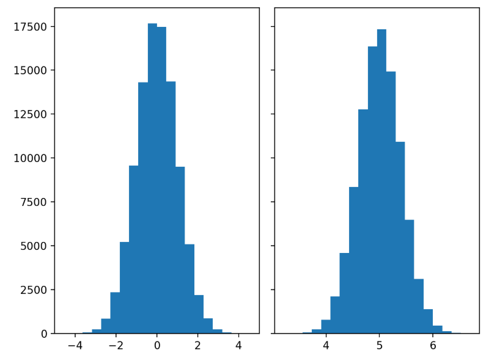 style="width:5.20167in;height:3.80194in" />原理：將連續數值資料分為多個區間（bins），以柱狀高度表示每個區
>
> 間的頻次，展示分佈形狀（如常態、偏態）。
>
> 適用情境：觀察資料的集中區段、偏態性或異常值，例如顧客消費金額、
>
> 網站停留時間。
>
> 優勢：直觀展示分佈特性，易於識別異常值或多峰分佈。
>
> 缺點：區間數量（bins）選擇影響結果，過多或過少可能掩蓋模式；不
>
> 適合少量數據。

5-30

>  第五章 大數據分析方法與工具
>
>  箱型圖（Boxplot）
>
>  style="width:6.295in;height:2.89667in" />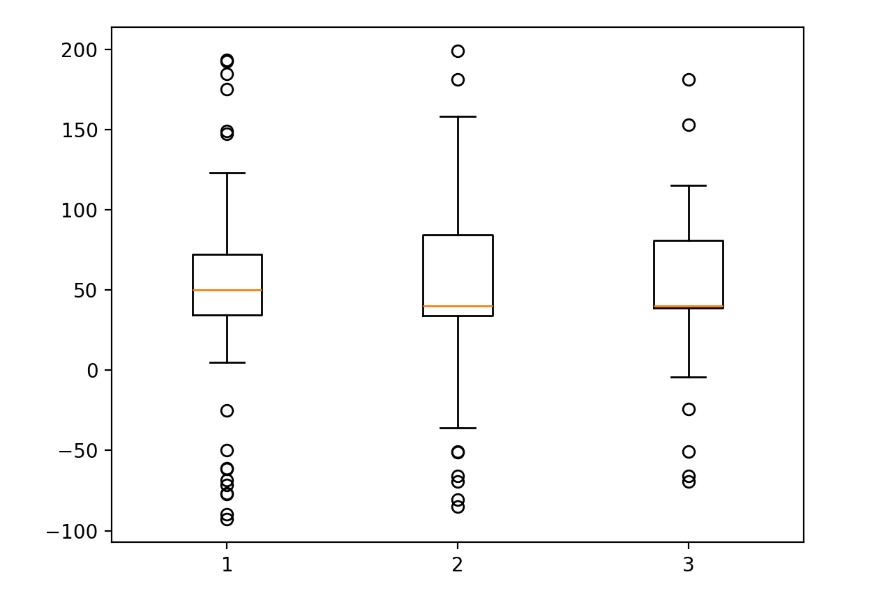原理：展示數據的中位數、四分位數（Q1、Q3）、鬚（whiskers）和離
>
> 群值（超出 1.5\*IQR 的點），反映分佈的集中趨勢和變異性。
>
> 適用情境：比較多組數據的分佈差異，例如不同地區的銷售額或產品類
>
> 別的評分。
>
> 優勢：直觀展示異常值和分佈差異，適合多組比較；對數據量要求低。
>
> 缺點：無法顯示分佈形狀（如多峰）；對異常值敏感。
>
> （可延伸參考小提琴圖（Violin plot））
>
> 5-31
>
>  第五章 大數據分析方法與工具
>
>  KDE 曲線（Kernel Density Estimation）
>
>  style="width:6.295in;height:2.89667in" /> style="width:5.45333in;height:4.04667in" />原理：通過核函數估計數據的機率密度，生成平滑曲線，展示分佈輪廓，
>
> 適合比較多組數據的重疊。
>
> 適用情境：觀察分佈形狀或不同群體的行為差異，例如年齡層的消費分
>
> 佈。
>
> 優勢：平滑顯示分佈，適合視覺化連續數據；能揭示多峰或偏態特性。
>
> 缺點：對核寬度（bandwidth）敏感，選擇不當可能掩蓋細節；不直觀
>
> 顯示異常值。

5-32

>  第五章 大數據分析方法與工具

（**2**）變數之間的關聯與結構視覺化

> 關聯性視覺化專注於探索兩個或多個變數間的關係、群聚或線性趨勢，幫助
>
> 識別潛在模式或共線性。
>
>  散佈圖（Scatter Plot）
>
>  style="width:6.295in;height:2.89667in" />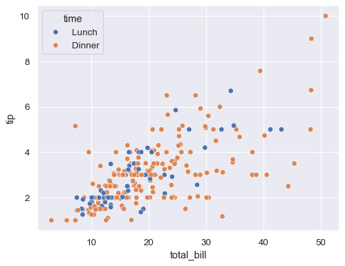 style="width:5.42833in;height:4.18833in" />原理：以二維座標展示兩個變數的分佈，點的位置反映變數值，搭配趨
>
> 勢線可顯示線性關係。
>
> 適用情境：分析價格與銷售量、廣告花費與轉換率的關聯性，或識別群
>
> 聚和異常值。
>
> 優勢：直觀展示相關性和異常點，適合探索性分析。
>
> 缺點：對高維數據無效；點過多時可能重疊，需透明度或分群處理。
>
> 5-33
>
>  第五章 大數據分析方法與工具
>
>  相關係數矩陣（Correlation Matrix）
>
>  style="width:6.295in;height:2.89667in" />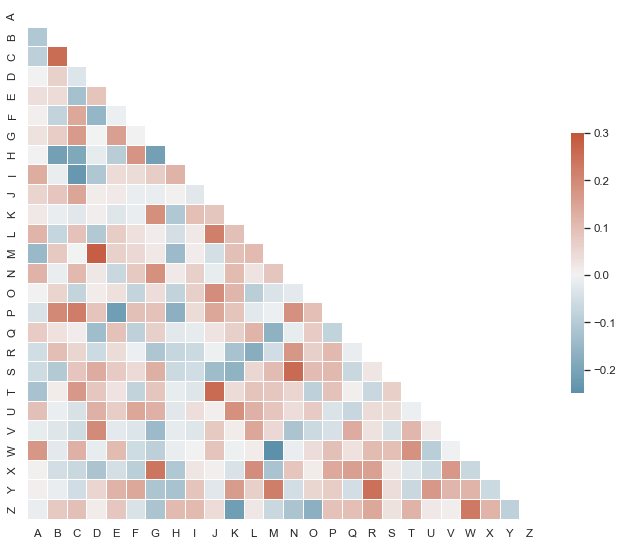 style="width:4.965in;height:4.34333in" />原理：計算多變數間的皮爾森相關係數（-1
> 到 1），以熱力圖形式用顏
>
> 色表示正負相關強度。
>
> 適用情境：快速檢視變數間的共線性，例如模型輸入變數的相關性分
>
> 析。
>
> 優勢：高效呈現多變數關係，易於識別潛在共線性問題。
>
> 缺點：僅限線性相關，非線性關係需其他方法（如互資訊）。

5-34

>  第五章 大數據分析方法與工具
>
>  熱力圖（Heatmap）
>
>  style="width:6.295in;height:2.89667in" />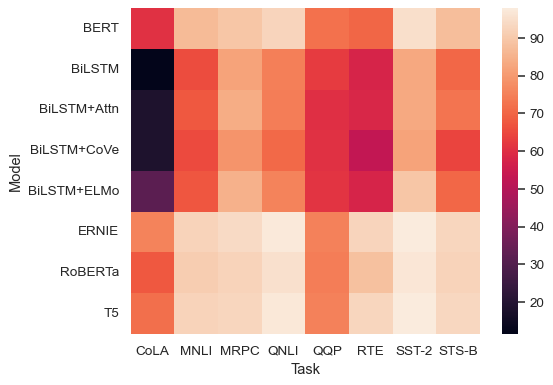 style="width:5.225in;height:3.63833in" />原理：顏色漸層表示變數值或密度，強調強弱變化或空間分佈。
>
> 適用情境：展示銷售區域表現、網站點擊熱區或變數間關係。
>
> 優勢：直觀呈現強度差異，適合空間或矩陣數據。
>
> 缺點：對顏色選擇敏感，過多類別可能混亂。
>
> 5-35
>
>  第五章 大數據分析方法與工具
>
> （**3**）類別型資料的比較與比例呈現
>
> 類別型資料的視覺化專注於展示群體差異、比例結構或頻次，幫助比較不同
>
> 類別的表現。
>
>  長條圖（Bar Chart）
>
>  style="width:6.295in;height:2.89667in" />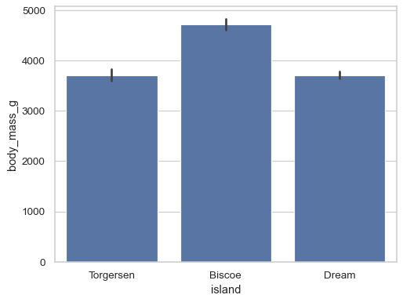 style="width:5.35333in;height:4.01014in" />原理：以柱狀高度表示類別的數值大小，適合比較不同類別的表現。
>
> 適用情境：比較各商品銷量、不同通路的營收或問卷選項頻次。
>
> 優勢：簡單直觀，適合少量類別比較。
>
> 缺點：類別過多時視覺擁擠，需分組或篩選。

5-36

>  第五章 大數據分析方法與工具
>
>  堆疊長條圖（Stacked Bar Chart）
>
>  style="width:6.295in;height:2.89667in" />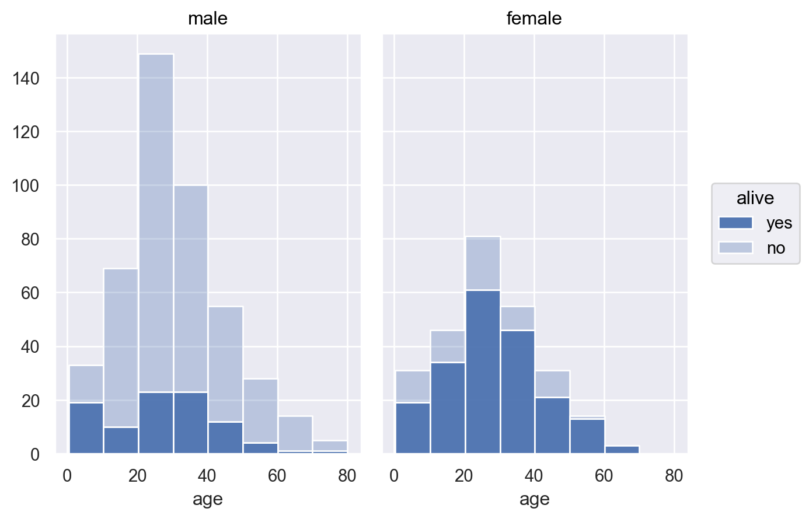原理：在長條圖基礎上，將各類別細分為子類別，展示整體和分群比例。
>
> 適用情境：比較不同地區的會員等級分佈或產品類別的銷售構成。
>
> 優勢：同時展示總量和比例結構，適合多維比較。
>
> 缺點：子類別過多時難以辨識，需簡化或使用交互式工具。
>
> 5-37
>
>  第五章 大數據分析方法與工具
>
>  圓餅圖（Pie Chart）
>
>  style="width:6.295in;height:2.89667in" />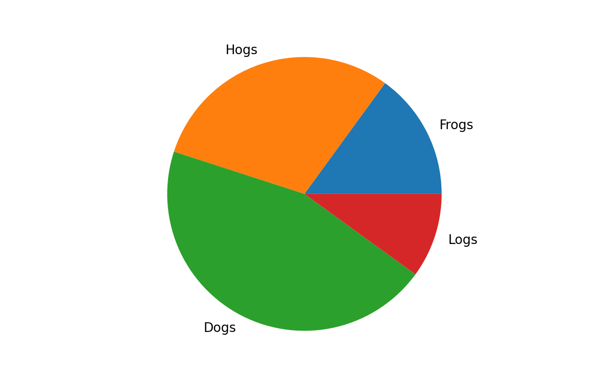 style="width:5.37833in;height:3.34833in" />原理：以扇形面積表示類別比例，展示整體構成。
>
> 適用情境：展示市占率、問卷選項比例，適合少量類別（5-6 類以內）。
>
> 優勢：直觀呈現比例，易於理解。
>
> 缺點：類別過多時視覺混亂，不適合精細比較。

5-38

>  第五章 大數據分析方法與工具

（**4**）時間序列資料的趨勢與變化

> 時間序列視覺化專注於展示數據隨時間的趨勢、週期性或事件影響，幫助分
>
> 析動態變化。
>
>  折線圖（Line Chart）
>
>  style="width:6.295in;height:2.89667in" />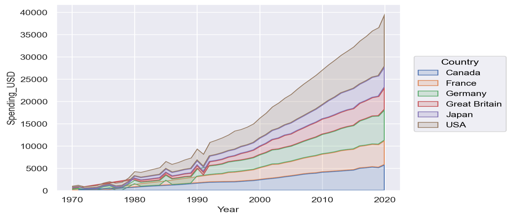原理：以連續線條表示時間點的數值變化，展示趨勢或週期。
>
> 適用情境：日銷售額、網站活躍用戶數、股票價格變化。
>
> 優勢：清晰展示時間趨勢，適合連續數據。
>
> 缺點：多條線重疊時難以辨識，需限制線條數量或使用交互式工具。
>
>  style="width:2.93819in;height:0.18833in" />**3.**
>
> 在大數據環境中，視覺化工具不僅需提供豐富的圖表類型和設計能力，還需
>
> 應對資料規模龐大、更新頻繁、來源多樣以及使用者多層角色（從分析師到管理
>
> 者）的挑戰。視覺化解決方案需滿足探索性分析、決策報表生成和即時監控等需
>
> 求，確保數據洞察直觀且可靠。本小節從「平台部署模式」和「呈現方式」兩個
>
> 維度介紹主流數據視覺化工具，結合實務選型建議，幫助使用者選擇合適平台並
>
> 避免資料失焦、顯著性膨脹等大數據挑戰。
>
> 5-39
>
>  第五章 大數據分析方法與工具
>
> （**1**）依平台部署模式分類
>
> 視覺化工具，除了報表工具、資料庫工具本身提供之視覺化功能外，可根據
>
> 部署方式分為自建型、半商業化平台和商業化平台，各有不同的技術要求和應用
>
> 情境。
>
>  工具內建報表功能
>
> 如 Google Sheets / Microsoft Excel 提供之資料視覺化功能，生成靜態和基
>
> 礎互動圖表。
>
> 特性：提供基本的圖表工具，通過選單與表格操作生成靜態和基礎互動
>
> 圖表（如圓餅圖、折線圖），支援雲端協作和即時更新。
>
>  style="width:6.295in;height:2.89667in" />應用情境：中小型數據的快速分析，如銷售報表、問卷結果展示。
>
> 優勢：無需程式設計，適合非技術使用者；雲端存取支援多人協作；可
>
> 與 Google/Microsoft 服務整合。
>
> 限制：圖表種類和客製化有限，不適合大規模數據（資料量大時，讀取
>
> 與呈現效能受限）或複雜視覺化。
>
>  自行搭建
>
> 強調程式化控制和客製化，適合資料科學家或技術團隊開發高度定制的視
>
> 覺化解決方案。這些工具允許通過程式碼定義圖表外觀、互動邏輯和資料
>
> 處理流程，特別適用於整合機器學習模型或處理大規模數據的情境。以下
>
> 介紹常見的工具/函式庫：
>
> Python：
>
> Matplotlib：基礎圖表庫，支援靜態圖表（如直方圖、散佈圖），適合
>
> 學術研究和簡單報表。
>
> Seaborn：基於 Matplotlib，提供高階統計圖表（如熱力圖、KDE 曲
>
> 線），簡化數據分析可視化。
>
> Plotly：支援互動式圖表（如長條圖、折線圖），適合 Web 應用和動
>
> 態儀表板，支援雲端部署。

5-40

>  第五章 大數據分析方法與工具
>
> Altair：基於 Vega-Lite，提供聲明式語法，簡化複雜圖表設計，適合
>
> 快速原型。
>
> R：
>
> ggplot2：基於圖層語法，生成高品質靜態圖表（如箱型圖、散佈圖），
>
> 廣泛用於統計分析。
>
> Shiny：構建互動式 Web 應用，支援動態儀表板，適合即時數據探索。
>
> JavaScript：
>
> D3.js：高度靈活，支援複雜互動式視覺化（如網路圖），適合 Web 開
>
> 發者。
>
>  style="width:6.295in;height:2.89667in" />Vega-Lite：簡化 D3.js
> 的聲明式框架，適合快速生成交互式圖表。
>
> Chart.js：輕量級庫，支援簡單互動圖表（如長條圖、折線圖），適合
>
> Web 嵌入。
>
>  半商業化平台（Hybrid / 輕量 BI 工具）
>
> 結合開源免費方案與商業化付費功能，提供 Web 界面和 SQL 查詢，平衡
>
> 易用性與靈活性。這些工具支援快速部署、資料庫整合和基礎儀表板，適
>
> 合中小型企業或分析師。「半商業化」源於其免費開源版本（吸引用戶試
>
> 用）與付費增值服務（如雲端託管、進階支持）的混合模式。
>
> Metabase：開源 BI 工具，提供直觀 SQL 查詢和儀表板，支援多資料
>
> 源。免費開源版適合自建，雲端版（須付費）提供 SSO 和協作功能。
>
> Redash：專注於數據查詢和視覺化，支援 SQL/NoSQL 資料源。開源版
>
> 免費，企業版提供技術支持。
>
> Apache Superset：開源 BI 平台，支援豐富圖表和即時查詢，可整合
>
> BigQuery、Snowflake。免費自建，雲端託管需付費。
>
> Grafana：專注於時間序列視覺化，適合即時監控。開源版免費，Grafana
>
> Cloud/企業版提供進階功能。
>
>  商業化視覺化平台
>
> 專為企業設計，提供拖拉式操作、權限管理和多資料源整合，適合跨部門
>
> 5-41
>
>  第五章 大數據分析方法與工具
>
> 協作和決策支持。強調使用者體驗和企業級穩定性。大多需要付費才可使
>
> 用。
>
> Tableau：功能強大，支援複雜儀表板和互動式分析，適合企業報表。
>
> Power BI：微軟產品，與 Azure 和 Office 整合，成本較低。
>
> Google Looker：雲端 BI 工具，支援即時查詢和數據建模。
>
> Qlik Sense：強調關聯式分析，適合探索性分析。
>
> SAP Lumira：專為 SAP 生態設計，支援企業數據整合。
>
> （**2**）依呈現方式分類
>
>  style="width:6.295in;height:2.89667in" />視覺化工具根據呈現方式分為靜態、動態、互動式和即時視覺化，各有不同
>
> 的應用情境和優勢。
>
>  靜態圖表（Static Visualization）
>
> 特性：生成固定圖片、PDF 或報表，無互動功能，適合正式報告或出版
>
> 物。
>
> 優勢：製作簡單，易於套版，適合簡報或印刷。
>
>  動態圖表（Animated Visualization）
>
> 特性：通過動畫展示數據變化，強調時間序列或排序變動。
>
> 優勢：吸引注意力，適合展示趨勢或比較（如銷售排名）。
>
>  互動式視覺化（Interactive Dashboards）
>
> 特性：支援使用者操作（如篩選、點擊），實現數據連動和個人化檢視。
>
> 優勢：適合多角色使用，支援深度探索。
>
>  style="width:3.135in;height:0.18833in" />**4.**
>
> 數據視覺化不只是圖像呈現，更是資料與人之間的溝通橋樑。面對大數據的
>
> 規模、複雜性與更新頻率，視覺化的目的不只是「美觀」或「豐富」，而是如何讓
>
> 資料在有限空間中，快速、清楚、正確地被理解與採納。

5-42

>  第五章 大數據分析方法與工具
>
> 本小節將介紹常見的跨領域大數據視覺化應用案例，並彙整設計圖表時應遵
>
> 循的關鍵原則，幫助分析者提升資訊傳達力、降低誤解風險，並兼顧技術可行性
>
> 與使用者需求。

（**1**）實務應用示例

> 數據視覺化在大數據環境中廣泛應用於多個行業，通過直觀的圖表和儀表板將
>
> 複雜數據轉化為可操作的洞察。以下舉例應用案例、介紹數據視覺化的實際應用：
>
>  零售與電商：銷售監控與顧客洞察
>
> 應用背景：
>
>  style="width:6.295in;height:2.89667in" />零售和電商企業需即時監控銷售表現、庫存狀況和顧客行為，以優
>
> 化定價、庫存管理和行銷策略。
>
> 應用內容：
>
> 呈現產品類別的日/週銷售趨勢，監控庫存水位和退貨率。
>
> 分析顧客分群（如高價值客戶）或地區銷售差異，識別熱銷品項。
>
> 視覺元素：
>
> 折線圖：展示銷售額或庫存隨時間的趨勢，突出週期性或異常變化。
>
> 長條圖：比較不同產品或地區的銷售分佈，快速識別表現最佳者。
>
> 熱力圖：顯示地區銷售熱區，輔助選址或行銷投放決策。
>
> 工具使用：
>
> Power BI、Tableau 支援拖拉式儀表板設計；Plotly、Seaborn 適合客
>
> 製化分析；Google Sheets 適合快速建立原型。
>
>  製造業：產能與設備運轉即時監控
>
> 應用背景：
>
> 製造業需監控設備運行狀態和產能，預測潛在故障以減少停機時間。
>
> 應用內容：
>
> 結合 IoT 感測器數據，即時顯示設備狀態（如振動、溫度）、產能達
>
> 成率和預測維修警示。
>
> 5-43
>
>  第五章 大數據分析方法與工具
>
> 分析歷史數據，識別故障模式，優化維護計劃。
>
> 視覺元素：
>
> 折線圖：展示設備參數（如溫度）的時間序列變化，檢測異常突增。
>
> 儀表圖（Gauge）：顯示產能達成率，直觀呈現當前狀態。
>
> 熱力圖：顯示設備故障風險分佈，輔助優先維護決策。
>
> 工具使用：
>
> Grafana 串接時序資料庫（如 InfluxDB）實現即時視覺化；Kibana 結
>
> 合 Elasticsearch 支援日誌分析。
>
>  金融與詐欺偵測：異常事件即時預警
>
>  style="width:6.295in;height:2.89667in" />應用背景：
>
> 金融機構需即時檢測詐欺交易或異常行為，降低風險和損失。
>
> 應用內容：
>
> 展示交易密度異常（如金額突增）、客戶活動突變（如異地登入）以
>
> 及自動化風險評分。
>
> 提供互動功能，允許分析師深入查閱可疑交易詳情。
>
> 視覺元素：
>
> 散佈圖：展示交易金額與頻次的關係，突出異常點。
>
> 熱力圖：顯示風險評分分佈，標示高風險區域。
>
> 折線圖：監控客戶活動的時間序列變化，檢測突變。
>
> 互動設計：提供時間過濾器、可點選深入查閱交易歷程，支援動態篩選。
>
> 工具使用：
>
> Tableau、Power BI 支援互動儀表板；Metabase 免費版適合快速原型；
>
> Apache Superset 支援 SQL 查詢。
>
>  健康與醫療：病歷視覺化與診療路徑追蹤
>
> 應用背景：
>
> 醫療機構需整合病歷數據，追蹤診療路徑，優化治療方案和資源分
>
> 配。

5-44

>  第五章 大數據分析方法與工具
>
> 應用內容：
>
> 整合多維數據於單一圖像，使用配色區分事件種類和風險等級（如
>
> 紅色表示高風險）。
>
> 提供時間軸視覺化，展示診療進程和關鍵事件。
>
> 視覺元素：
>
> 折線圖：展示生理指標的時間序列變化。
>
> 堆疊長條圖：顯示不同疾病類別的治療頻次。
>
> 時間軸圖（Timeline）：追蹤診療事件順序。
>
> 工具應用：
>
>  style="width:6.295in;height:2.89667in" />Shiny
> 支援互動式醫療儀表板；Tableau 整合多資料源；Matplotlib 適
>
> 合靜態報表。
>
>  智慧城市與物聯網：空間-時間混合型視覺化
>
> 應用背景：
>
> 智慧城市利用 IoT 數據監控交通、環境和公共設施，支援城市規劃
>
> 和資源分配。
>
> 應用內容：
>
> 交通壅塞監控：分析 GPS 數據，識別擁堵熱點。
>
> 污染分佈圖：展示空氣品質的空間分佈。
>
> 公共設施使用熱區：監控公園或充電站使用率。
>
> 視覺元素：
>
> 地理熱力圖：顯示交通或污染的空間分佈。
>
> 折線圖：展示擁堵或污染的時間趨勢。
>
> 互動式地圖：支援縮放和篩選，探索特定區域數據。
>
> 工具應用：
>
> GeoPandas 處理地理數據；Mapbox 繪製互動地圖；Grafana 支援時序
>
> 視覺化。
>
> 5-45
>
>  第五章 大數據分析方法與工具
>
> （**2**）設計原則與實作建議
>
> 視覺化設計需平衡美觀、功能性和可讀性，確保數據洞察清晰傳達。以下提
>
> 供五項視覺化設計原則，確保數據呈現上的正確與合理性：
>
>  原則一：以閱讀者為中心
>
> 視覺化需根據目標對象（工程師、業務主管、高階決策者）的需求設計，
>
> 聚焦其關注的指標（如 KPI、異常點）並符合其解讀習慣。決策圖表應
>
> 突出趨勢和異常，避免細節過載。
>
>  原則二：圖表類型要符合資料型態與目的
>
> 選擇圖表需匹配數據型態和分析目標：比較用長條圖，趨勢用折線圖，
>
>  style="width:6.295in;height:2.89667in" />比例用堆疊圖，關聯用散佈圖。時序數據應避免靜態表格，採用動態圖
>
> 表提升理解力。
>
>  原則三：簡化資訊、去除冗餘
>
> 圖表不宜同時呈現太多維度、顏色或標籤，避免資訊超載。
>
> 減少非必要線條、陰影、3D 效果等視覺雜訊。
>
>  原則四：合理使用顏色與標示
>
> 顏色需有一致性與意義，例如綠 = 成長、紅 = 下降、灰 = 不活躍。
>
> 關鍵資訊（如 KPI 未達）應有視覺強化（如高亮、警示符號）。
>
>  原則五：支援互動與探索
>
> 若使用者需進一步探索資料，應提供點擊、篩選、滑動視窗等互動功能。
>
> 儀表板應可根據角色動態切換內容（如業務看區域、行銷看活動）。

5-46

>  第五章 大數據分析方法與工具 style="width:1.77331in;height:0.43811in" /> style="width:1.66961in;height:0.43811in" /> style="width:1.25134in;height:0.24928in" /> style="width:0.50295in;height:0.50434in" />

1\. 在大數據的描述性分析中，最常用來呈現類別變數分佈的圖形是？

> （A）折線圖
>
> （B）箱型圖
>
> （C）長條圖
>
> （D）散佈圖

2\. 若要分析網站每日訪客數量的趨勢變化，最適合使用下列哪一種視覺化工具？

> （A）熱力圖
>
>  style="width:6.295in;height:2.89667in" />（B）折線圖
>
> （C）圓餅圖
>
> （D）直方圖

3\. 在大數據中進行關聯分析時，最常用來量化兩變數線性關係的指標為何？

> （A）變異數
>
> （B）t 值
>
> （C）相關係數
>
> （D）z 分數

4\. 為了分析社群網路使用者之間的互動結構，應使用下列哪種分析方法？

> （A）文字探勘
>
> （B）主成分分析
>
> （C）圖論分析
>
> （D）分群分析

5\. 在文字分析中，使用 TF-IDF 技術的主要目的是？

> （A）去除標點符號
>
> （B）將詞彙轉換為向量
>
> （C）辨識常出現的關鍵詞並排除常見詞
>
> （D）標示詞性與語法角色
>
> 5-47
>
>  第五章 大數據分析方法與工具
>
> 6\. 下列哪一項屬於異常偵測技術常見的應用情境？
>
> （A）定期報表自動生成
>
> （B）用戶行為分群
>
> （C）信用卡詐騙識別
>
> （D）影片推薦排序
>
> 7\. 若要從大量原始變數中萃取低維的代表性特徵，最常使用哪一種降維技術？
>
> （A）K-means
>
> （B）PCA（主成分分析）
>
> （C）t 檢定
>
>  style="width:6.295in;height:2.89667in" />（D）SMOTE
>
> 8\.
> 在大數據分析中，哪一種資料探勘技術可用於找出客戶購買行為中常見的組合
>
> 規則？
>
> （A）關聯規則分析
>
> （B）分類分析
>
> （C）時間序列分析
>
> （D）迴歸分析
>
> 9\. 箱型圖（Box Plot）如何呈現異常值？
>
> （A）以箱體內部大小表示
>
> （B）以特殊符號（如點或星號）單獨標記
>
> （C）自動刪除異常值
>
> （D）以中位數代表異常值
>
> 10\.
> 若企業需自動比對商品評論中出現的品牌名稱，建議使用哪一種處理流程？
>
> （A）結構化資料匹配
>
> （B）命名實體識別（NER）
>
> （C）群集分析
>
> （D）影像分類

5-48

>  第五章 大數據分析方法與工具 style="width:0.52837in;height:0.53266in" /> style="width:0.39369in;height:0.38925in" /> style="width:0.50075in;height:0.25062in" /> style="width:0.53356in;height:0.52754in" /> style="width:0.38851in;height:0.38413in" /> style="width:0.50006in;height:0.25062in" /> style="width:0.53356in;height:0.52754in" /> style="width:0.38851in;height:0.38413in" /> style="width:0.50006in;height:0.25062in" /> style="width:0.5232in;height:0.52754in" /> style="width:0.38851in;height:0.38413in" /> style="width:0.50006in;height:0.25062in" />

1\. <u>**Ans**（**C**）</u> 長條圖

> <u>解析：</u>長條圖（BarChart）可清楚顯示類別型變數的數量分佈，是描述性分析
>
> 中的基礎視覺工具。

2\. <u>**Ans**（**B**）</u> 折線圖

> <u>解析</u>：折線圖適合表現隨時間變動的連續數據，如日、週、月的趨勢觀察。

3\. <u>**Ans**（**C**）</u> 相關係數

> <u>解析：</u>相關係數（如
> Pearsonr）用於衡量兩變數間的線性關聯程度，常見於探
>
>  style="width:6.295in;height:2.89667in" />索性分析。

4\. <u>**Ans**（**C**）</u> 圖論分析

> <u>解析：</u>圖論分析可用於建構節點與邊的關係網路，適用於社群關係、推薦系統
>
> 等情境。

5\. <u>**Ans**（**C**）</u> 辨識常出現的關鍵詞並排除常見詞

> <u>解析</u>：TF-IDF（詞頻-逆文檔頻率）可強化具有辨識性的詞彙，抑制文檔中普
>
> 遍存在但不具代表性的詞語。

6\. <u>**Ans**（**C**）</u> 信用卡詐騙識別

> <u>解析：</u>異常偵測可用於發現違常模式，像是信用卡交易中異常消費、系統入侵
>
> 等風險情境。

7\. <u>**Ans**（**B**）</u> PCA（主成分分析）

> <u>解析：</u>PCA
> 是常見的線性降維方法，將原始特徵投影到新的主成分空間中，以
>
> 保留資料最大變異。

8\. <u>**Ans**（**A**）</u> 關聯規則分析

> <u>解析</u>：關聯規則分析（如 Apriori
> 演算法）可找出項目間常見組合，例如「買
>
> 牛奶常搭配買麵包」。

9\. <u>**Ans**（**B**）</u> 以特殊符號（如點或星號）單獨標記

> <u>解析：</u>箱型圖透過特殊符號（如點、星號）單獨標記異常值，使使用者易於辨
>
> 識數據中的異常資料點。
>
> 5-49
>
>  第五章 大數據分析方法與工具 style="width:6.295in;height:2.89667in" />
>
> 10\. <u>**Ans**（**B**）</u> 命名實體識別（NER）
>
> <u>解析：</u>NER
> 屬於自然語言處理技術，可自動從文字中辨識出品牌、人名、地點
>
> 等實體資訊。

5-50

>  第六章 大數據在人工智慧之應用 style="width:1.25822in;height:0.305in" /> style="width:3.76805in;height:0.305in" />
>
> 人工智慧技術的進展，已從模型架構創新逐步進入規模化應用階段。無論是

鑑別式 AI 在分類與預測任務中的精準判斷，或是生成式 AI 在文字、影像與語音

合成上的創造能力，其背後皆高度依賴龐大、多樣且持續更新的資料資源作為基

礎。大數據不僅是 AI 的訓練原料，更深刻地影響其模型行為、效能與部署模式。

> 與傳統資料科學不同，在人工智慧的實作與落地過程中，資料不再只是分析

對象，更是模型學習邏輯的一部分。從資料取得、標註與轉換，到模型訓練、加

速與部署，每一個環節都受到資料規模、型態、品質與可用性所制約。因此，理

解大數據如何參與並支撐 AI
的發展，是本章關注的核心。

> 本章「大數據在人工智慧之應用」承接前章對資料分析流程與工具的掌握，

進一步聚焦於 AI 實作情境下的大數據角色與關鍵挑戰。內容涵蓋以下四個子節：

 大數據與機器學習：

> 說明大數據如何影響機器學習模型的開發流程與加速策略，並探討資料與模

型整合的部署機制。

 大數據在鑑別式 **AI** 中的應用：

> 介紹分類、預測等鑑別式任務中的應用情境，並剖析資料標註、樣本偏態與

應用情境之間的連動關係。

 大數據在生成式 **AI** 中的應用：

> 解析大型語言與影像模型背後的資料來源選擇與處理邏輯，並關注資料品質

對生成內容的影響。

 大數據隱私保護、安全與合規：

> 探討 AI 訓練資料中潛藏的隱私風險與合規議題，並介紹資料匿名化、資料治

理與合規審查技術。

> 6-1
>
>  第六章 大數據在人工智慧之應用 style="width:0.53717in;height:0.47388in" /> style="width:0.6925in;height:0.22167in" />
>
>  style="width:2.07417in;height:0.22167in" />**6.1**
>
>  style="width:1.56805in;height:0.18833in" />**1.**
>
> 隨著資料規模增加、新資料產出速率加快，傳統的機器學習流程與模型設計
>
> 邏輯也面臨根本性挑戰。過去、模型訓練多建立於「完整樣本」「記憶體內計算」
>
> 「單機環境」的前提下進行；然而在大數據情境中，這些前提往往不再成立。資
>
>  style="width:6.295in;height:2.89667in" /> style="width:3.135in;height:0.18833in" />料的規模、速度、異質性與即時性，已重新定義了機器學習的實作方式與系統需
>
> 求。
>
> 在這樣的背景下，大數據不僅改變了模型開發的技術層面，更推動了整體 AI
>
> 系統架構的演進：從模型設計、資料擷取與預處理，到訓練加速、分散式部署與
>
> 持續監控，機器學習的每一個環節都需重新評估與調整。
>
> **2.**
>
> 在傳統機器學習流程中，往往假設資料量可控、型態一致且更新頻率有限，
>
> 能於單一機器或小型叢集中完成資料清理、特徵工程、模型訓練與驗證。然而，
>
> 當資料進入 TB 至 PB
> 等級的「大數據環境」後，這些前提不再成立，機器學習流
>
> 程需因應資料的規模、型態、速度與品質等變化，進行全面性重構。以下針對幾
>
> 項核心特性（包括五大特性
> Volume、Variety、Velocity、Veracity、Value），說明其
>
> 對整體機器學習流程的改變與挑戰。
>
> （**1**）資料規模大（**Volume**）
>
> 在大數據環境下，資料規模從 GB 延伸至 TB 甚至 PB 級別，已遠超過傳統單
>
> 機環境可承載的記憶體限制。這種規模的變化，對機器學習的資料處理、模型設
>
> 計與效能評估都帶來重大挑戰，必須採用專門設計的技術與架構進行應對。

6-2

>  第六章 大數據在人工智慧之應用
>
> 首先，在資料處理階段，由於訓練資料無法一次性載入記憶體，需採用分批
>
> 載入（Mini-Batch
> Loading）方式分段處理資料，或事先進行資料取樣（Sampling），
>
> 以提升處理效率與實作靈活性。在儲存架構上，則需配合分散式儲存系統（如
>
> HDFS）與支援列式壓縮的資料格式（如 Parquet）進行資料儲存與取用，以減少
>
> I/O 負擔並提升可擴展性。
>
> 接著，在模型訓練階段，演算法與運算架構必須具備良好的可擴展性，支援
>
> 跨節點並行計算。常見方法包括：
>
>  使用 Spark MLlib 在分散式記憶體架構下執行迴歸、分類等模型。
>
>  採用 Horovod 進行多 GPU 或多節點同步訓練，提升深度學習效率。
>
>  style="width:6.295in;height:2.89667in" /> 應用 TensorFlow MultiWorker
> Strategy 實現模型在多主機間的平行訓練與
>
> 容錯調整。
>
> 此外，資料量大也使得訓練與驗證過程耗時增加，因此在模型評估階段，需
>
> 調整傳統的靜態指標評估方式，改為支援分批累積計算的機制。例如，透過
>
> Streaming Confusion Matrix、滑動窗口式
> AUC（StreamingAUC）等方式動態累計
>
> 模型預測結果，有效支援長時間或多階段訓練流程中的持續性評估需求。
>
> 整體而言，面對龐大的資料規模，不僅需強化資料處理與模型訓練的分散式
>
> 能力，更需重構整體工作流程，使其具備可維運、可監控、可調整的彈性架構。
>
> 這也成為大數據時代下，企業導入 AI 須特別重視的基礎設計核心。

（**2**）資料型態多樣（**Variety**）

> 隨著數位裝置與應用情境的多樣化，現今的大數據資料已不再侷限於結構化
>
> 表格形式。來自社群平台的文字與貼文、影像監控錄影、穿戴式裝置的感測數據、
>
> 網站行為紀錄（Log）與 JSON、XML 等半結構化格式，使資料型態呈現高度異質
>
> 化與非結構化特性，對機器學習流程造成顯著影響。
>
> 在特徵工程階段，單一資料來源已無法滿足模型建構需求，需導入多模態資
>
> 料處理技術，將文字、影像、影音等不同型態的資料轉化為可學習的數值特徵。
>
> 例如：
>
> 6-3
>
>  第六章 大數據在人工智慧之應用
>
>  文字資料可透過詞嵌入（Word Embedding）技術（如 Word2Vec、GloVe、
>
> BERT）將語意資訊轉換為向量表示。
>
>  影像資料則常用卷積神經網路（Convolutional Neural Network, CNN）提取
>
> 影像特徵，形成 Encoder 表示。
>
>  音訊與感測器資料則可經由時序分析（如 Spectrogram 或 RNN Encoder）
>
> 進行時間特徵轉換。
>
>  若資料屬於多模態組合（如商品描述+商品圖片），則需進一步透過對齊技
>
> 術（Alignment）與融合策略（Fusion）整合各模態特徵。
>
> 這些異質資料在模型前處理階段若無妥善管理，極易造成欄位錯置、資料遺
>
>  style="width:6.295in;height:2.89667in" />失或語意誤對應等問題，因此在資料架構層級，需建構能夠容納多型態資料的統
>
> 一整合平台。資料湖（Data
> Lake）是目前主流方案之一，具備儲存不同結構與來
>
> 源資料的能力，搭配如 Apache Iceberg 或 Delta Lake
> 等技術，可進行版本控制、
>
> Schema 管理與即時查詢。
>
> 若企業已有數據倉儲系統，也可透過建立混合式架構，在倉儲中管理結構化
>
> 核心資料，在資料湖中收納半結構與非結構資料，再透過中介層進行轉換與特徵
>
> 對齊，形成統一的 AI 訓練資料集。
>
> 因此，資料型態的多樣性不僅提高了模型設計的挑戰，也促使 AI 團隊必須同
>
> 時掌握 NLP、CV、IoT
> 資料處理等跨領域技能，並善用資料整合平台與編碼策略，
>
> 才能實現在多模態條件下的穩定建模與部署。
>
> （**3**）資料品質與偏態問題
>
> 在大數據環境中，資料量雖然大幅提升，但「樣本數多」不代表「資料品質
>
> 好」。實務中常見的問題包括：類別不平衡（Class
> Imbalance）、標註錯誤（Label
>
> Noise）、資料冗餘與重複樣本、以及高比例的雜訊樣本。這些問題若未妥善處理，
>
> 不僅影響模型效能，更可能導致偏誤的預測與不公平的決策結果。
>
> 特別是鑑別式任務（Discriminative
> Tasks）中，如分類（Classification）與預
>
> 測（Prediction），樣本偏態會使模型過度學習主流類別（Majority
> Class），忽略或

6-4

>  第六章 大數據在人工智慧之應用
>
> 錯誤學習少數類別（Minority
> Class），導致模型在實務應用中出現系統性誤判，進
>
> 而影響預測結果的公平性與泛化能力。
>
> 為因應上述挑戰，常見的資料處理策略包括：
>
>  類別加權（Class Weighting）：在模型訓練時，根據各類別樣本數自動或手
>
> 動調整損失函數中的權重，使模型在訓練時對少數類別更為敏感。
>
>  欠抽樣與過抽樣（Under-sampling / Over-sampling）：針對資料分佈不均的
>
> 情況，透過刪除過多樣本或合成少數樣本（如 SMOTE）來平衡資料集，
>
> 提升模型對不同類別的辨識能力。
>
>  弱標註與主動學習技術（Weak Labeling / Active
> Learning）：在面對大規模
>
>  style="width:6.295in;height:2.89667in" />但標註品質參差的資料時，可透過規則式預標註、自動化推理、或以模型
>
> 協助進行樣本篩選與重標註，減少人工負擔並提升標註一致性。
>
>  資料清理與品質控制流程：建立標準化的資料清洗管道，例如移除明顯異
>
> 常值、偵測與合併重複樣本、針對高雜訊欄位進行欄位刪除或替代策略，
>
> 確保模型訓練基礎具備穩定性與代表性。
>
> 在模型評估層面，也應補充使用類別敏感指標（如 F1-score、Balanced
>
> Accuracy、MacroAUC
> 等），避免僅依賴整體準確率（Accuracy）這類易被主類別
>
> 主導的指標。當應用情境與公平性高度相關（如金融核貸、醫療風險評估），更應
>
> 導入公平性評估機制（如 Demographic Parity、Equalized Odds
> 等），協助觀測模型
>
> 是否對不同子群體產生不均結果。
>
> 綜上所述，大數據雖然帶來前所未有的樣本規模，但其品質與分佈偏態問題
>
> 亦為模型表現與可信度帶來深遠影響。唯有建構系統性的資料品質管理機制與公
>
> 平性驗證流程，才能在實務中建立可用、可信且合乎倫理的 AI 模型。

（**4**）資料流動快速（**Velocity**）

> 在物聯網（IoT）、金融交易、即時推薦與社群互動等應用情境中，資料不再
>
> 是批次生成，而是持續且高速產生的資料流（Data
> Stream）。這類環境要求模型能
>
> 在毫秒至秒級的時間內進行預測與反應，使得傳統的批次處理（Batch
> Processing）
>
> 6-5
>
>  第六章 大數據在人工智慧之應用
>
> 架構與模型更新機制無法滿足時效性需求，必須改採具備即時處理能力的技術與
>
> 流程設計。
>
> 為實現即時反應能力，整體系統需結合：
>
>  資料流分析（Stream Processing）架構：進行即時資料接收與前處理。
>
>  近即時模型更新（Near-Real-Time Model Update）：確保模型能夠持續學習
>
> 新樣本，維持對當下環境的準確性。
>
>  快速部署與預測回應機制：確保預測結果能即時傳遞至應用端。
>
> 在模型運作層面，需支援以下能力。
>
>  style="width:6.295in;height:2.89667in" /> 資料切片更新（Mini-batch or
> Streaming Ingestion）：將資料流拆分為小區
>
> 段進行逐步處理。
>
>  模型微調（Fine-tuning）：針對已訓練模型，在不破壞原有能力下，快速適
>
> 應新資料分佈（例如時間漂移、行為改變）。
>
>  增量學習（Incremental Learning）：模型具備持續學習能力，例如使用
> Online
>
> Learning 演算法（如 Perceptron、Naïve Bayes、SGDClassifier）或專門設計
>
> 的框架（如 Vowpal Wabbit、River），在資料流到達時即時更新模型權重。
>
> 常見的即時資料處理平台包含：
>
>  Apache Kafka：作為高吞吐量的資料訊息中介層，提供可靠的即時資料流
>
> 佇列服務。
>
>  Apache Flink 與 Spark Streaming：分別為低延遲與高容錯的資料流處理引
>
> 擎，支援窗口計算（Windowing）、狀態管理（Stateful Processing）與複雜
>
> 事件處理（CEP）。
>
>  Kinesis（AWS）、Pub/Sub（GCP）、Event Hub（Azure）：雲端平台提供的
>
> 串流架構，便於整合至大規模 AI 系統部署。
>
> 在實務部署中，為避免過於頻繁的全模型重訓，常採用動態模型選擇（Model
>
> Switching）或模型輪換（Model Rolling）策略，搭配 A/B 測試或 Canary
> Release，
>
> 逐步導入新模型版本，以維持服務穩定性與準確性。

6-6

>  第六章 大數據在人工智慧之應用
>
> 總結而言，資料流動速度的提升要求機器學習模型從「被動分析」轉向「即
>
> 時感知與反應」。唯有打造具備串流處理、增量更新與彈性部署能力的 AI
> 架構，
>
> 才能讓模型在面對高頻動態資料時持續保持效能與可信度。

（**5**）資料來源異質（**Veracity** **&** **Integration**）

> 在大數據環境下，資料來源不再單一，而是高度分散且多樣，來自於 IoT 裝
>
> 置、WebLog、企業內部 CRM 系統、第三方 API、社群平台、用戶端裝置等多元
>
> 通路。這些來源資料在格式、更新頻率、可信程度與語意標準上高度不一致，對
>
> 於資料整合、治理與應用帶來極大挑戰，也使資料整合與一致性管理成為機器學
>
>  style="width:6.295in;height:2.89667in" />習流程中不可忽視的前期核心工作。
>
> 首先，異質資料需先經過標準化與對齊處理，才能進入建模流程。不同來源
>
> 的資料可能採用不同命名規則、資料單位、編碼格式或時間戳記標準，若無統一
>
> 轉換，將導致資料語意混淆與預測誤差。為此，應建構統一欄位規範與轉換邏輯
>
> （Schema Mapping），並記錄資料轉換過程中的處理歷程與依賴關係。
>
> 為提升整體資料的可監管性與信任度，應導入以下機制：
>
>  資料編目（Data Catalog）：建立全域資料資源清單，統整資料集名稱、來
>
> 源、格式、擁有者、描述與應用情境，方便團隊共享與查詢。
>
>  資料來源追蹤（Data Lineage）：記錄資料從產生、傳輸、處理到應用的每
>
> 一階段轉換流程與技術路徑，確保資料的可追溯性。
>
>  資料版本控制與元資料管理：透過如 Delta Lake、LakeFS 等框架，針對資
>
> 料集提供版本紀錄與差異比對能力，並搭配元資料系統（如 ApacheAtlas、
>
> Amundsen）進行欄位屬性管理與存取權限設計。
>
> 這些機制能幫助企業釐清資料責任邊界（如部門來源、第三方 API 許可）、掌
>
> 握資料流轉與轉換風險，並在模型訓練過程中及早偵測異常變異，預防模型效能
>
> 下降或產生預測偏誤。
>
> 特別值得注意的是，當資料來源異質且動態時，若無即時監測與治理措施，
>
> 極易發生數據漂移（Data Drift）或概念漂移（Concept
> Drift）。前者指資料分佈在
>
> 6-7
>
>  第六章 大數據在人工智慧之應用
>
> 時間上的變化（如消費行為改變），後者則為資料與標籤之間的關聯改變（如詐騙
>
> 行為模式變異）。這些問題若未即時察覺與回應，將造成模型在實務應用中的效能
>
> 迅速惡化。
>
> 因此，應在機器學習流程中嵌入資料漂移偵測模組，如統計檢定（Kolmogorov-
>
> Smirnov Test）、KL 散度（KL
> Divergence）等方法，並與模型效能監測工具（如
>
> Evidently、WhyLabs）搭配，形成可持續維運的數據品質與模型穩定性管理體系。
>
> （**6**）資料價值密度低（**Value**）
>
> 在大數據環境中，大量資料雖隨時產生，但其中真正對決策或模型訓練有意
>
>  style="width:6.295in;height:2.89667in" />義的訊息比例往往極低，形成所謂的低價值密度（Low
> Value Density）問題。這代
>
> 表 AI 系統不僅需處理資料規模與速度，更要能從雜訊中有效識別高價值樣本與
>
> 特徵。具體挑戰包括：
>
>  資料中混雜大量與任務無關的欄位或樣本，導致模型學習過程冗餘且不穩
>
> 定。
>
>  特徵冗餘、資料重複與非代表性樣本增加模型的過擬合風險。
>
>  有價值的長尾樣本（如異常行為、少數事件）被主流資料掩蓋。
>
> 對策上，可透過：
>
>  特徵選擇（Feature Selection）與維度縮減（Dimensionality
> Reduction）技
>
> 術（如 Lasso、PCA）以濃縮有效資訊。
>
>  高資訊密度抽樣法，如根據資訊增益或貢獻度篩選樣本。
>
>  導入自動化資料探索（Automated EDA）與資料可視化工具（如 Sweetviz、
>
> Pandas Profiling）輔助人員快速找出價值區段。
>
>  在標註階段結合主動學習（Active Learning）策略，有效聚焦人力標註於
>
> 具代表性的資料點。
>
> 當資料價值密度被有效提升，不僅可減少模型訓練與運算資源耗損，也能強
>
> 化模型的可解釋性與效益導向，使 AI 系統更符合實務部署的商業價值需求。

6-8

>  第六章 大數據在人工智慧之應用
>
>  style="width:3.32986in;height:0.18833in" />**3.**
>
> 在資料量大與速度快的情境下，機器學習模型的訓練已無法仰賴單機或傳統
>
> 批次訓練架構完成。大數據環境下的模型訓練，必須同時面對運算資源瓶頸、資
>
> 料載入限制、模型收斂時間過長等問題，並需根據任務特性選擇最合適的加速技
>
> 術與訓練框架。
>
> 以下將從分散式架構設計、訓練效能最佳化策略與進階技術應用面向說明如
>
> 何因應這些挑戰。

（**1**）分散式模型訓練架構（**Distributed** **Training**）

>  style="width:6.295in;height:2.89667in" />在大數據環境下，模型規模與資料量動輒超出單機的記憶體與運算限制，傳
>
> 統訓練架構無法滿足效率與穩定性的需求。為此，分散式訓練架構成為主流解法，
>
> 透過跨多節點平行分工，提升整體訓練效能與資源使用效率。
>
> 分散式訓練主要可分為以下三種模式，依任務特性與硬體資源進行選擇與組合：
>
>  資料並行（Data Parallelism）
>
> 將訓練資料分批分發至多台工作節點（workers），每台使用相同模型副
>
> 本。
>
> 每次訓練後合併梯度（gradient aggregation），更新全域參數。
>
> 適合影像分類、NLP 等樣本量大但模型中等的情境。
>
>  模型並行（Model Parallelism）
>
> 將一個大型模型的不同部分分配至不同節點運算（例如超大參數量的
>
> 語言模型）
>
> 用於單機記憶體無法容納整個模型的情況。
>
> 適合 GPT、BERT 等超大模型訓練。
>
>  混合式並行（Hybrid Parallelism）
>
> 將資料並行與模型並行結合使用，以達成橫向擴展與模型放大雙重目
>
> 標。
>
> 6-9
>
>  第六章 大數據在人工智慧之應用
>
> （**2**）訓練效能最佳化策略
>
>  硬體加速
>
> 使用 GPU/TPU 加速訓練，支援張量運算與大規模矩陣計算。
>
> 雲端平台（如 AWS SageMaker、Google Vertex AI）可彈性配置計算資
>
> 源。
>
>  混合精度訓練（Mixed Precision Training）
>
> 結合單精度（FP32）與半精度（FP16）浮點數計算，加速訓練同時節省
>
> 記憶體。
>
> 特別適用於語音、影像與語言模型，且與 GPU 架構相容性佳。
>
>  style="width:6.295in;height:2.89667in" /> 梯度累積與梯度壓縮
>
> 當 mini-batch 因記憶體限制無法設得太大時，可使用梯度累積（Gradient
>
> Accumulation）技術，在多個小 batch 中先計算梯度再一次性更新參數，
>
> 有效提升收斂穩定性。
>
> 同時，在分散式訓練中，梯度的頻繁同步會造成傳輸壅塞，可透過梯度
>
> 壓縮（如 Top-k Sparsification、Quantization）或延遲同步（Delayed
>
> Gradient），減少傳輸量與頻率，提升整體平行訓練效能。
>
>  Early Stopping 與 Checkpointing
>
> 為避免模型過度訓練（Overfitting）或資源浪費，早停機制（Early
>
> Stopping）可在驗證集表現未持續提升時自動中止訓練，節省計算資源。
>
> 同時，導入模型檢查點（Checkpointing）機制，可定期儲存模型權重與
>
> 訓練狀態，使訓練可中斷後續並接續訓練。
>
> （**3**）進階應用情境與延伸挑戰
>
>  資料異步輸入與資料前處理瓶頸
>
> 在高頻率資料流與多來源整合的情境下，傳統同步處理流程易形成效
>
> 能瓶頸。可透過同步化優化資料管線（Data Pipeline）設計，搭配高效

6-10

>  第六章 大數據在人工智慧之應用
>
> 資料格式（如 TFRecord、Parquet）與快取策略（例如 TensorFlow 的
>
> tf.data API），提升資料讀取效率並減少 I/O 負擔。
>
>  模型微調與多階段訓練
>
> 面對任務多樣化與資源有限的挑戰，可採取預訓練（Pre-training）與微
>
> 調（Fine-tuning）兩階段訓練方式。先於大規模資料上進行通用特徵學
>
> 習，再針對特定任務進行調校，不僅可提升模型效能，也能有效降低訓
>
> 練成本。
>
>  持續學習（Continual / Online Learning）
>
> 在資料隨時間變動或環境改變的情境中，靜態模型容易失效。導入持續
>
>  style="width:6.295in;height:2.89667in" /> style="width:2.74292in;height:0.18833in" />學習（Continual
> Learning）或線上學習（Online Learning）技術，有助
>
> 於模型持續適應新資料分佈，常見應用包括推薦系統、金融交易預測、
>
> 詐欺偵測等。關鍵挑戰在於避免災難性遺忘（Catastrophic Forgetting）
>
> 與平衡新舊知識。

**4.**

> 在傳統的機器學習流程中，模型開發與資料處理往往由分析師或資料科學家

在本地環境完成，僅針對單次輸出進行實驗與驗證。然而，在大數據與企業級 AI

導入的環境中，模型不只是單次訓練的成果，更是需要與資料流、業務邏輯與平

台架構緊密整合的服務化元件。

> 本小節聚焦於從大數據平台開始，如何將資料前處理、模型訓練、評估、部

署到線上應用整合成一個可維運、可擴展的系統流程。此流程也稱為 端對端機器

學習流程（End-to-End MLPipeline），並成為 MLOps（Machine Learning
Operations）

實務的核心。

> 6-11
>
>  第六章 大數據在人工智慧之應用
>
> （**1**）資料整合與處理管線（**Data** **Processing**）
>
>  資料來源整合：
>
> 整合來自 IoT、Web log、CRM、交易系統等異質資料源，導入資料湖
>
> （Data Lake）或資料倉儲（Data Warehouse）作為統一儲存基礎。
>
>  資料前處理流程自動化：
>
> 運用 Spark、Airflow、Kubeflow 等工具自動化資料處理流程，涵蓋欄位
>
> 轉換、缺失值處理、資料清洗與特徵萃取，支援批次或串流模式。
>
>  資料版本與追蹤：
>
> 導入元資料管理與版本控管（如 Delta Lake、MLflow Tracking），確保
>
>  style="width:6.295in;height:2.89667in" />資料處理流程的可追溯性與再現性，強化模型開發基礎。
>
> （**2**）模型訓練與驗證（**Model** **Training** **&** **Validation**）
>
>  自動化訓練流程（Pipeline）：
>
> 使用機器學習平台（如 SageMaker Pipeline、Vertex AI、KubeFlow
>
> Pipelines）串接訓練腳本、模型調參、交叉驗證與評估指標計算。
>
>  模型版本管理與實驗追蹤：
>
> 使用 MLflow、Weights & Biases 等工具追蹤模型架構、參數與訓練資
>
> 料版本。
>
>  多模型與多階段流程管理：
>
> 支援多任務串接（如前段進行分類模型判斷，後段再串接推薦模型提供
>
> 個人化內容）與條件分支處理邏輯（If-Then Routing）。
>
> （**3**）模型部署與上線（**Model** **Deployment**）
>
>  彈性部署模式選擇：
>
> Batch Serving：
>
> 定期批次產出預測結果（如每日風險預測報表）供下游使用。

6-12

>  第六章 大數據在人工智慧之應用
>
> Online Serving / API Serving：
>
> 以 RESTful API 或 gRPC 提供即時查詢預測服務。
>
> Streaming Inference：
>
> 結合 Kafka、Flink、Spark Streaming 等技術，支援低延遲事件驅動推
>
> 論。
>
>  容器化與可擴展部署：
>
> 可使用如 Docker 等容器技術、將模型封裝為容器，搭配 Kubernetes 管
>
> 理部署與彈性擴充，並導入 A/B 測試、藍綠部署等策略，降低版本更
>
> 新風險。

（**4**）持續監控與模型維運（**Monitoring**
**&** **Lifecycle** **Management**）

>  模型效能與服務監控：
>
> 持續監控預測準確率、延遲、錯誤率與系統可用性，並偵測資料漂移
>
> （Data Drift）與概念漂移（Concept Drift）等模型效能衰退指標。
>
>  自動重訓與模型版本更新：
>
> 設定門檻條件（如精確度低於標準值）自動觸發模型重訓，並結合 CI/CD
>
> 流程完成模型部署更新，確保系統持續最佳化。
>
>  MLOps 工作流程整合：
>
> 建立跨資料工程、模型開發與平台運維的整合架構，實現機器學習系統
>
> 的標準化、可監管與可持續運行。
>
> 6-13
>
>  第六章 大數據在人工智慧之應用 style="width:0.53717in;height:0.47388in" /> style="width:0.6925in;height:0.22167in" />
>
>  style="width:1.91083in;height:0.22167in" /> style="width:1.1525in;height:0.22167in" />**6.2** **AI**
>
>  style="width:1.56805in;height:0.18833in" />**1.**
>
> 目前發展與實用性最高的人工智慧系統應用類型、可分為兩類：鑑別式
>
> （Discriminative）與生成式（Generative）模型。其中，鑑別式 AI
> 著重於「區分」、
>
> 「分類」與「預測」，是目前企業與組織在實務應用中最常導入的 AI
> 類型之一。
>
>  style="width:6.295in;height:2.89667in" />無論是產品推薦、詐欺偵測、疾病診斷、客戶流失預測、內容分類，背後皆為典
>
> 型的鑑別式任務。
>
> 在這些應用中，大數據提供了更豐富的樣本、更複雜的特徵組合與更細緻的
>
> 行為模式，成為提升模型泛化能力與預測準確度的關鍵條件。然而，資料品質、
>
> 來源多樣性、標註成本與樣本偏差等問題，也同步對模型設計與系統實作帶來挑
>
> 戰。
>
> 本節將說明大數據如何支撐鑑別式 AI 任務的發展，並分析資料來源整合、特
>
> 徵選擇與標註策略等對模型表現的實質影響。特別強調在真實世界中，如何平衡
>
> 效能、可用性與維護成本，建構可落地的鑑別式 AI 解決方案。
>
>  style="width:2.35125in;height:0.18833in" />**2.**
>
> 鑑別式 AI 的核心任務是對輸入資料進行分類或預測，是機器學習中最具應
>
> 用廣度的任務類型之一。在大數據環境中，來自多平台、連續更新的龐大資料為
>
> 複雜預測模型提供了豐富資訊，廣泛應用於商業決策、自動化流程、風險監測與
>
> 個人化服務等情境。鑑別式 AI
> 的成功不僅依賴模型選擇，還與資料品質、型態及
>
> 標註方式密切相關，需結合前述資料準備與品質管理策略（如缺失率、一致性比
>
> 率）。以下為常見應用情境與任務目標：

6-14

>  第六章 大數據在人工智慧之應用

（**1**）金融與風險管理

>  任務目標：
>
> 信用評分（Credit Scoring）：預測客戶是否可能違約（如貸款拖欠）。
>
> 詐欺偵測（Fraud Detection）：從交易資料中識別潛在詐欺行為。
>
> 反洗錢（AML）異常辨識：分析交易模式與人際網路，偵測異常或可疑
>
> 活動。
>
>  輸入資料特性：
>
> 結構化資料：客戶屬性（年齡、收入、信用紀錄）、交易記錄（金額、
>
> 時間、地點）。
>
>  style="width:6.295in;height:2.89667in" />半結構化資料：日誌資料（如
> API 交易記錄）。
>
> 多模態資料：結合交易資料與社群網路圖（Graph Data）。
>
>  常見模型：
>
> 邏輯迴歸（Logistic Regression）：簡單且可解釋，適合信用評分。
>
> 隨機森林（Random Forest）：處理高維特徵，適合詐欺偵測。
>
> 圖神經網路（Graph Neural Network, GNN）：分析 AML 中的網路關係。
>
> XGBoost/LightGBM：高效處理不平衡資料（如詐欺少數類別）。
>
>  實務案例：
>
> 某銀行使用 XGBoost 模型，結合客戶交易記錄與信用資料，預測違約
>
> 風險，準確率提升至 85%，減少 20%壞帳損失。
>
>  操作步驟：
>
> 收集結構化資料（如 SQL 查詢交易紀錄）並清理缺失值與異常值。
>
> 特徵工程：生成衍生特徵（如交易頻率、金額變異）。
>
> 訓練模型並使用交叉驗證（Cross-validation）優化參數。
>
> 部署模型並監測效能（例如 ROC 曲線、F1 分數）。
>
>  挑戰：
>
> 資料不平衡（詐欺交易比例低，需過採樣或 SMOTE）。
>
> 隱私保護：需遵守《個人資料保護法》，匿名化敏感欄位（如身分證號）。
>
> 6-15
>
>  第六章 大數據在人工智慧之應用
>
> 異常值影響：未處理的異常值可能導致模型誤判（如 t 檢定中的均值偏
>
> 誤）。
>
> （**2**）零售與電商推薦
>
>  任務目標：
>
> 顧客流失預測（Churn Prediction）：預測哪些顧客可能停止使用服務。
>
> 客戶分群與精準行銷：根據特徵將客戶分群，推送個人化廣告。
>
> 商品分類/價格預測：自動分類商品並預測銷售價格趨勢。
>
>  輸入資料特性：
>
>  style="width:6.295in;height:2.89667in" />結構化資料：購買紀錄、用戶屬性（年齡、性別）。
>
> 半結構化資料：點擊日誌（JSON）、瀏覽行為。
>
> 非結構化資料：商品評論（文字）、商品圖片（影像）。
>
> 多模態資料：結合購買紀錄、評論與圖片。
>
>  常見模型：
>
> 決策樹/隨機森林：簡單且穩健，適合分群與流失預測。
>
> 深度學習（如 LSTM）：處理時間序列資料（如價格趨勢）。
>
> 多模態模型（如 CLIP）：結合文字與影像進行商品分類。
>
>  實務案例：
>
> 某電商平台使用隨機森林預測顧客流失，結合購買與點擊資料，識別
>
> 90%的高風險顧客，行銷活動回應率提升 12%。
>
>  挑戰：
>
> 資料一致性：多來源資料格式不一致（如日期格式不統一），影響異數
>
> 分析（ANOVA）的結果。
>
> 標註成本：商品分類需大量人工標註，可結合弱監督式標註。
>
> 即時性：推薦系統需即時處理串流資料（如 Apache Kafka）。

6-16

>  第六章 大數據在人工智慧之應用

（**3**）客服與文本分類

>  任務目標：
>
> 對話分類：自動分類客服對話（如帳號問題、物流問題）。
>
> 情感分析：預測用戶評論的情感（正向、中立、負向）。
>
> 內容過濾與審查：判別社群貼文是否違規（如仇恨言論）。
>
>  輸入資料特性：
>
> 非結構化資料：客服對話、用戶評論、社群貼文（文字）。
>
> 半結構化資料：日誌格式的對話記錄（JSON）。
>
>  常見模型：
>
>  style="width:6.295in;height:2.89667in" />傳統機器學習：Naive
> Bayes、SVM（常應用於簡單文本分類）。
>
> 深度學習：BERT、RoBERTa（可用於高準確度情感分析與對話分類）。
>
> 規則模型：正規表示式（Regular expression）（適合處理簡單違規檢測）。
>
>  實務案例：
>
> 某電信公司使用 BERT 模型分類客服對話，自動識別 95%的物流問題，
>
> 減少 30%人工處理時間。
>
>  挑戰：
>
> 標註品質：情感分析需保持一致性標籤，否則可能影響模型準確度。
>
> 語言多樣性：台灣用語（如「讚」）需在地化詞典支持。
>
> 資料品質：高缺失率或邏輯錯誤，將影響卡方檢定結果。

（**4**）醫療與健康科技

>  任務目標：
>
> 疾病預測與診斷：根據病歷、影像或生理訊號預測疾病風險。
>
> 保險理賠異常分析：判斷理賠申請是否異常或可疑。
>
> 臨床決策支援：協助醫生選擇最佳治療路徑。
>
>  輸入資料特性：
>
> 結構化資料：病歷（年齡、性別、檢查結果）。
>
> 6-17
>
>  第六章 大數據在人工智慧之應用
>
> 非結構化資料：醫療影像（X 光、MRI）、醫師筆記（文字）。
>
> 多模態資料：結合病歷、影像與筆記。
>
>  常見模型：
>
> CNN：醫療影像分類（如 ResNet、VGG）。
>
> 隨機森林/XGBoost：結構化病歷資料預測。
>
> 多模態模型：結合 CNN 與 BERT 處理影像與文字。
>
>  實務案例：
>
> 某醫院使用 ResNet 模型分析 X 光片，診斷肺炎準確率達 92%，減少
>
> 25%誤診率。
>
>  style="width:6.295in;height:2.89667in" /> 挑戰：
>
> 資料隱私：需遵守《個人資料保護法》，加密敏感資料（如病患身分）。
>
> 標註成本：醫療影像需專家標註，成本高，可用主動學習優化。
>
> 異常值：未處理的異常值（如錯誤生理訊號）影響 t 檢定結果。
>
> （**5**）資安與異常偵測
>
>  任務目標：
>
> 登入行為異常辨識：判斷是否為異常裝置或可疑地點登入行為。
>
> 惡意流量分類：根據封包特徵識別攻擊行為（如 DDoS）。
>
> 釣魚郵件分類：自動判斷電子郵件是否具有詐騙特徵。
>
>  輸入資料特性：
>
> 結構化資料：登入記錄（IP、時間）、封包元數據。
>
> 半結構化資料：日誌（JSON、CSV）。
>
> 非結構化資料：郵件內容（文字）。
>
>  常見模型：
>
> 孤立森林（Isolation Forest）：異常偵測，適合處理高維資料。
>
> 深度學習：LSTM（序列資料，如流量模式）、BERT（電子郵件分類）。
>
> 規則模型：正規表示式（簡單釣魚檢測）。

6-18

>  第六章 大數據在人工智慧之應用
>
>  實務案例：
>
> 某企業使用孤立森林模型分析登入日誌，識別 98%的異常登入，減少
>
> 40%安全事件。
>
>  挑戰：
>
> 資料不平衡：異常事件比例低，需特殊處理（如 SMOTE）。
>
> 即時性：資安任務需低延遲處理，依賴串流平台（如 Kafka）。
>
> 重複值：日誌重複記錄可能影響卡方檢定結果。
>
>  style="width:3.135in;height:0.18833in" />**3.**
>
>  style="width:6.295in;height:2.89667in" />在鑑別式 AI
> 任務中，資料的「品質」、「型態」與「標註方式」直接影響模型
>
> 效能與實用性。雖然大數據提供了龐大的資料規模與潛在訊息，但要將這些原始
>
> 資料有效轉化為可供訓練模型的輸入，仍面臨跨平台整合、資料一致性、標註成
>
> 本與資料偏差等挑戰。
>
> 本小節將說明鑑別式 AI 中常見的輸入資料型態與資料來源形式，並說明實
>
> 務上資料標註的主要策略，以及資料融合與整合過程中需注意的技術細節。

（**1**）常見輸入資料型態與特性

>  結構化資料（Structured Data）
>
> 來源：
>
> 關聯式資料庫，如 ERP、CRM 或 POS 系統產生的交易記錄、用戶屬
>
> 性、設備資訊。
>
> 特性：
>
> 欄位明確、格式規範，適合直接轉換為表格式特徵（features），如數
>
> 值或類別欄位。
>
> 應用案例：
>
> 信用評分：使用客戶收入、貸款紀錄預測信用風險。
>
> 客戶分類：根據購買歷史與人口屬性進行客群分群。
>
> 6-19
>
>  第六章 大數據在人工智慧之應用
>
> 設備預測維修：利用感測器數據（如溫度、振動）預測機器故障。
>
>  半結構化資料（Semi-structured Data）
>
> 來源：
>
> JSON、XML 格式的 API 回傳資料、伺服器日誌（Log）、行為記錄
>
> （如點擊流）。
>
> 特性：
>
> 具有層次結構（如嵌套的 JSON），但欄位可能動態變動，需解析
>
> （Parsing）或展平（Flattening）。
>
> 應用案例：
>
>  style="width:6.295in;height:2.89667in" />網站行為分析：解析用戶點擊日誌，提取瀏覽路徑與停留時間。
>
> API 資料預測：使用天氣 API 的 JSON 資料預測銷售量。
>
>  非結構化資料（Unstructured Data）
>
> 來源與類型：
>
> 文字：客服對話、產品評論、社群媒體貼文、電子郵件。
>
> 影像：醫療影像（如 X 光片）、產品照片、監控影像。
>
> 聲音：客服錄音、語音指令、環境聲音。
>
> 特性：
>
> 無固定結構，需特徵萃取（Feature Extraction）轉為模型可用的數值
>
> 表示。
>
> 應用案例：
>
> 文字：情緒分析（NLP）判斷顧客評論的正面/負面情緒。
>
> 影像：醫療影像分類（CNN）診斷疾病。
>
> 聲音：語音辨識（ASR）轉錄客服對話。
>
>  多模態資料（Multi-modal Data）
>
> 來源：
>
> 結合多種資料型態，如用戶屬性（結構化）+ 產品評論（文字）+ 商
>
> 品圖片（影像）。

6-20

>  第六章 大數據在人工智慧之應用
>
> 特性：
>
> 需融合多來源特徵，模型需支援多輸入架構或特徵級融合。
>
> 應用案例：
>
> 電商推薦系統：結合用戶購買紀錄、評論文字與商品圖片進行個人
>
> 化推薦。
>
> 醫療診斷：整合病患病歷（結構化）、醫師筆記（文字）與 CT 影像
>
> （影像）。

（**2**）資料標註策略與實務考量

>  style="width:6.295in;height:2.89667in" />資料標註為鑑別式 AI
> 提供監督學習所需的標籤（Labels），但標註成本、品質
>
> 與效率是實務中的關鍵挑戰。以下為常見標註策略及其優缺點與實務建議：
>
>  人工標註（Manual Labeling）
>
> 優點：
>
> 標註準確度高，特別適合需要專業知識的任務（如醫療影像診斷、法
>
> 律文件分類）。
>
> 限制：
>
> 成本高、耗時，需專業人力；大規模資料標註難以擴展。
>
> 實務案例：
>
> 醫療團隊標註 X 光片是否有病灶，確保診斷準確性。
>
>  弱監督式標註（Weak Supervision）
>
> 定義：
>
> 使用規則、啟發式方法或第三方資料（如情緒詞典）自動生成標籤，
>
> 減少人工成本。
>
> 優點：
>
> 速度快、成本低，適合大規模資料。
>
> 限制：
>
> 誤標風險高，標籤品質可能不穩定，需後續清理。
>
> 6-21
>
>  第六章 大數據在人工智慧之應用
>
> 實務案例：
>
> 使用情緒詞典自動標註社群貼文的情感（正面/負面），再人工校正部
>
> 分樣本。
>
>  群眾外包標註（Crowdsourcing）
>
> 定義：
>
> 透過平台（如 Amazon Mechanical Turk、Appen）將標註任務分散給
>
> 大量非專業工作者。
>
> 優點：
>
> 成本低、速度快，適合簡單任務（如圖片分類、文字標籤）。
>
>  style="width:6.295in;height:2.89667in" />限制：
>
> 標註品質參差不齊，需一致性檢查與多工審核。
>
> 實務案例：
>
> 電商平台透過 Appen 標註產品圖片是否包含特定物件（如「鞋子」）。
>
>  主動式學習（Active Learning）
>
> 定義：
>
> 模型預測低置信度樣本，優先交由人工標註，優化標註效率。
>
> 優點：
>
> 減少標註量，適合成本高、資料量大的情境。
>
> 限制：
>
> 需初始標註資料與迭代訓練，技術門檻較高。
>
> 實務案例：
>
> 詐欺檢測模型中挑選不確定的交易（置信度\< 0.6）交由專家標註，
>
> 降低總標註成本。
>
> （**3**）跨來源資料整合與資料一致性挑戰
>
> 鑑別式 AI 常需整合來自多平台的資料（如 ERP、API、日誌），但跨來源整合
>
> 面臨以下挑戰與解決方案：

6-22

>  第六章 大數據在人工智慧之應用
>
>  主鍵不一致
>
> 挑戰：
>
> 不同系統的用戶 ID、裝置 ID 或訂單編號定義不同，無法直接對應。
>
> 實務案例：
>
> 電商平台的 CRM 與 POS 系統使用不同客戶 ID，導致資料無法合
>
> 併。
>
>  時間戳記與時區對齊
>
> 挑戰：
>
> 跨系統資料的時間欄位可能有延遲、格式差異或時區不一致。
>
>  style="width:6.295in;height:2.89667in" />實務案例：
>
> 網站日誌（UTC）與本地 POS 交易（台北時間）時間戳記不一致，
>
> 影響行為分析。
>
>  資料更新頻率不一致
>
> 挑戰：
>
> 部分來源為即時串流（如感測器資料），部分為批次同步（如 ERP 資
>
> 料），導致整合的時間視窗不一致。
>
> 實務案例：
>
> 即時點擊流與每日更新的庫存資料難以同步，影響推薦系統。
>
>  資料品質不均
>
> 挑戰：
>
> 不同來源的資料可能有缺失值、不一致格式或邏輯錯誤，影響整合
>
> 品質。
>
> 實務案例：
>
> API 資料缺少關鍵欄位，ERP 資料單位不統一（如「1,000 克」/「1
>
> 公斤」）。
>
> 6-23
>
>  第六章 大數據在人工智慧之應用
>
> （**4**）資料品質與統計推論的關聯
>
> 資料品質直接影響鑑別式 AI 與統計推論的可靠性，與先前討論的品質指標
>
> （缺失率、異常值比率等）緊密相關：
>
>  缺失值：
>
> 高缺失率可能導致特徵不完整，影響模型訓練（如線性迴歸）或 t 檢定
>
> 的均值估計。
>
>  異常值：
>
> 未處理的異常值可能放大模型誤差，影響獨立樣本 t 檢定或分類模型的
>
> 決策邊界。
>
>  style="width:6.295in;height:2.89667in" /> 重複值：
>
> 重複記錄可能高估樣本權重，影響卡方檢定或模型訓練的平衡性。
>
>  一致性錯誤：
>
> 不統一的格式導致無法正確聚合特徵，影響 ANOVA 或相關檢定的結
>
> 果。
>
>  邏輯錯誤：
>
> 不合理的標籤（如錯誤分類）會導致模型學習錯誤模式，降低預測準確
>
> 度。

6-24

>  第六章 大數據在人工智慧之應用 style="width:0.53717in;height:0.47388in" /> style="width:0.6925in;height:0.22167in" />
>
>  style="width:1.91083in;height:0.22167in" /> style="width:1.1525in;height:0.22167in" />**6.3** **AI**

**1.**

> 生成式人工智慧（GenerativeAI）已成為近年來 AI 技術最具代表性的發展方

向，從大語言模型（LLM）、圖像生成模型，到音樂合成與影片創作，其核心能力

來自於「根據大量資料學習表徵，再據此產生新的內容」。這些模型不僅需要龐大

的訓練資料支撐，更依賴資料的多樣性、品質、一致性與來源合法性，才能產生

可信、穩定與具語境感的生成結果。

> 與鑑別式 AI 相比，生成式模型對資料的需求更為「開放性」與「語意驅動」。

輸入資料不再侷限於有標註的標準格式，更可能涵蓋非結構化的資料如網頁內容、

開放文本、使用者行為紀錄，甚至需要進一步分析語境、邏輯結構與情緒等隱性

特徵。大數據在此不僅是資料規模問題，更關注語料多元性與資訊的完整語境維

度。

> 這樣的資料來源與應用情境也帶來一系列挑戰，例如：資料偏誤放大、內容

版權模糊、生成結果不穩定等問題，迫使開發者需在資料收集、篩選與處理階段

採取更嚴謹的策略，甚至將資料治理與倫理風險納入訓練流程設計。

**2.**

> 生成式 AI（如語言模型、圖像生成模型、音樂合成或影片創作等）的表現高

度依賴於訓練資料的品質與特性。不同於鑑別式 AI
專注於明確的輸入-輸出對應，

生成式模型需從龐大且多樣的資料中學習語言結構、視覺特徵、聲音模式或其他

模態的表徵，以生成自然、可信且具語境感的內容。這些資料涵蓋多模態形式，

包括文字（如新聞、社群貼文）、圖片（如產品照片）、影像（如監控影片）、聲音

（如客服錄音）與感測器資料（如溫度、運動數據），甚至更多模態（如多模態結

合的醫療影像與病歷）。資料選擇將直接影響生成內容的品質、實用性與公平性。

> 6-25
>
>  第六章 大數據在人工智慧之應用
>
> 在大數據環境中，資料來源的規模與多元性帶來機會，也伴隨挑戰，如偏誤
>
> 放大、品質不均與時效性不足。有效的資料選擇需考慮多樣性、代表性、品質與
>
> 時效性，並結合簡單的品質管理策略（如檢查缺失率）與資料治理，確保模型生
>
> 成結果符合應用需求並遵守倫理規範（如《個人資料保護法》）。
>
> 本節從以下四個面向，簡要分析資料選擇對生成式 AI 內容品質的影響，提供
>
> 實務案例與基本對策，協助讀者理解資料準備的核心原則。
>
> （**1**）資料多樣性
>
> 資料是否涵蓋不同模態（如文字、圖片、聲音）、語言風格（正式、口語）、
>
>  style="width:6.295in;height:2.89667in" />主題（科技、醫療）與使用情境（客服、創作）。
>
> 若資料缺乏多樣性，模型可能生成單調、不自然或無法適應新場景的內容。
>
> 例如，僅用科技文章訓練的語言模型可能無法生成醫療建議；僅用靜態圖片訓練
>
> 的模型可能無法處理動態影像。
>
> （**2**）資料代表性與偏誤風險
>
> 資料代表性（Representativeness）指的是訓練資料是否能準確涵蓋其所欲建模
>
> 的整體群體，避免過度集中於特定族群、文化、語言或背景。若資料來源存在偏
>
> 誤，則生成式 AI
> 模型所學習到的語言結構、價值觀與敘事方式也會受到影響，導
>
> 致生成結果產生系統性偏見（Systematic Bias），進而影響公平性與可信度。
>
> 這類風險可從以下幾個層面觀察：
>
>  性別與族群偏誤：
>
> 如文字生成模型中，語料過度代表某一性別或種族（如以男性視角為主
>
> 的商業文本），則模型可能產生性別刻板印象的語句。
>
> 例如將醫師、工程師自動預設為男性角色，護士或助理預設為女性角色。
>
>  地區與文化偏誤：
>
> 如文字生成模型中，若語料主要來自特定語系或文化（如北美英文新聞
>
> 或歐洲社群媒體），模型所產生的語言風格與話題選擇將難以反映其他
>
> 地區的語言習慣或文化脈絡，造成跨語言應用障礙。

6-26

>  第六章 大數據在人工智慧之應用
>
>  社經地位偏誤：
>
> 若資料集中於高收入、都市區用戶，則生成內容在產品推薦、廣告設計
>
> 等任務中可能對中低收入或偏鄉族群的需求理解不足，進而產生商業
>
> 與倫理風險。
>
>  資料來源平台偏誤：
>
> 如文字生成模型中，若訓練語料主要來自特定社群平台或論壇，其用語
>
> 風格與觀點可能偏離主流人口，導致模型無法處理較正式或多元語境
>
> 的輸入內容。
>
>  style="width:6.295in;height:2.89667in" />若未在資料收集與前處理階段妥善控制這些偏誤，將可能導致
> AI 模型在應
>
> 用中持續放大原始資料的不平等與歧視現象，不僅違反 AI
> 倫理原則，也可能違反
>
> 資料公平性與企業社會責任的要求。

（**3**）資料品質與內容正確性

> 資料是否具備正確的語法、格式、資訊真實性以及無雜訊，涵蓋多模態資料，
>
> 例如文字（無錯字、語法正確）、圖片（高解析度、無模糊）、聲音（低雜訊、清
>
> 晰）、感測器資料（精確、無異常）等。廣義的資料品質還包括資料代表的意義正
>
> 確性（例如是否符合實際情境或專業標準）、資料穩定度等。
>
> 低品質資料可能導致生成式 AI 產出語意混亂、視覺失真或不可靠的內容，降
>
> 低用戶信任與應用價值。例如文字資料中的錯字可能使模型生成不標準的繁體中
>
> 文；模糊圖片可能導致生成影像失真；雜訊聲音可能影響語音生成自然度。

（**4**）資料時效性與資料更新

> 資料時效性是指資料是否能夠即時反映當前環境的變化與最新情境，並持續
>
> 維持更新頻率，以確保訓練資料與現實同步。此特性對於生成式 AI
> 尤為關鍵，特
>
> 別是在處理多模態資料時，常見如：
>
>  文字資料：如新聞報導、社群平台內容、法律與政策文件。
>
>  圖像資料：如產品設計、街景變化、流行穿搭等。
>
> 6-27
>
>  第六章 大數據在人工智慧之應用
>
>  語音資料：如新興用語的語音指令。
>
>  感測器資料：如即時氣候、交通或設備監控資訊。
>
> 若資料無法即時更新，將可能造成模型輸出的內容與現況脫節，進而降低實
>
> 用性與使用者信任。例如：
>
>  對於語言模型而言，若語料中缺乏近期流行語彙（如「斜槓青年」、「元宇
>
> 宙」、「碳中和」等），將可能無法正確理解或使用這些詞彙。
>
>  針對圖片生成模型而言，若訓練資料停留於舊有風格與產業設計，可能無
>
> 法產出符合當前審美與市場趨勢的影像。
>
>  在語音應用中，對於新興口語化詞彙與指令的辨識能力也會隨時間下降。
>
>  style="width:6.295in;height:2.89667in" />**3.** 典型應用情境
>
> 生成式 AI 的快速發展推動了內容創作、互動應用與資料強化等領域的變革，
>
> 應用範圍涵蓋語言生成（如行銷文案）、圖像生成（如廣告設計）、多模態生成（如
>
> 文字轉圖像）及資料增強（如模擬數據）。這些應用依賴大規模、多樣化的資料來
>
> 源，涵蓋多模態資料如文字（新聞、社群貼文）、圖片（產品照片）、聲音（語音
>
> 指令）、感測器資料（即時環境數據）。不同任務對資料格式、語域與品質的需求
>
> 各異，影響資料處理策略與治理重點，需結合先前討論的資料選擇原則（如多樣
>
> 性、品質、時效性）。
>
> 以下介紹生成式 AI 常見之應用情境與資料來源：
>
>  語言生成（Text Generation）
>
> 自動文本撰寫：生成新聞摘要、電商商品描述、電子郵件草稿等。
>
> 客製化對話系統：智慧客服（如處理訂單問題）、虛擬助理（如台灣旅
>
> 遊問答）。
>
> 程式碼生成與補全：輔助軟體開發（如自動生成 Python 程式碼）。
>
>  圖像生成（Image Generation）
>
> 廣告與設計輔助：生成產品圖、風格轉換（如台灣特色包裝）、去背處
>
> 理。

6-28

>  第六章 大數據在人工智慧之應用
>
> AI 藝術創作：生成台灣風景插畫、卡通角色。
>
> 視覺模擬：室內設計預覽、時尚搭配模擬。
>
>  多模態生成（Multimodal Generation）
>
> 文字生成圖像：根據文字描述生成廣告圖（如 DALL·E）。
>
> 圖像生成文字：為產品圖生成描述或標題。
>
> 視訊與語音合成：生成講解影片、語音導航（如台灣旅遊導覽）。
>
> 跨模態應用：結合文字、圖片、聲音生成互動內容（如虛擬分身）。
>
>  資料增強與模擬訓練資料（Synthetic Data）
>
> 增補訓練資料：解決樣本不足或不平衡問題（如少數族群語料）。
>
>  style="width:6.295in;height:2.89667in" />模擬罕見情境：生成詐欺行為資料、模擬感測器故障。
>
> 強化模型魯棒性：測試模型在異常情況下的表現。
>
> 6-29
>
>  第六章 大數據在人工智慧之應用 style="width:0.53717in;height:0.47388in" /> style="width:0.6925in;height:0.22167in" />
>
>  style="width:3.22792in;height:0.22167in" />**6.4**
>
>  style="width:1.56805in;height:0.18833in" />**1.**
>
> 隨著人工智慧技術在醫療、金融、電商、教育等領域的深入應用，訓練模型
>
> 所需的資料也愈趨龐大、精細與個人化。這些資料中往往包含大量的個人資訊、
>
> 行為紀錄與敏感內容，使得資料隱私保護、安全管理與法律合規成為 AI
> 發展不可
>
>  style="width:6.295in;height:2.89667in" />忽視的核心議題。
>
> 大數據技術雖然能強化模型效能與預測精度，但也同時放大了資料再識別風
>
> 險、資料濫用的可能性與不當自動化決策的後果。例如，即使刪除姓名，仍可能
>
> 透過結合裝置資訊、地理位置或行為軌跡重新識別個人；又如，企業在未取得明
>
> 確同意的情況下使用歷史數據進行模型訓練，將面臨潛在的法規責任。
>
> 本節將說明 AI 系統在大數據應用情境下，應如何評估與防範個資風險，導入
>
> 資料匿名化與差分隱私等保護技術，並建立合規的資料取得、處理與內部治理機
>
> 制，以因應日益嚴格的國際與在地法規要求（如
> GDPR、CCPA、台灣個資法等）。
>
>  style="width:1.76292in;height:0.18833in" /> style="width:0.98125in;height:0.18833in" /> style="width:1.37122in;height:0.18833in" />**2.** /
>
> 生成式 AI 在醫療、金融、電商、教育等領域廣泛應用，需處理大量個人資料
>
> （如病歷、交易紀錄、顧客行為、學習數據），涵蓋多模態資料（文字、圖片、聲
>
> 音、感測器）。這些資料雖提升模型效能，但也帶來再識別風險，即使移除姓名等
>
> 直接識別資訊，仍可能透過其他欄位（如行為軌跡、地理位置）間接識別個人，
>
> 導致隱私外洩或違反《個人資料保護法》。為此，組織需導入資料匿名化與隱私強
>
> 化技術（PETs），降低風險並確保合規，保護使用者權益。
>
> 以下介紹個資識別風險與保護技術，分析風險來源、實務案例與簡單對策，
>
> 協助分析者平衡模型效能與隱私需求，符合《個人資料保護法》與國際規範（如
>
> GDPR、CCPA）。

6-30

>  第六章 大數據在人工智慧之應用

（**1**）個資識別風險

>  定義：
>
> 直接識別資訊：可直接指向個人的資料，如姓名、身分證號、電話、裝
>
> 置 ID。
>
> 準識別資訊：單獨無識別性，但組合後可能指向個人，如性別、出生年
>
> 月、郵遞區號、瀏覽紀錄。
>
> 敏感資料：需特別保護的資訊，如健康紀錄、信用狀況、宗教信仰。
>
> 風險來源：
>
> 橫向比對：結合外部資料（如公開社群貼文）識別個人。
>
>  style="width:6.295in;height:2.89667in" />時間軸拼接：透過行為軌跡（如
> GPS、購買時間）推斷身份。
>
> 保護不足：僅形式移除識別資訊（如僅遮蔽姓名），無法防止再識別。
>
>  實務案例：
>
> 醫療：某 AI 診斷模型使用未匿名化的病歷（含年齡、診斷紀錄），經外
>
> 部資料比對識別患者，違反《個人資料保護法》，罰款 30 萬元。
>
> 電商：某推薦系統因未匿名化顧客瀏覽紀錄，遭駭客透過行為軌跡識別
>
> 用戶，品牌信任度降低 15%。
>
> 金融：某詐欺檢測模型使用未脫敏的交易資料，經時間軸拼接洩漏用戶
>
> 身份，影響用戶滿意度 10%。
>
> 教育：某學習分析模型因未移除學生年級與地區資料，導致身份外洩，
>
> 學校合規性受質疑。

（**2**）資料匿名化技術

> 在大數據與人工智慧的訓練與應用中，資料往往涉及大量的個人資訊與敏感
>
> 內容。為降低隱私洩漏風險，除了資料取得階段的合法合規把關外，技術面也須
>
> 實施資料匿名化（Data Anonymization）與隱私強化技術（Privacy-Enhancing
>
> Technologies, PETs）。
>
> 以下從三個面向系統性介紹相關技術與其應用考量：
>
> 6-31
>
>  第六章 大數據在人工智慧之應用
>
>  基礎資料匿名化技術
>
> 資料匿名化（Data Anonymization）旨在移除或模糊可識別個人的資訊
>
> （Personally Identifiable Information,
> PII），以降低重識別風險，同時保留
>
> 數據的分析價值。基礎匿名化技術簡單易用，適合報表生成、初步數據分
>
> 享或低敏感情境，常用於企業內部或與第三方協作。以下為常見技術及其
>
> 應用：
>
> 遮蔽（Masking）
>
> 定義：用特殊符號或假數據替換敏感欄位的部分或全部內容，例如
>
> 將姓名「王大明」處理為「王○○」，或將身份證號「A123456789」
>
>  style="width:6.295in;height:2.89667in" />遮蓋為「A12\*\*\*\*\*\*89」。
>
> 應用情境：報表展示、非正式分析、測試環境數據生成。
>
> 優點：簡單快速，保留數據格式（如電話號碼長度）。
>
> 限制：僅隱藏部分資訊，易被推測或結合其他數據還原。
>
> 雜湊處理（Hashing）
>
> 定義：對身份欄位（如帳號、Email）進行單向雜湊（如 SHA-256），
>
> 生成不可逆的固定長度字串，用於比對或連結而非直接顯示。
>
> 應用情境：匿名化用戶 ID、跨資料庫比對、資料去重複。
>
> 優點：不可逆，安全性高，支援一致性比對。
>
> 限制：若原始數據範圍小（如短 ID），易受彩虹表攻擊；無法用於數
>
> 值分析。
>
> 泛化（Generalization）
>
> 定義：降低資料精度，如將出生日期「1987-03-12」轉為「1980 年
>
> 代」，或將地址「台北市信義區基隆路」轉為「台北市」。
>
> 應用情境：公開數據集、統計分析、降低精細定位風險。
>
> 優點：簡單有效，保留數據分佈特性。
>
> 限制：精度損失可能影響分析（如精準年齡分群）。

6-32

>  第六章 大數據在人工智慧之應用
>
> 資料分桶（Bucketing）與分組
>
> 定義：將連續數值轉為離散區間，如將收入「58,000 元」轉為「50K–
>
> 60K」，或將年齡「32 歲」轉為「30-39 歲」。
>
> 應用情境：統計報表、人口分析、降低數值精確性風險。
>
> 優點：保留數據趨勢，降低個體識別風險。
>
> 限制：區間設計需謹慎，過細分桶仍可能暴露個體。
>
> 隨機擾動（Noise Injection）
>
> 定義：為數值資料加入小幅隨機噪音（如高斯噪音），如將薪資
>
> 「50,000」擾動為「50,123」，使單筆數據難以反推。
>
>  style="width:6.295in;height:2.89667in" />應用情境：數值型數據分享、統計分析。
>
> 優點：保留數據統計特性（如均值、方差）。
>
> 限制：噪音幅度需平衡，過大影響分析，過小無法保護隱私。
>
>  進階隱私強化技術
>
> 隨著重識別攻擊（如連結攻擊、差分識別分析）和生成式 AI 模型記憶問
>
> 題的增加，進階隱私強化技術成為高度敏感領域（如醫療、金融）的首選。
>
> 這些技術在保護隱私的同時，確保模型性能與數據可用性，適用於 AI 訓
>
> 練和數據分享情境。
>
> K-匿名（K-Anonymity）/ L-多樣性（L-Diversity）/
> T-接近性（T-Closeness）
>
> 定義：
>
> ○ K-匿名：確保每筆數據在資料集中至少與 K-1 筆其他數據在準識
>
> 別欄位（如年齡、性別）上相同，降低個體識別風險。
>
> ○ L-多樣性：在 K-匿名基礎上，確保敏感欄位（如疾病）在每個分
>
> 組內有至少 L 種不同值，防止屬性推測。
>
> ○ T-接近性：進一步要求敏感欄位的分佈與整體數據集接近，減少
>
> 分佈偏差推測。
>
> 應用情境：公開數據集、醫療研究、金融風險分析。
>
> 優點：結構化數據保護效果顯著，易於實現。
>
> 6-33
>
>  第六章 大數據在人工智慧之應用
>
> 限制：計算複雜度高，過高 K 值可能損失數據精細度；對非結構化
>
> 數據（如文本）效果有限。
>
> 差分隱私（Differential Privacy）
>
> 定義：在查詢結果或模型訓練中加入嚴格控制的隨機噪音（如拉普
>
> 拉斯或高斯噪音），確保單筆數據的存在與否對結果影響微乎其微，
>
> 從而保護個體隱私。
>
> 應用情境：統計查詢、機器學習模型訓練（如差分隱私隨機梯度下
>
> 降，DPSGD）。
>
> 優點：提供數學保證的隱私保護，適用於結構化與非結構化數據。
>
>  style="width:6.295in;height:2.89667in" />限制：噪音可能降低模型精度，需平衡隱私與效用；計算成本較高。
>
> 聯邦學習（Federated Learning）
>
> 定義：模型在各客戶端（設備或機構）本地訓練，僅傳送參數更新
>
> （如梯度）至中央伺服器整合，避免原始數據外洩。
>
> 應用情境：醫療聯盟（跨院數據訓練）、行動裝置鍵盤預測。
>
> 優點：數據保留本地，降低外洩風險；支援分散式環境。
>
> 限制：傳輸成本高，需防範參數逆向推導攻擊。
>
> 同態加密（Homomorphic Encryption）
>
> 定義：允許在加密數據（密文）上直接進行數學運算（如加法、乘
>
> 法），解密後結果與明文運算一致，確保數據全程加密。
>
> 應用情境：雲端 AI 模型訓練、金融數據分析、醫療數據外包計算。
>
> 優點：數據全程保密，無需解密即可計算；基於密碼學提供強安全保
>
> 證。
>
> 限制：計算效率低，特別是完全同態加密（FHE），需高效能能硬體。
>
> **3.**
> **AI**
>
> AI 系統的效能依賴於大量高品質數據，但資料的蒐集、處理與使用若未遵循
>
> 法律與倫理規範，可能導致隱私侵害、鉅額罰款、商譽損失或法律訴訟。在
> GDPR
>
> （歐盟一般資料保護規範）、CCPA（加州消費者隱私法）、台灣個人資料保護法等

6-34

>  第六章 大數據在人工智慧之應用
>
> 法規的約束下，AI
> 模型訓練階段必須納入合規風險考量，確保資料取得、儲存與
>
> 使用的合法性與透明性。本節介紹合規資料處理的原則、合法依據、實務風險及
>
> 技術機制，幫助企業在 AI 應用中平衡效能與隱私保護。

（**1**）合規資料處理的基本原則

> 以下 GDPR、CCPA 及台灣個人資料保護法等主流法規對個人資料使用的核
>
> 心原則，構成 AI 訓練資料合規的基礎：
>
>  合法性、正當性與透明性
>
> 定義：資料蒐集與使用必須合法，需向使用者明確告知蒐集目的、使用
>
>  style="width:6.295in;height:2.89667in" />範圍及處理方式。
>
> 實務要求：提供清晰的隱私政策或同意書，確保使用者知情（如說明資
>
> 料用於訓練推薦模型）。
>
>  目的限制原則（Purpose Limitation）
>
> 定義：資料蒐集需指定明確目的，後續使用不得超出或變更原目的。
>
> 實務要求：在蒐集時定義用途（如「用於客服模型訓練」），避免二次利
>
> 用（如用於廣告投放）。
>
>  資料最小化原則（Data Minimization）
>
> 定義：僅蒐集完成任務所需的最少資料，避免過度蒐集。
>
> 實務要求：僅保留關鍵特徵（如交易金額、時間），去除非必要欄位（如
>
> 不必要知道婚姻狀況）。
>
>  保存期限限制
>
> 定義：個人資料不得無限期儲存，需設定保留期限，逾期刪除或匿名化。
>
> 實務要求：建立資料生命週期管理（如 2 年後自動匿名化）。
>
>  可追蹤與可刪除性
>
> 定義：使用者有權存取、更正或刪除其個人資料（GDPR 的「被遺忘
>
> 權」）。
>
> 實務要求：提供資料查詢與刪除介面，確保快速響應用戶請求。
>
> 6-35
>
>  第六章 大數據在人工智慧之應用
>
> （**2**）**AI** 訓練資料取得的合法依據與適用範圍
>
> 根據 GDPR、台灣個資法等規範，AI 訓練資料的合法取得需具備以下依據之
>
> 一，範疇依具體情境而定：
>
>  明確同意（Explicit Consent）
>
> 定義：使用者在資料蒐集前主動同意，並清楚了解使用目的與方式。
>
> 實務要求：提供勾選同意選項，說明用途（如「您的對話將用於訓練客
>
> 服模型」），並允許撤回同意。
>
>  契約履行必要（Necessary for Contract Performance）
>
> 定義：資料處理為履行與使用者的契約（如服務提供）所需。
>
>  style="width:6.295in;height:2.89667in" />實務要求：明確契約內容，確保資料使用與服務相關（如信用卡風險評
>
> 估）。
>
>  公共利益或學術研究（Public Interest or Scientific Research）
>
> 定義：在數據經過去識別化處理、無法直接或間接辨識特定個人後，可
>
> 用於促進公共利益或學術研究，如醫療健康研究、政策分析或社會科學
>
> 研究。
>
> 實務要求：
>
> 通過獨立倫理委員會（IRB）或內部審查機制評估研究目的正當性、
>
> 數據必要性及隱私保護措施。
>
> 公開研究目的與處理方式，保留匿名化歷程與審查紀錄，接受監管
>
> 稽核。
>
> 非個人資料（Non-Personal Data）
>
> 定義：經匿名化或去識別化處理後，無法直接或間接聯繫到特定個
>
> 人的資料，不受個人資料保護法規約束，可自由用於 AI 訓練。
>
> 實務要求：
>
> ○ 使用強匿名化技術（如雜湊、K-匿名、隨機擾動），確保數據無法
>
> 逆向推導。
>
> ○ 定期進行重識別風險測試（如模擬連結攻擊），驗證匿名化效果。
>
> ○ 記錄匿名化流程，備查合規性。

6-36

>  第六章 大數據在人工智慧之應用
>
>  style="width:1.76292in;height:0.18833in" />**4.**
>
> 隨著 AI 技術在企業內部廣泛應用，資料治理已成為跨部門共同責任，涵蓋法
>
> 務、資訊安全、業務及資料科學團隊。若缺乏明確的內部治理架構，企業不僅難
>
> 以確保資料使用的合規性，還可能因 AI
> 模型輸出不透明、失準或偏誤，導致商業
>
> 風險與法規罰款。
>
> 本小節概述企業應如何設計內部治理制度，從政策、組織、流程與文化面向，
>
> 建立一套可持續執行的 AI 與資料治理機制。

（**1**）制定資料與 **AI** 治理政策

>  style="width:6.295in;height:2.89667in" />企業需訂定明確的資料使用及 AI
> 應用政策，作為內部資料處理與模型開發
>
> 的準則。
>
>  資料使用範圍與限制：
>
> 規定哪些資料可用於分析、訓練、測試（如僅限匿名化數據），哪些需
>
> 限制（如敏感個資）或經特別授權。
>
>  AI 應用倫理準則：
>
> 強調公平性、非歧視及透明度（如公開模型決策依據）。
>
>  跨境資料傳輸規範：
>
> 針對資料跨國儲存與處理進行界定與流程控管。
>
>  政策需定期更新：
>
> 納入最新資訊並以現況修正補充，如生成式 AI 倫理、規範與明示生成
>
> 內容及審核流程。

（**2**）建立跨部門治理組織

> 良好的資料治理機制應由跨部門共同參與與執行，在企業體系內可設置下列
>
> 治理組織：
>
> 6-37
>
>  第六章 大數據在人工智慧之應用
>
>  資料治理委員會：
>
> 由法務、資安、資料科學、資訊及業務部門代表組成，負責審議資料使
>
> 用規則、授權申請及違規處理。
>
>  AI 責任角色：
>
> 設置首席 AI 官（Chief AI Officer）或資料管理員（Data Steward），監
>
> 督模型設計與合規性。
>
> （**3**）建構資料與模型生命週期流程
>
> 企業應針對資料與 AI 模型建立明確的生命週期管理制度，確保從資料取得、
>
>  style="width:6.295in;height:2.89667in" />處理、模型開發、上線到終止都具備可追蹤與管控機制。核心流程包括：
>
>  資料登記與資產盤點：
>
> 建立資料目錄（Data Catalog），紀錄每筆資料的來源、用途、風險層級
>
> 與授權狀態。
>
>  模型透明性紀錄（Model Card）：
>
> 為每個模型建立說明書，列出訓練資料、假設條件、測試結果與限制。
>
>  權限控管與審核流程：
>
> 資料與模型使用須經審核流程核可，避免濫用或跨部門使用不當。
>
> （**4**）導入技術與自動化治理工具
>
> 內部治理若僅靠人工控管，容易發生遺漏與落實困難。企業應評估導入以下
>
> 自動化治理工具：
>
>  資料稽核與追蹤系統：
>
> 追蹤資料的存取與使用紀錄，自動產生使用報表。
>
>  敏感資料偵測工具：
>
> 自動辨識欄位中的姓名、地址、IP 等個資內容。
>
>  模型監控系統：
>
> 定期檢查模型偏誤、概念漂移（Concept Drift）與輸出合理性。

6-38

>  第六章 大數據在人工智慧之應用 style="width:6.295in;height:2.89667in" />

（**5**）強化內部文化與教育訓練

> 治理制度能否有效實行，端看組織成員是否理解其重要性並確實執行。企業
>
> 於內部可強化以下項目：
>
>  定期舉辦資料治理與 AI 合規訓練，針對資料科學家、工程師、業務與法
>
> 務不同角色設計課程。
>
>  將合規納入績效與開發流程，讓資料合規與模型治理成為日常工作的一部
>
> 分。
>
>  強化舉報與回饋機制，讓員工能匿名反映違規疑慮或提出流程改進建議。
>
> 6-39
>
>  第六章 大數據在人工智慧之應用 style="width:1.77331in;height:0.43811in" /> style="width:1.66961in;height:0.43811in" /> style="width:1.25134in;height:0.24928in" /> style="width:0.50295in;height:0.50434in" />
>
> 1\. 鑑別式 AI 模型的主要特性為何？
>
> （A）可產生新內容樣本
>
> （B）僅適用於無監督學習任務
>
> （C）專注於資料分類與預測決策邊界
>
> （D）無法使用結構化資料進行訓練
>
> 2\. 為了加速大數據環境下的 AI 模型訓練，以下哪一項為常見技術？
>
> （A）早期停止（Early Stopping）
>
>  style="width:6.295in;height:2.89667in" />（B）批次分群（Mini-batching）
>
> （C）混合精度訓練（Mixed Precision Training）
>
> （D）主成分分析（PCA）
>
> 3\. 在生成式 AI
> 中，若輸入為結構化資料並希望產出自然語言敘述，最適合使用
>
> 下列哪類模型？
>
> （A）決策樹
>
> （B）強化學習模型
>
> （C）語言生成模型
>
> （D）圖論模型
>
> 4\. 大數據對生成式 AI 內容品質的影響關鍵在於？
>
> （A）GPU 數量多寡
>
> （B）訓練樣本是否具多樣性與語境一致性
>
> （C）API 回應速度
>
> （D）是否使用 Python 編寫模型
>
> 5\. 在 AI
> 模型訓練過程中，為避免使用含有個資的敏感欄位，常用哪一種資料處
>
> 理方法？
>
> （A）資料標註
>
> （B）資料蒐集
>
> （C）資料匿名化

6-40

>  第六章 大數據在人工智慧之應用
>
> （D）資料分群

6\. 下列哪一項技術可強化 AI 模型對使用者資料的隱私保護？

> （A）特徵擴增（Feature Augmentation）
>
> （B）差分隱私（Differential Privacy）
>
> （C）貝氏分類器
>
> （D）強化學習

7\. 若企業欲將醫療資料用於訓練 AI 模型，下列哪一項最符合合法合規原則？

> （A）將所有資料匿名處理後存於海外伺服器
>
> （B）取得合法授權與病患同意，並執行隱私強化
>
>  style="width:6.295in;height:2.89667in" />（C）僅標註患者年齡即可訓練
>
> （D）合併不同院所資料以擴大樣本量，不需其他處理

8\. 為確保 AI 系統合規性與可追溯性，應建立哪一種制度？

> （A）模型評分制度
>
> （B）模型自動訓練流程
>
> （C）資料版本管理與操作紀錄制度
>
> （D）開源資料集快速上線制度

9\. 在企業內部推動 AI 模型落地時，哪一種治理措施最能確保模型部署後持續符

> 合法規與道德標準？
>
> （A）部署後由 IT 團隊定期觀察效能
>
> （B）設定固定訓練資料更新週期
>
> （C）導入 AI 治理框架與跨部門監管流程
>
> （D）採購更多模型訓練設備以強化能力

10\.
若欲在大數據環境中有效訓練深度學習模型，以下哪一項策略最常用於解決資

> 料與運算資源不對稱的問題？
>
> （A）將所有資料轉存為影像格式以提升讀取效率
>
> （B）將模型拆解為多個子模型並分別部署於本機
>
> （C）採用分散式訓練與硬體加速架構
>
> （D）改以監督式學習取代非監督式學習以降低負載
>
> 6-41
>
>  第六章 大數據在人工智慧之應用 style="width:0.52837in;height:0.53266in" /> style="width:0.39369in;height:0.38925in" /> style="width:0.50075in;height:0.25062in" /> style="width:0.53356in;height:0.52754in" /> style="width:0.38851in;height:0.38413in" /> style="width:0.50006in;height:0.25062in" /> style="width:0.53356in;height:0.52754in" /> style="width:0.38851in;height:0.38413in" /> style="width:0.50006in;height:0.25062in" /> style="width:0.5232in;height:0.52754in" /> style="width:0.38851in;height:0.38413in" /> style="width:0.50006in;height:0.25062in" />
>
> 1\. <u>**Ans**（**C**）</u> 專注於資料分類與預測決策邊界
>
> <u>解析：</u>鑑別式 AI
> 模型（如邏輯迴歸、SVM）學習資料間的判別界線，廣泛應
>
> 用於預測任務。
>
> 2\. <u>**Ans**（**C**）</u> 混合精度訓練（Mixed Precision Training）
>
> <u>解析：</u>混合使用 16-bit 與 32-bit
> 浮點運算可減少訓練時間與記憶體使用量，提
>
> 升效能。
>
> 3\. <u>**Ans**（**C**）</u> 語言生成模型
>
>  style="width:6.295in;height:2.89667in" /><u>解析</u>：生成式 AI
> 可根據結構化或非結構化輸入生成文字、圖像等內容，GPT
>
> 是典型文字生成架構。
>
> 4\. <u>**Ans**（**B**）</u> 訓練樣本是否具多樣性與語境一致性
>
> <u>解析：</u>生成式模型的品質極度依賴訓練資料的多樣性與語境品質，關係到語言
>
> 流暢性與真實性。
>
> 5\. <u>**Ans**（**C**）</u> 資料匿名化
>
> <u>解析：</u>資料匿名化處理如移除姓名、轉換欄位等，可降低個資風險並符合法規
>
> 要求。
>
> 6\. <u>**Ans**（**B**）</u> 差分隱私（Differential Privacy）
>
> <u>解析：</u>差分隱私透過加噪機制保護個別資料不被逆推出，即使在公開模型中也
>
> 難以重建原始資料。
>
> 7\. <u>**Ans**（**B**）</u> 取得合法授權與病患同意，並執行隱私強化
>
> <u>解析：</u>處理含敏感資訊之醫療資料時，必須符合隱私法規與倫理原則，包括告
>
> 知、同意與匿名化處理。
>
> 8\. <u>**Ans**（**C**）</u> 資料版本管理與操作紀錄制度
>
> <u>解析：</u>版本管理可確保資料來源、處理歷程清楚記錄，對稽核與合規性追蹤至
>
> 關重要。

6-42

>  第六章 大數據在人工智慧之應用 style="width:6.295in;height:2.89667in" />

9\. <u>**Ans**（**C**）</u> 導入 AI 治理框架與跨部門監管流程

> <u>解析：</u>AI
> 治理需結合技術、法務、業務等部門共同制定監督機制，確保風險控
>
> 制與合規落實。

10\. <u>**Ans**（**C**）</u> 採用分散式訓練與硬體加速架構

> <u>解析：</u>在面對龐大資料量與高計算需求時，常採用 GPU/TPU
> 加速與分散式訓
>
> 練架構（如 Horovod、SageMaker、PyTorch Distributed）以縮短訓練時間並提
>
> 升效能，為目前主流解法。
>
> 6-43

