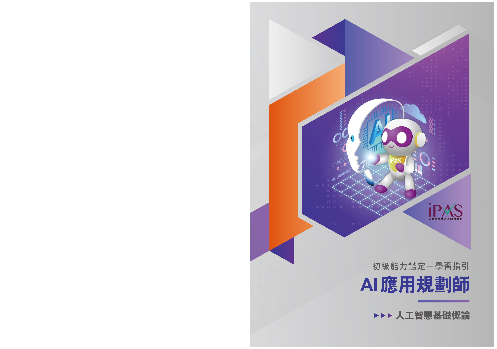

>  序 style="width:0.62667in;height:0.305in" />
>
> 為協助授課教師與考生掌握評鑑方向並有依循準備，本計畫委託

委員會題庫組及規劃組等領域專家，依據各科目評鑑內容，進行重點

說明與考題解析。

> 本手冊為學習指引，旨在提供學習方向與準備參考，並非正式教

材或題庫，亦不保證考試通過之責，建議考生依循考試簡章所公告之

評鑑主題內容，進行充分準備，以確保應試成效。

> 如有相關問題，請聯繫 iPAS@itri.org.tw。
>
> 經濟部產業人才能力鑑定推動小組
>
> 敬啟
>
> 
> 目錄
>
>  style="width:0.92222in;height:0.22167in" /> style="width:2.30403in;height:0.22167in" />..............................................
> ***1-1***
>
>  style="width:0.92222in;height:0.22167in" /> style="width:1.15042in;height:0.22167in" />.................................................................
> ***2-1***
>
>  style="width:0.92222in;height:0.22167in" /> style="width:2.07417in;height:0.22167in" />..................................................
> ***3-1***
>
> 3.1
> 人工智慧概念.............................................................3-1
>
> 3.2 資料處理與分析概念
> ...............................................3-24
>
>  style="width:6.29667in;height:2.89667in" /> style="width:0.6925in;height:0.22167in" /> style="width:0.46333in;height:0.22167in" /> style="width:1.61431in;height:0.22167in" />3.3
> 機器學習概念...........................................................3-33
>
> 3.4 鑑別式 AI 與生成式 AI 概念 ...................................3-48
>
> ..................................................***A-1***

> 經濟部為有效提升產業人才素質，近年來持續致力於專業人才培訓發展。為

了更明確產業對各類專業人才的能力需求，特別針對亟需人才的多項重點產業，

邀集產官學專家，發展產業職能基準，提供各界依其內涵辦理培訓課程及規劃能

力鑑定機制。

> 為完成特定職業（或職類）工作任務，所需具備的能力組合（知識、技能、

態度）。

> **AI**
>
>  style="width:1.16163in;height:1.17693in" /> style="width:1.11075in;height:1.1092in" />完整的「AI
> 應用規劃師」職能基準， 可自右方 QRcode 下載：
>
>  第一章 考試科目與評鑑內容 style="width:6.295in;height:2.89667in" /> style="width:0.4825in;height:0.15333in" /> style="width:0.80625in;height:0.15333in" /> style="width:0.80625in;height:0.15333in" /> style="width:3.13958in;height:0.305in" />
>
> 1-1
>
>  第二章 考科內容 style="width:6.295in;height:2.89667in" /> style="width:1.56917in;height:0.305in" />
>
> 本指引將說明初級「AI 應用規劃師」科目一之考試內容，包含「人工智慧基

礎概論」之評鑑主題「人工智慧概念」、「資料處理與分析概念」、「機器學習概念」

與「鑑別式 AI 與生成式 AI
概念」，幫助考生掌握人工智慧基礎知識，奠定未來應

用與規劃的堅實基石。此外，為強化學習成效，每章節將提供多樣化的練習評量，

幫助考生自我測試與檢視學習成果。

> 2-1
>
>  第三章 人工智慧基礎概論 style="width:0.53717in;height:0.47388in" /> style="width:0.62667in;height:0.305in" /> style="width:0.62667in;height:0.305in" /> style="width:2.82597in;height:0.305in" /> style="width:0.6925in;height:0.22167in" />
>
>  style="width:1.6143in;height:0.22167in" />**3.1**
>
> 人工智慧（Artificial
> Intelligence,AI）是一種旨在模擬人類智慧的技術，使機

器能夠執行原本需要人類智慧才能完成的任務，如學習、推理、解決問題、感知

環境等。近十年來，隨著軟硬體技術進步、計算能力提升、開放資料普及，以及

數據的多樣性、品質與規模增長，加上演算法與機器學習的不斷精進，人工智慧

的發展突飛猛進。

> 依照功能的不同，AI 可以分為以下幾類：

分析型 AI：主要用於洞悉數據模式，分析和處理大量數據，以提供有價值的見

> 解。

預測型 AI：基於歷史資料和數據，預測未來的趨勢和行為，常應用於市場預測、

> 風險評估等領域。

生成型 AI：近年快速發展的 AI 類型，可根據使用者輸入的提示詞（prompt），

> 生成各類素材，包括文字、語音、圖像和影片。
>
> 在企業運營中，人工智慧的應用通常集中於幾個主要目標，包括提高效率、

增強決策能力、提供個人化服務以及促進創新。生成式 AI 自 2022 年快速發展以

來，透過使用者輸入的提示詞（prompt），能高效生成多種素材形式，此技術大幅

改變了許多行業的工作型態，為企業在數位化轉型與創新發展上提供了新的契機。

**1.**

> 人工智慧技術的多樣化應用正在迅速改變各行各業的運作模式，其影響深遠

且範圍廣泛，以下為主要應用領域及其具體實例：

> 3-1
>
>  第三章 人工智慧基礎概論
>
> （**1**）醫療保健：
>
> 疾病診斷：利用 AI 分析醫學影像（如 X 光片、MRI 等）以輔助醫師進行精準
>
> 診斷，並提早發現病變。
>
> 藥物研發：透過 AI
> 進行藥物分子結構模擬，大幅縮短藥物研發的時間與成本。
>
> 個人化醫療：基於病患的基因、生活習慣與醫療記錄，提供量身訂制的治療方
>
> 案。
>
> （**2**）金融：
>
> 風險評估：透過 AI
> 模型分析用戶信用記錄與金融行為，提升貸款審核準確性。
>
>  style="width:6.295in;height:2.89667in" />欺詐檢測：實時監控交易行為，偵測異常模式以降低詐欺風險。
>
> 自動交易：運用 AI
> 演算法快速分析市場數據，進行高頻交易以抓住投資機會。
>
> （**3**）製造業：
>
> 自動化生產：機器人與 AI 結合，自動執行重複性生產任務，提升生產效率。
>
> 品質控制：運用影像辨識技術檢測產品缺陷，提升檢測精準度，確保高品質出
>
> 貨。
>
> 預測性維護：AI 分析設備運行數據，提前預測並預防機器故障。
>
> （**4**）交通：
>
> 自動駕駛：AI 技術結合感測器與導航系統，實現自動駕駛汽車的精準控制與路
>
> 徑規劃。
>
> 交通流量預測：AI 分析歷史與即時交通數據，提供動態交通管理與路線建議。
>
> （**5**）娛樂：
>
> 遊戲開發：AI 生成自適應遊戲角色及情節，提升玩家的沉浸體驗。
>
> 虛擬現實：AI 與 VR 技術結合，創造更真實的沉浸式虛擬環境。
>
> 內容推薦：分析用戶偏好，提供個人化的音樂、影視及文章推薦。

3-2

>  第三章 人工智慧基礎概論
>
>  style="width:1.56805in;height:0.18833in" />**2.**
>
> 人工智慧的實現依賴於一個多層次的架構，每一層都扮演著關鍵角色，從基
>
> 礎技術到應用開發，最終落地於實際場景。以下為其主要構成：

（**1**）技術底層

> 技術底層是人工智慧運作的基礎，提供必要的計算能力、數據支撐與核心演
>
> 算法。主要包含以下要素：
>
> **A.** 資料處理與分析（**Data** **Processing** **and** **Analysis**）
>
>  style="width:6.295in;height:2.89667in" />AI
> 的核心在於數據，資料處理包括數據清理、整合、儲存及分析。
>
> 關鍵技術如 ETL（Extract, Transform,
> Load）流程、資料庫管理及大數據處理平
>
> 台（如 Hadoop、Spark 等）。
>
> **B.** 演算法（**Algorithm**）
>
> 為 AI 的邏輯基石，用於解決問題及提供決策支援。
>
> 常見的演算法包括迴歸分析（RegressionAnalysis）、分類演算法（Classification
>
> Algorithms）、決策樹（Decision Tree）與基因演算法（Genetic
> Algorithm）等。
>
> **C.** 機器學習（**Machine** **Learning**）
>
> AI 的學習過程透過資料訓練模型來預測或分類，常見技術如監督式學習
>
> （Supervised Learning）、非監督式學習（Unsupervised
> Learning）與強化學習
>
> （Reinforcement Learning）等。
>
> **D.** 深度學習（**Deep** **Learning**）
>
> 構建於人工神經網路基礎之上，適用於處理非結構化數據，如語音辨識、影像
>
> 處理與自然語言處理（NLP）等；常見的開發框架包括 TensorFlow、PyTorch
> 等。
>
> 3-3
>
>  第三章 人工智慧基礎概論
>
> **E.** 專家系統（**Expert** **System**）
>
> 基於規則與知識庫，模擬人類專家的決策過程，廣泛應用於醫療診斷、財務分
>
> 析等專業領域。
>
> （**2**）開發應用
>
> 人工智慧的開發應用是將基礎技術轉化為實際功能與服務的關鍵階段，涵蓋
>
> 模型設計、訓練、測試及部署等多個環節。其目標是讓 AI
> 技術能夠解決特定業務
>
> 需求，並提升效率與價值。
>
>  style="width:6.295in;height:2.89667in" /> style="width:1.56805in;height:0.18833in" />（**3**）實際運用
>
> 將人工智慧技術應用落地為各行業創造價值的最終目標，運用目標包括：
>
> 設計行業解決方案：將 AI
> 技術應用於具體場景，如智慧醫療、智慧物流及智慧
>
> 製造等。
>
> 打造產品與服務：開發基於 AI
> 的商業化產品，如語音助理、推薦演算法及智慧
>
> 監控系統等。
>
> 優化業務流程：透過 AI 實現業務流程優化，提高企業運營效率及競爭力等。
>
> **3.**
>
> 資料（數據）處理與分析是人工智慧項目中的基礎階段，旨在將原始數據轉
>
> 化為高品質且適合分析的格式，進一步從中提取有價值的資訊。此階段包括數據
>
> 蒐集、清洗、轉換與分析，目標是確保數據的品質、一致性與可用性。
>
> （**1**）數據蒐集（**Data** **Collection**）：
>
> **A.** 數據結構類型分類
>
> 數據蒐集的來源廣泛，根據數據類型與應用需求，可分為以下幾類：
>
> 結構化數據（Structured
> Data）：具有清晰且固定結構的數據，通常以行列形式儲
>
> 存，便於直接進行查詢與分析。常見於關聯式資料庫（如 MySQL、PostgreSQL）

3-4

>  第三章 人工智慧基礎概論
>
> 和規範化的電子表格。
>
> 半結構化數據（Semi-structured
> Data）：數據具有一定結構標籤，但格式靈活，
>
> 無需嚴格遵循固定架構。通常以文件形式儲存，適用於描述複雜的層次化數據，
>
> 如 XML、JSON、CSV 等。
>
> 非結構化數據（Unstructured
> Data）：無固定結構的數據，需經過處理和解析後
>
> 才能進行分析。通常以檔案形式儲存，適合多媒體或自由文本類型數據，包括
>
> 圖片、影像、音訊、文字內容，如電子郵件、文章等。
>
> **B.** 常見數據蒐集方法
>
>  style="width:6.295in;height:2.89667in" />問卷與調查：透過線上或線下方式，直接從目標受眾中蒐集第一手數據。此方
>
> 法常用於市場研究、用戶回饋（反饋）蒐集或行為洞察，能夠精準捕捉目標群
>
> 體的意見與需求。
>
> 自有產品數據：來自企業所開發或運營的產品或設備數據，通常與用戶的互動
>
> 相關。例如自有的網站、App 應用，或實體裝置如智慧手錶、汽車等。
>
> 外部公開數據蒐集：透過 API 調用方式獲取公開可訪問的數據資源（如政府資
>
> 料開放平臺 API 等），或利用網路爬蟲（Web
> Scraping）自動擷取網站公開數據
>
> （如新聞、價格資訊、商品評論等）。
>
> 外部付費數據購買：與第三方數據提供商合作，購買專業數據集以補充內部數
>
> 據，例如市場調查數據或人口統計數據。
>
> 網路爬蟲（Web
> Scraping）：抓取網站公開數據，例如商品價格、使用者評論或
>
> 新聞文章等。

（**2**）數據清洗（**Data** **Cleaning**）：

> 數據清洗是提升數據品質的重要步驟，目的是解決數據中的遺缺值、重複值、
>
> 錯誤值與不一致性問題，確保數據的完整性與可靠性。以下是常見資料清洗過程
>
> 的核心內容：
>
> 3-5
>
>  第三章 人工智慧基礎概論
>
> **A.** 遺缺值（**Missing** **Value**）處理
>
> 遺缺值是指數據中某些欄位沒有記錄有效數據，需根據業務需求選擇適當的
>
> 處理方式：
>
> 填補遺缺值：使用統計方法填補（例如平均值、中位數、眾數等），或是利用插
>
> 補法（Interpolation）或預測模型填補遺缺值（如基於迴歸分析預測等）。
>
> 刪除記錄：如果遺缺值占比高或數據不可修復，可直接刪除相關記錄（需謹慎
>
> 評估刪除對樣本代表性的影響）。
>
> **B.** 重複值（**Duplicate** **Value**）處理
>
>  style="width:6.295in;height:2.89667in" />重複值是指數據中存在相同內容的記錄，可能因多次導入資料或錯誤記錄而
>
> 產生。
>
> 識別重複值：透過檢查主鍵、唯一識別碼或關鍵欄位，確認是否存在重複記錄。
>
> 刪除重複值：保留一份正確的記錄，刪除其他重複項。
>
> **C.** 錯誤值（**Error/Invalid** **Value**）處理
>
> 指數據中的值不符合合理範圍或存在明顯錯誤。
>
> 檢測並修正明顯的錯誤值（例如超出合理範圍的數值、拼寫錯誤等），例如：年
>
> 齡出現負數（如-5 歲）、錯誤的拼寫（如 Taiwan 被記錄為 Taiwwn）。
>
> **D.** 離群值（**Outlier** **Value**）處理
>
> 指數據中遠離大多數其他數據點的異常值，通常可能是有意義的數據而非錯
>
> 誤值。
>
> 離群值是數據集中明顯偏離其他數據點的異常值，可能反映數據的異常情況，
>
> 也可能是雜訊或錯誤。在處理離群值時，需要根據業務需求和分析目標採取適
>
> 當策略。

3-6

>  第三章 人工智慧基礎概論

（**3**）數據轉換（**Data** **Transformation**）

> 將數據轉換成適合分析的格式。
>
> 數據格式轉換（Data Format
> Transformation）：將數據從一種格式轉換為另一種
>
> 格式（如 CSV 轉換為 JSON）。
>
> 數據類型轉換（Data Type
> Conversion）：將數據從一種數據類型轉換為另一種數
>
> 據類型（如字串轉換為數值）。
>
> 數據正規化/標準化（Data Normalization/
> Standardization）：將數值數據縮放到特
>
> 定範圍（如\[0,1\]或-1 至
> 1），以消除不同變數之間的單位影響，使數據在模型中
>
> 具有可比性。
>
>  style="width:6.295in;height:2.89667in" />數據離散化（Data
> Discretization）：將連續型數據轉換為離散的區間或類別（如
>
> 將年齡分為「青年」、「中年」、「老年」）。
>
> 數據縮減（Data
> Reduction）：透過特徵選擇、特徵提取或降維技術，如主成分分
>
> 析（Principal Components Analysis,
> PCA）減少數據的維度或體積，從而提高分
>
> 析效率並節省儲存空間。

（**4**）數據分析（**Data** **Analysis**）

> 數據分析是運用統計方法、機器學習及其他技術，從處理後的數據中提取有
>
> 用資訊與洞察的過程。根據分析目的，可分為以下四種主要方法：
>
> **A.** 敘述性分析（**Descriptive** **Analysis**）：
>
> 描述數據的基本特徵和分佈情況。使用各別有其優點、限制、適用領域的統
>
> 計指標（如平均值、中位數、標準差、百分位數等），以及圖表（如直方圖、散佈
>
> 圖、折線圖等）等來總結和呈現數據。
>
> a\.
> 平均值（Mean）：將一組數據的所有值相加後除以數據的個數，所得出的結果，
>
> 代表了數據的平均水平。
>
> 優點：計算簡單，易於理解。
>
> 缺點：極端值（離群值）的影響較大，若數據集中有極端值，平均值可能會
>
> 偏離數據的中心趨勢。
>
> 3-7
>
>  第三章 人工智慧基礎概論
>
> b\.
> 中位數（Median）：將一組數據按照大小順序排列，位於中間位置的值，如果數
>
> 據個數為偶數，則取中間兩個數的平均值。
>
> 優點：不受極端值影響，能更好地反映數據的中心趨勢。
>
> 缺點：對數據分布的變動性不敏感。
>
> c\. 標準差（Standard
> Deviation）：用來衡量一組數據的分散程度，標準差越大，數
>
> 據的分散程度越大，反之亦然。
>
> 優點：能量化描述數據的分散程度，常用於比較不同組數據的分散情況。
>
> 缺點：計算相對複雜，且受極端值影響。
>
> d\. 百分位數（Percentile）：將一組數據按照大小順序排列後，將數據分為
> 100 份，
>
>  style="width:6.295in;height:2.89667in" />每份佔 1%，則第 p
> 百分位數是指有 p%的數據小於或等於它的值。
>
> 優點：能詳細描述數據的分佈情況，不受極端值影響。
>
> 缺點：計算相對複雜，對於較大的數據集計算量較大。
>
> e\.
> 直方圖（Histogram）：將連續型數據分成幾個類別（通常稱為「組」或「bin」），
>
> 並用矩形的高度表示每個類別中數據的個數。
>
> 優點：能直觀地展示數據的分布情況，包括集中趨勢、分散程度和是否有異
>
> 常值，可快速了解數據的整體樣貌。
>
> 缺點：組間隔的選擇會影響直方圖的外觀，不同的組間隔可能產生不同的視
>
> 覺效果。
>
> f\. 散佈圖（Scatter
> plot）：用於展示兩個變量之間的關係，每個數據點代表一組觀
>
> 察值，其位置由兩個變量的值決定。
>
> 優點：能直觀地顯示兩個變量之間的相關性，包括線性相關、非線性相關或
>
> 無相關、可以幫助發現異常值。
>
> 缺點：當數據點過多時，圖形可能變得擁擠，難以觀察。
>
> g\. 折線圖（Line chart）：用於顯示數據隨時間或其他連續變量的變化趨勢。
>
> 優點：能清晰地展示數據的變化趨勢，易於比較不同時間點的數據; 可以顯
>
> 示多個變量的變化趨勢。
>
> 缺點：較不適合展示類別型數據。

3-8

>  第三章 人工智慧基礎概論

**B.** 探索性分析（**Exploratory** **Analysis**）

> 探索性分析是一種數據分析方法，旨在無需預設假設的情況下，透過多角度

探索數據，發現其中的模式、關聯和異常，為後續的深入分析或建模提供基礎。

以下為探索性分析相關重要觀念：

a\. 散佈圖矩陣（Scatter Plot Matrix）

> 特點與用途：用於展示多個變量兩兩之間的相關性，適合高維數據的初步探索。
>
> 應用範例：分析銷售數據中價格、數量與地區之間的互動關係。

b\. 熱圖（Heatmap）

> 特點與用途：透過色彩強度展示數據項目之間的關聯程度，通常用於相關分析。
>
>  style="width:6.295in;height:2.89667in" />應用範例：了解客戶消費行為特徵之間的關聯（如年齡與消費金額）。

c\. 平行坐標圖（Parallel Coordinates Plot）

> 特點與用途：適合分析高維數據，展示多個變量的趨勢和模式。
>
> 應用範例：比較不同產品類型在多項指標上的表現（如成本、收益、風險等）。

d\. 箱型圖/盒鬚圖（Box Plot）

> 特點與用途：展示數據分佈情況，突出離群值與中位數等特徵。
>
> 應用範例：比較不同地區的收入分佈差異。

e\. 相關性分析（Correlation Analysis）

> 特點與用途：測量兩個變量之間的相關性，如皮爾森相關係數（Pearson
>
> Correlation Coefficient）。
>
> 應用範例：分析廣告支出與銷售收入之間的相關性，判斷廣告效果。

f\. 聚類分析（Clustering Analysis）

> 特點與用途：將數據分為多個組群，組內數據相似度高而組間差異大，如 K
>
> 均值聚類（K-Means）、層次聚類（Hierarchical Clustering）等。
>
> 應用範例：客戶分群，根據消費行為將用戶分為高價值客戶、一般客戶等。

g\. 主成分分析（Principal Component Analysis, PCA）

> 特點與用途：減少數據維度，同時保留大部分數據內訊息，便於視覺化或進
>
> 一步分析。
>
> 3-9
>
>  第三章 人工智慧基礎概論
>
> 應用範例：簡化銷售數據的多維特徵以發現核心指標。
>
> h\. 異常檢測（Anomaly Detection）
>
> 特點與用途：識別數據集中不符合預期的異常點，如離群值或罕見模式。
>
> 應用場景：檢測金融交易中的欺詐行為。
>
> **C.** 診斷性分析（**Diagnostic** **Analysis**）
>
> 診斷性分析旨在探究數據中的特定現象或結果的根本原因。此類分析通常基
>
> 於敘述性分析的結果，進一步深入了解數據背後的邏輯與影響因素。以下為常用
>
> 的分析方法：
>
>  style="width:6.295in;height:2.89667in" />a. 鑽取/向下分析（Drill-down
> Analysis）
>
> 特點與用途：從宏觀數據逐層深入到細節層級，逐步鎖定問題範圍。
>
> 應用場景：銷售下降時，透過地區、產品類別或時間段分析，確定問題發生
>
> 的具體區域或品類。
>
> b\. 關聯分析（Association Analysis）
>
> 特點與用途：分析數據項目之間的共現關係或模式。方法如 Apriori 演算法，
>
> 用於分析超市購物車數據（如「啤酒與尿布的關聯性」）。
>
> 應用場景：在推薦系統中發掘產品之間的購買關聯。
>
> c\. 因果分析（Causal Analysis）
>
> 特點與用途：透過統計與實驗方法分析變量之間的因果關係，避免混淆相關
>
> 性與因果性。方法如因果圖（Causal Diagrams）、隨機試驗（A/B 測試）。
>
> 應用場景：檢驗行銷活動對銷售增長的實際影響。
>
> **D.** 預測性分析（**Predictive** **Analysis**）
>
> 預測性分析使用歷史數據來預測未來可能發生的事件或趨勢，通常是基於統
>
> 計方法與機器學習模型。以下為常用的模型/方法：
>
> a\. 迴歸模型（Regression Models）
>
> 特點與用途：用於數值型結果的預測。

3-10

>  第三章 人工智慧基礎概論
>
> 方法：線性迴歸、多元迴歸、邏輯迴歸等。
>
> 應用場景：預測房地產價格、銷售額、天氣變化等。
>
> b\. 分類模型（Classification Models）
>
> 特點與用途：用於將數據分為不同類別。
>
> 方法：決策樹、隨機森林、支援向量機（Support Vector Machine, SVM）、深
>
> 度學習（如神經網路等）。
>
> 應用場景：信用風險評估、疾病診斷、用戶行為預測。
>
> c\. 時間序列模型（Time Series Models）
>
> 特點與用途：用於分析時間相關數據，捕捉趨勢、季節性與周期性模式。
>
>  style="width:6.295in;height:2.89667in" /> style="width:0.78444in;height:0.18833in" />方法：ARIMA、SARIMA、LSTM
> 等。
>
> 應用場景：銷售預測、需求規劃、股票價格預測。
>
> d\. 集成學習方法（Ensemble Methods）
>
> 特點與用途：結合多個模型提高預測準確性。
>
> 方法：隨機森林（Random Forest）、梯度提升機（Gradient Boosting
> Machine,
>
> GBM）、極限梯度提升（eXtreme Gradient Boosting, XGBoost）等。
>
> **4.**
>
> 演算法（Algorithm）在機器學習與人工智慧領域扮演著舉足輕重的角色，特
>
> 別是在搜尋與排序方面，廣泛應用於網路資訊檢索、資料庫管理與各類數據處理。
>
> 以下為幾種常見的搜尋與排序演算法：

（1） 線性搜尋（Linear Search / Sequential
Search）：從資料集的第一個元素開始，

> 逐個與目標元素進行比較。如果找到匹配的元素，則搜尋成功；如果遍歷整
>
> 個資料集後仍未找到，則搜尋失敗。

（2） 二分搜尋（Binary
Search）：首先將資料集的中間元素與目標元素進行比較。

> 如果目標元素等於中間元素，則搜尋成功；如果目標元素小於中間元素，則
>
> 在資料集的左半部分繼續搜尋；如果目標元素大於中間元素，則在資料集的
>
> 右半部分繼續搜尋。重複以上步驟，直到找到目標元素或搜尋範圍為空。
>
> 3-11
>
>  第三章 人工智慧基礎概論
>
> （3） 深度優先搜尋（Depth-First Search,
> DFS）：在圖形或樹狀結構。從起始節點開
>
> 始，沿著一條路徑儘可能深地搜尋，直到到達葉節點或遇到已訪問過的節點，
>
> 然後回溯到上一個節點，繼續搜尋其他路徑。
>
> （4） 廣度優先搜尋（Breadth-First Search,
> BFS）：在圖形或樹狀結構。從起始節點
>
> 開始，首先訪問其所有相鄰的節點，然後再訪問這些相鄰節點的相鄰節點，
>
> 依此類推，一層一層地擴散搜尋。
>
> 以下介紹幾種常見且應用廣泛的演算法：
>
> （1） 線性迴歸（Linear
> Regression）：預測連續數值型的輸出變數，例如房價預測、
>
>  style="width:6.295in;height:2.89667in" />銷售額預測、股票價格預測等。優點為簡單易懂、計算效率高；缺點是只能
>
> 捕捉線性關係，對於非線性關係的資料擬合效果較差。其演算法原理為假設
>
> 輸入變數（特徵）和輸出變數之間存在線性關係，試圖找到一條最佳的直線
>
> （或超平面，在高維空間中），盡可能地擬合資料點。
>
> （2） 邏輯迴歸（Logistic
> Regression）：邏輯迴歸雖然名稱中有「迴歸」，但實際上
>
> 是一種分類演算法。使用 Sigmoid 函數將線性迴歸的輸出轉換為介於 0 和 1
>
> 之間的機率值。通常設定一個閾值（例如 0.5），將機率值轉換為類別。優點
>
> 為簡單易懂、計算效率高、輸出結果具有機率意義，但只能解決二元分類問
>
> 題，對於多類別分類問題需要進行擴展。
>
> （3） K-最近鄰演算法（K-Nearest Neighbors,
> KNN）：屬於一種基於實例的學習演
>
> 算法，對於一個新的輸入樣本，它會找出訓練集中與其最接近的 K 個樣本
>
> （最近鄰）。對於分類問題，將新樣本分類為 K 個最近鄰中出現次數最多的
>
> 類別；對於迴歸問題，將新樣本的預測值設定為 K 個最近鄰的平均值或中位
>
> 數。
>
>  style="width:0.97917in;height:0.18833in" />**5.**
>
> 機器學習（Machine Learning）是一種透過數據訓練模型，使機器具備預測與
>
> 分類能力的技術，常應用於文字辨識、語音辨識、圖像辨識等領域。一般而言，

3-12

>  第三章 人工智慧基礎概論
>
> 資料量愈大且經過完整的資料處理，模型的效果通常會更好。
>
> 簡述機器學習的步驟包含：（1）準備訓練資料：包含資料的蒐集、過濾雜訊
>
> 及前處理；（2）訓練模型：將前項準備好的訓練資料輸入演算法中，並適度調整
>
> 參數，使模型儘量符合資料之模式或分佈；（3）測試及評估模型：測試並評估該
>
> 模型的效能，並反覆訓練之；經多次調校仍不佳時，或許選用其他模型再重覆前
>
> 述流程。
>
> 依訓練方式，有以下幾種學習方法：

（**1**）監督式學習（**Supervised** **learning**）

>  style="width:6.295in;height:2.89667in" />監督式學習主要應用於分類（Classification）與迴歸（Regression）任務，透
>
> 過帶有標記（Labeled
> Data）的訓練數據來訓練模型，使其學習輸入特徵與對應標
>
> 記之間的關聯性。在訓練過程中，模型不斷調整內部參數，以提高對未知數據的
>
> 預測準確度，從而實現對未見數據的有效分類或數值預測。分類模型目標為「如
>
> 何將輸入數據分配至不同類別」，例如垃圾郵件過濾（辨別郵件是否為垃圾郵件）、
>
> 影像識別（辨識圖片中的物件類別）。迴歸模型目標為「學習輸入變數與連續數值
>
> 之間的映射關係」，例如房價預測（根據房屋特徵預測價格）、銷售額預測（根據
>
> 市場數據預測未來銷售）。

（**2**）非監督式學習（**Unsupervised** **Learning**）

> 不同於監督式學習，無需使用事先標記好的訓練數據。演算法會自動從未標
>
> 記的數據中發掘潛在的模式、結構或分群（Clustering），進而揭示數據內部的關聯
>
> 性和特徵。非監督式學習常用於資料探索、特徵提取和數據降維等任務，廣泛應
>
> 用於市場區隔分析、異常偵測、推薦系統和影像壓縮等領域。

（**3**）強化學習（**Reinforcement** **Learning,** **RL**）

> 強化學習不同於監督式學習和非監督式學習，是一種基於「回饋（反饋）機
>
> 制」的學習方法，透過評分機制與獎勵措施的制定，讓人工智慧進行自我評估並
>
> 3-13
>
>  第三章 人工智慧基礎概論
>
> 朝獲取最大獎勵的方向進行學習。強化學習的核心在於讓代理（Agent）透過與環
>
> 境的互動，學習如何選擇最佳行動策略，以獲得最大的累積回報。強化學習特別
>
> 適合用於需要「試錯學習（Trial-and-Error）」和「長期規劃」的任務，例如遊戲
> AI、
>
> 機器人控制和自動駕駛等領域。
>
>  style="width:0.97917in;height:0.18833in" />**6.**
>
> 深度學習（Deep Learning, DL）是一種機器學習的子領域，透過多層次的人
>
> 工神經網路，從大量文本、語音、影像等數據中自動學習特徵。這些神經網路由
>
> 許多相互連結的神經元組成，每個神經元接收前一層的輸出，經過非線性轉換後，
>
>  style="width:6.295in;height:2.89667in" />再將結果傳遞給下一層。當大量數據反覆輸入神經網路時，網路內部的連接權重
>
> 會不斷調整，使得模型能夠自動從數據中提取出深層且抽象的特徵。相較於傳統
>
> 的機器學習方法，深度學習不需要人類專家手動設計特徵，而是讓模型自行學習。
>
> 這使得深度學習在處理複雜的數據時，具有更強大的能力。深度學習在自然語言
>
> 處理（如機器翻譯、文本生成）、電腦視覺（如影像辨識、物件偵測）、語音辨識
>
> （如語音助理、語音轉文字）以及生成式模型（GenerativeAI）等領域都有廣泛的
>
> 應用。以下介紹深度學習的三大經典模型：
>
> （**1**）卷積神經網路（**Convolutional** **Neural** **Networks,**
> **CNN**）
>
> 卷積神經網路（CNN）是深度學習領域中最具代表性的模型之一，特別擅長
>
> 處理圖像數據。其設計靈感來自於生物學上的動物視覺皮層，能夠高效地提取圖
>
> 像中的特徵。
>
> **A.** 結構組成：
>
> 卷積層（Convolutional
> Layer）：透過卷積運算提取數據的局部特徵，例如邊緣、
>
> 紋理等。
>
> 池化層（Pooling
> Layer）：透過降維操作（如最大池化、平均池化），減少數據維
>
> 度，防止過擬合。

3-14

>  第三章 人工智慧基礎概論
>
> 全連接層（Fully Connected
> Layer）：將提取的特徵映射到輸出空間，進行分類或
>
> 迴歸任務。
>
> **B.** 優點：
>
> 適合處理高維數據，參數量相比全連接網路顯著減少。
>
> 能夠提取層次化特徵，從低層特徵（如邊緣）到高層語義（如物體形狀）。
>
> **C.** 應用場景：
>
> 影像辨識：如人臉辨識、手寫數字分類（MNIST）。
>
>  style="width:6.295in;height:2.89667in" />物件偵測：如自動駕駛中的障礙物檢測。
>
> 圖像分割：如醫學影像中的病變檢測。

（**2**）循環神經網路（**Recurrent** **Neural** **Networks,**
**RNN**）：

> RNN 是專為處理序列數據而設計的深度學習模型，其關鍵特性是網路中存在
>
> 循環連接，使得模型可以記憶序列中之前的資訊。
>
> **A.** 工作原理：
>
> RNN 的每個節點不僅接收當前的輸入，還會記住前一時刻的狀態，這使得 RNN
>
> 能夠捕捉數據的時間依賴關係。
>
> 網路的輸出取決於當前輸入和前面的上下文，適合處理語音、文本等具有時間
>
> 序列特性的數據。
>
> **B.** 改進版本：
>
> 長短期記憶網路（Long Short-Term Memory,
> LSTM）：透過引入遺忘門（forget
>
> gate）、輸入門（input gate）和輸出門（output
> gate），有效解決了梯度消失問題。
>
> 門控循環單元（Gated Recurrent Unit, GRU）：結構比 LSTM
> 更簡單，但在大多
>
> 數應用中效果相近。
>
> 3-15
>
>  第三章 人工智慧基礎概論
>
> **C.** 優點：
>
> 能夠有效捕捉序列數據中的長期依賴關係。
>
> 支持變長序列的處理，適用於多種場景。
>
> **D.** 缺點：
>
> 訓練過程容易出現梯度消失或梯度爆炸問題。
>
> 在處理長序列數據時，計算效率較低。
>
> **E.** 應用場景：
>
>  style="width:6.295in;height:2.89667in" />自然語言處理：如機器翻譯、文本生成。
>
> 語音辨識：如語音助理中的語音轉文字。
>
> 時間序列分析：如股票價格預測。
>
> （**3**）生成對抗網路（**Generative** **Adversarial** **Networks,**
> **GAN**）
>
> 生成對抗網路（GAN）是深度學習中用於生成數據的強大模型，由兩個網路
>
> 組成：生成器（Generator）和判別器（Discriminator），並透過對抗學習共同進步。
>
> **A.** 工作原理：
>
> 生成器（Generator）：接收隨機雜訊作為輸入，生成模擬的數據樣本。
>
> 判別器（Discriminator）：負責區分輸入數據是真實的還是生成的。
>
> 生成器的目標是「欺騙」判別器，使其無法區分數據來源；而判別器則試圖最
>
> 大化其判斷準確性。這種對抗學習的過程促使生成器逐漸生成更逼真的數據。
>
> **B.** 優點：
>
> 能夠生成高品質的數據樣本，適用於影像、文本、語音等多領域。
>
> 在數據增強和模擬中有極大的應用潛力。

3-16

>  第三章 人工智慧基礎概論
>
> **C.** 缺點：
>
> 訓練過程不穩定，可能出現模式崩潰（Mode Collapse）。
>
> 需要大量計算資源，對網路結構設計要求高。
>
> **D.** 應用場景：
>
> 圖像生成：如將草圖轉換為寫實圖片。
>
> 文本生成：如虛擬對話內容的創建。
>
> 語音合成：如生成逼真的語音樣本。
>
>  style="width:6.295in;height:2.89667in" /> style="width:1.56805in;height:0.18833in" />**7.**
>
> 生成式人工智慧（GenerativeAI）是一種強大的自然語言處理模型，透過龐大
>
> 的參數數量，能夠根據使用者提供的提示詞，生成出連貫、有意義的文本回應。
>
> 這些模型運作的原理是：根據輸入的提示詞，模型會在經過大量文本訓練後所建
>
> 立的「文字機率分布」中，尋找最可能接續的文字，並以此方式逐字生成回應。
>
> 模型的參數數量與其理解提示詞的能力、生成文本的品質息息相關。一般來說，
>
> 參數越多，模型就越能捕捉到語言的細微差異，生成更為豐富多樣的回應。生成
>
> 式人工智慧的訓練過程主要分為兩個階段：

（**1**）訓練階段：

> 模型會在大量的文本數據上進行訓練，學習語言的規律和模式。這個階段的
>
> 目的是讓模型具備基本的語言理解和生成能力。模型會從大量的數據中學習到數
>
> 據的分布、模式和特徵。
>
> **A.** 數據準備
>
> 數據蒐集：蒐集大量的、高品質的數據，這些數據將作為模型訓練的素材。數
>
> 據的數量和品質直接影響模型的生成效果。
>
> 數據清洗：對蒐集到的數據進行清洗，去除雜訊、異常值和不一致的部分，確
>
> 3-17
>
>  第三章 人工智慧基礎概論
>
> 保數據的乾淨和可靠。
>
> 數據預處理：將數據轉換為模型可以處理的格式，例如，將文本轉換為數字向
>
> 量。
>
> **B.** 模型選擇與搭建：
>
> 選擇模型：選擇適合任務的生成模型，常見的模型包括生成對抗網路（GAN）、
>
> 變分自編碼器（VAE）、Transformer 等。
>
> 搭建模型：根據所選模型的結構，搭建模型的各個層級，包括輸入層、隱藏層
>
> 和輸出層。
>
>  style="width:6.295in;height:2.89667in" />**C.** 模型訓練：
>
> 損失函數：設計一個適當的損失函數，用來衡量模型生成的數據與真實數據之
>
> 間的差異。
>
> 優化器：選擇一個優化器，如 Adam、SGD，用來更新模型的參數，使得模型生
>
> 成的數據越來越接近真實數據。
>
> 迭代訓練：反覆輸入訓練數據，計算損失，並根據損失更新模型參數，直到模
>
> 型收斂或達到預定的訓練次數。
>
> （**2**）微調階段：
>
> 在預訓練模型的基礎上，使用特定領域或任務的數據進行進一步訓練，以提
>
> 升模型在特定任務上的表現。
>
> **A.** 特定任務優化：
>
> 調整超參數：根據任務的具體需求，調整學習率、批量大小等超參數。
>
> 添加特定層：為模型添加一些特定於任務的層，如在文本生成任務中，可以添
>
> 加一個語言模型層。

3-18

>  第三章 人工智慧基礎概論

**B.** 數據精調：

使用特定數據集：使用與特定任務相關的數據集進行微調，以提高模型在該任

> 務上的效能。

數據增強：透過對數據進行一些變換，如旋轉、翻轉等，來增加數據的多樣性，

> 提高模型的泛化能力。
>
> 生成式人工智慧的訓練是一個複雜且迭代的過程，透過訓練和微調，模型能

夠學習到數據的複雜模式，並生成具有創造性的內容，影響生成模型效果的因素

包括：

數據品質：數據的數量、品質和多樣性對模型的效能有決定性的影響。

模型結構：不同的模型結構適合不同的任務。

超參數設置：合理的超參數設置可以加速模型的收斂並提高效能。

計算資源：訓練大型生成模型需要大量的計算資源。

> 3-19
>
>  第三章 人工智慧基礎概論 style="width:1.76294in;height:0.43188in" /> style="width:1.66961in;height:0.43188in" /> style="width:1.25134in;height:0.25159in" /> style="width:0.50295in;height:0.509in" />
>
> 1\. 下列何者最適合訓練電腦下圍棋、自動駕駛等動態重複地互動的問題？
>
> （A）監督式學習（Supervised Learning）
>
> （B）非監督式學習（Unsupervised Learning）
>
> （C）半監督式學習（Semi-supervised Learning）
>
> （D）強化學習（Reinforcement Learning）
>
> 2\. 關於 AI 的定義，下列敘述何者較為正確？
>
> （A）AI 僅限於深度學習技術
>
>  style="width:6.295in;height:2.89667in" />（B）AI
> 包括各種技術，例如機器學習、專家系統等
>
> （C）AI 系統只能在學術研究中應用
>
> （D）AI 無法應用於金融領域
>
> 3\. 為了提升 AI 系統的透明性，下列哪種措施是適當的？
>
> （A）不需對外揭露任何有關 AI 系統的資訊
>
> （B）規劃透過發布報告、技術文件或網站揭露 AI 系統的相關資訊
>
> （C）僅對內部員工進行透明性說明
>
> （D）將所有 AI 系統資訊保密
>
> 4\. 下列何者不適合做為資料分布估計？
>
> （A）直方圖（Histogram）
>
> （B）散布圖（Scatter plot）
>
> （C）雷達圖（Radar chart）
>
> （D）四分位數（Quartile）
>
> 5\. K-Means 聚類算法中，K 代表什麼？
>
> （A）數據集中特徵的數量
>
> （B）數據集中樣本的數量
>
> （C）所需劃分的群組數量
>
> （D）迭代次數

3-20

>  第三章 人工智慧基礎概論

6\. 深度學習模型中，下列哪一項通常用來降低過擬合問題？

> （A）增加訓練數據量
>
> （B）增加模型的複雜度
>
> （C）增加學習率
>
> （D）增加正則化項

7\. 生成式人工智慧最核心的能力是什麼？

> （A）從大量數據中學習
>
> （B）執行複雜的數學計算
>
> （C）生成新的、原創的內容
>
>  style="width:6.295in;height:2.89667in" />（D）控制機器人

8\. 下列哪項技術是生成式 AI 發展的重要基礎？

> （A）決策樹
>
> （B）神經網路
>
> （C）線性迴歸
>
> （D）貝氏分類

9\. 關於 AI，下列敘述何者較為正確？

> （A）AI 僅限於深度學習技術
>
> （B）AI 包括各種技術，例如機器學習、專家系統等
>
> （C）AI 系統只能在學術研究中應用
>
> （D）AI 無法應用於金融領域

10\. 在 AI 治理中，下列何者是國際合作的重要性？

> （A）統一 AI 發展標準
>
> （B）避免 AI 技術的濫用
>
> （C）促進 AI 技術的轉移
>
> （D）以上皆是
>
> 3-21
>
>  第三章 人工智慧基礎概論 style="width:0.52736in;height:0.52785in" /> style="width:0.39294in;height:0.38574in" /> style="width:0.4991in;height:0.24802in" /> style="width:0.53253in;height:0.52277in" /> style="width:0.38777in;height:0.38066in" /> style="width:0.49979in;height:0.24802in" /> style="width:0.53253in;height:0.52277in" /> style="width:0.38777in;height:0.38066in" /> style="width:0.4991in;height:0.24802in" /> style="width:0.52219in;height:0.52277in" /> style="width:0.38777in;height:0.38066in" /> style="width:0.4991in;height:0.24802in" />
>
> 1\. <u>**Ans**（**D**）</u>
>
> <u>解析</u>：強化學習（Reinforcement Learning,
> RL）是一種機器學習方法，讓代理
>
> （Agent）透過與環境不斷互動，學習到一系列動作，以最大化累積獎勵。這
>
> 種學習方式非常適合用於訓練電腦在動態、複雜的環境中做出決策，例如下圍
>
> 棋、自動駕駛等。
>
> 2\. <u>**Ans**（**B**）</u>
>
> <u>解析：</u>人工智慧（AI）就像是一個龐大的拼圖，由許多不同的技術碎片組成。
>
>  style="width:6.295in;height:2.89667in" />這些技術各司其職，共同構成了我們所理解的人工智慧。（A）不限於深度學
>
> 習，還有機器學習、演算法等。（C）不只限制於特定的研究、金融領域，在各
>
> 領域都有許多 AI 的應用，如：醫學、交通等。
>
> 3\. <u>**Ans**（**B**）</u>
>
> <u>解析</u>：透過定期或不定期發佈 AI
> 系統於各決策環節的決策流程，有助於提昇
>
> AI 系統的透明性。
>
> 4\. <u>**Ans**（**C**）</u>
>
> <u>解析：</u>雷達圖有幾個限制，無法直觀呈現機率密度：雷達圖主要用於比較不同
>
> 個體在多個維度上的表現，而非呈現數據在每個維度上的分布情況。要了解數
>
> 據在某個維度上的集中程度、分散程度等，需要更適合的圖形，如直方圖。
>
> 5\. <u>**Ans**（**C**）</u>
>
> <u>解析</u>：K 在 K-Means 演算法中代表我們希望將數據分為幾個群組。K
> 值的選
>
> 擇會直接影響最終的聚類結果，因此是一個非常重要的參數。
>
> 6\. <u>**Ans**（**D**）</u>
>
> <u>解析：</u>過擬合指的是模型過度學習訓練數據中的雜訊或特徵，導致在測試集上
>
> 表現不佳。正則化是一種在模型中加入額外項來懲罰複雜模型的方法，常見的
>
> 正則化項有 L1 正則化和 L2 正則化。
>
> 增加正則化項可以使模型變得更簡單，降低過擬合的風險，提高模型的泛化能力。

3-22

>  第三章 人工智慧基礎概論

7\. <u>**Ans**（**C**）</u>

> <u>解析</u>：生成式 AI
> 的最大特徵就是能夠生成全新的文本、圖像、音樂等內容。
>
> 這與傳統的 AI 主要用於分析或預測已有數據不同。生成式 AI 透過學習大量
>
> 數據的模式，能產生出具有創造性的輸出。

8\. <u>**Ans**（**B**）</u>

> <u>解析</u>：神經網路，尤其是深度學習模型，是生成式 AI
> 的基石。這些模型能夠
>
> 學習數據中的複雜模式，並生成與訓練數據相似但又不完全相同的新的數據。
>
> 其他選項如決策樹、線性迴歸和貝氏分類雖然也是機器學習的重要方法，但並
>
> 不擅長生成新的內容。

9. <u>**Ans**（**B**）</u>

> <u>解析：</u>AI
> 是一個廣泛的領域，涵蓋了多種技術，包括但不限於機器學習、深度
>
> 學習、專家系統、自然語言處理和計算機視覺等。它不僅限於深度學習，也不
>
> 僅侷限於學術研究，且已成功應用於金融、醫療、製造等多個領域。

10\. <u>**Ans**（**D**）</u>

> <u>解析：</u>在 AI
> 治理中，國際合作的重要性包含多個方面，主要包括：統一 AI 發
>
> 展標準，確保不同國家在技術應用上的一致性和互操作性。避免 AI 技術的濫
>
> 用，透過跨國監管和政策協調減少倫理與安全風險。促進 AI 技術的轉移，幫
>
> 助各國共享技術資源，縮小數位鴻溝。因此，以上選項都屬於國際合作的重要
>
> 性。
>
> 3-23
>
>  第三章 人工智慧基礎概論 style="width:0.53717in;height:0.47388in" /> style="width:0.6925in;height:0.22167in" />
>
>  style="width:2.30597in;height:0.22167in" />**3.2**
>
> 在人工智慧（AI）領域，資料處理與分析是至關重要的基礎。AI 模型的訓練
>
> 和應用都高度依賴於大量、高品質的資料。以下將深入探討資料處理與分析在
> AI
>
> 領域中的概念。
>
> 在人工智慧與機器學習領域中，資料是模型學習的基石。為了從海量資料中
>
>  style="width:6.295in;height:2.89667in" />萃取出有價值的資訊，統計學扮演著不可或缺的角色。從基礎的資料敘述統計，
>
> 到進階的重抽樣與模擬技術，統計學提供了我們分析資料、驗證模型的堅實基礎。
>
> 換句話說，統計學是我們駕馭資料、獲得洞見的指南針。
>
> 統計測量數大致包含三種類型：中央趨勢的衡量、分散度的衡量及其他測量數。
>
> 當我們想要了解一組數據的整體趨勢時，常常會關注資料的集中位置。這個
>
> 集中位置，我們就稱之為「中央趨勢」，常用的中央趨勢測量值有平均數（Mean）、
>
> 中位數（Median）和眾數（Mode）等，其中平均數代表資料的平均值，中位數代
>
> 表將資料排序後位於中間的數值，而眾數則代表資料中出現頻率最高的數值。
>
> 平均數（Mean）：描述一組資料集中趨勢最常用的統計量。它代表了所有資料值
>
> 的平均水平，就像是一個資料的「重心」。最常見的平均數是算術平均數
>
> （Arithmetic
> Mean），也就是將所有資料數值相加後除以資料的個數。雖然幾何
>
> 平均數（Geometric Mean）和調和平均數（Harmonic Mean）也能用來表示平均
>
> 水平，但算術平均數因其計算簡單、易於理解，在實際應用中更為普遍。然而，
>
> 算術平均數容易受到極端值（過大或過小的數據）的影響，這也是我們在選擇
>
> 統計量時需要考慮的因素。
>
> 中位數（Median）：將一組資料按數值大小順序排列後，位於正中間的數值。相
>
> 較於平均數，中位數不易受到極端值（過大或過小的資料數值）的影響，因此
>
> 更能反映資料的典型水平。然而，中位數在進行複雜的數學運算和統計推斷時，
>
> 較不易操作，這也是它的限制。

3-24

>  第三章 人工智慧基礎概論

眾數（Mode）：指在一組資料中出現頻率最高的值。相較於平均數和中位數，眾

> 數不受極端值影響，能直接反映資料中最常見的類別或數值。然而，眾數可能
>
> 有多個，也可能不存在，這使得它在某些情況下應用較受限制，不像平均數和
>
> 中位數那樣普遍。
>
> 分散度之衡量統計量為可衡量資料之離散程度，主要用於尋找變異的原因和

性質，常見的分散度之衡量統計量有：四分位數（Quartile）、全距（Range）、四分

位距（Interquartile Range）、平均差（Mean
Deviation）、變異數（Coefficient of

Variation）及標準差（Standard Deviation）等。

四分位數（Quartile）：所有數值由小到大排列並分成四等份，處於三個分割點位

> 置的數值就是四分位數。

全距（Range, R）：觀察值中的最大值減去最小值後的數值，由於只考慮最大與

> 最小兩個觀察值，未考慮所有觀察值，故不能精確的反應全體觀察值的分散情
>
> 形，且會受極端值影響。

四分位距（Interquartile Range,
IQR）：為統計離差的度量，等於第三和第一四分

> 位之間的差異，與全距有一樣的缺點。

平均差（Mean Deviation）：每一個觀察值與平均數之間的差距，其數值越大表

> 示分散程度越高。

標準差（Standard
Deviation）：標準差是衡量一組資料分散程度的統計量。當標

> 準差較大時，表示資料點離平均值的距離較遠，也就是說，資料的分散程度較
>
> 高。反之，若標準差較小，則表示資料點都聚集在平均值附近，資料的分散程
>
> 度較低。在品質管理中，標準差常用來評估產品或過程的穩定性。標準差越大，
>
> 表示產品品質越不穩定，良率越低。
>
> 當我們從母體中抽取樣本進行分析時，由於樣本的隨機性，得到的統計量（如

樣本平均數、樣本標準差）與母體參數之間存在差異，這種差異稱為抽樣變異。

為了量化這種變異並進行推論，我們需要引入機率模型。機率模型（Probability

> 3-25
>
>  第三章 人工智慧基礎概論
>
> Models）能幫助我們刻畫抽樣變異的特性，進而對母體參數做出推斷。透過機率
>
> 模型，我們可以建立起一個框架，用來量化統計估計值的不確定性，並進一步進
>
> 行區間估計和假設檢定等統計推斷。
>
> 常見的統計方法可做以下分類：
>
>  style="width:6.295in;height:2.89667in" /> style="width:0.80625in;height:0.15333in" /> style="width:0.80625in;height:0.15333in" /> style="width:0.4825in;height:0.15333in" /> style="width:0.4825in;height:0.15333in" />假說檢定名詞介紹：

3-26

>  第三章 人工智慧基礎概論 style="width:6.295in;height:2.89667in" /> style="width:0.4825in;height:0.15333in" /> style="width:0.4825in;height:0.15333in" />

探索式資料分析

> 根據分析目的，資料分析可大致分為兩類：探索性資料分析（Exploratory Data

Analysis, EDA）和驗證性資料分析（Confirmatory Data Analysis, CDA）。

> 每個資料集都具有其獨特的特徵，因此在進行資料分析之前，我們需要先對

資料進行深入的探索。探索性資料分析正如其名，強調的是一種靈活且開放的探

索過程，透過探索性資料分析，我們可以從資料中發現潛在的模式、關係和異常

值，這些發現將為後續的深入分析提供重要的線索，通常在研究初期，對資料特

徵尚不熟悉的情況下進行，為後續更深入的分析奠定基礎。

> 3-27
>
>  第三章 人工智慧基礎概論 style="width:6.295in;height:2.89667in" />
>
> 探索性資料分析不僅僅是對數據的描述，更是一種生成假設的過程。透過視
>
> 覺化工具，研究人員可以直觀地觀察數據的分佈情況，並提出一些初步的假設。
>
> 這些假設將為後續的驗證性分析提供方向。
>
> 相較於探索性資料分析，驗證性資料分析更注重於驗證研究者提出的假設，
>
> 透過分類、分群、相關性分析以及預測模型等方法，研究人員可以對探索階段所
>
> 發現的模式進行更深入的挖掘。此外，為了更全面地理解數據，研究人員也可能
>
> 結合定性分析，對量化分析的結果進行深入探討，以發現數據中更細緻的內涵。

3-28

>  第三章 人工智慧基礎概論 style="width:1.76294in;height:0.43056in" /> style="width:1.66961in;height:0.43056in" /> style="width:1.25134in;height:0.25082in" /> style="width:0.50295in;height:0.50744in" />

1\. 關於 K 平均法（K-means），下列敘述何者「不」正確？

> （A）希望找出 k 個互不交集的群集
>
> （B）不同的起始群集中心，可能會造成不同的分群結果
>
> （C）容易受雜訊與離群值（Outlier）影響其群集中心
>
> （D）可以處理類別型資料

2\. 在品質管理中，若一產品的生產過程中標準差顯著偏大，通常意味著什麼？

> （A）資料點高度集中，產品質量穩定
>
>  style="width:6.295in;height:2.89667in" />（B）生產過程波動大，產品品質不穩定
>
> （C）資料無法反映產品實際狀況
>
> （D）中位數數值高，品質良率較高

3\. 下列何者「並非」K 平均數（k-means）集群法的特點？

> （A）原理相對其他集群法較為複雜
>
> （B）可結合其他方法，使用上較為彈性
>
> （C）在特定情況下，能將集群的任務處理得足夠好
>
> （D）不適合非球形、數據密度變化大或有離群數據的集群問題

4\. 驗證性資料分析（Confirmatory Data Analysis, CDA）與探索性資料分析

> （Exploratory Data Analysis, EDA）相比，主要著重於下列哪一項？
>
> （A）對資料進行初步描述和視覺化
>
> （B）驗證先前生成的假設並進行深入挖掘
>
> （C）排除資料中的極端值以提高準確性
>
> （D）探索數據中潛在的模式和異常

5\. 以下哪種情況下，使用中位數來描述資料的集中趨勢最為合適？

> （A）一組考試成績，大部分學生分數集中在 80 分左右
>
> （B）一組房屋價格數據，其中包含少數豪宅的極端高價
>
> （C）一組產品銷售量數據，每個產品的銷量差異不大
>
> （D）一組學生身高數據，呈現出常態分布
>
> 3-29
>
>  第三章 人工智慧基礎概論
>
> 6\.
> 一組數據中，如果平均數小於中位數，那麼這組數據的分布可能是下列哪一種?
>
> （A）對稱分布
>
> （B）正偏態分布
>
> （C）負偏態分布
>
> （D）無法判斷
>
> 7\. 當我們進行一次假設檢定，得到的 p 值為 0.03，顯著性水準設定為
> 0.05，以下
>
> 哪一個敘述是正確的？
>
> （A）我們有 97%的信心拒絕虛無假設
>
> （B）我們有 95%的信心拒絕虛無假設
>
>  style="width:6.295in;height:2.89667in" />（C）我們無法拒絕虛無假設
>
> （D）我們有 5%的機率犯型一錯誤
>
> 8\. 一組資料中，若平均數大於中位數，則這組資料的分布可能是下列哪一種？
>
> （A）對稱分布
>
> （B）負偏態分布
>
> （C）正偏態分布
>
> （D）無法判斷
>
> 9\. 下列哪一個敘述關於四分位距（IQR）是正確的？
>
> （A）四分位距會受到極端值的影響
>
> （B）四分位距代表資料中所有數據的分散程度
>
> （C）四分位距是第三四分位數與第一四分位數的差
>
> （D）四分位距與平均數一樣，容易受到極端值影響
>
> 10\. 以下哪一種情況最適合用眾數來描述資料的集中趨勢？
>
> （A）一組學生身高資料，呈現出常態分布
>
> （B）一組產品銷售量資料，其中一種產品的銷量遠高於其他產品
>
> （C）一組考試成績資料，大部分學生的分數集中在 80 分左右
>
> （D）一組房屋價格資料，其中包含少數豪宅的極端高價

3-30

>  第三章 人工智慧基礎概論 style="width:0.52785in;height:0.52946in" /> style="width:0.3933in;height:0.38691in" /> style="width:0.49956in;height:0.24878in" /> style="width:0.53303in;height:0.52437in" /> style="width:0.38813in;height:0.38182in" /> style="width:0.50025in;height:0.24878in" /> style="width:0.53303in;height:0.52437in" /> style="width:0.38813in;height:0.38182in" /> style="width:0.49956in;height:0.24878in" /> style="width:0.52268in;height:0.52437in" /> style="width:0.38813in;height:0.38182in" /> style="width:0.49956in;height:0.24878in" />

1\. <u>**Ans**（**D**）</u>

> <u>解析：</u>K-means
> 演算法特性為隨機選取集群中心、依距離計算、各群質心為代
>
> 表點、分割式分群、易受離群值影響、類別型資料集群方法。

2\. <u>**Ans**（**B**）</u>

> <u>解析：</u>標準差越大表示數據分散程度越高，在品質管理中意味著產品或過程波
>
> 動大，進而產品品質不穩定，故答案為 B。

3\. <u>**Ans**（**B**）</u>

>  style="width:6.295in;height:2.89667in" /><u>解析</u>：用於估計結果不穩定時。

4\. <u>**Ans**（**B**）</u>

> <u>解析：</u>驗證性資料分析的重點在於檢驗先前所提出的假設，通常採用分類、分
>
> 群、相關性分析或預測模型等方法進行深入分析，因此答案為 B。

5\. <u>**Ans**（**B**）</u>

> <u>解析：</u>平均數：易受極端值影響。當資料中有極端值時，平均數可能會偏離資
>
> 料的中心趨勢。中位數：不受極端值影響。它能更準確地反映資料的中心趨勢，
>
> 特別是在資料分布不對稱或有極端值的情況下。眾數：表示資料中出現頻率最
>
> 高的數值。

6\. <u>**Ans**（**C**）</u>

> <u>解析：</u>對稱分布：平均數、中位數和眾數通常會接近。正偏態分布：資料的尾
>
> 巴向右邊延伸，平均數會大於中位數。負偏態分布：資料的尾巴向左邊延伸，
>
> 平均數會小於中位數。

7\. <u>**Ans**（**B**）</u>

> <u>解析：</u>p 值為 0.03
> 表示，在虛無假設為真的情況下，觀察到目前數據或更極端
>
> 數據的機率是 3%。換句話說，如果虛無假設是正確的，那麼得到這樣的結果
>
> 是非常罕見的。
>
> 3-31
>
>  第三章 人工智慧基礎概論
>
> 顯著性水準設定為 0.05 表示，我們願意接受 5%的風險來拒絕一個實際為真的
>
> 虛無假設（即 Type-I Error）。
>
> 比較 p 值和顯著性水準：由於 0.03 \<
> 0.05，因此我們拒絕虛無假設。這意味著，
>
> 我們有 95%的信心認為，觀察到的結果並非偶然，而是支持對立假設。
>
> 8\. <u>**Ans**（**C**）</u>
>
> <u>解析：</u>對稱分布：平均數、中位數和眾數通常會接近；負偏態分布：資料的尾
>
> 巴向左邊延伸，平均數會小於中位數；正偏態分布：資料的尾巴向右邊延伸，
>
> 平均數會大於中位數。
>
> 9\. <u>**Ans**（**C**）</u>
>
>  style="width:6.295in;height:2.89667in" /><u>解析：</u>四分位距（IQR）：是指一組數據中，第三四分位數（Q3）與第一四分位
>
> 數（Q1）的差。也就是說，IQR 代表了資料中間 50%的數據的範圍。
>
> 10\. <u>**Ans**（**B**）</u>
>
> <u>解析：</u>眾數代表資料中出現頻率最高的數值。當資料中有一個或幾個數值出現
>
> 的頻率明顯高於其他數值時，眾數能較好地反映資料的集中趨勢。當一種產品
>
> 的銷量遠高於其他產品時，這個產品的銷量就是眾數。這代表大多數的銷售額
>
> 來自於這個產品，使用眾數能更直接地反映出最受歡迎的產品。

3-32

>  第三章 人工智慧基礎概論 style="width:0.53717in;height:0.47388in" /> style="width:0.6925in;height:0.22167in" />
>
>  style="width:1.6143in;height:0.22167in" />**3.3**
>
> 機器學習（Machine Learning）作為人工智慧的核心支柱，是一種基於數據驅

動的方法，旨在讓計算機系統從經驗中學習，並在此基礎上執行特定任務，無需

依賴人為編寫的規則。這一技術透過對數據進行處理和分析，建立模型來發現規

律，從而實現分類、迴歸、聚類以及決策策略生成等多種應用。隨著演算法的進

化、大數據的普及以及計算能力的迅速提升，機器學習展現出了前所未有的適應

性和多樣性。

> 機器學習涵蓋了三大主要類型：監督式學習、非監督式學習和強化學習。監

督式學習基於標記的數據進行訓練，應用於精確的分類與迴歸；非監督式學習專

注於探索無標記數據的內在結構，實現數據聚類與降維；而強化學習則依賴於環

境回饋（反饋），透過試錯學習（Trial-and-Error）最優策略，常被用於遊戲 AI
和

機器人控制等需要序列決策的場景。這些不同的方法為解決複雜問題提供了靈活

的技術選擇，能夠適應多樣化的應用需求。

> 隨著數據規模呈指數級增長以及計算能力的不斷突破，機器學習的應用場景

從初期的理論研究拓展到了實際產業中，並在各行各業中發揮著重要作用。在醫

療領域，機器學習輔助醫生進行疾病診斷，例如透過分析醫學影像數據精確識別

病變；在金融領域，機器學習常被用於市場趨勢分析、信用風險評估以及交易異

常檢測；在交通領域，自動駕駛技術依賴於機器學習處理來自多種感測器的數據，

實現即時環境感知與決策。此外，語音辨識、自然語言處理以及智慧推薦系統的

廣泛應用，也進一步證明了機器學習技術的價值與潛力。

> 機器學習的快速發展並非毫無挑戰可言，數據品質的不均衡和標記數據的匱

乏對模型的準確性構成威脅，而模型的解釋性與透明性不足，也限制了其在一些

對結果可信度要求極高的領域的應用。此外，機器學習在隱私保護和倫理責任方

面的爭議，也對技術的進一步推廣提出了更高的要求，另偏見的數據可能導致模

> 3-33
>
>  第三章 人工智慧基礎概論
>
> 型輸出存在歧視性，為了應對倫理與技術挑戰，研究界與產業界需攜手合作，打
>
> 造更透明、公平且可靠的機器學習系統。
>
>  style="width:1.76292in;height:0.18833in" />**1.**
>
> （**1**）基本原理
>
> 機器學習（Machine Learning）的基本原理是利用數據中的模式與規律，透過
>
> 演算法構建模型來進行預測和決策。過程依賴於高效的算法設計、豐富的數據資
>
> 源以及不斷增強的計算能力，成為現代科技和產業發展的核心技術之一。機器學
>
> 習的目的是讓計算機系統能夠自動從數據中學習，並且在沒有明確指令的情況下
>
>  style="width:6.295in;height:2.89667in" />不斷改進其效能。隨著應用需求的多樣化和技術能力的提升，機器學習正迅速應
>
> 用至醫療、金融、交通、零售等多個行業。
>
> **A.** 機器學習的特徵
>
> 機器學習的特徵是基於數據的學習和自適應能力，透過分析大量的歷史數據，
>
> 系統能夠構建預測模型，並在新數據到來時進行動態更新。例如，醫療領域中的
>
> 機器學習技術可以分析患者的病歷資料和醫學影像數據，透過學習病變區域的特
>
> 徵模式，輔助醫生快速而準確地識別出腫瘤或其他病灶區域，提高診斷效率和準
>
> 確性。此外，透過整合多模態數據，如基因數據、檢測結果和生活習慣，機器學
>
> 習還能為個人化治療方案的設計提供依據。在金融領域，機器學習被廣泛應用於
>
> 市場趨勢的分析和信用風險的評估。例如，透過分析交易數據和經濟指標，系統
>
> 能夠提前預測市場波動，幫助投資者做出更明智的決策。在信用風險評估中，機
>
> 器學習算法可以根據客戶的歷史交易行為和信用資料，自動識別潛在的違約風險，
>
> 支持金融機構進行風險管理。同時，這些模型還能根據新進數據進行動態調整，
>
> 確保預測的準確性和即時性。
>
> **B.** 機器學習的技術優勢
>
> 機器學習技術的核心優勢在於其強大的自適應能力和廣泛的應用場景。不同

3-34

>  第三章 人工智慧基礎概論

於傳統的編程方式，機器學習透過數據驅動的方式學習規律，不僅能處理大規模

的結構化數據，還能從非結構化數據（如圖像、文本、語音等）中提取有用訊息。

例如，在智慧推薦系統中，機器學習演算法能夠分析用戶的歷史行為數據，準確

預測用戶的偏好，從而提供個人化的推薦內容，大幅提升用戶體驗。

> 此外，機器學習具有極高的可擴展性。隨著數據規模的增加和模型效能的提

升，其預測能力和效率也不斷提高。例如，在交通領域，機器學習被用於自動駕

駛技術中，幫助車輛在複雜的路況中做出即時且精確的決策，從而提升交通安全

性。同樣，零售行業透過機器學習進行庫存管理和需求預測，可以有效降低成本，

優化供應鏈效率。

**C.** 挑戰與未來方向

> 機器學習在多個領域表現出巨大的潛力，但其應用仍面臨一些挑戰。數據品

質的優劣直接影響模型的準確性與穩定性，而許多領域的數據存在缺失、不平衡

或雜訊問題。此外，機器學習模型的解釋性和透明性不足，也限制了其在醫療、

法律等對結果可解釋性要求較高領域的應用，例如醫療決策中，模型需要解釋其

診斷建議的依據，否則可能無法獲得專業人士的信任。

> 面向未來，機器學習的發展將更加注重提升模型的解釋性和公平性。例如透

過引入視覺化技術和可解釋算法，幫助用戶理解模型的運作原理；同時，開發去

偏演算法以減少數據中的隱性偏見，確保模型的公平性。此外，隨著人工智慧與

機器學習技術的不斷成熟，跨領域整合應用將成為趨勢，例如結合生物訊息學和

機器學習技術，共同推動個人化醫療和精準醫學的發展。

**2.**

> 機器學習根據數據特性和應用目標的不同，可以分為三大類型：監督式學習、

非監督式學習以及強化學習。每種學習方法都有其獨特的適用場景與演算法，並

在不同的實務領域中展現出顯著的技術價值。

> 3-35
>
>  第三章 人工智慧基礎概論
>
> （**1**）監督式學習（**Supervised** **Learning**）
>
> 監督式學習是機器學習中最常見的一種方法，以「有標記的數據」為基礎，
>
> 目標在於學習輸入與輸出之間的映射關係。這種方法需要數據集中的每個樣本都
>
> 包含明確的輸入特徵與對應的標記，模型的訓練過程即是在這些標記的指導下，
>
> 透過學習歷史數據來建立一個預測規則。監督式學習的應用範疇極為廣泛，無論
>
> 是在醫療診斷、金融預測，還是在電子商務的推薦系統中，都發揮著重要作用。
>
> 在監督式學習中，迴歸和分類是最主要的兩種任務：關於迴歸任務，線性迴
>
> 歸是經典的基礎演算法，透過擬合數據來預測連續型結果，例如在房價預測的場
>
> 景中，線性迴歸模型會根據房屋面積、地理位置等特徵進行分析，找出價格變化
>
>  style="width:6.295in;height:2.89667in" />的規律，進而預測新房屋的售價；而在分類任務中，支援向量機（Support
> Vector
>
> Machine, SVM）是一個常用的工具，特別適合解決二元分類問題。SVM 透過建立
>
> 一個最佳的分類邊界（超平面），將數據劃分為不同的類別，這一方法被廣泛應用
>
> 於醫療領域。例如，透過分析醫學影像，SVM 能夠協助醫生識別腫瘤是良性還是
>
> 惡性，提高診斷的準確性。此外，神經網路（Neural
> Networks）也是監督式學習的
>
> 重要模型，它模仿人腦神經元的運作方式，能夠處理高度非線性和複雜的數據。
>
> 例如，在語音辨識中，神經網路能將音訊訊號轉換為對應的文字，並且在大量數
>
> 據訓練下不斷提升辨識精準度。
>
> （**2**）非監督式學習（**Unsupervised** **Learning**）
>
> 與監督式學習不同，非監督式學習並不依賴有標記的數據，而是透過分析數
>
> 據的內在結構來尋找潛在的模式或規律。在這種情境下，數據並未被標記，模型
>
> 的任務是自行辨識數據間的相似性或關聯性。非監督式學習的核心目標包括「聚
>
> 類」和「降維」，在資料探勘、基因分析以及市場區隔等領域中具有顯著的應用價
>
> 值。
>
> 在聚類任務中，K 均值聚類（K-Means Clustering）是一個廣泛使用的演算法，
>
> 它將數據分為若干個不同的群組，每個群組內的數據具有高度的相似性。舉例來
>
> 說，在市場區隔的場景中，企業可以利用 K
> 均值聚類分析客戶的購買行為，將消

3-36

>  第三章 人工智慧基礎概論
>
> 費者分為不同的類別，進而制定更精確的行銷策略。同時，非監督式學習也在異
>
> 常檢測中發揮著重要作用，例如在網路安全領域，系統可藉由聚類模型識別出異
>
> 常數據，從而及時發現潛在的安全威脅。
>
> 除了聚類之外，降維技術也是非監督式學習中的一大應用，最典型的演算法
>
> 是主成分分析（Principal Component Analysis, PCA）。PCA
> 透過線性變換，將高維
>
> 數據壓縮到低維空間，同時保留數據的主要訊息，有助於減少冗餘數據並提高計
>
> 算效率。在圖像壓縮中，PCA 可以有效減少數據量，實現高效儲存和傳輸；在基
>
> 因數據分析中，PCA 則被用來提取最具代表性的特徵，幫助科學家發現潛在的基
>
> 因表達模式。

（**3**）強化學習（**Reinforcement**
**Learning**）

> 在強化學習中，代理（Agent）透過探索環境執行不同的行動，並根據環境提
>
> 供的回饋（反饋）不斷更新策略，這一過程反映了「試錯學習（Trial-and-Error）」
>
> 的本質。其核心目標是最大化累積獎勵（Cumulative
> Reward），從而在長期決策中
>
> 實現最佳效益。
>
> **A.** 強化學習三個核心要素：
>
> 代理（Agent）：負責進行決策和行動的學習系統。
>
> 環境（Environment）：代理（Agent）所處的操作環境，會根據代理（Agent）的
>
> 行動提供回饋（反饋）。
>
> 獎勵（Reward）：代理（Agent）在執行某一行動後獲得的回饋（反饋），表示行
>
> 動的好壞。
>
> **B.** 強化學習的流程：
>
> 初始狀態（Initial
> State）：代理（Agent）從環境（Environment）獲取當前的狀態
>
> （State）。
>
> 選擇行動（Action
> Selection）：代理（Agent）基於策略（Policy）選擇一個行動
>
> 3-37
>
>  第三章 人工智慧基礎概論
>
> （Action），策略可以是隨機的（Exploration）或基於學習經驗的（Exploitation）。
>
> 執行行動（Action
> Execution）：代理（Agent）在環境中執行行動，環境根據該
>
> 行動返回新的狀態（Next State）和獎勵（Reward）。
>
> 更新策略（Policy
> Update）：代理（Agent）基於行動結果，更新其決策策略，以
>
> 最大化未來的累積獎勵（Cumulative Reward）。
>
> **C.** 常見的強化學習方法如 **Q-Learning**、**Deep** **Q-Learning**
> 等：
>
> Q-Learning 是一種透過試錯學習（Trial-and-Error）找到最佳決策的強化學習
>
> 方法。它的核心目標是讓 AI 學習每個行動的 長期價值（Q
> 值），進而選擇能獲得
>
>  style="width:6.295in;height:2.89667in" />最大獎勵的最佳行動。在
> Q-Learning 過程中，AI 會探索環境，根據當前狀態（State）
>
> 選擇行動（Action），並獲得獎勵（Reward）。隨著學習的深入，AI
> 會不斷更新 Q
>
> 值，最終形成最佳決策策略。例如，在遊戲 AI 中，Q-Learning 能幫助 AI
> 學習如
>
> 何選擇最有利的下一步，以獲得更高分數或提高勝率。
>
> Deep Q-Learning 是 Q-Learning 的延伸，結合深度學習（Deep
> Learning）來解
>
> 決 Q-Learning 在高維度環境中的限制。傳統的 Q-Learning
> 需要將所有狀態與行動
>
> 的組合存入 Q
> 表（Q-Table），但當狀態空間過大時，這種方法變得不可行。為了
>
> 解決這個問題，Deep Q-Learning 採用深度神經網路（Deep Neural Networks,
> DNN）
>
> 來近似 Q 值，而不是直接儲存 Q 表。在 Deep
> Q-Network（DQN）中，神經網路的
>
> 輸入是環境的當前狀態（State），輸出則是每個可能行動（Action）的 Q
> 值，AI 會
>
> 選擇 Q 值最高的行動來執行。為了穩定學習過程，DQN 引入了經驗回放
>
> （Experience Replay）和目標網路（Target
> Network）等技術，以減少神經網路的
>
> 震盪與過擬合。
>
> **D.** 強化學習的應用範例：
>
> 強化學習在多個領域發揮關鍵作用，其中在遊戲領域的應用尤為突出。例如
>
> AlphaGo 結合深度學習與強化學習技術，透過自我對弈不斷優化策略，最終擊敗
>
> 多位世界頂尖棋手，展現了強大的策略推理能力。此外，在 Atari
> 遊戲中，透過

3-38

>  第三章 人工智慧基礎概論
>
> Deep Q-Learning，AI
> 能夠在複雜的遊戲場景中學習最佳策略，並達到甚至超越人
>
> 類玩家的表現。
>
> 在機器人控制領域，強化學習同樣發揮了重要作用。機器人透過不斷試驗與
>
> 學習，逐步掌握行走平衡與步態控制，最終實現穩定行走。而在工業應用中，機
>
> 械臂透過學習抓取物體，能夠根據物體的形狀、材質與位置進行精準操作，提高
>
> 自動化生產效率。
>
> 在自動駕駛領域，強化學習則被用於路徑規劃，AI 能夠根據即時路況與目標
>
> 位置，動態計算最優行駛路徑，提高行駛效率與安全性。透過不斷優化決策機制，
>
> 強化學習正逐步推動自動駕駛技術的成熟與應用落地。
>
>  style="width:6.295in;height:2.89667in" /> style="width:1.76292in;height:0.18833in" />**3.**
>
> 機器學習的實現是一個循序漸進且高度依賴數據和計算資源的過程，其核心
>
> 流程可分為「數據處理」、「模型訓練」和「模型評估與優化」三大階段。這些步
>
> 驟不僅影響模型的學習效率，更決定了最終模型的效能表現與穩健性。

（**1**）數據處理

> 數據是機器學習的基礎，數據品質的高低直接影響模型的學習效果和預測能
>
> 力。因此，在進入模型訓練之前，數據處理是一個不可或缺的步驟。數據處理主
>
> 要包括數據清洗、數據標準化、特徵選擇和降維等重要環節。
>
> **A.** 數據清洗
>
> 數據清洗是數據處理的第一步，旨在處理數據集中的遺缺值、重複值和異常
>
> 值。遺缺值可能導致模型訓練失敗或結果不準確，常見的處理方法包括：
>
> 均值填補：對遺缺值用該特徵的平均值進行填補，適用於數值型特徵。
>
> 中位數或眾數填補：針對偏態分佈或類別型特徵，使用中位數或眾數進行填補。
>
> 刪除法：直接刪除遺缺值過多的記錄或特徵，適用於缺失比例過高且無法填補
>
> 的情況。
>
> 3-39
>
>  第三章 人工智慧基礎概論
>
> 異常值（Outliers）可能來自數據錄入錯誤或極端事件，例如在股票交易數據
>
> 中突然出現異常高額的交易量。常見的處理方式包括：
>
> 四分位距法：判斷數據是否超出正常範圍，並對異常值進行修正或剔除。
>
> 標準差法：對距離平均值超過多個標準差的數據進行檢測和處理。
>
> **B.** 數據標準化
>
> 數據標準化旨在將不同量級的數據轉換到統一的範圍，從而消除特徵間的尺
>
> 度差異，提升模型的學習效果。常用的方法包括：
>
> a\. 最小-最大標準化（Min-Max Scaling）：將數據映射到 0 到 1
> 的區間，公式如下：
>
>  style="width:6.295in;height:2.89667in" />𝑿 − 𝑿𝒎𝒊𝒏
>
> 𝒔𝒄𝒂𝒍𝒆𝒅
>
> 𝒎𝒂𝒏 𝒎𝒊𝒏
>
> b\. Z-score 標準化：將數據轉換為均值為 0、標準差為 1
> 的分佈，公式如下：
>
> 𝑿 − 𝝁 𝒔𝒄𝒂𝒍𝒆𝒅 𝛔
>
> 這些標準化技術在應對數據分佈不均或特徵範圍差異較大的情況下尤為重
>
> 要，特別是在使用梯度下降等對特徵尺度敏感的演算法時。
>
> **C.** 特徵選擇與降維
>
> 特徵選擇和降維是數據處理的關鍵步驟，旨在提升模型的效率並減少計算負擔。
>
> a\.
> 特徵選擇：根據特徵對預測結果的影響力，篩選出最具代表性的特徵，常見方
>
> 法包括：
>
> 過濾法（Filter
> Methods）：使用相關性或統計量篩選特徵，如皮爾遜（Pearson）
>
> 相關係數。
>
> 包裝法（Wrapper Methods）：透過模型效能指標評估特徵組合的效果，例如遞
>
> 迴特徵消除（Recursive Feature Elimination, RFE）。
>
> 嵌入法（Embedded Methods）：利用模型內置的機制（如 LASSO 正則化）自
>
> 動進行特徵篩選。

3-40

>  第三章 人工智慧基礎概論
>
> b\.
> 降維技術：主要針對高維度數據，透過線性變換降低特徵空間的維度，同時保
>
> 留數據的重要訊息。常用方法包括主成分分析（PCA），它透過提取數據的主成
>
> 分，將冗餘特徵壓縮到低維空間。

（**2**）模型訓練

> 模型訓練是機器學習過程的核心階段，其目標是透過學習輸入特徵與輸出結
>
> 果之間的映射關係，找出最優的模型參數。模型訓練通常涉及損失函數的設置、
>
> 優化演算法的選擇以及避免過擬合的策略。
>
>  style="width:6.295in;height:2.89667in" />**A.** 損失函數
>
> 損失函數（Loss Function）是一種用來衡量模型預測值與實際目標之間差異的
>
> 函數。透過損失函數的計算，模型可以得知自身的損失（Loss，代表不準確度），
>
> 損失值越高，表示模型預測結果與實際值的誤差越大，反之則表示模型越準確。
>
> 因此，損失函數可以視為評估模型好壞的指標。
>
> 在模型訓練過程中，系統會不斷計算損失，並透過優化器（Optimizer）使用
>
> 梯度下降（Gradient
> Descent）等方法來最小化損失，藉此降低模型的誤差，以達
>
> 到最佳化的目的。常見的損失函數包括：
>
> a\. 均方誤差（Mean Squared Error,
> MSE）：用於迴歸任務，計算預測值與真實值之
>
> 間平方誤差的平均值。
>
> 𝑛
>
> 𝑀𝑆𝐸 = ∑ (𝑦 − ̂)2 𝑖=1
>
> b\. 交叉熵損失（Cross-Entropy
> Loss）：用於分類任務，衡量預測概率分佈與真實分
>
> 佈之間的差異。
>
> **B.** 優化演算法
>
> 模型的訓練過程透過優化演算法調整參數，以最小化損失函數的值。最常見
>
> 的優化演算法是梯度下降法及其變種：
>
> 3-41
>
>  第三章 人工智慧基礎概論
>
> a\. 批次梯度下降（Batch Gradient Descent,
> BGD）：基於整個數據集計算損失函數
>
> 的梯度並更新參數。
>
> b\. 隨機梯度下降（Stochastic Gradient Descent,
> SGD）：每次迭代僅使用一個樣本來
>
> 更新參數，速度較快但收斂不穩定。
>
> c\. Adam（Adaptive Moment Estimation）演算法：結合了動量法和
> RMSProp，能夠
>
> 自適應學習率，是目前最廣泛使用的優化方法之一。
>
> **C.** 過擬合的防範
>
> 過擬合是模型在訓練數據上表現優異，但在測試數據上表現不佳的現象。為
>
>  style="width:6.295in;height:2.89667in" />了避免過擬合，通常採用以下策略：
>
> Regularization：在損失函數中添加懲罰項，如 L1 和 L2 正則化。
>
> Early Stopping：當模型在驗證集上的表現開始下降時，停止訓練。
>
> Data
> Augmentation：透過隨機旋轉、翻轉等方式擴展訓練數據集，提升模型的泛
>
> 化能力。
>
> （**3**）模型評估與優化
>
> 模型訓練完成後，必須透過評估指標對模型效能進行驗證，並根據結果進一
>
> 步優化模型。
>
> **A.** 效能評估指標
>
> 不同任務對模型效能的要求不同，常用的評估指標包括：
>
> a\. 準確率（Accuracy）：衡量模型預測正確的比例，適用於平衡的分類問題。
>
> b\. F1 分數（F1
> Score）：綜合考慮精確率（Precision）和召回率（Recall），適合處
>
> 理數據不平衡的問題。
>
> c\. 均方誤差（MSE）：適用於迴歸問題，反映預測誤差的大小。

3-42

>  第三章 人工智慧基礎概論

**B.** 交叉驗證

> 交叉驗證是一種評估模型穩健性的技術，透過將數據集分割為多個子集，反

覆進行訓練與測試，有效降低過擬合風險並提升模型的泛化能力。其中，K 折交

叉驗證（K-Fold Cross-Validation）是最常見的方法，將數據集平均分成 K
個子集

（折），每次選擇其中一個子集作為測試集，其餘 K-1 個子集作為訓練集，重複
K

次後取平均評估結果，以獲得模型的整體表現。

**C.** 模型調參

> 模型優化的最後一步是調整超參數，這一過程稱為「調參」。常見的方法包括：

a. 網格搜索（Grid
Search）：在預定範圍內逐一嘗試超參數組合。

b\. 隨機搜索（Random
Search）：隨機選擇超參數進行測試，適合高維度的參數空

> 間。

c\. 貝葉斯優化（Bayesian
Optimization）：透過構建代理模型，根據歷史結果逐步尋

> 找最優參數。
>
> 3-43
>
>  第三章 人工智慧基礎概論 style="width:1.76294in;height:0.43056in" /> style="width:1.66961in;height:0.43056in" /> style="width:1.25134in;height:0.25082in" /> style="width:0.50295in;height:0.50744in" />
>
> 1\. 機器學習的三個核心要素是什麼？
>
> （A）數據、模型、損失函數
>
> （B）訓練集、測試集、驗證集
>
> （C）特徵工程、優化演算法、正則化
>
> （D）超參數調整、模型選擇、數據處理
>
> 2\. 下列哪一項屬於監督式學習的特點？
>
> （A）數據集中包含標記訊息
>
>  style="width:6.295in;height:2.89667in" />（B）僅需探索數據內部的結構
>
> （C）使用代理與環境互動進行學習
>
> （D）不需要驗證集來調整參數
>
> 3\. 機器學習模型過擬合的主要原因是什麼？
>
> （A）模型的複雜度不足
>
> （B）訓練數據樣本過多
>
> （C）模型過度學習數據中的雜訊
>
> （D）使用過於簡單的損失函數
>
> 4\. 交叉驗證的主要目的是什麼？
>
> （A）提高模型的訓練速度
>
> （B）驗證數據是否線性可分
>
> （C）減少模型的過擬合風險
>
> （D）測試模型的容錯能力
>
> 5\. 機器學習的梯度下降演算法主要用於什麼？
>
> （A）減少模型的計算複雜度
>
> （B）優化模型參數以最小化損失函數
>
> （C）減少數據中的雜訊干擾
>
> （D）增強數據特徵的表示能力

3-44

>  第三章 人工智慧基礎概論

6\. 線性迴歸模型最適合解決哪種類型的問題？

> （A）圖像分類
>
> （B）銷售額預測
>
> （C）聚類分析
>
> （D）遊戲策略學習

7\. 決策樹的最大優勢是什麼？

> （A）適合大規模數據的訓練
>
> （B）具有良好的可解釋性
>
> （C）不需要進行數據標準化
>
>  style="width:6.295in;height:2.89667in" />（D）適用於圖像生成任務

8\. 神經網路與傳統機器學習模型的主要區別是什麼？

> （A）神經網路無法處理非線性數據
>
> （B）神經網路透過多層結構學習複雜特徵
>
> （C）神經網路只適用於迴歸問題
>
> （D）神經網路不需要大量數據支持

9\. 下列關於生成對抗網路（GAN）的描述正確的是哪一項？

> （A）GAN 僅用於分類問題
>
> （B）GAN 由生成器和鑑別器組成
>
> （C）GAN 的結果始終高度可解釋
>
> （D）GAN 不能生成高品質的數據

10\. 隨機森林（Random Forest）改進了單一決策樹的缺陷，主要透過什麼方法實

> 現？
>
> （A）使用核函數映射高維空間
>
> （B）集成多棵隨機生成的決策樹並投票
>
> （C）增加模型參數以減少偏差
>
> （D）採用生成模型替代分類器
>
> 3-45
>
>  第三章 人工智慧基礎概論 style="width:0.52785in;height:0.52946in" /> style="width:0.3933in;height:0.38691in" /> style="width:0.49956in;height:0.24878in" /> style="width:0.53303in;height:0.52437in" /> style="width:0.38813in;height:0.38182in" /> style="width:0.50025in;height:0.24878in" /> style="width:0.53303in;height:0.52437in" /> style="width:0.38813in;height:0.38182in" /> style="width:0.49956in;height:0.24878in" /> style="width:0.52268in;height:0.52437in" /> style="width:0.38813in;height:0.38182in" /> style="width:0.49956in;height:0.24878in" />
>
> 1\. <u>**Ans**（**A**）</u>
>
> <u>解析：</u>機器學習的三個核心要素分別是數據（Data）、模型（Model）和損失函
>
> 數（Loss
> Function），其中數據提供基礎，模型學習數據的規律，損失函數用於
>
> 評估預測的準確性並指導模型優化。
>
> 2\. <u>**Ans**（**A**）</u>
>
> <u>解析：</u>監督式學習依賴有標記的數據集，透過學習輸入與輸出之間的映射關係
>
> 來進行預測或分類。（B）是非監督式學習的特點，（C）是強化學習的特點。
>
>  style="width:6.295in;height:2.89667in" />3. <u>**Ans**（**C**）</u>
>
> <u>解析：</u>過擬合通常是由於模型學習了訓練數據中的雜訊或特定模式，導致模型
>
> 對測試數據泛化能力不足。
>
> 4\. <u>**Ans**（**C**）</u>
>
> <u>解析：</u>交叉驗證透過多次分割數據進行訓練和測試，有助於評估模型的穩健性
>
> 並降低過擬合的可能性。
>
> 5\. <u>**Ans**（**B**）</u>
>
> <u>解析：</u>解析：梯度下降演算法是一種優化方法，透過計算損失函數相對參數的
>
> 偏導數，調整模型參數使損失函數值逐漸減小。
>
> 6\. <u>**Ans**（**B**）</u>
>
> <u>解析：</u>線性迴歸是一種典型的迴歸模型，用於解決輸出為連續值的問題，如預
>
> 測銷售額或房價。
>
> 7\. <u>**Ans**（**B**）</u>
>
> <u>解析：</u>決策樹的分支結構清晰，便於直觀解釋，因此廣泛用於需要高可解釋性
>
> 的任務，如醫學診斷或風險評估。
>
> 8\. <u>**Ans**（**B**）</u>
>
> <u>解析：</u>神經網路具有多層結構，能夠從數據中提取高層次特徵，適合處理複雜
>
> 的非線性問題，例如圖像分類和語音辨識。

3-46

>  第三章 人工智慧基礎概論 style="width:6.295in;height:2.89667in" />

9\. <u>**Ans**（**B**）</u>

> <u>解析：</u>生成對抗網路（GAN）由生成器和鑑別器組成，透過對抗學習生成高品
>
> 質的數據，應用於圖像生成、文本生成等任務。

10\. <u>**Ans**（**B**）</u>

> <u>解析：</u>隨機森林是決策樹的集成演算法，透過構建多棵隨機決策樹並對其結果
>
> 進行投票，有效降低了過擬合的風險。
>
> 3-47
>
>  第三章 人工智慧基礎概論 style="width:0.53717in;height:0.47388in" /> style="width:0.6925in;height:0.22167in" />
>
>  style="width:1.00222in;height:0.22167in" /> style="width:1.2275in;height:0.22167in" />**3.4**
> AI AI
>
> 鑑別式 AI（Discriminative AI, DAI）與生成式 AI（Generative AI,
> GAI）是人
>
> 工智慧領域中的兩大重要分支，分別代表了數據分析與數據創造的核心技術方向。
>
> 鑑別式 AI 專注於學習數據特徵與目標標記之間的條件概率
> P（y\|x），主要用於分
>
> 類與迴歸任務，是現代智慧系統中的基礎工具。典型的鑑別式 AI
> 模型包括支援向
>
>  style="width:6.295in;height:2.89667in" />量機（SVM）、邏輯迴歸（Logistic
> Regression）以及深度學習中的神經網路（Neural
>
> Networks）等。其應用範圍廣泛，從醫療影像分類到金融風險評估，都發揮著不可
>
> 替代的作用。
>
> 生成式 AI 則專注於學習數據的聯合分佈 P（x,y）或邊際分佈 P（x），並能生
>
> 成具有創新性的新數據樣本。生成式模型如生成對抗網路（GAN）、變分自編碼器
>
> （VAE）和擴散模型（Diffusion
> Models）在圖像生成、文本創作及虛擬場景模擬
>
> 等領域顯示出強大的創造力與應用潛力。然而，生成式 AI
> 的訓練過程往往伴隨著
>
> 模式崩潰、梯度消失等挑戰，同時在倫理和數據隱私方面也引發廣泛關注。
>
> 基於啟發式方法的提示工程（Prompt Engineering）與生成內容的固有變異性
>
> （Inherent
> Variance），生成式人工智慧（GAI）使用者會持續並反覆地針對輸入提
>
> 示進行調整，以指定他們期望完成的任務，直到任務解決為止。生成新數據（即
>
> 內容）且基於相同輸入產生不同輸出這一主要目標，使生成式 AI 有別於鑑別式
>
> AI。
>
> 生成式 AI 的主要目標是根據龐大的數據集訓練模型，生成多樣且創新的內
>
> 容，能夠根據輸入條件或隨機變數，產生文本、圖像、音訊、影片等多種形式的
>
> 內容，展現出高度靈活性與創造力。
>
> 相較之下，鑑別式 AI 則專注於數據分類與決策判斷，透過分析數據尋找分類
>
> 邊界（Boundary
> Determination），執行如分類（Classification）、預測（Prediction）
>
> 等任務。它主要依賴預先訓練的演算法來處理用戶數據，以達成高效且準確的決策。

3-48

>  第三章 人工智慧基礎概論
>
> 兩者的關鍵差異在於數據的角色與目標：
>
> 生成式 AI：利用龐大的訓練數據生成多樣化內容。
>
> 鑑別式 AI：基於數據分析進行分類與決策。
>
> 這種差異使生成式 AI 在創新內容生成上表現出色，而鑑別式 AI 則在精準分
>
> 析與決策支持方面具有優勢。
>
>  style="width:6.295in;height:2.89667in" /> style="width:0.85111in;height:0.18833in" /> style="width:1.03958in;height:0.18833in" /> style="width:1.1764in;height:0.18833in" /> style="width:1.38654in;height:0.30861in" /> style="width:0.63444in;height:0.26091in" /> style="width:0.3336in;height:0.29818in" /> style="width:0.28148in;height:0.29818in" /> style="width:1.38505in;height:0.30861in" /> style="width:0.63444in;height:0.26091in" /> style="width:0.3336in;height:0.29818in" /> style="width:0.28148in;height:0.29818in" /> style="width:1.38654in;height:0.25047in" /> style="width:0.74614in;height:0.21767in" /> style="width:0.25169in;height:0.246in" /> style="width:0.44977in;height:0.15953in" /> style="width:0.37381in;height:0.21767in" /> style="width:0.25169in;height:0.246in" /> style="width:1.38505in;height:0.30861in" /> style="width:0.44679in;height:0.26091in" /> style="width:0.21893in;height:0.29818in" /> style="width:0.65827in;height:0.29818in" /> style="width:0.28148in;height:0.29818in" /> style="width:1.38654in;height:0.30861in" /> style="width:0.44679in;height:0.26091in" /> style="width:0.28148in;height:0.29818in" /> style="width:1.38654in;height:0.3101in" /> style="width:0.44679in;height:0.26091in" /> style="width:0.28148in;height:0.29818in" /> style="width:1.38654in;height:0.3101in" /> style="width:0.44679in;height:0.26091in" /> style="width:0.21893in;height:0.29818in" /> style="width:0.5004in;height:0.29818in" /> style="width:0.28148in;height:0.29818in" /> style="width:1.03655in;height:0.3101in" /> style="width:0.74465in;height:0.26091in" /> style="width:0.28148in;height:0.29818in" /> style="width:1.38505in;height:0.30861in" /> style="width:0.44679in;height:0.26091in" /> style="width:0.28148in;height:0.29818in" />隨著應用場景的日益複雜，鑑別式
> AI 與生成式 AI 的整合成為突破技術瓶頸
>
> 的重要途徑。兩者的協同應用可實現數據增強、模型泛化能力提升以及多模態融
>
> 合等技術優勢，特別是在醫療、交通和教育等領域具有顯著價值。
>
> **1.** **AI** **AI**

（**1**）鑑別式 **AI** 的原理與應用

> 鑑別式 AI 是一種透過學習數據特徵與目標標記之間的條件概率 P（y\|x）來進
>
> 行預測的機器學習方法。其核心思想在於區分不同類別之間的差異，從而找到最
>
> 適合分類或迴歸的邊界。鑑別式 AI
> 不會建構數據生成的內在機制，而是專注於判
>
> 斷輸入數據所屬的類別或進行數值預測。這使得其在標記數據充足且任務目標明
>
> 確的場景下，具有極高的準確性和計算效率。
>
> 透過直接建構條件分佈，鑑別式 AI 在分類、迴歸、模式識別等任務中有著重
>
> 要的應用價值，如醫學影像分類、信用風險評估、語音辨識以及文本分類等領域。
>
> 這類模型透過嚴謹的數學公式與優化過程，得以廣泛應用於不同領域，並且具有
>
> 良好的解釋性與泛化能力。常見模型與技術如下：
>
> 3-49
>
>  第三章 人工智慧基礎概論
>
> （1） 邏輯迴歸（Logistic Regression）是鑑別式 AI
> 中最簡單且最基礎的分類模型
>
> 之一，用於解決二元分類問題。與傳統的線性迴歸不同，邏輯迴歸透過
>
> sigmoid 函數（也稱為邏輯函數）將線性模型的輸出映射到 0 到 1 之間，作
>
> 為預測概率，並以此進行分類決策。
>
> A. 原理：邏輯迴歸假設數據與輸出標籤之間存在線性關係，並透過最大似
>
> 然估計（Maximum Likelihood Estimation, MLE）來學習最優參數。當概
>
> 率超過預設的閾值（如 0.5）時，模型將數據分配至特定類別。
>
> B. 應用場景：
>
> a\. 醫療診斷：根據患者的年齡、血壓等健康指標，預測罹患特定疾病的
>
>  style="width:6.295in;height:2.89667in" />可能性。
>
> b\. 市場營銷：分析顧客行為，預測購買轉換率，進而進行個人化推薦。
>
> c\. 金融風險評估：根據用戶的信用記錄和行為數據，評估貸款違約風險。
>
> （2） 支援向量機（Support Vector Machine,
> SVM）是一種強大的分類模型，其核心
>
> 思想在於尋找一個能夠最大化類別間隔的超平面，從而達到最優的分類效
>
> 果。SVM 透過引入核函數，將線性不可分的數據映射到高維特徵空間，進而
>
> 實現非線性分類。
>
> A. 原理：SVM 的目標是找到最佳的決策邊界（即超平面），並最大化不同類
>
> 別樣本之間的間隔。當數據線性不可分時，模型使用核函數（如多項式
>
> 核、高斯核）將數據映射到高維空間，使其在該空間中可分。
>
> B. 應用場景：
>
> a\. 文本分類：可應用於垃圾郵件檢測、情感分析等自然語言處理任務。
>
> b\. 圖像識別：在計算機視覺領域，可用於人臉識別、物件分類等任務。
>
> c\. 生物資訊學：支援向量機在基因表達數據分析、蛋白質分類中扮演著
>
> 重要角色。
>
> （3） 決策樹（Decision
> Tree）是一種基於樹形結構進行數據分類的模型。其透過
>
> 逐層劃分數據特徵空間，形成一個分類規則。決策樹的每個節點表示一個特
>
> 徵條件，每個葉節點表示一個類別標籤或預測值。

3-50

>  第三章 人工智慧基礎概論
>
> A. 原理：決策樹的生成基於遞迴分割原則，利用資訊增益、吉尼係數或均
>
> 方誤差等標準選擇最佳劃分特徵，從而構建樹形結構。在樹的每個分支
>
> 處，數據根據特徵值進行劃分，直到滿足終止條件。
>
> B. 應用場景：
>
> a\. 醫療診斷：根據患者的症狀，逐步排除無關疾病，最終確定診斷結果。
>
> b\. 金融風險評估：根據用戶的信用評分、收入等特徵，預測貸款違約風
>
> 險。
>
> c\. 行銷分析：根據顧客購買行為，生成個人化推薦策略。

（4） 隨機森林（Random
Forest）是決策樹的集成學習方法，其透過構建多棵決策

>  style="width:6.295in;height:2.89667in" />樹並取其結果的平均值或投票結果，提升模型的準確性與穩定性。隨機森林
>
> 在訓練過程中引入隨機性，保證每棵樹在不同特徵子集和樣本集上獨立訓
>
> 練，從而降低過擬合風險。
>
> A. 原理：隨機森林利用 Bootstrap 取樣法隨機抽取樣本，構建多棵獨立的決
>
> 策樹，並在最終預測階段將所有樹的輸出進行投票或平均，得到最終結
>
> 果。
>
> B. 應用場景：
>
> a\. 醫學影像分類：隨機森林在識別腫瘤類型、診斷疾病方面表現穩定。
>
> b\. 金融市場分析：用於股票價格預測和投資風險管理。
>
> c\. 生態環境監測：根據地理數據分析土壤、植被和氣候的變化。

（5） 神經網路（Neural
Networks）是一種模擬生物神經系統的非線性模型，透過

> 多層神經元網路結構學習數據的深層特徵。神經網路擅長處理高維度、非結
>
> 構化數據，如圖像、語音和文本。
>
> A.
> 原理：神經網路由輸入層、隱藏層和輸出層組成，透過激勵函數（Activation
>
> Function）和反向傳播（Backpropagation）機制，逐步調整權重以最小化損
>
> 失函數，最終學習出數據間的複雜映射關係。
>
> B. 應用場景：
>
> a\. 語音辨識：基於神經網路技術的語音助理可識別並理解自然語言。
>
> 3-51
>
>  第三章 人工智慧基礎概論
>
> b\. 自動駕駛：神經網路透過處理多模態數據，如影像、雷達等，實現環
>
> 境感知與決策。
>
> c\. 圖像辨識：在醫學領域中，神經網路可識別 MRI 和 CT 影像中的異常病
>
> 變。
>
> （**2**）生成式 **AI** 的原理與應用
>
> 生成式 AI（Generative AI）是一種透過學習數據的聯合分佈 P（x,y）或邊際
>
> 分佈 P（x）來生成新數據樣本的人工智慧方法。不同於鑑別式 AI
> 僅專注於數據
>
> 分類或預測，生成式 AI
> 的目標是模擬真實數據分佈，並從中創建具有真實感且多
>
>  style="width:6.295in;height:2.89667in" />樣化的新樣本。生成式 AI
> 透過模型訓練掌握輸入數據的特徵，能夠在無標記數據
>
> 或數據稀缺的情況下有效地增強數據集，拓展人工智慧的應用範疇。
>
> 生成式 AI 的訓練過程通常涉及複雜的概率模型和大量計算資源，透過迭代
>
> 優化的方式逐步生成與真實數據分佈接近的樣本。這些模型在高維數據（如圖像、
>
> 語音、文本）上表現出色，為影像處理、文本創作、醫療數據增強等場景提供了
>
> 強大的工具。隨著技術的進步，生成式 AI
> 在藝術創作、虛擬現實、醫療診斷和科
>
> 學模擬等領域展現了巨大的潛力。常見模型與技術：
>
> （1） 生成對抗網路（Generative Adversarial Networks, GAN）是生成式 AI
> 中最具
>
> 代表性的模型之一，由生成器（Generator）和鑑別器（Discriminator）兩個神
>
> 經網路組成，透過彼此之間的對抗學習來生成高品質的新數據。
>
> A. 原理：
>
> a\. 生成器的目標是學習真實數據分佈，並基於隨機雜訊輸入產生接近真
>
> 實的數據樣本。
>
> b\. 鑑別器的目標是區分真實數據與生成數據，並給出真實度的判斷。
>
> c\. 在訓練過程中，生成器不斷生成數據來“欺騙”鑑別器，而鑑別器則
>
> 努力提高區分真假數據的能力。透過這種動態的對抗過程，生成器逐
>
> 漸學會生成高品質的數據。

3-52

>  第三章 人工智慧基礎概論
>
> B. 應用場景：
>
> a\. 圖像生成與修復：在圖像生成領域有著廣泛應用。例如，StyleGAN 能
>
> 夠生成極具真實感的人臉圖像，而圖像修復技術則可以補全缺損的圖
>
> 像部分。
>
> b\. 風格遷移：可以將圖像轉換為不同風格，如將照片轉換為油畫風格或
>
> 動漫風格，實現跨領域的視覺轉換。
>
> c\. 醫療影像生成：在醫療領域，被用來生成稀缺的病理影像樣本，幫助
>
> 解決數據不平衡問題，從而提高疾病診斷模型的泛化能力。
>
> d\. 虛擬場景模擬：可用於創建虛擬場景，如遊戲中的環境模擬、虛擬現
>
>  style="width:6.295in;height:2.89667in" />實（VR）場景構建等，增強沉浸式體驗。

（2） 變分自編碼器（Variational Autoencoders,
VAE）是一種基於概率生成模型的

> 技術，透過將數據映射到隱變量空間（Latent Space）並重建原始數據來學習
>
> 數據的潛在結構。在數據生成、重建和異常檢測中有著廣泛的應用。
>
> A. 原理：VAE 引入了隨機變量和正則化技術，從而有效地平衡模型的生成
>
> 能力和學習過程的穩定性。包括編碼器（Encoder）和解碼器（Decoder）
>
> 兩部分：
>
> a\. 編碼器：將輸入數據壓縮到一個低維的隱變量空間，學習數據的潛在分
>
> 佈。
>
> b\. 解碼器：從隱變量空間中重建出新的數據，盡可能保證重建數據與原
>
> 始數據的一致性。
>
> B. 應用場景：
>
> a\. 數據修復與重建：可用於缺損數據的修復，例如修補損壞的圖像或影
>
> 片數據。
>
> b\. 異常檢測：透過學習正常數據的分佈，能夠識別異常樣本，廣泛應用
>
> 於網路安全、工業故障檢測等領域。
>
> c\. 數據生成：在生成圖像、語音等領域同樣具有優異的表現，特別適合
>
> 需要平滑過渡與隱變量控制的場景。
>
> 3-53
>
>  第三章 人工智慧基礎概論
>
> d\. 醫療數據增強：在醫療研究中，可生成合成數據來補充稀缺的臨床樣
>
> 本，幫助模型訓練。
>
> （3） 擴散模型（Diffusion
> Models）是一種基於逐步添加與去除雜訊的數據生成方
>
> 法，特別適合於高維度的數據生成任務。這種模型透過反向擴散過程逐步將
>
> 隨機雜訊轉換為真實數據，使得生成數據更具真實性與細膩度。
>
> A. 原理：
>
> a\. 在訓練階段，擴散模型向數據中逐步添加隨機雜訊，最終將其轉化為
>
> 高斯分佈的雜訊。
>
> b\. 在生成階段，模型透過反向過程逐步去除雜訊，最終重建出具有真實
>
>  style="width:6.295in;height:2.89667in" />感的數據樣本。
>
> B. 應用場景：
>
> a\. 高品質圖像生成：擴散模型在圖像生成任務中表現出色，能夠生成高
>
> 分辨率且細節豐富的圖像，廣泛應用於設計和藝術創作。
>
> b\. 醫療影像合成：擴散模型被用於生成高品質的合成醫療影像，幫助解
>
> 決臨床數據稀缺問題，並提高診斷準確性。
>
> c\. 文本到圖像生成：透過擴散模型，可以將描述性文本轉換為相應的圖
>
> 像，應用於數位內容生成、廣告設計等場景。
>
> （**3**）鑑別式 **AI** 與生成式 **AI** 的技術差異
>
> 鑑別式 AI 和生成式 AI 雖同屬於人工智慧領域的重要分支，但兩者在模型目
>
> 標、輸出特性、應用場景和技術挑戰上存在顯著差異。這種差異使兩者在應對不
>
> 同問題時展現出各自的優勢與局限性。隨著技術的不斷演進，對這兩種 AI
> 技術的
>
> 整合應用逐漸成為人工智慧發展的關鍵趨勢。
>
> **A.** 模型目標
>
> 鑑別式 AI
> 的目標是透過學習數據的決策邊界來進行分類或預測，專注於區分不
>
> 同類別的數據。例如識別圖片中是否包含某個物體，或預測一封電子郵件是否
>
> 為垃圾郵件。

3-54

>  第三章 人工智慧基礎概論

生成式 AI 側重於學習數據的內在分佈，並基於該分佈生成新的數據。這類 AI

> 不僅能辨識數據特徵，還能創造新的文本、圖像或音訊內容，例如 ChatGPT 和
>
> DALL-E 生成文本與圖片。

**B.** 輸出特性

鑑別式 AI 的輸出通常是分類標籤（如圖片中的物體類別）或數值預測（如房價

> 預測），其主要目的是做出準確的決策或分類，而非產生新內容。

生成式 AI 的輸出則是新的數據樣本，例如自動生成的文字、音樂、影像或合成

> 語音。這些輸出雖然基於訓練數據，但仍具備一定程度的創新性與變異性。

**C.** 應用場景

> 鑑別式 AI 主要應用於分類、辨識與預測等領域，如：
>
> a\. 影像辨識（如人臉辨識、醫學影像診斷）
>
> b\. 語音辨識（如語音轉文字）
>
> c\. 自然語言處理（如情感分析、語意理解）
>
> d\. 風險評估（如信用評級、金融詐欺偵測）
>
> 生成式 AI 則適用於內容創建與數據增強，例如：
>
> a\. 內容生成（如 ChatGPT 生成對話、DALL-E 創作藝術圖像）
>
> b\. 風格轉換（如將照片轉換為特定藝術風格）
>
> c\. 數據增強（如生成額外訓練數據來提高機器學習模型的泛化能力）
>
> d\. 影音合成（如 Deepfake 技術用於虛擬角色創建）

**D.** 技術挑戰

> 鑑別式 AI 面臨的挑戰包括：
>
> a\. 數據偏見（Bias in
> Data）：模型可能會在分類時學習到數據的偏見，影響公平
>
> 性與準確性。
>
> 3-55
>
>  第三章 人工智慧基礎概論
>
> b\.
> 過擬合（Overfitting）：在訓練時，如果數據不夠多樣或泛化能力不足，模型
>
> 可能僅適用於特定場景。
>
> c\. 標記成本（Labeling
> Cost）：監督式學習需要大量標記數據，這在某些應用（如
>
> 醫學診斷）可能極具挑戰性。
>
> 生成式 AI 面臨的挑戰包括：
>
> a\. 內容真實性（Authenticity of Generated
> Content）：生成內容可能會包含不準確
>
> 或虛構的信息，例如 AI 產生的錯誤新聞或虛假圖片。
>
> b\.
> 可控性（Controlability）：模型輸出內容的可控性較低，可能無法精確生成符
>
>  style="width:6.295in;height:2.89667in" /> style="width:0.85111in;height:0.18833in" /> style="width:1.03958in;height:0.18833in" /> style="width:1.1764in;height:0.18833in" />合特定需求的結果。
>
> c\. 計算成本（Computational Cost）：生成式 AI
> 需要大量計算資源，尤其是在處
>
> 理高解析度影像或大規模文本生成時。
>
> **2.** **AI** **AI**
>
> 鑑別式 AI 與生成式 AI 是人工智慧技術的重要支柱，兩者在目標與技術層面
>
> 各具特色，但整合兩者的優勢已成為人工智慧未來發展的重要趨勢。透過協同應
>
> 用，整合能更有效地解決數據生成、分類預測、模型泛化等多層次問題，進而推
>
> 動技術創新與產業落地，特別是在醫療、交通、金融、教育等領域逐漸展現出突
>
> 破性的技術價值。
>
> （**1**）整合應用的價值
>
> **A.** 數據增強與分析的協同效應
>
> 生成式 AI 的數據生成能力與鑑別式 AI 的分類預測能力相輔相成，形成一個
>
> 高效且協同的數據處理體系。生成式 AI
> 能夠模擬真實數據分佈，創造出多樣化且
>
> 逼真的數據樣本，解決數據稀缺、數據不平衡等問題，而鑑別式 AI
> 則能進一步對
>
> 這些數據進行分類、預測與分析。例如，在醫療影像分析中，真實病理影像數據
>
> 稀缺一直是模型訓練的一大瓶頸。生成式 AI，特別是生成對抗網路（GAN），可

3-56

>  第三章 人工智慧基礎概論

以生成高品質的病變模擬影像，這些生成的影像可以被鑑別式 AI 模型用於訓練，

提高模型識別腫瘤、病灶等異常特徵的能力。這不僅解決了數據不足的問題，還

能提高模型的泛化（Generalization）效能和準確率。此外，在金融風險評估中，生

成式 AI 可以模擬不同市場條件下的交易場景，生成大量符合真實情境的金融數

據，幫助鑑別式 AI 更全面地評估潛在的市場風險，進而提供更為可靠的預測結

果。

**B.** 多模態數據的處理與應用

> 現代人工智慧的應用場景逐漸趨向多模態化，即同時處理多種數據形式，包

括圖像、文本、語音等。生成式 AI
和鑑別式 AI 的整合應用在多模態數據處理方

面展現出強大的能力。生成式 AI 負責跨模態數據的生成與轉換，讓系統具備多樣

化的數據輸出能力；鑑別式 AI 則透過強大的判斷與分析能力，實現對多模態數據

的精確分類與決策。

> 例如，在自動駕駛技術中，生成式 AI 可生成各種天氣條件、光線變化、路面

狀況等虛擬駕駛場景，幫助鑑別式 AI 模型學習應對各種複雜情境的決策策略。這

樣的訓練方式能極大提升自動駕駛系統的安全性和可靠性。此外，在智慧語音互

動系統中，生成式 AI 可根據用戶需求生成自然流暢的文本回應，而鑑別式 AI 則

負責進行語音辨識與語意分析，確保互動的準確性與智慧性，從而打造更為個人

化的虛擬助理系統。

**C.** 提升模型的泛化能力

> 生成式 AI 透過生成多樣化的數據樣本，可以顯著擴展鑑別式 AI 的學習邊界，

增強模型在處理未知情境時的泛化能力。在許多實際應用中，模型需要應對大量

變化或未見數據，這對其泛化能力提出了更高要求。例如：

教育領域：生成式 AI 可模擬不同學生的學習場景與行為數據，為教師和學習輔

> 助系統提供豐富的訓練數據。這些數據可被鑑別式 AI 模型用於分析學生的學習
>
> 特徵，進而設計出更為個人化、針對性的學習方案，提高學習成效。
>
> 3-57
>
>  第三章 人工智慧基礎概論
>
> 智慧城市管理：在智慧城市應用中，生成式 AI
> 可模擬各類突發事件，如交通事
>
> 故、自然災害等場景，生成大量應急數據，供鑑別式 AI 用於預測風險並制定應
>
> 對策略。這樣的整合應用，有助於城市管理部門提前進行應急部署，降低風險
>
> 帶來的損失。
>
> （**2**）整合應用的技術優勢
>
> **A.** 數據生成與判斷的融合
>
> 整合生成式 AI 和鑑別式 AI 的技術優勢，能實現數據生成與判斷的無縫協同。
>
> 生成式 AI 提供高品質、多樣化的數據，而鑑別式 AI
> 則對這些數據進行精確判斷，
>
>  style="width:6.295in;height:2.89667in" />從而構建出一個更加高效的智慧決策系統。例如：
>
> 醫療圖像診斷：生成式 AI 使用 GAN 模型生成真實感極高的病理影像，這些模
>
> 擬影像可用於訓練卷積神經網路（CNN）等鑑別式 AI 模型，從而提高模型對真
>
> 實醫療影像的分類準確性。
>
> 異常檢測：在工業製造與網路安全領域，生成式 AI 可模擬潛在的異常數據場
>
> 景，而鑑別式 AI 則負責識別和標記異常數據，進一步提升異常檢測的即時性與
>
> 精確性。
>
> **B.** 即時分析與回饋（反饋）機制
>
> 生成式 AI 和鑑別式 AI 的整合應用支援即時數據分析與動態回饋（反饋），有
>
> 助於系統根據即時變化的環境條件迅速做出應對決策。例如：
>
> 自動駕駛場景：生成式 AI
> 模擬複雜環境條件，如濃霧、冰雪路面等情況，鑑別
>
> 式 AI 根據即時模擬數據進行環境識別和路徑規劃，生成最佳駕駛策略。
>
> 網路安全防禦：生成式 AI 模擬潛在的攻擊模式，鑑別式 AI
> 即時分析網路流量，
>
> 快速識別異常行為並提供防禦策略。
>
> **C.** 系統的靈活性與適應性
>
> 生成式 AI 和鑑別式 AI 的整合系統具備高度靈活性和適應性，能根據不同需

3-58

>  第三章 人工智慧基礎概論
>
> 求動態調整數據生成與決策流程。例如：
>
> 智慧客服系統：生成式 AI 根據用戶需求生成多樣化的回應文本，鑑別式 AI
> 負
>
> 責過濾不當內容，提供高度個人化、可靠的客服支援服務。
>
> 內容生成與審核：生成式 AI 用於生成新聞稿件、廣告文案等，鑑別式 AI
> 則進
>
> 行內容合規性和品質檢測，確保最終輸出結果符合標準要求。

（**3**）整合應用的挑戰與解決策略

> **A.** 模型訓練穩定性
>
> 生成式 AI 的訓練過程經常面臨模式崩潰和梯度消失等問題，這會影響生成
>
>  style="width:6.295in;height:2.89667in" />數據的多樣性與品質，進而削弱整合應用的效果。為了解決這一問題，可以採用
>
> Wasserstein GAN（WGAN）等改進型模型，提升生成過程的穩定性。此外，引入
>
> 自適應優化技術能有效解決訓練中的不穩定性。
>
> **B.** 數據偏差與公平性
>
> 生成式 AI 生成的數據可能放大訓練數據中的偏差，而鑑別式 AI 基於此進行
>
> 分類決策時，可能引發不公平問題。解決方法包括在數據生成過程中引入去偏演
>
> 算法，並強化數據審核機制，確保數據的多樣性和代表性。
>
> **C.** 整合架構的設計與實現
>
> 將生成式 AI 與鑑別式 AI 結合需要設計靈活且高效的系統架構，這涉及模型
>
> 之間的通訊與數據共享。解決方案包括採用分層架構分別處理數據生成和分類任
>
> 務，並透過共享層進行即時資訊交換。此外，動態學習框架能確保系統根據數據
>
> 分佈的變化即時進行調整和優化。
>
> 3-59
>
>  第三章 人工智慧基礎概論 style="width:1.76294in;height:0.43056in" /> style="width:1.66961in;height:0.43056in" /> style="width:1.25134in;height:0.25082in" /> style="width:0.50295in;height:0.50744in" />
>
> 1\. 下列何者為鑑別式 AI 的主要目標？
>
> （A）學習數據的生成過程
>
> （B）生成類似真實數據的新樣本
>
> （C）分類或迴歸數據
>
> （D）創建多樣化的數據分佈
>
> 2\. 下列何者屬於生成式 AI 使用之模型？
>
> （A）支援向量機（SVM）
>
>  style="width:6.295in;height:2.89667in" />（B）邏輯迴歸（Logistic
> Regression）
>
> （C）生成對抗網路（GAN）
>
> （D）隨機森林（Random Forest）
>
> 3\. 關於目前生成式 AI 的主要應用，不包括下列哪一項？
>
> （A）創建合成數據樣本
>
> （B）模擬數據分佈
>
> （C）分類醫學影像
>
> （D）生成文本
>
> 4\. 生成對抗網路（GAN）的兩個核心組件是什麼？
>
> （A）編碼器與解碼器
>
> （B）分類器與生成器
>
> （C）生成器與鑑別器
>
> （D）訓練器與推斷器
>
> 5\. 關於鑑別式 AI，下列敘述何者較為正確？
>
> （A）學習數據的聯合概率 P（x,y）
>
> （B）專注於數據的分類或迴歸任務
>
> （C）主要用於生成新數據
>
> （D）適合處理無標記數據

3-60

>  第三章 人工智慧基礎概論

6\. 在醫學影像中，生成式 AI 和鑑別式 AI 的整合應用主要目的是什麼？

> （A）減少標記數據需求
>
> （B）自動生成診斷結論
>
> （C）提高診斷準確性和數據多樣性
>
> （D）完全取代醫生的判斷

7\. 下列哪項是生成式 AI 支援鑑別式 AI 的典型案例？

> （A）模擬交通場景以訓練自動駕駛模型
>
> （B）使用 CNN 對腫瘤分類
>
> （C）使用 SVM 分析風險
>
>  style="width:6.295in;height:2.89667in" />（D）創建更好的分類演算法

8\. 下列哪種方法能解決生成式模型的訓練不穩定性問題？

> （A）使用更大的數據集
>
> （B）採用 Waserstein GAN（WGAN）
>
> （C）提高硬體效能
>
> （D）增加模型層數

9\. 在整合應用中，生成式 AI 提供的數據增強主要解決了哪個問題？

> （A）模型過擬合
>
> （B）數據稀缺或不平衡
>
> （C）訓練過程的時間延遲
>
> （D）數據隱私問題

10\. 未來整合鑑別式 AI 和生成式 AI 的關鍵方向是什麼？

> （A）增加生成模型的參數數量
>
> （B）開發更高效的整合框架
>
> （C）減少對標記數據的依賴
>
> （D）將兩者獨立使用
>
> 3-61
>
>  第三章 人工智慧基礎概論 style="width:0.52785in;height:0.52946in" /> style="width:0.3933in;height:0.38691in" /> style="width:0.49956in;height:0.24878in" /> style="width:0.53303in;height:0.52437in" /> style="width:0.38813in;height:0.38182in" /> style="width:0.50025in;height:0.24878in" /> style="width:0.53303in;height:0.52437in" /> style="width:0.38813in;height:0.38182in" /> style="width:0.49956in;height:0.24878in" /> style="width:0.52268in;height:0.52437in" /> style="width:0.38813in;height:0.38182in" /> style="width:0.49956in;height:0.24878in" />
>
> 1\. <u>**Ans**（**C**）</u>
>
> <u>解析：</u>鑑別式 AI 專注於學習數據的條件概率
> P（y\|x），主要用於分類或迴歸任
>
> 務，而非生成數據。
>
> 2\. <u>**Ans**（**C**）</u>
>
> <u>解析</u>：生成對抗網路（GAN）是典型的生成式 AI
> 模型，專注於生成新數據，
>
> 而其他選項均為鑑別式模型。
>
> 3\. <u>**Ans**（**C**）</u>
>
>  style="width:6.295in;height:2.89667in" /><u>解析</u>：生成式 AI
> 的核心應用包括生成合成數據、模擬分佈和生成文本，而分
>
> 類醫學影像屬於鑑別式 AI 的應用範疇。
>
> 4\. <u>**Ans**（**C**）</u>
>
> <u>解析：</u>GAN
> 的兩個核心組件為生成器（Generator）和鑑別器（Discriminator），
>
> 生成器負責生成數據，鑑別器負責判斷數據真假。
>
> 5\. <u>**Ans**（**B**）</u>
>
> <u>解析：</u>鑑別式 AI 學習的是條件概率
> P（y∣x），用於分類或迴歸，並不適合生
>
> 成數據或非監督式學習場景。
>
> 6\. <u>**Ans**（**C**）</u>
>
> <u>解析：</u>生成式 AI 用於生成多樣化數據，鑑別式 AI
> 提升診斷準確性，兩者結合
>
> 可提高醫學影像分析的整體效能。
>
> 7\. <u>**Ans**（**A**）</u>
>
> <u>解析：</u>生成式 AI 通常生成模擬場景數據，支援鑑別式 AI
> 進行模型訓練和決策。
>
> 8\. <u>**Ans**（**B**）</u>
>
> <u>解析：</u>Wasserstein GAN 透過改進損失函數提高了 GAN
> 模型的訓練穩定性，避
>
> 免模式崩潰。
>
> 9\. <u>**Ans**（**B**）</u>
>
> <u>解析</u>：生成式 AI
> 透過生成多樣化的數據樣本解決數據稀缺或不平衡問題，增
>
> 強模型的泛化能力。

3-62

>  第三章 人工智慧基礎概論 style="width:6.295in;height:2.89667in" />

10\. <u>**Ans**（**B**）</u>

> <u>解析：</u>整合框架的開發是未來的關鍵方向，旨在提升生成與分類模型的協同能
>
> 力，實現更高效的應用。
>
> 3-63
>
>  附件 本學習指引參考書目 style="width:6.295in;height:2.89667in" /> style="width:0.4825in;height:0.15333in" /> style="width:0.4825in;height:0.15333in" /> style="width:0.64444in;height:0.15333in" /> style="width:0.62667in;height:0.305in" /> style="width:2.19764in;height:0.305in" />
>
> A-1

2025ϋو وᛆהϞ **©** ຾᏶௅ପุ೯࢝໇
