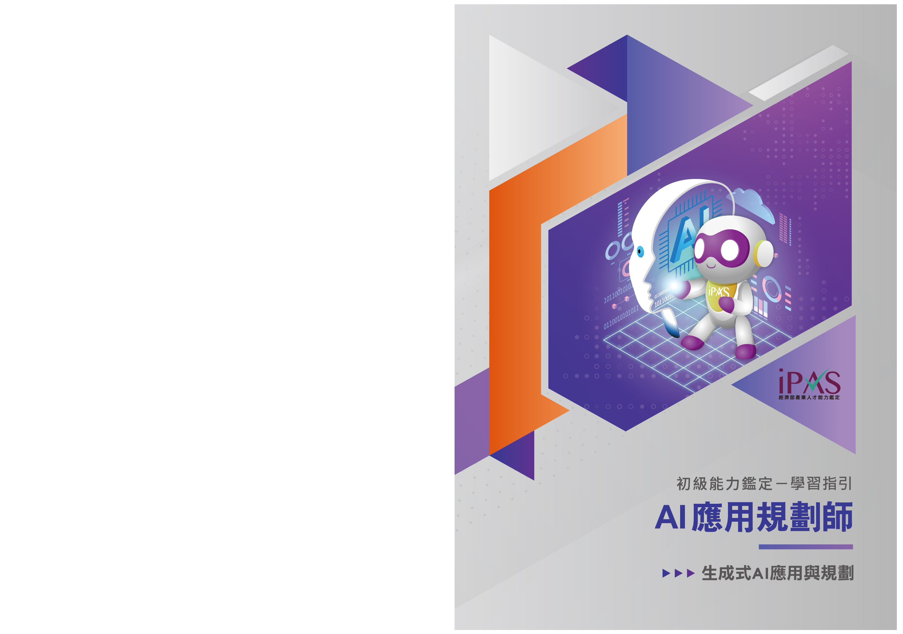

>  序 style="width:0.62667in;height:0.305in" />
>
> 為協助授課教師與考生掌握評鑑方向並有依循準備，本計畫委託

委員會題庫組及規劃組等領域專家，依據各科目評鑑內容，進行重點

說明與考題解析。

> 本手冊為學習指引，旨在提供學習方向與準備參考，並非正式教

材或題庫，亦不保證考試通過之責，建議考生依循考試簡章所公告之

評鑑主題內容，進行充分準備，以確保應試成效。

> 如有相關問題，請聯繫 iPAS@itri.org.tw。
>
> 經濟部產業人才能力鑑定推動小組
>
> 敬啟
>
> 
> 目錄
>
>  style="width:0.92222in;height:0.22167in" /> style="width:2.30403in;height:0.22167in" />..............................................
> ***1-1***
>
>  style="width:0.92222in;height:0.22167in" /> style="width:1.15042in;height:0.22167in" />.................................................................
> ***2-1***
>
>  style="width:0.92222in;height:0.22167in" /> style="width:0.99778in;height:0.22167in" /> style="width:1.3824in;height:0.22167in" />**AI**
> ............................................ ***3-1***
>
> 3.1 No code / Low code
> 概念............................................3-1
>
> 3.2 生成式 AI 應用領域與工具使用..............................3-17
>
>  style="width:6.29667in;height:2.89667in" /> style="width:0.6925in;height:0.22167in" /> style="width:0.46333in;height:0.22167in" /> style="width:1.61431in;height:0.22167in" />3.3 生成式 AI 導入評估規劃
> .........................................3-31
>
> ..................................................***A-1***

> 經濟部為有效提升產業人才素質，近年來持續致力於專業人才培訓發展。為

了更明確產業對各類專業人才的能力需求，特別針對亟需人才的多項重點產業，

邀集產官學專家，發展產業職能基準，提供各界依其內涵辦理培訓課程及規劃能

力鑑定機制。

> 為完成特定職業（或職類）工作任務，所需具備的能力組合（知識、技能、

態度）。

> **AI**
>
>  style="width:1.16163in;height:1.17693in" /> style="width:1.11075in;height:1.1092in" />完整的「AI
> 應用規劃師」職能基準， 可自右方 QRcode 下載：
>
>  第一章 考試科目與評鑑內容 style="width:6.295in;height:2.89667in" /> style="width:0.4825in;height:0.15333in" /> style="width:0.80625in;height:0.15333in" /> style="width:0.80625in;height:0.15333in" /> style="width:3.13958in;height:0.305in" />
>
> 1-1
>
>  第二章 考科內容 style="width:6.295in;height:2.89667in" /> style="width:1.56917in;height:0.305in" />
>
> 本指引將說明初級「AI 應用規劃師」科目二之考試內容，包含「生成式 AI 應

用與規劃」之評鑑主題「No code / Low code 概念」、「生成式 AI
應用領域與工具

使用」與「生成式 AI 導入評估規劃」，幫助考生掌握生成式 AI
相關技術的基本概

念、實際應用場景及工具操作方法， 並充裕評估導入生成式 AI 的能力。此外，

為強化學習成效，每章節將提供多樣化的練習評量，幫助考生自我測試與檢視學

習成果。

> 2-1
>
>  第三章 生成式 AI 應用與規劃 style="width:0.53717in;height:0.47388in" /> style="width:0.6925in;height:0.22167in" />
>
>  style="width:0.62667in;height:0.305in" /> style="width:0.62667in;height:0.305in" /> style="width:1.36267in;height:0.305in" /> style="width:1.88236in;height:0.305in" />**AI**
>
>  style="width:0.6925in;height:0.22167in" />**3.1** **No** **code**
> **/** **Low** **code**
>
> 隨著人工智慧（Artificial Intelligence,AI）的迅速普及與應用，No Code 與
> Low

Code 平台已成為推動 AI 民主化（AI
Democratization）的重要力量。這些平台透

過簡化開發流程，使更多非技術背景的人員能夠參與 AI 的創建與部署。No Code

與 Low Code 平台正快速改變 AI
的應用格局，不僅能幫助更多人實現創新，也將

成為未來企業數位轉型和個人創造力釋放的基石。

> 近年來，No Code 與 Low Code 平台快速演進，整合更多元的技術與功能，如

人工智慧（AI）與機器學習（ML），不僅拓展了應用範圍，更加速了開發流程，

如 TensorFlow 及 Keras
等工具已推出視覺化介面，讓無程式設計經驗的使用者也

能輕鬆建立機器學習模型。此外，數據分析與商業智慧（BI）的無程式化整合，

也正改變零售與供應鏈等行業的營運方式。透過這些工具進行顧客行為分析、庫

存優化與行銷活動數據追蹤，展現出極大的發展潛力。

> 在數位轉型動力下，No Code 和 Low Code 已成為技術開發中的重要概念，亦

使非技術背景的人士也能創建應用程式。與此同時，生成式 A（I GenerativeAI,
GAI）

技術的興起，進一步加速了該概念在各行各業中的應用，打破了開發應用軟體與

系統必須透過軟體工程師完成的關卡，進一步增加企業或組織數位轉型的可能性，

可縮短開發時間、降低技術門檻，並讓更多人參與到技術創新的過程中。No Code

和 Low Code 平台各有其適用場景與特點：

**1.** **No** **Code**

> No Code 平台透過視覺化介面和拖放操作，讓使用者無需編寫程式碼即可快

速開發應用，特別適合非技術背景者用於快速原型設計或小型應用開發。使用者

> 3-1
>
>  第三章 生成式 AI 應用與規劃
>
> 可透過拖曳元件來設計網頁或行動應用介面，並設定邏輯與流程，消除程式設計
>
> 需求，大幅降低開發門檻。
>
>  style="width:0.5875in;height:0.18833in" />**2.** **Low** **Code**
>
> Low Code 平台結合視覺化開發工具與程式碼擴充功能，讓具有技術背景的開
>
> 發者能在視覺化設計的基礎上，透過少量程式碼實現深度整合、客製化與複雜邏
>
> 輯，特別適合中大型企業，以及需要高彈性功能的應用開發，能有效提升開發效
>
> 率，同時保留程式設計的靈活性。
>
>  style="width:6.295in;height:2.89667in" /> style="width:0.85111in;height:0.18833in" /> style="width:0.78222in;height:0.18833in" />**3.** **AI** **No**
> **Code** **/** **Low** **Code**
>
> 生成式 AI（如 ChatGPT、DALL-E 等）進一步提升 No Code 和 Low Code 平
>
> 台的效能，實現自動化、智慧化開發與應用。
>
> （1） 自動生成程式碼：AI 協助開發客製化功能，節省開發時間。
>
> （2） 模板設計優化：AI 提供設計建議，快速完成介面設計與互動流程。
>
> （3） 數據分析與決策：AI
> 基於專案數據進行分析，提供決策建議並自動化操作。
>
> （4） AI 驅動的 UI/UX 設計：根據文字描述自動生成多樣化 UI
> 設計方案，設計師
>
> 可快速微調與應用。
>
> （5） 自動化行銷文案生成：輸入產品資訊，AI
> 即時產出吸引人的行銷內容，加速
>
> 行銷策略佈局。
>
> （6） 個人化 App
> 快速開發：透過用戶數據分析，生成符合需求的應用，實現個人
>
> 化體驗與快速部署。
>
>  style="width:0.85111in;height:0.18833in" /> style="width:2.15264in;height:0.18833in" />**4.** **AI**
>
> 生成式 AI 結合 No Code / Low Code 平台，不僅是技術革新，更為各產業帶
>
> 來嶄新發展契機。透過數據分析與自動化內容生成功能，各行業皆能提升營運效
>
> 率與服務品質：

3-2

>  第三章 生成式 AI 應用與規劃

（**1**） 醫療保健

> 藥物發現與設計：生成式 AI
> 可分析大量生物醫學數據，預測分子結構，協助新
>
> 藥開發，縮短研發週期。
>
> 個人化治療方案：依據患者基因組數據，AI 可設計量身客製的治療計畫，提升
>
> 療效與精準度。
>
> 病歷自動生成與輔助診斷：AI 快速整理病歷，根據患者病史與症狀提供初步診
>
> 斷建議，協助醫生專業判斷。

（**2**） 製造業

>  style="width:6.295in;height:2.89667in" />產品設計與原型製作：分析設計數據，自動生成創新且高效的產品設計，縮短
>
> 設計週期。
>
> 生產流程優化：透過數據分析，提供製程改善建議，實現自動化與精準化生產，
>
> 提升效率並降低成本。

（**3**） 金融業

> 風險評估與管理：可模擬各種市場情境，協助金融機構進行風險評估與策略規
>
> 劃。
>
> 投資組合優化：結合市場數據與趨勢分析，AI 提供最佳投資組合建議，平衡風
>
> 險與收益。
>
> 自動化合規監管：透過 AI 自動監控與分析法規變化，確保機構合規運作。

（**4**） 零售業

> 個人化行銷：AI 分析消費者行為，生成專屬行銷內容，提升顧客參與度與轉換
>
> 率。
>
> 庫存與供應鏈管理：AI 預測產品需求，優化補貨與庫存策略，降低庫存成本。
>
> 顧客體驗優化：結合客戶數據，提供個人化購物建議與產品推薦，增強用戶體
>
> 驗。
>
> 3-3
>
>  第三章 生成式 AI 應用與規劃
>
> （**5**） 教育領域
>
> 自動化教材生成：根據課程大綱，生成式 AI
> 可自動創建教學材料，協助教師專
>
> 注於教學核心設計、減輕教學資源整備負擔。
>
> 個人化學習路徑：依據學生的學習進度和興趣，生成式 AI
> 能設計個人化的學習
>
> 計畫，提升學習效果。
>
> 智慧評量與回饋（反饋）：自動批改作業並即時回饋（反饋），幫助學生針對弱
>
> 點強化學習。
>
> （**6**） 客戶服務
>
>  style="width:6.295in;height:2.89667in" />虛擬智慧客服：生成式 AI
> 可模擬真人對話，提供更親切與易於客戶理解的 24/7
>
> 客戶支援服務。
>
> 自動化回應生成：根據客戶詢問，生成式 AI
> 能快速生成準確的回應，提高服務
>
> 效率。
>
> 客訴分析與優化：分析客戶回饋（反饋），洞察問題趨勢，提出改善建議以優化
>
> 服務品質。
>
> 生成式 AI 在各行各業的應用正帶來深刻而廣泛的變革，不僅顯著提升了業
>
> 務流程的效率，還透過自動化與智慧化大幅降低了運營成本。企業藉由生成式
> AI，
>
> 不僅能加速決策與產品開發，還能靈活應對市場變化，鞏固競爭優勢並開創多元
>
> 獲利模式。
>
>  style="width:1.76472in;height:0.18833in" />**5.** **No** **Code**
> **/** **Low** **Code**
>
> 在數位化轉型浪潮下，No Code 與 Low Code 平台成為企業快速開發應用程式
>
> 的重要工具。選擇合適的平台對於提升開發效率、降低成本並滿足業務需求至關
>
> 重要。以下是選擇與評估 No Code / Low Code 平台時需要考量的 6
> 個關鍵因素：
>
> （**1**） 目標用戶與技術需求
>
> No Code 平台：主要面向非技術使用者，允許透過直觀的拖放介面構建應用程

3-4

>  第三章 生成式 AI 應用與規劃
>
> 式，適用於快速原型設計或解決簡單業務問題的場景，例如建立簡易的工作流
>
> 程或內部工具。
>
> Low Code 平台：針對具有一定技術背景的使用者，提供視覺化開發工具，同時
>
> 允許編寫少量程式碼以實現更高的自訂性，適合需要開發具有複雜邏輯或功能
>
> 的應用程式，特別是在企業級應用場景中。

（**2**） 功能與擴展性

> 系統整合能力：評估平台與現有系統（如 CRM、ERP 等）的整合能力，以確保
>
> 數據流通與業務流程的無縫連接。
>
>  style="width:6.295in;height:2.89667in" />高度自訂性：確保平台能夠滿足特定業務需求，並提供足夠的自訂選項，如自
>
> 定義報表、工作流設計等。

（**3**） 安全性與合規性

> 資料安全與隱私保護：確認平台符合相關的資料保護法規，並提供必要的安全
>
> 措施，包括資料加密、身份驗證、多重安全機制等。
>
> 權限管理：確保平台具備細緻的權限控制，能有效限制敏感資訊的存取，保護
>
> 企業核心資料的安全。

（**4**） 成本與效益

> 總擁有成本（Total Cost of Ownership,
> TCO）：考量平台的購買、維護、培訓等
>
> 相關成本，評估其對企業的整體財務影響，避免隱性費用。
>
> 投資回報率（Return On Investment,
> ROI）：衡量平台在縮短開發週期、產品上市
>
> 時間，提升開發效率等效益，確保投資具有實際價值。

（**5**） 技術支援與社群資源

> 技術支援：評估平台提供的支援服務，包括技術文件、線上論壇和專業客服，
>
> 確保在開發過程中獲得即時幫助。
>
> 3-5
>
>  第三章 生成式 AI 應用與規劃
>
> 用戶社群活躍度：社群是否活躍，能否提供豐富的開發資源與經驗分享。
>
> （**6**） 市場評價與案例
>
> 用戶評價：查閱其他企業或使用者對平台的評價，了解其優缺點及實際應用效
>
> 果。
>
> 成功案例：了解平台在相似行業或業務場景中的應用情況，評估其適用性和可
>
> 靠性。
>
> 企業應根據自身業務需求、技術能力與預算進行全方位評估，並深入了解各
>
> 平台的功能優勢，選擇最能支持業務成長與創新的解決方案。
>
>  style="width:6.295in;height:2.89667in" /> style="width:0.85111in;height:0.18833in" /> style="width:1.76097in;height:0.18833in" />**6.** **AI** **No**
> **Code** **/** **Low** **Code**
>
> 隨著生成式 AI 的快速發展，將其與 No Code / Low Code 平台結合已成為提
>
> 升企業效率與創新能力的熱門趨勢。然而，這種結合雖具高度潛力，卻也伴隨著
>
> 多重挑戰，須積極應對。
>
> （**1**） 模型準確性與可靠性
>
> 輸出結果錯誤風險：生成式 AI 可能產生不準確或不符預期的內容。
>
> 驗證機制不足：缺乏嚴謹的審核與驗證流程，可能導致錯誤內容進入生產環境。
>
> 解方：建立多層次驗證機制，結合自動化檢測與人工審核，確保生成內容的準
>
> 確性與一致性。
>
> （**2**） 資料隱私與安全性
>
> 敏感資料洩漏風險：生成式 AI 處理大量資料時，容易暴露用戶隱私或企業機
>
> 密。
>
> 合規風險：需遵循個資法（GDPR、CCPA）等相關法規，避免違規使用資料。
>
> 解方：採用資料加密、匿名化與權限控管機制，確保資料安全與法規合規。

3-6

>  第三章 生成式 AI 應用與規劃

（**3**） 道德與倫理風險

> 生成虛假資訊：AI 可能被濫用於製造錯誤資訊、假消息或惡意內容。
>
> 偏見與歧視：模型訓練數據若存在偏見，將影響決策公正性。
>
> 解方：建立倫理準則與使用規範，導入公平性檢測工具，確保 AI
> 負責任地應用。

（**4**） 技術整合與平台適配性

> 系統整合難度：將生成式 AI 模型無縫整合至 No Code / Low Code
> 平台，需克服
>
> 技術與架構差異。
>
> 效能優化挑戰：生成式 AI 模型資源需求高，平台需優化效能與資源分配。
>
>  style="width:6.295in;height:2.89667in" />解方：選擇具備 API
> 擴充能力的開放式平台，並採用雲端運算分散資源負載。
>
> 為克服上述挑戰並實現穩定可靠的應用，可從以下四大面向著手：
>
> **A.** 數據品質管理
>
> 確保訓練數據多樣性與高品質，避免資料偏見。
>
> 定期審核與更新數據集，讓模型持續學習最新資訊。
>
> **B.** 模型效能評估
>
> 採用多維度評估指標（準確性、可靠性、創造性）全面檢測模型表現。
>
> 定期進行壓力測試與場景模擬，確保模型在各種情境下的穩定性。
>
> **C.** 人機協作機制
>
> 結合人類專業知識與 AI，強化內容生成的審核與優化。
>
> 在關鍵應用場景設置人工干預機制，降低潛在風險。
>
> **D.** 安全防護與風險控管
>
> 建立多層次防護措施，防止模型遭惡意攻擊或生成有害內容。
>
> 3-7
>
>  第三章 生成式 AI 應用與規劃
>
> 定期進行資安檢測與弱點掃描，提升平台整體安全性。
>
> 生成式 AI 與 No Code / Low Code 技術的結合，為企業帶來前所未有的創新
>
> 動能與開發效率。然而，面對模型準確性、資料隱私、倫理風險與技術整合等挑
>
> 戰，企業需從技術、法律與倫理多方面著手，建立完善的風險管理與安全保障機
>
> 制，方能穩健發揮這項技術的潛力，為企業創造長遠價值。
>
>  style="width:1.1764in;height:0.18833in" />**7.** **No** **Code** **/**
> **Low** **Code**
>
> No Code 和 Low Code 平台已成為推動企業創新與成長的關鍵工具。這些平台
>
>  style="width:6.295in;height:2.89667in" />提供高效能與可擴展性，支援高流量應用與複雜業務邏輯，同時靈活調整價格模
>
> 式，以滿足用戶規模、數據成長與功能需求的快速變化。其市場價值主要展現在
>
> 以下幾個面向：
>
> （**1**） 降低開發成本
>
> 簡化開發流程：透過視覺化介面與拖放式設計，No Code / Low Code 平台降低
>
> 了程式開發的技術門檻。
>
> 節省人力資源：企業無需大量聘請專業程式設計師，業務部門與非技術人員也
>
> 能參與應用開發。
>
> 提高資源運用效率：技術與業務團隊可專注於核心業務發展，減少重複性開發
>
> 工作。
>
> （**2**） 縮短上市時間
>
> 快速部署與更新：平台內建多種即用型模組、元件與 API 整合工具，降低開發
>
> 與測試時間。
>
> 敏捷開發與調整：企業可根據市場需求快速調整產品功能與設計，提升市場反
>
> 應速度。

3-8

>  第三章 生成式 AI 應用與規劃

（**3**） 加速數位轉型

> 跨部門協作：No Code / Low Code 平台促進 IT
> 與業務部門協作，快速開發業務
>
> 應用與自動化流程。
>
> 靈活應對市場變化：企業可依需求快速構建數位解決方案，優化內部流程、改
>
> 善客戶體驗。
>
> 導入 AI 與自動化：結合生成式
> AI，企業能快速打造智慧型應用與自動化服務，
>
> 加速數位轉型步伐。
>
> No Code / Low Code 平台憑藉其降低成本、縮短上市時間與加速數位轉型等
>
>  style="width:6.295in;height:2.89667in" /> style="width:1.42958in;height:0.18833in" />優勢，正逐步成為企業數位創新的關鍵驅動力。結合
> AI 技術的應用，這類平台將
>
> 進一步釋放企業創新潛能，協助各產業快速適應市場變化，實現永續成長與競爭
>
> 優勢。
>
> **8.** **AI** **No** **Code** **/** **Low** **Code**
>
> No Code 和 Low Code 平台已成為數位轉型與企業創新的關鍵驅動力。隨著
>
> AI
> 技術不斷進步，這類平台的市場價值和應用場景持續擴大，未來發展潛力不可
>
> 忽視。

（**1**） 市場發展與效益

> 企業應用滲透率提升：No Code 平台降低了技術門檻，使非技術人員也能參與
>
> 應用開發，促進跨部門協作；Low Code
> 平台則兼具圖形化界面與程式碼靈活性，
>
> 滿足複雜業務需求，適用於多元產業。
>
> 降低成本與縮短上市時間：減少對專業開發人力的依賴，顯著降低開發與維護
>
> 成本，特別有利於中小企業；快速構建與部署應用，幫助企業迅速回應市場變
>
> 化並搶占市場先機。
>
> 3-9
>
>  第三章 生成式 AI 應用與規劃
>
> （**2**） 未來發展方向與潛力
>
> 自動化與智慧化升級：結合 AI 技術，自動化程式碼生成、流程設計與應用優
>
> 化，大幅降低開發門檻與時間成本；AI 助理將協助用戶完成模型訓練與優化，
>
> 實現零程式碼 AI 應用開發。
>
> 與生成式 AI 整合應用：AI 自動建議應用設計、功能與流程，可大幅提升開發
>
> 效率；快速產生行銷文案、產品描述與設計素材，支援業務推廣。
>
> No Code / Low Code 平台已成為推動企業數位轉型的重要引擎，尤其是生成
>
> 式 AI 的深度融合，將持續擴展應用領域與市場規模。這些平台透過降低開發成
>
>  style="width:6.295in;height:2.89667in" /> style="width:1.37122in;height:0.18833in" />本、縮短上市時間與加速數位轉型，不僅為企業創造更高的價值，也推動全球開
>
> 發模式的持續創新與進化。
>
> **9.** **AI**
>
> AI 民主化（AI Democratization）是指將 AI 技術的使用和應用、從少數專家
>
> 和大型企業擴展到更廣泛的社會層面，使更多非技術背景的人士和中小型企業都
>
> 能夠參與 AI 開發、並受益於其價值。這一理念旨在降低 AI
> 的技術門檻，讓各行
>
> 各業都能輕鬆運用 AI，促進創新和公平性。
>
> No Code / Low Code 平台將技術的力量擴展到更多非技術背景的個人與企業，
>
> 例如「市民開發者（Citizen
> Developer）」可以利用這些工具來自動化日常工作，如
>
> 報告生成與數據輸入，大幅提高生產力並減少錯誤。同時，這些平台促進了「創
>
> 意民主化」，讓更多用戶能參與應用開發與 AI
> 技術創新，甚至在教育與醫療等社
>
> 會關鍵領域提供新穎解決方案。
>
> 以下是此類趨勢對 AI 民主化的主要影響：
>
> （**1**） 降低技術門檻
>
> No Code / Low Code 平台的直觀界面和模組化工具，讓非技術背景的人也能
>
> 開發 AI 驅動的應用，也讓更多行業能夠用這些工具解決具體的問題。

3-10

>  第三章 生成式 AI 應用與規劃

（**2**） 擴大 **AI** 的可訪問性

> 傳統的 AI 開發需要大量資源，而 No Code / Low Code 平台減少了成本，讓
>
> 中小型企業甚至非營利組織能夠使用 AI，這使得 AI
> 從少數大企業的專利擴展為
>
> 一項普遍可用的工具。

（**3**） 推動跨領域創新

> 促進業務部門和技術部門之間的協作，使得 AI 能在各行各業中發揮更大作
>
> 用。

（**4**） 強化 **AI**
技術的普及化應用

> 隨著開發流程簡化，AI 的學習曲線變得更加平緩，生成式 AI 的應用範圍也
>
> 進一步擴大。例如，透過描述需求來生成文本或圖像，使 AI
> 在教育、行銷和創意
>
> 產業中普及。

（**5**） 啟動全球性影響

> 特別是在發展中國家和欠缺技術資源的地區，No Code / Low Code 平台讓這
>
> 些地方的使用者有機會接觸和使用 AI 技術，促進了全球範圍內的技術平權和社
>
> 會進步。
>
> 然而，AI 民主化的同時也伴隨著挑戰，例如過度依賴 No Code 工具可能導致
>
> 使用者缺乏對 AI
> 的深層理解，進而可能引發模型偏差或誤用的風險。因此，在推
>
> 進 AI 民主化的同時，也需要加強相關教育和規範，確保 AI
> 技術被負責任地使用。
>
> 3-11
>
>  第三章 生成式 AI 應用與規劃 style="width:1.76146in;height:0.42792in" /> style="width:1.66821in;height:0.42792in" /> style="width:1.25029in;height:0.24928in" /> style="width:0.50253in;height:0.50433in" />
>
> 1\. 關於 No Code 與 Low Code 的基本概念，以下哪一項最為正確？
>
> （A）No Code 平台完全不需要任何技術知識，Low Code
> 平台僅適合專業開發者使用
>
> （B）No Code 平台主要依靠圖形化介面（UI）進行開發，而 Low Code 平台結
>
> 合了簡單程式設計與視覺化工具
>
> （C）No Code 與 Low Code 平台主要針對傳統 IT 團隊而設計
>
> （D）Low Code 平台完全不需要程式設計知識
>
> 2\. No Code / Low Code 技術的主要優勢不包括以下哪一項？
>
>  style="width:6.295in;height:2.89667in" />（A）加速開發流程，降低企業開發成本
>
> （B）幫助非技術人員創建應用和自動化流程
>
> （C）完全消除對專業技術人員的需求
>
> （D）加速企業數位轉型並提升競爭力
>
> 3\. 下列何者最能表達 No Code / Low Code 平台的主要特色？
>
> （A）需要撰寫大量程式碼
>
> （B）運用模板快速建立應用程式
>
> （C）僅供專業開發人員使用
>
> （D）只能製作靜態網站
>
> 4\. 關於 No Code 平台，下列敘述何者較為準確？
>
> （A）已經完全取代傳統的 AI 開發模式
>
> （B）只適用於大型企業
>
> （C）是一種降低 AI 技術複雜性和開發成本的新興方法
>
> （D）工具都具有完全相同的功能和效能
>
> 5\. 關於 No Code / Low Code 平台，下列敘述何者較正確？
>
> （A）兩者完全相同
>
> （B）Low Code 平台不需要任何程式設計知識
>
> （C）Low Code 平台更適合開發靈活且可擴展的解決方案

3-12

>  第三章 生成式 AI 應用與規劃
>
> （D）No Code 平台可以無限客製化

6\. 下列哪一項不是 No Code / Low Code 平台在推動 AI 民主化過程中的挑戰？

> （A）使用者缺乏對 AI 的深層理解
>
> （B）可能引發模型偏差或誤用
>
> （C）需要加強人員相關教育和規範
>
> （D）提供昂貴的開發工具

7\. 生成式 AI 在金融業的應用不包括以下哪一項？

> （A）風險評估與管理
>
> （B）投資組合優化
>
>  style="width:6.295in;height:2.89667in" />（C）自動化生成病歷
>
> （D）提供個人化投資建議

8\. No Code 平台的設計目標是降低技術門檻，使哪一類使用者能夠開發應用程

> 式，而無需撰寫程式碼？
>
> （A）技術專家
>
> （B）非技術背景的使用者
>
> （C）資深開發者
>
> （D）系統管理員

9\. 關於生成式 AI 與 No Code / Low Code 平台的應用，下列何者最不適合？

> （A）自動生成程式碼
>
> （B）自動化生成行銷文案
>
> （C）快速開發個人化 App
>
> （D）自動化生成法律判決

10\. 在選擇No Code/ Low Code
平台時，下列何者為考慮功能與擴展性時最重要因素？

> （A）平台的購買成本
>
> （B）平台的技術整合能力和自訂性
>
> （C）使用者的程式設計能力
>
> （D）平台的市場評價
>
> 3-13
>
>  第三章 生成式 AI 應用與規劃 style="width:0.52736in;height:0.53266in" /> style="width:0.39294in;height:0.38925in" /> style="width:0.4991in;height:0.25028in" /> style="width:0.53253in;height:0.52754in" /> style="width:0.38777in;height:0.38413in" /> style="width:0.49979in;height:0.25028in" /> style="width:0.53253in;height:0.52754in" /> style="width:0.38777in;height:0.38413in" /> style="width:0.4991in;height:0.25028in" /> style="width:0.52219in;height:0.52754in" /> style="width:0.38777in;height:0.38413in" /> style="width:0.4991in;height:0.25028in" />
>
> 1\. <u>**Ans**（**B**）</u>
>
> <u>解析：</u>No Code
> 平台的核心特點是使用圖形化介面（UI）讓用戶無需撰寫任何
>
> 程式碼即可完成開發，而 Low Code 平台則是結合了少量程式設計與圖形化工
>
> 具，適合具備基本技術能力的用戶。選項（B）正確描述了兩者的特性，其他
>
> 選項錯誤在於過於片面或不符合事實。
>
> 2\. <u>**Ans**（**C**）</u>
>
> <u>解析</u>：No Code 和 Low Code
> 平台可以大幅降低對專業技術人員的依賴，但不
>
>  style="width:6.295in;height:2.89667in" />能完全取代他們，尤其是在需要高度客製化或複雜邏輯的應用場景中。選項
>
> （C）描述不正確，而選項（A）、（B）和（D）均是這些平台的重要優勢。
>
> 3\. <u>**Ans**（**B**）</u>
>
> <u>解析</u>：No Code / Low Code
> 平台的主要特色是提供視覺化界面與模板，讓使用
>
> 者不需撰寫或僅需撰寫少量程式碼即可快速建立應用程式。這類平台適合非技
>
> 術人員使用，支持動態與互動式應用的開發，降低開發門檻和時間成本。其他
>
> 選項與此平台的核心特點不符。
>
> 4\. <u>**Ans**（**C**）</u>
>
> <u>解析：</u>No Code
> 平台是一種新興技術，透過圖形化介面及預建模組，使用者無
>
> 需撰寫程式碼即可實現開發工作，從而有效降低技術複雜性與開發成本，選項
>
> （C）最為準確。
>
> 5\. <u>**Ans**（**C**）</u>
>
> <u>解析</u>：No Code 和 Low Code 平台雖然相似，但有明顯差異。No Code
> 平台完
>
> 全針對非技術使用者設計，無需撰寫程式碼即可完成應用開發；而 Low Code
>
> 平台則適合具有基本程式知識的開發者，允許透過少量程式碼進行進一步的客
>
> 製化，並具備更大的靈活性與擴展性，因此適合開發更複雜的解決方案，選項
>
> （C）較為正確。

3-14

>  第三章 生成式 AI 應用與規劃

6\. <u>**Ans**（**D**）</u>

> <u>解析</u>：No Code 和 Low Code 平台在推動 AI
> 民主化過程中的挑戰包括使用者
>
> 缺乏對 AI 的深層理解、可能引發模型偏差或誤用，以及需要加強人員相關教
>
> 育和規範，而不是提供昂貴的開發工具。

7\. <u>**Ans**（**C**）</u>

> <u>解析</u>：生成式 AI
> 在金融業的應用包括風險評估與管理、投資組合優化和提供個
>
> 人化投資建議，但自動化生成病歷是醫療領域的應用。

8\. <u>**Ans**（**B**）</u>

> <u>解析：</u>No Code
> 平台主要讓沒有程式設計背景的人也能輕鬆構建應用程式。這
>
>  style="width:6.295in;height:2.89667in" />些平台提供直觀的圖形化界面和拖放工具，使使用者能夠透過簡單的操作來設
>
> 計和開發應用程式，無需編寫程式碼。這相比之下，技術專家、資深開發者和
>
> 系統管理員通常具備較高的程式設計能力，可能更傾向於使用 Low Code 平台
>
> 或傳統的開發工具來實現更複雜和自訂的功能。因此，No Code 平台的主要目
>
> 標群體是非技術背景使用者，幫助他們提高生產力並減少對技術專家的依賴。

9\. <u>**Ans**（**D**）</u>

> <u>解析</u>：生成式 AI
> 可以根據使用者的需求自動生成程式碼，幫助完成複雜的客
>
> 製化功能，節省開發時間；在行銷方面，輸入產品資訊後，AI 能生成吸引人的
>
> 行銷文案；基於使用者數據，AI 還能快速開發符合個人需求的 App。然而，自
>
> 動化生成法律文件並不屬於這些平台的常見應用案例，因為法律判決的生成通
>
> 常需要專業的法律知識和嚴格的合規性審查，這超出了 No Code / Low Code
>
> 平台的主要功能範疇。法律文件的準確性和合法性至關重要，通常需要專業律
>
> 師的參與和審核，而不是僅依賴自動化工具。

10\. <u>**Ans**（**B**）</u>

> <u>解析</u>：在選擇 No Code / Low Code
> 平台時，功能與擴展性是關鍵考量因素之
>
> 一，包括平台的技術整合能力和自訂性。技術整合能力指的是平台能否與現有
>
> 系統（如 CRM、ERP 等）無縫連接，確保資料流通和業務流程的順暢。自訂
>
> 性則是指平台是否能夠滿足特定業務需求，提供足夠的自訂選項來適應不同的
>
> 3-15
>
>  第三章 生成式 AI 應用與規劃 style="width:6.295in;height:2.89667in" />
>
> 應用場景。這些因素直接影響平台的實用性和靈活性，使企業能夠根據自身需
>
> 求進行調整和擴展。相比之下，平台的購買成本、使用者的程式設計能力和市
>
> 場評價雖然也重要，但它們並不屬於功能與擴展性的範疇。

3-16

>  第三章 生成式 AI 應用與規劃 style="width:0.53717in;height:0.47388in" /> style="width:0.6925in;height:0.22167in" />
>
>  style="width:2.30403in;height:0.22167in" />**3.2** **AI**
>
> 生成式 AI 是人工智慧的一個重要分支，其核心特徵在於透過模型的學習能
>
> 力生成新內容，而非僅僅分析或辨識現有數據。這種能力不僅在技術層面帶來突
>
> 破，也為多領域應用和市場價值創造了豐富的可能性。
>
> 隨著 ChatGPT 於 2022 年 11 月正式向公眾推出後，生成式 AI 掀起了一波重
>
>  style="width:6.295in;height:2.89667in" /> style="width:0.85111in;height:0.18833in" /> style="width:1.1744in;height:0.18833in" />大的科技革命浪潮，不僅徹底改變了人類與機器互動的方式，更廣泛應用在不同
>
> 領域，為各行各業帶來前所未有的創新契機。
>
> **1.** **AI**
>
> 生成式 AI 的基本概念為人工智慧的一個核心領域，專注於透過深度學習和
>
> 大數據集的訓練來生成新的內容，而非僅僅分析或辨識現有數據。它通常基於生
>
> 成對抗網路（GAN）、變分自編碼器（VAE）以及基於變換器（Transformer）架構
>
> 的模型來執行其任務。以下是生成式 AI 的技術架構及其關鍵特徵：

（**1**） 深度學習網路（**Deep** **Learning** **Networks**）

> 多層神經網路（Multi-layer Neural
> Network）：使用多層神經網路進行特徵提取
>
> 與表示學習，有助於從數據中提取深層特徵。
>
> 注意力機制（Attention
> Mechanism）：尤其是自注意力（Self-Attention），有助於
>
> 處理長距離依賴關係，並有效學習序列數據的內在結構。

（**2**） 訓練數據處理（**Training** **Data** **Processing**）

> 數據清洗（Data
> Cleaning）：移除雜訊（Noise）或錯誤的數據，並填補遺缺值
>
> （Missing Value），以保證數據的品質與一致性。
>
> 標記化處理（Tokenization）：將文本數據拆分為基本單元（例如詞或子詞），以
>
> 3-17
>
>  第三章 生成式 AI 應用與規劃
>
> 便深度學習模型進行處理。
>
> 向量化表示（Vectorization）：將文本或其他數據轉換為數值形式，從而適應深度
>
> 學習模型的需求。
>
> （**3**） 推理機制（**Inference** **Mechanism**）
>
> 溫度參數（Temperature
> Parameter）：控制生成內容的隨機性，低溫度值會生成較
>
> 保守的內容，高溫度值則生成更具創意的內容。
>
> 頂部採樣（Top-k Sampling）：選擇生成機率最高的前 k
> 個選項來生成內容，保
>
> 證品質與多樣性。
>
>  style="width:6.295in;height:2.89667in" />核採樣（Nucleus
> Sampling）：選擇累積機率達到某一閾值（如 0.9）的選項進行
>
> 採樣，以更靈活地平衡內容品質與隨機性。
>
> 生成式 AI 具備多項關鍵特點，包括強大的上下文理解能力、遷移學習特性、
>
> 多模態處理支持，以及透過提示詞進行可控生成。然而，在實際應用中也面臨諸
>
> 多挑戰，如大量計算資源需求、模型訓練和部署的硬體限制、輸出內容的準確性
>
> 保證、AI 幻覺（AI
> hallucinations）問題的防範，以及偏見與安全性等考量。為應
>
> 對這些挑戰，技術持續朝著多個方向演進：在模型效率方面，致力於模型壓縮、
>
> 量化和推理加速；在架構創新上，發展混合注意力機制和模塊化設計；在應用擴
>
> 展上，探索領域特定微調和多模態融合。
>
>  style="width:1.76292in;height:0.18833in" />**2.**
>
> 生成式 AI 的市場價值與影響力正以驚人的速度增長，並在全球各行各業中
>
> 發揮出極大的潛力。其市場發展可分為以下幾個關鍵層面：
>
> （**1**） 市場規模與增長趨勢
>
> 生成式 AI 的市場規模預計將在 2030 年達到數百億美元，涉及領域包括娛樂、
>
> 醫療、教育、廣告、遊戲設計等。企業利用生成式 AI
> 來加速產品設計和行銷，學
>
> 術界則用其來進行科學探索，無論是創作還是實用領域，都顯示出強大的市場需求。

3-18

>  第三章 生成式 AI 應用與規劃

（**2**） 創業與投資熱潮

> 生成式 AI 正驅動著創業與投資熱潮，主要集中於垂直領域應用開發、工具平
>
> 台建設以及安全隱私解決方案的創新。

（**3**） 市場發展趨勢

> 市場整合加速：技術整合、產業鏈完善及標準規範的建立。
>
> 商業模式創新：例如訂閱制服務、客製化解決方案的普及。
>
> 永續發展考量：聚焦能源效率、環境影響評估及社會責任的實踐。

（**4**） 挑戰與風險

> 技術層面：資料安全、模型可靠性和系統穩定性。
>
> 商業層面：投資回報的不確定性、市場競爭加劇以及法規要求的增高。
>
> 社會層面：就業結構變動、數位落差及倫理道德問題。

（**5**） 產業轉型影響

> 生成式 AI 在企業層面的應用推動了生產力的大幅提升，尤其在內容創作、軟
>
> 體開發和客戶服務等領域，顯著提高自動化程度，讓企業能專注於更具戰略性的
>
> 任務。

（**6**） 就業市場變革

> 生成式 AI 對就業市場的影響是雙面性的：
>
> 工作取代：部分重複性、低技能工作可能會被 AI 取代。
>
> 新興職務：如 AI 訓練師、提示工程師（Prompt
> Engineer）等新興職務逐漸湧現。

（**7**） 經濟效益分析

> 直接效益：降低營運成本並提高生產效率。
>
> 間接效益：促進創新並開創新業務模式。
>
> 3-19
>
>  第三章 生成式 AI 應用與規劃
>
> 衍生效益：帶動相關產業的發展，如 AI 硬體和雲端服務。
>
> （**8**） 社會影響層面
>
> 教育領域：個人化學習、生成教學資源和優化學習評估。
>
> 醫療健康：輔助診斷、加速藥物研發及個人化醫療方案。
>
> 創意產業：內容創作革新、設計流程優化及娛樂體驗提升。
>
> 生成式 AI 的發展正重新塑造全球經濟與社會結構，帶來了無數的機遇與挑
>
> 戰。隨著技術的進步，各行各業的創新潛力日益增強，未來的市場將更加多元與
>
>  style="width:6.295in;height:2.89667in" /> style="width:1.56806in;height:0.18833in" />競爭，並要求企業、政府與個人積極應對變革，共同推動
> AI 技術的健康發展。
>
> **3.** **AI**
>
> 生成式 AI 工具的技術進化不僅呈現了過去幾年來關鍵技術的突破，還在應
>
> 用層面帶來了巨大的變革。從深度學習到多模態生成，這些進步使得生成式 AI
> 成
>
> 為可供廣泛使用的工具，從大型機構到中小型企業，再到個人創作者，均能夠進
>
> 行創意產出或解決具體問題。
>
> （**1**） 生成式 **AI** 技術突破
>
> 生成式 AI 的技術進化主要得益於幾項關鍵技術的發展，這些技術突破互相
>
> 融合，提升了生成模型的效能與實用性：
>
> 生成對抗網路（GAN）：引領了高品質圖像生成的潮流，並能夠生成多樣化且真
>
> 實感強的圖像。
>
> 變分自編碼器（VAE）和流式模型（Flow-based Generative
> Model）：提供穩定性
>
> 和機率生成方法，使生成模型在更廣泛的應用中穩定運行。
>
> Transformer 架構與自注意力機制（Self-attention）：尤其是 GPT
> 系列模型，徹底
>
> 改變了語言生成的方式，並支持大規模的多模態生成，如 DALL-E 和 Stable
>
> Diffusion，將文本與圖像生成結合。

3-20

>  第三章 生成式 AI 應用與規劃
>
> 預訓練與模型微調技術：如少樣本學習和提示工程提升了模型的適應性與精準
>
> 度。加上人類回饋（反饋）強化學習（Reinforcement Learning from Human
>
> Feedback, RLHF），可使生成結果更貼近用戶需求。
>
> 高效推理與模型壓縮：如 vLLM 架構，讓生成式 AI
> 能夠在實時場景中應用，特
>
> 別適用於邊緣計算和移動設備。

（**2**） 生成式 **AI** 工具的發展方向

> **A.** 模型規模與能力提升
>
> 大型語言模型（LLM）：以 GPT 系列為代表的語言模型正不斷擴展其參數規模
>
>  style="width:6.295in;height:2.89667in" />和計算能力，顯著提高語言生成的連貫性與語義深度。例如
> GPT-4 等版本進一
>
> 步提升了語言理解與生成的準確度。
>
> 多模態生成：將文本、圖像、音訊等多種模態結合，開創了更多應用場景。例
>
> 如 Midjourney：從文本和圖片生成藝術風格、創意融合的圖像；DALL-E：基於
>
> 文本生成高品質圖像，實現跨模態的創意設計。
>
> **B.** 輕量化與個人化發展
>
> 模型壓縮與量化：這些技術減少了生成式 AI
> 工具的計算和儲存需求，能夠讓工
>
> 具在資源有限的環境中運行，如邊緣設備或移動設備，進一步擴展其應用範圍。
>
> 個人化客製化：企業正在開發資源需求較低且可客製化的生成式 AI
> 工具，根據
>
> 不同的商業環境和特定用戶需求進行調整，使 AI 更加適應市場需求。
>
> **C.** 深層學習架構的改進
>
> 生成對抗網路（GAN）與擴散模型的融合技術，顯著提升了生成式 AI 的品質
>
> 和精度，使生成的內容更為真實、細緻。例如，擴散模型在圖像生成的應用中展
>
> 現出了極高的準確性和自然感。
>
> 3-21
>
>  第三章 生成式 AI 應用與規劃
>
> （**3**） 開放原始碼與社群合作
>
> 開放原始碼和社群合作是生成式 AI 進步的重要驅動力之一。平台如 Hugging
>
> Face
> 提供了開源資源，使得更多的開發者、企業和研究機構能夠共享技術資源，
>
> 並加速 AI 工具的整合與創新。
>
>  style="width:1.56806in;height:0.18833in" />**4.**
>
> 生成式 AI 工具的發展正快速邁向多元化與專業化，逐步滲透至各行各業，並
>
> 在應用層面與技術層面展現出明顯趨勢。以下將從多個面向詳細說明其發展與趨
>
> 勢：
>
>  style="width:6.295in;height:2.89667in" />（**1**） 專業化與垂直整合
>
> 生成式 AI 工具逐步針對特定產業（如法律、醫療、金融、教育）進行深度優
>
> 化，提供符合該領域需求的專屬解決方案。如：
>
> 法律領域：AI 工具能協助法律文件自動化撰寫與審閱、風險評估與法規檢索。
>
> 醫療領域：輔助醫療影像診斷、臨床報告生成與個人化健康建議。
>
> 金融領域：自動化投資建議、風險管理分析與詐騙偵測。
>
> 教育領域：個人化學習路徑設計、教材生成與互動式學習平台。
>
> （**2**） 多模態整合與協同生成
>
> 生成式 AI 工具已突破單一模態，實現文字、圖像、語音、影片等多模態內容
>
> 的協同生成：
>
> 文字與圖像整合：如 DALL-E 與 Midjourney 等，將文本描述轉化為圖像。
>
> 語音與文字轉換：如 Whisper 與 ChatGPT
> 語音模式，實現語音與文字的無縫轉換。
>
> 影音內容生成：透過 AI 進行智慧剪輯、特效添加與影片內容生成。
>
> （**3**） **AI** 即服務（**AI** **as** **a** **Service,** **AIaaS**）
>
> 雲端運算與 API 服務的普及降低了生成式 AI 的使用門檻：

3-22

>  第三章 生成式 AI 應用與規劃
>
> 用戶無需高階硬體或專業知識，即可透過雲端平台（如 OpenAI API、Hugging
>
> Face Spaces）存取高效能 AI 工具。
>
> API 介接與外掛程式讓企業能輕鬆整合 AI 工具至現有流程中。

（**4**） 個人化生成與可控性提升

> 生成式 AI 工具更加強調用戶控制權與個人化內容生成：
>
> 模型微調（Fine-tuning）與提示工程（Prompt
> Engineering），讓用戶能根據特定
>
> 需求調整生成結果。
>
> 參數調整與風格選擇功能提升內容精準度與多樣性。
>
>  style="width:6.295in;height:2.89667in" />領域知識整合，提供更符合產業需求的應用。

（**5**） 協作與即時回饋（反饋）機制

> 生成式 AI 工具增強了與用戶的互動性：
>
> 即時回饋（反饋）與迭代式內容優化讓用戶可即時調整生成結果。
>
> 團隊協作功能使多名用戶可同時參與內容創作與修改，提升協作效率。

（**6**） 安全性與隱私保護

> 隨著資料安全與隱私議題受到重視，AI 工具加強了相關機制：
>
> 本地部署選項確保敏感資料不外洩。
>
> 資料加密處理與隱私保護模式保障用戶資訊安全。
>
> 版權管理與內容過濾機制避免違規與濫用。

（**7**） 效能優化與資源效率

> 生成式 AI 工具持續追求高效能與資源最佳化：
>
> 高效 Transformer 架構與 Diffusion Models 改良，提升生成速度與品質。
>
> 模型壓縮（Model
> Compression）與量化（Quantization）技術降低硬體資源需求，
>
> 支援邊緣設備與移動設備運行。
>
> 3-23
>
>  第三章 生成式 AI 應用與規劃
>
> 批量處理能力增強，大幅提升企業應用效率。
>
> （**8**） 生態系統建構與擴展
>
> 生成式 AI 工具透過 API、外掛與第三方整合構建完整生態系：
>
> Hugging Face、OpenAI 等平台提供豐富資源與開發工具，加速產業應用。
>
> 跨平台整合與模組化設計促進生態圈擴張，支持多種產業與應用情境。
>
> （**9**） 道德與法律規範
>
> 內容版權管理：確保生成內容不侵權，維護創作者權益。
>
>  style="width:6.295in;height:2.89667in" /> style="width:1.95958in;height:0.18833in" />濫用防範：防止被用於製作假新聞、深偽影像等不當用途。
>
> 法規遵循：制定明確的 AI 應用規範，平衡創新與安全。
>
> **5.**
>
> 生成式 AI 已廣泛應用至多個產業，透過提升創新能力與效率，重塑各行各業
>
> 的運作模式與價值鏈。以下是其在主要（但不限於）領域的應用與發展：
>
> （**1**） 藝術與設計**/**內容創作
>
> 生成式 AI 在藝術創作和設計領域正掀起革命性變革，不僅提升創作效率，更
>
> 打破了傳統創意的界限。
>
> 數位藝術與插畫：能根據文本描述生成精緻圖像，協助藝術家激發靈感。
>
> 時尚設計：能根據流行趨勢分析，設計服飾、配件，甚至預測未來潮流。
>
> 動畫與影視內容：協助劇本撰寫、故事板設計，甚至生成完整動畫場景，縮短
>
> 製作週期。
>
> 音樂創作：自動生成背景音樂與旋律，協助音樂人拓展創作空間。
>
> 應用趨勢：創作者將 AI 作為輔助工具，專注於構思與創意，AI 則負責細節與
>
> 技術性工作，促進跨領域創作。

3-24

>  第三章 生成式 AI 應用與規劃

（**2**） 醫療與生物科技

> 生成式 AI 在醫療與生技產業加速創新與研發，從診斷到藥物開發皆有顯著
>
> 應用。
>
> 藥物開發：可生成潛在藥物分子結構，縮短新藥研發週期。
>
> 醫學影像分析：生成合成醫學影像數據，提升診斷準確性並優化醫學模型訓練。
>
> 個人化醫療：透過病歷與基因數據生成個人化治療計畫與健康建議。
>
> 醫學教育：結合 VR/AR 生成模擬病例，提供醫學生臨床決策與手術練習機會。
>
> 應用趨勢：AI 將深化精準醫療，提升診斷與治療效率，並推動生物科技創新。

（**3**） 教育與培訓

> 生成式 AI 應用於教育產業，可提供個人化、互動化與沉浸式的學習體驗。
>
> 個人化學習內容：根據學習者的需求自動生成教學內容與練習題，提升學習效
>
> 率。
>
> 智慧教學助理：如 ChatGPT 教學助理，能即時回應學生問題，補充課堂知識。
>
> 互動式教材：生成互動動畫、3D 模型與虛擬實境（VR）教學資源，增加學習趣
>
> 味。
>
> 語言學習：可模擬真實對話情境，幫助學習者進行口說與聽力訓練。
>
> 應用趨勢：教育 AI
> 工具將更強調學習行為數據分析，持續優化教學策略與內容。

（**4**） 娛樂與媒體

> 娛樂與媒體產業正積極導入生成式 AI，推動內容創作與互動體驗創新。
>
> 遊戲開發：可自動生成遊戲地圖、角色設定與劇情支線。
>
> 劇本與故事創作：協助編劇構思劇情與角色對話，自動生成初步劇本草案。
>
> 虛擬偶像與主播：驅動虛擬角色進行即時互動與內容生成。
>
> 音樂與影片生成：協助製作背景音效、影片剪輯與視覺特效，簡化內容生產流
>
> 程。
>
> 應用趨勢：結合擴增實境（AR）與虛擬實境（VR），提供沉浸式體驗。
>
> 3-25
>
>  第三章 生成式 AI 應用與規劃
>
> （**5**） 產品設計與製造
>
> 生成式 AI 應在產品設計與製造業中，加速創新設計並優化製造流程。
>
> 創新產品設計：根據功能需求與使用者行為生成產品設計草圖，優化外觀與結
>
> 構。
>
> 快速原型製作：結合 3D 列印與 AI
> 設計，快速轉化設計為實體樣品，縮短開發
>
> 週期。
>
> 模擬與測試：AI 可自動生成產品效能模擬報告，優化材料選擇與結構設計。
>
> 供應鏈管理：生成式 AI 能預測市場需求，自動調整生產計畫與供應鏈配置。
>
> 應用趨勢：協助朝向智慧製造與自動化發展，透過 AI
> 強化設計、研發與生產全
>
>  style="width:6.295in;height:2.89667in" />流程。

3-26

>  第三章 生成式 AI 應用與規劃 style="width:1.76146in;height:0.43949in" /> style="width:1.66821in;height:0.43949in" /> style="width:1.24986in;height:0.25007in" /> style="width:0.50253in;height:0.50593in" />

1\. 下列何者是使用生成式 AI 進行圖像生成時需要考慮的問題？

> （A）生成圖像的解析度
>
> （B）版權和合法性
>
> （C）模型的推論時間
>
> （D）以上皆是

2\. 學校教師如何引導學生正確使用生成式 AI 工具？

> （A）不應使用 AI 工具於教學場域
>
>  style="width:6.295in;height:2.89667in" />（B）無限制地使用 AI 工具
>
> （C）訂立清晰的使用規範並進行說明
>
> （D）僅鼓勵學生利用 AI 完成課堂作業

3\. 下列哪一種技術方案適用於改善客戶體驗？

> （A）預測性維護工具
>
> （B）自然語言處理（NLP）和生成式回應模組
>
> （C）智慧排程系統
>
> （D）消費行為洞察模型

4\. 下列哪一種方式可以有效幫助現職員工提升 AI 應用能力？

> （A）提高薪資來吸引 AI 人才
>
> （B）安排跨部門交流和測試專案
>
> （C）減少員工的工作負擔
>
> （D）員工視需求選擇性自學 AI 技術

5\. 下列何者為企業導入 AI 技術後最直接的影響？

> （A）增加人力需求
>
> （B）提升生產力和效率
>
> （C）減少數據處理能力
>
> （D）降低市場競爭力
>
> 3-27
>
>  第三章 生成式 AI 應用與規劃
>
> 6\. 下列哪一項技術是生成式 AI 的基礎？
>
> （A）決策樹模型
>
> （B）生成對抗網路
>
> （C）聚類演算法
>
> （D）隨機森林技術
>
> 7\. 下列何者是人工智慧未來發展中最迫切需要解決的挑戰？
>
> （A）計算資源的過剩
>
> （B）資料隱私與道德規範問題
>
> （C）人才培育與跨領域合作的不足
>
>  style="width:6.295in;height:2.89667in" />（D）無法應用於小型企業場景
>
> 8\. 使用生成式 AI 生成的內容時，應採取什麼措施以確保內容品質？
>
> （A）使用內容直接進行學術報告
>
> （B）適當標注引用來源
>
> （C）減少人工參與的審查過程
>
> （D）排除所有生成的資料
>
> 9\. 下列哪一項不是生成式 AI 工具在使用體驗方面的優化方向？
>
> （A）提供更直觀的操作設計
>
> （B）支援自然語言指令
>
> （C）提供智慧化的參數調整建議
>
> （D）限制使用者自訂生成內容

3-28

>  第三章 生成式 AI 應用與規劃 style="width:0.52736in;height:0.53266in" /> style="width:0.39294in;height:0.38925in" /> style="width:0.4991in;height:0.25028in" /> style="width:0.53253in;height:0.52754in" /> style="width:0.38777in;height:0.38413in" /> style="width:0.49979in;height:0.25028in" /> style="width:0.53253in;height:0.52754in" /> style="width:0.38777in;height:0.38413in" /> style="width:0.4991in;height:0.25028in" /> style="width:0.52219in;height:0.52754in" /> style="width:0.38777in;height:0.38413in" /> style="width:0.4991in;height:0.25028in" />

1\. <u>**Ans**（**D**）</u>

> <u>解析</u>：使用生成式 AI
> 進行圖像生成時，需考慮多方面問題：解析度：確保生
>
> 成圖像符合應用需求，如高解析度對於專業設計和印刷尤為重要。版權與合法
>
> 性：避免生成內容侵害他人版權或觸犯法律，尤其是在商業應用中。推論時間：
>
> 確保模型生成圖像的效率能滿足實際應用需求，例如即時生成場景的要求。因
>
> 此，這些因素都是需要考慮的重要問題。

2\. <u>**Ans**（**C**）</u>

>  style="width:6.295in;height:2.89667in" /><u>解析</u>：教師應引導學生正確使用生成式
> AI 工具，避免過度依賴或誤用。制定
>
> 清晰的使用規範，並向學生說明 AI 的適用場景、倫理考量及可能的限制，能
>
> 幫助學生發展批判性思維。同時，規範使用能促進學生將 AI 工具作為輔助學
>
> 習的資源，而非替代自主學習的過程。選項（A）、（B）與（D）皆過於極端，
>
> 不符合平衡使用的教育理念。

3\. <u>**Ans**（**B**）</u>

> <u>解析</u>：NLP 和生成式回應模組可以提升客服平台的效率和溝通品質。

4\. <u>**Ans**（**B**）</u>

> <u>解析</u>：實務操作和交流有助於員工快速掌握 AI
> 技術，比單純自學效果更好。

5\. <u>**Ans**（**B**）</u>

> <u>解析：</u>AI
> 技術能有效提升生產力與效率，特別是在自動化流程與數據分析中。

6\. <u>**Ans**（**B**）</u>

> <u>解析：</u>生成對抗網路是生成式人工智慧的核心技術之一，用於生成逼真的圖像
>
> 和數據。

7\. <u>**Ans**（**B**）</u>

> <u>解析</u>：資料隱私保護和倫理規範的建立是 AI
> 技術進一步發展的關鍵挑戰。

8\. <u>**Ans**（**B**）</u>

> <u>解析</u>：在使用生成式 AI
> 生成的內容時，適當標注引用來源是確保內容品質的
>
> 3-29
>
>  第三章 生成式 AI 應用與規劃 style="width:6.295in;height:2.89667in" />
>
> 重要措施。這樣做可以避免抄襲，尊重原作者的知識產權，並提供內容的可靠
>
> 性和可追溯性。直接使用生成的內容進行學術報告（選項 A）可能會導致學術
>
> 不端行為，而減少人工參與的審查過程（選項 C）則可能降低內容的準確性和
>
> 品質。完全排除所有生成的資料（選項 D）則過於極端，無法充分利用 AI 技
>
> 術的優勢。因此，適當標注引用來源是最佳選擇。
>
> 9\. <u>**Ans**（**D**）</u>
>
> <u>解析：</u>生成式 AI
> 工具在使用體驗方面的優化方向包括提供更直觀的操作設計、
>
> 支援自然語言指令以及提供智慧化的參數調整建議，而不是限制使用者自訂生
>
> 成內容。

3-30

>  第三章 生成式 AI 應用與規劃 style="width:0.53717in;height:0.47388in" /> style="width:0.6925in;height:0.22167in" />
>
>  style="width:1.61431in;height:0.22167in" />**3.3** AI
>
>  style="width:0.85111in;height:0.18833in" /> style="width:0.97708in;height:0.18833in" />**1.** **AI**
>
> 生成式 AI 的導入正迅速成為企業數位轉型與創新突破的關鍵驅動力。這一
>
> 過程不僅是技術升級，更是對企業整體營運模式與策略的全面革新。因此，企業
>
> 在導入生成式 AI 時，需進行多面向的評估與規劃，確保技術與業務需求緊密結
>
>  style="width:6.295in;height:2.89667in" />合，發揮 AI
> 的最大效益。以下是導入時需要評估的幾個標準：

（**1**） 需求與現狀評估

> 企業導入生成式 AI，首先需明確自身需求與業務痛點，深入分析現有營運模
>
> 式與挑戰，以利設計具體可行的應用策略。
>
> 痛點識別：挖掘流程瓶頸、資源分配失衡或決策過程的不足。
>
> 應用場景分析：如提升產品品質、縮短生產週期、優化客戶體驗或強化供應鏈
>
> 彈性。
>
> 技術對接性評估：評估生成式 AI
> 是否能有效解決核心問題，並發揮長期效益。

（**2**） 資源與基礎設施評估

> 成功導入生成式 AI，依賴企業內部資源的整合與技術基礎建設的完善。
>
> 技術人才：檢視 AI 技術專業人才是否充足，並強化技術團隊能力。
>
> 數據品質與基礎：生成式 AI
> 高度依賴大量且高品質的數據，需進行以下準備：
>
> − 數據完整性：確保數據結構清晰、類型多樣且完整。
>
> − 數據清洗與整合：針對缺陷數據進行清洗，確保可靠性。
>
> 硬體與系統架構：大型企業需具備高效能伺服器、雲端服務與安全機制，確保
>
> AI 模型穩定運行。
>
> 系統可擴展性：架構需具備彈性，能隨應用規模擴展與調整。
>
> 3-31
>
>  第三章 生成式 AI 應用與規劃
>
> （**3**） 資源與基礎設施評估
>
> 企業需採取分階段策略，平衡短期效益與長期發展：
>
> 試點應用：選擇具代表性的業務單位進行小規模測試，驗證技術可行性。
>
> 階段性擴展：根據試點結果，逐步擴大 AI 應用範圍，降低風險。
>
> 長期目標設定：將 AI 導入納入企業長期策略，推動業務模式創新。
>
> 持續優化與回饋（反饋）機制：透過反覆測試與數據回饋（反饋），持續優化
> AI
>
> 模型與應用。
>
> （**4**） 員工技能與文化導入
>
>  style="width:6.295in;height:2.89667in" />生成式 AI
> 的導入不僅是技術革新，更涉及企業文化與人才發展：
>
> 技術培訓：針對不同部門與職能，設計 AI 應用技能培訓課程。
>
> 實務操作：提供實際操作機會，幫助員工熟悉 AI 工具與應用情境。
>
> 數位轉型文化：營造支持創新與數位轉型的企業文化，促進跨部門合作。
>
> （**5**） 風險評估與管理
>
> 導入 AI 需重視潛在風險，建立完善的風險控管機制：
>
> 資料安全與隱私：加強資訊安全與個資保護，符合法規要求。
>
> 倫理與法規遵循：確保 AI 應用符合道德標準與法律規範。
>
> 技術風險管理：針對模型偏誤、技術失效設立應變機制。
>
> 資源調度風險：審慎評估資金與人力資源投入的可行性。
>
> 以下是企業導入生成式 AI 的策略與實施可參考的建議方向：
>
> **A.** 明確目標設定與優先級排序
>
> a\. 公司人力的業務影響：
>
> 考量目標是否創造核心價值並發揮員工專業能力。
>
> 優先處理能提升生產效率、客戶滿意度或顯著降低成本的項目。

3-32

>  第三章 生成式 AI 應用與規劃
>
> 跨部門協作項目若與團隊經驗相符，將快速見效。
>
> 評估目標是否會影響其他業務運作，確保價值最大化。

b\. 技術實現的實施難度：

> 優先執行低技術難度且能快速產生效益的場景。
>
> 資源需求高且短期難以見效的項目，可延後推行

**B.** 根據企業規模與願景制定目標

a\.
初始階段-試點與驗證：在初始階段，企業應將資源集中於小範圍的試點項目，

> 採用逐步穩健的推進策略，透過低成本且風險可控的方式驗證 AI 技術的可行
>
>  style="width:6.295in;height:2.89667in" />性。這些試點項目應以業務價值與
> AI 技術可行性為基礎進行選擇。試點階段的
>
> 關鍵目標可包括：
>
> 驗證技術在真實業務場景中的效果。
>
> 收集回饋（反饋）數據，調整後續的實施計畫。
>
> 累積 AI 技術應用的實務經驗，為更大規模的推廣奠定基礎。

b\.
成長階段-技術推廣與整合：若在實驗試點階段執行成功，將可以繼續推動企業

> 進入第二階段。此階段的主要重點在於強化企業當中的跨部門合作，企業可以
>
> 將技術從簡單或者單一化的場景推廣到多個業務環節，例如從最基礎的產品的
>
> 內容延伸到數據分析、亦或是可以發展自動化客服進而去提升產業的供應鏈優
>
> 化，促進專業技術團隊與業務團隊的深度融合，當 AI 技術與業務流程進行結
>
> 合，能夠顯著提高企業整體的運營效率並創造更多的競爭價值。

c\. 成熟階段-全面整合與創新領先：此階段的核心概念是優化並精進 AI
技術以及

> 測試更多可能性，並進一步實現既高效且有系統化的運營。企業應該去積極尋
>
> 找更創新的應用場景或者搭配技術難度較高的功能例如生成式 AI 讓其成為業
>
> 務差異化競爭的核心驅動力和戰力。此外，企業需根據市場需求與增長規劃進
>
> 行滾動式調整，確保技術發展與企業長遠戰略保持一致，並運用 AI 實現業務差
>
> 異化競爭的核心驅動力。
>
> 3-33
>
>  第三章 生成式 AI 應用與規劃
>
> **C.** 技術人才的培養與發展
>
> AI 的技術導入首先需要精確且清楚地了解需求與當前現狀分析，這並不只是
>
> 單單的引進一套工具或技術，而是必須深入了解企業的業務結構，挖掘出哪些環
>
> 節當中最能可以從 AI 技術中受益。
>
> 企業需要以具體的目標為導向，從中找到最具價值且可行的應用場景，這需
>
> 要一群擁有高能力的技術團隊來支持和維護，技術人才的培養因此成為了生成式
>
> AI
> 導入的核心挑戰之一，對於企業內部的技術人員，專業技能的提升是不可或缺
>
> 的。
>
> a\. 內部人才培訓與技能提升：客製化培訓課程，強化 AI
> 技能與應用能力，可設計
>
>  style="width:6.295in;height:2.89667in" />專屬的培訓計畫，幫助技術團隊掌握如大型語言模型的細節、模型微調以及數
>
> 據處理等相關核心技術。同時，培訓還應涵蓋實際的應用能力，例如如何根據
>
> 特定業務場景選擇適合的模型，或是如何針對企業的需求進行精準的系統規劃
>
> 集成。
>
> b\.
> 外部資源整合與專家合作：引進外部專業技術與人才，加速技術導入與創新。
>
> 在技術導入的初期，與外部具有相關經驗和技術的專家或具有許多實務經驗的
>
> 技術服務商合作，往往更能幫助企業縮短學習曲線，另高端 AI 技術人才的招聘
>
> 往往更能為團隊注入新的活力和其專業且獨特的視角。採內外結合的模式，能
>
> 有效解決當前現階段技術能力不足的問題，同時為內部團隊提供良好的學習機
>
> 會以及未來公司的競爭力。
>
>  style="width:0.85111in;height:0.18833in" /> style="width:0.97708in;height:0.18833in" />**2.** **AI**
>
> 在數位轉型快速推進的商業環境中，導入生成式 AI 已成為企業提升競爭優
>
> 勢的關鍵策略。成功的導入規劃需全面考量每個環節，從構想到落地，並確保企
>
> 業與開發者的共同協作，才能實現生成式 AI 的真正價值。
>
> 在規劃初期，企業首先需明確經營目標，包括市場定位、核心產品與服務的
>
> 價值，以及長期成長策略，從而精確鎖定能最大化影響績效的 AI
> 應用領域。此階
>
> 段應深入檢視現有作業流程，識別可改進的項目，如營運成本、決策速度、顧客

3-34

>  第三章 生成式 AI 應用與規劃
>
> 體驗與供應鏈效率，藉此評估生成式 AI 的需求。此時，也需對市場上不同的
> AI
>
> 解決方案進行比較，並考慮企業資源狀況，確保內部資料、技術能力及預算分配
>
> 能夠支援選定的 AI
> 應用領域。在完成初步規劃後，企業應依據導入的難易度、預
>
> 期效益及企業成熟度，對各項方案進行優先排序，選擇最具潛力的 AI
> 應用進行深
>
> 入研究和試驗。
>
> 規劃完成後，下一步是設計和標準化過程。企業或開發者應設立清晰且可量
>
> 化的績效指標，以便未來驗證 AI 實際成效，並確保輸入的數據品質與數量能為
> AI
>
> 導入計畫的成功奠定基礎。例如，在概念驗證（POC）階段，企業可透過小規模實
>
> 驗測試，評估模型效能，檢視 AI
> 在真實業務環境中的預測準確度、效率及與現有
>
>  style="width:6.295in;height:2.89667in" />作業模式的融合度，並確保員工能夠順利與
> AI 互動。此外，企業應對投入成本與
>
> 實際產出進行量化評估，計算投資回報率（ROI）與回收週期，為後續的擴大導入
>
> 或策略調整提供依據。若測試結果顯示模型能顯著提升整體效果或降低錯誤率，
>
> 即代表該 AI 應用具有商業價值，並可進一步推動導入規劃的發展。
>
> 在正式營運階段，企業須確保相關人員熟練掌握整體流程與使用工具，並持
>
> 續監控模型效能，確保其運作穩定性。當模型效能下降或市場環境變動時，可進
>
> 行微調或重新訓練。透過持續優化，AI
> 不僅能夠支援日常決策，還能幫助企業在
>
> 激烈的市場競爭中保持領先，最終實現全面智慧化運營系統的建設，提升企業的
>
> 競爭力與創新能力。

（**1**） 準備階段（挑選 **AI** 應用方案）

> **A.** 掌握企業課題
>
> a\. 設立明確的目標
>
> 在準備階段時，要從各部門的營運數據、與員工交流以及客戶訪談得到的回
>
> 饋（反饋）評估現階段的狀況，並且利用數據分析工具，確定希望透過 AI
> 解決的
>
> 問題，例如提升營收、降低成本或優化流程等。
>
> 3-35
>
>  第三章 生成式 AI 應用與規劃
>
> b\. 選定應用範圍
>
> 先確定有能夠以 AI 能夠解決的問題時，就必須評估 AI 能夠解決什麼相對應
>
> 細節的問題，從簡單且可行的核心專案開始進行初步規劃，如客服回應或內部資
>
> 料檢索，逐步建立信心和經驗，或者將核心的專案整合進原有的流程中並明確出
>
> 可應用的範圍。
>
> c\. 提取改善項目
>
> 為了使 AI 導入能夠有效解決問題，在一開始應詳細繪製各部門的業務流程
>
> 圖，將每個環節的細節描述清楚包含操作步驟等與其關聯的資源，從中找出可能
>
>  style="width:6.295in;height:2.89667in" />存在的流程瓶頸與低效環節，如操作延遲、資源浪費或流程中斷。並在接下來對
>
> 業務過程中的各項任務進行分類，識別具有重複性、規則性和標準化的工作，這
>
> 些通常是相較理想候選項目，例如數據處理、報表生成或客戶服務查詢等。
>
> **B.** 檢視 **AI** 方案與企業資源
>
> a\. 生成式 AI 的必要性
>
> 檢視企業內部資源時需注意包括數據的完整性、準確性、格式一致性以及歷
>
> 史資料的豐富度，使其可以搭配生成式 AI
> 模型的訓練與預測。再來評估企業現有
>
> 的技術基礎設施，如計算能力、儲存容量空間和軟體平台，確認能夠處理生成式
>
> AI
> 專案的計算需求和數據管理需求。完成後檢視企業內部人力資源的專業技能與
>
> 技術熟練度，了解團隊成員對 AI
> 技術的掌握程度。若資源出現不足，應針對不足
>
> 之處進行資源升級、引入新技術或招募具備相關技能的人才，或者現有員工進行
>
> 專業技能培訓，才能讓團隊能夠順利完成 AI 專案的開發與實施。
>
> b\. AI 相關方案選擇
>
> 生成式 AI 方案種類眾多，包括商業產品、開源平台與客製化服務，企業可以
>
> 根據任務所需搭配使用其功能性、適配性與可擴展性符合需求，並讓專案能夠滿
>
> 足業務需求和具有未來調整空間。同一時間分析技術方案的成本結構，包括軟體

3-36

>  第三章 生成式 AI 應用與規劃

許可、硬體投資及運營支出，選擇符合預算與效益最大化的方案包含擁有良好市

場評價與技術支援的專案供應商，能夠使專案執行期間獲得穩定的技術支持。

c\. 檢視企業資源

> 規劃專案所需要的預算，詳細列出包括硬體升級、技術支援、軟體許可以及

其他潛在隱性成本等各項支出，讓資金分配符合專案進度需求，避免因資金短缺

導致專案中途中斷。建立清晰的專案管理架構，指定專案經理負責進度監控與風

險管理，同時劃分技術開發人員的任務，確保專案的各階段均能按照計畫推進。

根據專案需求進行技術資源配置，包括擴充伺服器容量、部署高效能硬體與雲端

資源，讓 IT
等軟體設備基礎設施能夠支持大型數據集處理與模型的穩定運行，為

專案的長期發展奠定堅實基礎。

**C.** 確定應用領域優先順序

a\. 評估導入容易程度

> 在選擇 AI 應用方案時，企業應從根本核心需求的對應性、技術靈活性與長期

適應能力等眾多角度進行綜合考量，使方案能夠伴隨業務擴展與變化持續發揮價

值。並優先選擇能直接解決主要業務挑戰的方案，讓功能與企業目標高度契合。

同時，方案應具備高度的部署靈活性與客製能力，支持不同場景的應用擴展，降

低未來調整成本。還有預備多元供應商支持與異構系統整合的可能性。都完成後

企業還可進一步對方案的升級潛力與強大的技術支持進行研究。使企業快速應對

市場變化，實現長期業務增長與價值創造。

b\. 方案導入優先順序

> 在確定方案導入的優先順序時，企業應綜合評估多個關鍵因素，使資源分配

更具有效性進而提升專案成功的可能性。從商業價值與效益預估的角度出發，評

估方案能否帶來營收提升、成本節約與市場競爭力的增強。接著技術可行性與成

熟度也是一個重要的考量，必須嚴格審查與評估開發與部署的難度，讓企業受到

> 3-37
>
>  第三章 生成式 AI 應用與規劃
>
> 的風險與挑戰降到最低，常碰到的風險例如技術障礙、資源短缺及進度延誤等相
>
> 關可能性，提前制定應對策略。在資源投入與成本預算方面，應詳細預估資金、
>
> 儲備人力與基礎設施需求，避免超出資源分配計畫。最後，必須確認方案是否符
>
> 合長期戰略目標，並具備持續升級與擴展的潛力。透過這些層面的綜合考量，企
>
> 業能夠制定明確的導入順序，實現資源效益最大化與持續的競爭優勢。
>
> （**2**） 設計（確任 **AI** 生成規格）
>
> **A.** 確認導入最終目標
>
> 在這個步驟當中企業應明確商業目標，讓 AI 方案的設計與公司策略保持一
>
>  style="width:6.295in;height:2.89667in" />致，接下來需具體定義短期與長期目標，涵蓋財務指標、運營效率和市場競爭力
>
> 等各種不同角度的面向，設立可量化的成功標準，便於進度檢視與成效衡量。制
>
> 定績效指標（KPI）以追蹤模型效能，並根據業務變化調整模型配置，幫助開發者
>
> 識別改善空間。
>
> **B.** 確認數據狀態
>
> 在設計階段中，數據的品質、準確性與多樣性會直接影響模型的學習效果與
>
> 效能，因此有必要考量數據的品質。在數據收集的過程中，應該收集來自多個來
>
> 源的數據，保證其多樣性與代表性，進而減少模型訓練中的偏差。對於收集到的
>
> 數據仍須額外進行查證，進而保持數據的正確性。因此數據需進行額外的數據清
>
> 理與標記，修正錯誤並消除不一致性。除此之外，在設計時應考慮到需要建立持
>
> 續更新的數據流程，以保護數據隨時間變動與保持數據是否為最新版本，避免模
>
> 型因過時數據而讓模型失去效能。
>
> **C.** 確認使用情境
>
> 這一步驟當中需依據實際業務需求來規劃 AI 分析項目例如針對企業內部的
>
> 關鍵業務流程進行分析，確定適合應用 AI
> 技術的場景，如自動化客服、數據分析
>
> 或預測性維護等。下一步則是需評估這些分析項目的技術可行性與業務擴展潛力，

3-38

>  第三章 生成式 AI 應用與規劃
>
> 讓模型能夠適應不同場景的變化。並詳細規劃模型部署策略，包括選擇適合的運
>
> 算基礎設施、設置模型輸出與預測結果的應用方式，確保從開發到應用的全流程
>
> 管理順暢無阻，透過這一結構化流程，企業能夠建立功能完善且可持續發展的
> AI
>
> 應用方案，實現運營效能提升與競爭力增強。
>
> **D.** 估算 **AI** 導入成本
>
> 在估算 AI 導入成本時，企業需要確保預算規劃的準確性與資源配置的合理
>
> 性。要多方面評估技術開發成本，包括模型構建、測試與部署以及後續優化及其
>
> 再訓練的成本。從模型選型到算法優化，各個環節都涉及人力與技術資源的投入，
>
>  style="width:6.295in;height:2.89667in" />需詳細計算軟體開發與工程服務費用。除了人力成本外，應仔細預估硬體與雲端
>
> 服務成本，根據計算需求規模選擇合適的運算設備，包括伺服器、儲存空間與雲
>
> 端訂閱服務等。根據不同方案的配置，選擇即時或按需求計費、長期的人員培訓
>
> 成本、軟體定期維護及升級需求，包括內部人員的技能提升、技術支持與第三方
>
> 服務支出等。

（**3**） 驗證 **POC**（驗證 **AI** 效果）

> **A.** 模型開發至部署
>
> a\. 模型架構與演算法
>
> 在定義生成式 AI 的架構與演算法時，需要根據數據特性與問題需求選擇合
>
> 適的模型。常見選項包括自迴歸模型（Autoregressive Models）、自編碼器
>
> （Autoencoders）、擴散模型（Diffusion Models），以及基於 Transformer
> 的多層神
>
> 經網路（Transformer-based Neural Networks）。
>
> 在選擇模型時，應考慮其創造性（Creativity）與生成控制能力（Generation
>
> Control），調整生成參數以平衡創意與精確度，並結合提示工程（Prompt
>
> Engineering）優化提示詞提升模型效能與輸出品質。
>
> 架構設計需根據生成任務的複雜程度進行選擇，簡單生成任務可採用輕量級
>
> 模型（如小型預訓練
> Transformer），複雜應用需引入更高效能的模型或設計特定
>
> 3-39
>
>  第三章 生成式 AI 應用與規劃
>
> 任務的學習架構。
>
> 在訓練模型階段，需設置損失函數（Loss Function）、選擇適當的優化器
>
> （Optimizer）與學習率（Learning Rate），設置訓練批次大小（Batch
> Size）與訓練
>
> 週期數（Epochs），應用交叉驗證（Cross
> Validation）降低模型過擬合或欠擬合的
>
> 風險、與網格搜索（Grid
> Search）進行超參數調整。最後測試多種模型組合，選擇
>
> 生成品質最佳的方案，確保模型在實際應用中的創新性與穩定性。
>
> b\. 訓練模型與如何優化
>
> 模型訓練是 AI 開發的核心步驟，對於大型語言模型（LLM），通常需要使用
>
>  style="width:6.295in;height:2.89667in" />大規模的文本語料庫進行預訓練、並劃分為訓練集、驗證集與測試數據集，確保
>
> 模型評估的公平性與泛化能力。
>
> 在生成式 AI 的訓練過程中，損失函數（Loss Function）的選擇對模型效能至
>
> 關重要。自迴歸模型中常用的損失函數為交叉熵損失（Cross-Entropy
> Loss），能有
>
> 效評估生成詞語的預測誤差。優化器的選擇同樣影響模型的收斂速度和最終效果，
>
> 常用的優化器包括 AdamW 和 LAMB 等，它們能針對不同模型大小進行學習率的
>
> 調整，以控制收斂過程的穩定性與效率。
>
> 為防止過擬合（Overfitting）或欠擬合（Underfitting），可以採用正則化技術
>
> （Regularization），如 L2 正則化與 Dropout，以及早停策略（Early
> Stopping）來穩
>
> 定訓練過程。此外，混合精度訓練（Mixed Precision
> Training）則有助於減少計算
>
> 資源的消耗，同時加速訓練速度。
>
> 隨著訓練的進行，需對模型效能指標進行持續監控，包括生成準確度
>
> （Accuracy）、語義連貫性（Semantic
> Coherence）與生成多樣性（Diversity）。根據
>
> 驗證數據集的表現結果，可以進行超參數的微調，例如調整學習率、批次大小與
>
> 模型深度。必要時，透過模型剪枝（Pruning）與量化（Quantization），優化推理速
>
> 度並降低運算成本。同時，可引入遷移學習（Transfer
> Learning）技術，利用預訓
>
> 練模型進行特定任務的微調，如對話系統或語義搜尋，以顯著提升應用效能。如
>
> 果模型表現仍未達預期，應重新審視數據品質、模型架構和訓練策略，確保訓練

3-40

>  第三章 生成式 AI 應用與規劃

過程的每個環節都能為生成效能與穩定性提供支持。

c\. 驗證方案與檢查效能

> 在完成建模訓練後，需透過多層次的評估方法，驗證生成式 AI 模型的品質、

穩定性與實際應用效能，步驟包括：

設定驗證基準

> 使用適合任務的標準指標，如在評估生成式 AI 模型校能時，常採用 BLEU、

ROUGE、Perplexity 等量化標準，以衡量模型生成內容的品質與語言流暢性。此

外，應根據不同應用場景設定專屬的效能衡量基準，以確保評估結果的準確性與

適切性。

自動化效能測試與批量測試

> 對模型在多變場景中的表現進行自動化測試，檢查其穩定性與可靠性。透過

批量測試，模擬多樣化輸入情境，驗證模型是否能適應不同類型的輸入數據並生

成合理輸出。

主觀人工檢查

> 結合領域專家評估與用戶回饋（反饋），對生成內容進行人工檢查。領域專家

可從專業角度評價創造性文本或多模態生成的品質，用戶則可透過問卷與回饋（反

饋），提供對生成內容的滿意度評估數據。

壓力測試與邊界檢查

> 針對模型運行極限進行壓力測試，檢查其在高負載或極端場景中的表現。執

行邊界檢查（Boundary
Testing），檢測模型在稀有或異常數據下的穩定性與應對能

力。

> 3-41
>
>  第三章 生成式 AI 應用與規劃
>
> 敏感性與公平性檢查
>
> 分析模型對輸入資料的敏感程度，檢測可能的偏見與歧視。透過公平性檢查，
>
> 確保生成內容符合道德與法律要求，避免對特定性別、種族或其他群體造成不公
>
> 平影響。
>
> A/B 測試與線上驗證
>
> 比較不同版本模型的效能，選擇生成品質更高且表現更穩定的版本。透過線
>
> 上驗證測試，對模型在實際應用中的表現進行動態監控，即時調整參數與策略以
>
> 優化模型效能。
>
>  style="width:6.295in;height:2.89667in" />**B.** 導入實務運作流程
>
> 在生成式 AI 方案的實務運作中，需遵循結構化流程，確保技術融入企業現有
>
> 工作體系並創造最大效益。以下是可參考的階段步驟：
>
> a\. 業務流程整合
>
> 將生成式 AI 方案嵌入現有的業務流程中，確保操作人員與系統之間的協作
>
> 順暢，避免出現脫節或重疊現象。同時，定義清晰的角色分工，讓每個部門了解
>
> AI 技術在流程中的具體作用與功能。
>
> b\. 試點運行
>
> 在受控環境中進行小規模試點，測試 AI 方案的實際運行表現，確保其與業務
>
> 流程的適配性。試點階段的重點在於觀察 AI 在真實場景中的表現，識別潛在問
>
> 題，並提出改進建議。
>
> c\. 員工培訓
>
> 設計專屬的培訓計畫，幫助員工熟悉生成式 AI 系統的功能與操作。透過實際操
>
> 作演練與案例分析，提升操作人員的信心與能力，確保系統在落地後能被有效使用。

3-42

>  第三章 生成式 AI 應用與規劃

d\. 持續改進機制

> 建立常態化的回饋（反饋）收集與分析流程，結合用戶意見與運行數據，對

AI 方案進行持續優化。根據業務需求的變化，調整模型參數或新增功能，確保系

統始終適應動態環境並保持高效運作。

e\. 效益評估與推廣

> 定期進行效益評估，分析生成式 AI 對業務指標（如效率提升、成本節約）的

影響，並以此為基礎制定推廣計畫，將成功經驗複製至其他業務單位或領域。

>  style="width:6.295in;height:2.89667in" />藉由以上流程，企業能夠穩步實現生成式
> AI 的價值最大化，並在技術應用的

同時推動創新，為業務增長提供強大動力。

**C.** **ROI** 的計算方式

> 為了評估生成式 AI 方案的財務可行性與投資效益，應以嚴謹的方法計算投

資回報率（ROI），從成本與收益兩個層面進行深入分析。

> 在成本構成方面，需要全面列出技術開發與部署的費用，包含設備購置、基

礎設施維護，以及專業人力資源的投入，以確保對總成本的預估具有足夠的準確

性與細緻性。

> 在收益分析方面，應量化投資方案的直接效益，例如營收增長、客戶滿意度

提升與市場擴展，並結合間接效益的評估，例如內部流程效率的提升與人力資源

的最佳化配置。這些收益指標應納入整體的投資效益評估中，以提供更全面的財

務視圖。

> 進一步計算 ROI 時，可使用回本時間預估模型，將現金流時間分佈納入分析，

並計算財務指標如淨現值（Net Present Value, NPV）與內部報酬率（Internal
Rate

of Return, IRR），以評估方案的財務可行性與長期收益潛力。

> 同時，藉由敏感性分析（SensitivityAnalysis）能有效模擬市場條件、業務情境或成

本變動對方案收益的影響，幫助企業識別風險與機會，進而制定更靈活的投資策略。

> 3-43
>
>  第三章 生成式 AI 應用與規劃
>
> 透過以上 ROI 評估流程，企業能夠清晰了解生成式 AI 方案的經濟價值，並
>
> 為決策層提供關鍵的財務依據、以支持資源分配與長期戰略規劃。
>
> （**4**） 實施**/**營運（持續發揮價值）
>
> **A.** 專案落地
>
> 落實技術的關鍵在於培養內部專家團隊，建立跨職能支持體系，提供技術支
>
> 援與專業諮詢，同時增強企業內部技術能力。明確團隊內的責任分工，有助於各
>
> 部門協同運作，避免執行過程中的溝通摩擦或潛在衝突，確保專案的高效推進。
>
> 為了促進專案持續改進，需設置常態化的回饋（反饋）機制與績效數據分析
>
>  style="width:6.295in;height:2.89667in" />流程。透過定期的運營監控與問題診斷，方案能更靈活地適應業務變化，並在多
>
> 變的環境中保持穩定發展。
>
> **B.** 模型監控與重新訓練
>
> 為確保生成式 AI 模型在動態業務環境中保持最佳效能，需建立完善的監控
>
> 與重新訓練機制。首先，設定模型效能的監控指標，例如準確率（Accuracy）、召
>
> 回率（Recall）以及預測錯誤率（Error
> Rate），以便持續追蹤模型表現，及早發現
>
> 效能下降或異常行為。
>
> 其次，定期檢查數據漂移（Data Drift），分析輸入數據的分佈變化，特別是當
>
> 業務場景或用戶行為改變時，數據漂移可能會導致模型預測準確性降低。透過識
>
> 別這些變化，企業可及時更新訓練數據集，確保模型能適應最新的環境需求。
>
> 最後，實現自動化重新訓練流程非常重要。構建自動化的重新訓練管道
>
> （Retraining
> Pipeline），可縮短模型更新的周期。在效能達到設定的警戒值時，自
>
> 動觸發重新訓練過程，並將更新後的模型部署到生產環境。這一流程不僅提升了
>
> 模型的響應速度，還減少了人為干預所需的時間成本。
>
> 透過持續監控、數據更新與自動化訓練，企業能有效延長模型使用壽命，確
>
> 保其在動態環境中的穩定性與準確性，從而支持長期業務需求並提升模型效能。

3-44

>  第三章 生成式 AI 應用與規劃

**C.** **AI** 價值擴散

> 為實現生成式 AI 的全面應用，企業需制定明確的擴散策略，將 AI 技術由單

點應用逐步推廣至全企業範圍。這一過程應注重促進技術內化，將生成式 AI 融入

核心業務流程，成為驅動創新的關鍵動力。

> 同時，可透過分享成功案例和經驗，讓員工更直觀地理解 AI 的實際應用價值

與成效。例如，舉辦內部展示會或培訓活動，向各部門傳遞 AI 實施後的成果與效

益，幫助員工了解技術的潛力，並啟發更多創新構想。

> 設立創新獎勵機制是一種有效的推廣策略，鼓勵員工主動參與 AI 方案的應

用與優化。透過提供適當的激勵措施，企業能培養內部技術推廣的動能，並形成

技術創新與應用的良性循環。透過系統化
AI 價值擴散策略，企業能夠將生成式 AI

的應用由單點逐步擴展至整個組織，實現技術升級和業務增長的雙重目標，進一

步提升企業的市場競爭力與創新能力。

**3.** **AI**

> 隨著現代生成式 AI 技術的快速發展，應用涵蓋內容生成、圖像處理與語音合

成等多領域，為社會與產業帶來價值的同時，也帶來潛在風險。常見風險包括資

料隱私與安全、倫理偏見及法律合規問題，可能對企業的資訊安全、品牌聲譽與

法律責任產生深遠影響。為降低風險，企業應留意以下重點：

確保資料隱私：透過數據加密、匿名化和權限管理保護敏感資訊。

降低倫理偏見：使用多樣化的數據集訓練模型，並進行公平性測試。

遵守法律規範：審查訓練數據來源，確保授權合規。

建立審核機制：對生成內容進行監控與審查，避免發布不適當內容、對品牌形

> 象造成負面影響。
>
> 透過有效的風險管理措施，生成式 AI 可在帶來創新價值的同時，保障其應用

的安全性與可靠性。

> 在資料隱私與安全方面，生成式 AI 模型的訓練通常需要大量數據，而這些數

據中可能包含敏感的個人資訊或商業機密。模型可能無意中重現訓練數據中的敏

> 3-45
>
>  第三章 生成式 AI 應用與規劃
>
> 感內容，進而導致洩露風險。此外，攻擊者可能利用反向工程或數據竊取技術，
>
> 推斷模型中隱含的敏感資訊，甚至透過對抗性攻擊誘導模型生成不當內容。為減
>
> 少這些風險，企業應採用匿名化、加密技術及訪問控制等措施，並定期進行安全
>
> 審查和漏洞檢測，確保系統安全。
>
> 模型訓練通常依賴歷史資料，這些資料可能反映出性別、種族或文化上的偏
>
> 見。例如，語言模型在描述職業時可能預設特定性別，或圖像生成模型在膚色與
>
> 性別分佈上表現出不均衡，這不僅降低模型的可靠性，也在社會公平性上造成負
>
> 面影響。為降低這些問題，應確保訓練數據的多樣性，使用去偏見技術（Bias
>
> Mitigation
> Techniques）調整模型，並對輸出結果進行監控。同時，建立透明的決
>
>  style="width:6.295in;height:2.89667in" />策流程，增強模型的可解釋性與公信力，確保生成式
> AI 的公平性與可靠性。
>
> 根據法規執行是生成式AI風險管理的重要面向，特別是在隱私法規（如GDPR
>
> 和
> CCPA）及智慧財產權相關法律方面。當處理個人資料時，應採取資料匿名化或
>
> 假名化技術，確保用戶知情並獲得授權，以遵守隱私法規的要求。同時，生成式
>
> AI
> 所生成的內容可能涉及版權問題，企業需審慎處理，避免侵犯第三方智慧財產
>
> 權，特別是在生成圖像、文本或音樂時。
>
> 此外，在高風險場景中，如醫療診斷或金融決策，責任分擔是關鍵問題。企
>
> 業需明確界定生成式 AI 的應用範圍與使用責任，確保當模型生成錯誤或產生不
>
> 當結果時，能合理分配風險與責任，並遵循相關行業規範以保障合法合規。
>
> 風險評估與管理策略是生成式 AI 應用中不可或缺的部分，企業應透過分析
>
> 風險的可能性與影響程度，對風險進行分級分類。對於可能導致重大財務損失或
>
> 品牌受損的高風險項目，應優先採取緩解措施，例如加強內容審核流程，引入偏
>
> 見檢測工具，以確保生成內容的準確性與公平性。
>
> 這一過程需要持續管理，企業應定期審核生成式 AI 系統的運行情況，及時識
>
> 別潛在風險並迅速調整策略。同時，內部培訓是提升員工風險意識的重要手段，
>
> 幫助員工更好地理解和應用風險管理策略。此外，向外界展示透明的風險管理承
>
> 諾，例如標示「此內容由 AI
> 生成」，有助於增強用戶對技術的信任並減少誤解。

3-46

>  第三章 生成式 AI 應用與規劃
>
> 生成式 AI 模型通常需要大量數據進行訓練，若未妥善管理數據與系統存取，
>
> 可能帶來多種安全風險。以下是一些常見的風險及其相應對策：

（**1**） 常見風險識別

> 訓練數據洩漏：模型在生成文本時，可能無意重複訓練數據中的特定片段或隱
>
> 私資訊，從而導致個人或機密資料洩漏。
>
> 反向工程：攻擊者可能透過反向工程技術，分析模型的行為來推斷出模型的參
>
> 數或訓練數據。
>
> 提示詞攻擊：攻擊者可能透過多次查詢生成式模型，試圖推斷或重建訓練數據
>
>  style="width:6.295in;height:2.89667in" />集中的敏感資料。
>
> 對抗性攻擊：攻擊者透過精心設計的輸入來操控模型的輸出，甚至誘導模型洩
>
> 露隱私訊息。

（**2**） 防範措施

> 為了防止上述情況發生，若企業對於系統的存取控制未設置完善，將可能導
>
> 致敏感資料或模型配置被未經授權的用戶訪問，並可能損害企業聲譽。為減少這
>
> 些風險，企業可採取以下措施：
>
> 身份驗證與授權機制：採取嚴格的身份驗證與授權機制，確保只有經授權的用
>
> 戶能夠存取系統。
>
> 加密技術：在數據存儲與傳輸過程中使用加密技術，保護敏感資訊不被竊取。
>
> 差分隱私技術：導入差分隱私（Differential
> Privacy）等資料雜訊技術，防止敏
>
> 感資料外洩。

（**3**） 生成式 **AI** 需要面對的倫理與偏見

> 隨著生成式 AI 技術應用範圍的不斷擴大，如何在推動技術創新的同時履行
>
> 社會責任，已成為生成式 AI
> 是否能真正促進社會進步的關鍵議題。開發者需在模
>
> 型設計和應用的每個階段融入倫理考量，確保 AI 的決策和輸出具有公平性與包
>
> 3-47
>
>  第三章 生成式 AI 應用與規劃
>
> 容性。這包括在模型訓練中採用多樣性數據集，並對輸出結果進行多方評估，檢
>
> 查其是否存在偏見或不公平。透過引入第三方評估機制，可以對 AI
> 系統的結果進
>
> 行更為客觀的審視，從而提高其公信力並促進社會對 AI 技術的廣泛接受。
>
> 然而，目前生成式 AI 技術仍面臨透明性不足與責任界定不清的挑戰。AI 系
>
> 統的決策過程通常被視為「黑箱（Black
> Box）」，用戶無法輕易理解模型的推理過
>
> 程，這不僅削弱了結果的可信度，也增加了企業在倫理層面的壓力。例如，當生
>
> 成結果出現虛假或有害內容時，責任應由數據提供方、模型開發者還是最終使用
>
> 者承擔，往往成為模糊不清的問題。在這些情況下，AI
> 技術的法律與倫理框架尚
>
> 未完全成熟，責任歸屬問題已成為生成式 AI 發展中不得不面對的核心難題。
>
>  style="width:6.295in;height:2.89667in" />要真正實現生成式 AI
> 的負責任發展，開發者和企業需加強模型透明度，推進
>
> 可解釋性技術（Explainable
> AI）的研究，並在應用中採取積極的監管措施。透過
>
> 完善法律規範與倫理準則，能夠更有效地應對生成式 AI 在未來可能帶來的風險
>
> 和挑戰，讓這項技術真正造福於社會。
>
> （**4**） 生成式 **AI** 與法規
>
> 生成式 AI 的應用必須嚴格遵守相關法規，以避免智慧財產權或責任歸屬問
>
> 題。在不同地區和行業中，法律要求可能存在差異，因此在使用過程中，特別需
>
> 要關注資料隱私的保護和資料來源的合法性。
>
> 首先，生成式 AI 模型的訓練通常需要大量的用戶資料，而這些資料的使用必
>
> 須符合現行的資料隱私保護規範，如《一般資料保護規則》（General Data
> Protection
>
> Regulation, GDPR）和《加州消費者隱私法案》（California Consumer
> Privacy Act,
>
> CCPA）等。這些法規對資料匿名化處理、差分隱私技術的應用等提出了明確要求，
>
> 確保模型開發過程中不會洩露或濫用用戶個人資訊。企業在收集和處理資料時，
>
> 應確保資料來源具有合法性，並遵守版權法及相關知識產權規範，以避免因資料
>
> 使用不當而引發法律糾紛。
>
> 其次，生成式 AI 的應用範疇也需受到法規限制。一些高風險應用場景，例如
>
> 重大醫療決策、自動駕駛或公共政策建議，對生成式 AI
> 的準確性和可靠性有極高

3-48

>  第三章 生成式 AI 應用與規劃
>
> 的要求。針對這些場合，應建立完善的技術標準和合規性審查機制，以確保模型
>
> 輸出的安全性和合法性。同時，需明確界定違規使用生成式 AI
> 的行為，例如利用
>
> AI 技術生成虛假內容、侵犯隱私或進行惡意操作。
>
> 最後，為保障生成式 AI 的合規發展，企業需要採取多層次的法規對應措施，
>
> 包括定期審查系統合規性、遵守資料使用的法律規範、並與法律專家合作制定生
>
> 成式 AI 的內部使用政策。透過強化資料隱私和合法性保障，以及推進技術標準
>
> 化，生成式 AI 能夠在安全與合規的基礎上實現更廣泛的應用與發展。

（**5**） 風險的種類與風險管理

>  style="width:6.295in;height:2.89667in" />對於生成式 AI
> 而言，這項技術本身面臨著諸多挑戰，因此在使用這項工具
>
> 時，必須以負責任的態度面對技術所帶來的問題。同時，建立健全的風險管理框
>
> 架尤為重要，以確保技術應用的合規性，並推動其可持續發展。風險評估的核心
>
> 目標是識別潛在風險後，根據其嚴重性和發生可能性對風險進行優先級排序，從
>
> 而有針對性地制定應對策略。
>
> 在實務操作中，風險評估通常採用風險矩陣（Risk Matrix）等工具進行定量
>
> 與定性分析。風險矩陣將風險的發生概率與其影響程度進行交叉對比，從而幫助
>
> 決策者直觀地了解各類風險的權重，為優先處理高風險問題提供依據。透過建立
>
> 全面的風險權重體系，可以有效提升風險管理的系統性與精確性。
>
> 以下是常見的風險階段的分析可以幫助我們瞭解常見的風險種類。
>
> **A.** 風險溯源
>
> 生成式 AI 的風險溯源指對數據來源進行詳細審核，確保其合法性與可靠性。
>
> 數據作為生成式 AI
> 的核心資產，其品質直接影響模型的效能與應用的合規性。企
>
> 業需確認數據的收集符合相關隱私法規（如
> GDPR），避免侵犯知識產權，並詳細
>
> 記錄數據集的標籤與結構，確保在出現偏差時能迅速追溯問題根源。
>
> 對於模型生成過程的透明化，需採用可解釋性 AI 技術，確保生成內容的來源
>
> 和過程可追溯，包括數據輸入、處理邏輯與模型參數的運行情況，以實現從數據
>
> 到結果的全流程透明化。
>
> 3-49
>
>  第三章 生成式 AI 應用與規劃
>
> **B.** 風險文化
>
> 風險文化強調提高員工對生成式 AI 風險的認知。企業應透過定期培訓與教
>
> 育，讓員工了解資料隱私、內容偏見和法規合規等議題。透過案例分析增強員工
>
> 對風險現實性的理解，同時鼓勵主動報告風險並提出改進建議。建立風險報告機
>
> 制與獎勵政策，有助於強化基層參與，並促進企業在風險管理方面的經驗積累。
>
> **C.** 風險接受
>
> 風險接受適用於風險影響有限或無法完全避免的情況。核心在於準確評估風
>
> 險容忍度，並制定應急計畫。企業應結合資源狀況，制定詳細的風險應對方案，
>
>  style="width:6.295in;height:2.89667in" />包括責任分工、資源調配與流程安排。
>
> 風險接受並非忽視風險，而是一種基於現實條件的理性選擇，透過完善的應
>
> 急準備，實現風險與效益的平衡。
>
> **D.** 風險緩解
>
> 風險緩解從數據管理開始，確保數據來源合法且具備高品質。企業需制定明
>
> 確的風險管理政策，對生成內容進行審查與發布，確保符合法律與倫理規範。
>
> 此外，定期評估風險控制策略，根據外部環境變化及技術進步進行更新與調
>
> 整。透過完善的風險緩解機制，不僅能提升 AI
> 應用的安全性，也為技術創新提供
>
> 穩定基礎。
>
> **E.** 風險迴避
>
> 風險迴避適用於技術不成熟或可能導致重大損害的場景。企業可暫緩開發或
>
> 推進高風險應用，透過量化風險發生的概率與影響程度，設置明確的迴避標準，
>
> 並準備備用應對方案。在條件成熟後，企業可恢復相關技術應用，實現風險控制
>
> 與業務推進的平衡。

3-50

>  第三章 生成式 AI 應用與規劃 style="width:6.295in;height:2.89667in" />

**F.** 風險轉移

> 風險轉移透過購買保險或與外部合作夥伴簽署協議，將部分或全部風險責任

轉移給第三方。實施風險轉移需嚴格篩選合作夥伴，並透過合約明確責任分配。

即便轉移風險，企業仍需保留監控與審核權限，確保技術應用在可控範圍內。

> 風險轉移並非卸責，而是分散壓力與責任的策略，透過與第三方合作提升風

險管理效率，同時專注於核心業務的創新與發展。

> 3-51
>
>  第三章 生成式 AI 應用與規劃 style="width:1.76146in;height:0.43949in" /> style="width:1.66821in;height:0.43949in" /> style="width:1.24986in;height:0.25007in" /> style="width:0.50253in;height:0.50593in" />
>
> 1\. 企業導入生成式 AI 的第一步應是什麼？
>
> （A）確保硬體設備升級
>
> （B）設定可量化、可追蹤的經營目標
>
> （C）安排員工進行 AI 相關培訓
>
> （D）購買生成式 AI 相關軟體
>
> 2\. 以下哪一項屬於企業在評估導入生成式 AI 時需識別的問題領域？
>
> （A）市場趨勢預測能力有限
>
>  style="width:6.295in;height:2.89667in" />（B）設計更高效能的運算資源
>
> （C）增加銷售團隊人力
>
> （D）減少 AI 模型參數數量
>
> 3\. 企業若要有效支援生成式 AI 的運行，內部 IT
> 環境最需要具備下列何種條件？
>
> （A）提供更多的辦公設備，以提升員工生產力
>
> （B）精簡企業內部流程，以加速決策效率
>
> （C）擁有高效能運算資源與彈性儲存空間，以支援 AI 模型訓練與推理
>
> （D）增加部門之間的交流機會，以促進跨部門合作
>
> 4\. 在生成式 AI
> 導入過程中，資料安全與隱私保護的哪一方面是最重要的考量？
>
> （A）權限控管與合規要求
>
> （B）增強客服回饋（反饋）能力
>
> （C）資料視覺化能力
>
> （D）設定目標優先級
>
> 5\. 成功導入生成式 AI 的關鍵在於哪三個因素？
>
> （A）提供更多數據、加強合作、減少成本
>
> （B）清晰定義痛點、技術匹配、培養人才
>
> （C）投資高端設備、增加技術人員、縮短流程
>
> （D）推行技術改革、調整市場策略、強化品牌

3-52

>  第三章 生成式 AI 應用與規劃

6\. 在導入生成式 AI 的構想階段，企業應首先專注於什麼？

> （A）提升內部資料儲存容量
>
> （B）明確經營目標與核心價值
>
> （C）進行員工 AI 基礎培訓
>
> （D）購買市面上的 AI 軟體

7\. 在 AI 導入正式實施階段，企業應優先進行的活動是什麼？

> （A）增加行銷預算
>
> （B）調整產品價格
>
> （C）確保相關人員熟悉新流程與工具
>
>  style="width:6.295in;height:2.89667in" />（D）減少生產規模以減少風險

8\. 下列何者為風險分析階段的主要目的？

> （A）找到更多的數據來源
>
> （B）增強模型的效能
>
> （C）評估風險的影響與發生可能性
>
> （D）降低模型運行成本

9\. 若企業將資料安全管理外包給第三方服務供應商，屬於哪種風險應對策略？

> （A）風險緩解
>
> （B）風險轉移
>
> （C）風險接受
>
> （D）風險規避

10\.
為了確保風險管理的持續有效性，企業應如何應對風險管理策略的效果下降？

> （A）繼續沿用原策略
>
> （B）停止 AI 應用以防意外
>
> （C）快速調整並進行必要改進
>
> （D）將策略移交給外部顧問
>
> 3-53
>
>  第三章 生成式 AI 應用與規劃 style="width:0.52736in;height:0.53266in" /> style="width:0.39294in;height:0.38925in" /> style="width:0.4991in;height:0.25028in" /> style="width:0.53253in;height:0.52754in" /> style="width:0.38777in;height:0.38413in" /> style="width:0.49979in;height:0.25028in" /> style="width:0.53253in;height:0.52754in" /> style="width:0.38777in;height:0.38413in" /> style="width:0.4991in;height:0.25028in" /> style="width:0.52219in;height:0.52754in" /> style="width:0.38777in;height:0.38413in" /> style="width:0.4991in;height:0.25028in" />
>
> 1\. <u>**Ans**（**B**）</u>
>
> <u>解析</u>：設定明確目標是規劃 AI
> 導入的基礎，其他步驟都需要以此為依據。
>
> 2\. <u>**Ans**（**A**）</u>
>
> <u>解析：</u>評估問題領域需從企業現有瓶頸出發，市場趨勢預測能力不足是常見的
>
> 挑戰。
>
> 3\. <u>**Ans**（**C**）</u>
>
> <u>解析</u>：此題聚焦於 AI 需要的核心 IT 基礎設施，生成式 AI
> 需要強大的運算資
>
>  style="width:6.295in;height:2.89667in" />源和靈活的存儲環境來支持運行。
>
> 4\. <u>**Ans**（**A**）</u>
>
> <u>解析</u>：確保權限控管和合規是保障資料安全和避免法律風險的重要措施。
>
> 5\. <u>**Ans**（**B**）</u>
>
> <u>解析：</u>清晰目標、適配技術和人才培養是生成式 AI
> 成功應用的三大核心因素。
>
> 6\. <u>**Ans**（**B**）</u>
>
> <u>解析</u>：企業應從經營目標、核心價值和長期策略出發，明確生成式 AI
> 的應用
>
> 方向，這是成功導入的基礎。
>
> 7\. <u>**Ans**（**C**）</u>
>
> <u>解析</u>：員工熟悉新流程和工具是 AI
> 成功應用的基礎，確保業務能順利過渡。
>
> 8\. <u>**Ans**（**C**）</u>
>
> <u>解析：</u>風險分析的重點是根據影響程度與發生機率，評估風險的嚴重性，從而
>
> 進行分級與資源分配。
>
> 9\. <u>**Ans**（**B**）</u>
>
> <u>解析</u>：透過外包或購買保險等方式，企業將潛在風險轉移至第三方來處理。
>
> 10\. <u>**Ans**（**C**）</u>
>
> <u>解析：</u>當發現策略效果下降時，企業應主動調整策略並進行改進，確保風險管
>
> 理的持續有效性。

3-54

>  附件 本學習指引參考書目 style="width:6.295in;height:2.89667in" /> style="width:0.4825in;height:0.15333in" /> style="width:0.4825in;height:0.15333in" /> style="width:0.64444in;height:0.15333in" /> style="width:0.62667in;height:0.305in" /> style="width:2.19764in;height:0.305in" />
>
> A-1

2025ϋو وᛆהϞ **©** ຾᏶௅ପุ೯࢝໇
