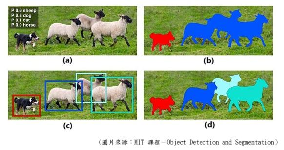
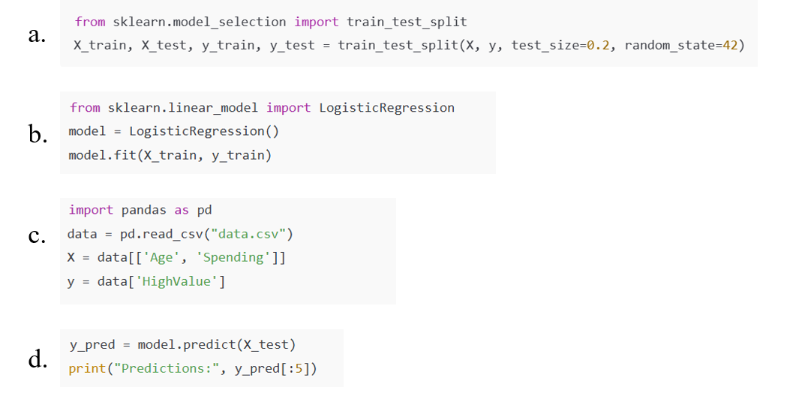

> **iPAS** **AI**
> **應用規劃師<u>中級</u>能力鑑定-考試樣題** style="width:4.06458in;height:1.70486in" />
>
> **(樣題範例非正式考題，僅供參考使用)**
>
> **114.09** **版**

◆**科目一：人工智慧技術應用與規劃**

> 1

> 2

> 3

||
||
||
||
||

> 4

◆**科目二：大數據處理分析與應用**

> 5

> 6

> 7

◆**科目三：機器學習技術與應用**

> 8

> 9

> 10
