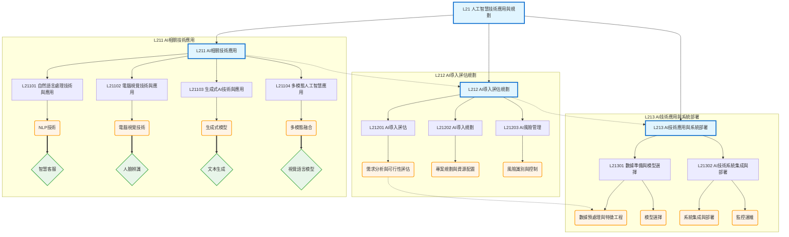

# L21 - 人工智慧技術應用與規劃 - 全局架構圖

## 架構說明

本架構圖展示科目 L21「人工智慧技術應用與規劃」的完整知識體系，涵蓋三大核心章節：
- **L211 AI相關技術應用**：自然語言處理、電腦視覺、生成式AI、多模態AI
- **L212 AI導入評估規劃**：導入評估、導入規劃、風險管理
- **L213 AI技術應用與系統部署**：數據準備、模型選擇、系統集成與部署

## Mermaid 架構圖

## 說明

### 核心概念

- **L211 AI相關技術應用**：涵蓋當前主流的 AI 技術領域，包括 NLP（自然語言處理）、CV（電腦視覺）、生成式 AI 和多模態 AI
- **L212 AI導入評估規劃**：從需求分析到專案規劃，建立完整的 AI 導入方法論
- **L213 AI技術應用與系統部署**：從數據準備到系統上線的完整技術實踐流程

### 關聯說明

- **層級關係（-->）**：科目 -> 章節 -> 主題的樹狀結構
- **依賴關係（-.->）**：L211 技術知識 -> L212 評估規劃 -> L213 系統部署，形成完整的 AI 導入流程
- **應用關係（==>）**：技術理論到實務應用的映射，例如 NLP 技術應用於智慧客服

### 學習路徑建議

1. 先掌握 L211 各種 AI 技術的原理與應用場景
2. 學習 L212 如何評估、規劃和管理 AI 專案
3. 最後實踐 L213 的系統部署與運維技能
