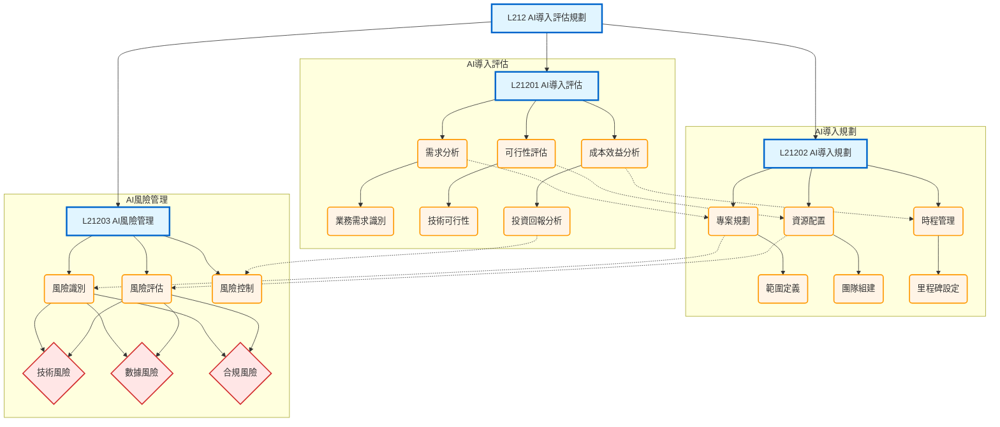

# L212 - AI導入評估規劃

## 架構說明

本章節聚焦於 AI 專案導入的完整方法論，從評估、規劃到風險管理的系統化流程：
- **AI導入評估**：需求分析、可行性評估、成本效益分析
- **AI導入規劃**：專案規劃、資源配置、時程管理
- **AI風險管理**：風險識別、風險評估、風險控制

## Mermaid 架構圖

## 說明

### 核心概念

- **AI導入評估**：在導入 AI 前進行全面評估，包括業務需求、技術可行性和投資回報
- **AI導入規劃**：制定詳細的專案計畫，包括範圍定義、團隊組建、資源配置和時程管理
- **AI風險管理**：識別、評估和控制 AI 專案中的各類風險（技術、數據、合規）

### 關聯說明

- **層級關係（-->）**：章節 -> 主題 -> 方法的樹狀結構
- **依賴關係（-.->）**：完整的專案流程
  - 需求分析 -> 專案規劃
  - 可行性評估 -> 資源配置
  - 成本效益分析 -> 時程管理
  - 專案規劃 -> 風險識別
  - 資源配置 -> 風險評估
  - 投資回報 -> 風險控制
- **風險類別**：技術風險、數據風險、合規風險需要在整個流程中持續監控

### 實施流程建議

1. **評估階段**：
   - 進行業務需求分析，確定 AI 應用場景
   - 評估技術可行性，選擇合適的 AI 技術
   - 分析成本效益，確保投資回報

2. **規劃階段**：
   - 定義專案範圍和目標
   - 組建專業團隊，配置必要資源
   - 設定時程和里程碑

3. **風險管理**：
   - 持續識別可能的風險點
   - 評估風險等級和影響
   - 制定風險控制和應對策略
