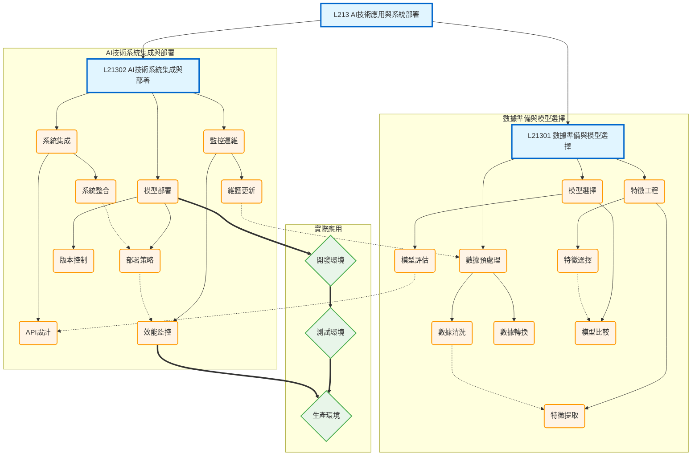

# L213 - AI技術應用與系統部署

## 架構說明

本章節涵蓋 AI 系統從數據準備到部署上線的完整技術實踐流程：
- **數據準備與模型選擇**：數據預處理、特徵工程、模型選擇
- **AI技術系統集成與部署**：系統集成、模型部署、監控運維

## Mermaid 架構圖

## 說明

### 核心概念

- **數據準備**：包括數據清洗（處理缺失值、異常值）和數據轉換（標準化、正規化）
- **特徵工程**：特徵提取和特徵選擇，提升模型效能的關鍵步驟
- **模型選擇**：透過模型比較和評估，選擇最適合的 AI 模型
- **系統集成**：設計 API 介面，將 AI 模型整合到現有系統
- **模型部署**：制定部署策略，實施版本控制，確保穩定上線
- **監控運維**：持續監控模型效能，進行維護和更新

### 關聯說明

- **層級關係（-->）**：章節 -> 主題 -> 技術方法的展開
- **依賴關係（-.->）**：完整的技術流程
  - 數據清洗 -> 特徵提取
  - 特徵選擇 -> 模型比較
  - 模型評估 -> API設計
  - 系統整合 -> 部署策略
  - 部署策略 -> 效能監控
  - 維護更新 -> 數據準備（回饋循環）
- **應用關係（==>）**：從開發環境 -> 測試環境 -> 生產環境的逐步部署

### 實施流程建議

1. **數據準備階段**：
   - 進行數據清洗和轉換
   - 執行特徵工程，提取和選擇有效特徵
   - 比較和評估不同模型

2. **系統集成階段**：
   - 設計 RESTful API 或其他介面
   - 將 AI 模型整合到現有系統架構

3. **部署階段**：
   - 制定部署策略（藍綠部署、金絲雀部署等）
   - 實施版本控制
   - 先部署到開發/測試環境驗證

4. **運維階段**：
   - 監控模型效能指標
   - 定期維護和更新模型
   - 根據反饋優化數據和特徵
