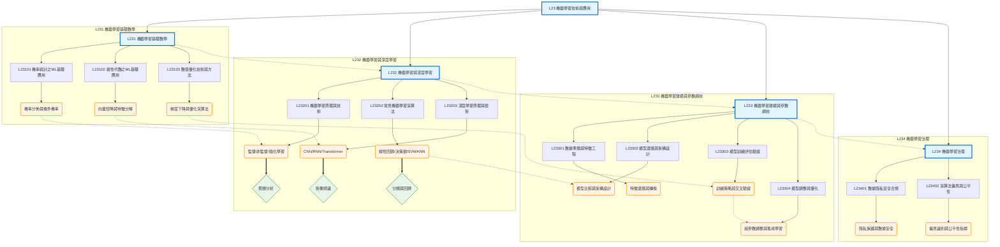

# L23 - 機器學習技術與應用 - 全局架構圖

## 架構說明

本架構圖展示科目 L23「機器學習技術與應用」的完整知識體系，涵蓋四大核心章節：
- **L231 機器學習基礎數學**：機率統計、線性代數、數值優化
- **L232 機器學習與深度學習**：ML原理、常見演算法、深度學習框架
- **L233 機器學習建模與參數調校**：特徵工程、模型選擇、訓練評估、調整優化
- **L234 機器學習治理**：數據隱私安全、演算法偏見與公平性

## Mermaid 架構圖

## 說明

### 核心概念

- **L231 機器學習基礎數學**：提供 ML 所需的數學基礎，包括機率統計、線性代數和數值優化
- **L232 機器學習與深度學習**：涵蓋 ML 原理、常見演算法（線性回歸、決策樹、SVM、KNN）和深度學習（CNN、RNN、Transformer）
- **L233 機器學習建模與參數調校**：完整的建模流程，從數據準備、特徵工程、模型選擇到訓練評估和調整優化
- **L234 機器學習治理**：關注 ML 系統的隱私、安全、公平性等治理議題

### 關聯說明

- **層級關係（-->）**：科目 -> 章節 -> 主題的樹狀結構
- **依賴關係（-.->）**：
  - 數學基礎（L231）支撐 ML/DL 理論（L232）
  - ML/DL 理論支撐實際建模（L233）
  - 建模實踐需要治理規範（L234）
  - 具體依賴：機率統計 -> ML原理、線性代數 -> 深度學習、優化演算法 -> 模型訓練
- **應用關係（==>）**：理論到實務應用的映射

### 學習路徑建議

1. **基礎階段（L231）**：先打好數學基礎，理解機率統計、線性代數和優化演算法
2. **理論階段（L232）**：學習 ML 原理、常見演算法和深度學習框架
3. **實踐階段（L233）**：掌握完整建模流程，從數據準備到模型優化
4. **治理階段（L234）**：理解 ML 系統的責任與倫理議題
