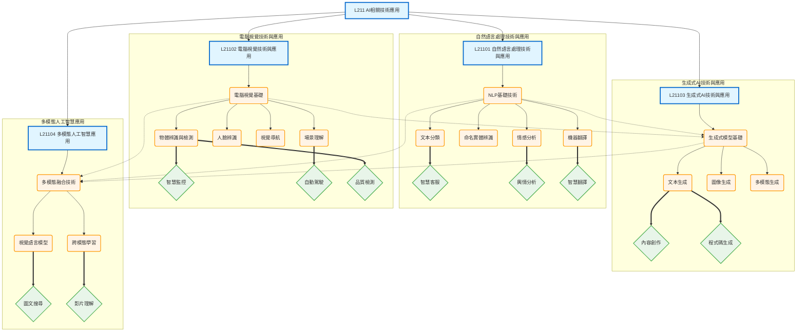

# L211 - AI相關技術應用

## 架構說明

本章節涵蓋當前主流的 AI 技術應用領域，包括：
- **自然語言處理（NLP）**：文本分類、情感分析、命名實體辨識、機器翻譯
- **電腦視覺（CV）**：物體辨識、場景理解、人臉辨識、視覺導航
- **生成式AI**：文本生成、圖像生成、多模態生成
- **多模態AI**：跨模態學習、視覺語言模型

## Mermaid 架構圖

## 說明

### 核心概念

- **自然語言處理（NLP）**：處理和理解人類語言的技術，包含文本分類、情感分析、實體辨識和機器翻譯
- **電腦視覺（CV）**：使機器能夠"看懂"影像的技術，涵蓋物體檢測、場景理解、人臉辨識和視覺導航
- **生成式AI**：能夠創造新內容的 AI 技術，支援文本、圖像和多模態生成
- **多模態AI**：整合多種資訊來源（文字、影像、聲音）的 AI 技術

### 關聯說明

- **層級關係（-->）**：章節 -> 主題 -> 技術的樹狀展開
- **依賴關係（-.->）**：
  - NLP 和 CV 基礎技術支撐生成式 AI
  - NLP、CV 和生成式 AI 共同支撐多模態 AI
  - 技術演進：單模態 -> 生成式 -> 多模態
- **應用關係（==>）**：每種技術對應的實際應用場景

### 技術演進路徑

1. **基礎階段**：掌握 NLP 和 CV 的基本技術與應用
2. **進階階段**：理解生成式 AI 的原理與應用
3. **整合階段**：學習多模態 AI 的跨模態融合技術
