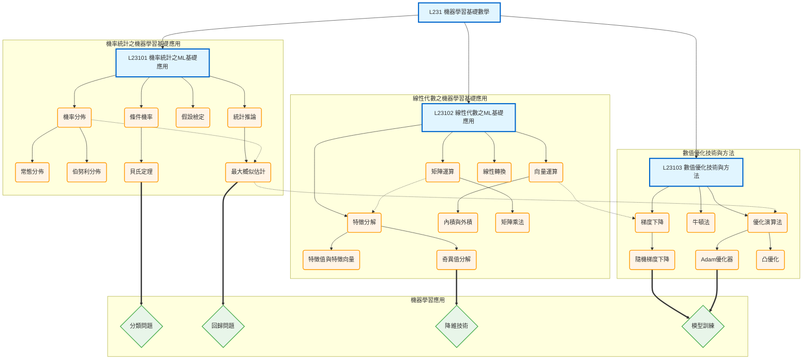

# L231 - 機器學習基礎數學

## 架構說明

本章節建立機器學習所需的數學基礎，涵蓋三大核心數學領域：
- **機率統計**：處理數據不確定性，支撐模型推論
- **線性代數**：支援數據表示和模型運算
- **數值優化**：實現參數學習和模型訓練

## Mermaid 架構圖

## 說明

### 核心概念

- **機率統計**：
  - 機率分佈（常態分佈、伯努利分佈）描述數據的不確定性
  - 條件機率和貝氏定理支撐貝氏學習
  - 假設檢定和統計推論（如 MLE）用於參數估計

- **線性代數**：
  - 向量和矩陣運算是數據表示的基礎
  - 特徵分解（特徵值、特徵向量、SVD）用於降維和數據分析
  - 線性轉換描述數據變換

- **數值優化**：
  - 梯度下降及其變體（SGD）是最常用的優化方法
  - Adam 等優化器提升訓練效率
  - 凸優化理論保證收斂性

### 關聯說明

- **層級關係（-->）**：章節 -> 主題 -> 數學概念的展開
- **依賴關係（-.->）**：
  - 機率分佈 -> 最大概似估計
  - 向量運算 -> 梯度下降
  - 矩陣運算 -> 特徵分解
  - 最大概似估計 -> 優化演算法
- **應用關係（==>）**：
  - 貝氏定理 -> 分類問題
  - 最大概似估計 -> 回歸問題
  - 奇異值分解 -> 降維技術
  - 梯度下降/Adam -> 模型訓練

### 學習路徑建議

1. **機率統計基礎**：理解機率分佈、條件機率和貝氏定理
2. **線性代數基礎**：掌握向量、矩陣運算和特徵分解
3. **優化方法**：學習梯度下降及其變體
4. **整合應用**：將三者結合應用於實際機器學習問題
