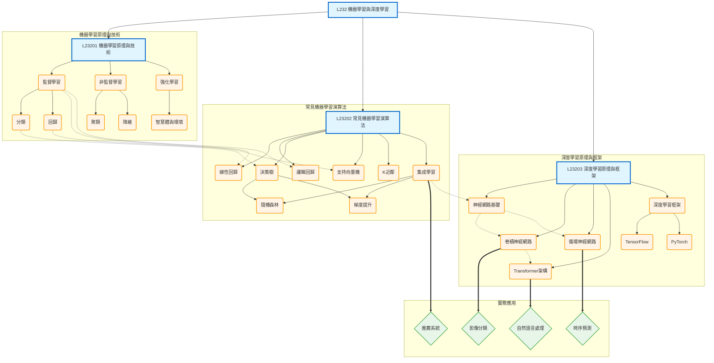

# L232 - 機器學習與深度學習

## 架構說明

本章節涵蓋機器學習與深度學習的核心理論與技術：

- **機器學習原理與技術**：監督學習、非監督學習、強化學習
- **常見機器學習演算法**：線性回歸、邏輯回歸、決策樹、SVM、KNN
- **深度學習原理與框架**：神經網路、CNN、RNN、Transformer、深度學習框架

## Mermaid 架構圖

## 說明

### 核心概念

- **機器學習原理**：

  - **監督學習**：分類和回歸問題，有標註數據
  - **非監督學習**：聚類和降維，無標註數據
  - **強化學習**：智慧體與環境互動，學習最優策略

- **常見演算法**：

  - **線性模型**：線性回歸、邏輯回歸
  - **樹模型**：決策樹、隨機森林、梯度提升
  - **其他**：SVM、KNN、集成學習

- **深度學習**：
  - **基礎**：神經網路的前向傳播和反向傳播
  - **CNN**：用於影像處理
  - **RNN**：用於時序數據
  - **Transformer**：用於 NLP 和多模態任務
  - **框架**：TensorFlow、PyTorch

### 關聯說明

- **層級關係（-->）**：章節 -> 主題 -> 技術的展開
- **依賴關係（-.->）**：
  - 監督學習 -> 線性回歸/邏輯回歸
  - 分類任務 -> 決策樹
  - 回歸任務 -> SVM
  - 集成學習 -> 神經網路（演進關係）
  - 神經網路 -> CNN/RNN（基礎到進階）
  - CNN -> Transformer（架構演進）
- **應用關係（==>）**：
  - CNN -> 影像分類
  - RNN -> 時序預測
  - Transformer -> 自然語言處理
  - 集成學習 -> 推薦系統

### 學習路徑建議

1. **基礎階段**：理解機器學習三大類型（監督、非監督、強化）
2. **演算法階段**：掌握常見演算法的原理和應用場景
3. **深度學習階段**：
   - 先學習神經網路基礎
   - 再學習 CNN（影像）、RNN（時序）
   - 最後學習 Transformer（最新架構）
4. **框架實踐**：選擇 TensorFlow 或 PyTorch 進行實作
