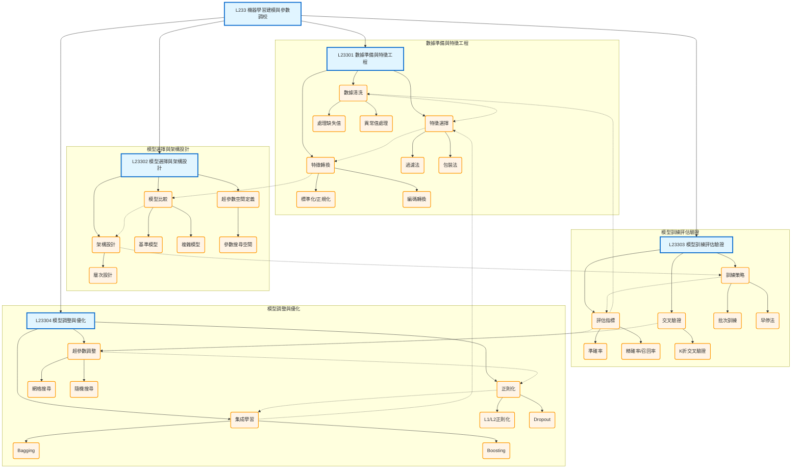

# L233 - 機器學習建模與參數調校

## 架構說明

本章節涵蓋完整的機器學習建模流程，從數據準備到模型優化：
- **數據準備與特徵工程**：數據清洗、特徵選擇、特徵轉換
- **模型選擇與架構設計**：模型比較、架構設計、超參數空間
- **模型訓練、評估與驗證**：訓練策略、評估指標、交叉驗證
- **模型調整與優化**：超參數調整、正則化、集成學習

## Mermaid 架構圖

## 說明

### 核心概念

- **數據準備與特徵工程**：
  - 數據清洗：處理缺失值、異常值
  - 特徵選擇：過濾法、包裝法
  - 特徵轉換：標準化、正規化、編碼

- **模型選擇與架構設計**：
  - 從基準模型開始，逐步嘗試複雜模型
  - 設計模型架構（層次、節點數）
  - 定義超參數搜尋空間

- **模型訓練評估驗證**：
  - 訓練策略：批次訓練、早停法
  - 評估指標：準確率、精確率、召回率、F1-score
  - 交叉驗證：K折交叉驗證避免過擬合

- **模型調整與優化**：
  - 超參數調整：網格搜尋、隨機搜尋、貝氏優化
  - 正則化：L1/L2、Dropout防止過擬合
  - 集成學習：Bagging、Boosting提升效能

### 關聯說明

- **層級關係（-->）**：章節 -> 主題 -> 方法的展開
- **依賴關係（-.->）**：完整的建模流程
  1. 數據清洗 -> 特徵選擇
  2. 特徵選擇 -> 特徵轉換
  3. 特徵轉換 -> 模型比較
  4. 模型比較 -> 架構設計
  5. 架構設計 -> 訓練策略
  6. 訓練策略 -> 評估指標
  7. 評估指標 -> 超參數調整
  8. 交叉驗證 -> 超參數調整
  9. 超參數調整 -> 正則化
  10. 正則化 -> 集成學習
- **迭代優化**：
  - 集成學習 -> 特徵選擇（重新選擇特徵）
  - 評估指標 -> 數據清洗（根據效果調整）

### 實施流程建議

1. **數據準備階段**（L23301）：
   - 清洗數據，處理缺失值和異常值
   - 選擇有效特徵
   - 進行必要的轉換（標準化、編碼）

2. **模型設計階段**（L23302）：
   - 建立基準模型（簡單模型）
   - 嘗試複雜模型
   - 設計架構和定義超參數空間

3. **訓練驗證階段**（L23303）：
   - 使用批次訓練和早停法
   - 計算評估指標
   - 進行交叉驗證

4. **優化階段**（L23304）：
   - 調整超參數（網格/隨機搜尋）
   - 應用正則化技術
   - 嘗試集成學習
   - 根據結果迭代改進
