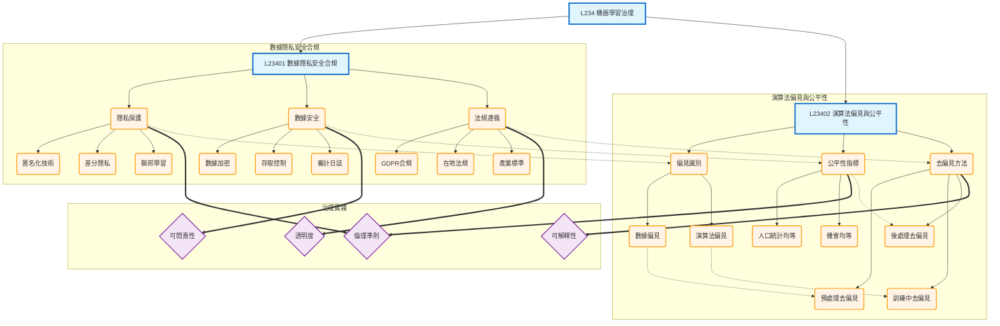

# L234 - 機器學習治理

## 架構說明

本章節聚焦於機器學習系統的責任與倫理議題，確保 AI 系統的可信賴性：
- **數據隱私、安全與合規**：隱私保護、數據安全、法規遵循
- **演算法偏見與公平性**：偏見識別、公平性指標、去偏見方法

## Mermaid 架構圖

## 說明

### 核心概念

- **數據隱私保護**：
  - **匿名化技術**：去識別化處理
  - **差分隱私**：加入雜訊保護個人隱私
  - **聯邦學習**：不集中數據的分散式學習

- **數據安全**：
  - **數據加密**：傳輸和儲存加密
  - **存取控制**：權限管理
  - **審計日誌**：追蹤數據使用

- **法規遵循**：
  - **GDPR**：歐盟一般資料保護規範
  - **在地法規**：各國/地區的數據保護法
  - **產業標準**：特定產業的合規要求

- **偏見識別**：
  - **數據偏見**：訓練數據中的偏見
  - **演算法偏見**：模型設計引入的偏見

- **公平性指標**：
  - **人口統計均等**：各群體預測率相同
  - **機會均等**：各群體真陽性率相同

- **去偏見方法**：
  - **預處理**：調整訓練數據
  - **訓練中**：修改學習演算法
  - **後處理**：調整模型輸出

### 關聯說明

- **層級關係（-->）**：章節 -> 主題 -> 方法的展開
- **依賴關係（-.->）**：
  - 隱私保護 -> 偏見識別（隱私保護可能引入偏見）
  - 數據安全 -> 公平性指標（安全措施影響公平性）
  - 法規遵循 -> 去偏見方法（法規要求去偏見）
  - 數據偏見 -> 預處理去偏見
  - 演算法偏見 -> 訓練中去偏見
  - 公平性指標 -> 後處理去偏見
- **應用關係（==>）**：治理方法到實踐準則
  - 隱私保護 -> 倫理準則
  - 數據安全 -> 可問責性
  - 法規遵循 -> 透明度
  - 公平性指標 -> 倫理準則
  - 去偏見方法 -> 可解釋性

### 實施建議

1. **隱私與安全階段**（L23401）：
   - 實施隱私保護技術（匿名化、差分隱私、聯邦學習）
   - 建立數據安全機制（加密、存取控制、審計）
   - 確保法規遵循（GDPR、在地法規、產業標準）

2. **公平性管理階段**（L23402）：
   - 識別數據和演算法中的偏見
   - 選擇合適的公平性指標
   - 應用去偏見方法（預處理、訓練中、後處理）

3. **持續治理**：
   - 建立倫理準則和審查機制
   - 提升模型透明度和可解釋性
   - 確保可問責性，追蹤模型決策

### 治理框架的重要性

機器學習治理不僅是技術問題，更是組織責任：
- **保護用戶**：隱私、安全、公平對待
- **遵守法規**：避免法律風險
- **建立信任**：提升 AI 系統的可信賴度
- **永續發展**：負責任的 AI 應用
